## [AAA游戏中雪的实现](https://zhuanlan.zhihu.com/p/56927127)

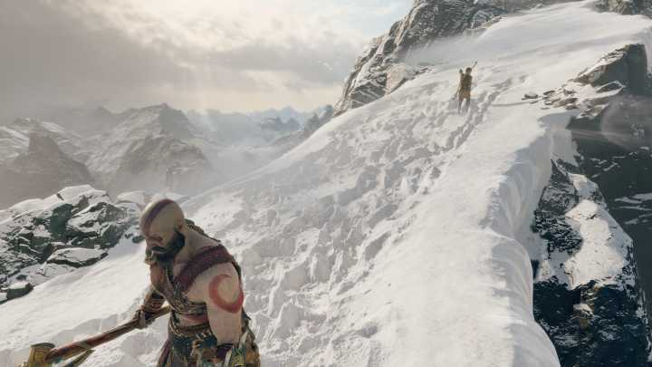

现在越来越多的AAA游戏中都实现了逼真的雪的效果，比如战神4、地平线：黎明时分、荒野大镖客：救赎2、古墓丽影：崛起等都实现了不错的雪地效果。今天我们就来探究一下他们的实现方式。现在主流的实现方式都是通过硬件提供的细分功能来实现的。

作者：fengliancanxue

## Batman: Arkham Origins

这个游戏里面没有地形，只有房顶和城市街道两种，所以它的做法比较取巧，局限性比较大。

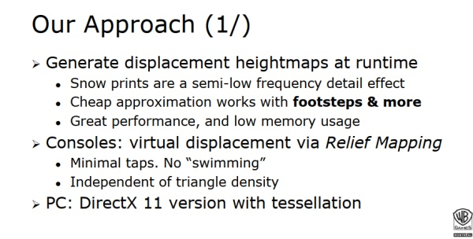

动态生成置换高度图，主机使用视差映射，PC使用细分技术。

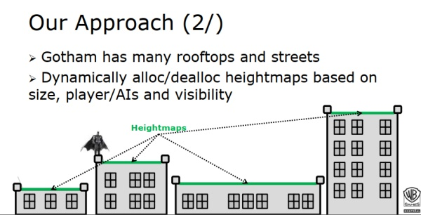

如何生成高度图？

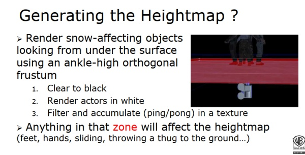

把会影响雪地效果的物体（有一部分在雪的表面下）使用一个踝关节高的正交相机渲染到一个rt里面。

1. 把rt清除成黑色。
2. 渲染物体为白色。
3. 过滤并把渲染结果累积到另外一张纹理里面。

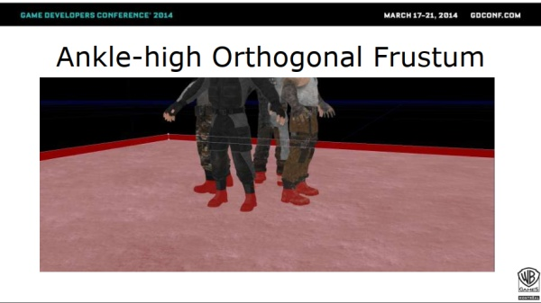

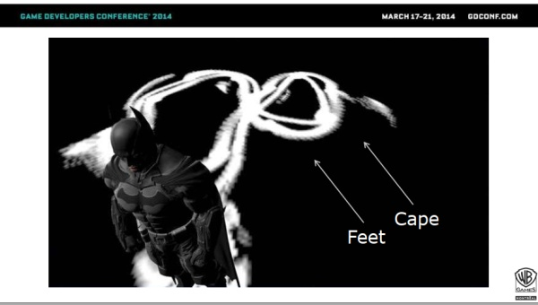

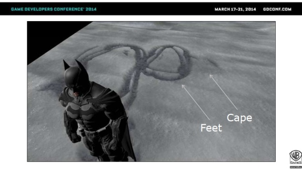

大体思路就是这样的，它的优点就是实现简单，但是也有一些局限就是它只适用于房顶以及平坦的城市街道。当然我们也可以对它进行相应的改进，以支持地形以及有坡度的物体。

## Rise of the Tomb Raider

古墓丽影崛起的做法较通用，可以在地形上产生雪迹。在仔细介绍前先统一下术语。

Snow height:在未应用变形之前的雪的高度（vertex.z）

Deformation points:劳拉的脚以及其它产生变形的3D坐标。

Foot height:一个变形点的垂直高度（point.z）

Trail depression：雪迹被踩下去的比原本雪低的那部分。

Trail elevation:由于被踩下去导致雪隆起的那一部分。

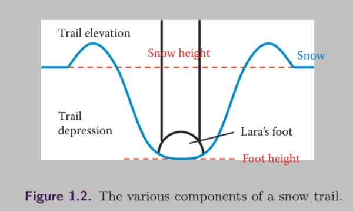

Deformation heightmap:一张32位的纹理，1024x1024个像素，存储变形信息。

Depression depth:abs(snow height – foot height)

Deformation shader:用于生成变形高度图的compute shader。

Fill shader:用于模拟暴风雪后雪迹被慢慢填充的过程。

Snow shder:用于渲染雪的shader,这个shader会应用变形信息。

有了这些术语，我们接下来看看它是怎么做的。

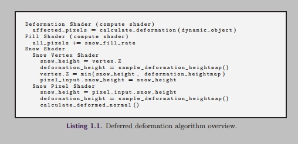

从上图可以看出它主要分为三个步骤：

1. Deformation shader根据dynmaic_object的defomation point来计算影响的像素信息。
2. Fill shader用于修改上面计算好的高度信息，模拟暴风雪将雪迹填平的过程。
3. Snow shader用来应用变形高度图配合细分来实现雪迹效果。

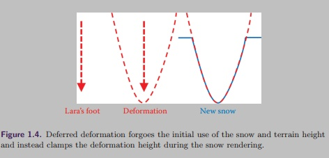

## 生成高度图

观察发现雪迹的形状可以用一个二次曲线近似，通过把一些 动态物体近似成一些点，变形高度可以通过以下公式计算：

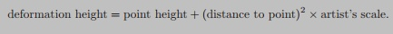

这些变形点累积到deformation heightmap中，deformation shader为每一个点分配一个组，每个组会写入32x32的一个区域内，并且使用一个原子取最小操作，之所以需要这个是因为多个点的影响的区域 可能会重合。

## 生成隆起（elevation）部分

为了计算elevation，foot height也是需要的，主要是用来判断是否能生成雪迹，因为elevation部分是高于雪未经变形的高度的。

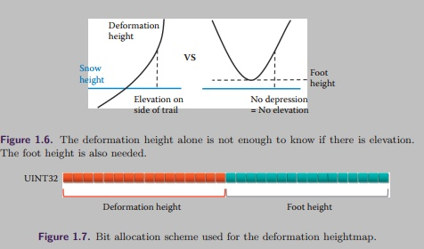

为了计算elevation,我们需要知道elevation distance,它是elevation 开始的地方到当前渲染点的距离。如下图所示：

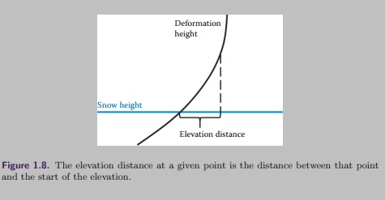

为了计算elevation distance，我们引入了以下几个变量：

- Depression distance:变形的中心到depression结束的距离
- Distance from root:变形的点心到当前渲染点的距离，注意它是depression distance和elevation distnce的和。

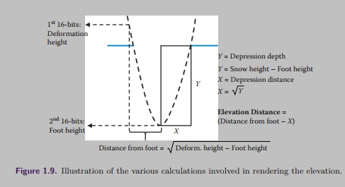

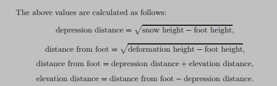

Elevation的值应该跟雪迹的深度成正比，雪迹越深，那么elevation应该越高。计算公式如下所示：

## 纹理选择

为了给雪地一个更随机真实的效果，三张纹理贴图应用到了变形的不同部分，如下所示：

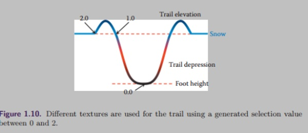

到这里，基本的雪的变形效果的实现已经讲完了，一些优化细节我们这里就不仔细讲解了，感觉兴趣的同步可以参考GPU Pro7上的文章。现在我们来说下它的优缺点，优点是实现也比较简单，支持任意坡度的网格，雪迹的形迹有隆起的部分，以及模拟暴风雪填平雪迹的效果。缺点是它把一个物体当成了一些点的集合，这样就不容易做一个人死后躺在地上类似的效果，当然也不是不能做就是把一个成当成多个点来解决，但是总体效果会差一些。下面我们来看另外一个解决方案。

## Creating Snow Trails in Unreal Engine 4

它的步骤如下所示：

1. 使用一个Scene Capture从下向上拍摄一张地形的深度图。
2. 在上一个拍摄的基础上使用Custom Depth拍摄影响雪迹深度。
3. 根据这两个深度的差值来决定哪些地方会产生雪的轨迹。
4. 把上面的结果放到别个一个rt上用来做累积。
5. 应用累积后的效果到雪的材质产生雪迹的效果。

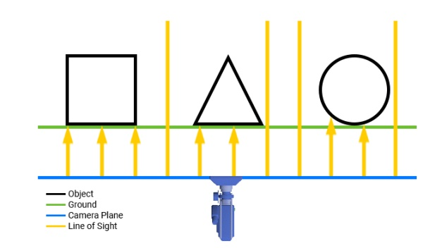从下往上拍摄

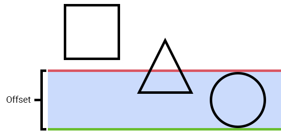根据offset来生成灰度图

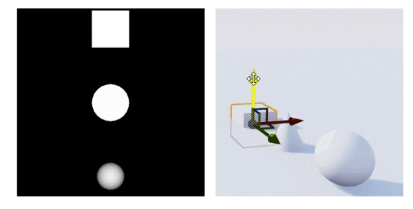

当然这里有一些细节需要处理，我们这里略过不谈，感兴趣的可以看参考文章中的Create snow trails in ue4来了解细节。当然这个只是个demo实现，并不能应用到实际使用中，需要做很多的改动和优化，主要是借鉴下思路。最终效果如下所示：

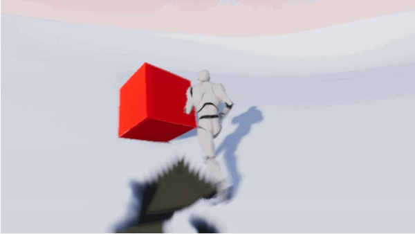

现在我们来说下它的优缺点，优点是实现较简单，适用于所有情况（适用于任意形状的物体），缺点是这个只是个demo，如果要真正使用中还是有很多细节（坑）要去踩。当然也可以在这个算法上做些改进优化以达到更通用的支持，比如在地形之外的任何物体产生雪迹。

## 总结

上面列举了几个生成雪迹的方案，可以看到都用到了变形以及细分来做，如果硬件机能有限也可以把细分用视差映射来替代，通过分析它们的优缺点，读者可以根据自己的游戏类型来选择对应的方案。当然我们也可以在原来的基础上扩展以及修改达到更好的支持，甚至超越市面上的AAA游戏。如果有其它的方案，也欢迎大家在留言中讨论。

## 参考文章

1. [https://www.slideshare.net/colinbb/gdc2014-deformable-snow-rendering-in-batman-arkham-origins](http://link.zhihu.com/?target=https%3A//www.slideshare.net/colinbb/gdc2014-deformable-snow-rendering-in-batman-arkham-origins)
2. [http://tombraider.tumblr.com/post/131825841425/dev-blog-snow-tech-and-houdini-simulations-mike](http://link.zhihu.com/?target=http%3A//tombraider.tumblr.com/post/131825841425/dev-blog-snow-tech-and-houdini-simulations-mike)
3. GPU Pro 7 Deferred Snow Deformation in Rise Of The Tomb Raider
4. [https://www.raywenderlich.com/5760-creating-snow-trails-in-unreal-engine-4](http://link.zhihu.com/?target=https%3A//www.raywenderlich.com/5760-creating-snow-trails-in-unreal-engine-4)
5. [[GamingBolt\] Graphics Analysis - God of War: Arguably The Best Looking Game of All Time](http://link.zhihu.com/?target=https%3A//www.resetera.com/threads/gamingbolt-graphics-analysis-god-of-war-arguably-the-best-looking-game-of-all-time.35748/page-32)