# [渲染优化-从GPU的结构谈起](https://blog.uwa4d.com/archives/USparkle_GPU.html)

这是侑虎科技第554篇文章，感谢作者刘小刘供稿。欢迎转发分享，未经作者授权请勿转载。如果您有任何独到的见解或者发现也欢迎联系我们，一起探讨。（QQ群：793972859）

作者主页：https://www.zhihu.com/people/liu-fei-69，作者也是[U Sparkle活动](https://www.uwa4d.com/#activity-us)参与者，UWA欢迎更多开发朋友加入[U Sparkle开发者计划](https://www.uwa4d.com/#activity-us-complete)，这个舞台有你更精彩！

------

做渲染的时候我们都会遵循一些通用优化规则，比如：要尽量减少DrawCall、要尽量降低渲染的面数、要避免在Shader中使用循环判断、要减少采样的次数等等。要合并批次渲染，看起来的原则就是越少越好，我们也都知道GPU拥有强大的并行能力，这个所谓的并行是什么级别的并行？是三角形和三角形之间的并行吗？我也曾经在工程中碰到一个疑惑，在渲染面积相同的情况下，2个三角形快还是64个三角形快？会不会有可能64个三角形参与运算的GPU核心多，以至于会比2个三角形更快？

带着这些疑问，我们尝试了解GPU的结构，看看能不能找到答案，也会利用OpenGL的几个接口来验证我们的判断，GPU的硬件结构每家厂商的每代产品都是不一样的，但是大致的结构应该都是类似的。

 在渲染面积相同的情况下，左图还是右图渲染更快？

## 1、GPU渲染架构图

NV给出的这个图几乎涵盖了渲染的关键过程。 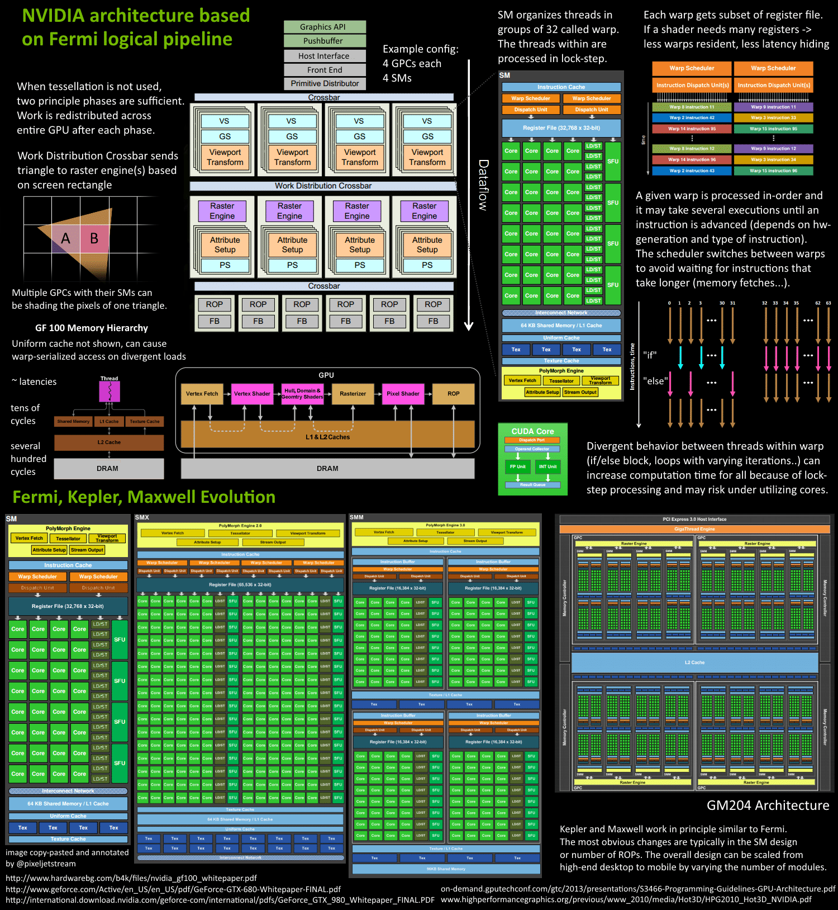  

## 2、物理架构

 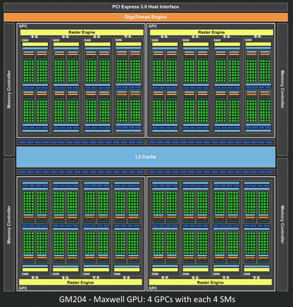 

从Fermi开始Nvdia使用类似的原理架构，使用一个Giga Thread  Engine来管理所有正在进行的工作，GPU被划分成多个GPCs（Graphics Processing  Cluster），每个GPC拥有多个SM和一个光栅化引擎（Raster  Engine），它们其中有很多的连接，最显著的是Crossbar，它可以连接GPCs和其它功能性模块，例如ROP或者其它子系统。 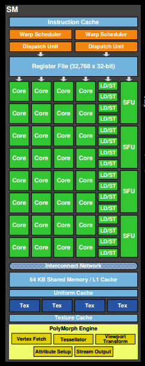 

着色器程序的执行都是在SM上完成的。如上图所示，SM包含32个运算核心，16个LD/ST（load/store）模块来加载和存储数据，4个SFU（Special  Function Units）执行特殊数学运算（sin、cos、log等），128KB寄存器，64KB  L1缓存，全局内存缓存，Tex纹理读取单元，TextureCache纹理缓存，polyMorph  Engine多边形引擎负责属性装配（attribute  Setup）、顶点拉取（VertexFetch）、曲面细分、栅格化（这个模块可以理解专门处理顶点相关的东西），最后就是Warp  Schedulers这个模块负责warp调度，一个warp由32个线程组成，warp调度器的指令通过Dispatch  Units送到Core执行。  

## **3、逻辑管线**

 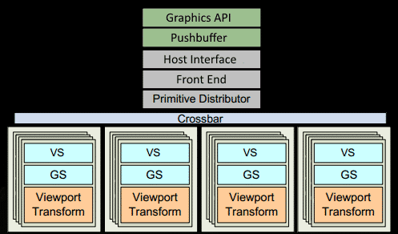 

**3.1、**程序通过图形API（DX\GL\WEBGL）发出DrawCall指令，指令会被推送到驱动程序，驱动会检查指令的合法性，然后会把指令放到GPU可以读取的pushbuffer中。

 **3.2、**经过一段时间或者显式调用flush指令后，驱动程序把pushbuffer的内容发送给GPU，GPU通过主机接口（Host Interface）接受这些命令，并通过Front End处理这些命令。 

**3.3、**在图元分配器（Primitive Distributor）中开始工作分配，处理indexbuffer中的顶点产生三角形分成批次（batches），然后发送给多个GPCs，这一步的理解就是提交上来n个三角形，分配个这几个GPC同时来处理。

 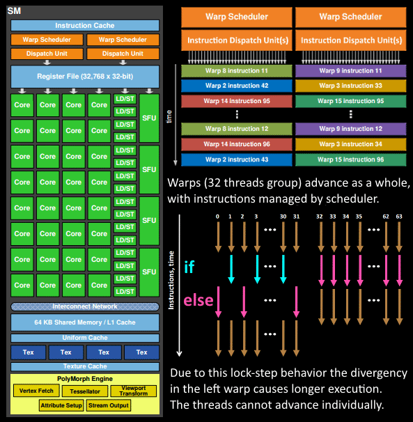 

**3.4、**在GPC中，每个SM中的Poly Morph Engine负责通过三角形索引（triangle indices）取出三角形的数据（vertex data）[图中的Vertex Fetch模块]。 

**3.5、**在获取数据之后，在SM中以32个线程为一组的线程束（warp）来调度，来开始处理顶点数据。warp是典型的单指令多线程（SIMT，SIMD单指令多数据的升级）的实现，也就是32个线程同时执行的指令是一模一样的，只是线程数据不一样，这样的好处就是一个warp只需要一个套逻辑对指令进行解码和执行就可以了，芯片可以做的更小更快，之所以可以这么做，是由于GPU需要处理的任务是天然并行的。

 **3.6、**SM的warp调度器会按照顺序分发指令给整个warp，单个warp中的线程会锁步（lock-step）执行各自的指令。如果线程碰到不激活执行的情况也会被遮掩（be  masked  out），被遮掩的原因有很多，例如当前的指令是if（true）的分支，但是当前线程的数据的条件是false，或者比如一个循环被终止了但是别的还在走，因此在Shader中的分支会显著增加时间消耗，在一个warp中的分支除非32个线程都走到if或者else里面，否则相当于所有的分支都走了一遍，线程不能独立执行指令而是以warp为单位，而这些warp相互之间是独立的。 

**3.7、**warp中的指令可以被一次完成，也可能经过多次调度，例如SM中的加载纹理、数据存取明显少于数学运算。

**3.8、**由于某些指令比其它指令需要更长的时间才能完成，特别是内存加载，warp调度器可能会简单地切换到另一个没有内存等待的warp，这是GPU如何克服内存读取延迟的关键，只是简单地切换活动线程组。为了使这种切换非常快，调度器管理的所有warp在寄存器文件中都有自己的寄存器。这里就会有个矛盾产生，Shader需要越多的寄存器，就会给warp留下越少的空间，就会产生越少的warp，这时候在碰到内存延迟的时候就只是等待，而没有可以运行的warp可以切换。

 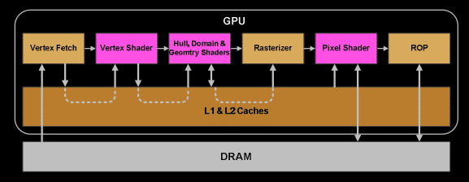 

**3.9、**一旦warp完成了vertex-shader的所有指令，运算结果会被Viewport Transform模块处理，三角形会被裁剪然后准备栅格化，GPU会使用L1和L2缓存来进行vertex-shader和pixel-shader的数据通信。 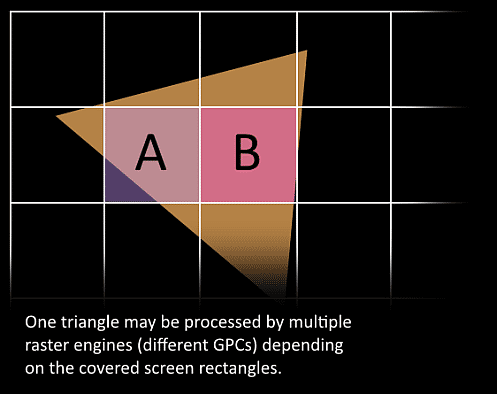 

**3.10、**接下来这些三角形将被分割，再分配给多个GPC，三角形的范围决定着它将被分配到哪个光栅引擎（raster  engines），每个raster  engines覆盖了多个屏幕上的tile，这等于把三角形的渲染分配到多个tile上面，也就是像素阶段就把按三角形划分变成了按显示的像素划分了。 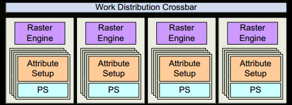 

**3.11、**SM上的Attribute Setup保证了从vertex-shader来的数据经过插值后是pixel-shade是可读的。

 **3.12、**GPC上的光栅引擎（raster engines）在它接收到的三角形上工作，来负责这些这些三角形的像素信息的生成（同时会处理背面剔除和early z剔除）。

 **3.13、**32个像素线程将被分成一组，或者说8个2X2的像素块，这是在像素着色器上面的最小工作单元，在这个像素线程内，如果没有被三角形覆盖就会被遮掩，SM中的warp调度器会管理像素着色器的任务。 

**

3.14、**接下来的阶段就和vertex-shader中的逻辑步骤完全一样，但是变成了在像素着色器线程中执行。 由于不耗费任何性能可以获取一个像素内的值，导致锁步执行（SIMD）非常便利，所有的线程可以保证所有的指令可以在同一点。 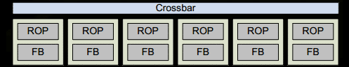 

**3.15、**最后一步，现在像素着色器已经完成了颜色的计算还有深度值的计算，在这个点上，我们必须考虑三角形的原始API顺序，然后才将数据移交给渲染输入单元ROP（Render  Output  Unit），一个ROP内部有很多ROP单元，在ROP单元中处理深度测试，和framebuffer的混合，深度和颜色的设置必须是原子操作，否则两个不同的三角形在同一个像素点就会有冲突和错误。  

4、内存速度**

 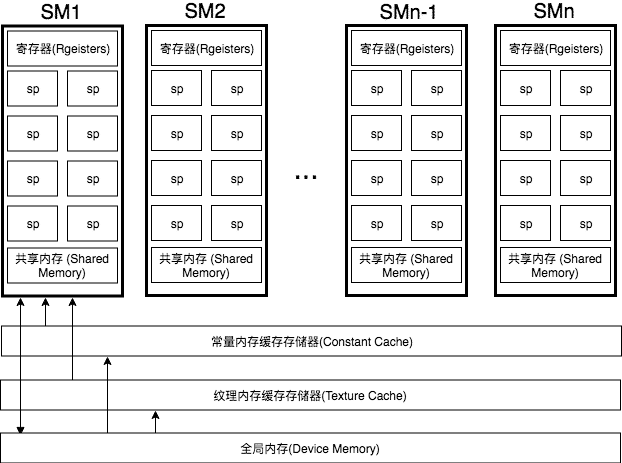 

GPU的内存分为好几个类型，不同类型的速度不一样。  

这里看到在Shader中直接使用的寄存器内存还是比较快的，纹理和常量内存的还有全局内存的速度实在是慢太多。  

**5、试验验证** 

接下来用我自己的显卡，这个显卡是GeForce GT  755M，只有2个SM，每个SM最大64个warp，每个warp中最多32个thread，配合NV的OpenGL扩展，通过gl_ThreadInWarpNV，gl_WarpIDNV，gl_SMIDNV这几个指令我们可以验证一下上面的流程，同时可以确定一些上面没有提到的东西。 

**5.1  顶点处理**

 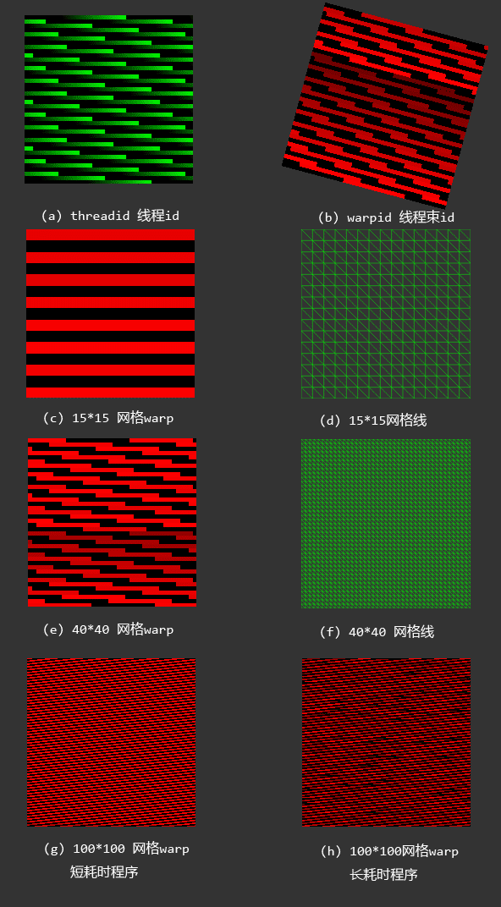  

（a）图是按ThreadID（color.g=gl_ThreadInWarpNV/gl_WarpSizeNV）来输出的，三角网格是100*100，可以看到一个线程对应一个顶点，一个warp对应一组顶点。 *

*（b）图是按WarpID(color.r=gl_WarpIDNV/gl_WarpsPerSMNV)来输出的，三角网格是。100*100，网格倾斜了15度。黑色的是另外一个SM的。 

（c）图是WarpID，三角网格是15*15的。统计后的warp数是8。 *

*（d）图可以看到对应的三角网格线。 

（e）图是WarpID，三角网格是40*40的。统计后的warp数是25。 *

*（f）图可以看到对应的三角网格线。

 （g）图是WarpID，三角网格是100*100的。统计后的warp数是23。顶点着色器是比较简单的。 *

*（h）图是WarpID，三角网格是100*100的。统计后的warp数是58。作为（g）的对比图，顶点着色器直接做了一个100万次的循环，目的是拉长顶点着色器的完成时间。  

通过这些图的对比我们可以得出结论： 

5.1.1、对比（a）和（b），顶点着色器是以一个顶点为一个线程来处理的，32线程为一个warp；

 5.1.2、对比（c）和（d）其中的warp数，可以看到顶点越多warp数就越多；

 5.1.3、对比（g）和（h）其中的warp数，系统调用的warp会根据顶点数和顶点着色器的任务来分配，越少的顶点warp越少，而且每个着色器上的warp数不会按照最大数来分配，毕竟warp数是软件概念，当单个warp时间过长时，系统为了隐藏延迟会调用更多的warp来参与计算；

 5.1.4、顶点着色器最终的运行效率会取决于顶点数和复杂程度。但是在真实的环境中顶点数不会是真正的瓶颈，20个顶点和200个顶点差别不会很大。 

**5.2  像素处理**

 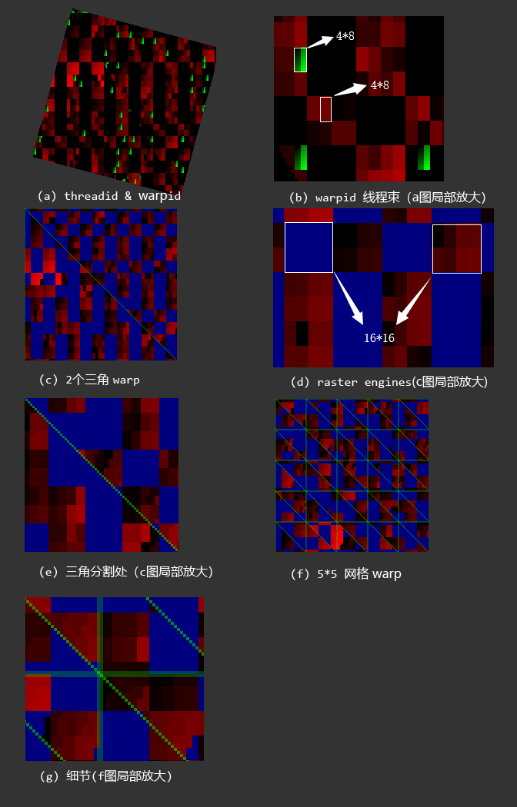 

这个图和顶点的处理的类似，只是换成像素阶段，另外另外一个SM换成蓝色方便观察。  

（a）图直接显示出来warp和thread，thread是绿色的块，thread是warp等于0的时候才显示； 

（b）图是（a）图的局部放大，一个线程块是4*8个像素； *

*（c）图是两个三角的warp，蓝色的是另外一个SM的，可以看到按块来着色，其中一个块就是一个光栅化引擎； （d) 、（e）图都是（c）图的放大； 

（f）图是5*5的网格； *

*（g）图是（f）图的放大细节。  

根据上面的我们可以得出一些结论： 5.2.1、观察（a），可以看到这个三角形是倾斜的，可以到里面的分块并没有倾斜而是始终平行于屏幕，所以光栅化会无视原来三角的位置，只会处理三角覆盖屏幕的位置，这个和顶点程序是完全不一样的；
 5.2.2、观察（b），可以看到一个像素就是一个thread，像素着色依旧是按照warp来调度的；
 5.2.3、观察（d），每个光栅化引擎（raster engines）都是16*16的像素块，也就是每个包含4*4一个warp；
 5.2.4、对比（d）、（e）、（g），在三角分割出，可以看到如果一个光栅化引擎恰好覆盖两个三角，那么两个三角会有可能被两个SM覆盖，这里可以确定这个光栅化引擎包含两个SM，一个光栅化引擎在处理覆盖的像素的时候，如果覆盖的区域包含多个三角，每个三角都有可能被不同的SM处理，但是不同的三角分配的warp肯定是不同的，同时在（g）图也可以看到即使一个光栅化引擎只包含一个三角，可有可能分配给不同的SM里面的不同warp处理；
 5.2.5、光栅化块是按照顺序一个一个在进行。 

 **6、结论** 到此为止我们就可以得出一些结论：

 **6.1、**顶点着色器和像素着色都是在同一个单元中执行的（在原来的架构中VS和PS的确是分开的，后来NV把这个统一了）VS是按照三角形来并行处理的，PS是按照像素来并行处理的。
 **6.2、**VS和PS中的数据是通过L1和L2缓存传递的。
 6.3、warp和thread都是逻辑上的概念，SM和SP都是物理上的概念。线程数≠流处理器数。

### 6.4

上述第12步里面z-cull是early z  optimization而不是常说的z-test，z-test是要在ROP的时候发生，但是这个z-cull要在alpha test、user  clip、multi-sampling、texkill都是关闭的情况下才能生效，任何导致需要混合后面颜色的操作都会导致z-cull失败。 同时也能回答开头中提到的问题了。  

**为什么DrawCall越少越好？**因为即使渲染一个三角形，在GPU中也要走系列复杂的流程，这系列流程带来的延迟远超过计算一个三角本身，只有同时并行多处理才能发挥GPU的强大并行能力，这也是我们优化的时候要合并渲染的原因，越合并越能最大限度的利用GPU。总之一句话我们拿到的GPU是冲锋枪，冲锋枪最大的优势是连发，不能老用点射把冲锋枪当步枪用。 

**为什么要降低渲染面数？**面数越少VS计算使用的线程就越少，顶点计算就越快。 

**为什么要避免在Shader中使用if else？**因为按照SIMD的执行方式，if else可能会完全不生效，导致两个分支都要走一遍。同样循环中的break也会导致这样的问题。 

**为什么要降低采样次数？**因为纹理的读取速度实在是太慢了，读取跟不上运算会导致极大的延迟。

 **一个和多个三角形哪个更快？**当然是一个更快了，在覆盖面积相等的情况下顶点多少越好。  另外还有一个，我想提一下涉及CPU和GPU的交互，CPU和GPU是类似服务端-客户端的模式，它们之间的交互成本也是很高的，GPU的调用指令也是越少越好，最简单的一个就是类似gl里面uniform的设置，uniform设置的数据量都是比较小的，这会导致指令调用成本大于数据传送成本，如果Shader中大量的uniform   vec3类似的东西还是合并成数组一次送入GPU（当然这会降低程序可读性，需要权衡）。另外一个任何从GPU回读的操作都是相当耗时的，即时是类似gl中获得句柄的操作，比如getUniformLocation，要避免在刷帧中使用。 

##  **7、TileBase**

 说完桌面版的GPU架构，顺带说下移动端的架构，移动端的GPU架构和桌面版本是完全不同的，桌面版的ROP单元是负责把结果写入framebuffer，处理器跟显存是在一块的导致这块几乎不太有什么耗时。但是到了移动端，显存是在主存上面的，它离显卡的核心太远了，导致这块的带宽很低，即时现在手机的显卡越来越好（但是屏幕分辨率也越来越大）带宽依旧是个瓶颈，主存的速度又太慢，导致这个操作又慢又费电，至少桌面端是不用考虑费电的问题的。基于此移动端都是用了tile-based架构。

###  **7.1  主要区别**

 前面我们分析了NVDIA显卡的渲染的详细过程，这个我们只需要说区别就好了，桌面版都是VS-PS直接进行的，但是Tile-based把这个阶段分开了，在一帧中包含数百次DrawCall，注意这里是一帧的所有DrawCall，先全部进行VS，然后在按照tile的顺序PS，桌面是一个DrawCall的VS然后PS，桌面版也是用tile的模式来PS的，只不过桌面的PS都是一次DrawCall，但是移动端是顺序VS然后按照tile打包PS。 

### **7.2  为什么会快**

 举个例子，比如我们有两次DrawCall，每个DrawCall包含一个三角形，这两个三角形都覆盖全部屏幕了。 在桌面版中，第一次DarwCall对第一个三角形进行VS-PS，这时候要对framebuffer操作一次，第二个DrawCall还要执行同样的处理就需要对framebuffer再操作一次（至少进行一次读的操作，如果第二个三角不覆盖第一个三角就少一次写的操作）。 在Tile-base中，两次DrawCall，执行两次VS，不操作framebuffer，然后在每个tile上，处理两个三角形，处理完这两个三角，也就确定最终的像素颜色了，直接吧这个颜色写入framebuffer就可以了，等于是framebuffer只有一次的写入操作，这里面还有另外的优化。 上面的设计是为了解决主要的带宽的问题，同时会产生很多其它的优化。 在桌面版，每个三角都要进行PS，但是在Tile-base中就可以提前进行z-test，有可能会使PS只进行一次就够了（GPU会对此优化，想办法剔除隐藏的面），颜色混合就快多了，不需要跟framebuffer有关系，都是在tile上进行的。还有个问题就是VS-PS不是在一帧中进行的，这一帧的PS是使用上一帧的VS。 这篇文章从架构的角度解释了常用优化手段的背后原因，如果哪个内容有误，欢迎大家指正。