 随笔 - 39   文章 - 0   评论 - 155 

#  			[【原】实时渲染中常用的几种Rendering Path](https://www.cnblogs.com/polobymulberry/p/5126892.html) 		


**阅读目录**

- [1. rendering path的技术基础](https://www.cnblogs.com/polobymulberry/p/5126892.html#_label0)
- [2. 几种常用的Rendering Path](https://www.cnblogs.com/polobymulberry/p/5126892.html#_label1)
- [3. 总结](https://www.cnblogs.com/polobymulberry/p/5126892.html#_label2)
- [参考文献](https://www.cnblogs.com/polobymulberry/p/5126892.html#_label3)

# 【原】实时渲染中常用的几种Rendering Path

**本文转载请注明出处 ——** [**polobymulberry-博客园**](http://www.cnblogs.com/polobymulberry/p/5126892.html)

本文为我的图形学大作业的论文部分，介绍了一些Rendering Path，比较简单，如有错误，请大家指正。原文pdf：[请点击此处下载](http://files.cnblogs.com/files/polobymulberry/%E5%AE%9E%E6%97%B6%E6%B8%B2%E6%9F%93%E4%B8%AD%E5%B8%B8%E7%94%A8%E7%9A%84%E5%87%A0%E7%A7%8DRendering_Path.pdf)。

[回到顶部](https://www.cnblogs.com/polobymulberry/p/5126892.html#_labelTop)

## 1. rendering path的技术基础

------

在介绍各种光照渲染方式之前，首先必须介绍一下现代的图形渲染管线。这是下面提到的几种Rendering Path的技术基础。

[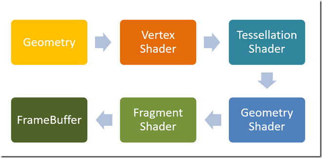](http://images2015.cnblogs.com/blog/715314/201601/715314-20160113130552710-1081373847.png)

目前主流的游戏和图形渲染引擎，包括底层的API（如DirectX和OpenGL）都开始支持现代的图形渲染管线。现代的渲染管线也称为可编程管线（Programmable   Pipeline），简单点说就是将以前固定管线写死的部分（比如顶点的处理，像素颜色的处理等等）变成在GPU上可以进行用户自定义编程的部分，好处就是用户可以自由发挥的空间增大，缺点就是必须用户自己实现很多功能。

下面简单介绍下可编程管线的流程。以OpenGL绘制一个三角形举例。首先用户指定三个顶点传给**Vertex Shader**。然后用户可以选择是否进行**Tessellation Shader**（曲面细分可能会用到）和**Geometry Shader**（可以在GPU上增删几何信息）。紧接着进行光栅化，再将光栅化后的结果传给**Fragment Shader**进行pixel级别的处理。最后将处理的像素传给FrameBuffer并显示到屏幕上。

[回到顶部](https://www.cnblogs.com/polobymulberry/p/5126892.html#_labelTop)

## 2. 几种常用的Rendering Path

------

**Rendering Path****其实指的就是渲染场景中光照的方式**。由于场景中的光源可能很多，甚至是动态的光源。所以怎么在速度和效果上达到一个最好的结果确实很困难。以当今的显卡发展为契机，人们才衍生出了这么多的Rendering Path来处理各种光照。

### 2.1 Forward Rendering

[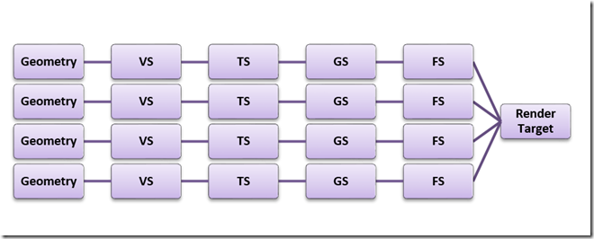](http://images2015.cnblogs.com/blog/715314/201601/715314-20160113130553460-1028097138.png)

Forward Rendering是绝大数引擎都含有的一种渲染方式。要使用Forward Rendering，一般在Vertex  Shader或Fragment Shader阶段对每个顶点或每个像素进行光照计算，并且是对每个光源进行计算产生最终结果。下面是Forward  Rendering的核心伪代码[1]。

```
For each light:
    For each object affected by the light:
        framebuffer += object * light
```

比如在Unity3D 4.x引擎中，对于下图中的圆圈（表示一个Geometry），进行Forward Rendering处理。

[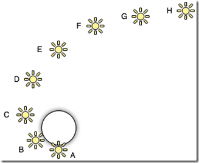](http://images2015.cnblogs.com/blog/715314/201601/715314-20160113130554350-1442254611.png)

将得到下面的处理结果

[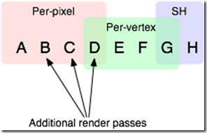](http://images2015.cnblogs.com/blog/715314/201601/715314-20160113130555335-907409018.png)

也就是说，对于ABCD四个光源我们在Fragment Shader中我们对每个pixel处理光照，对于DEFG光源我们在Vertex Shader中对每个vertex处理光照，而对于GH光源，我们采用球调和（SH）函数进行处理。

**Forward Rendering****优缺点**

很明显，对于Forward Rendering，光源数量对计算复杂度影响巨大，所以比较适合户外这种光源较少的场景（一般只有太阳光）。

但是对于多光源，我们使用Forward Rendering的效率会极其低下。因为如果在vertex shader中计算光照，其复杂度将是 ，而如果在fragment shader中计算光照，其复杂度为 。可见光源数目和复杂度是成线性增长的。

对此，我们需要进行必要的优化。比如

- 1.多在vertex shader中进行光照处理，因为有一个几何体有10000个顶点，那么对于n个光源，至少要在vertex  shader中计算10000n次。而对于在fragment  shader中进行处理，这种消耗会更多，因为对于一个普通的1024x768屏幕，将近有8百万的像素要处理。所以如果顶点数小于像素个数的话，尽量在vertex  shader中进行光照。
- 2.如果要在fragment  shader中处理光照，我们大可不必对每个光源进行计算时，把所有像素都对该光源进行处理一次。因为每个光源都有其自己的作用区域。比如点光源的作用区域是一个球体，而平行光的作用区域就是整个空间了。对于不在此光照作用区域的像素就不进行处理。但是这样做的话，CPU端的负担将加重，因为要计算作用区域。
- 3.对于某个几何体，光源对其作用的程度是不同，所以有些作用程度特别小的光源可以不进行考虑。典型的例子就是Unity中只考虑重要程度最大的4个光源。

### 2.2 Deferred Rendering

 

[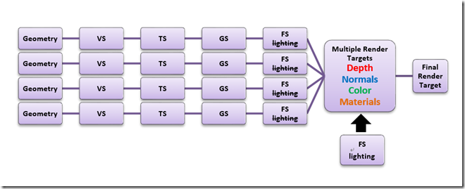](http://images2015.cnblogs.com/blog/715314/201601/715314-20160113130556725-1682521836.png)

Deferred  Rendering（延迟渲染）顾名思义，就是将光照处理这一步骤延迟一段时间再处理。具体做法就是将光照处理这一步放在已经三维物体生成二维图片之后进行处理。也就是说将物空间的光照处理放到了像空间进行处理。要做到这一步，需要一个重要的辅助工具——G-Buffer。G-Buffer主要是用来存储每个像素对应的Position，Normal，Diffuse  Color和其他Material parameters。根据这些信息，我们就可以在像空间中对每个像素进行光照处理[3]。下面是Deferred  Rendering的核心伪代码。

```
For each object: 
    Render to multiple targets 
For each light: 
    Apply light as a 2D postprocess
```

下面简单举个例子[1]。

首先我们用存储各种信息的纹理图。比如下面这张Depth Buffer，主要是用来确定该像素距离视点的远近的。

[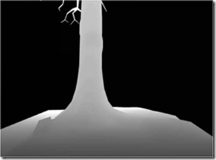](http://images2015.cnblogs.com/blog/715314/201601/715314-20160113130558132-1064492329.png)

图. Depth Buffer

根据反射光的密度/强度分度图来计算反射效果。

[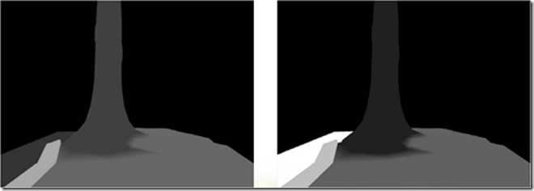](http://images2015.cnblogs.com/blog/715314/201601/715314-20160113130559225-685801952.png)

图.Specular Intensity/Power

下图表示法向数据，这个很关键。进行光照计算最重要的一组数据。

[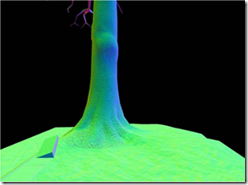](http://images2015.cnblogs.com/blog/715314/201601/715314-20160113130600022-265072463.png)

图.Normal Buffer

下图使用了Diffuse Color Buffer。

[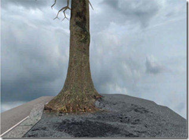](http://images2015.cnblogs.com/blog/715314/201601/715314-20160113130601428-1781899441.png)

图.Diffuse Color Buffer

这是使用Deferred Rendering最终的结果。

[](http://images2015.cnblogs.com/blog/715314/201601/715314-20160113130602553-1588686058.png)

图.Deferred Lighting Results

Deferred  Rendering的最大的优势就是将光源的数目和场景中物体的数目在复杂度层面上完全分开。也就是说场景中不管是一个三角形还是一百万个三角形，最后的复杂度不会随光源数目变化而产生巨大变化。从上面的伪代码可以看出deferred  rendering的复杂度为 。

但是Deferred Rendering局限性也是显而易见。比如我在G-Buffer存储以下数据

| **Depth**                     | R32F        |
| ----------------------------- | ----------- |
| **Normal + scattering**       | A2R10G10B10 |
| **Diffuse color + emissive**  | A8R8G8B8    |
| **Other material parameters** | A8R8G8B8    |

这样的话，对于一个普通的1024x768的屏幕分辨率。总共得使用1024x768x128bit=20MB，对于目前的动则上GB的显卡内存，可能不算什么。但是使用G-Buffer耗费的显存还是很多的。一方面，对于低端显卡，这么大的显卡内存确实很耗费资源。另一方面，如果要渲染更酷的特效，使用的G-Buffer大小将增加，并且其增加的幅度也是很可观的。顺带说一句，存取G-Buffer耗费的带宽也是一个不可忽视的缺陷。

对于Deferred Rendering的优化也是一个很有挑战的问题。**下面简单介绍几种降低****Deferred Rendering****存取带宽的方式**。最简单也是最容易想到的就是将存取的G-Buffer数据结构最小化，这也就衍生出了light pre-pass方法。另一种方式是将多个光照组成一组，然后一起处理，这种方法衍生了Tile-based deferred Rendering。

#### 2.2.1 Light Pre-Pass

Light Pre-Pass最早是由Wolfgang Engel在他的博客[2]中提到的。具体的做法是

- **(1)**只在G-Buffer中存储Z值和Normal值。对比Deferred Render，少了Diffuse Color， Specular Color以及对应位置的材质索引值。
- **(2)**在FS阶段利用上面的G-Buffer计算出所必须的light  properties，比如Normal*LightDir,LightColor,Specular等light  properties。将这些计算出的光照进行alpha-blend并存入LightBuffer（就是用来存储light  properties的buffer）。
- **(3)**最后将结果送到forward rendering渲染方式计算最后的光照效果。

相对于传统的Deferred Render，使用Light  Pre-Pass可以对每个不同的几何体使用不同的shader进行渲染，所以每个物体的material  properties将有更多变化。这里我们可以看出相对于传统的Deferred  Render，它的第二步（见伪代码）是遍历每个光源，这样就增加了光源设置的灵活性，而Light Pre-Pass第三步使用的其实是forward  rendering，所以可以对每个mesh设置其材质，这两者是相辅相成的，有利有弊。另一个Light  Pre-Pass的优点是在使用MSAA上很有利。虽然并不是100%使用上了MSAA（除非使用DX10/11的特性），但是由于使用了Z值和Normal值，就可以很容易找到边缘，并进行采样。

下面这两张图，左边是使用传统Deferred Render绘制的，右边是使用Light Pre-Pass绘制的。这两张图在效果上不应该有太大区别。

| [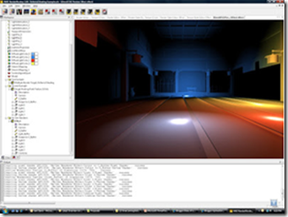](http://images2015.cnblogs.com/blog/715314/201601/715314-20160113130603819-735635840.png) | [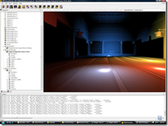](http://images2015.cnblogs.com/blog/715314/201601/715314-20160113130604882-366067682.png) |
| ------------------------------------------------------------ | ------------------------------------------------------------ |
|                                                              |                                                              |

#### 2.2.2 Tile-Based Deferred Rendering

TBDR主要思想就是将屏幕分成一个个小块tile。然后根据这些Depth求得每个tile的bounding  box。对每个tile的bounding  box和light进行求交，这样就得到了对该tile有作用的light的序列。最后根据得到的序列计算所在tile的光照效果。[4][5]

对比Deferred Render，之前是对每个光源求取其作用区域light  volume，然后决定其作用的的pixel，也就是说每个光源要求取一次。而使用TBDR，只要遍历每个pixel，让其所属tile与光线求交，来计算作用其上的light，并利用G-Buffer进行Shading。一方面这样做减少了所需考虑的光源个数，另一方面与传统的Deferred  Rendering相比，减少了存取的带宽。

### 2.3 Forward+

Forward+ == Forward + Light Culling[6]。Forward+很类似Tiled-based  Deferred  Rendering。其具体做法就是先对输入的场景进行z-prepass，也就是说关闭写入color，只向z-buffer写入z值。注意此步骤是Forward+必须的，而其他渲染方式是可选的。接下来来的步骤和TBDR很类似，都是划分tiles，并计算bounding   box。只不过TBDR是在G-Buffer中完成这一步骤的，而Forward+是根据Z-Buffer。最后一步其实使用的是forward方式，即在FS阶段对每个pixel根据其所在tile的light序列计算光照效果。而TBDR使用的是基于G-Buffer的deferred  rendering。

实际上，forward+比deferred运行的更快。我们可以看出由于Forward+只要写深度缓存就可以，而Deferred  Render除了深度缓存，还要写入法向缓存。而在Light  Culling步骤，Forward+只需要计算出哪些light对该tile有影响即可。而Deferred  Render还在这一部分把光照处理给做了。而这一部分，Forward+是放在Shading阶段做的。所以Shading阶段Forward+耗费更多时间。但是对目前硬件来说，Shading耗费的时间没有那么多。

[](http://images2015.cnblogs.com/blog/715314/201601/715314-20160113130606538-44475098.png)

Forward+的优势还有很多，其实大多就是传统Forward Rendering本身的优势，所以Forward+更像一个集各种Rendering Path优势于一体的Rendering Path。

[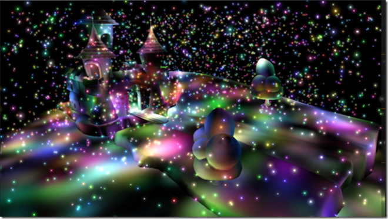](http://images2015.cnblogs.com/blog/715314/201601/715314-20160113130609022-289002533.png)

[回到顶部](https://www.cnblogs.com/polobymulberry/p/5126892.html#_labelTop)

## 3. 总结

------

首先我们列出Rendering Equation，然后对比Forward Rendering，Deferred Rendering和Forward+ Rendering[6]。

### 3.1 Rendering Equation

其中点 处有一入射光，其光强为 ，入射角度为 。根据函数 和 来计算出射角为 处的出射光强度。最后在辅以出射光的相对于视点可见性 。注意此处的 为场景中总共有 个光源。

[](http://images2015.cnblogs.com/blog/715314/201601/715314-20160113130610694-2019748618.png)

### 3.2 Forward Renderng

由于Forward本身对多光源支持力度不高，所以此处对于每个点 的处理不再考虑所有的 个光源，仅仅考虑少量的或者说经过挑选的 个光源。可以看出这样的光照效果并不完美。另外，每个光线的 是计算不了的。

[](http://images2015.cnblogs.com/blog/715314/201601/715314-20160113130611522-1996172593.png)


### 3.3 Deferred Rendering

由于Deferred Rendering使用了light culling，所以不用遍历场景中的所有光源，只需遍历经过light culling后的 个光源即可。并且Deferred Rendering将计算BxDF的部分单独分出来了。

[](http://images2015.cnblogs.com/blog/715314/201601/715314-20160113130612132-1522318084.png)


### 3.4 Forward+ Rendering

可以看出Forward+和Forward最大区别就是光源的挑选上有了很到改进。

[](http://images2015.cnblogs.com/blog/715314/201601/715314-20160113130612647-1360264028.png)

[回到顶部](https://www.cnblogs.com/polobymulberry/p/5126892.html#_labelTop)

## 参考文献

[1] Shawn Hargreaves. (2004) “Deferred Shading”. [Online] Available:

<http://hall.org.ua/halls/wizzard/books/articles-cg/DeferredShading.pdf> (April 15,2015)

[2] Wolfgang Engel. (March 16, 2008) “Light Pre-Pass Renderer”. [Online] Available:

<http://diaryofagraphicsprogrammer.blogspot.com/2008/03/light-pre-pass-renderer.html>(April 14,2015)

[3] Klint J. Deferred Rendering in Leadwerks Engine[J]. Copyright Leadwerks Corporation, 2008.

[4] 龚敏敏.(April 22, 2012) “Forward框架的逆袭：解析Forward+渲染”. [Online] Available:

<http://www.cnblogs.com/gongminmin/archive/2012/04/22/2464982.html(April> 13,2015)

[5] Lauritzen A. Deferred rendering for current and future rendering  pipelines[J]. SIGGRAPH Course: Beyond Programmable Shading, 2010: 1-34.

[6] Harada T, McKee J, Yang J C. Forward+: Bringing deferred lighting to the next level[J]. 2012.
