# Tiled Based Deferred Shading与Forward+

​                                                   2019年01月01日 15:41:59           [wolf96](https://me.csdn.net/wolf96)           阅读数：532                                                                  

​                   

​                                                                         版权声明：本文为博主原创文章，未经博主允许不得转载。          https://blog.csdn.net/wolf96/article/details/85541991        

# **Tiled Based流程**

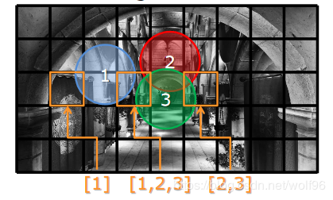

 

1.将屏幕分成小块，每个小块为一个视锥体

 

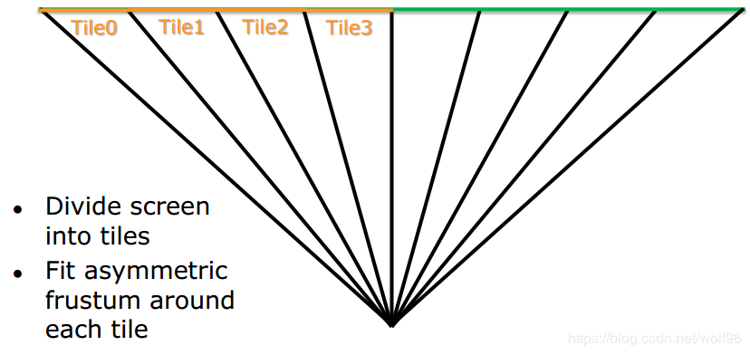

 

2，(depth bounds)在每一个视锥体中，根据ZBuffer得到每个Tile的MinZ和MaxZ，用MinZ到MaxZ这片区域对光做交点测试(使用compute shader)

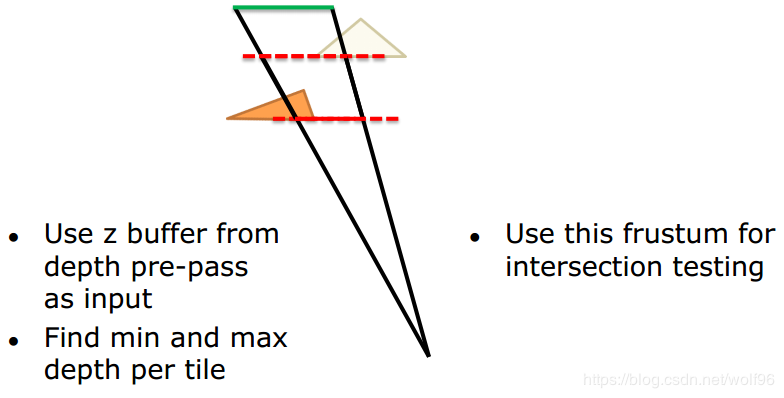

 

因此不需要光体积，点光源只需要position和range，spotlight也用球来做剔除bound

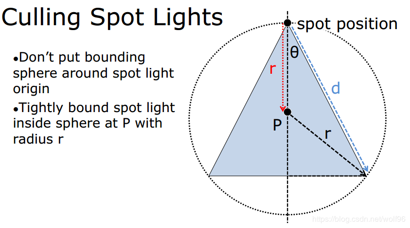

3.(light culling)剔除后，每个Tile里面的光的index写入list，得到tile个光源index的list

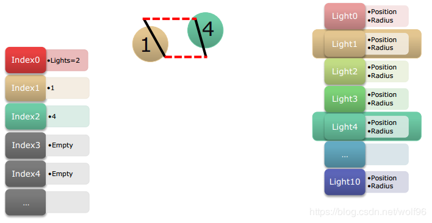

 

4.之后进行color pass

 

# **Depth Bounds**

在每个tile的视锥体里取得maxZ和minZ，需要用到compute shader

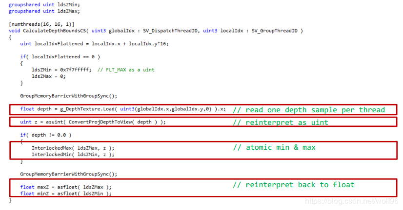

每次采样多个深度比一个要节省时间( Parallel Reduction)

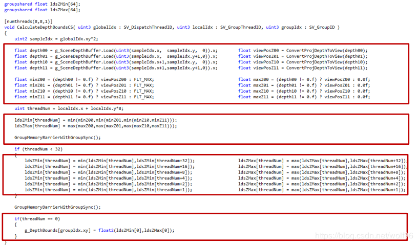

 

# **Light Culling**

Advancements in Tiled-Based Compute Rendering里面介绍了两种剔除方法，一种是视锥体剔除，一种是AABB剔除，AABB剔除结果好一些

短视锥体AABB精度更高

 

在深度不连续( Depth  Discontinuities)也就是minZMaxZ相距太远导致中间有很多没有照到物体的光源，一般会出现在物体边缘部分(最坏情况是物体边界到farplane)，如果计算会浪费，需要被剔除掉，剔除方法文中介绍有2.5D  Culling，和halfZ，还有改良halfZ

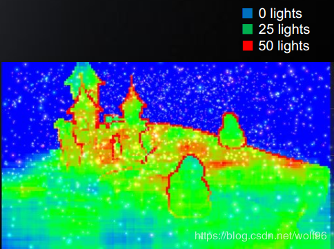

## **2.5D Culling**

缺点：

先进行上面的lightculling,将视锥体外的光剔除

将minZmaxZ构造的depth bounds分成32份，每份里进行1+light个 Depth mask & Depth mask

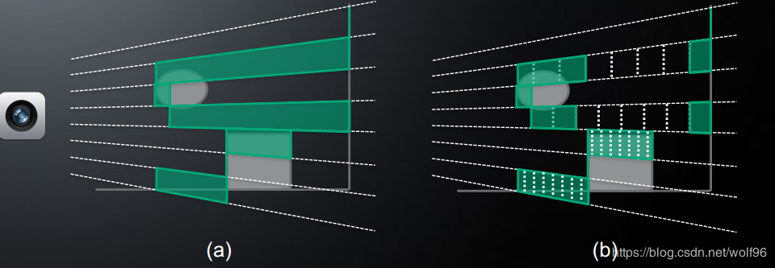

之所以是32份是因为用一个32bit的Depth mask

首先把物体写入一个Depth mask，32块，如果有一块里包含物体，就为1否则为0

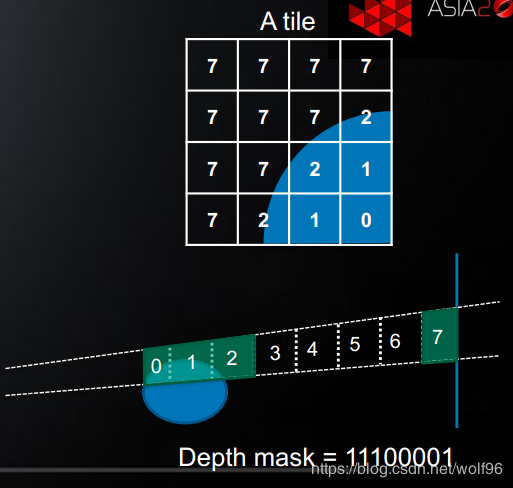

再对每个光写入Depth mask，与物体的Depth mask进行&操作，这样就知道光是否照到物体，而且知道照到哪块物体了，，可以剔除掉中间没有用的光源了

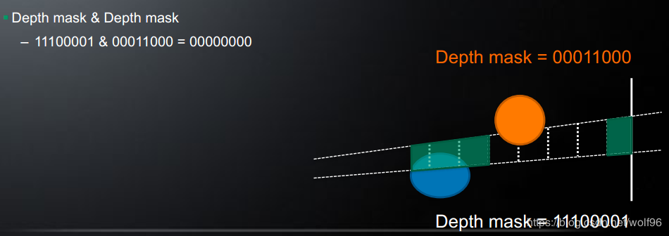

 

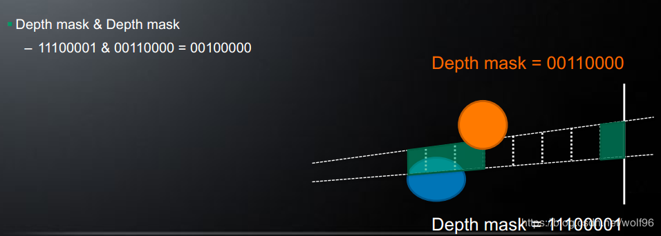

 

**优化与测试**

得出结论改良HalfZ和AABB是最性能最好的

并且可以把块变小，用16x16与32x32作对比，32x32虽然会增加colornpass消耗，但是会减少culling时间，整体还是比16x16时间短

 

#  

# **Tiled Based Deferred Shading**

Tiled Based Deferred Shading流程

1.生成GBuffer

2.将GBuffer分tile，每个tile用cs计算出depth bound

3.进行light cull,得到light index list

4.color pass,使用GBuffer信息，用该fragment所在tile的light index list进行绘制

 

TBDS好处

传统Deferred每一个光照要绘制整个光照体积，光源多了也很消耗，

TBDS通过分块与光源进行求交测试，不需要像传统Deferred一样绘制光体积还要深度测试和stencil pass了

 

# **Forward+**

 

Forward+流程

1.ZPrePass（为了获取深度进行depth bound，但是ZPrePass也会辅助硬件进行earlyZ）

2.将ZBuffer分tile，每个tile用cs计算出depth bound

\3. 进行light cull,得到light index list

4.同forward一样，。每个物体走FS，用该fragment所在tile的light index list进行绘制

 

Forward+好处

可以用多个光源，不必再多一个光源就要全部绘制一遍，在光源照不到的部分就不需要绘制

需要ZPrePass来提前生成ZBuffer，比Deferred带宽要少，

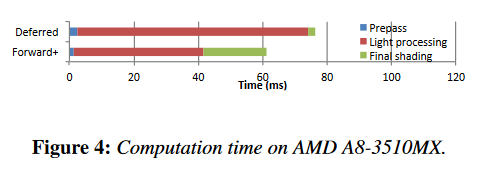

Forward+比传统Deferred要快

详细性能分析请看[龚大这篇文章](http://www.klayge.org/2013/04/25/forward%E5%92%8Ctiled-based-deferred%E6%80%A7%E8%83%BD%E6%AF%94%E8%BE%83/)

参考：
 \1. [Forward+: Bringing DeferredLighting to the Next Level](https://takahiroharada.files.wordpress.com/2015/04/forward_plus.pdf)

\2. A 2.5D Culling for Forward+

\3. [Advancements in Tiled-Based Compute Rendering](http://twvideo01.ubm-us.net/o1/vault/gdc2015/presentations/Thomas_Gareth_Advancements_in_Tile-Based.pdf?tdsourcetag=s_pctim_aiomsg)

4.[Forward框架的逆袭：解析Forward+渲染](http://www.klayge.org/2012/04/21/forward%E6%A1%86%E6%9E%B6%E7%9A%84%E9%80%86%E8%A2%AD%EF%BC%9A%E8%A7%A3%E6%9E%90forward%E6%B8%B2%E6%9F%93/)

----by wolf96 2019/1/1

# Clustered Shading

TBS只解决了不透明物体的光照问题，因为半透明物体不写入深度，如果有半透明物体在bound前面，就无法绘制其光照

这样的话需要用Clustered Shading来解决**透明物体**的光照问题

Clustered Shading也有一个好处是**不需要ZprePass**

 

Clustered Deferred Shading流程

1.生成GBuffer

2.将GBuffer分cluster/slice

3.分配光照给每个cluster，得到light index list

4.color pass,使用GBuffer信息，用该fragment所在cluster(通过world pos来获取是哪个cluster)的light index list进行绘制

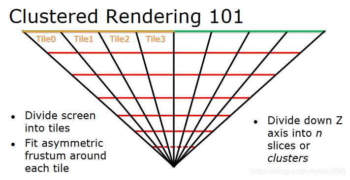

参考：

1.<http://www.cse.chalmers.se/~uffe/clustered_shading_preprint.pdf>

2.<http://www.diva-portal.org/smash/get/diva2:839812/FULLTEXT02.pdf>

---- Add by wolf96 2019/2/19
