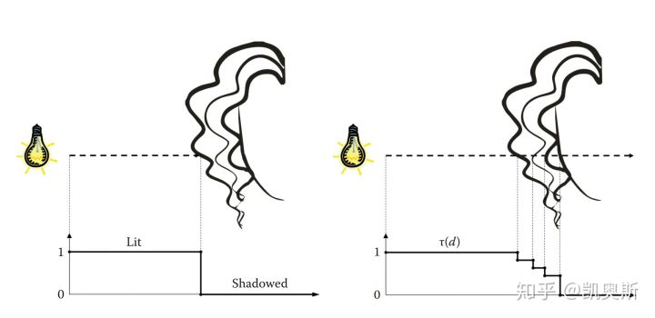
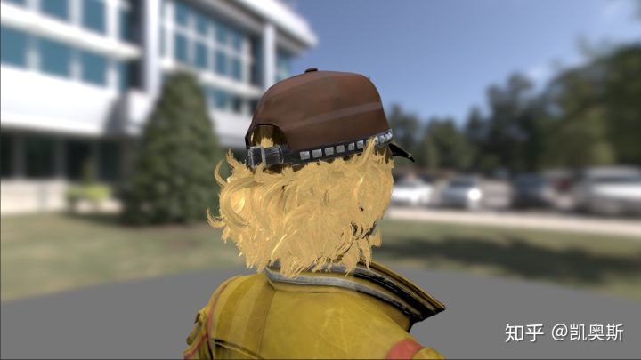
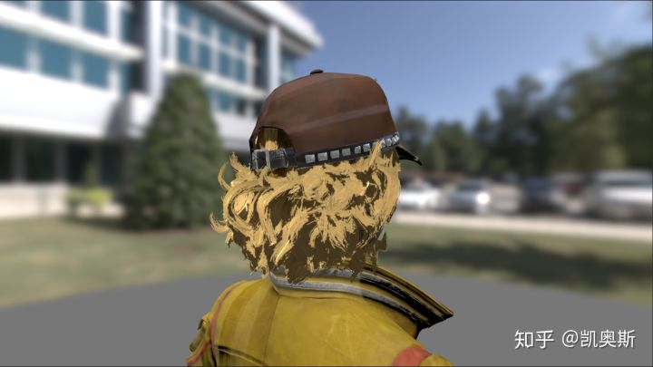
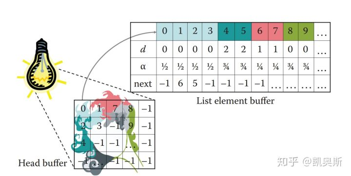

# 屏幕空间深度阴影贴图（Screen Space Deep Shadow Maps）


## Screen Space Deep Shadow Maps

屏幕空间深度阴影贴图

Deep  Shadow Maps主要应用在头发和烟雾渲染中，对于增强二者的体积感起到了很关键的作用。本文结合Deep Shadow  Maps和Screen Space Shadow Maps技术，在屏幕空间结算阴影，主要用在头发渲染上。这里使用了Compute  Shader（虽然并不必要）和StructuredBuffer（必要），需要了解相关内容的，可以参考我专栏里另一篇介绍Compute的文章（Compute  Shader : Optimize your game using compute）。

## 概述


如上图所示，图（a）表示常规对象的剪影，而图（b）表示超细头发的剪影。

在灯光空间光栅化之后，图（a）灰色的部分表示对象的深度，白色的部分表示远切面，而斜线的部分表示对象边缘占了一部分像素点。  我们知道，在常规Shadow Maps中，前向渲染的对象，会变换到灯光空间，与灯光空间的Shadow  Maps中的深度值进行比较。如果离光源远，则当前像素处于阴影中，否则，不在阴影中。而图（a）中斜线的部分则是半影（penumbrae），可以使用PCF等技术来处理。

但是，如图（b）所示，超细头发在光栅化之后，单根头发无法覆盖完整像素，一个像素点上也可能有多根头发，像素之间也没有连续性。这种情况，就无法很好的使用Shadow Maps。所以引入Deep Shadow Maps的方法计算头发的阴影。



如上图所示，与常规Shadow Maps的二值化不同，Deep Shadow Maps使用了透射函数τ来表示像素被遮挡的程度。这个函数保存了光线从光源到像素之间的可见度。


公式很简单，其实就是累乘像素的1-α。

以下为对比图：



无阴影



常规Shadow Maps


Deep Shadow Maps

## 实现

GPU Pro 4第四章中介绍了Deep Shadow Maps的实时做法，使用了Compute Shader，创造性的在Compute Shader里使用链表结构对阴影数据进行保存和计算，分为以下步骤：

1. 在灯光空间，创建链表头节点索引表，用链表并保存深度值
2. 排序链表并计算透射值
3. 连接毗邻节点
4. 渲染场景对象，访问阴影链表，并进行空间滤波，计算阴影

本文在此基础上，进行了改进，修改为以下步骤：

1. 深度预渲染（Depth Prepass）
2. 在灯光空间保存深度值
3. 在屏幕空间结算透射值，保存到Look-up Texture
4. 对Look-up Texture进行滤波
5. 渲染场景对象，采样Look-up Texture获得阴影

原文的方法不再赘述，而且有源码，感兴趣的可以到参考文献6的网址去查看。

## 深度预渲染

略。

## 在灯光空间保存深度

这一步是在灯光空间做的，跟Shadow Maps的Caster Pass基本一致。只不过要在fragment shader里面将depth保存起来。保存形式有两种，一种是使用GPU Pro 4的链表方法，另外一种是使用数组。

### 链表法



如图所示，需要两个StructuredBuffer。List Element Buffer中的数据结构是链表，它是一个带Counter的StructuredBuffer。HeadBuffer对应灯光屏幕空间像素点，保存了链表头节点的位置。

大致代码如下：

```text
            void frag(v2f i)
            {
                float3 posInLight = i.lightScreenPos;
                int counter = LinkedList.IncrementCounter();
                LinkedList[counter].depth = posInLight.z;
                LinkedList[counter].alpha = _HairAlpha;
                int originalVal;
                InterlockedExchange(HeaderList[((uint)posInLight.y) * Dimension + (uint)posInLight.x], counter, originalVal);
                LinkedList[counter].next = originalVal;
            }
```

链表法的缺点就在于内存（显存）不连续，后续计算中，效率会受影响。

### 数组法

与链表法对应的，数组法也需要两个StructuredBuffer。Element Buffer中直接连续保存depth和alpha，也不需要Counter。NumberBuffer也是对应灯光屏幕空间像素点，保存数组中元素的个数。

大致代码如下：

```text
            void frag(v2f i)
            {
                float3 posInLight = i.lightScreenPos;
                uint idx = ((uint)posInLight.y) * Dimension + (uint)posInLight.x;
                uint offset = idx * NUM_BUF_ELEMENTS;
                uint originalVal;
                InterlockedAdd(NumberBuffer[idx], 1, originalVal);
                originalVal = min(NUM_BUF_ELEMENTS - 1, originalVal);
                DepthBuffer[offset + originalVal].x = posInLight.z;
                DepthBuffer[offset + originalVal].y = _HairAlpha;
            }
```

数组法的缺点在于需要申请的内存（显存）过大，同样也会影响计算效率。

## 在屏幕空间结算透射值，保存到Look-up Texture

根据上一步的算法不同，这一步的算法会有些许差异，但是问题不大。

GPU  Pro  4中建议使用延迟渲染来进行阴影着色，原文中，不仅要查找当前像素对应的链表节点，还要查找当前节点在三维空间上毗邻的节点（在此之前会有两步巨耗无比的步骤：排序链表和链接毗邻节点），然后进行空间滤波。这种情况下，使用延迟渲染确实可以大大降低overdraw。

但是遗憾的是，我需要在前向渲染实现这个功能。

所以，本文使用了在屏幕空间结算的方法，这就与GPU  Pro 4的建议不谋而合，我们知道，延迟渲染计算阴影是在屏幕空间完成的。SSSM算法的Resolve  Pass，是在屏幕空间，采样_CameraDepthTexture获得当前像素的深度，然后反向计算世界空间坐标，再转换到灯光空间，与Shadow  Maps贴图进行对比，得到二值化的Lut。

与之类似，本文在将目标点转换到灯光空间后，遍历数组或者链表中的元素（不再需要排序），如果当前点的深度大于元素的深度，累乘1-alpha。遍历完之后，将透射值存入Lut。

## 对Look-up Texture进行滤波

具体滤波算法不多赘述。只是想说，这里就是比GPU  Pro  4中的算法好的一个点。因为延迟渲染计算阴影之后，就要立刻参与光照计算，所以滤波是一个大麻烦。所以原文不惜消耗，做了排序链表和连接毗邻节点的操作。而本文所述方法，直接在屏幕空间结算，生成了一张Lut，完全可以对这张Lut为所欲为（大雾）。

## 渲染场景对象，采样Look-up Texture获得阴影

与SSSM的Receiver Pass相同，计算屏幕空间坐标，采样Lut，获得阴影（衰减）值。

需要额外提一点，本文主要针对头发自阴影问题实现了SSDSM算法，暂时还未考虑烟雾的情况。直觉上来讲，烟雾粒子因为要Blend，所以直接采样Look-up   Texture无法得到正确的效果。可以考虑使用某种OIT的算法，在Composite的步骤（屏幕空间），将阴影加入计算。这个或许会作为笔者后续的研究课题。

## GitHub

[https://github.com/ecidevilin/DeepShadowMap](https://link.zhihu.com/?target=https%3A//github.com/ecidevilin/DeepShadowMap)

这个版本写得比较潦草（都没有手动构建灯光矩阵），后续会整合到我的KhaosLWRP里。

[https://github.com/ecidevilin/KhaosLWRP](https://link.zhihu.com/?target=https%3A//github.com/ecidevilin/KhaosLWRP)

## 参考文献

1. Real-Time Rendering, 4th Edition
2. GPU Pro 4
3. Opacity Shadow Maps
4. GPU Gems 2
5. Deep Shadow Maps
6. [https://github.com/ecidevilin/GPU-Pro-Books-Source-Code](https://link.zhihu.com/?target=https%3A//github.com/ecidevilin/GPU-Pro-Books-Source-Code)
7. Weighted Blended Order-Independent

编辑于 2019-08-20