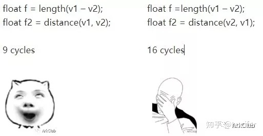
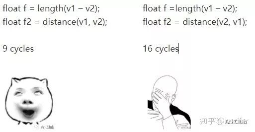

## [Shader低级优化](https://zhuanlan.zhihu.com/p/87936887)

作者：Lucifer
链接：https://zhuanlan.zhihu.com/p/87936887
来源：知乎
著作权归作者所有。商业转载请联系作者获得授权，非商业转载请注明出处。

作者：ArkClub——ZK  

今天带来了Ark原舵手，永远的精神领袖的Z总的文章。

是关于Shader算法中基于硬件底层的一些写法的优化。

\1. 自从DX10开始就不支持汇编了

\2. GLES设备这么多，没有人会从汇编考虑

\3. 编译器可以很好的帮你做优化

此时正在欢快的码代码的你(编者语)

啪~(编者语-. -)

1.编译器无法知道你想做什么

２.编译器没有大局观

３.编译器掌握的数据有限

４.编译器不会打破规则

来，这摞代码重构一下(编者语)

先来一个简单的例子

哪个更快？

 //ov, v1为vec4；f1,f2为float

ov = v1 * f1 * f2;                                      ov =  f1 * f2 * v1; 

看汇编:

左侧：                                                       右侧：

0    : mov i0.e0.e1.e2.e3, sh0                    0    : mov i0.e0.e1.e2.e3, sh0

1    : fmul ft0, sh2, i0                                1    : fmul ft0, sh1, i0

​       fmul ft1, sh3, i0                                  mov i0, ft0;

​       mov i2, ft0;

​       mov i1, ft1;

2    : fmul ft0, sh1, i2                                 2    : fmul ft0, sh2, i0

​       fmul ft1, sh1, i1                                  fmul ft1, sh3, i0

​       mov r0, ft0;                                         mov r0, ft0;

​       mov r1, ft1;                                         mov r1, ft1;

3    : fmul ft0, sh4, i0                                 3    : fmul ft0, sh4, i0

​       fmul ft1, sh5, i0                                    fmul ft1, sh5, i0

​       mov i1, ft0;                                           mov r2, ft0;

​       mov i0, ft1;                                           mov r3, ft1;

4    : fmul ft0, sh1, i1

​       fmul ft1, sh1, i0

​       mov r2, ft0;

​       mov r3, ft1;

如何解释:

**Vector Based 与 Scalar Based**

NV和AMD的DX9-Level的GPU大多是Vector Based，但DX10及之后的大多是Scalar Based。PowerVR 5系列是Vector Based，6、７、８系列是Scalar Based。Adreno从300系列开始就是Scalar Based了。Mali最新的Bifrost架构是Scalar Based的，之前的Midgard架构是Vector Based。

数学老师说A * B = B * A，编译器没学过数学吗？

对于浮点数来说，任意调换顺序真的是不安全的。

使用vs2015做个实验:

float f1 = 1e-20f;  float f2 = 1e30f; float f3 = 1e-26f;

1.0f / (f1 * f2 * f3) 和 1.0f / (f1 * f3 * f2)的结果有很大的不同

**MAD指令**

MAD

fo = f1 * f2 + f3 是一条指令, 而fo = (f1 + f2) * f3是两条指令。

想办法把计算整理成O = A * B + C的模式来节省指令数。

技巧：利用一下初中知识

x * (1.0f + x) = x * x + x，使用DX编译器编译如下：

add r0.x cb0[4].x l(1.00000)

mul r0.x, r0.x, cb0[4].x

↓

mad r0.x, cb0[4].x, cb0[4].x, cb0[4].x 

但这招在PowerVR和Mali编译器上似乎行不通，它们会帮你转成x * x + x然后使用MAD指令。

**RCP指令**

没有除法指令，只有rcp(): a / b = a * rcp(b)

尽量整理成 1.0f / f 的形式

float f = (f1 * f2 + f3) / f1; float f = f2 + f3 * (1.0f / f1);

fmad ft0, sh1, i0, sh2                frcp i0, sh0

mov i1, ft0;                                 

​                                                 fmad ft0, sh1, i0, sh2     

frcp i0, sh0                                

​                                                 mov r0, ft0;

fmul ft0, i0, i1

mov r0, ft0;

**指令修饰符**

●abs和neg可以用来修饰源操作数

float fo = f1 + abs(f2);

 fmad  ft0, sh1, c64, sh0.abs //abs()免费

float fo = f1 * (-f2);

   fmul  ft0, sh1.neg, i0 //取反免费

float fo = abs(f1 + f2);  return fo;

 fmad ft0, sh1, c64, sh0

​        mov i0, ft0;

​        mov ft0, c0

​        mov ft1, i0.abs //abs修饰符不能用在输出上，必须多加一条mov

​        mov r0, ft1;

●sat可以用来修饰指令

float fo = clamp(f1 + f2, 0.0f, 1.0f);     return fo;

  fmad.sat ft0, sh1, c64, sh0 //sat免费

​        mov r0, ft0;

float fo = f1 + clamp(f2, 0.0f, 1.0f);     return fo;

  fadd.sat ft0, sh0, c0 //sat不能修饰源操作数，浪费一条指令专门做sat

​        mov i0, ft0;

​        fadd ft0, sh1, i0

​        mov r0, ft0

min()、max()不免费，如果sat够用就用sat代替它们。

(编者语：我X，我一直以为sat比max，min费)

**mul(vec, mat)**

mul(float4(v3, 1.0f), mat4)

6 cycles

4个dp4

1.0f这个常数并没有带来优化 

mul(v3, mat3)

4 cycles

3个dp3

**Half 16(编者语：half)**

使用Half16格式进行计算有更好的性能

float f = f1 * f2;

float ff = f3 + f4;

return f + ff;

highp(编者语：float)

0    : mov i0.e0.e1.e2.e3, sh2

1    : fmul ft0, sh3, i0

​       mov i1.e0.e1.e2.e3, ft0

​       mov i0, sh0;

2    : fmad ft0, sh1, i0, i1

​       mov r0, ft0;

mediump(编者语：half)

0    : mov i0.e0.e1.e2.e3, sh0

1    : sop r0.joutj, sh1, i0, add, sh3, sh2

​       sop w1.koutk, sh1, 0, add, sh1, 0

**Swizzling**

●Scalar Based架构下Swizzling很便宜

无需重排的情况下免费

v = v3.brg; //重排，收费

v = vec3(v4); //没有重排，免费

v.zy = v1.zy + v2.zy; //没有重排，免费

●避免lowp(编者语：fixed)精度的Swizzling

大多支持es3.0的移动平台将lowp当成mediump

**内建函数**

●exp2()和log2()有对应的硬件指令，而exp()和log()没有

●sign()没有对应的硬件指令

如果不关心0的情况：

将sign(x) * y;  写成 (x >= 0) ？ y : -y;

●1.0f / sqrt()是一条指令，而sqrt()是两条指令：rcp(rsqrt())

●sin(), cos()有对应的硬件指令(4 cycles)，而asin(), acos()会生成一堆指令(70 cycles左右)。

**眼中有码，心中无码**

最高境界：眼中看到的是代码，心里想到的是硬件执行方式

哪个更快？

distance(v1, v2)可以重用length(v1 – v2)中的 v1 – v2和dot(v1, v2)两个操作，而distance(v2, v1)不可以。

**建议**

●建议在项目后期进行Shader低级优化，在此之前你应该先完成高级优化。

●了解每个平台的硬件架构。

●看一看每个平台下Shader编译后的样子。

Q & A（编者语：或许你有Q，但这儿也没有A -. -）

