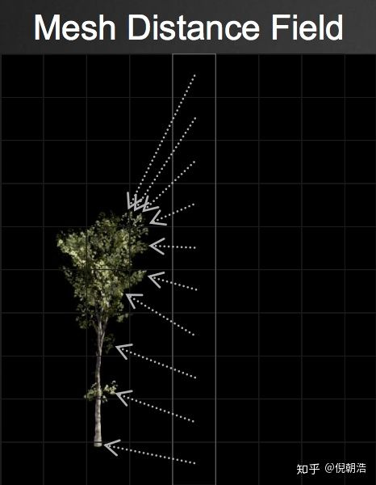
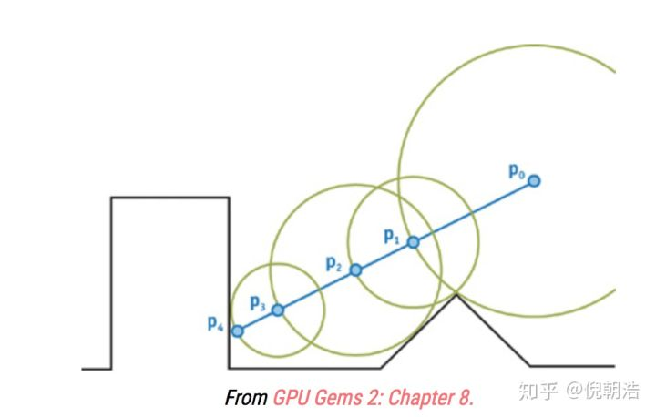
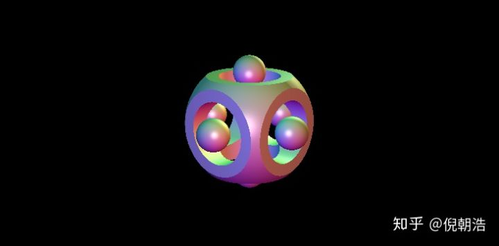
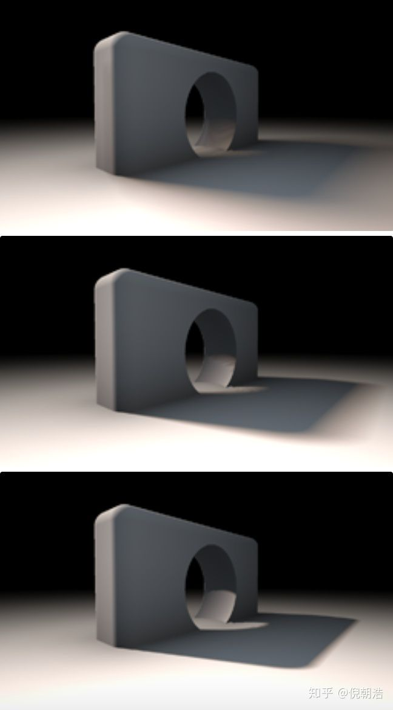
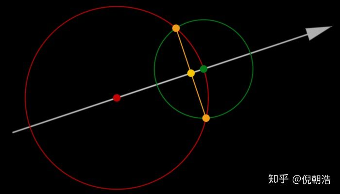
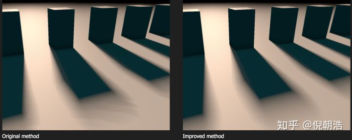

https://zhuanlan.zhihu.com/p/50128840

# 入门Distance Field Soft Shadows

[](https://www.zhihu.com/people/ni-zhao-hao)

[倪朝浩](https://www.zhihu.com/people/ni-zhao-hao)

做技术是不可能的，这辈子不可能做技术的


阅读须知：

1. ray marching：[https://en.wikipedia.org/wiki/Volume_ray_casting](https://link.zhihu.com/?target=https%3A//en.wikipedia.org/wiki/Volume_ray_casting)

 阴影对场景的真实感具有非常重要的作用， 是渲染中不得不提的话题。基于shadow map的方法在本专栏的[实时阴影技术总结](https://zhuanlan.zhihu.com/p/45805097)中已有大量介绍。许多引擎中会使用CSM，有些引擎还会有Distance Field Soft Shadows。本文就简单聊聊基于有向距离场的软阴影。

## Signed Distance Field(有向距离场)

ok，进入正题。首先什么是signed  distance  field的概念？这其实是图形学中非常常用的数学概念。数学上来说，是定义在空间中的一个标量场，标量值为空间一点到曲面的距离。曲面外的点为正值，曲面上的点为0，曲面内的点为负数。对于需要渲染的3d场景来说，我们需要计算它到场景中所有物体的最近距离，来生成distance  field。对场景生成distance field和distance  filed的表达存储本身也都是一个复杂的话题，比如如何处理非闭的网格(unclosed mesh)，本文就不做具体探讨了，以后有机会可以补充。




使用distance   field的一个巨大好处就是，它提供了许多全局信息。这意味着，当我们需要对一个点进行着色的时候，我们只需要轻易的查询有向距离函数就能得到其附近的几何信息。也就是说，使用distance  filed我们可以更容易实现更具真实感的着色和光照技术，尤其是结合ray marching进行渲染。

##  Sphere Tracing

Sphere  tracing是结合来SDF(signed distance field)来做ray marching的技术。我们都知道，做ray  marching的时候需要在给定的方向上做search，常用的方法包括linear search(每次使用增加固定的步长)以及binary  search(对距离进行二分)等。(其实这个search的过程与求解最优化问题中的search是一样的)。由于方向是固定的，每次迭代使用的步长是做ray  marching时需要考虑的，而SDF就完美提供了这种信息！

为了找到view  ray和场景中的相交，我们从相机位置开始，每次沿着view  ray一点一点的前进。在每个停留步上，我们都检测该点的SDF值是否为负来判断这个点是不是在曲面内部了。如果是，那么光线与场景相交了，我们得到了我们想要的深度值。如果不是，我们则继续一点一点往前进。这样使用常数做为前进的距离经常会有一个问题，如果步长过小，则需要非常多步才能得到结果；如果步长过大，则得到交点的精确度太低。
 




相对于固定步长的情况，我们使用结合SDF的sphere tracing就能做得更好。不是每次都步进一小步，而是步进我们知道的不会穿过任何曲面的最大距离(如上图)。而SDF则刚好为我们记录了这个距离！ 

Sphere Tracing代码如下：

```cpp
float depth = start;
for (int i = 0; i < MAX_MARCHING_STEPS; i++) {
    float dist = sceneSDF(eye + depth * viewRayDirection);
    if (dist < EPSILON) {
        // We're inside the scene surface!
        return depth;
    }
    // Move along the view ray
    depth += dist;
 
    if (depth >= end) {
        // Gone too far; give up
        return end;
    }
}
```

使用sphere tracing能够轻松渲染各种场景的SDF：[https://www.shadertoy.com/view/4tcGDr](https://link.zhihu.com/?target=https%3A//www.shadertoy.com/view/4tcGDr)




## Distance Field Soft Shadows

让我们来看如何基于SDF和ray marching实现软阴影。假设我们已经有了场景的SDF，通过使用函数**float map(vec3 p)** 进行查询。那么map函数中则包括了所有的几何信息。通常来说，当要计算某点p的阴影信息时，我们可以通过朝着light vector 进行raymarch，直到找到一个相交。通常情况的代码为：

```text
float shadow( in vec3 ro, in vec3 rd, float mint, float maxt )
{
    for( float t=mint; t < maxt; )
    {
        float h = map(ro + rd*t);
        if( h<0.001)
            return 0.0;
        t += h;
    }
    return 1.0;
}
```

上面代码当然work，但是只会生成准确的硬阴影，缺乏真实感(如图右边)。


接下来，只需要简单增加些代码就能使结果好很多！这个trick的核心就是想象下一个shadow   ray在没有与物体相交前，但是很接近的情况下，那么我们会考虑该点在半影区(penumbra)。我们可以有两种基本假设：一是距离相交点越近，通常阴影越深颜色越暗。二是距离着色点越近(也就是距离光源也远)，阴影颜色也越深。令人难以置信的是，在ray   marching的整个过程中，这两个距离值我们都是可以得到的！于是，我们可以在marching过程中的每一步计算一个半影(penumbra)因子，并最终选取最黑的值做为结果。

代码如下：

```text
float softshadow( in vec3 ro, in vec3 rd, float mint, float maxt, float k )
{
    float res = 1.0;
    for( float t=mint; t < maxt; )
    {
        float h = map(ro + rd*t);
        if( h<0.001 )
            return 0.0;
        res = min( res, k*h/t );
        t += h;
    }
    return res;
}
```

使用上述代码就可以得到图中左边的软影效果。

简单的修改了代码就得到了巨大的提升：不但得到了软阴影的效果，它们的表现还十分真实。而增加的开销也几乎可以无视。当然，参数k会影响影子的软硬程度。看下图可以感受下不同k(从上到下为：2，8，32)的结果：




必须佩服的说！这算法很优雅，简单又有效果！

##  进一步优化

GDC  2018中Sebastian Aaltonen在黏土模拟游戏中对该算法进行了进一步的优化，帮助消除了一些复杂几何下产出的banding  effects。为了使软影算法稳定，我们应该在光线上每一处都计算到半影因子。但是毕竟marching是一个离散的过程，我们还是可能会错过一些颜色最深的半影计算，这有可能会造成一些瑕疵。而Sebastion通过光线上三角化两次采样点的信息来估计最近距离信息的方式进行优化。参见下图：   




其中白色箭头是我们进行marching的光线，绿点是我们当前的位置，而红点是上一次计算的位置。而两个圆圈分别表示在两个点使用SDF得到的最近距离球。那么我们考虑黄点为场景到光线的最近距离，这个距离用简单的平面几何就计算出来了。话不多说，直接看代码就很清楚了：

```text
float softshadow( in vec3 ro, in vec3 rd, float mint, float maxt, float k )
{
    float res = 1.0;
    float ph = 1e20;
    for( float t=mint; t < maxt; )
    {
        float h = map(ro + rd*t);
        if( h<0.001 )
            return 0.0;
        float y = h*h/(2.0*ph);
        float d = sqrt(h*h-y*y)
        res = min( res, k*d/max(0.0,t-y) );
        ph = h;
        t += h;
    }
    return res;
}
```

看下对比结果，可以发现优化后的算法确实减少了banding effect：





上述算法在shadertoy中都有实现。

[https://www.shadertoy.com/view/lsKcDD](https://link.zhihu.com/?target=https%3A//www.shadertoy.com/view/lsKcDD)

参考文献：

1.

fractals, computer graphics, mathematics, demoscene and more

www.iquilezles.org

2.

GPU-based clay simulation andray-tracing tech in Claybook

twvideo01.ubm-us.net


编辑于 2018-11-17
