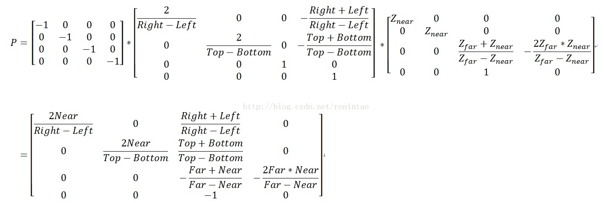
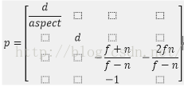
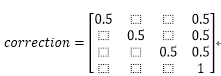
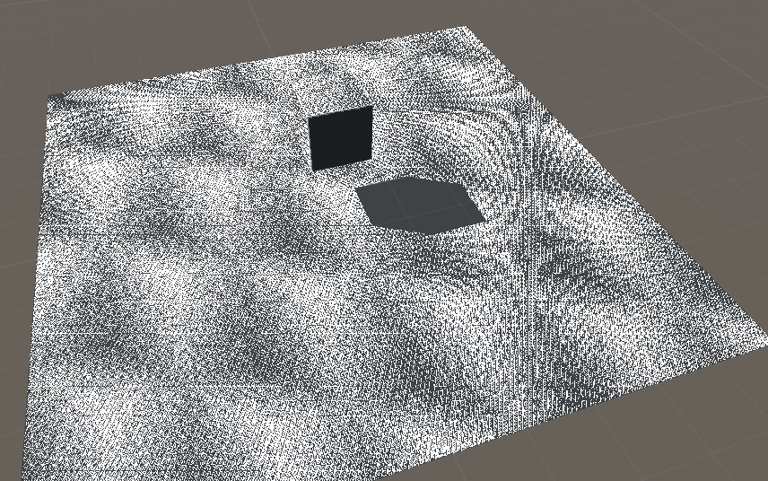
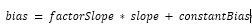
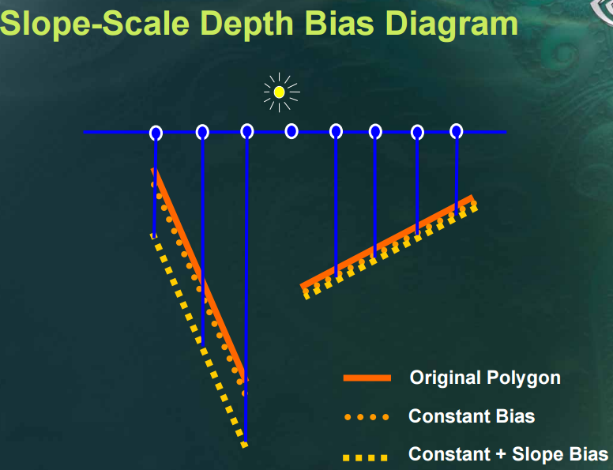
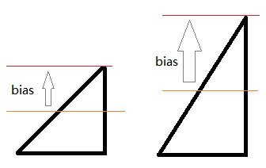
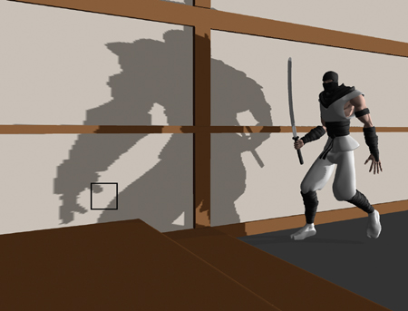

# Shadow Depth Maps

 

​        1、Common Techniques to Improve Shadow Depth Maps

 

​        2、Tutorial 16 : Shadow mapping

 

​        3、Shadow Mapping

 

​        4、Shadow Mapping Algorithms

 

​        5、Shadow Map阴影贴图技术之探

 

​        6、Cascaded Shadow Maps

 

 

 

写在前面

 

​        之前已经很久没有再更新博客，上一篇已经是3年前的记录了，当时还比较菜（现在当然仍然菜），所以写的东西大多不是很好……

 

​        这期间其实也学了很多新的东西。学习中比较痛苦的一点，是经常发现所学的东西要么就只有一个大意的原理讲解，不会特别深入；要么就是只有一个实现的简单方法，不知道所以然（国内的资料很多是这样）；能够两者兼顾的通常是比较难啃的英文资料，隔一段时间回去再翻阅，由于语言问题又需要花比较长的时间；另外一个问题就是各个相关知识点比较散落，不方便融汇贯通来看。

 

​       因此，又产生了回来重开博客，进行汇总的想法。

 

​       另外回来重新翻阅之前的博客，发现多了很多留言，以后慢慢的回复填坑吧……

 

 

 

# 一、shadow map 原理

 

​        shadow map是一种常用的实时阴影的生成方法。通常用来生成平行光（direction light）的阴影。点光源也可以用，不过要更加复杂一些（称为 omnidirectional shadow maps，生成的是 cubemap，如果我会填坑的话，会在以后讲到）。

 

​        说到 xx map，第一反应当然是会生成并利用某种纹理。没错，shadow map的核心就是要生成并利用 shadow depth map。下面具体来说。

 

## 1、阴影算法的任务

 

​        shadow map（以及shadow volume）等shadow算法，到底是做什么的？这其实是需要解决的第一个问题。这些阴影算法的核心，实际上就是要针对任意给定的一个物体片段点（fragment point），鉴定出它是否处在阴影之中。

 

​        所以阴影算法，归根结底是要给出这样一个函数：

 

bool ShadowAlgorithm(vector3 fragmentPoint) {

​    if ( IsInShadow(fragmentPoint) )

​        return true;

​    else

​        return false;

}

​        各种不同的阴影算法，实际上就是“是否在阴影中”的鉴别方法不同。

 

## 2、阴影产生的自然原理

 

​        什么样的点是在阴影中的？看看下面这张图

 

 

 

图1、阴影（图中橘黄色的是不透明的物体）

 

 在平行光的照射下，直觉的可以知道，点A、点D在阴影之外，而点B、点C在阴影之中。直觉判断的依据，就是由于光线的直线传播特性，一旦遇到遮挡，就会产生阴影。换言之，对于光线来说不可见的点，就是在阴影中的点。

 

​        那么上面的判断函数 IsInShadow，就可以进一步写为如下的伪代码：

 

bool IsInShadow(vector3 fragmentPoint) {

​     return !IsVisibleToLight(fragmentPoint, mLight);

}

​        其中 mLight是需要生成阴影的平行光，fragmentPoint是需要进行判断的片段点。

 

## 3、基于自然原理的提炼：light space 的 shadow depth map

 

​        一提到这种可见性的判定，自然的就会想到 depth test。我们站在光源的位置，按照光线传播的视角，观察场景，计算场景中的物体距离光源的距离（也就是该视角下的深度），并记录各个位置上的最小值（即距离光源最近的点的位置），从而获得一张 shadow depth map。

 

​        其实，上面的流程和普通的camera获取depth map的流程是基本一样的，只是要改换到光源位置来观察而已。

 

4、应用到场景中：利用 shadow depth map

 

​        获取了 shadow depth map之后，就要利用它来进行鉴别。根据第2小节的讨论，可以知道，如果某个点，其在光源视角下的 depth 大于 shadow map中对应位置的 depth，则意味着它被某个物体遮挡，因此是在阴影中的；反之则不在阴影之中。

 

​        所以，对于世界中的某个点 p，我们只要将其转移到 light space ，比较他在light space下的depth，就可以判定它是否是在阴影之中了。

 

# 二、基本的shadow map流程

​        根据第一章的讨论，可以大致梳理出流程，下面逐步来说：

## 1、在light space 摆放 camera

 

1）投影方式

 

​        camera的投影方式有两种：orthographic 和 perspective。那么应该使用哪一种呢？

 

​        这就牵涉到shadow map的原理：以光源的角度观察世界。由于我们这里使用的是平行光，所以它眼中的世界是没有透视关系的，因此应该使用 orthographic。而如果使用的是点光源，那么就应该使用 perspective了。

 

2）视锥体（frustum）

 

​        确定了投影方式为 orthographic 之后，就要确定它的视锥体。显然我们需要将view视角下所有物体都包含到视锥体中，但是过大也没有意义，会引起不必要的渲染开销，另外也可以更充分的利用shadow depth map。

 

​        这里有两种方式（这一小节的图，全部来自于微软的网站）：

 

  **a. Fit To Scene**

 

 

*图2、任意指定的视锥体和 fit to scene 设定下的视锥体*

 

 

  左边是一个任意设定的视锥体，里面的梯形是view视角的frustum，右边是调整shadow frustum，使他正好包含整个scene的情况。

 

​        可以看到，如果按照左边的设置，视锥体中有一部分区域是完全空着的，那么截取出的 shadow depth texture，对应的这一部分也就完全为空，因而利用率更低。另一方面，左边的视锥体远近平面距离较远，由于深度取值实际是转换到 0~1 范围内的，这就意味着有部分值域是利用不上的，那么深度值的精度也被降低了。

 

​        那么，如果给定场景的AABB，如何确定灯光的frustum？如果当前light space的只需要将该AABB的顶点转移到light space，然后取出 xmin，xmax，ymin，ymax，zmin，zmax。由于camera 的观察视野由 x y分量确定，观察的深度由z确定，因此将camera摆放在x，y的中心点，size取其半径的较大值，然后将zmin设置为near，zmax设置为far即可。

 

​        例如下面 unity 的代码，lightCamera就是我们摆放在灯光处的camera

 

​    private void FitToScene() {

​        List<Vector3> aabbBounds = GetSceneAABBCorners(sceneObject);

 

​        float xmin = float.MaxValue, xmax = float.MinValue;

​        float ymin = float.MaxValue, ymax = float.MinValue;

​        float zmin = float.MaxValue, zmax = float.MinValue;

​        foreach (Vector3 cornerPoints in aabbBounds) {

​            Vector3 pointInLightSpace = transform.worldToLocalMatrix.MultiplyPoint(cornerPoints);

 

​            xmin = Mathf.Min(xmin, pointInLightSpace.x);

​            xmax = Mathf.Max(xmax, pointInLightSpace.x);

​            ymin = Mathf.Min(ymin, pointInLightSpace.y);

​            ymax = Mathf.Max(ymax, pointInLightSpace.y);

​            zmin = Mathf.Min(zmin, pointInLightSpace.z);

​            zmax = Mathf.Max(zmax, pointInLightSpace.z);

​        }

 

​        float xsize = (xmax - xmin)/2;

​        float ysize = (ymax - ymin)/2;

​        float zsize = (zmax - zmin)/2;

 

​        lightCamera.transform.localPosition = new Vector3((xmin+xmax)/2, (ymin+ymax)/2, 0);

​        lightCamera.orthographicSize = Mathf.Max(xsize, ysize);

​        lightCamera.nearClipPlane = zmin;

​        lightCamera. farClipPlane = zmax;

​    }

​        b. Fit to View

\--------------------- 

  这种方法是调整视锥体使他正好包含view frustum。可以看到在左边的情况下，其表现非常好，只需要包含很少的区域，右边的情况对比fit to scene则有得有失。

 

​        值得注意的是，view 视角下的阴影，并不一定完全由view视角内包含的物体产生，可以看下面这张图，view视角很小的情况下就会出现问题。

 

*图4、fit to view在view frustum很小时的阴影丢失*

 

因此在实际使用中，是使用灯光的无穷远视锥体和view frustum 以及场景的AABB盒的交集来做的

 

 

 

图5、综合使用scene 与 view frustum 来解决阴影丢失

 

​        另外这种方法还有个问题在于视锥体的确定和view frustum产生了关联。只要观察视角变动，则截取尺寸就有可能变化，而在 fit to scene情况下，则是相对固定的。

 

​        这种情况的代码与上面的差别不大，可以看到near 和 far clipplane仍然取决于scene，而size则完全取决于view frustrum

 

​    private void FitToView() {

​        List<Vector3> sceneAABBBounds = GetSceneAABBCorners(sceneObject);

​        List<Vector3> viewAABBBounds = GetViewCorners(viewCamera);

 

​        RoninBound3D sceneBound = GetBoundInLightSpace(sceneAABBBounds);

​        RoninBound3D viewBound  = GetBoundInLightSpace(viewAABBBounds);

 

​        lightCamera.transform.localPosition = new Vector3(viewBound.XCenter, viewBound.YCenter, 0);

​        lightCamera.orthographicSize = Mathf.Max(viewBound.XSize/2, viewBound.YSize/2);

​        lightCamera.nearClipPlane = sceneBound.zMin;

​        lightCamera. farClipPlane = sceneBound.zMax;    }

 

 其中获取场景AABB的由于比较简单这里就不给出，获取perspective camera的边角稍微麻烦一点，在unity中代码如下：

​    private List<Vector3> GetViewCorners(Camera cam) {

​        // in unity, the fov is the vertical field of view; horizontal FOV varies depending on the viewport's aspect ratio. Field of view is ignored when camera is orthographic (see orthographic).

​        List<Vector3> corners = new List<Vector3>();

 

​        float ySizeNear = cam.nearClipPlane * Mathf.Tan(cam.fieldOfView/2 * Mathf.Deg2Rad);

​        float xSizeNear = cam.aspect * ySizeNear;

 

​        float ySizeFar  = cam.farClipPlane * Mathf.Tan(cam.fieldOfView/2 * Mathf.Deg2Rad);

​        float xSizeFar  = cam.aspect * ySizeFar;

 

​        corners.Add( cam.transform.localToWorldMatrix.MultiplyPoint(new Vector3(  xSizeNear/2,  ySizeNear/2, cam.nearClipPlane)) );

​        corners.Add( cam.transform.localToWorldMatrix.MultiplyPoint(new Vector3( -xSizeNear/2,  ySizeNear/2, cam.nearClipPlane)) );

​        corners.Add( cam.transform.localToWorldMatrix.MultiplyPoint(new Vector3(  xSizeNear/2, -ySizeNear/2, cam.nearClipPlane)) );

​        corners.Add( cam.transform.localToWorldMatrix.MultiplyPoint(new Vector3( -xSizeNear/2, -ySizeNear/2, cam.nearClipPlane)) );

 

​        corners.Add( cam.transform.localToWorldMatrix.MultiplyPoint(new Vector3(  xSizeFar/2,  ySizeFar/2, cam.farClipPlane)) );

​        corners.Add( cam.transform.localToWorldMatrix.MultiplyPoint(new Vector3( -xSizeFar/2,  ySizeFar/2, cam.farClipPlane)) );

​        corners.Add( cam.transform.localToWorldMatrix.MultiplyPoint(new Vector3(  xSizeFar/2, -ySizeFar/2, cam.farClipPlane)) );

​        corners.Add( cam.transform.localToWorldMatrix.MultiplyPoint(new Vector3( -xSizeFar/2, -ySizeFar/2, cam.farClipPlane)) );

 

​        return corners;

​    }

 

 以上的代码还有另外一个问题，view camera的frustum有时far clip会非常的大，导致view frustum 的aabb非常的大，包含了大量不需要的信息。所以在实际使用中，可以先获取view camera的max depth，然后再进行计算（当然可能还有更好的方式）

 

2、截取 shadow depth map

 

​        1）texture size

 

​        要将shadow depth map保存为多大尺寸的纹理是个非常重要的问题。尺寸越大，包含的信息越多，当然越精确，但是消耗的内存也越多。尺寸太小会引发锯齿问题。这里先不展开讨论，在后面的部分会详细讲到。

 

​        2）编码方式

 

​        texture size体现的是位置的精确度，而该像素点上的值，则是其深度值的精度。如果仅仅利用纹理像素中的一维，则精度显然不够高，而且十分浪费。所以可以通过编码的方式，将其四位（RGBA模式下）统统利用起来。

 

​        例如unity中的 EncodeFloatRGBA

// Encoding/decoding [0..1) floats into 8 bit/channel RGBA. Note that 1.0 will not be encoded properly.

inline float4 EncodeFloatRGBA( float v )

{

float4 kEncodeMul = float4(1.0, 255.0, 65025.0, 16581375.0);

float kEncodeBit = 1.0/255.0;

float4 enc = kEncodeMul * v;

enc = frac (enc);

enc -= enc.yzww * kEncodeBit;

return enc;

}

 在需要取出的时候再进行解码：

inline float DecodeFloatRG( float2 enc )

{

float2 kDecodeDot = float2(1.0, 1/255.0);

return dot( enc, kDecodeDot );

}

​        这样就提高了深度值的精度。

3、开始渲染阴影

 

​        对于一般的物体，那么直接渲染即可，而对于一些透明的物体，或者需要特殊处理的物体，则可以在这一步再做点文章。

 

​        比如说对于一些透明的物体，只希望他的边界处产生阴影，则可以只对他的边界处记录Z值。

 

​        这里会在以后补全（希望我会填这个坑）

 

4、对于每个点，转到 light space ，转换矩阵的确定

 

​        首先要明确的是转换的目的。上面截取的 depth map 是在 light space 中获得的，那么对于场景中任意的一点，就需要知道他在light space中的位置。

 

​        那么和view space中的 mvp 转换一样，这里也需要转移到light space 的 mvp 矩阵。

 

​        在unity中这几个矩阵其实可以直接获取，不过在《Unity 3D ShaderLab开发实战详解》中的第13章中有出现一个具体的矩阵，但是这个矩阵有一些问题（这是一本充满bug的好书），因此在这里额外讨论一下这个矩阵如何确定。

 

​        这里我们分别对m、v、p进行讨论：

 

​        1）model矩阵：local -> world

 

​        显然，light space 和 view space 所面对的世界是一样的，那么将坐标从 local 坐标系转换到 world 坐标系的 model 矩阵就是相同的。那么在unity中，在shader中直接使用 _Object2World 矩阵就可以了

 

​        2）view矩阵：world -> view

 

​        在unity中可以直接获取这个矩阵，使用 Camera.worldToCameraMatrix 即可。而在《实战》一书中，使用的是灯光的Transform.worldToLocalMatrix。

 

​        乍一想，这两个矩阵的功效应该相同：对light space来说，所谓的view space，其实不就是灯光看到的世界吗，那不就是灯光本地的世界吗？

 

​        然而将这两个矩阵打印出来，会发现在Z 轴方向有符号上的差异。

 

​        详细的讨论可以参考 unity, 相机空间 与 相机gameObject的局部空间 这篇文章。其实问题的本质就在于unity中的坐标系是左手坐标系，而camera view坐标系是右手坐标系。所以在z轴上发生了方向的反转，这样的反转之后，camera所见的物体 z < 0，且越远，z越负。

 

​        因此，这里需要使用 Camera.worldToCameraMatrix 来获取view矩阵，或者使用对角矩阵[1, 1, -1, 1]左乘 Transform.worldToLocalMatrix。两者得到的结果是相同的。

 

​        3）projection 矩阵：view -> projection

 

​        在unity中可以直接从 Camera.projectionMatrix 中获取。

 

​        《实战》一书中，在light处放置的是一个perspective的camera，所以其投影矩阵是透视投影，他这里给出的矩阵有比较多的错误。

 

​        这里的求法可以参考我之前的博客《【OpenGL】02 - OpenGL中的坐标系》 最后的结论：

在unity的官方手册上也有相同的公式，可见链接最下面的范例。

 

​        由于实际使用中，camera处在view space的原点，因此

 

Right - Left   = WidthAtNearClip;

Top   - Bottom = HeightAtNearClip;

 

Right + Left   = 0;

Top   + Bottom = 0;

​        而在近平面的 width 和 height 可以由camera 的 fov、aspect和near求取出来：

​        float fov = c.fieldOfView;

​        float n   = c.nearClipPlane;

​        float f   = c.farClipPlane;

​        float aspect = c.aspect;

 

​        float heightAtNear = 2 * n * Mathf.Tan(fov / 2f * Mathf.Deg2Rad);

​        float widthAtNear  = aspect * heightAtNear;

​        将这个结果带入原矩阵，并定义

​        float d = 1 / Mathf.Tan(fov / 2f * Mathf.Deg2Rad);

​        则得到

这样求出的投影矩阵，和Camera.projectionMatrix是相等的。

​        但这个矩阵仍然不能直接使用，需要根据GPU情况再进行处理（这里的原理我并不清楚，期待今后可以补完），还需要使用

 

GL.GetGPUProjectionMatrix(c.projectionMatrix, false)

​        才能够得到shader中使用的投影矩阵。

​        4）正投影的投影矩阵

 

​        仍然可以使用 Camera.projectionMatrix 然后使用 GL.GetGPUProjectionMatrix 转换后得到。具体的 Camera.projectionMatrix 矩阵计算方法依旧可以参考我之前的博客 《【OpenGL】02 - OpenGL中的坐标系》 

 **5）correction矩阵**

​        注意到《实战》一书中，还有一个correction矩阵，这个矩阵是做什么的？

 

  一个顶点，经过MVP变化之后，其xyz分量的取值范围是[-1, 1]，现在我们需要使用这个变化过的顶点值来找到 shadow depth map中对应的点来比较深度，即要作为UV使用，而UV的取值范围是[0, 1]，所以需要进行一个值域的变换，这就是这个矩阵的作用。

 

​        需要注意的是，要使这个矩阵成立，该vector4的 w 分量必须是 1。在shader中运算的时候必须注意。

 

5、将上面求得的转换矩阵赋值给shader

 

​        在unity中，可以使用下面的代码来达到效果。

 

​        Shader.SetGlobalMatrix("LightMV", matrix);

​        在后面的实践中，有时我们还需要传递数组给shader，这个特性在目前的版本（5.3）中还不支持，从官网的论坛上来看，将在5.4中支持该特性。

6、在物体的shader中进行深度比较，来确定阴影

 

​        到了这一步，就只需要简单的比较深度就可以了，当然这里也是可以扩展的改善的，后面的bias里面我们会谈到。

 

7、基础shadow map的代码

 

​        代码可以参考附例中的 " 01 Basic ShadowMap"，可以看到综合的流程。

 

 

# 三、对这个流程的一些思考

 

​        除了上一章中对于每个独立步骤的讨论之外，对于流程整体，这里还有一些思考。

 

1、对静态平行光源，shadow depth map 可以预生成吗？

 

​        如果场景中需要投射阴影的物体是静态的，且不使用fit to view时是可以的。

 

2、多个光源要怎样处理？

 

​        现在针对单个光源，是放在main pass中执行的，对于多个光源，则每个光源都需要有自己独立的depth map，以及自己的转换矩阵，在shader中分别处理。可以写在一个pass中，也可以分散到多个pass（类似于forward add，其实感觉forward add是最合适的处理位置）。

 

​        现在我们已经完成了基础的shadow map。但是现在的效果还很难让人满意，所以还需要很多改进。下面我们针对问题逐个来看。

 

 

**四、问题一： Shadow Acne && Self Shadowing**

**1、现象**

​        在任何改进措施都不采用的情况下，运行 " 01 Basic ShadowMap"，会看到一张惨不忍睹的画面（当然，阴影还是有的）

 

更常见的情况是下图左边这样的锯齿状条纹：

 

  这种现象，就被称为 **Shadow Acne** 或者**Self-Shadowing**

 

 

**2、原因**

​        [Shadow Mapping](http://learnopengl.com/#!Advanced-Lighting/Shadows/Shadow-Mapping) 里的 Shadow acne 一节解释的比较清楚，根本原因就是 shadow depth map 的分辨率不够，因此多个 pixel 会对应 map 上的同一个点。

 

 图中黄色箭头是照射的光线，黑色长方形是实际物体表面，黄色的波浪线是 shadow map中的对应值的情况。

 

​        可以看到，由于map是对场景的离散取样，所以黄色的线段呈阶梯状的波浪变化，相对于实际场景中的情况，就有一部分比实际场景中的深度要大（对应着黑色线段部分），着部分不会产生阴影（注意图画反了）；一部分比实际场景中的深度要小（对应着黄色线段部分），这部分会产生阴影，所以就出现了条纹状的阴影。

 

​        由于这种情况，是物体的实际深度，与自己的采样深度，相比较不相等（实际深度大于采样深度）导致的，所以可谓是自己（采样的副本）遮挡了自己（实际的物体），所以被称为 self shadowing。

 

3、对策

 

​        解决的方法很简单，其实只有实际深度大于采样深度的时候才有问题，那么我们在计算实际深度的时候，往灯光方向拉一点，让他减小一点就可以了

 

 

 这就是shadow bias的原理，具体怎么做，我们后面来看。

 

**五、问题二：Peter Panning**

 

**1、现象**

 

  这个现象只有在加入了 shadow bias的时候才会出现，如上图，会看到影子脱离了物体（像飞起来的小飞侠一样），被称为 peter-panning。

 

2、原因

 

​        上面现象中提到了 shadow bias，容易知道，其实就是shadow bias加的太多了。

 

​        shadow的计算是根据计算中使用的深度与shadow map的深度对比得到的，如果shadow bias加的太多，就会导致物体计算影子时的深度，与他的实际深度差别太大。所以影子就和物体产生了分离。

 

3、对策

 

​        解决的方法，当然就是不要使用太大的shadow bias。

 

 

 

六、Shadow Bias

 

​        前面两节一直在说要加入shadow bias，但是可以看到，加小了没用，会有 shadow acne；加多了又会导致 peter panning。所以要怎么加，是有一定技巧的，最终的目标是要找到一个刚好能够消除 shadow acne的 bias 值。

 

​        现在常用的shadow bias的计算方法，是基于物体斜度的，称为 slope scale based depth bias。

 

​        简单来说就是

 

 

 

​        公式的具象化可以参考下图：

\--------------------- 

  这样做的原理是，当斜度大的时候，shadow map上的一个点，所对应的实际物体的一小块面，其深度变化就会更大。

 

​        举例来说，一个x方向的斜坡，同样是在x方向上差0.01，如果坡角是45度，那么深度差就是0.01，如果坡角是60度，那么深度差就是0.017.

 

如果采样点都是在x=0.005处，那么对坡角60的情况，就需要bias至少为0.0085，才可以保证不会产生 shadow acne，而45度的情况，bias只要0.005就可以了

 

 

对于这个公式，需要做一些说明：

 

​        1）坡度如何确定？当然是用顶点的normal，但是需要注意的是，我们是在灯光坐标系下观察物体的，所以normal需要转换到light space中。

 

​        2）里面的两个参数factorSlope 和 constantBias 如何确定？NVidia 告诉我们：这是一门艺术.... 所以慢慢调吧。

 

 

 

​        shadow bias的代码，可以参考范例中 "02 ShadowMap With Bias" 部分。

 

**七、问题三：Hard Shadow && Soft Shadow**

 

**1、现象**

​        现在我们生成的阴影，其边缘是没有过渡的，这样也容易产生锯齿。（本节的图来自于 [nvidia 的 gpu gems](https://developer.nvidia.com/gpugems/GPUGems/gpugems_ch11.html)）

 

*图12、hard shadow和边缘的锯齿*

​        而现实世界中的影子（物理原理我忘记了，希望以后会填坑），边缘会更淡，有一定的渐变效果。

​        我们现在产生的这种无渐变的影子，就被称为 **hard shadow**，有边缘效应的则称为**soft shadow**

 

**2、原因**

​        原因是显然的：我们的判断是0-1的，只是检查是否在阴影之中，只有是和不是两种情况，当然会产生 hard shadow。

**3、对策**

​        常用的解决方案称为 shadow filtering，在下一段，我们会展开来说。

 

**八、Shadow Filter && PCF（Percentage Closer Filtering）**

 

  由于对PCF以外的 shadow filter了解甚少，因此我对于shadow filter的理解还不够清楚。其他可查的filter手段包括"Exponential shadow map filtering"，“Variance Shadow Maps”（这个很常用，有机会要补完），都是用来解决shadow map的硬边缘和锯齿问题。

 

​        对于PCF，其核心思路就是，如果是影子内部，则他周围的一圈点肯定也在阴影之中，如果是影子边缘，则他周围就会有些点不在阴影里，且越靠边，这些不在阴影中的邻居越多。

 

​        所以检测一个点是否是在影子边缘，只要观察他的邻居就可以了。

 

​        在实际代码中，输入一个点A，我们在 shadow depth map中取出他和他周围点的深度，然后和 A 的深度做比较（相当于用 A 的深度来代表他周围那一圈点的深度），然后根据有多少个点在阴影中，确定点 A 处影子的强度。

 

​        原理是十分简单的，根据取点的方法和范围，又分为 2×2 PCF，4×4 PCF 等等；根据每个点对影子强度加成的系数不同，又分为平均采样，泊松采样等等。

 

​        代码可以参见范例中的 "03 ShadowMap With PCF"

 

**九、问题四：近处锯齿 Perspective Aliasing**

**1、现象**

 

图13、锯齿

 

​        如左图，在场景比较大的情况下容易出现这种情况，在view camera的近处，产生了锯齿状的影子。

 

2、原因

 

​        根本原因仍然是shadow map的分辨率不够（可以看出，这一点是shadow map方法的软肋）。

 

​        在camera的近处，场景中的物体的分辨率比较高，一小段面片，会对应着大量的pixel，而此时的shadow map精度没有发生变化，所以就会有大量的pixel对应着shadow map中的同一点，因而产生锯齿情况（当然使用 PCF 会略有好转）。

 

​        MSDN上的这张图很能说明问题：

图14、单张shadow map时的效果情况图

 

​        图中的方块中，颜色越深，表示shadow map的利用情况越差。可以看到，在camera近处，shadow map的利用率低，最终产生了锯齿。

 

​        另外一方面，对于较大的场景，如果使用一张shadow map来记录整个场景的depth，就容易不够用，也容易导致锯齿。

 

3、对策

 

​        解决的方案参见下一段：CSM

 

**十、CSM （Cascaded Shadow Map）**

​        针对上面的问题，容易想到，既然一张不够，那么我们就多来几张。这就是CSM的出发点。那么场景就变成了这样：

 

图15、多张shadow map时的效果情况图

 

​        同上面的图一样，图中的方块颜色越深，表示shadow map的利用情况越差。可以看到在使用多张shadow map的情况下，效果明显提高了。

 

​        CSM本身也是一个很大的话题，其中许多关键点也有多种实现方式，具体可以参考这里。我这里由于懒的原因，只实现了最基本的CSM。

 

​        下面来说明具体流程：

 

1、首先要将整个场景分割成多块

 

​        这里也主要有两种方法:

 

​        一种是 Fit To Scene，他的特点是所有区块的近平面都是相同的，变化的是远平面。见下图左。

 

​        另一种是 Fit To Cascade，他是普通的按照view camera的深度范围，将场景划分为若干块。见下图右。

 

 

图15、Fit To Scene && Fit To Cascade

 

​        显然 Fit To Cascade 对map 的利用率更高，但是Fit To Scene也有好处，主要是用来解决闪烁问题（这里我并没有理解透彻，期望以后可以补全）。

 

2、对每个区块，进行正常的shadow map截取

 

​        这一步和普通的shadow map并没有什么不同，只是要针对每个区块进行一次，从而会得到多个shadow depth map。每次截取，都需要记录截取时light camera的MVP矩阵。

 

3、在shader中，判断应该使用哪个shadow map

 

​        由于每个区块划分的依据是深度，因此简单的做法是将顶点的深度与划分区块的深度进行比较，就可以知道归属了。

 

​        另一种复杂的方法被称为 Map-based cascade selection。由于我本人理解有限，这里也不展开讲了。

 

4、选出shadow map之后，按照普通的shadow map方法进行深度比较和 filtering

 

​        这一步与普通的shadow map也是相同的。同样可以使用shadow bias和pcf。

 

5、在普通的CSM流程之后，还可以进行CSM区块之间的blending等操作来改善效果

 

​        这一步可以说是对基本CSM的改进了，我这里的代码没有实现。总体来说，就是针对两张 shadow map 交接处的不匹配现象，通过blending 来进行平滑过渡。

 

 

 

​        以上就是CSM的基本流程，具体的代码可以参考范例的 "4 CSM" 部分。

 

 

**十一、范例**

 

​        最后附上范例，地址：<http://download.csdn.net/detail/ronintao/9569628>。该范例使用 unity 5.3.4 编写，由于水平所限，仅仅实现了最基本的功能。

 
