# DirectX 11——从空间变换来看3D场景如何转化到2D屏幕

2019年2月7日

16:36

**阅读目录**

·         [DirectX 11---从空间变换来看3D场景如何转化到2D屏幕](https://www.cnblogs.com/X-Jun/archive/2017/07/26/7241839.html#_label0)

o    [左手坐标系 与 单位矩阵](https://www.cnblogs.com/X-Jun/archive/2017/07/26/7241839.html#_lab2_0_0)

o    [平移矩阵](https://www.cnblogs.com/X-Jun/archive/2017/07/26/7241839.html#_lab2_0_1)

o    [旋转矩阵](https://www.cnblogs.com/X-Jun/archive/2017/07/26/7241839.html#_lab2_0_2)

o    [缩放矩阵](https://www.cnblogs.com/X-Jun/archive/2017/07/26/7241839.html#_lab2_0_3)

o    [矩阵的组合变换](https://www.cnblogs.com/X-Jun/archive/2017/07/26/7241839.html#_lab2_0_4)

o    [局部坐标系](https://www.cnblogs.com/X-Jun/archive/2017/07/26/7241839.html#_lab2_0_5)

o    [世界坐标系 与 世界变换矩阵](https://www.cnblogs.com/X-Jun/archive/2017/07/26/7241839.html#_lab2_0_6)

o    [观察坐标系 与 观察矩阵](https://www.cnblogs.com/X-Jun/archive/2017/07/26/7241839.html#_lab2_0_7)

o    [投影空间 和 齐次裁剪空间](https://www.cnblogs.com/X-Jun/archive/2017/07/26/7241839.html#_lab2_0_8)

·         [定义一个截头锥体](https://www.cnblogs.com/X-Jun/archive/2017/07/26/7241839.html#_label3_0_8_0)

·         [顶点投影到窗口](https://www.cnblogs.com/X-Jun/archive/2017/07/26/7241839.html#_label3_0_8_1)

·         [标准化设备坐标系（NDC）](https://www.cnblogs.com/X-Jun/archive/2017/07/26/7241839.html#_label3_0_8_2)

·         [投影矩阵](https://www.cnblogs.com/X-Jun/archive/2017/07/26/7241839.html#_label3_0_8_3)

·         [标准化深度（Z）值](https://www.cnblogs.com/X-Jun/archive/2017/07/26/7241839.html#_label3_0_8_4)

o    [总结](https://www.cnblogs.com/X-Jun/archive/2017/07/26/7241839.html#_lab2_0_9)

[回到顶部](https://www.cnblogs.com/X-Jun/archive/2017/07/26/7241839.html#_labelTop)

**DirectX 11---****从空间变换来看****3D****场景如何转化到****2D****屏幕**

在看《Introduction to 3D Game Programming with DirectX 11》的时候，发现里面固定渲染管线已经被抛弃了，取而代之的是可编程渲染管线，虽然复杂度变高了，但同样的自由度也变大了。之前在学DirectX 9的时候，我只是对其中的一些空间变化概念有一些比较粗糙的理解，通过传递一些简单的参数给函数来构建矩阵，然后将其传递给D3D设备函数去应用这些矩阵变换，就可以实现了从3D场景到屏幕的转换，这看起来非常简单。但是到DirectX 11的时候，没有了这些应用矩阵变换的函数，全部都转移到了顶点着色器来进行。光看顶点着色器的代码话，还并不能明白它是怎么样实现这个转换过程的。为此还需要重新理解，空间变换是怎么通过矩阵来进行的。写这篇博文是为了帮助自己能对空间变换有个较为全面的了解，所以接下来的内容主要都是数学（要有线性代数的基础），即理论知识为主，大部分翻译自书中内容。

**左手坐标系 与 单位矩阵**

在高中的时候通常我们接触到的坐标系为**右手坐标系**，而在DirectX 中采用的则是**左手坐标系**：

在该坐标系中，X轴指向右边，Y轴指向正上方，Z轴指向正前方。以该坐标系为基准，对应的矩阵如下：

该矩阵也刚好是一个单位矩阵，其中上面的三个3D列向量[1,0,0]，[0,1,0]和[0,0,1]对应左手坐标系的X轴，Y轴和Z轴；下面的一个3D行向量[0,0,0]则代表的是坐标轴的中心位置（或者说是在基准坐标系下X轴、Y轴、Z轴的偏移量）。

**平移矩阵**

使用下面的矩阵就可以实现坐标点的平移操作：

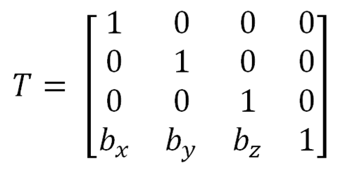

其中bx,by,bz分别表示X轴、Y轴、Z轴的平移分量，正值表示朝轴正向平移，负值表示朝轴负向平移。

在使用4D向量前，我们要规定好：

①[x,y,z,0]表示一个**向量**；

②[x,y,z,1]表示一个**坐标点**。

这样，对于一个坐标点[3,4,5,1]，X轴平移2个单位，Y轴平移-1个单位，Z轴平移4个单位的矩阵运算如下：

而对于向量的话，平移矩阵是对它无效的：

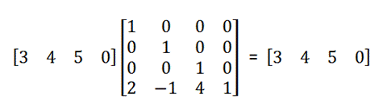

**旋转矩阵**

使用下面的矩阵可以实现坐标点/向量的绕X轴、绕Y轴和绕Z轴的逆时针旋转：

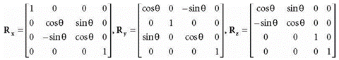

例如，对向量[sqrt(2), sqrt(2), 1, 0]绕Z轴逆时针旋转45°的运算过程如下：

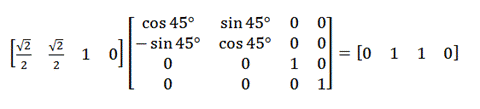

\>注意：旋转矩阵具有正交性，即R^-1 = R^T。

**缩放矩阵**

使用下面的矩阵可以实现坐标点/向量在X轴、Y轴、Z轴的缩放比例：

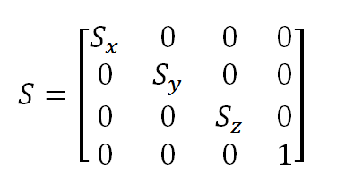

例如，对向量[1,1,2]X方向放大2倍，Z方向缩小为原来的1/2：

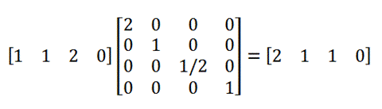

**矩阵的组合变换**

我们可以将前面的三个缩放S、旋转R、平移T矩阵先进行组合乘法，得到新的矩阵SRT。该矩阵可以一次性完成缩放、旋转和平移的操作。后面要实现多种坐标系变换也需要用到这种形式的矩阵组合变换。

**局部坐标系**

为了描述一个物体，我们需要定义这些顶点所在的坐标位置。通常我们对物体的描述是在局部坐标系中进行的，又或者是靠近中心的地方，因为我们并不能确定它在世界中的位置。并且我们将物体的中心定义为局部坐标系的原点，这样可以方便我们对这个物体的坐标进行描述，并确保在经过世界变换后能够准确地将物体放置在对应的位置上。

**世界坐标系 与 世界变换矩阵**

局部坐标系可以有很多个，但是世界坐标系只有一个。世界坐标系的矩阵可以看作一个单位矩阵：

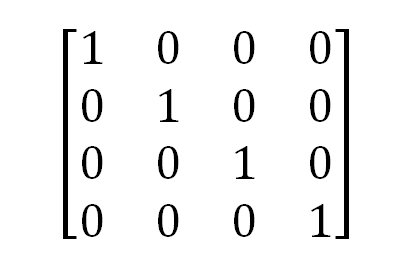

为了把处在局部坐标系的物体搬移至世界坐标系中某个特定的位置，以特定的形式出现，我们需要用到世界变换矩阵（一般是缩放、旋转、平移的组合矩阵）来对物体的每个坐标点进行处理。

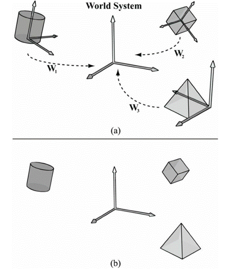

注意：世界变换矩阵并不是唯一的，因为对不同的物体需要使用不同的世界变换矩阵；但是对于同一个物体的所有顶点都要使用一致的世界变换矩阵。

所以一个世界矩阵的形式可能为W = SRT，也可能为如下形式：

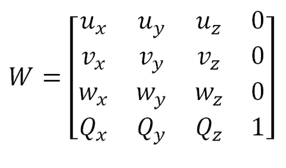

其中，[ux, uy, uz, 0]，[vx, vy, vz, 0]和[wx, wy, wz, 0] 表示局部坐标系三个相互垂直的轴向量（这三个向量的模不一定相等），而[Qx, Qy, Qz, 1]则表示上述坐标轴原点在世界坐标系的位置坐标。这种表示形式的世界变换矩阵也可以理解为局部坐标系在世界坐标系的位置，以及三个轴向量在世界坐标系的表现形式。现在对一个物体进行缩放、顺时针旋转、平移：

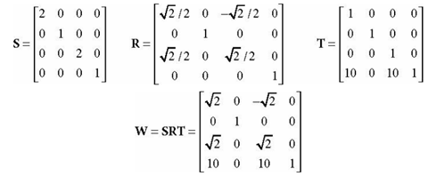

上述形式是已知局部坐标系在世界坐标系的位置，并进行从局部坐标系到世界坐标系的逆变换，当然你也看成对局部坐标系的物体进行了缩放、旋转、平移的变换，两者是等价的。

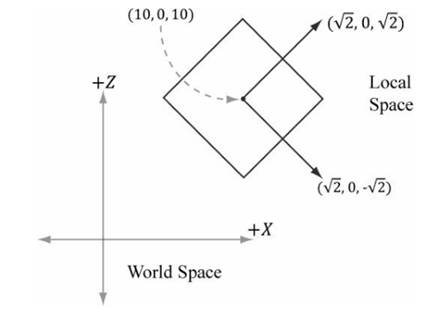

**观察坐标系 与 观察矩阵**

为了获取一个2D图像，我们必须引入虚拟摄像机的概念。一个虚拟摄像机可以看作一个观察坐标系，它也是一个局部坐标系，原点为摄像机的位置，Z轴为摄像机的观察方向，Y轴为摄像机的上方向，而X轴则为摄像机的右方向。

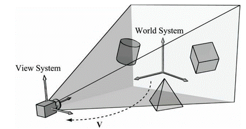

若已知[ux, uy, uz, 0]，[vx, vy, vz, 0]和[wx, wy, wz, 0]为观察坐标系在世界坐标系的三个相互垂直的轴向量，以及[Qx, Qy, Qz, 1]表示摄像机在世界坐标系的位置，那么从观察坐标系到世界坐标系的世界变换矩阵如下：

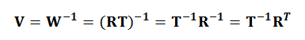

然而，我们想做的并不是这样，而是从世界坐标系转换到观察（局部）坐标系。因此，使用W^-1的矩阵才是上面所说的转换（由于世界坐标系和观察坐标系的三个轴向量的模都为1，这里缩放矩阵S为单位矩阵I，可以忽略）：

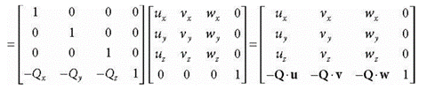

所以观察变换矩阵的形式如下：

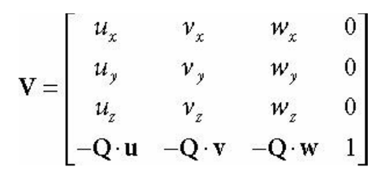

这里的**u**为摄像机的右方向向量，**v**为摄像机的上方向向量，**w**为摄像机的目标视野方向向量，Q为摄像机在世界坐标系的坐标。为了获取一个观察变换矩阵，我们需要提供三个信息：**摄影机在世界坐标系的坐标**Q、**摄影机的焦点坐标**T、**摄影机的上方向向量**j（这里的 **j** 不一定与 **w** 垂直）。所以首先我们需要算出目标视野方向向量**w**：

然后利用 **w** 和 **j** 进行叉乘并标准化，得到摄影机右方向向量 **u** ：

最后利用 **w** 和 **u** 进行叉乘，得到的才是摄影机上方向向量**v**：

**v** = **w** × **u**

由于 **w** 和 **u** 已经都是单位向量了，因此不需要再进行标准化。

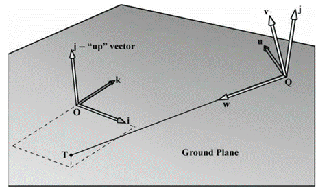

当然，也可以使用下面的函数来获取一个投影矩阵：

XMMATRIX XMMatrixLookAtLH(  *//* *输出视图变换矩阵**V*
     FXMVECTOR EyePosition,      *//* *输入摄影机坐标*
     FXMVECTOR FocusPosition,    *//* *输入摄影机焦点坐标*
     FXMVECTOR UpDirection);     *//* *输入摄影机上朝向坐标*

**投影空间 和 齐次裁剪空间**

现在我们已经来到了摄影机的坐标系所在，但是我们还需要描述摄像机所看到的视野区域，通常它可以被描述为一个截头锥体。

接下来的任务是获取对应的3D的截头锥体并投影到一个2D窗口上。

一个2D窗口通常是一个矩形区域，因此从摄影机发射出的4条射线就可以确定一个四棱锥（其中 中心水平夹角为**β**，中心垂直夹角**α**），并确定**近平面**和**远平面**（物体最近和最远可见距离构成的平面）将两端截掉即为一个截头锥体。

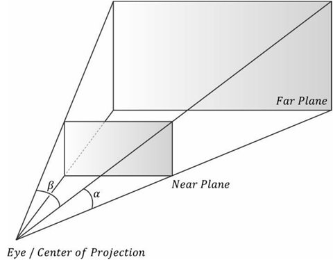

在投影空间中定义一个投影窗口，然后假设投影空间中进行透视投影，发出的射线到物体某处的位置为**v**，而在投影窗口留下的点则为**v'**。

在3D物体的Z坐标将会用于表示为深度属性，深度越大的物体在固定窗口显示得越小，并且还要考虑到离摄像机越近的物体会遮挡后面的物体。

**定义一个截头锥体**

我们可以在观察空间定义一个截头锥体，它的焦点朝向为Z轴，并需要提供四个参数：**近平面距离**n、**远平面距离**f、**中心垂直视野夹角（****FOV****）**α以及**屏幕宽高比** r。对于一个分辨率为 800 × 600的屏幕来说，它的宽高比为 4 : 3 ≈ 1.333。如果分辨率不一致，会导致物体显示失真。

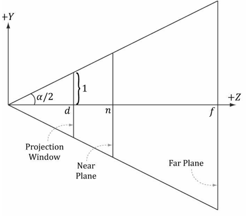

 

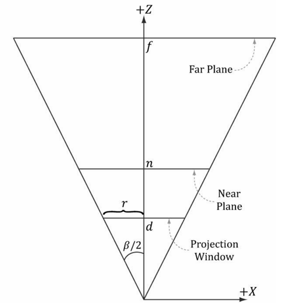

可以看到这里设投影窗口的高度为2（窗口顶部到中心的高度为1），并且摄影机到投影窗口的距离为d。根据宽高比公式可以得到：

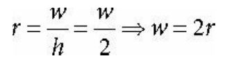

为了用我们已经获得的FOVα来表示，投影窗口需要被放置在距离原点为d的位置：

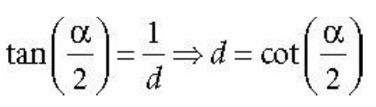

现在我们知道了d的值，并且有宽高比r接下来我们需要获取中心水平夹角β：

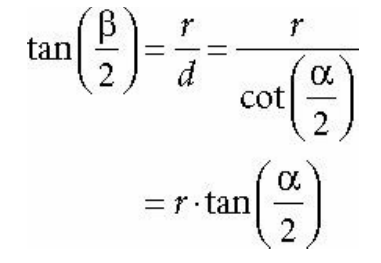

 

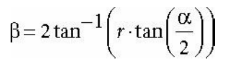

**顶点投影到窗口**

给定一个坐标点(x,y,z)，我们想要找到它在窗口上的投影(x',y',d)。根据对应的比例关系，可以得到：

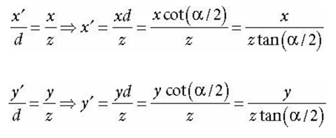

 

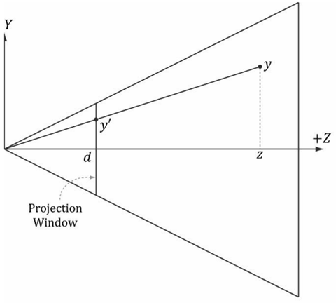

 

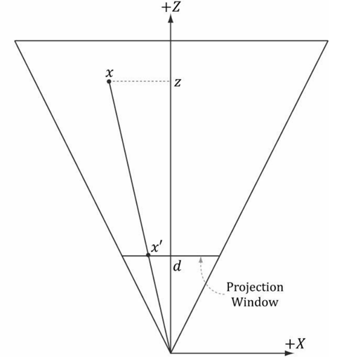

通过观察，我们可以确定一个点(x, y, z)在截头锥体内的取值范围为：

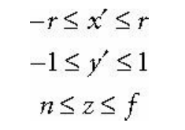

**标准化设备坐标系（****NDC****）**

前面投影窗口的高度为2，宽度为2r，其中r是宽高比。然而，窗口的尺寸取决于宽高比，这意味着我们需要告诉硬件的宽高比，因为硬件在后面还需要做一些涉及投影窗口尺寸（如将其映射到后台缓存）的操作。如果我们能删除对宽高比的依赖，操作会更加方便。

接下来要将x坐标系从区间[-r, r]映射到[-1, 1]，使得x和y坐标变成标准化设备坐标系（NDC）：

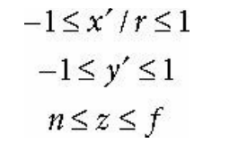

这样在NDC坐标系下，1个NDC单位 等价于 r个观察坐标系的单位（1 ndc = r vs）。在顶点着色器操作之后，能够显示在屏幕上顶点也正是在NDC坐标系的范围内。

**投影矩阵**

由于x'(y')同时受到变量x(y)和z的影响，因此求得的x'和y'的方程都是非线性的。但是我们可以将该式子分离为线性部分和非线性部分。现在我们还需要标准化z坐标系使它映射到区间[0, 1]。考虑下面变换：

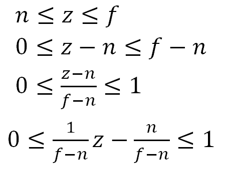

标准化后的z满足线性方程Az + B的形式。我们可以令投影矩阵的[2][3] = 1和[3][3] = 0(从0开始的下标)使得向量在进行矩阵相乘时的w分量复制出一份z出来，这样就相当于给向量放大z倍一样。投影矩阵如下：

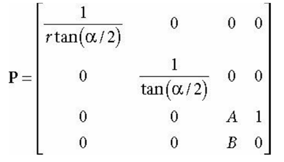

然后我们用坐标点[x,y,z,1]和投影矩阵相乘可以得到：

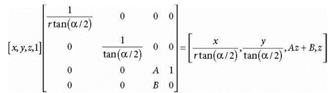

再对向量除以z得到投影变换后的标准化坐标点：

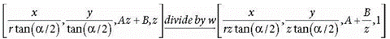

**标准化深度（****Z****）值**

尽管在投影之后，我们可以放弃原来的3D Z坐标，但是我们还需要深度缓冲算法中的深度（Z）信息来判断哪一个物体在前面从而被渲染。Direct3D想要让深度坐标 标准化为区间[0, 1]，因此我们需要用到函数g(z) = A + B/z。当z = n时，g(n) = A + B/n = 0；当z = f时，g(f) = A + B/f = 1。

通过解这两个方程构成的方程组，可以求得：A = f / (f - n) 和 B = -nf / (f - n)。

故最后的方程g(z) = f / (f - n) - nf / (f - n)z。

这样我们就可以得到最终的投影矩阵：

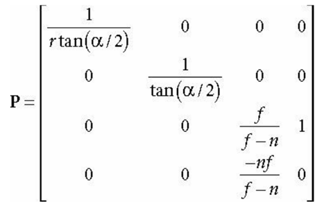

通过下面的函数我们也能够获得一个投影矩阵：

XMMATRIX XMMatrixPerspectiveFovLH( *//* *返回投影矩阵*
     FLOAT FovAngleY,                   *//* *中心垂直弧度*
     FLOAT AspectRatio,                 *//* *宽高比*
     FLOAT NearZ,                       *//* *近平面距离*
     FLOAT FarZ);                       *//* *远平面距离*

**总结**

对于一个在局部坐标系的顶点，先通过世界矩阵的变换使其转换到世界坐标系中，然后通过观察矩阵的变换使得我们来到观察坐标系中，再通过投影矩阵变换来决定观察到的区域，经过对截头锥体的标准化使之最终变成一个立方体区域，从而方便DirectX进行绘制。所以我们可以将世界矩阵W、观察矩阵V和投影矩阵P进行组合，完成顶点从世界坐标系到2D窗口的变换，最终在标准化设备坐标系（NDC）中能够绘制顶点的范围为-1 ≤ x ≤ 1, -1 ≤ y ≤ 1，然后用Z作为深度进行绘制判断。

因为经过了这三个变换后最终会来到2D屏幕空间，所以如果想要在Direct3D中绘制2D，我们可以在顶点着色器中不提供矩阵，直接提供NDC下的坐标从而来对屏幕进行映射，然后让Z设为0到1的任意值即可（如满屏显示的四个2D顶点坐标为(-1, 1), (1, 1), (1, -1)，(-1, -1)。

由于在这里用的时间比较多，还有很多东西没能讲到，有机会的话会再做补充。

 

来自 <<https://www.cnblogs.com/X-Jun/archive/2017/07/26/7241839.html>> 

 
