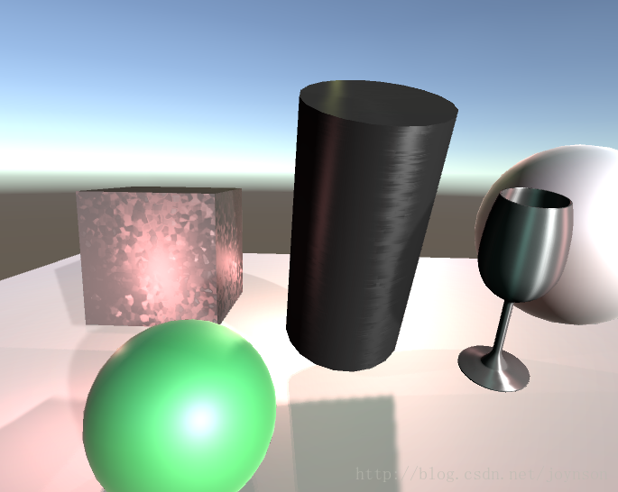
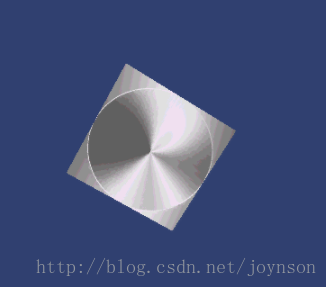
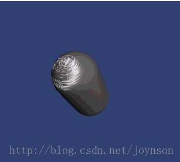
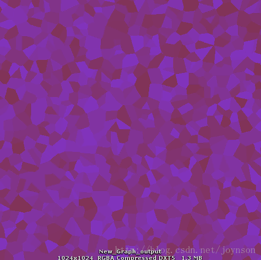
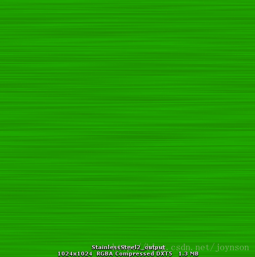
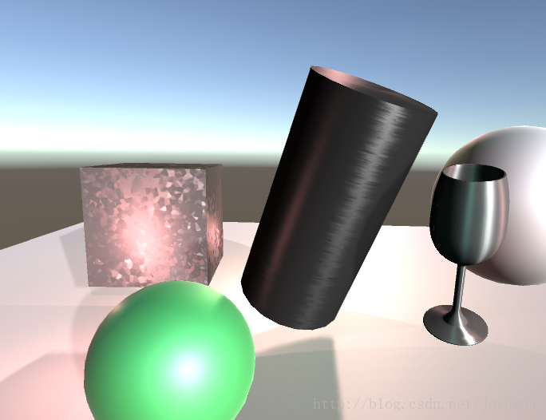
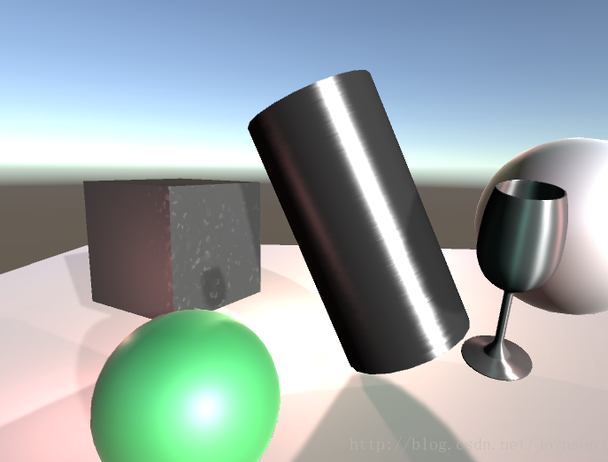

# Unity Shader 之 不锈钢（各向异性材质

**Unity Shader** **之** **不锈钢（各向异性材质）** 

 

 

常见的实现方案

·         **思路：**  
 先求出半角向量halfVector  
 再求法线方向与光照方向的点积NdotL  
 半角向量与各向异性方向点积HdotA  
 求出各向异性：  
 sin(（半角向量与各向异性方向点积+偏移值）的弧度值 * 180)  
 再根据各向异性求出反光强度spec  
 最后与光照颜色等进行整合  

·         **主要代码：** 
 inline fixed4 LightingAnisotropic (SurfaceAnisoOutput s, fixed3 lightDir, half3 viewDir, fixed atten)   
 {   
     fixed3 halfVector = normalize(normalize(lightDir) + normalize(viewDir));//normalize()函数把向量转化成单位向量   
  
 float NdotL = saturate(dot(s.Normal, lightDir));   
  
 fixed HdotA = dot(normalize(s.Normal + s.AnisoDirection), halfVector);   
     float aniso = max(0, sin(radians((HdotA + _AnisoOffset) * 180f)));//radians()函数将角度值转换为弧度值    
  
 float spec = saturate(pow(aniso, s.Gloss * 128) * s.Specular);//saturate(x）函数   如果x小于0返回 0;如果x大于1返回1;否则返回x;把x限制在0-1   
  
 fixed4 c;   
     c.rgb = ((s.Albedo * _LightColor0.rgb * NdotL) + (_LightColor0.rgb * _SpecularColor.rgb * spec)) * (atten * 2);   
     c.a = 1.0;   
     return c;   
  
 } 

  

 

参考链接：<http://blog.csdn.net/wolf96/article/details/41843973> 

**本文的实现方案** 

·         公式：公式采用的是Ward 92年在 Measuring and modeling anisotropic reflection中提出的。  
 各项异性材质是BRDF的一部分， 有关BRDF的论文很多， 这里推荐一篇Physically-Based Shading at Disney by Brent Burley, Walt Disney Animation Studios [Revised Aug 31, 2012. Corrected normalization factor in Equation 4.]， 在这篇论文中还讲到了关于各项异性的几篇文章包括Walter在2005年在 Notes on the Ward BRDF中提出了对Ward各项异性材质公式的一些优化算法， 以及Pacanowski在2012年在Oliver Salazar Celis中提出的关于各项异性材质的新的公式。 有兴趣的童鞋可以试试。  

·         本文中用到的贴图  

 

**Shader****中的主要代码** 

float _Diffuse, _Specular; 
 float _Gloss; 
 float _AnisoX, _AnisoY, _AnisoAngle, _AnisoIntensity; 
 sampler2D _AnisoTexture; float4 _AnisoTexture_ST; 

struct v2f 
 { 
     float4 pos : SV_POSITION; 
     float3 normal : NORMAL; 
     float4 tangent : TANGENT; 
     float4 worldPos : TEXCOORD0; 
     float2 texcoord : TEXCOORD1; 
     LIGHTING_COORDS(3, 4) 
 }; 
  

void vert(in appdata_tan v, out v2f output) 
 { 
     output.pos = UnityObjectToClipPos(v.vertex); 
     output.normal = v.normal; 
     output.tangent = v.tangent; 
     output.worldPos = mul(unity_ObjectToWorld, v.vertex); 
     output.worldPos /= output.worldPos.w; 
     output.texcoord = v.texcoord; 
     TRANSFER_VERTEX_TO_FRAGMENT(output); 
 } 
  

void frag(in v2f input, out float4 c : COLOR) 
 { 
     c.rgb = 0; 
  

float3 lightColor = _LightColor0.rgb; 
     float3 vertPos = input.worldPos.xyz; 
     float3 lightPos = _WorldSpaceLightPos0.xyz; 
     float3 normalDir = normalize(UnityObjectToWorldNormal(input.normal)); 
     float3 tangentDir = normalize(UnityObjectToWorldNormal(input.tangent)); 
     float3 bitangentDir = normalize(cross(tangentDir, normalDir)); 
     float3 anisoDir = normalize(UnpackNormal(tex2D(_AnisoTexture, input.texcoord))); 
     float3 lightDir = lightPos - vertPos; 
     if (_WorldSpaceLightPos0.w<0.001) lightDir = lightPos; 
     float3 b = bitangentDir; 
     float3 t = tangentDir; 
     float3 n = normalDir; 
     //if (anisoDir.z<0.99) 
     { 
         float Pi = 3.141592654; 
         float3 anisoParam = tex2D(_AnisoTexture, TRANSFORM_TEX(input.texcoord, _AnisoTexture)); 
         _AnisoX = anisoParam.r; 
         _AnisoY = anisoParam.g; 
         _AnisoAngle = anisoParam.b * 180; 
  

//t = normalize(anisoDir.x * tangentDir + anisoDir.y * bitangentDir); 
         t = t * cos(_AnisoAngle*Pi/180) + b * sin(_AnisoAngle*Pi/180); 
         n = normalDir; 
         b = normalize(cross(t,n)); 
     } 
     float3 l = normalize(lightDir); 
     float3 v = normalize(_WorldSpaceCameraPos.xyz - vertPos);        

//也是BRDF的一种常用 ，半向量         
     float3 h = normalize(l+v);               
     float3 dotLN = saturate(dot(l,n)); 
     float3 dotHN = saturate(dot(h,n)); 
     float3 dotHT = (dot(h,t)); 
     float3 dotHB = (dot(h,b)); 
     float3 dotVN = max(0.01,dot(v,n)); 

// attenuate 
     float attenuation = LIGHT_ATTENUATION(input); 
  

// diffuse 
     float3 diffuse = dotLN * lightColor * _Diffuse; 
  

// specular 
     float3 specular = pow(dotHN, _Gloss*256) * _Specular * lightColor; 
     specular = _Specular * lightColor *  sqrt(dotLN/dotVN) * exp(-2 * (dotHT*dotHT/_AnisoX/_AnisoX + dotHB*dotHB/_AnisoY/_AnisoY)/(1+dotHN)); 
  

// reflect  
     float3 rv = reflect(-v, n); 
     rv -= t * dot(rv,t); 
     float3 refl = 0; 
     for (int i=0; i<0; i++) { 
         float3 drv = rv + t*i*0.02; 
         refl += UNITY_SAMPLE_TEXCUBE_LOD(unity_SpecCube0, drv, 0); 
         drv = rv -t*i*0.02; 
         refl += UNITY_SAMPLE_TEXCUBE_LOD(unity_SpecCube0, drv, 0); 
     } 
     refl /= 10; 
     //refl =  UNITY_SAMPLE_TEXCUBE_LOD(unity_SpecCube0, reflect(-v, n), 0); 
  

//refl = UNITY_SAMPLE_TEXCUBE_LOD(unity_SpecCube0, rv, 0); 
  

c.rgb = attenuation * (diffuse + specular); 
     \#ifdef UNITY_PASS_FORWARDBASE 
     c.rgb += refl*0.2; 
  

\#endif 
     //c.rgb = attenuation; 
     //c.rgb = sqrt(dotLN/dotVN)/10; 
     //c.rgb = 0; 
  

//c.rgb = specular; 
     //c.rgb = 0; 
     c.a = 0; 
 }  

·         **效果图：**  

 

 

 

来自 <<https://blog.csdn.net/joynson/article/details/77049813>>  

 