# 角色渲染技术——毛发及其他

## **前言**

这是关于角色渲染技术的第二篇，应该也是这个话题的最后一篇。前一篇关于皮肤的渲染方法[可见这里](https://zhuanlan.zhihu.com/p/27014447)。

实际上为了逼真地还原一个角色，除了渲染技术外，在很多游戏中还使用了动画、物理仿真等其他方面的技术，这些技术也非常重要。譬如今年的《地平线：零之黎明》这个游戏给我的感觉就是角色渲染的不如前两年的《教团1886》看着自然，但如果静帧去看的话，显然前者在渲染技术的角度讲也完全不输给后者。我猜大概是因为动捕演员在演绎的时候表情略显浮夸或者是整个动画工具链不如《教团1886》来的好。当然这就属于我不懂的领域了，也希望哪位有AAA游戏从业经验的TA或者相关朋友能给我解释解释。

回到渲染话题本身，这一篇我会试着总结一些除皮肤外其他的一些角色渲染技术，其中以毛发渲染为主，而涉及毛发的仿真相关因为我不太了解，这里也就不强行展开，只把自己看过还有印象的几篇文章[1][2][3]列在这里。

## **各向异性材质**

关于各向异性光照的产生原理在[这里](https://link.zhihu.com/?target=http%3A//www.bluevoid.com/opengl/sig00/advanced00/notes/node159.html)有一个比较清楚的解释。简单的来说，某些材质上有一些微观上有方向的细丝，这些细丝在我们宏观的角度来看是不易察觉的，典型的有光盘的背面或者是头发。也就是我们这里要引入的**strand-based anisotropic lighting**的概念。

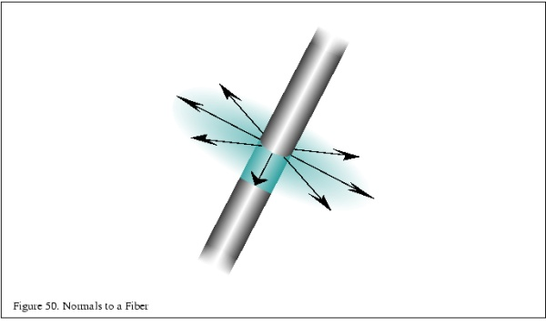

strand based anisotropy是对上述光照情形的一种建模，我们可以把这种微观的细丝看成**直径非常小长度很长的圆柱****那么我们宏观上看到的这类表面上某一点的光照实际上是一圈圆柱上的点的光照的总和**

![[公式]](Character_rendering_Hair.assets/equation.svg)

其中![[公式]](Character_rendering_Hair.assets/equation.svg)是BRDF，L是和法线方向无关的入射光强，![[公式]](https://www.zhihu.com/equation?tex=V%28%5Ctheta%29)是和角度相关的可见性。

其中![[公式]](Character_rendering_Hair.assets/equation.svg)这部分的积分很像我们上一篇提到过的**bent normal**的概念。那么进一步地，假如我们能够通过预积分算出这种情形下的bent normal，那上面这个式子就能进一步近似成这样：

![[公式]](https://www.zhihu.com/equation?tex=k%2A%5Crho%28l%2C+v%2Cn_%7Bbent%7D%29+%2A+L%2A%28l%5Ccdot+n_%7Bbent%7D+%29)

这里![[公式]](https://www.zhihu.com/equation?tex=n_%7Bbent%7D)就是我们预积分出来的那个方向，那么这个方向到底是哪里呢？**由于整个半圆形都在一个法线平面上，如果假设光照方向向量投影在该平面的向量是![[公式]](Character_rendering_Hair.assets/equation.svg)，那么整个半圆上所有法线应该是对称地分布在![[公式]](Character_rendering_Hair.assets/equation.svg)两侧，所以![[公式]](Character_rendering_Hair.assets/equation.svg)和![[公式]](https://www.zhihu.com/equation?tex=n_%7Bbent%7D)方向应该相同**。假定细丝延伸的方向为![[公式]](Character_rendering_Hair.assets/equation.svg)，那么![[公式]](Character_rendering_Hair.assets/equation.svg)，![[公式]](https://www.zhihu.com/equation?tex=n_%7Bbent%7D)和![[公式]](Character_rendering_Hair.assets/equation.svg)这三者是共面的！并且![[公式]](https://www.zhihu.com/equation?tex=n_%7Bbent%7D)和![[公式]](Character_rendering_Hair.assets/equation.svg)相互垂直，这样，我们就可以用简单的平面三角函数来得到：

![[公式]](Character_rendering_Hair.assets/equation.svg)

类似地，

![[公式]](Character_rendering_Hair.assets/equation.svg)

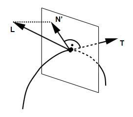

**因此我们用细丝的延伸方向![[公式]](https://www.zhihu.com/equation?tex=t)去代替法线方向![[公式]](https://www.zhihu.com/equation?tex=n_%7Bbent%7D)来进行各向异性的光照计算**，。

上面关于为什么用切线代替法线去计算光照的解释只是我的个人理解，包括数学推导肯定也有一些错误，只是希望通过一个不同的角度（bent normal）来试着合理解释我们为什么在这里用切线。一个更加简单的解释是，**我们认为微观上和光照方向点积最大的那个法线方向就是我们最终参与到光照计算的宏观法线**，**我们能够通过美术制作规范使其和几何模型的切线方向相垂直**，因此也就能够使用切线去替代这个法线进行相应的光照计算。

## **Kajiya-Kay毛发渲染模型**

基于刚才说的strand-based model，这里我们就要引出一个这些年来游戏中用到的最多的毛发渲染模型：**Kajiya-Kay模型**[4]。计算公式如下：

![[公式]](Character_rendering_Hair.assets/equation.svg)![[公式]](https://www.zhihu.com/equation?tex=specular+%3D+K_%7Bs%7D%28%28t%5Ccdot+l%29+%2A%28t%5Ccdot+e%29%2Bsin%28t%2C+l%29+%2Asin%28t%2C+e%29%29)![[公式]](https://www.zhihu.com/equation?tex=diffuse+%3D+K_%7Bd%7D%2Alerp%280.25%2C+1.0%2C+n%5Ccdot+l%29)

具体的实现在slides里面有详细的描述，这里只简单总结一下它相较于原始模型的改进：

（1）把diffuse改成了我们在之前的[卡通渲染中提到的wrapped diffuse](https://zhuanlan.zhihu.com/p/26409746)，这是因为传统的Kajiya-Kay的diffuse项太亮，没有考虑毛发的自阴影（也就是没有考虑我们一开始说到的![[公式]](Character_rendering_Hair.assets/equation.svg)）。

（2）头发的高光项改写成了两层高光，其中一层高光是有颜色的，另外一层高光是没有颜色的，且两层高光的相互错开一点点，这个双层高光的设定是基于实际的观察：

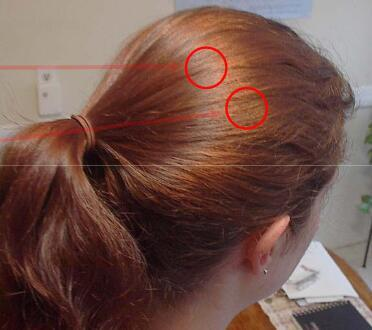

上图可以明显看出两层高光，其中发白的一层是没有颜色的，另外发黄的一层是有颜色的高光，至于为什么会有两层高光，我会在后面的内容里具体做解释，这里可以简单的认为就是基于经验观察。

上面已经说过，双层高光是相互错开的，如果使用同样的切线，那么这两层高光一定会彼此重合，为了防止这种情况发生，我们在计算两层高光时会基于原始的切线方向给予其不同程度的偏移量，这实际上也相当于操作了整个切线场（**回忆一下我在第一篇有关卡通渲染技术中提到的风格化的高光，其中一个操作符就是偏移高光的位置，使用的方法就是沿着切线方向去偏移法线，而这里用到的方法非常类似，只是变成了沿着法线方向去偏移切线**），具体方法：

![[公式]](Character_rendering_Hair.assets/equation.svg)

对于两层高光，shift应该设定为不同的值，但如果对于同一层高光来说，shift是一个固定值就会导致头发高光区域的边缘非常整齐，没有那种锯齿状的感觉。

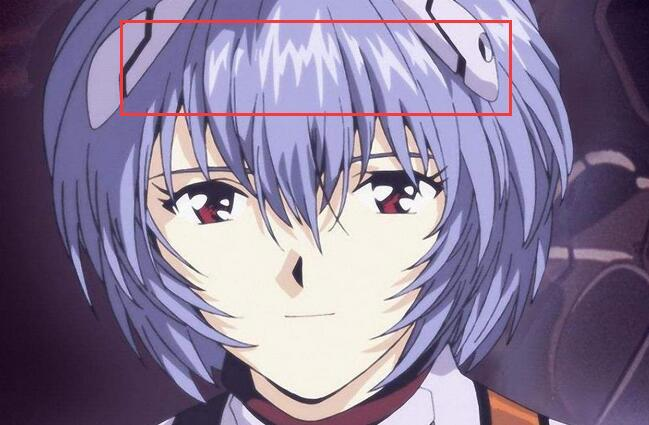

如图，很多漫画中角色头发上的高光区域的边缘就有很明显地不规则状锯齿，这也是对现实世界的观察得到的。

因此，我们需要一张**切线扰动图（shift texture）**，类似这样：

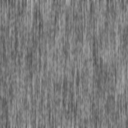

在此基础上进行扰动：

![[公式]](Character_rendering_Hair.assets/equation.svg)

我们都知道，毛发这种边缘半透明且双面的材质是不能使用简单的alpha-test来渲染的，因为这样会使得毛发边缘看起来非常的粗糙，所以我们要在尽可能地保证顺序正确的情况下使用alpha-blend，为此，[5]提到了一个比较简单但能够大致保证半透明混合顺序正确的方法：

（1）开启Z-Write ，Z-Test模式为less，剔除背面的三角形，绘制头发完全不透明的部分（使用alpha test的模式，关闭color buffer的写入）

（2）关闭Z-Write，Z-Test模式为equal，剔除背面的三角形，再次绘制完全不透明的部分（仍然使用alpha-test模式，这次写color buffer）

（3）关闭Z-Write，Z-Test模式改less，剔除正面的三角形，先绘制头发的背面（使用alpha blend的模式）

（4）开启Z-Write ，Z-Test模式改less，剔除背面的三角形，绘制头发的正面（使用alpha blend的模式）

这里大致的思路是：先画不透明的头发，然后画背面半透明的，最后画正面半透明的。这样能大致保证一个正确的半透明绘制顺序，对于头发这样的半透明材质基本就够了。KlayGE也用了[类似的方法](https://link.zhihu.com/?target=http%3A//www.klayge.org/2011/11/29/klayge-4-0%e4%b8%addeferred-rendering%e7%9a%84%e6%94%b9%e8%bf%9b%ef%bc%88%e4%b8%89%ef%bc%89%ef%bc%9a%e9%80%8f%e6%98%8e%e7%9a%84%e7%83%a6%e6%81%bc/)[6]去处理半透明材质的绘制。需要特别说明的是步骤（1）（2）原本是可以合并在一起做的，之所以拆开先写深度，再写颜色，是利用了大部分显卡都有的**Early-Z Culling的特性**：显卡的深度比较和剔除会根据情况选择在pixel  shader之前执行还是在pixel shader之后执行，一般来说如果在pixel  shader里面没有对片元深度进行修改的话，深度比较和剔除就会发生在pixel shader之前，也就是我们说的Early-Z，如果pixel  shader里对片元的深度进行了修改，那么深度比较和剔除就必须在pixel  shader之后执行，就是所谓的Late-Z。Early-Z的好处是没通过深度测试的片元就不再执行pixel  shader了，因此没有特殊情况最好不要在pixel shader里修改片元的深度。**除此之外，关闭color buffer的写入只修改z  buffer会比同时写入color buffer和z buffer快2-4倍（少写一张RT并且pixel  shader不需要执行光照计算，只需要做alpha-test即可），这也是我们常说的使用z-prepass的前向渲染管线的原理**。

基于Kajiya-Kay模型的毛发渲染至今仍然在游戏中大量的使用，它的优点是计算性能也比较好，缺点是整个模型仍然是一个经验公式，并不太符合近年来基于物理渲染的概念，也无法做到能量守恒。

## **Marschner’s Model**

我们上面讨论的Kajiya-Kay Model类似于Phong Model，是一个经验公式，没有太多物理含义在内，只能保证一个大致上的视觉正确，而Marschner's Model则是基于头发纤维的结构，进行了相对准确的物理分析并得出的计算方法。

头发纤维从微观角度来看，实际上是一个从外到内有很多层的结构，它的最外层像鳞片一样（很像我们在微表面理论中看到的那种粗糙的表面），光线在穿过层层头发纤维内部的过程中也会发生折射，反射等，因此我们看到的最终头发呈现的颜色实际上是多条光路综合作用的结果。

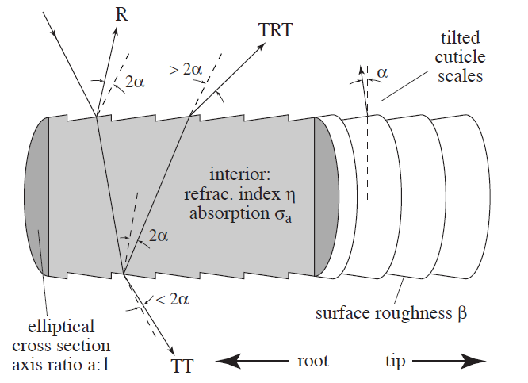

在文章[7]中，作者在分析头发渲染时考虑了光照贡献最大的三条光路：**R，TT和TRT，其中R表示反射，T则表示透射，和我们在皮肤渲染中使用一样的定义**

基于这个微观模型，作者又进一步根据几何光学分析了光线在某一个光路上的行为，并把这个行为具体的分成了两类，即纵向散射（longitudinal scattering）和方位角散射（azimuthal scattering）。

纵向散射是沿着头发生长方向的散射，对于一个光滑的圆柱体来说，给定入射方向，反射方向是确定的，如下图，但是头发纤维的表面是比较粗糙的，因此并不会发生精确的镜面反射，于是我们就需要一个函数来估计在给定的出射方向（观察方向）上，到底有多少比例的光线射出。这个函数和入射、出射方向有关，我们用![[公式]](https://www.zhihu.com/equation?tex=M%28%5Ctheta_i%2C+%5Ctheta_r%29)**这个函数除了和入射、出射方向投影在圆柱法平面的方位角有关，还和头发内部的折射率有关**![[公式]](Character_rendering_Hair.assets/equation.svg)

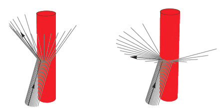

纵向散射的示意图，左图是针对光滑圆柱，右图是针对粗糙圆柱。 

根据刚才的光路分析，我们知道，R，TT和TRT任一一种光路实际上可能既包含了纵向散射，又包含了横向散射，所以可以进一步得出头发上某一点的BSDF：

![[公式]](Character_rendering_Hair.assets/equation.svg),

其中![[公式]](Character_rendering_Hair.assets/equation.svg)

对于某种头发来说，其折射率是固定的，因此实际上和头发渲染有关的参数只有四个，就是我们上面说到的四个角度，而这四个角度在实时渲染的时候都是能够算出来的，因此我们可以把M和N分别预计算成两张查找表，然后用角度作为参数（实际计算时用角度的正弦或者余弦值代替角度）直接查找得到Mp和Np的值。如果按照正常存储，共需要6张贴图，但我们之前说过，**M实际上类似于一个粗糙表面反射的概率分布函数，因此它是和波普无关的单通道的值，而Nr,Ntt,Ntrt中，Nr是单通道的（因为没有发生介质的吸收，只有菲涅尔效果和方位角的概率分布影响），而Ntt和Ntrt则是三通道的**。根据[2]的实现，Mr，Mtt和Mtrt被存进了第一个LUT中，同时假设Ntt=Ntrt，这样Nr和Ntt存在了第二张图里，共计用了两张LUT。而Mp和Np的具体计算可参见原文和[这篇文章](https://link.zhihu.com/?target=https%3A//hairrendering.wordpress.com/tag/marschner/)[8]。

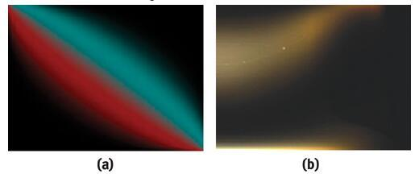

在Marschner‘s  Model的基础上，后来又有人提出了能量守恒的头发渲染模型[9]，其整个光路的分析和BSDF函数的分解思路沿用了Marschner's  Model的概念，还是分解成了横向散射和方位角散射，只是它进一步归一化了Mp和Np两个函数，并且加入了TRRT，TRRRT等多次反射的光路。

## **眼球的渲染**

眼球的相关渲染技术我在打算写这篇文章前不久才补习了一下。对于大部分游戏中的角色渲染来说，皮肤和毛发的渲染技术已经足够覆盖用到的场景。当然近年来越来越流行所谓电影化的游戏概念，追求CG级别的过场动画等，因此这方面的渲染也可以单独拿出来分享一下。当然，照例我们还是先简单解释一下整个眼球的解剖学结构：

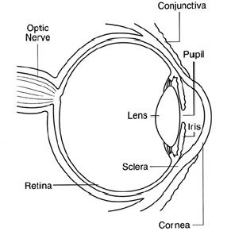

上图来自于[CryEngine有关眼球渲染的文档](https://link.zhihu.com/?target=http%3A//docs.cryengine.com/display/SDKDOC2/Eye%2BShader)**角膜（cornea）****，虹膜（iris）和巩膜（sclera）**

根据简单的解剖结构分析，我们就知道要渲染好眼睛，需要着重实现的效果包括了**角膜的半透和光泽反射效果**，**瞳孔的次表面散射**，**瞳孔的收缩和放大（最好是根据整个场景的光照强度来控制）**以及**虹膜颜色的变化**。

**角膜的半透和光泽反射**

**瞳孔的次表面散射**

如我们前面所说，瞳孔本身实际上也是一个高低不平的结构，这种结构就导致我们在观察人的眼球的时候，是能够看出瞳孔纵深感的，也就是说瞳孔不是直接贴合在角膜上，而是有一定距离，就像我们小时候玩的玻璃球里面的彩色部分一样。同时，当光线到达瞳孔表面的时候，还会进一步在瞳孔结构内部发生次表面散射。文章[11]着重分析实现了这个部分。

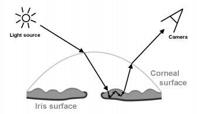

文章[11]把眼球看成了一个双层结构，外面一层是角膜，里面一层是瞳孔的表面，而角膜和瞳孔之间我们可以认为是充斥了某种透明液体。光线在进入瞳孔组织的内部前，首先会在角膜的表面发生一次折射，然后进入瞳孔组织的内部，产生散射，最后从瞳孔表面的另一个点散射出来。这里就涉及到了两个问题：（1）一束射到角膜表面的光线在经过折射后，如何计算最终入射到瞳孔表面的位置；（2）光线进入角膜内部后，如何计算其散射效果。

为了解决这两个问题，文章引用了另一个称之为““Subsurface texture mapping”[12]的方法，这个方法旨在解决多层厚度不均匀的材质的次表面散射效果的计算。

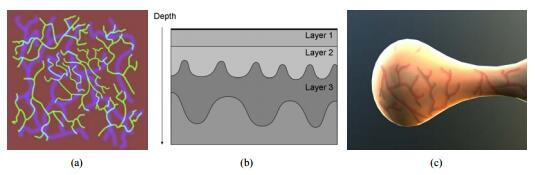

如上图，每一层材质都有一个单独的深度图，保存在一个通道里，然后每一层单独的材质被认为是均匀的，拥有相同的散射、吸收系数以及相应的相位函数（散射相关的参数）。然后，以视线和第一层材质的交点为起点，沿着视线方向对多层材质进行ray-marching，每行进一步就根据位置和深度图计算当前点位于材质的哪一层，对应什么散射参数，再根据上一步的位置以及光照方向计算散射和吸收，直到ray-marching结束。具体到眼球的散射计算，实际上只有一层散射材质，即瞳孔材质。因此我们只需要提供瞳孔表面的深度图，并设定好瞳孔材质的相关散射参数，再结合[12]的方法计算即可。

[11][12]总体来说没有太多新鲜的内容，主要是结合了我们在游戏中常用的两个技术，即relief  mapping（或者parallax mapping）和participating media  rendering两个技术，前者就是我们常说的视差贴图，可以通过ray  marching的方法结合一张深度图在相对平坦的几何表面上实现视觉正确的高低起伏效果，法线效果虽然也能在平面上产生凹凸起伏，但在比较斜的视角下平面还是平面，视差贴图则不会这样。

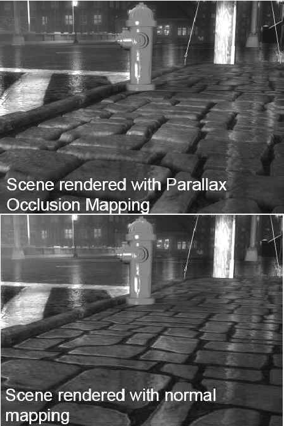

而participating media rendering则在近年来广泛地被应用在体积光、云彩和天空相关的渲染技术中，关于散射和介质渲染的内容，我会在今后的文章里再做分享。

**瞳孔的收缩以及虹膜的颜色**

这个部分就比较tricky，比如瞳孔的放大和收缩可以通过控制采样瞳孔贴图的UV来实现，虹膜的颜色则可以首先给定一个虹膜纹理的灰度图，然后用给定虹膜颜色乘以灰度颜色，即可得到最终虹膜的颜色，这样可以通过一套资源来实现不同颜色的眼球的渲染。

有关上述几种效果的对比图这里就不贴出来了，感兴趣可以去浏览[CRYENGINE的文档](https://link.zhihu.com/?target=http%3A//docs.cryengine.com/display/SDKDOC2/Eye%2BShader)。其中有些对比图的效果差异很小，基本上就像是玩大家来找茬。。。根据上面的渲染方案分析来看，想要实现一套逼真的眼球渲染开销不低，所以一般来说这方面的技术只在一些端游和主机游戏中能够见到，当然像是角膜的半透明和反射的效果，还是可以在手游上跑一跑的。。。

**一点补充：**

关于皮肤和眼球的渲染这里还有一篇非常详尽的slides[13]，感谢

[@Rikii](https://www.zhihu.com/people/9de5672e5217d47a8369835f18bcf084)

的补充，其中比较详尽地涵盖了角色渲染领域我们提到过的关键技术中的大部分（**次表面散射，皮肤半透和眼球渲染****不是基于ray－marching而是一个更简单的近似**[个人网站](https://link.zhihu.com/?target=http%3A//www.iryoku.com/)[作者的github](https://link.zhihu.com/?target=https%3A//github.com/iryoku/)

作为总结再附上作者的另外两篇[14][15]文章分享给大家，前一篇也是很有干货的角色渲染技术总结，另外一个是我本来打算在上一篇文章中分享的wrinkle map，简单说就是如何实现动态的皱眉头等皮肤褶皱效果，因为记性不好，经

[@Rikii](https://www.zhihu.com/people/9de5672e5217d47a8369835f18bcf084)

 同学提醒才想起来原打算分享的这几篇内容，关于wrinkle map的实现我就偷懒不再展开详细解释了，感兴趣的同学可以去看GPU Pro2上的相关文章。

## **总结**

从这个系列的上一篇开始我依次概述了皮肤、头发和眼球的渲染，基本涵盖了角色渲染的内容，这三者看起来在渲染技术上差别比较大，但也有一个相当重要的共同点：**它们作为所谓的有机材质，不同于我们一般渲染的材质，都拥有比较复杂的多层结构。光线作用于这类有机材质时，往往会在多层之间同时发生反射，散射等一系列的现象，**因此针对这类材质的渲染分析也往往会涵盖各种类型的光线路径。我们想要逼真地还原这类材质的真实效果，对相关材质的解剖结构或者微观结构最好有一些简单的了解，这也能让我们更容易地从整体上理解相关算法的原理。

## **引用**

[1] [爱丽丝的发丝──《爱丽丝惊魂记：疯狂再临》制作点滴](https://link.zhihu.com/?target=http%3A//www.cnblogs.com/miloyip/archive/2011/06/14/alice_madness_returns_hair.html)

[2] Hubert Nguyen, William Donnelly. GPU Gems 2, [Hair Animation and Rendering in the Nalu Demo](https://link.zhihu.com/?target=https%3A//developer.nvidia.com/gpugems/GPUGems2/gpugems2_chapter23.html)

[3] Sarah Tariq, Louis Bavoil. Real-Time Hair Simulation and Rendering on the GPU

[4] J. Kajiya, T. Kay. Rendering fur with three dimensional textures

[5] Thorsten Scheuermann. Game Developer Conference, 2004. Hair Rendering and Shading

[6] [KlayGE 4.0中Deferred Rendering的改进（三）：透明的烦恼](https://link.zhihu.com/?target=http%3A//www.klayge.org/2011/11/29/klayge-4-0%e4%b8%addeferred-rendering%e7%9a%84%e6%94%b9%e8%bf%9b%ef%bc%88%e4%b8%89%ef%bc%89%ef%bc%9a%e9%80%8f%e6%98%8e%e7%9a%84%e7%83%a6%e6%81%bc/)

[7] Stephen R. Marschner, Henrik Wann Jensen, etc. Light Scattering from Human Hair Fibers 

[8] [Marschner | Real - Time Hair Simulation and Rendering ](https://link.zhihu.com/?target=https%3A//hairrendering.wordpress.com/tag/marschner/)

[9]  Eugene d’Eon, Guillaume Francois, etc. Eurographics Symposium on  Rendering 2011. An Energy-Conserving Hair Reflectance Model 

[10] [Eye Shader - CRYENGINE Manual - Documentation](https://link.zhihu.com/?target=http%3A//docs.cryengine.com/display/SDKDOC2/Eye%2BShader)

[11] Guillaume François, Pascal Gautron, Gaspard Breton, Kadi Bouatouch. Anatomically Accurate Modeling and Rendering of the Human Eye

[12] Guillaume Fran¸cois, Sumanta Pattanaik, etc. Subsurface Texture Mapping

[13] Jorge Jimenez, etc. Advances in Real-time Rendering in Game Course. Separable Subsurface Scattering and Photorealistic Eyes Rendering.

[14] Jorge Jimenez, Javier von der Pahlen. Next-Generation Character Rendering

[15] Jorge Jimenez, Jose I. Echevarria. GPU Pro2. [Practical and Realistic Facial Wrinkles Animation](https://link.zhihu.com/?target=http%3A//www.iryoku.com/wrinkles/)

编辑于 2017-06-26