# 角色渲染技术——皮肤

## **前言**

游戏中的角色渲染技术随着近几年来硬件机能的增长已经被大范围的应用在了各类AAA大作中，本文会取一些游戏为例，分类概述游戏中的角色渲染技术。由于整个角色渲染的话题会比较长，这个主题会用两篇来阐述，第一篇主要讨论有关角色皮肤的渲染，第二篇会着重讨论角色毛发和其他的渲染。

## **次表面散射**

当光线从一种介质射向另外一种介质时，根据其行进路线，可以被分为两个部分：一部分光线在介质交界处发生了反射， 并未进入另外一种介质，另外一部分光线则进入了另一种介质。反射部分的光照的**辐射亮度（radiance）**和入射光照的**辐射照度（irradiance）**的比例是一个和入射角度、出射角度相关的函数，这个函数就被称之为**双向反射分布函数（BRDF）**。相应的，穿越介质的那部分光照的辐射亮度和辐射照度的比例就被称之为**双向透射分布函数（BTDF）**。这两部分出射光的辐射亮度总和和入射光的辐射照度的比例就被叫做**双向散射分布函数（BSDF）**，即**BSDF = BRDF + BTDF**。


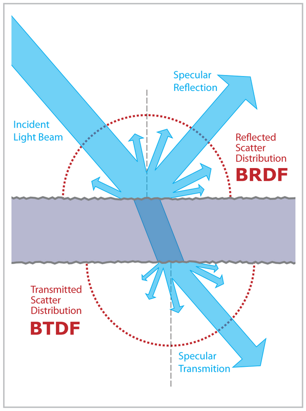

双向散射函数


如果我们把光线行进的路线分为反射和透射，反射用R表示，透射用T表示，那么光线从一个点到另外一个点之间行进的路线就可以用R和T表示，比如BRDF描述的路径就是R，BTDF描述的路径就是TT，除此之外可能还会出现TRT，TRRRT等光照路线，**由此我们可以想见，在光线入射点的附近应该有许多的出射光线**。实际渲染中，如果光线出射点的位置和入射点相距不足一个像素，我们就认为入射点和出射点位置相同，这时候**当前像素的光照只受其自身影响**；如果入射点和出射点相距超过一个像素，则表示**某个像素的光照结果不仅仅受当前像素影响，同时还受附近其他像素的光照影响，这就是我们常说的次表面散射效果了**。


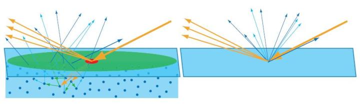

《Real-Time Rendering》一书中对次表面散射的阐释。红色区域表示一个像素的大小，当出射光线集中分布在红色区域内时，则认为次表面散射效果可以忽略，当出射光线较为均匀地分布在绿色区域内时，则需要单独考虑次表面散射效果。


## **皮肤的实时渲染原理**

皮肤是一个多层结构，其表面油脂层贡献了皮肤光照的主要反射部分，而油脂层下面的表皮层和真皮层则贡献了主要的次表面散射部分。


根据观察[1]，次表面散射的光线密度分布是一个各向同性的函数，也就是说**一个像素受周边像素的光照影响的比例只和两个像素间的距离有关**。这个密度分布函数在有些地方称为**diffusion profile**，用R(r)来表示。实际上所有材质都存在次表面散射现象，区别只在于其密度分布函数R(r)的集中程度，如果该函数的绝大部分能量都集中在入射点附近（r=0），就表示附近像素对当前像素的光照贡献不明显，可以忽略，则在渲染时我们就**用漫反射代替**，如果该函数分布比较均匀，附近像素对当前像素的光照贡献明显，**则需要单独计算次表面散射**。据此次表面散射的计算可以分为两个部分：

（1）对每个像素进行一般的漫反射计算。

（2）根据diffusion profile和（1）中的漫反射结果，加权计算周围若干个像素对当前像素的次表面散射贡献。 

**由此可以简单地理解为diffusion profile就是一张权重查找表，不同的皮肤渲染方法，通常就是对diffusion profile的不同近似**。我们根据加权计算所在的空间，将皮肤的渲染方法分为**图像空间的方法**和**屏幕空间的方法**两类。

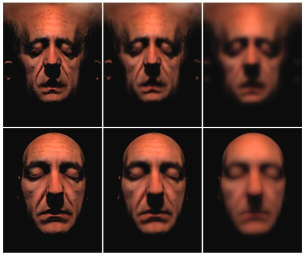


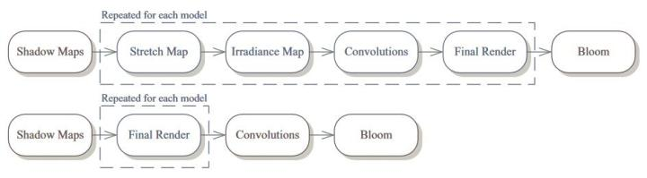

  同一个diffusion profile在图像空间和屏幕空间的irradiance  map效果和渲染结构对比示意图。由于图像空间内一般像素计算负担较大（计算复杂度和模型个数正相关），并且针对每一个次表面散射效果的模型都需要若干张贴图，显存开销也较大。而屏幕空间的计算复杂度和模型个数无关，且只需要一张屏幕大小的贴图，因此目前主流方案均采用屏幕空间的次表面散射。

## **图像空间的方法**

**图像空间的方法**一般会将模型在其贴图空间内展开，具体来说一般有三步：

（1）在顶点着色器中**将模型的UV坐标作为屏幕位置输出**，同时输出模型每个顶点的世界坐标位置，在像素着色器中对每个像素进行漫反射光照的计算（如有阴影则需要将阴影考虑在内），得到所谓的**irradiance map**。 

（2）对irradiance map进行一次或多次卷积操作，每次的卷积核由diffusion profile来确定，并生成若干张卷积后的图像。（可能需要多个pass来完成）

（3）将卷积操作后的图像每个像素的值作为次表面散射的结果，再结合镜面反射（specular reflectance）计算出像素的最终颜色。


图像空间的算法示意图 

 **基于高斯模糊的近似**


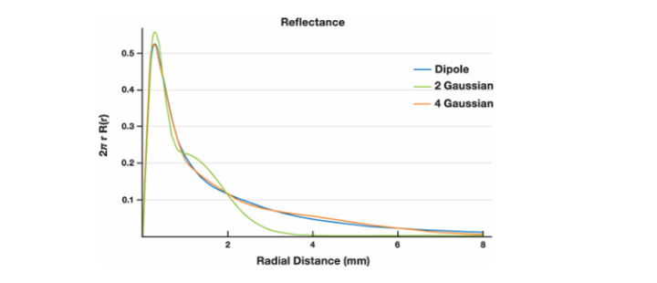

上图是一种称之为**dipole approximation**


[2]是一个标准的图像空间的做法，关于[2]中的方法，值得一提的是关于接缝的处理和irradiance的计算。

图像空间的做法产生的一个问题就是接缝，由于UV总会有缝合的位置，因此在缝合处必定会因为高斯模糊而混入背景颜色（比如下图是黑色）：


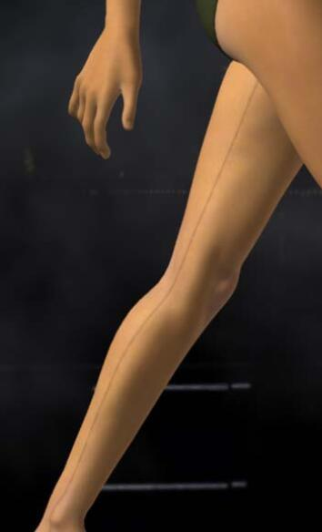

修正这个现象的一个方法是修改背景色（在graphics API中修改clearColor的颜色值），将clearColor的颜色设定为接近皮肤的颜色，这样在混合的过程中就不容易出现明显的接缝。


在irradiance map的计算过程中，比较常用的做法就是直接用dot(N, L) * diffuseColor作为irradiance的值，然后对其进行模糊作为最终的散射颜色，[2]采用了模糊前加模糊后的值作为最终的计算结果，类似这样：

![[公式]](Character_rendering_skin.assets/equation.svg)


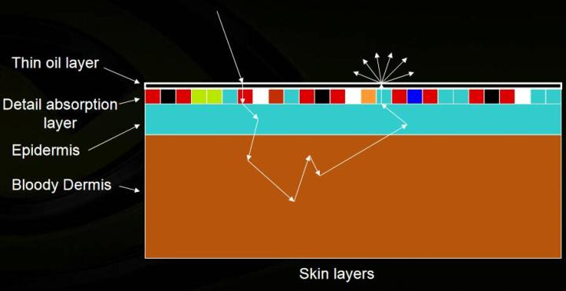

**更快速简洁的近似**


[2]能够实现非常不错的效果，  但从算法分析来看效率比较差，存储开销也很高。对每个模型的绘制来说，需要一个irradiance  map的pass，五次高斯模糊操作（一个二维高斯模糊再拆分为两个一维高斯模糊，相当于10个pass），再加上最终合成的pass，总计就需要1+10+1=12个pass，并且每个pass中都有相当大量的采样操作。方法[3]在[2]的基础上进行了算法的改进，具体来说，[3]主要改进了两个部分：

（1）简化diffusion profile，卷积操作的采样数大幅减少，从每个像素10 * 7（每个高斯模糊pass用到7个sample）= 70个采样降低到了12个采样，并且这12个采样在一个pass中完成（原来需要10个pass完成）。

（2）减少了irradiance map中无效像素的数量，这里用到的技巧是，如果dot(N, V) < 0，则表示该像素位于视角背面，也就是不可见的，就不需要对其进行光照的计算，据此，[3]的方法中输出的屏幕坐标为：

(u, v, dot(N, V) * 0.5 + 0.5)，

在对irradiance   map进行clear操作时，可以设定depth的clear值为0.5，并将depthTest的方法设置为GEQUAL，这样，只有朝向摄像机的像素才会被渲染，其余被剔除（相当于利用可编程管线配合深度测试实现了背面剔除的效果）。在模糊的pass中，则只对可见像素进行采样和加权。这样就进一步减少了采样数。

方法[3]的性能较之于[2]有大幅度提高，因此被顽皮狗运用在了他们《神秘海域2》的过场动画中[4]。但根据我实现后效果对比来看，[3]的效果较之于[2]还是有比较明显的差异，因此只能说是牺牲了效果实现了游戏中要求的实时性。

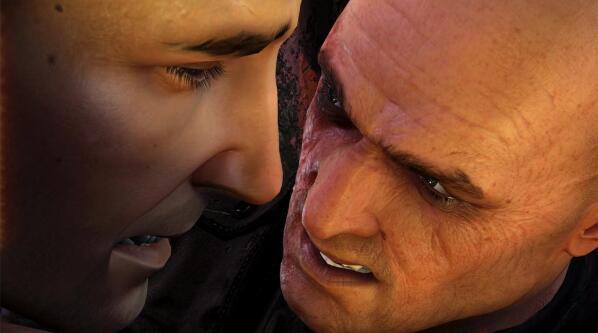

## **屏幕空间的方法** 

**屏幕空间的方法**类似于图像空间的方法，只是计算irradiance时输出的位置不是UV坐标**而是模型的投影坐标**，**此外还需要将屏幕空间中属于皮肤的材质的像素用stencil buffer标记出来**，然后对标记出的皮肤材质进行若干次卷积操作，卷积核的权重由diffusion profile确定，卷积核的大小则需要根据当前像素的**深度（d(x,y)）及其导数（dFdx(d(x,y))和dFdy(d(x,y))）**来确定。


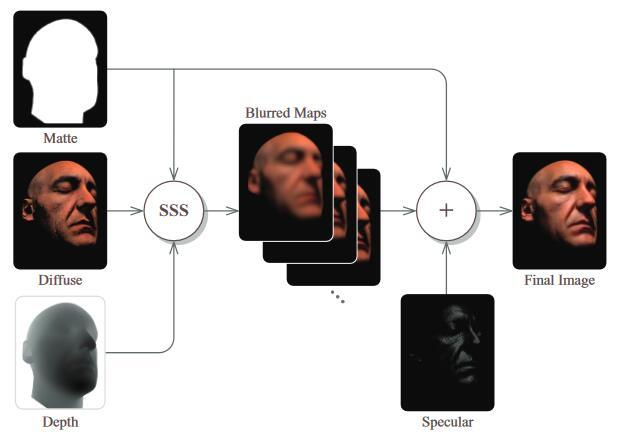

屏幕空间的算法示意图


方法[5]在diffusion   profile的近似方面和方法[2]没有本质上的区别，唯一的区别仅在于前者在屏幕空间，后者在图像空间。由于采样空间发生了变化，因此屏幕空间的方法需要根据当前像素的深度及其导数信息，对周边像素的采样UV进行横向和纵向的缩放，具体的缩放系数计算可以阅读原文。Unreal  Engine3和CryEngine3就是采用了上述方案。

**基于SVD分解的屏幕空间方法**

屏幕空间的方法的好处是算法的时间复杂度可以说是一个固定开销，和皮肤材质的模型个数无关，缺点是这个固定开销比较高。例如方法[5]提到的，需要在屏幕大小的贴图上进行12次高斯模糊，实际上仍然是不小的开销（在待渲染皮肤材质较少的情况下甚至可能比图像空间的方法效率更差），因此方法[6]在方法[5]的基础上提出了屏幕空间框架下的另外一个diffusion  profile的简化思路。从工程的角度来说，方法[6]将diffusion profile的近似用**两个一维的卷积操作来表示**，每个一维卷积根据最终效果可以用11-25个采样点不等，而卷积核的大小则由**当前像素的深度**以及**用户定义的皮肤柔和程度（sssWidth）**决定。从原理的角度来说，不同于方法[2]和[5]将diffusion profile用若干个高斯函数的加权和来表示，方法[6]把diffusion profile**看做一个矩阵**，**利用奇异值分解（SVD）的方法将其分解为一个行向量和一个列向量**，**并且保证了分解后的表示方法基本没有能量损失**（只是我的直观理解，欢迎数学好的同学给我解释一下详细的数学推导过程）。目前来看，方法[6]是兼顾了性能和效果的最佳方案。

## **预积分的方法**[7] 

图像空间的方法和屏幕空间的方法很大程度上都是通过周边像素对当前像素的光照贡献来实现次表面散射的效果，从原理上区别不大，方法之间的区别通常只是在于如何去近似diffusion  profile，在性能和效果上有一个较好的trade off。而Pre-Integrated Skin  Shading的方法则不同于上述方法，是一个从结果反推实现的方案。我们在观察次表面散射效果可以发现：

（1）次表面散射的效果主要发生在曲率较大的位置（或者说光照情况变化陡峭的位置），而在比较平坦的位置则不容易显现出次表面散射的效果（比如鼻梁处的次表面散射就比额头处的次表面散射效果要强）

（2）在有凹凸细节的部位也容易出现次表面散射，这一点其实和（1）说的是一回事，只是（1）中的较大曲率是由几何形状产生的，而（2）中的凹凸细节则一般是通过法线贴图来补充。

结合以上两个观察，[7]的思路是把次表面散射的效果预计算成一张二维查找表（具体的预计算方法可以查看这篇文章[8]），查找表的参数分别是dot(N, L)和曲率，因为这两者结合就能够反映出光照随着曲率的变化。


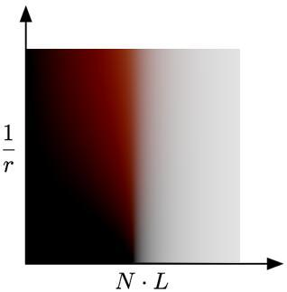

  上图中1/r表示的就是曲率，文中也给出了相应的计算方法：


![[公式]](Character_rendering_skin.assets/equation.svg)

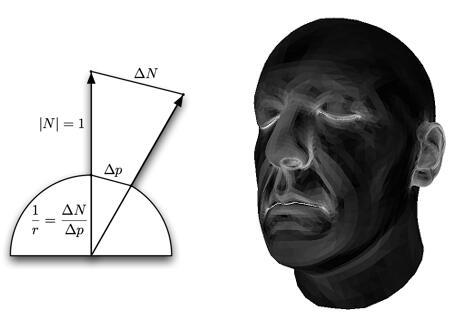

上图右边就是曲率显示出来的效果，可以看出类似额头这样的位置曲率是比较小的，而鼻子等位置的曲率就比较大。

上述方法解决了（1）的问题，但对于（2）提到的一些凹凸起伏的细节，由于它不是由几何造型产生的，因此无法用上述曲率计算的方法确认其是否有明显的次表面散射效果，因此作者进一步结合了bent normal的方法来实现这些细节处的次表面散射效果。

**Bent Normal**其实不是专门用来处理次表面散射专有的方法，可以应用于很多预计算复杂光照的情况，简单的说就是把**包含AO，阴影，次表面散射之类的复杂光照信息pre-bake到法线里面**，然后计算光照时使用pre-bake得到的法线，结合正常的光照计算方法，就能得到比较复杂的光照效果。

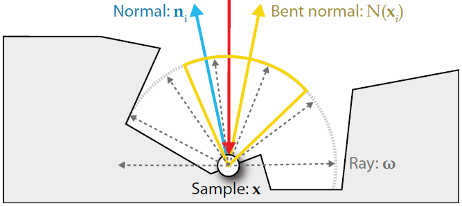

[7]中提到的bent normal的方案大致来说就是对法线贴图进行模糊的操作，以实现类似次表面散射的泛光效果，然后在计算最终光照的时候，使用原始的法线贴图和模糊后的法线贴图的线性插值结果作为最终的bent normal，不同的是，**它会分RGB通道设置不同的混合权重，然后混合出三个bent normal**，类似这样：

```glsl
float3 Nhigh = mul(normMapHigh.xyz, TangentToWorld);
float3 Nlow = mul(normMapLow.xyz, TangentToWorld);
float3 rS = Nhigh ;
float3 rN = lerp(Nhigh , Nlow , tuneNormalBlur.r);
float3 gN = lerp(Nhigh , Nlow , tuneNormalBlur.g);
float3 bN = lerp(Nhigh , Nlow , tuneNormalBlur.b);

float3 NdotL = float3(dot(rN, L), dot(gN, L), dot(bN, L));
```

bent normal的方法也被《神秘海域2》应用在他们**非过场动画的渲染部分**，稍微提供一点SSS的效果。

画面效果至今也是我觉得相当巅峰的《教团1886》在他们的渲染角色渲染部分[9]也使用了pre-integrated的方法，但是具体方法不是很清楚，希望了解的朋友可以告诉我。

## **高光的计算**

在[10]中提到了一种用于皮肤高光渲染的名为**Kelemen/Szirmay-Kalos specular BRDF**

我接触到的很多美术都把次表面散射和透射混为一谈，实际上这两者是皮肤渲染中两个完全不同的技术点。按照我们之前的光路分析，次表面散射反应的是TRT，TRRRT这类光路（奇数次反射），也就是入射光和出射光在介质的同一侧，而透射（或者我们常说的透光）则是反应TT，TRRT这类光路（偶数次反射），也就是入射光和出射光分布在介质的两侧。


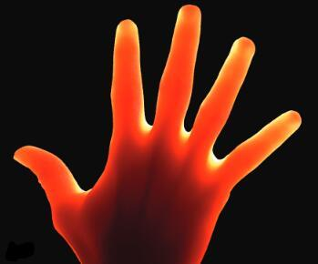

 在渲染技术上，这两者也完全不同，透射的实现思路相对比较直观，也容易理解，可以分为两步：


（1）计算光照在进入半透明介质时的强度 

（2）计算光线在介质中经过的路径长度

（3）根据路径长度和BTDF来计算出射光照的强度，**这里BTDF可以简化为一个只和光线路径长度相关的函数**

方法[10]就是一个**基于屏幕空间**的透射计算方法，它除了需要延迟渲染常用的GBuffer（用到的信息包含depth, normal和albedo，主要用来近似入射的光照强度）外，还需要计算透射用到的**光源视角的深度图**（一般是主光源的深度图）以及相关的**光源摄像机矩阵**。这个深度图和矩阵用来计算光源在从当前像素位置射出时经过的光线路径长度。因为BTDF随着路径的衰减比较快（指数平方的衰减），因此只有在较薄的结构（比如人的耳朵或者手掌边缘）上才能看到明显的透射效果，而当半透明物体背面被其他物体挡住的时候，体现在深度图上还是光线路径较长，因此也不会产生错误的透射效果。方法[11]用出射点法线的反方向近似背面入射点的法线方向进行入射光强度的计算，具体的计算公式可见原文。

## **总结**

皮肤的实时渲染在近十年来一直算是一个比较热门的话题，每年也有不少相关的算法和改进的提出，从目前的游戏中呈现的效果来看，皮肤可以说已经达到了非常逼真的程度。从这里历数的各个方法出发可以看出皮肤渲染随着其他渲染技术的演化，例如从图像空间的方法到屏幕空间的方法的演化很大程度上要归功于**延迟渲染管线**的普及以及硬件性能的提高。尽管屏幕空间的方法较为主流，但上面提到的方法在特定的环境下也都仍然有应用范围，另外这些方法在核心原理上并无太大区别，可以根据具体的情景和需求做选择。

## **引用**

[1] Henrik Wann Jensen, Stephen R. Marschner, Marc Levoy, Pat Hanrahan. A Practical Model for Subsurface Light Transport

[2] d'Eon, Eugene. [NVIDIA Demo Team Secrets–Advanced Skin Rendering](https://link.zhihu.com/?target=http%3A//developer.download.nvidia.com/presentations/2007/gdc/Advanced_Skin.pdf)

[3] John Hable, George Borshukov, Jim Hejl. Fast Skin Shading

[4] John Hable. [Uncharted 2: Character Lighting and Shading](https://link.zhihu.com/?target=http%3A//advances.realtimerendering.com/s2010/Hable-Uncharted2(SIGGRAPH%202010%20Advanced%20RealTime%20Rendering%20Course).pdf)

[5]  Jorge Jimenez, Veronica Sundstedt, Diego Gutierrez. Screen-Space Perceptual Rendering of Human Skin

[6] Jorge Jimenez, Károly Zsolnai, etc. [Separable Subsurface Scattering](https://link.zhihu.com/?target=http%3A//iryoku.com/separable-sss/)

[7] Eric Penner. Pre-integrated Skin Shading

[8]  Eric Penner, George Borshukov. GPU Pro 2, Pre-Integrated Skin Shading

[9] David Neubelt, Matt Pettineo. [Crafting a Next-Gen Material Pipeline for The Order: 1886](https://link.zhihu.com/?target=http%3A//blog.selfshadow.com/publications/s2013-shading-course/rad/s2013_pbs_rad_slides.pdf)

[10] Eugene d'Eon, David Luebke. [GPU Gems 3, Chapter 14. Advanced Techniques for Realistic Real-Time Skin Rendering](https://link.zhihu.com/?target=https%3A//developer.nvidia.com/gpugems/GPUGems3/gpugems3_ch14.html)

[11] Jorge Jimenez, David Whelan, etc. [Real-Time Realistic Skin Translucency](https://link.zhihu.com/?target=http%3A//iryoku.com/translucency/downloads/Real-Time-Realistic-Skin-Translucency.pdf)


[12] John Isidoro, Chris Oat, Jason Mitchell. 

编辑于 2017-05-25