# 西川善司的【WITCH CHAPTER 0  cry】讲座

**~****绝密开发中的史克威尔艾尼克斯的****DX12****技术演示全貌** 

**西川善司的【****WITCH CHAPTER 0  cry****】讲座** 

**~****绝密开发中的史克威尔艾尼克斯的****DX12****技术演示全貌** 

  

注：日文原文地址： <http://pc.watch.impress.co.jp/docs/topic/feature/20150529_704317.html> 视频引用自youtube 

  

     

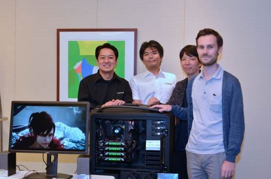

  

    今年4月末，微软的开发者大会【Build 2015】在美国的旧金山举行，在这次大会的主题演讲中，【DirectX 12世代实现的次世代图实时游戏图形，【WITCH CHAPTER 0 cry】(后面简称WITCH Demo )】公开了。 

  

    开发这个WITCH Demo的，是日本的国民级RPG【最终幻想】系列的开发商史克威尔-艾尼克斯（SQUARE-ENIX 后面简称SE）面向海外开发者大会的【次世代图形的宣传】，从2000年开始，大多是海外的游戏工作室（EPIC GAMES、CRYTEK、ID SOFTWARE、ACTIVISION、EA DICE）来担任的，这次日本开发公司的作品被推出是史无前例的。 

    

    这次Build大会的日本版，【de:code 2015】大会是在5月26日，日本东京都内举行的，在主题演讲中，介绍了WITCH Demo。 

  

    这次得到了和开发组的核心成员直接对话的机会，报告一下这个演示的开发秘密。 

**开发经过与****WITCH****项目的全貌** 

    首先，WITCH Demo的实际的开发确实是SE来进行的，开发过程中，与Microsoft和NVIDIA也进行了全面的合作。 

  

    WITCH Demo的原型，是SE基于DirectX 11提前进行着开发，而实质的【DirectX 12版的WITCH Demo】的开发项目启动是2014年12月的时候。 

  

    负责开发的，是【最终幻想15】开发小组里称作【BD2】的第2商务事业部，以及与第2商务事业部一同开发SE新世代游戏引擎【Luminous Studio】的技术推进2部。 

   

    开发的主要动机，SE方面据说是为了【对支持次世代的Windows，Windows 10的图形API的DirectX 12技术做先行研究和评估】，也有【把公司外技术引入公司的研究开发项目】的定位。总之，并不是最近未发表的【最终幻想】的新作预告影像，而是【纯粹的技术展示】。 

  

    田畑氏：这次的WITCH Demo是突破【游戏图形的束缚】，探索【实时图形的表现极致】的项目，为了希望不引起误解，最新制作的游戏里还没有实现和WITCH Demo同等的表现。 

  

     

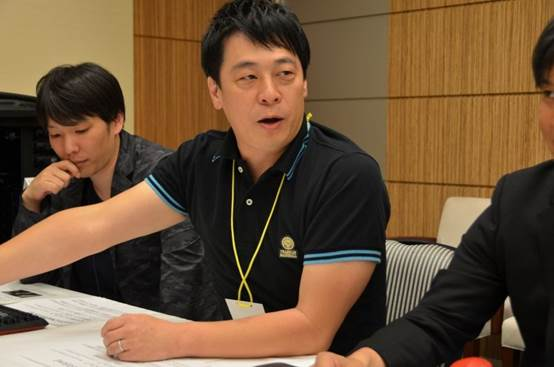

    史克威尔-艾尼克斯第2商务事业部主管田畑端氏 

  

    虽说如此，但也并不令人失望。 

  

    大体上同样作为概念开发的，2012年发布的【AGNI'S PHILOSOPHY】是【纯粹的技术演示】。2013年，反馈了这个演示项目积累技术的【最终幻想15】发布了。在这次的WITCH Demo窥视到的要素技术和表现等等，在将来的游戏项目中，被使用的可能性也是很高的。 

  

    **！！这里请插入****youtube****视频**  [**https://youtu.be/UVX0OUO9ptU**](https://youtu.be/UVX0OUO9ptU) 

    上面的视频，是2012年公开的技术演示【AGNI'S PHILOSOPHY】，是使用SE正在开发的新世代游戏引擎【Luminous Studio】制作的第一个项目。 

  

    话说回来，2014年12月揭露了SE的本项目里也有Microsoft和NVIDIA的参与，进行技术支持。 

  

    SE为何需要Microsoft和NVIDIA的协助，这点在对话中了解到，开发基于DirectX12 的应用的话，使用DirectX 12必须要用未发布的Windows 10，以及还未发布的对应DirectX 12的GPU驱动。 

  

    有着AGNI'S PHILOSOPHY开发成果的技术推进部，以及【最终幻想15】开发组BD的联合小组的提案，Microsoft和NVIDIA也没有拒绝的理由。倒不如说Microsoft方面，虽然API的标准稳定了，但没有现实的项目的磨合为了可以提升DirectX 12的精炼度，对SE的请求也是欢迎的，对NVIDIA来说，即使有意愿也没机会让日本的顶级工作室评估和使用正处在实际优化中的DirectX 12版GPU驱动。于是对于SE的合作请求，立即得到了Microsoft的Windows 10开发团队，DirectX 12开发团队，以及NVIDIA方面的回答。2015年1月开始了实质的开发。 

  

    大西氏：这次的WITCH项目，日本Microsoft起到了SE和美国Microsoft的核心开发人员间桥梁的作用。SE方面的也很热情，日本Microsoft也在努力传达。结果两个点被连系了起来。 

  

     

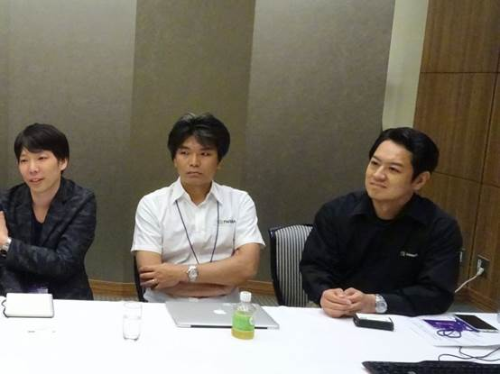

    日本Microsoft Developer Evangelist 的大西彰氏（右） 

  

    SE方面，2014年12月时加入了面向开发者的评估版Windows 10的环境，基于DirectX 12的开发环境是非常有限制的配置，美术制作还是在基于DirectX 11的环境进行。而与此并行的以程序员为首的工程师团队，开始进行SE自研究游戏引擎【Luminous Studio】Runtime的DirectX 12对应化。 

  

【岩田氏】今回のWITCHデモのゲームエンジンは、言うなればLuminous Studio Ver.1.5のDirectX 12版に相当します。Ver.1.5とは、3月に「FINAL FANTASY 零式 HD」に付属させた「ファイナルファンタジーXV」の体験版のエンジンバージョンと同じです。これは、Luminous StudioにおいてDirectX 11版とDirectX 12版がVer.1.5以降分岐していくということではなく、あくまでWITCHプロジェクトのための分岐措置とご理解下さい。 

  

    岩田氏：这次的WITCHDemo的游戏引擎，可以相当于Luminous Studio Ver.1.5的DirectX 12版，与3月时【最终幻想零式 HD】附带的【最终幻想15】的体验版的引擎版本是一样的。这样，Luminous Studio的DirectX 11版和DirectX 12版在Ver.1.5后是没有分歧的。 

  

     

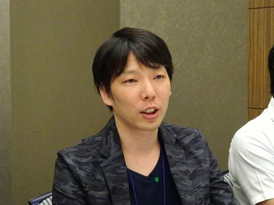

    SE技术推进部 美术主管岩田亮氏 

  

    然后，3月在旧金山举办游戏者开发大会（GDC）的期间，WITCH 项目的主要人员Microsoft Windows 10，DirectX 12的开发团队，NVIDIA的核心工程师的会面。这时，也有暗示4月末举办的Build大会的主要演讲里被采用作为DirectX 12解说部分的演示内容。一直是“暗示”状态，也是因为受到强调营销方面的主演讲内容在会议开始前几次变更内容的影响，真的是【不确定能出现】。 

  

     

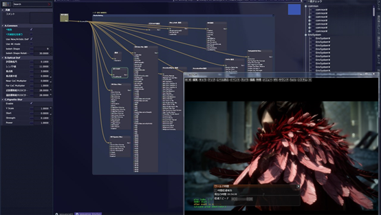

    美术制作和DirectX 12工程并行 

  

    SE方面，虽然在2014年12月时导入了面向开发者的评估版Windows 10的环境，但实际运行NVIDIA最新的DirectX 12版G的GPU驱动，以及入手当时刚刚发布不久的高端GPU【GeForce GTX TITAN X】是在GDC闭幕之后，通过真机运行来确认的开发实际上只有7周左右。 

  

    进入4月后，NVIDIA的技术开发工程师竹重雅也氏也加入到SE，和WITCH项目的工程师们一起工作，参加开发的支持。 

  

    竹重氏：这次的WITCH项目，使用的是4-way的SLI构成的GeForce GTX TITAN X的AFR(Alternative Frame Rendering:把每帧的绘制分配给不同的GPU并行执行来提升渲染效率的方法)。并没有使用DirectX 12的新功能【Mutliadapter】(按目的分别使用各个GPU，比如可以独显集显一同工作，是Directx12的一个引人注目的功能，Windows7开始，系统桌面可以由不同厂商的GPU组合显示，而Windows 10是在渲染和GPGPU方面，不同厂商的GPU也变得可以一同处理)。时间的限制的缘故，也没有特别打出【因为是Directx12，比DirectX 11版本更快】这样的信息。 

  

     

    NVIDIA、开发技术工程师竹重雅也氏 

  

     

 

     

 

   与WITCH同时被介绍的UE4基于DX 12 API  Mutli Adapte技术，组合使用NV的独显和Intel的集显 

  

    工程师团队进行的DirectX 11版的Luminous Studio Runtime向DirectX 12版的移植工作，并没有想象中那么高的难度。 

  

    Ivan氏：并没有使用DirectX 12的全部机能对引擎进行再设计，Runtime部分是直接的移植，Luminous Studio Runtime的DirectX 11版到DirectX 12版的对应化大约3周就结束了。对我们来说并不是难度很高的工作，不过如果有时间的话，我们还想再做一些优化。 

  

     

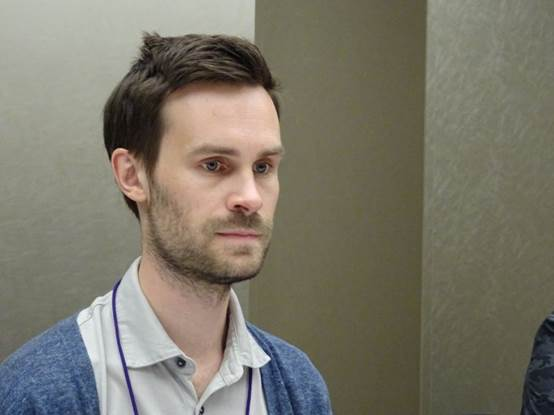

    SE第2商务事业部兼技术推进部总监Gavrenkov Ivan. 

  

   这里还有一个花絮，WITCH Demo的项目成员，直到Build会议的主题演讲开幕前也不知道WITCH Demo是否被正式采用。 

  

     **！！这里请插入后面的视频地址** [**https://youtu.be/rpDdOIZy-4k**](https://youtu.be/rpDdOIZy-4k)  

    上面的视频从2015年4月举办的【Build】大会的主题演讲里，WITCH Demo部分的摘录。从NVIDIA网站转载的。 

  

    上面，是实际当日的主题演讲中选择的WITCH Demo部分的摘录，可以看到田畑氏在开头寒暄的视频。说不定会有人觉得【不知道会不会被正式采用】而准备这样的动画素材很奇怪。但是，这个寒暄的视频只是估计到会被正式采用而实现制作的，也有不被使用的情况。在实际的主题演讲中现场看到WITCH Demo能被采用的场景，哪个瞬间，真的很高兴。 

  

    岩田氏：这个WITCH项目，在SE公司内部也是很有限的一部分人知道。因此，公司内部对这个新闻吃惊的人也很多。 

   

    竹重氏：NVIDIA也是一样，宣传部的人也不知道，是非常机密的项目。我自己以前是从游戏界的软件工程师出身，很享受这些。 

  

    大西氏：日本的游戏工作室的作品，在包含游戏的Microsoft的大型会议上，可以被选择作为【最新技术演示】是我想这是第一次。 

  

    田畑氏：比我们想象还要多的各方面的人都观看了，之后各方面的讨论也很厉害。成为了各种有意义的经验吧。 

  

**WITCH Demo****的****GPU****负荷是****3000****万多边形级别** 

    那么，这里进入到WITCH Demo的技术解说部分。 

  

    首先，是WITCH Demo运行的搭载Windows 10的PC的硬件规格，在下面公布了。而在de:code的主题演讲使用的，是大体上是同一个规格的，由PC工房生产。属于特别订制品，联系的话也可以预定的。这次的演示机的价格是120万日元左右（6万RMB）。 

  

    **运行****WITCH Demo****的主机的配置** 

    CPUCore i7-5960X 

    主板  Intel X99 

    内存 64GB 

    存储器 固态硬盘 240GB 

    GPUGeForce GTX TITAN X×4-way SLI 

    电源 1500W Corsair AX1500i 

  

     

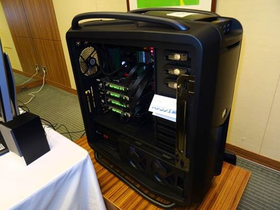

    PC工房准备的对应WITCH Demo的特别定制主机 

  

     

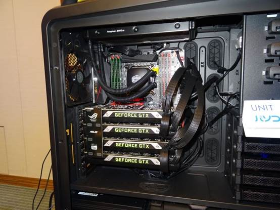

    装备了4块GeForce GTX TITAN X的最强构造 

  

     

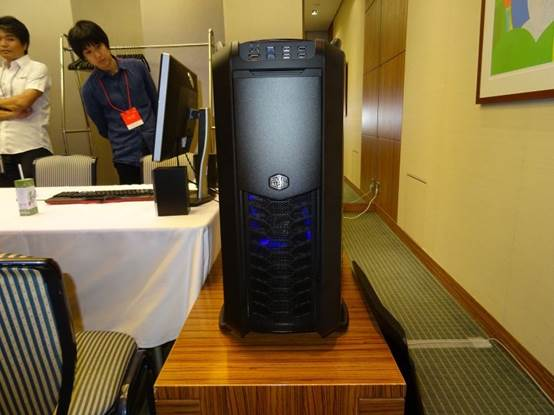

    从正面看 

  

    现在，高端的游戏图形方面的多边形数量的限制，和电影用的CG（包含预渲染CG）大体上相同。多边形数不在代表CG的品质，作为参考值，这次的WITCH Demo的多边形规格也要提及。 

  

   本作的主人公，还是叫做AGNI的女性魔法使的角色，和2012年发表的技术演示AGNI'S PHILOSOPHY的同一个人物。 

  

    岩田氏：不过，角色模型自身是有区别的，AGNI'S PHILOSOPHY里，使用的是事先把预渲染CG版用模型，对应实时CG做优化后的模型，而WITCH Demo，是把现在制作的预渲染版CG版的模型直接使用的方针。 

  

    AGNI模型的多边形数大概是1100万，细节方面，面部，身体，饰品等是300万，毛发600万，AGNI穿着的鸟羽毛制作的毛皮服装约200万。PS4/Xbox One世代的游戏机，游戏整体画面大约1000万多边形左右是一个基准，直接了当的说，AGNI 一个角色的绘制，就会把PS4/Xbox One的图形性能用光。 

  

  

     

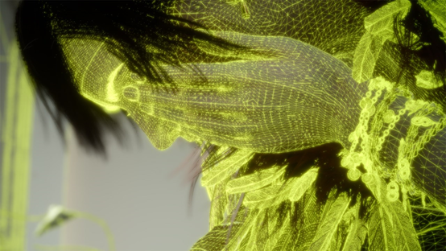

    1个角色有1100万多边形 

  

     

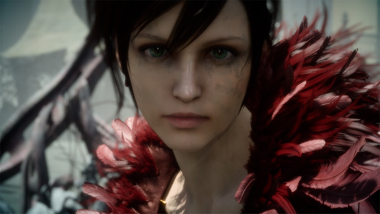

    WITCH Demo直接使用了预渲染用的模型 

  

    和光线追踪的方法不同，现在的GPU采用的是光栅化方法的图形管线，无法自动的产生阴影。用其他方法的话，必须要运行生成阴影的渲染Pass。这个负荷要追加大概600万多边形。AGNI模型有1100万多边形，影子生成不是1100万而说是600万，是因为使用了比原模型基础上降低了一些品质来做阴影生成模型（虽说是600万多边形，但并不能说品质就降低了）。 

  

    WITCH Demo里，出了开头的山麓外，没有太大规模的背景设置，尽管如此背景模型也有1100万多边形来构成。总而言之，WITCH Demo上，GPU负荷是AGNI 1100万+阴影+600万+背景1100万，大概2800万多边形的级别。 

  

     

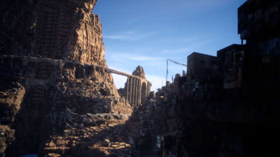

     

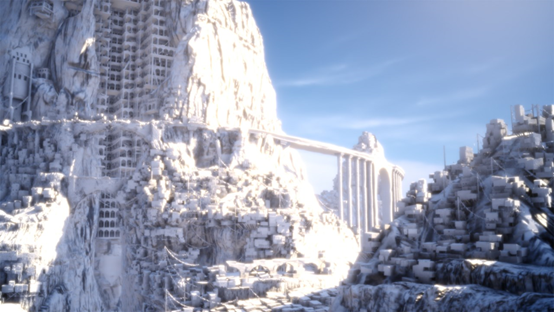

    背景和AGNI'S PHILOSOPHY是同一个，但细节提升了。 

  

    还有，渲染是3,840×2,160点的4K分辨率。但在显示时，实施了超采样技术（Supersampling），缩小为相当于1,920×1,080像素的Full HD分辨率。这个是为什么？ 

  

    岩田氏：WITCH Demo是实时的CG演示。在预渲染的领域，可以使用对一个像素反复进行各种阴影处理的来提高品质的方法，而实时CG里不行。说起来WITCH Demo里【4K->Full HD】的处理，就是把分散在空间里进行的阴影计算结果汇总到一个像素来提高品质谋求更高的效果。 

  

    还有，这种【4K->Full HD】的处理方法，相当于全屏抗锯齿（Full screen anti-aliasing）。所以，作为附属的效果，也有减少锯齿感的抗锯齿效果。对于根据现实世界再现亮度分布的【HDR（High Dynamic Range）渲染】和【基于物理渲染】组合产生的在不足1像素时的时间方向的闪耀晃动（Pixel Shimmer 像素晃动现象，基于物理渲染中常会遇到的Specular Aliasing）现象，因为通过这种【4K->Full HD】的处理进行误差的扩散，也得到了减低。看起来没什么用的【4K->Full HD】处理也是有着很深奥目标的。 

  

     

 

    【4K->Full HD】的处理，除了抗锯齿外，也有着减低出现在饰品和水面上的时间方向的像素晃动现象的效果。 

  

    田畑氏：在AGNI'S PHILOSOPHY时，面向实时CG的话，制作4K分辨率要降低Texture的分辨率，这次的WITCH Demo不用这么做，在Texture的表现上没有妥协。 

  

**全部线段生成，相当于****600****万多边形的毛发** 

    表现的细节也可以看到。 

  

   之前说明主人公AGNI的毛发是600万多边形，实际在数据上并不是多边形而是以线段的控制数据的形式来给予的。 

  

    在PS4/Xbox One世代，毛发方面，主要使用的是把毛发Texture适用到类似长方形的“鳍”多边形（像把多边形就像鱼背的鳍那样移植）来植入头发的方法。这种方法在SE内部也叫做“香蕉皮（Banana Leaf）”。 PS4/Xbox One上的【最终幻想15】采用的就是这种方法，而这次的WITCH Demo，没有采用这种方法，而是和实际人类一样， 把1个1个的线段的头发植入到头皮上。2012年的AGNI'S PHILOSOPHY里，是前面提到的香蕉皮方法和这次的线段方面并用，而WITCH Demo和预渲染CG一样，采用了线段的方法。 

  

  

    **AGNI'S PHILOSOPHY****时的****AGNI** 

  

     

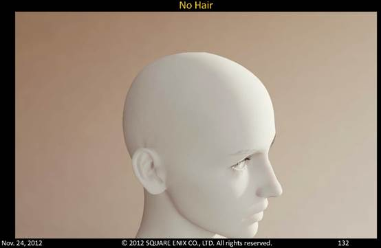

    没有头发 

  

     

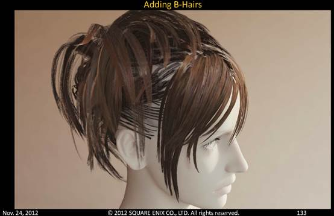

    只有“香蕉皮”方法的毛发 

  

     

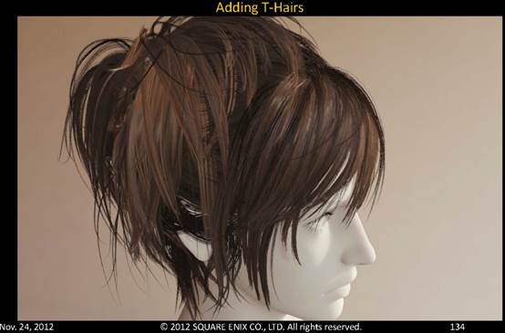

    在香蕉皮方法上加入了线段方法的毛发的最终形态。 

  

    线段表现的方法是使用高次曲线的NURBS (Non-Uniform Rational B-Spline)Curve，在3DCG的制作工具Maya上进行3D建模时给予的数据直接在DirectX 12版的Luminous Studio Runtime中使用。【毛发600万多边形】，正确的来说是有NURBS Curve的控制点约600万个。 

  

     

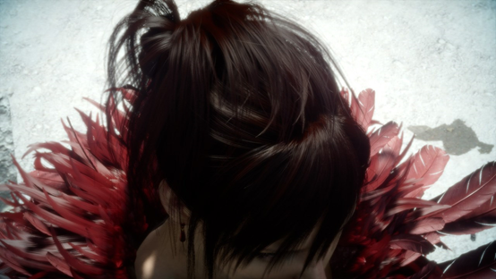

    WITCH Demo中AGNI的毛发全都是基于线段的 

  

    AGNI'S PHILOSOPHY里是把NURBS Curve的控制点用弹簧连接，是适应基本的弹簧物理的实现形态，WITCH Demo里并不是这样进行的。 

  

    Ivan氏：在AGNI'S PHILOSOPHY里，毛发的增毛处理采用的是DirectX 11的 Tessellation Stage的【Isoline Tesselation】，WITCH Demo没有使用 Tessellation Stage。1根根的毛发就是实际的600万控制点的线段来植入的。 

  

     

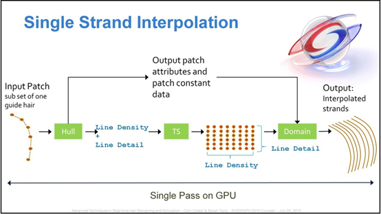

     

    SE参考 NVIDIA的Sarah Tariq氏的论文（<http://sarahtariq.com/presentations.html>），用Isoline Tesselation来增加毛发。 

  

    还有，毛发的阴影处理据说是和AGNI'S PHILOSOPHY里的一样的。简单来说就是根据Steve Marschner在SIGGRAPH 2003上发表的论文【Light Scattering from Human Hair Fibers】自己实现的。 

  

     

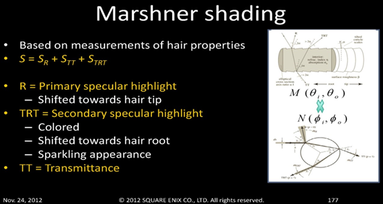

     

 

    WITCH Demo也和AGNI'S PHILOSOPHY一样，使用了Marschner的方法来做毛发的阴影处理。 

  

    岩田氏：这次，主人公AGNI穿着的鸟羽毛制作的衣服上的羽毛构成，也是毛发一个一个的用线段来制作的。不过，羽毛有200万多边形相当的麻烦（笑） 

  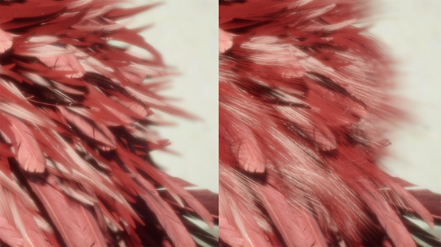

     

 

    这次鸟的羽毛也是用线段方法来表现的 

  

**WITCH Demo****的光照和着色系统（****Lighting & Shading****）** 

    大概看起来就像是预渲染CG的WITCH Demo，他自己的阴影（明暗着色）处理是怎么实现的呢？ 

  

    关于这个，就结论而言，是在AGNI'S PHILOSOPHY时研究开发的。在【最终幻想15】被实用化的【基于物理渲染】里直接被使用了。 

  

    关于基于物理的渲染(PBR:Physically Based Rendering)，用一句话说就是遵守【能量守恒定律】，入射光总和等于出射光总和的光照和着色计算的方法，正在成为PS4/Xbox One世代的游戏图形的【标准技术】的概念。而在PS3/Xbox 360世代游戏图形，因为可以无视这种基本原作，让美术师按感觉随意的调整阴影，游戏画面如果脱离了这些固定的照明条件，相机角度和轨迹的话，就无法再看到真实效果。而PBR，是把以前的方法改为【意识到物理定律的来计算阴影，调整阴影参数】的规范。 

  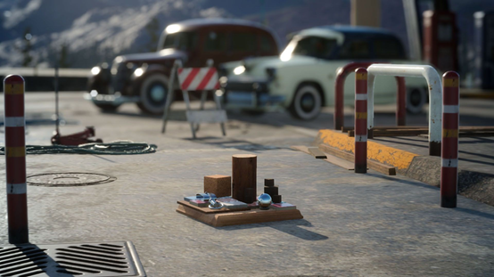

     

 

     

 

    Luminous Studio里采用的，是在【最终幻想15】里被使用的基于物理渲染系统，每个材质按照现实世界里的反射特性来给予。 

  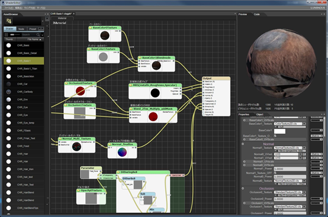

    

 

   进行基于物理的材质设计使用的Luminous Studio自研的Shader Editor画面，在实际的【最终幻想15】的开发中也被使用了。 

  

    【最终幻想15】的PBR系统采用的结构是，调用要进行材质表现所对应的【材质ID】ID编号的每个PBR对应的Pixel Shader Program，来计算出【这个材质特有的出射光】。像岩石，金属，树木，皮革等，在现实中登场的所有材质的亮度，阴影，为了表现这些材质要分别设计作出Pixel shader Program。 当然，像半透明材质，还有面向实时实现的再现的【相应】材质，包含金属材质的不透明材质的表现，都可以以非常好的品质来再现（接近预渲染）。 

  

     

 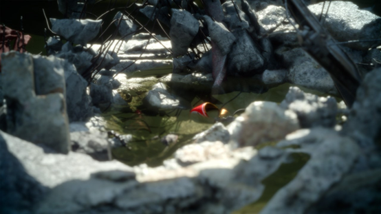

    WITCH Demo的开头场景。水面，石头，空罐头等材质的小道具。 

  

    岩田氏：PBR是【物理正确的】，无论如何也会有【表现美妙艳丽】的瞬间。WITCH里，在美术表现的一方面，也加入可以美术师可以调整的余地的结构。这部分主要是和菲涅尔（Fresnel）反射相关的。 

  

    菲涅尔反射，是指材质表面的外观会根据视线而变化，属于各向异性反射的一种，例如，水面和车身表面掠视时可以看到街道风景的反射，而当视线正对表面是看到的是水底，或者涂装颜色为主。关于这个菲涅尔反射，并不只限于光滑的光泽表面，人的皮肤，衣服，石头也有。而这里，可以说是加入了无视物理法则来调试的余地。 

  

    在WITCH Demo里，关于人的皮肤，眼球的表现采用的是和AGNI'S PHILOSOPHY同样的技术，细节可以参考西川以往的文章，这里也简单的解说一下。 

  

    **AGNI'S PHILOSOPHY****里的人类皮肤表现** 

  

     

 

    关闭模拟次级表面散射 

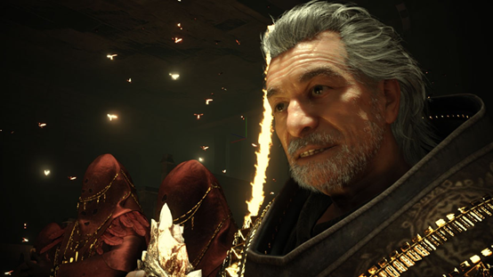  

     

 

    打开模拟次级表面散射 

  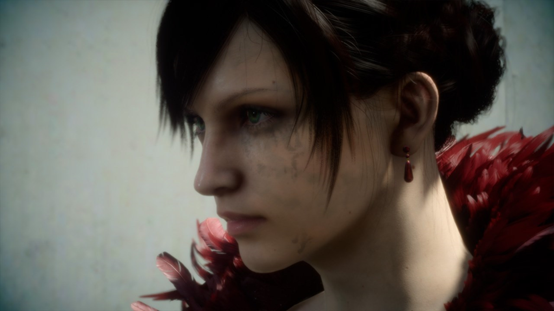

     

 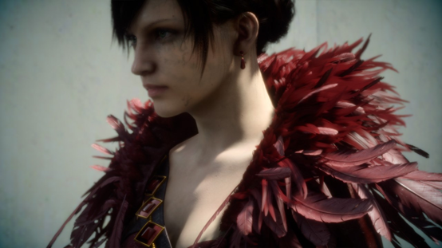

     

 

    WITCH Demo中的人皮肤的表现和AGNI'S PHILOSOPHY里使用的是同一类技术      

  

    虽然透过率低，但皮肤和眼球是半透明材质，这种照射光在内部渗透散乱再射出的表现，是实时计算不可能接近的。于是以【人的皮肤照射白色激光时，从这个照射点用什么样颜色分布从表皮映出光】的测量数据为基准，通过以前的普通方法，在贴上的Texture里绘制阴影处理再对角色模型的皮肤在贴图空间进行模糊处理来模拟。这个技术原型，是原NVIDIA开发的【Human Head】演示里最开始实用化的技术，而它对应游戏，是Activision Blizzard的Jorge Jimenezon在屏幕空间通过对画面的模糊处理的形式，做最轻量优化。现在在很多的游戏里都被使用了。 

  

     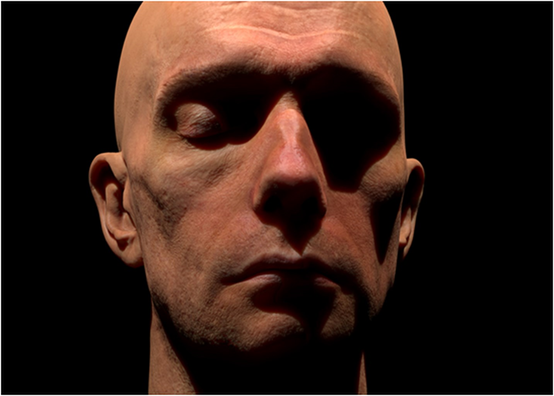

 

    NVIDIA开发的【Human Head】。原来是面向GeForce 8800 GTX开发的Demo,现在可以下载了 <http://www.nvidia.co.jp/coolstuff/demos#!/human-head> 。 

  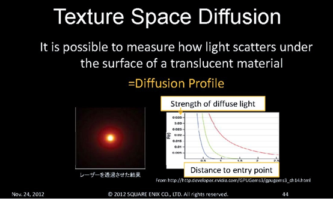

     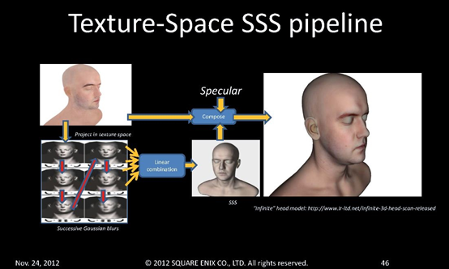

 

     

 

     

 

    NVIDIA的【Human Head】，是通过Texture坐标系的模糊来模拟次级表面散射的结果，作为皮肤的光照。 

  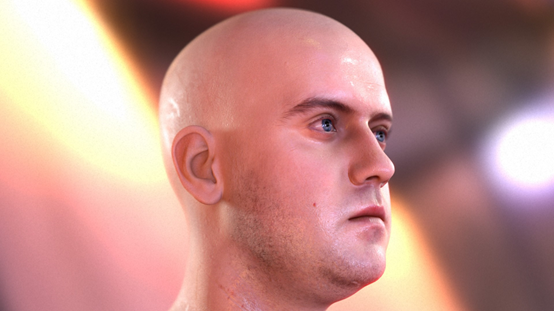

     

 

    Activision Blizzard的Jorge Jimenez，在游戏业绩作为皮肤表现的先驱者而广为人知。 

  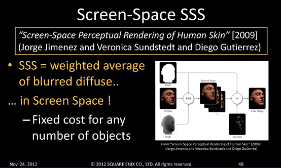

     

 

    Jimenez的SSSSS的算法概念图，通过屏幕空间的后处理来进行模拟次级表面散射的模糊处理。 

  

    岩田氏：这次是以【哭泣】的作为主题，关于眼球，追加了毛细血管的红色浮出的【眼睛变红】的表现。是新的要素。 

  

  

    ！！！这里请插入视频链接 <https://youtu.be/3vnTWlYRTFc> 

    AGNI'S PHILOSOPHY里眼球Shader的Demo， 这次的WITCH Demo也采用了同样的技术 

  

    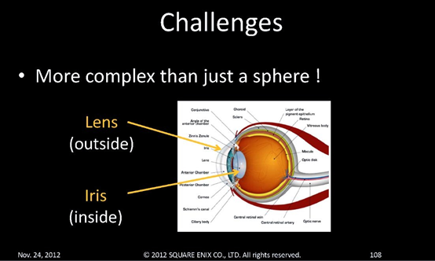

 

     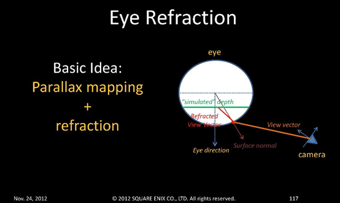

 

   

    眼球的构造和折射表现的概念图。 

  

     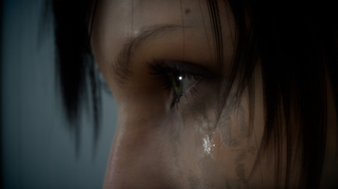

 

    WITCH Demo中，AGNI眼球的特写镜头 

  

    Luminous Studio里实现了新开发的间接光表现（全局照明技术），在【最终幻想15】也实际的使用了。WITCH Demo里并没有采用，而是用了电影的方法，也可以说是Pixar的方法来表现间接光。 

  

   具体来说，是手动的放置相当于间接光的光源。例如，空中的太阳照射到石阶上的反射光，这里就在石阶一边放入相当于反射光的光源。 

  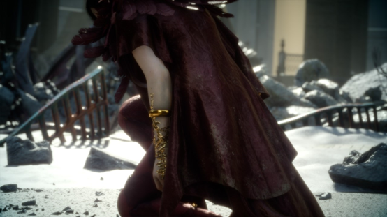

     

 

    所谓间接光的表现，并不是计算间接光，而是事先配置相当于间接光的光源的，类似电影CG的制作方法。 

  

    岩田氏：WITCH Demo，和电影一样是【场景固定】而且【表演也是固定】的，追求影像品质的话，我认为这个方法是最好的  。而且可以让反射光产生淡淡的阴影。是临时系统，和Luminous Studio的间接光照系统做了切换。 

  

    反射方面，也是一样的理由，没有使用实时生成的环境CubeMap（六面体构造，表现全方位的反射的镜像Texture），而是采用在创作阶段生成的超高品质的环境Cubemap. 

  

    Ivan氏： 生成表现出接地感的阴影（Contact Shadow），使用了【Screen Space Ambient Occlusion】（SSAO）。技术上和【最终幻想15】里采用的类似，4K分辨率渲染时，深度缓冲的采样数会变多。主角AGNI的面部的凹凸生成的自遮蔽的阴影，和AGNI'S PHILOSOPHY时一样，都是事先烘培生成的。 

  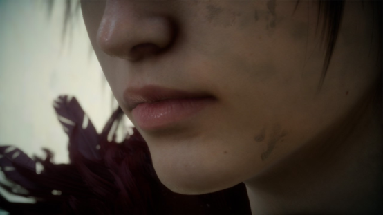

     

 

    鼻孔等，通常被遮蔽可能性高的阴影，采用实现在顶点信息里烘培的方法。这个是在AGNI'S PHILOSOPHY里也使用的技术。 

  

**WITCH Demo****的精髓是【****Geometry Cache****】！？** 

    那么，在WITCH Demo里，有很多人关心的不就是【哭泣的脸部动画】，【洒落下的眼泪】，【开始侵蚀全身的黄金魔法】的表现么？ 

  

    来看看实际的技术，WITCH Demo最独特的表现点。 

  

     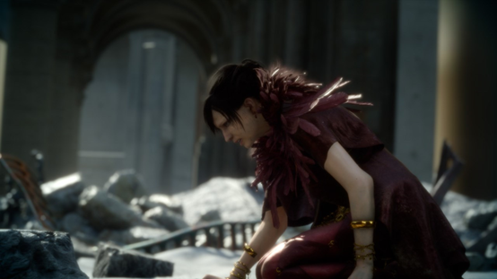

 

    哭泣扭曲的表情 

  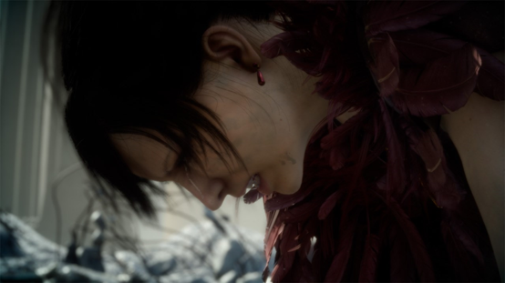

     

 

    洒落的眼泪 

  

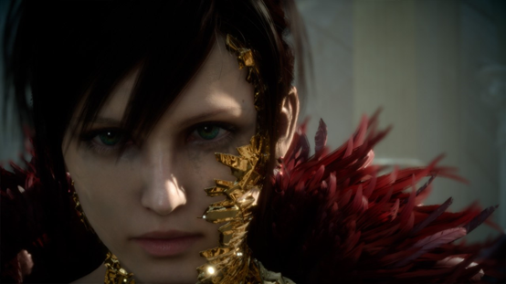     

 

    开始侵蚀的黄金魔法 

  

    这个是，最新的游戏图形技术开始采用的【Geometry Cache】技术。简而言之，是【顶点信息的Streaming（流式传输）再生】。 

  

    以动画片为例，被显示的其实是一张一张的静止画。这些静止画的数据，不断的替换前一张静止画，就可以显示为【动画】来看。Geometry Cache，用3D模型来替换这个概念来联想就容易懂了。 

  

    总之，某个瞬间被显示的静止的3D模型，构成这个模型的顶点信息（理解为多边形信息也可以）不断的输入，并与前面显示的3D模型切换的显示，称作Geometry Cache的技术。 

    

   一般的游戏图形里，运动3D模型内部配置的骨骼，让骨骼运动来带动3D模型的表皮多边形来生成动画。这是对应玩家操作生成各种动作的优秀系统。但是，在游戏图形的3D模型里可以放入的骨骼数量是有限的，虽然是可以满足让身体运动的程度，但进行复杂的人类的面部感情表现就会出现不足的情况。顺便说一下，Pixar的动画角色面部加入了数千根骨骼，不过，这样的骨骼数量在游戏图形里很难是采用的。 

     

    所以这次的WITCH Demo的预渲染CG品质的动画，是这样以每1帧为单位的顶点信息Stream作为数据来生成的。 

  

    田畑氏：如果有时间的话，当然是想用以前游戏图形的骨骼蒙皮的系统来实现最优化。但我想这次为了能在限制时间内实现最高的品质，选择了合适的技术。 

  

    岩田氏：Geometry Cache确实是体力活的方法，根据情况也是最优技术，例如游戏场景向过场剧情无缝转化时的剧情演出，是可以实现预渲染CG的表演的有效手段。 

  

    Geometry Cache，或许可以说是【动画的预渲染】。但是，渲染（光照和阴影处理）自身是实时进行的，相机可以自由移动，光源也能自由移动。Texture也可以替换，人的皮肤也可以材质变更为石材。运动以外是实时的。可以根据应用有趣的使用吧。将来把动作合成到实时模拟的结构也不是没有可能。 

  

    实际上，这种Geometry Cache技术，在CRYTEK的Xbox One专用游戏【RYSE 罗马之子】里已经实用化了。在RYSE里，大规模破坏场景，详细的面部动画和服装动画，这些都使用了Geometry Cache。 

  

   ！！请插入链接中的视频 <https://youtu.be/leD9-oxNfaQ> 

 【RYSE】中Geometry Cache技术的应用事例 

  

    Geometry Cache的技术原创，是好莱坞电影界发源技术【Alembic】。Alembic，是制作【星球大战】系列的乔治卢卡斯的电影公司【卢卡斯电影】的CG制作部门【ILM】(Industrial Light & Magic)与制作【蜘蛛侠】系列的CG而闻名的【SPI】（Sony Pictures Imageworks ）一同开发的开源场景文件框架，是可以在制作时导入/导附带动画的CG场景的结构。 

  

    通过这个结构，生成带有动画的顶点信息数据（多边形数据）Stream，称作【Alembic Cache】，一般用语称作 Geometry Cache。 

  

    这次的WITCH Demo，除了前面所说的【哭泣的脸部动画】，【洒落下的眼泪】，【开始侵蚀全身的黄金魔法】的表现外，衣服和头发的摇晃等等，大部分的动作都使用了Geometry Cache技术。实时模拟的只有饰品类的物品。 

  

    知道了【1100万多边形的AGNI模型以帧为单位的动作是通过顶点数据的Streaming再生来运作】的事实，这样WITCH Demo的GPU负荷会很高，数据容量也是多的难以计算。 

  

    竹重氏：4块【GeForce GTX TITAN X】的GPU负荷时常是100%，尽管如此，帧率保持在30fps。 

   

    这次的主人公AGNI的使用的Geometry Cache技术的动画数据很容易就超过了5GB，这个数据放入在WITCH Demo Runtime的主内存里，在通过PCI Express总线Streaming的传输给GPU。Luminous Studio引擎的话，把这些数据也可以存放在机械硬盘或固态硬盘上，也有对应GPU的图形显存设计。 

  

    这次的采访，Geometry Cache技术是为了制作这次的WITCH Demo实验性的实现的态度，有很高概率，不会被作为Luminous Studio的新功能采用吧。最先实用化这个技术的CRYTEK在数据压缩时也很辛苦，这个领域说不定也还有研究的余地。 

  

   另外，Luminous Studio在现在发布的体验版【最终幻想15】里是Ver1.5版，而发售版的【最终幻想15】是基于Ver.2.0，这个Geometry Cache技术，说不定也会作为WITCH Demo的项目成果反馈到游戏里。 

  

   WITCH Demo，以及今后可能的进化，请期待后续报告。 

 

来自 <<https://www.cnblogs.com/TracePlus/p/4921617.html>>  

 