# [sig16]《神秘海域4》中的volumetric-based materials

2018年12月26日 星期三

腾讯专家工程师；《天涯明月刀》引擎架构师；

 

来自 <<https://zhuanlan.zhihu.com/p/50249866>> 

siggraph16，naughtydog的TA带来的很不错的处理衣服和头发的volumetric渲染的文章。

 

==项目经验和心路历程==

实际在我接触到的大部分开发者眼里，大家会觉得naughty dog这样的引领业界的公司，一定是从“一个英明决策到另一个英明决策”，然后砍瓜切菜般一A到底的把牛逼游戏做出来。

实际上作者在本文中也反复提及，中间走了不少弯路，有错误的预判，有失败的尝试，中间一度感到失去希望，还在团队确实牛逼，彼此也非常暖心的互奶，作品出来之后，还是叫好叫座的。

最后也是意识到again做一个demo和一个需要任何时候都好看，都高帧数不卡顿的游戏是非常不同的。

so this is the reality.

 

本来项目立项是在ps4早期，所以项目组希望达到一个非常“纯物理”的渲染，实际开发中也是颇有雄心的做了各种物理正确的渲染和计算。

但是实际是机能明显还是不够强劲，所以本文更多的是讲一些以更加高效的方式进行近似逼近。

一定程度上也反映了游戏开发之道，就是“高效近似的艺术”，使用各种技术的组合来以n倍效率达到原本使用昂贵计算才能做到的事情，进而超越了时代的限制。

同时本文中讲得很多“失败的尝试”，对于其他学习者来说也非常的珍贵，我们也可以看到作者的思考方式，做事方式。

虽然naughtydog的做法中也是各种trick，但是naughtydog是知道什么是对的，完备做法应该是什么样的，在这个基础上进行近似，这样的有意为之的方式，可以保持结果的近似度非常高，且有很好的自洽，看似奇胜，实则正和。

实际开发中，有些开发者在不知其所以然的情况下，各种trick，耍小聪明，最后会是让团队吃亏了。

=======愤怒的广告条=========

[安柏霖：腾讯北极光《无限法则》《天涯明月刀》诚招程序zhuanlan.zhihu.com](https://zhuanlan.zhihu.com/p/32019600)

=======愤怒的广告条=========

 

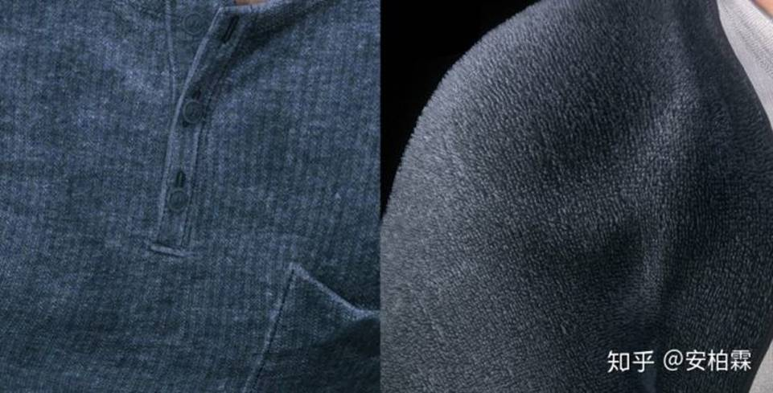

==cloth==

 

开发fabric系统的时候，考虑的点：

·         不同的reflection model

·         不同的scattering

·         细节的tiling处理

·         volumetric self-shadow

==macro weave structure==

这里的做法很不错，它是预先生成好一系列的纤维类型，然后做好tiling贴图，然后供美术使用：

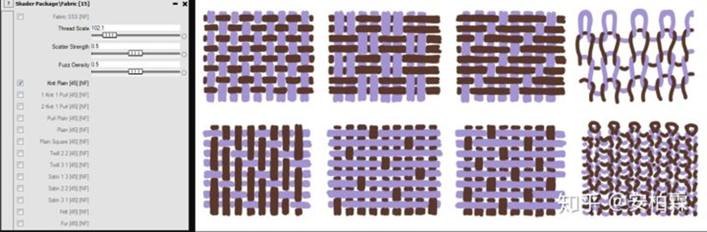

（工具界面看起来虽然比较圡，功能还是很强大的，可以让美术预先选择不同的基础纹理）

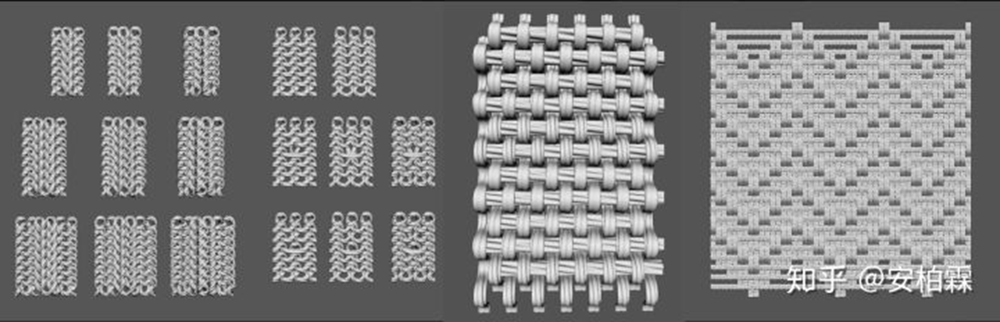

maya里面建模不同的纹理

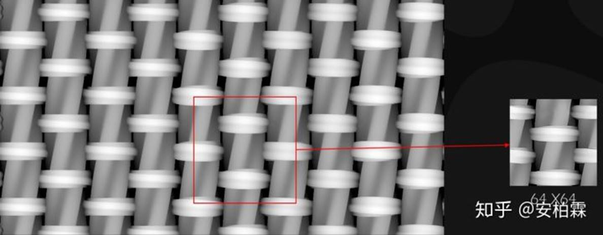

生成小的tiling贴图

然后tiling走起，又快又好，简直优秀。

然后说为啥不用高大上的scan技术，真实照相机一扫，那才牛逼（破音）么？

 

因为这样的预先生成的方式，可以以这样的组合方式来进行，达到开发效率高，资源俭省的优势，同时质量也很好。

中间可以也有一个非常犀利的各种组合出衣服的材质编辑的展示。

naughty dog衣服材质编辑

==shader模型==

丝绸类的，对比过ggx anisotropic和kajiya kay,最后ggx理论上和效果上都更牛逼，但是实际玩家看起来差别不大，最后还是kajiyakay了。

不同材质的，使用的“ready at dawn”的。

散射处理

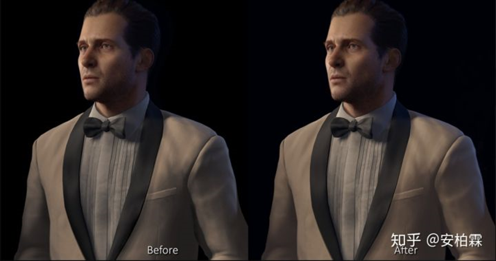

使用了一个非常省的方式，达到一个不错的模拟：

 

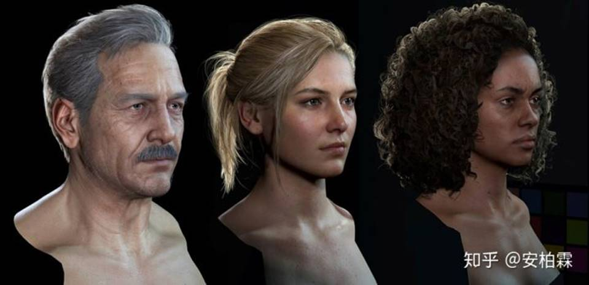

==hair render==

开始也想尝试使用纯geometry，然后做正确透明排序的方式，但是最后发现还是不行。

头发依旧是hair card:

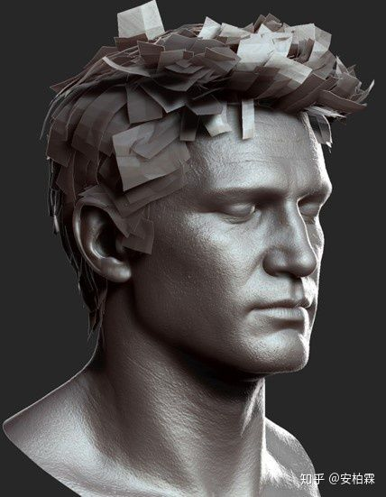

 

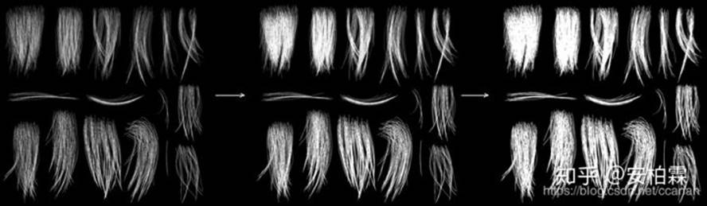

在透明处理上是dither alpha+taa来处理，不过问了在naughtydog工作的同事，说alpha blend也是有的。。

然后这部分技术比较直接，简单过下：

==unify normal==

使用这种unify的normal来处理头发插片之间的过渡，整体光照更加一致，同时也让backlit更好

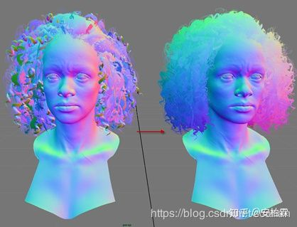

 

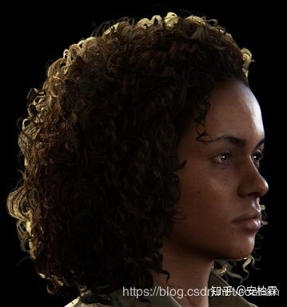

==cooked shadow==

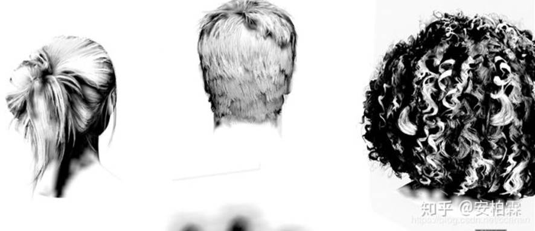

cook shadow信息，然后结合realtime shadow来让头发的shadow信息正确。

 

==scatter==

这里包括直接光的scatter和backlit的scatter

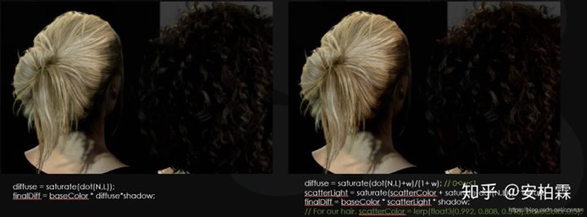

scatter部分是有physically based的光照模型，包含Single Reflection ®, Double Transmission (TT), Transmission-Reflection-Transmission (TRT) ，但是作者表示这个还是太费了，最后使用了fabric部分的scatter模拟，也还ok。

physical model在ue4现在代码里也有，确实计算量多好多倍。

 

==shader package==

这是一个从动画电影工业中借鉴来的概念，在动画片制作中，shader artist会制作一组shader package，

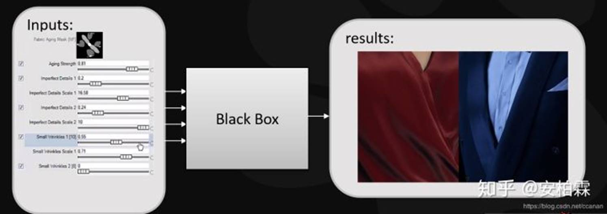

然后把相关的实现做好，暴露出来少量的参数，然后给其他美术使用，同时在开发的过程中，不停的增补。

其实这个对应的就是ue这种的material graph，做得过程中，shader的内部并不向美术开放，属于一个黑盒的状态。

任何的修改都需要以需求，以及对shader负责的人来一起迭代完成，这里的好处就是，始终能够对于这种关键的shader package保持质量和效率的最佳实现。

 

ppt链接：[http://advances.realtimerendering.com/s2016/The](http://link.zhihu.com/?target=http%3A//advances.realtimerendering.com/s2016/The) Process of Creating Volumetric-based Materials in Uncharted 4.pptx

 

来自 <<https://zhuanlan.zhihu.com/p/50249866>> 

 

 
