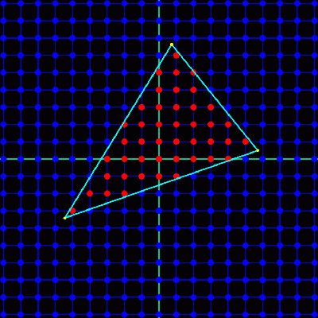
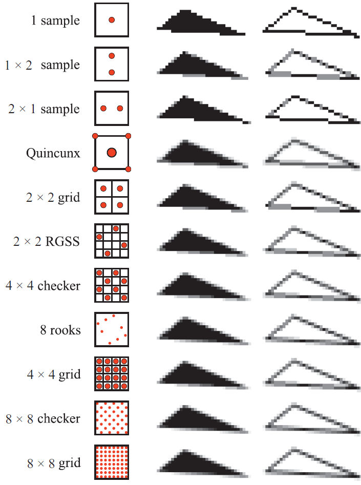
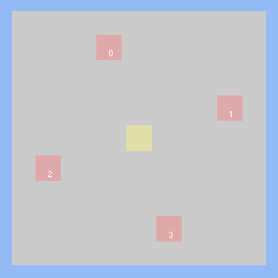
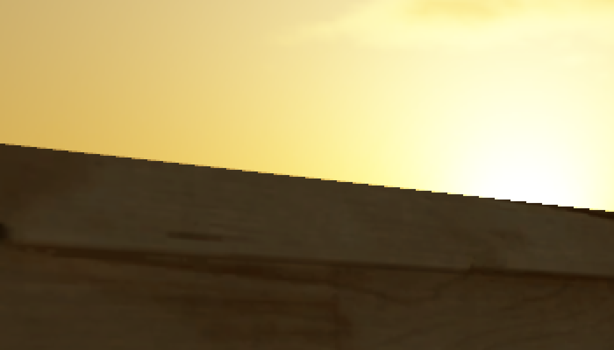
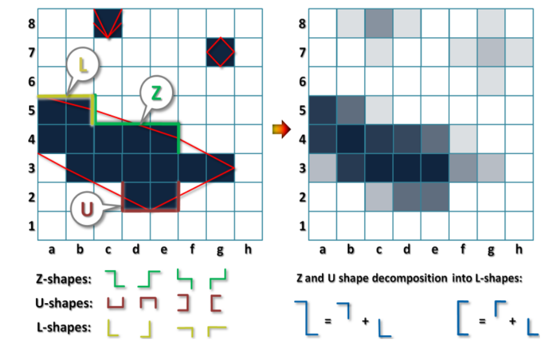
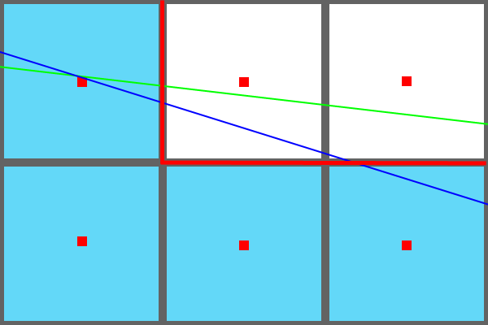

# MSAA基础

​       仔细想想，其实自己并不懂MSAA。所以还是得研究一下。**MSAA**还是有些复杂的，因为他几乎影响了整个GPU rasterization pipeline。如果想要理解MSAA为什么能够生效，还需要理解信号处理和图像采样的原理。首先感谢[MJP的blog](https://mynameismjp.wordpress.com/2012/10/24/msaa-overview/)，感谢MJP先生对MSAA的总结。

- [RASTERIZATION BASICS](http://aicdg.com/aa/#rasterization-basics)
- [OVERSAMPLING AND SUPERSAMPLING](http://aicdg.com/aa/#oversampling-and-supersampling)
- [SUPERSAMPLING EVOLVES INTO MSAA](http://aicdg.com/aa/#supersampling-evolves-into-msaa)
- [MSAA RESOLVE](http://aicdg.com/aa/#msaa-resolve)
- [COMPRESSION](http://aicdg.com/aa/#compression)
- [CSAA AND EQAA](http://aicdg.com/aa/#csaa-and-eqaa)
- [WORKING WITH HDR AND TONE MAPPING](http://aicdg.com/aa/#working-with-hdr-and-tone-mapping)
- [MLAA AND OTHER POST-PROCESS AA TECHNIQUES](http://aicdg.com/aa/#mlaa-and-other-post-process-aa-techniques)
- [参考](http://aicdg.com/aa/#参考)

# RASTERIZATION BASICS

​       现代GPU硬件上有渲染点，线和三角形图元的能力，通过*光栅化(rasterization)*。GPU上的rasterization pipeline以将要被渲染的*顶点(vertices)*作为输入，经过位移和透视投影变换后，在裁剪空间(clip space)上输出分布均匀的顶点位置。这些位置用于确认当前render target中哪些三角形会是可见的。可见性主要由两个因素决定：*覆盖(coverage)* 和 *遮挡(occlusion)*。通过执行一些测试来确定覆盖是否与给定像素重叠。在GPU中，通过测试图元是否与位于每个像素1的确切中心的单个采样点重叠来计算覆盖率。下图演示单个图元(三角形)的此过程：

form mjp's blog

​       遮挡告诉我们图元覆盖的像素是否也被任何其他三角形覆盖，并由*深度缓冲(z-buffering)*在GPU中处理。z缓冲区或深度缓冲区在每个像素位置存储相对于相机的最近图元的深度。当图元被光栅化时，将其内插深度与深度缓冲器中的值进行比较，以确定该像素是否被遮挡。如果深度测试成功，则使用新的最近深度更新深度缓冲区中的适当像素。关于深度测试需要注意的一点是，虽然它通常发生在像素着色之后，但几乎所有现代硬件都可以在着色发生之前执行某种形式的深度测试(early-Z)。这是作为优化完成的，因此被遮挡的像素可以跳过像素着色。GPU仍然支持在像素着色后执行深度测试，以便处理某些early-Z产生错误结果的情况。

​       覆盖和遮挡一起告诉我们图元的*可见性*。由于可见性可以定义为X和Y的2D函数，我们可以将其视为信号，并根据信号处理的概念定义其行为。例如，由于在渲染目标中的每个像素位置处执行覆盖和深度测试，因此可见性采样率由该渲染目标的X和Y分辨率确定。我们还应该注意，三角形和线条本身会具有不连续性，这意味着信号不是带限的(not  bandlimited)，因此在一般情况下，没有采样率足以避免走样(aliasing)。

# OVERSAMPLING AND SUPERSAMPLING

​       通常情况下避免无限频率的任意信号走样是不可能的，仍然可以通过 *oversampling*  来减少信号的走样。Oversampling是以高于我们预期的最终输出的某个速率对信号进行采样的过程，然后以输出采样率再次重构和重新采样信号。以更高的速率进行采样会导致信号频谱的克隆进一步分离。这导致较少的较高频率分量泄漏到信号的重建版本中，这在图像的情况下意味着走样减少。

​       当应用于图形和2D图像时，我们称之为*超级采样(SUPERSAMPLING)*，通常缩写为SSAA。在3D光栅化器中实现它是很简单的：渲染到高于屏幕的某个分辨率，然后使用重建滤镜下采样到屏幕分辨率。下图显示了应用于栅格化三角形的各种超级采样模式的结果：

form Real-Time Rendering, 3rd Edition, A K Peters 2008

​       SSAA因为简单有效，早期GPU驱动大多提供支持。但是存在严重的性能问题。当RT的分辨率增加时，物体的采样率会增加，但是同时pixel shader的负担也会增加，还会带来带宽问题和线程占用增加。

# SUPERSAMPLING EVOLVES INTO MSAA

​       我们已经确信超采样可以减少走样，但是性能不好。观察走样可以发现，走样只发生在三角形边缘。这是MSAA的理论基础。

​        在光栅化方面，MSAA的工作方式与超级采样类似。覆盖和遮挡测试均以高于正常的分辨率执行，通常为2x至8x。对于覆盖，硬件通过在像素内具有N个采样点来实现这一点，其中N是多采样率。这些采样点被称为subsamples，因为他们是sub-pixel  samples。下图是MSAA 4X的采样位置：

​       测试三角形在N个采样点中的每一个处的覆盖范围，基本上构建按位*coverage mask*，其表示由三角形覆盖的像素部分。对于遮挡测试，在每个覆盖的采样点处对三角形深度进行插值，并针对z缓冲区中的深度值进行测试。由于深度测试是针对每个子样本而不是针对每个像素执行的，因此必须扩充深度缓冲区的大小以存储附加深度值。实际上，这意味着深度缓冲区的大小是非MSAA大小的N倍。因此对于2xMSAA，深度缓冲区将是两倍大小，对于4x，它将是大小的四倍，依此类推。

​        MSAA开始与超级采样不同的地方是像素着色器被执行时。在标准MSAA情况下，不会为每个子样本执行像素着色器。相反，像素着色器仅针对三角形覆盖至少一个子样本的每个像素执行一次。或者换句话说，对于coverage   mask不为零的每个像素执行一次。此时，像素着色以与非MSAA渲染相同的方式发生：顶点属性被内插到像素的中心，并由像素着色器用于获取纹理并执行光照计算。这意味着当启用MSAA时，像素着色器成本不会显着增加，这是MSAA优于超级采样的主要优势。

​        虽然我们每个覆盖像素只执行一次像素着色器，但在渲染目标中每个像素仅存储一个输出值是不够的。我们需要渲染目标来支持存储多个样本，以便我们可以存储可能部分覆盖单个像素的多个三角形的结果。因此，MSAA渲染目标将具有足够的内存来存储每个像素的N个子样本。这在概念上类似于MSAA   z缓冲区，它还具有足够的内存来存储N个子样本。渲染目标中的每个子样本都映射到光栅化期间使用的子样本点之一，以确定覆盖范围。当像素着色器输出其值时，该值仅写入子样本，其中覆盖测试和深度测试都通过该像素。因此，如果三角形覆盖4x样本模式中的一半样本点，然后渲染目标中的一半子样本接收像素着色器输出值。或者，如果覆盖了所有采样点，则所有子采样都接收输出值。下图展示了这一概念：

​       通过使用coverage mask来确定要更新哪些子样本，最终结果是单个像素可以最终存储来自部分覆盖样本像素的N个不同三角形的输出。这有效地为我们提供了我们想要的结果，这是三角形可见性的过采样形式。以下图片取自[Direct3D 10文档](http://msdn.microsoft.com/en-us/library/windows/desktop/cc627092%28v=vs.85%29.aspx)，直观地总结了4xMSAA案例的光栅化过程：

# MSAA RESOLVE

​       与超级采样一样，在我们可以显示之前，必须将过采样信号重新采样到输出分辨率。使用MSAA，此过程称为resolving the  render  target。在其最早的版本中，解析过程在GPU上的固定功能硬件中执行。通常使用的滤波器是1像素宽的盒式滤波器，它基本上等于对给定像素内的所有子样本求平均值。这样的滤波器产生的结果使得完全覆盖的像素最终得到与非MSAA渲染相同的结果，根据您的观察方式，这可能被认为是好的或坏的（好的，因为您不会通过模糊无意识地减少细节）   ，不好因为盒式过滤器会引入postaliasing）。对于具有三角形边的像素，您将获得颜色值的商标渐变，其步数等于子像素样本的数量。看一下下面的图片，看看这个渐变对于各种MSAA模式是什么样的：

​        盒式过滤的一个例外是Nvidia的“Quincunx”AA，它可以作为DX8和DX9时代硬件（包括PS3使用的RSX）的驱动程序选项。启用后，它将使用以2x   MSAA模式中的一个样本为中心的2像素宽三角形滤波器。“quincunx”这个名称来自于解析过程最终使用以十字形梅花形图案排列的5个子样本。由于梅花形解析使用更宽的重建滤波器，因此与标准盒滤波器分辨率相比，混叠减少了。但是，使用更宽的滤波器也会导致更高频率的不必要的衰减。这可能导致“模糊”的外观似乎缺乏细节，这有时会对使用该功能的PS3游戏效果产生影响。AMD之后在3000和4000系显卡中也加入了类似的特性”Wide  Tent”，在三角形光栅化时横向也会多一个像素。

​       随着GPU和图形API的演进，我们最终获得了在自定义着色器中执行MSAA解析的能力，而不必依赖API函数来实现这一点。

# COMPRESSION

​        正如我们之前看到的，MSAA实际上并没有在光栅化复杂性或内存使用方面改进超级采样。乍一看，我们可能会得出结论，MSAA的唯一优势是像素着色器成本降低了。然而事实并非如此，因为它也可以改善带宽使用。回想一下像素着色器每个像素只用MSAA执行一次。结果，通常将相同的值写入MSAA渲染目标的所有N个子样本。GPU硬件能够通过发送像素着色器值与另一个值相结合来利用这一点，该另一个值指示应该写入哪些子样本，其充当无损压缩的形式。利用这种压缩方案，填充MSAA渲染目标所需的带宽可以显着小于超级采样情况所需的带宽。

# CSAA AND EQAA

​       自推出以来，随着图形硬件的发展，MSAA的基本原理还没有发生重大变化。我们已经讨论了某些Nvidia和ATI /  AMD硬件驱动程序支持的特殊解析模式，以及在MSAA渲染目标中任意访问子样本数据的能力，这是两个值得注意的例外。第三个例外是Nvidia的*Coverage Sampling Antialiasing（CSAA）*模式由DX10和DX11   GPU支持。这些模式通过将像素内的三角形的覆盖与存储由像素着色器输出的值的子样本解耦来寻求改善MSAA的质量/性能比。这个想法是，虽然子样本存储像素着色器输出的存储成本很高，但覆盖范围可以存储为紧凑的位掩码。这通过以某个子采样率进行光栅化并以该速率存储覆盖率，然后以较低的速率存储实际的子采样值来利用。例如，“8x”CSAA模式存储8个覆盖样本和4个像素着色器输出值。执行解析时，覆盖数据用于增强结果的质量。不幸的是，Nvidia没有提供此步骤的公开文档，因此这里不讨论具体细节。NV也没有提供shader中调用此能力的方法，因此只能在DX和openGL固定函数中使用。

​       AMD在他们的6900系列GPU中引入了一个非常相似的功能，他们将其命名为EQAA。与Nvidia一样，该功能可以通过驱动程序选项或特殊的MSAA质量模式启用，但不能用于通过着色器执行的自定义结算。

# WORKING WITH HDR AND TONE MAPPING

​        在HDR在实时图形中变得流行之前，我们基本上将显示就绪的颜色值渲染到我们的MSAA渲染目标，并且在解析之后仅应用简单的后处理过程。这意味着在用盒式滤波器解析之后，沿着三角形边缘的所得梯度将在相邻像素之间在感知上平滑。然而，当HDR，曝光和色调映射投入到混合中时，在每个像素处渲染的颜色与屏幕上显示的感知颜色之间不再存在任何接近线性关系的任何东西。因此，您不再能保证在使用盒式过滤器解析LDR  MSAA样本时获得平滑渐变。这会严重影响分辨率的输出，因为如果在几何边缘上存在极端对比度，它可能最终看起来好像根本没有使用MSAA。

> 在HDR之前常用的伽马空间渲染实际上会产生不完全平滑的渐变，尽管后来的GPU支持在线性空间中执行解析。无论哪种方式，结果都非常接近感知平滑，至少与HDR渲染可能出现的结果相比

​       Humus（Emil Persson）首先指出了这个奇怪的现象（据我所知），他创造了一个[Demo](http://www.humus.name/index.php?page=3D&ID=77)，展示了它以及相应的ShaderX6文章。在同一个样本中，他还展示了MSAA解析的另一种方法，他使用自定义解决方案在过滤之前单独将色调映射应用于每个子样本。他的结果非常引人注目，正如你可以从这些图像中看到的那样（左边是典型的解析，右边是色调映射后的解析

HDR rendering with MSAA. The top image applies tone mapping  after a standard MSAA resolve, while the bottom image applies tone  mapping before the MSAA resolve.

​        重要的是要考虑在解决之前应用色调映射实际意味着什么。在色调映射之前，我们实际上可以认为自己正在使用表示模拟中光的物理量的值。首先，我们正在处理光辉(radiance)从表面朝向眼睛反射的光线。在色调映射阶段，我们尝试将物理光量转换为表示应在屏幕上显示的颜色的新值。这意味着通过改变解决方案的位置，我们实际上是对不同的信号进行过采样！当在色调映射之前解析时，我们过度采样表示被反射到相机的物理光的信号，并且当在色调映射之后解析时，我们过度采样表示屏幕上显示的颜色的信号。因此，我们必须考虑的重要因素是我们实际想要过度采样的信号。这直接与后处理有关，因为现代游戏通常会有几个后处理效果需要使用HDR辐射值而不是显示颜色。因此，我们希望将色调映射作为后处理链中的最后一步。这在解决之前呈现色调映射方法的潜在困难，因为这意味着所有先前的后处理步骤必须与未解析的MSAA一起作为输入并且还产生MSAA缓冲器作为输出。这显然会产生严重的内存和性能影响，具体取决于传递的实现方式。

​       在MSAA分辨率下执行色调映射的一种更简单，更实用的替代方法是使用以下过程：

1. 在MSAA解析HDR渲染目标期间，将色调映射和曝光应用于每个子样本
2. 对每个子样本应用重建滤波器以计算已解析的色调映射值
3. 应用色调映射和曝光（或近似）的逆转回到线性HDR空间

# MLAA AND OTHER POST-PROCESS AA TECHNIQUES

​       *Morphological Anti-Aliasing*是一种最初由英特尔开发的抗锯齿技术，它引发了一系列以性能为导向的AA解决方案，通常被称为后处理抗锯齿。这个名称是因为它们没有像MSAA那样从根本上改变渲染/光栅化管道。相反，它们仅使用非MSAA渲染目标来生成结果。以这种方式，这些技术相当有趣，因为它们实际上并不依赖于增加采样率以减少混叠。相反，他们使用可以被认为是高级重建滤波器的方法来近似从过采样中得到的结果。特别是在MLAA的情况下，该重建滤波器使用模式匹配来尝试检测三角形的边缘。模式匹配依赖于以下事实：对于固定的样本模式，光栅化器将为三角形边缘生成常见的像素模式。通过检查像素的局部邻域的颜色，该算法能够估计三角形边缘的位置以及构成该特定边缘的线的方向。然后，边缘和颜色信息足以估计该特定边缘的分析描述，其可用于计算将被三角形覆盖的像素的精确分数。如果正确计算边缘，则这非常强大，因为它消除了对多个子像素覆盖样本的需要。实际上，如果覆盖量用于将三角形颜色与该三角形后面的颜色混合，则结果将与标准MSAA渲染的输出与无限子样本匹配！下图显示了用于边缘检测的一些模式，以及混合后的结果：

MLAA edge detection using pattern recognition (from MLAA: Efficiently Moving Antialiasing from the GPU to the CPU)

​       当算法**不能**准确估计三角形边缘时，会出现MLAA和类似技术的主要问题。仅查看单个帧，将难以或不可能识别所产生的图形。然而，在视频流中，由于三角形或相机在世界空间中移动时出现的三角形的子像素旋转，问题变得明显。看一下下图：

​        在该图像中，蓝线表示一帧期间的三角形边缘，绿线表示下一帧中的相同三角形边缘。边缘相对于像素的方向已经改变，但是在两种情况下，只有最左边的像素被标记为被光栅化器“覆盖”。因此，两个帧的光栅化器产生相同的像素图案（由图像中的蓝色方块标记），并且MLAA算法检测相同的边缘图案（由图像中的粗红线表示）。随着边缘继续旋转，最终它将覆盖顶部中间像素的采样点，并且该像素将“打开”。在得到的视频流中，像素将显示为“弹出”，而不是平滑地从非覆盖状态转换到覆盖状态。这是基于时间的抗锯齿方式的特征，并且MLAA无法减少它。对于薄的或小的几何形状，效果甚至可能更令人讨厌，其中三角形的整个部分将在帧与帧之间出现和消失，从而导致“闪烁”效果。MSAA和超级采样在光栅化器使用的采样率增加的情况下能够减少这种锯齿，但是会发生在运动的中间过程中像素子像素移动而不是突然出现和消失。

Two animations of a rotating triangle. The top image has FXAA  enabled, which uses techniques similar to MLAA to reconstruct edges. The  bottom edge uses 4x MSAA, which supersamples the visibility test at the  edges of the triangle. Notice how in the MSAA image pixels will  transition through intermediate values as the triangle moves across the  sub-pixel sample points. The FXAA image lacks this characteristic,  despite producing smoother gradients along the edges.

​        MLAA和类似算法的另一个潜在问题是，如果仅使用颜色信息，它们可能无法检测边缘或检测到“假”边缘。在这种情况下，可以通过使用深度缓冲器和/或普通缓冲器来增强边缘检测的准确性。另一个潜在的问题是该算法使用与三角形相邻的颜色作为三角形背后颜色的代理，这实际上可能是不同的。

# 参考

1. <https://mynameismjp.wordpress.com/2012/10/24/msaa-overview/>
2. <https://github.com/TheRealMJP/MSAAFilter>
3. <http://advances.realtimerendering.com/s2015/rad_siggraph_advances_2015.pptx>
4. <https://mynameismjp.wordpress.com/2012/10/28/msaa-resolve-filters/>
