# 深入剖析MSAA

本文打算对MSAA(Multisample anti aliasing)做一个深入的讲解，包括基本的原理、以及不同平台上的实现对比（主要是PC与Mobile）。文章中难免有错误之处，如有发现，还请指证，以免误导其他人。好了，废话不多说，下面我们开始正文。

## MSAA的原理

在介绍MSAA原理之前，我们先对走样（Aliasing）做个简单介绍。

## Aliasing(走样)

在介绍MSAA原理之前，我们先对走样（Aliasing）做个简单介绍。在信号处理以及相关领域中，走样（混叠）在对不同的信号进行采样时，导致得出的信号相同的现象。它也可以指信号从采样点重新信号导致的跟原始信号不匹配的瑕疵。[[1\]](https://zhuanlan.zhihu.com/p/32823370/edit#_edn1)它分为时间走样（比如数字音乐、以及在电影中看到车轮倒转等）和空间走样两种（摩尔纹[[2\]](https://zhuanlan.zhihu.com/p/32823370/edit#_edn2)）。这里我们不详细展开。

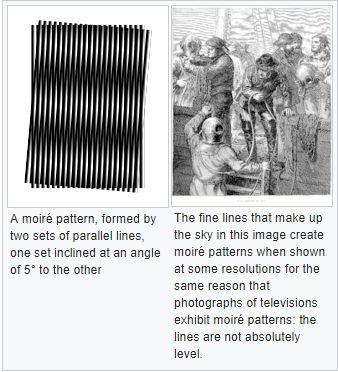

具体到实时渲染领域中，走样有以下三种：[[3\]](https://zhuanlan.zhihu.com/p/32823370/edit#_edn3)

\1. 几何体走样（几何物体的边缘有锯齿），几何走样由于对几何边缘采样不足导致。

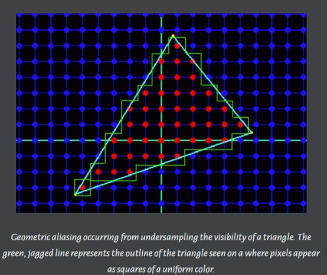

\2. 着色走样，由于对着色器中着色公式（渲染方程）采样不足导致。比较明显的现象就是高光闪烁。

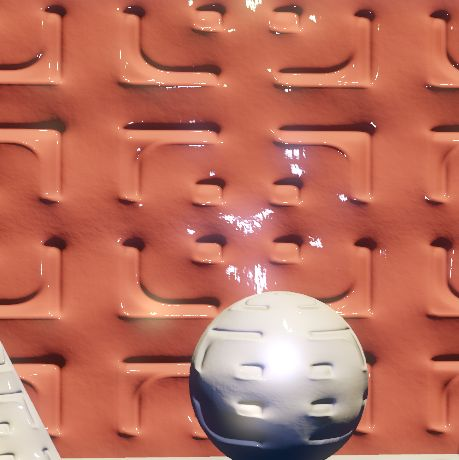

上面一张图显示了由于对使用了高频法线贴图的高频高光BRDF采样不足时产生的着色走样。下面这张图显示了使用4倍超采样产生的效果。

\3. 时间走样，主要是对高速运动的物体采样不足导致。比如游戏中播放的动画发生跳变等。

## SSAA（超采样反走样）

从名字可以看出，超采样技术就是以一个更大的分辨率来渲染场景，然后再把相邻像素值做一个过滤（比如平均等）得到最终的图像（Resolve）。因为这个技术提高了采样率，所以它对于解决上面几何走样和着色走样都是有效果的。[[4\]](https://zhuanlan.zhihu.com/p/32823370/edit#_edn4)如下图所示，首先经对每个像素取n个子采样点，然后针对每个子像素点进行着色计算。最后根据每个子像素的值来合成最终的图像。

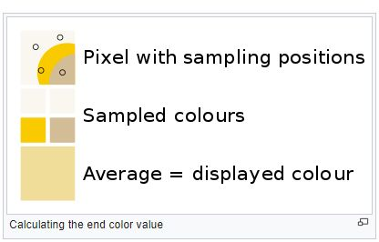

虽然SSAA可以有效的解决几何走样和着色走样问题，但是它需要更多的显存空间以及更多的着色计算（每个子采样点都需要进行光照计算），所以一般不会使用这种技术。顺着上面的思路，如果我们对最终的每个像素着色，而不是每个子采样点着色的话，那这样虽然显存还是那么多，但是着色的数量少了，那它的效率也会有比较大的提高。这就是我们今天想要主要说的MSAA技术。

## MSAA(多重采样反走样)

在前面提到的SSAA中，每个子采样点都要进行单独的着色，这样在片断（像素）着色器比较复杂的情况下还是很费的。那么能不能只计算每个像素的颜色，而对于那些子采样点只计算一个覆盖信息（coverage）和遮挡信息（occlusion）来把像素的颜色信息写到每个子采样点里面呢？最终根据子采样点里面的颜色值来通过某个重建过滤器来降采样生成目标图像。这就是MSAA的原理。注意这里有一个很重要的点，就是每个子像素都有自己的颜色、深度模板信息，并且每一个子采样点都是需要经过深度和模板测试才能决定最终是不是把像素的颜色得到到这个子采样点所在的位置，而不是简单的作一个覆盖测试就写入颜色。关于这个的出处，我在接下来的文章里会写出多个出处来佐证这一点。现在让我们先把MSAA的原理讲清楚。

## Coverage（覆盖）以及Occlusion(遮挡)**[5]**

一个支持D3D11的显卡支持通过光栅化来渲染点、线以及三角形。显卡上的光栅化管线把图形的顶点当作输入，这些顶点的位置是在经由透视变换的齐次裁剪空间。它们用来决定这个三角形在当前渲染目标上的像素的位置。这个可见像素由两个因素决定:

- 覆盖 覆盖是通过判断一个图形是否跟一个指定的像素重叠来决定的。在显卡中，覆盖是通过测试一个采样点是否在像素的中心来决定的。接下来的图片说明了这个过程。

一个三角形的覆盖信息。蓝色的点代表采样点，每一个都在像素的中心位置。红色的点代表三角形覆盖的采样点。

- 遮挡告诉我们被一个图形覆盖的像素是否被其它的像素覆盖了，这种情况大家应该很熟悉就是z buffer的深度测试。

覆盖和遮挡两个一起决定了一个图形的可见性。

就光栅化而言，MSAA跟SSAA的方式差不多，覆盖和遮挡信息都是在一个更大分辨率上进行的。对于覆盖信息来说，硬件会对每个子像素根据采样规则生成n的子采样点。接下来的这张图展示了一个使用了旋转网格（rotated grid）采样方式的子采样点位置。

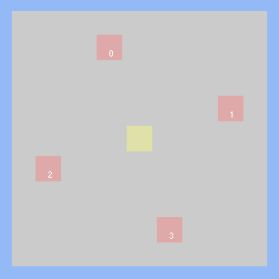

三角形会与像素的每个子采样点进行覆盖测试，会生成一个二进制覆盖掩码，它代表了这个三角形覆盖当前像素的比例。对于遮挡测试来说，三角形的深度在每一个覆盖的子采样点的位置进行插值，并且跟z   buffer中的深度信息进行比较。由于深度测试是在每个子采样点的级别而不是像素级别进行的，深度buffer必须相应的增大以来存储额外的深度值。在实现中，这意味着深度缓冲区是非MSAA情况下的n倍。

MSAA跟SSAA不同的地方在于，SSAA对于所有子采样点着色，而MSAA只对当前像素覆盖掩码不为0的进行着色，顶点属性在像素的中心进行插值用于在片断程序中着色。这是MSAA相对于SSAA来说最大的好处。

虽然我们只对每个像素进行着色，但是并不意味着我们只需要存储一个颜色值，而是需要为每一个子采样点都存储颜色值，所以我们需要额外的空间来存储每个子采样点的颜色值。所以，颜色缓冲区的大小也为非MSAA下的n倍。当一个片断程序输出值时，只有地了覆盖测试和遮挡测试的子采样点才会被写入值。因此如果一个三角形覆盖了4倍采样方式的一半，那么一半的子采样点会接收到新的值。或者如果所有的子采样点都被覆盖，那么所有的都会接收到值。接下来的这张图展示了这个概念：

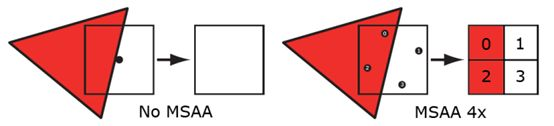

通过使用覆盖掩码来决定子采样点是否需要更新值，最终结果可能是n个三角形部分覆盖子采样点的n个值。接下来的图像展示了4倍MSAA光栅化的过程。

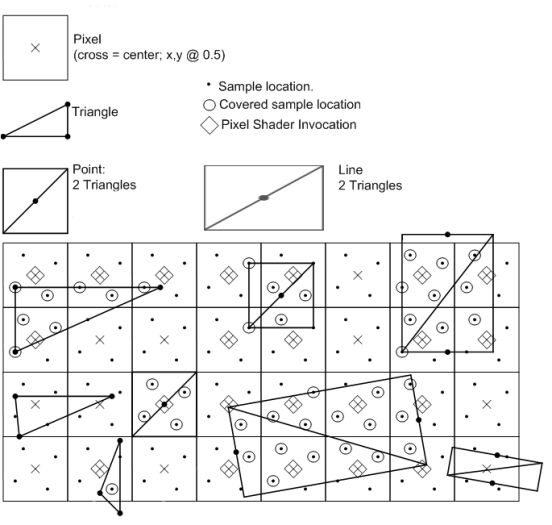

## MSAA Resolve(MSAA 解析)

像超采样一样，过采样的信号必须重新采样到指定的分辨率，这样我们才可以显示它。

这个过程叫解析（resolving）。在它最早的版本里，解析过程是在显卡的固定硬件里完成的。一般使用的采样方法就是一像素宽的box过滤器。这种过滤器对于完全覆盖的像素会产生跟没有使用MSAA一样的效果。好不好取决于怎么看它（好是因为你不会因为模糊而减少细节，坏是因为一个box过滤器会引入后走样（postaliasing））。对于三角形边上的像素，你会得到一个标志性的渐变颜色值，数量等于子采样点的个数。接下来的图展示了这一现象：

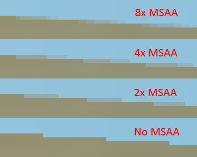

当然不同的硬件厂商可能会使用不同的算法。比如nVidia的”Quincunx” AA等。随着显卡的不断升级，我们现在可以通过自定义的shader来做MSAA的解析了。[[6\]](https://zhuanlan.zhihu.com/p/32823370/edit#_edn6)

## 小结

通过上面的解释，我们可以看到，整个MSAA并不是在光栅化阶段就可以完全的，它在这个阶段只是生成覆盖信息，然后计算像素颜色，根据覆盖信息和深度信息决定是否来写入子采样点。整个完成后再通过某个过滤器进行降采样得到最终的图像。大体流程如下所示：[[7\]](https://zhuanlan.zhihu.com/p/32823370/edit#_edn7)

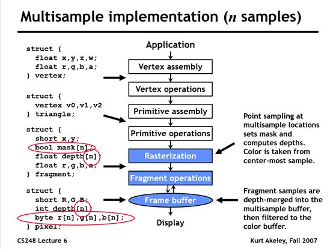

## PC与Mobile对比

上面我们讲解了MSAA的基本原理，那么具体到不同显卡厂商以及不同平台上的实现有什么不同吗？下面就让我们做些简单的对比。其实，既然算法已经确定了，那么差异基本上就是在一些细节上的处理，以及GPU架构不同带来的差异。

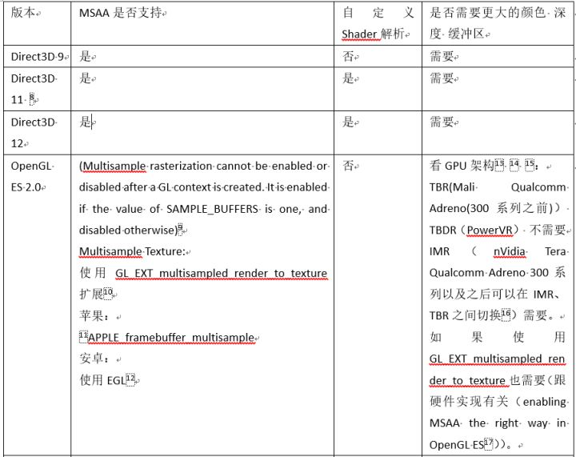

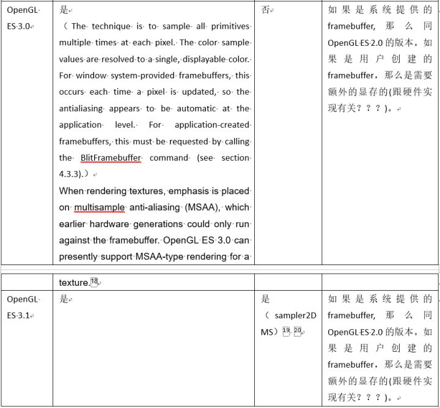

## IMR vs TBR vs TBDR**[21]** **[22]**

## IMR （立即渲染模式）

目前PC平台上基本上都是立即渲染模式，CPU提交渲染数据和渲染命令，GPU开始执行。它跟当前已经画了什么以及将来要画什么的关系很小（Early Z除外）。流程如下图所示：

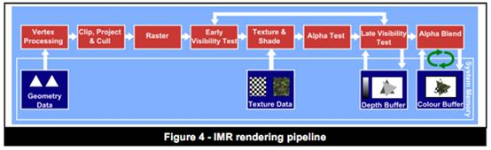

## TBR（分块渲染）

TBR把屏幕分成一系列的小块，每个单独来处理，所以可以做到并行。由于在任何时候显卡只需要场景中的一部分数据就可完成工作，这些数据（如颜色   深度等）足够小到可以放在显卡芯片上（on-chip），有效得减少了存取系统内存的次数。它带来的好处就是更少的电量消耗以及更少的带宽消耗，从而会获得更高的性能。

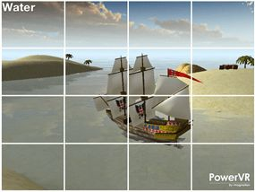Tiled

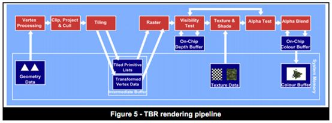

## TBDR （分块延迟渲染）

TBDR跟TBR有些相似，也是分块，并使用在芯片上的缓存来存储数据（颜色以及深度等），它还使用了延迟技术，叫隐藏面剔除（Hidden  Surface  Removal），它把纹理以及着色操作延迟到每个像素已经在块中已经确定可见性之后，只有那些最终被看到的像素才消耗处理资源。这意味着隐藏像素的不必要处理被去掉了，这确保了每帧使用最低可能的带宽使用和处理周期数，这样就可以获取更高的性能以及更少的电量消耗。

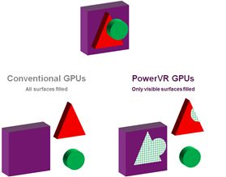传统GPU与TBDR的简单对比

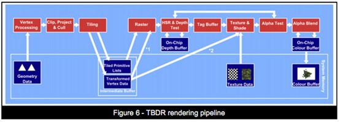

## 移动平台上的MSAA

有了上面对移动GPU架构的简单了解，下面我们看下在移动平台上是怎么处理MSAA的，如下图所示：[[23\]](https://zhuanlan.zhihu.com/p/32823370/edit#_edn23)

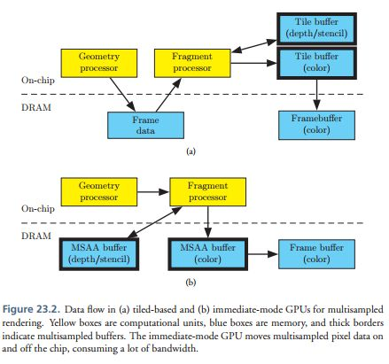

可以看到如果相对于IMR模式的显卡来说，TBR或者TBDR的实现MSAA会省很多，因为好多工作直接在on-chip上就完成了。这里还是有两个消耗：

\1. 4倍MSAA需要四倍的块缓冲内存。由于芯片上的块缓冲内存很最贵，所以显卡会通过减少块的大小来消除这个问题。减少块的大小对性能有所影响，但是减少一半的大小并不意味着性能会减半，瓶颈在片断程序的只会有一个很小的影响。

\2.   第二个影响就是在物体边缘会产生更多的片断，这个在IMR模式下也有。每个多边形都会覆盖更多的像素如下图所示。而且，背景和前景的图形都贡献到一个交互的地方，两片断都需要着色，这样硬件隐藏背面剔除就会剔除更少的像素。这些额外片断的消耗跟场景是由多少边缘组成有关，但是10%是一个比较好的猜测。

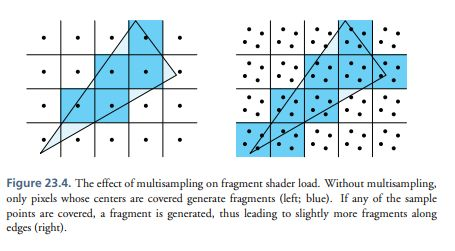

## 主流移动GPU的实现细节

## Mali:

JUST22  - Multisampled resolve on-tile is supported in hardware with no  bandwidth hit Mali GPUs support resolving multisampled framebuffers  on-tile. Combined with tile-buffer support for full throughput in 4x  MSAA makes 4x MSAA a very compelling way of improving quality with  minimal speed hit.[[24\]](https://zhuanlan.zhihu.com/p/32823370/edit#_edn24)

In  GLES on Mali GPUs, the simplest case for 4xMSAA would be to render  directly to the window surface (FB0), having set EGL_SAMPLES to 4. This  will do all multisampling and resolving in the GPU registers, and will  only flush the resolved buffer to memory. This is the most efficient way  to implement MSAA on a Mali GPU, and comes at almost no performance  cost compared to rendering to a normal window surface. Note that this  does not expose the sample buffers themselves to you, and does not  require an explicit resolve.[[25\]](https://zhuanlan.zhihu.com/p/32823370/edit#_edn25)

## Qualcomm Adreno:

Anti-aliasing  is an important technique for improving the quality of generated  images. It reduces the visual artifacts of rendering into discrete  pixels.Among the various techniques for reducing aliasing effects,  multisampling is efficiently supported by Adreno 4x. Multisampling  divides every pixel into a set of samples, each of which is treated like  a “mini-pixel” during rasterization. Each sample has its own color,  depth, and stencil value. And those values are preserved until the image  is ready for display. When it is time to compose the final image, the  samples are resolved into the final pixel color. Adreno 4xx supports the  use of two or four samples per pixel.

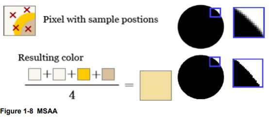

## PowerVR:

Another  benefit of the SGX and SGX-MP architecture is the ability to perform  efficient 4x Multi-Sample Anti-Aliasing (MSAA). MSAA is performed  entirely on-chip, which keeps performance high without introducing a  system memory bandwidth overhead (as would be seen when performing  anti-aliasing in some other architectures). To achieve this, the tile  size is effectively quartered and 4 sample positions are taken for each  fragment (e.g., if the tile size is 16x16, an 8x8 tile will be processed  when MSAA is enabled). The reduction in tile size ensures the hardware  has sufficient memory to process and store colour, depth and stencil  data for all of the sample positions. When the ISP operates on each  tile, HSR and depth tests are performed for all sample positions.  Additionally, the ISP uses a 1 bit flag to indicate if a fragment  contains an edge. This flag is used to optimize blending operations  later in the render. When the subsamples are submitted to the TSP,  texturing and shading operations are executed on a per-fragment basis,  and the resultant colour is set for all visible subsamples. This means  that the fragment workload will only slightly increase when MSAA is  enabled, as the subsamples within a given fragment may be coloured by  different primitives
when the fragment contains an edge. When performing blending, the edge flag set
by  the ISP indicates if the standard blend path needs to be taken, or if  the optimized path can be used. If the destination fragment contains an  edge, then the blend needs to be performed individually for each visible  subsample to give the correct resultant colour (standard blend). If the  destination fragment does not contain an edge, then the blend operation  is performed once and the colour is set for all visible subsamples  (optimized blend). Once a tile has been rendered, the Pixel Back End  (PBE) combines the subsample colours for each fragment into a single  colour value that can be written to the frame buffer in system memory.  As this combination is done on the hardware before the colour data is  sent, the system memory bandwidth required for the tile flush is  identical to the amount that would be required when MSAA is not enabled.[[26\]](https://zhuanlan.zhihu.com/p/32823370/edit#_edn26)

On  PowerVR hardware Multi-Sampled Anti-Aliasing (MSAA) can be performed  directly in on-chip memory before being written out to system memory,  which saves valuable memory bandwidth. In general, MSAA is considered to  cost relatively little performance. This is true for typical games and  UIs, which have low geometry counts but very complex shaders. The  complex shaders typically hide the cost of MSAA and have a reduced blend  workload. 2x MSAA is virtually free on most PowerVR graphics cores  (Rogue onwards), while 4x MSAA+ will noticeably impact performance. This  is partly due to the increased on-chip memory footprint, which results  in a reduction in tile dimensions (for instance 32 x 32 -> 32 x 16  -> 16 x 16 pixels) as the number of samples taken increases. This in  turn results in an increased number of tiles that need to be processed  by the tile accelerator hardware, which then increases the vertex stages  overall processing cost. The concept of „good enough‟ should be  followed in determining how much anti-aliasing is enough. An application  may only require 2x MSAA to look „good enough‟, while performing  comfortably at a consistent 60 FPS. In some cases there may be no need  for anti-aliasing to be used at all e.g. when the target device‟s  display has high PPI (pixels per-inch). Performing MSAA becomes more  costly when there is an alpha blended edge, resulting in the graphics  core marking the pixels on the edge to “on edge blend”. On edge blend is  a costly operation, as the blending is performed for each sample by a  shader (i.e. in software). In contrast, on opaque edge is performed by  dedicated hardware, and is a much cheaper operation as a result. On edge  blend is also „sticky‟, which means that once an on-screen pixel is  marked, all subsequent blended pixels are blended by a shader, rather  than by dedicated hardware. In order to mitigate these costs, submit all  opaque geometry first, which keeps the pixels “off edge” for as long as  possible. Also, developers should be extremely reserved with the use of  blending, as blending has lots of performance implications, not just  for MSAA. [[27\]](https://zhuanlan.zhihu.com/p/32823370/edit#_edn27)

## 总结

通过上面的讲解，我们了解了MSAA的实现原理，以及在PC平台和移动平台上因为架构的不同导致具体实现细节的不同。MSAA是影响了GPU管理的光栅化、片断程序、光栅操作阶段（每个子采样点都要做深度测试）的。每个子采样点都是有自己的颜色和深度存储的，并且每个子采样点都会做深度测试。在移动平台上，是否需要额外的空间来存储颜色和深度需要根据OpenGL   ES的版本以及具体硬件的实现有关。MSAA在一般的情况下（不需要额外空间来存储颜色和深度，直接在on-chip上完成子采样点计算，然后直接resolve到framebuffer）是要比PC平台上效率高的，因为没有了那么大的带宽消耗。但是鉴于硬件实现差异大，建议还是以实测为准。由于本人水平有限，难免会有错误的地方。如有发现，还请指正，以免误导了他人。

------

[[1\]](https://zhuanlan.zhihu.com/p/32823370/edit#_ednref1) [https://en.wikipedia.org/wiki/Aliasing](https://link.zhihu.com/?target=https%3A//en.wikipedia.org/wiki/Aliasing)

[[2\]](https://zhuanlan.zhihu.com/p/32823370/edit#_ednref2) [https://en.wikipedia.org/wiki/Moir%C3%A9_pattern](https://link.zhihu.com/?target=https%3A//en.wikipedia.org/wiki/Moir%25C3%25A9_pattern)

[[3\]](https://zhuanlan.zhihu.com/p/32823370/edit#_ednref3) [https://mynameismjp.wordpress.com/2012/10/21/applying-sampling-theory-to-real-time-graphics/](https://link.zhihu.com/?target=https%3A//mynameismjp.wordpress.com/2012/10/21/applying-sampling-theory-to-real-time-graphics/) 

[[4\]](https://zhuanlan.zhihu.com/p/32823370/edit#_ednref4) [https://en.wikipedia.org/wiki/Supersampling](https://link.zhihu.com/?target=https%3A//en.wikipedia.org/wiki/Supersampling)

[[5\]](https://zhuanlan.zhihu.com/p/32823370/edit#_ednref5) [https://mynameismjp.wordpress.com/2012/10/24/msaa-overview/](https://link.zhihu.com/?target=https%3A//mynameismjp.wordpress.com/2012/10/24/msaa-overview/)

[[6\]](https://zhuanlan.zhihu.com/p/32823370/edit#_ednref6) [https://mynameismjp.wordpress.com/2012/10/28/msaa-resolve-filters/](https://link.zhihu.com/?target=https%3A//mynameismjp.wordpress.com/2012/10/28/msaa-resolve-filters/)

[[7\]](https://zhuanlan.zhihu.com/p/32823370/edit#_ednref7) [http://graphics.stanford.edu/courses/cs248-07/lectures/2007.10.11%20CS248-06%20Multisample%20Antialiasing/2007.10.11%20CS248-06%20Multisample%20Antialiasing.ppt](https://link.zhihu.com/?target=http%3A//graphics.stanford.edu/courses/cs248-07/lectures/2007.10.11%2520CS248-06%2520Multisample%2520Antialiasing/2007.10.11%2520CS248-06%2520Multisample%2520Antialiasing.ppt)

[[8\]](https://zhuanlan.zhihu.com/p/32823370/edit#_ednref8) [https://msdn.microsoft.com/en-us/library/windows/desktop/cc627092(v=vs.85).aspx](https://link.zhihu.com/?target=https%3A//msdn.microsoft.com/en-us/library/windows/desktop/cc627092%28v%3Dvs.85%29.aspx)

[[9\]](https://zhuanlan.zhihu.com/p/32823370/edit#_ednref9) [https://www.khronos.org/registry/OpenGL/specs/es/2.0/es_full_spec_2.0.pdf](https://link.zhihu.com/?target=https%3A//www.khronos.org/registry/OpenGL/specs/es/2.0/es_full_spec_2.0.pdf)

[[10\]](https://zhuanlan.zhihu.com/p/32823370/edit#_ednref10) [https://www.khronos.org/registry/OpenGL/extensions/EXT/EXT_multisampled_render_to_texture.txt](https://link.zhihu.com/?target=https%3A//www.khronos.org/registry/OpenGL/extensions/EXT/EXT_multisampled_render_to_texture.txt)

[[11\]](https://zhuanlan.zhihu.com/p/32823370/edit#_ednref11) [https://developer.apple.com/library/content/documentation/3DDrawing/Conceptual/OpenGLES_ProgrammingGuide/WorkingwithEAGLContexts/WorkingwithEAGLContexts.html#//apple_ref/doc/uid/TP40008793-CH103-SW4](https://link.zhihu.com/?target=https%3A//developer.apple.com/library/content/documentation/3DDrawing/Conceptual/OpenGLES_ProgrammingGuide/WorkingwithEAGLContexts/WorkingwithEAGLContexts.html%23//apple_ref/doc/uid/TP40008793-CH103-SW4)

[[12\]](https://zhuanlan.zhihu.com/p/32823370/edit#_ednref12) [https://stackoverflow.com/questions/27035893/antialiasing-in-opengl-es-2-0](https://link.zhihu.com/?target=https%3A//stackoverflow.com/questions/27035893/antialiasing-in-opengl-es-2-0)

[[13\]](https://zhuanlan.zhihu.com/p/32823370/edit#_ednref13) [https://www.imgtec.com/blog/a-look-at-the-powervr-graphics-architecture-tile-based-rendering/](https://link.zhihu.com/?target=https%3A//www.imgtec.com/blog/a-look-at-the-powervr-graphics-architecture-tile-based-rendering/)

[[14\]](https://zhuanlan.zhihu.com/p/32823370/edit#_ednref14) [https://www.imgtec.com/blog/understanding-powervr-series5xt-powervr-tbdr-and-architecture-efficiency-part-4/](https://link.zhihu.com/?target=https%3A//www.imgtec.com/blog/understanding-powervr-series5xt-powervr-tbdr-and-architecture-efficiency-part-4/)

[[15\]](https://zhuanlan.zhihu.com/p/32823370/edit#_ednref15) [https://en.wikipedia.org/wiki/Tiled_rendering](https://link.zhihu.com/?target=https%3A//en.wikipedia.org/wiki/Tiled_rendering)

[[16\]](https://zhuanlan.zhihu.com/p/32823370/edit#_ednref16) [https://www.qualcomm.com/media/documents/files/the-rise-of-mobile-gaming-on-android-qualcomm-snapdragon-technology-leadership.pdf](https://link.zhihu.com/?target=https%3A//www.qualcomm.com/media/documents/files/the-rise-of-mobile-gaming-on-android-qualcomm-snapdragon-technology-leadership.pdf)

[[17\]](https://zhuanlan.zhihu.com/p/32823370/edit#_ednref17) [https://static.docs.arm.com/100019/0100/arm_mali_application_developer_best_practices_developer_guide_100019_0100_00_en2.pdf](https://link.zhihu.com/?target=https%3A//static.docs.arm.com/100019/0100/arm_mali_application_developer_best_practices_developer_guide_100019_0100_00_en2.pdf)

[[18\]](https://zhuanlan.zhihu.com/p/32823370/edit#_ednref18) [https://www.imgtec.com/blog/introducing-the-brand-new-opengl-es-3-0/](https://link.zhihu.com/?target=https%3A//www.imgtec.com/blog/introducing-the-brand-new-opengl-es-3-0/)

[[19\]](https://zhuanlan.zhihu.com/p/32823370/edit#_ednref19) [https://www.khronos.org/assets/uploads/developers/library/2014-gdc/Khronos-OpenGL-ES-GDC-Mar14.pdf](https://link.zhihu.com/?target=https%3A//www.khronos.org/assets/uploads/developers/library/2014-gdc/Khronos-OpenGL-ES-GDC-Mar14.pdf)

[[20\]](https://zhuanlan.zhihu.com/p/32823370/edit#_ednref20) [https://android.googlesource.com/platform/external/deqp/+/193f598/modules/gles31/functional/es31fMultisampleShaderRenderCase.cpp](https://link.zhihu.com/?target=https%3A//android.googlesource.com/platform/external/deqp/%2B/193f598/modules/gles31/functional/es31fMultisampleShaderRenderCase.cpp)

[[21\]](https://zhuanlan.zhihu.com/p/32823370/edit#_ednref21) [https://www.anandtech.com/show/4686/samsung-galaxy-s-2-international-review-the-best-redefined/15](https://link.zhihu.com/?target=https%3A//www.anandtech.com/show/4686/samsung-galaxy-s-2-international-review-the-best-redefined/15)

[[22\]](https://zhuanlan.zhihu.com/p/32823370/edit#_ednref22) [https://www.imgtec.com/blog/a-look-at-the-powervr-graphics-architecture-tile-based-rendering/](https://link.zhihu.com/?target=https%3A//www.imgtec.com/blog/a-look-at-the-powervr-graphics-architecture-tile-based-rendering/)

[[23\]](https://zhuanlan.zhihu.com/p/32823370/edit#_ednref23) [http://www.seas.upenn.edu/~pcozzi/OpenGLInsights/OpenGLInsights-TileBasedArchitectures.pdf](https://link.zhihu.com/?target=http%3A//www.seas.upenn.edu/~pcozzi/OpenGLInsights/OpenGLInsights-TileBasedArchitectures.pdf)

[[24\]](https://zhuanlan.zhihu.com/p/32823370/edit#_ednref24) [https://static.docs.arm.com/100019/0100/arm_mali_application_developer_best_practices_developer_guide_100019_0100_00_en2.pdf](https://link.zhihu.com/?target=https%3A//static.docs.arm.com/100019/0100/arm_mali_application_developer_best_practices_developer_guide_100019_0100_00_en2.pdf)

[[25\]](https://zhuanlan.zhihu.com/p/32823370/edit#_ednref25) [https://community.arm.com/graphics/f/discussions/4426/multisample-antialiasing-using-multisample-fbo](https://link.zhihu.com/?target=https%3A//community.arm.com/graphics/f/discussions/4426/multisample-antialiasing-using-multisample-fbo)

[[26\]](https://zhuanlan.zhihu.com/p/32823370/edit#_ednref26) [http://cdn.imgtec.com/sdk-documentation/PowerVR+Series5.Architecture+Guide+for+Developers.pdf](https://link.zhihu.com/?target=http%3A//cdn.imgtec.com/sdk-documentation/PowerVR%2BSeries5.Architecture%2BGuide%2Bfor%2BDevelopers.pdf)

[[27\]](https://zhuanlan.zhihu.com/p/32823370/edit#_ednref27) [http://cdn.imgtec.com/sdk-documentation/PowerVR.Performance+Recommendations.pdf](https://link.zhihu.com/?target=http%3A//cdn.imgtec.com/sdk-documentation/PowerVR.Performance%2BRecommendations.pdf)

编辑于 2018-01-10
