# 游戏中的Volumetric Rendering

总结下游戏中常见的Volumetric Rendering的实现方法

## 1. 一些理论知识

快速简要地介绍一些理论知识.

光打到粒子上之后的效果:

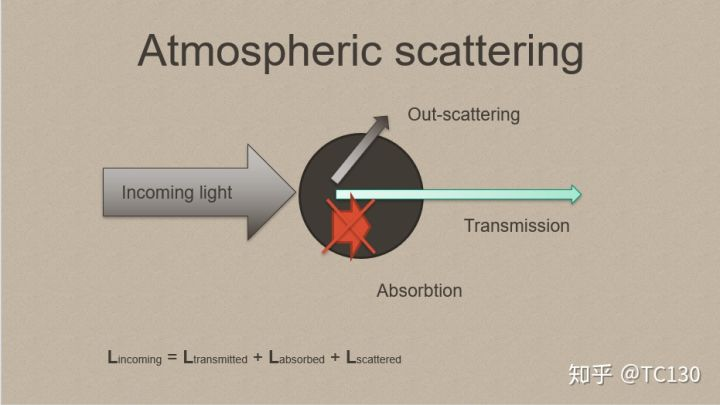光在介质上的散射,入射光分为吸收,透射,外散射三个部分,根据能量守恒,入射光等于三项的和

当不考虑中间介质时候,摄影机中得到的颜色就是最近的点上出射光的颜色

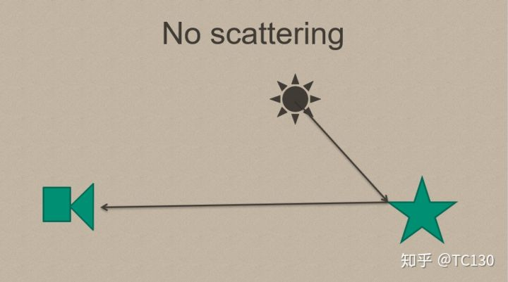不考虑散射

考虑散射时,情况就比较复杂了:

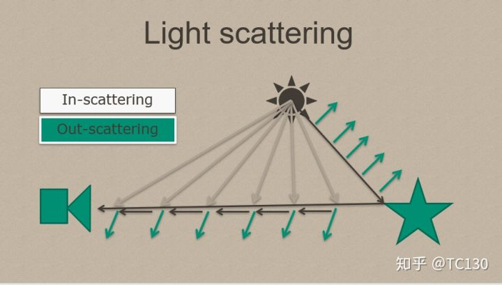光的散射

内散射会使路径上的光增多,外散射会使路径上的光变少.通常情况下,为了计算方便,不考虑多次散射的光.

模拟真实光穿透介质的比例的函数:

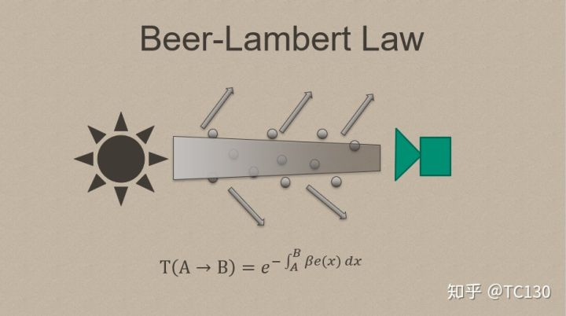

不同的散射类型:

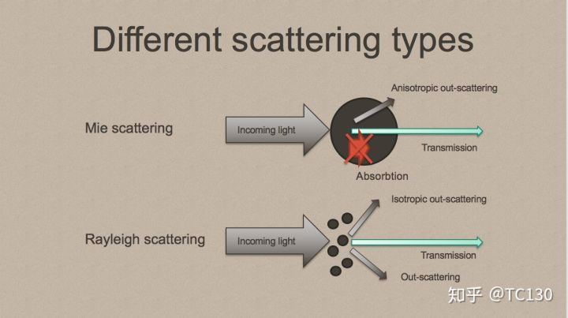Mie散射和Rayleigh散射

Rayleigh散射模型用来描述较小的粒子的散射,比如空气粒子的散射使天空变蓝. Mie散射模型是用来描述较大粒子的散射,比如灰尘.

Phase Function 是用来描述光在不同方向的散射分布的函数,根据能量守恒,光在所有方向散射的和总是1

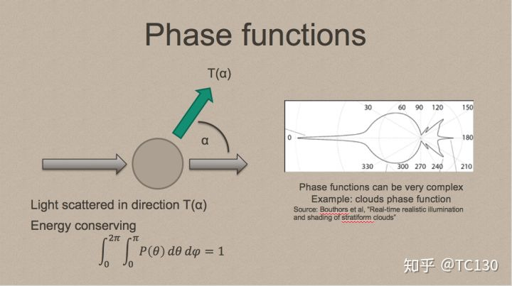

Henyey–Greenstein Phase Function 是一个经常用来描述Mie散射的Phase Function

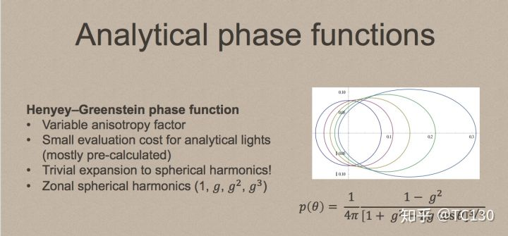

## 2. DepthFog

在每个像素计算的正常颜色基础上,根据距离混合一个雾的颜色.

最常用的三种计算雾强度的公式:

Linear :  factor = (end-z)/(end-start)

Exp:  factor = exp(-density*z)

Exp2: factor = exp(-(density*z)^2)

unity中的全局雾设置和宏APPLY_FOG就是使用这种方式

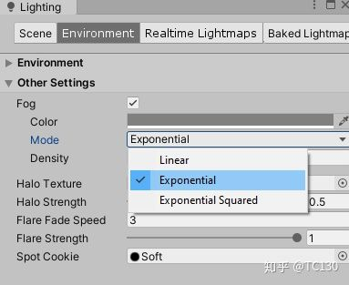unity中的全局雾设置

早期的Opengl和DirectX甚至提供的类似的API接口(glFog 等),在硬件级别实现雾效.

## 3. PostProcessing Fog

和Depth Fog基本上是一样的,区别在于PostProcessing 的Fog通过在PostProcessing时根据depth texture反推计算出摄影机到目标像素点的距离.

除了用距离做参数,还可以根据高度作为参数,或者高度*距离这样的形式来作为参数.

## 4. 粒子/BillBoard

在需要雾效的位置使用大量的粒子或者BillBoard来模拟光散射效果或者雾效.很显然,这种方式很可能造成一些OverDraw性能问题,以及需要特定的观察角度,而且不能随光照变化.

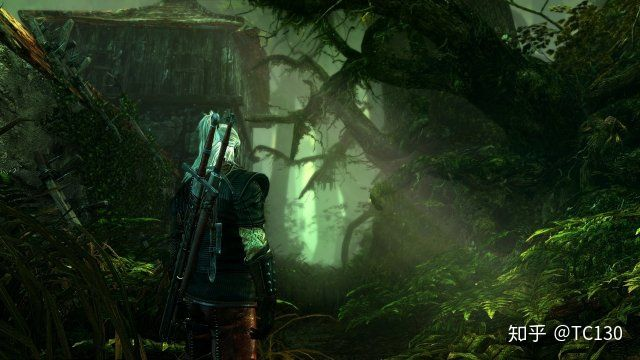

## 5. Sun Shaft

也叫God Ray,通过PostProcessing来实现.GPU Gems 3 13.3中详细描述了这种方法的实现.

原理是在PostProcessing时,将游戏界面中的太阳以太阳为中心向外做一个Vector Blur + Bloom,再进行叠加,产生太阳光向外发散的感觉.当然了,这种方式只有太阳出现在画面中的时候才有效果.

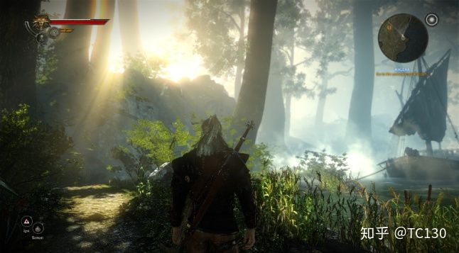

UE4中的Light Shafts包含两种模式Light Shaft Occlusion和Light Shaft Bloom,后者就是上面所说的方式,前者则是将太阳周围的暗部拉伸,产生遮挡的效果,原理是类似的.

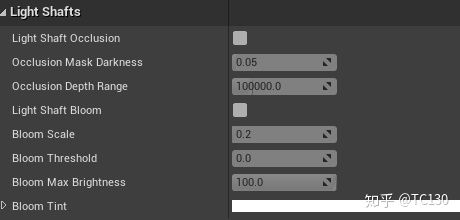UE4中的Light Shaft设置

Unity早期的Image Effects中,也有Sun Shaft效果组件.

## 6.  RayMarching

使用PostProcessing和RayMarching来实现,GPU PRO5里有一篇文章Volumetric Light Effects in Killzone Shadow Fall by Nathan Vos详细介绍了这种方法.

基本原理是在pre-z得到场景Depth Buffer以及光照的Shadow Map后,确定一个要进行Volume  Light的区域(点光源球形,锥形光锥形,直线光是全屏的),RayMarching计算出一个Volume  Light的Buffer,计算光照效果时应用效果.

生成Volume Rendering Buffer的过程其实就是在Volume Redering区域中进行RayMarching,为了降低Artfict,通常会使用一个Dither Texture进行抖动,并且在最后对结果进行Blur,得到平滑的结果.

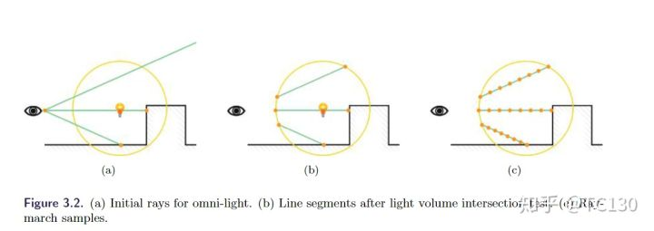

有一个Unity的Volume Lighting的Demo是这种方式来实现的, [https://github.com/SlightlyMad/VolumetricLights](https://link.zhihu.com/?target=https%3A//github.com/SlightlyMad/VolumetricLights).

## 7. Volume Texture

使用Volume Texture来保存空间中的散射信息,是真正意义上的Volume Rendering.

一个详细描述了实现方法的文章: [https://www.ea.com/frostbite/news/physically-based-unified-volumetric-rendering-in-frostbite](https://link.zhihu.com/?target=https%3A//www.ea.com/frostbite/news/physically-based-unified-volumetric-rendering-in-frostbite).

一个简单的Volume Texture实现的Volume Rendering的过程:

1.划分VolumeTexture的区域,这里将摄影机视锥内的部分作为Volume Texture区域,沿着垂直于摄影机方向的平面切分.为了较好的性能,将3DTexture的大小弄的小一点,比如180x60x64.

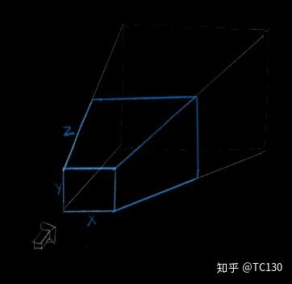沿着摄影机方向垂直切分

2.渲染光源的Depth Map,为了减少大量PCF阴影的性能消耗,这里用ESM阴影,并进行DownSample.

3.使用Computer Shader,向Volume Texture中写入空间中点的光照信息,光照包含空间环境光,光源光照,求和后写入到Texture RGB通道中.空间点的散射强度值,写入到Texture A通道中.

4.使用Computer Shader,从摄影机方向向外进行RayMarching,使用前面提到的模拟散射穿透计算的公式,累加光照.

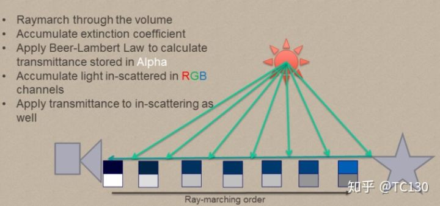

5.渲染某个点时,在VolumeTexture中查找相应点的散射光照值,进行计算.

UE4中的VolumeRendeing就是这种方法.而且UE4还进行了升级,支持将Volume Lighting烘培到LightMass中.新版的UE4还有Volume Material和3DTexture导入,可以方便地实现各种效果.

Unity的HDRP同样是这种方式渲染.Unity官方以前的宣传片Adam,同样是这种方法,可以参考 [https://github.com/Unity-Technologies/VolumetricLighting](https://link.zhihu.com/?target=https%3A//github.com/Unity-Technologies/VolumetricLighting).