# 曲面细分学习笔记

------


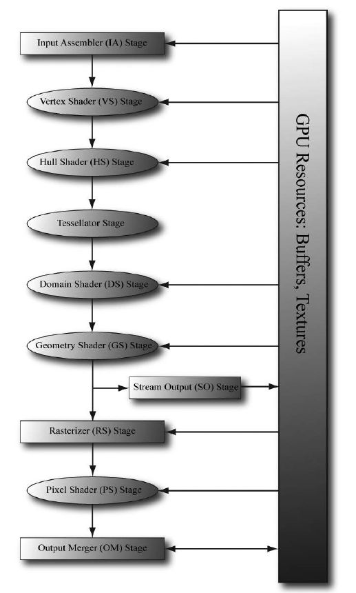

图1：渲染管线，图片来源：Introduction to 3D Game Programming with DirectX 12 


曲面细分是渲染管线的一个可选项，我们可以用它来对网格进行平滑处理，也可以用它来实现连续LOD（Levels  of Details）算法。本文为曲面细分的学习笔记，粗略的描述了渲染管线中曲面细分的相关阶段。这里以DirectX  12为主要描述对象，OpenGL作为补充。

## Input Assembler Stage

当我们使用曲面细分的时候，我们不再向IA阶段（Input  Assembler  Stage，输入装配阶段，从显存读取几何数据用来组合几何图元）提交三角面，而是提交包含数个控制点的patch。例如isoline，我们提交线段的两端作为控制点传给GPU，以这两个控制点为基础来对线段进行变形。

三角形可以认为是有三个控制点的patch，所以我们依然可以提交常规的三角面网格。四边形（四个控制点）也可以被提交，不过在曲面细分阶段这些patch会被细分成三角面。

当然我们还可以在一个patch中添加更多的控制点。例如，我们可以用多个控制点来调整贝塞尔曲线（Bezier curves），或者贝塞尔曲面。控制点越多，自由度越高。

## Vertex Shader

控制点也会经过VS的处理，或者说，VS变成了控制点的shader。在这里，我们可以做一些针对控制点的计算，例如动画或者物理计算。

## Hull Shader

经过VS处理后的控制点会传到HS（对应于OpenGL的TCS，Tessellation Control Shader）,HS又会分为Const Hull Shader和Control Point Hull Shader。

## ConstHS

示例代码：

```text
struct PatchTess
{
float EdgeTess[4] : SV_TessFactor;
float InsideTess[2] : SV_InsideTessFactor;
// Additional info you want associated per patch.
};
PatchTess ConstantHS(InputPatch<VertexOut, 4> patch,
uint patchID : SV_PrimitiveID)
{
PatchTess pt;
// Uniformly tessellate the patch 3 times.
pt.EdgeTess[0] = 3; // Left edge
pt.EdgeTess[1] = 3; // Top edge
pt.EdgeTess[2] = 3; // Right edge
pt.EdgeTess[3] = 3; // Bottom edge
pt.InsideTess[0] = 3; // u-axis (columns)
pt.InsideTess[1] = 3; // v-axis (rows)
return pt;
}
```

 SV_TessFactor代表细分度，SV_InsideTessFactor代表内部细分度。至于如何细分，我们稍后会解释。

## ControlPointHS

示例代码：

```text
struct HullOut
{
float3 PosL : POSITION;
};
[domain(“quad”)]
[partitioning(“integer”)]
[outputtopology(“triangle_cw”)]
[outputcontrolpoints(4)]
[patchconstantfunc(“ConstantHS”)]
[maxtessfactor(64.0f)]
HullOut HS(InputPatch<VertexOut, 4> p,
uint i : SV_OutputControlPointID,
uint patchId : SV_PrimitiveID)
{
HullOut hout;
hout.PosL = p[i].PosL;
return hout;
}
```

我们来看一下HS的几个属性： 

1.  domain: 指定patch的类型，可选的有：tri(三角形)、quad（四边形）、isoline（线段，苹果的metal api不支持：2018/8/21）。不同的patch类型，细分的方式也有差别，后面会详细介绍。 
2.  partitioning：分割模式，有三种：integer，fractional_even，fractional_odd。这三种分割模式，如图2、图3、图4所示，以及文末的视频。
3. outputtopology：输出拓扑结构。有三种：triangle_cw（顺时针环绕三角形）、triangle_ccw（逆时针环绕三角形）、line（线段）。
4. outputcontrolpoints：输出的控制点的数量（每个图元），不一定与输入数量相同，也可以新增控制点。
5. patchconstantfunc：指定ConstHS。
6. maxtessfactor：最大细分度，告知驱动程序shader用到的最大细分度，硬件可能会针对这个做出优化。Direct3D 11和OpenGL Core都至少支持64。 

然后是HS的参数：

1. InputPatch：输入的patch，尖括号第二个参数，代表输入的控制点的数量（“quad”为4个），由API设置，并且ConstHS里对应的数值要与这里相同。
2. SV_OutputControlPointID：给出控制点在path中的ID，与outputcontrolpoints对应，例如outputcontrolpoints为4，那么i的取值就是[0,4)的整数。
3. SV_PrimitiveID：给出patch的ID。


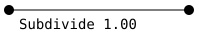

<svg x="16" y="18.5" class="GifPlayer-icon"></svg>

 图2：integer 


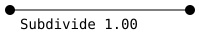

<svg x="16" y="18.5" class="GifPlayer-icon"></svg>

 图3：fractional_odd 


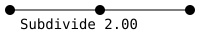

<svg x="16" y="18.5" class="GifPlayer-icon"></svg>

 图4：fractional_even 

下面着重展示一下SV_TessFactor和SV_InsideTessFactor在不同path类型上是如何细分的。 对于三种不同的patch类型：

## quad

SV_TessFactor的长度为4，指定四条边各被分为多少段，SV_InsideTessFactor长度为2，指定内部在横向和纵向上各被分为多少段，如图5所示。


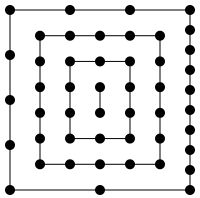 图5：SV_TessFactor:4,2,9,3 SV_InsideTessFactor:6,7 

## tri

SV_TessFactor的长度为3，指定三条边各被分为多少段，SV_InsideTessFactor的长度为1，指定内部有多少个点。关于内部点的计算方法，如图6和图7所示，对于三角形的每个顶点，将他们的临边分割，然后在分割点上做垂线，得到的交点即为内部点。


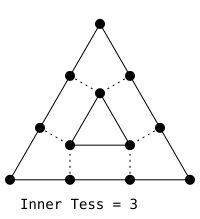 图6 


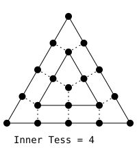 图7 

整体分割，如果图8所示。


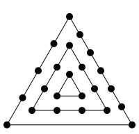 图8：SV_TessFactor:4,1,6 SV_InsideTessFactor:5 

## isoline

SV_TessFactor长度为2，第0个元素指定线段的个数，第1个元素指定线段被分为多少段，SV_InsideTessFactor会被忽略。如图9和图10所示。


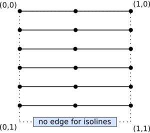 图9：SV_TessFactor:6,2 


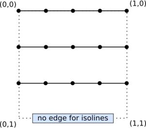 图10：SV_TessFactor:3,4 

## Tessellation Stage

曲面细分阶段，这个阶段是由硬件完成的，会根据ConstHS将patch分割成多个三角面或者线段。这些顶点会被传给下一个阶段DS，以供插值。

对于不同的patch，这些顶点的形式也不一样。

## quad

顶点以UV坐标的形式传给DS，如图11所示。


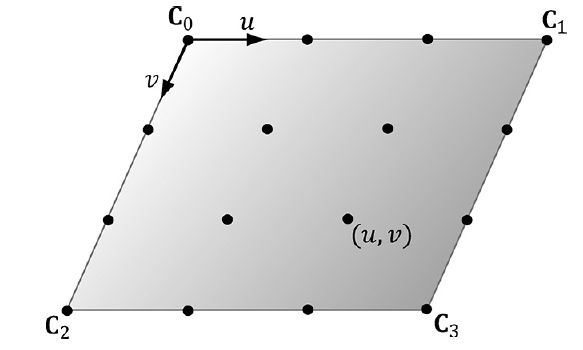 图11 

## tri

顶点以重心坐标（[Barycentric coordinates](https://link.zhihu.com/?target=https%3A//en.wikipedia.org/wiki/Barycentric_coordinate_system%23Barycentric_coordinates_on_triangles)）的形式(u, v, w)传给DS，如图12所示。


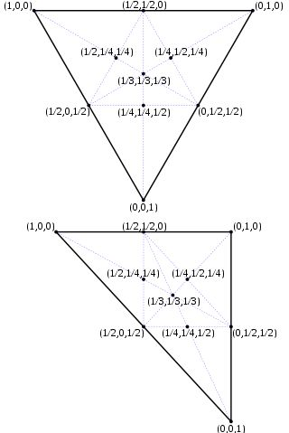 图12 

## isoline

顶点以UV坐标的形式传给DS，如图13所示。


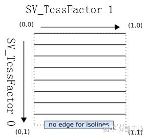 图13 

## Domain Shader

从曲面细分阶段获取新创建的顶点和三角面（或线段）之后，便进入了DS（对应于OpenGL  Core的TES，Tessellation Evaluation  Shader）阶段。对于每个顶点，都会调用一次DS。一般来讲，这里会涉及到大量的计算，所有的顶点信息都会在这里重新计算，最后会将顶点坐标转换到投影空间。

示例代码：

```text
struct DomainOut
{
float4 PosH : SV_POSITION;
};
// The domain shader is called for every vertex
created by the tessellator.
// It is like the vertex shader after tessellation.
[domain(“quad”)]
DomainOut DS(PatchTess patchTess,
float2 uv : SV_DomainLocation,
const OutputPatch<HullOut, 4> quad)
{
DomainOut dout;
// Bilinear interpolation.
float3 v1 = lerp(quad[0].PosL, quad[1].PosL, uv.x);
float3 v2 = lerp(quad[2].PosL, quad[3].PosL, uv.x);
float3 p = lerp(v1, v2, uv.y);
float4 posW = mul(float4(p, 1.0f), gWorld);
dout.PosH = mul(posW, gViewProj);
return dout;
}
```

DS的参数： 

\1. PatchTess：由ConstHS输入，细分参数。

\2. SV_DomainLocation：由曲面细分阶段阶段传入的顶点位置信息。 

\3. OutputPatch：由HS传入的patch数据，尖括号的第二个参数与HS中的outputcontrolpoints对应。

这里的patch类型是quad，先求当前顶点的坐标，然后转换到投影空间。 如果patch类型是tri：

```text
[domain(“tri”)]
DomainOut DS(PatchTess patchTess,
float3 uvw : SV_DomainLocation,
const OutputPatch<HullOut, 3> tri)
{
DomainOut dout;
// Bilinear interpolation.
float3 p = tri[0] * uvw.x + tri[1] * uvw.y + tri[2] * uvw.z;
float4 posW = mul(float4(p, 1.0f), gWorld);
dout.PosH = mul(posW, gViewProj);
return dout;
}
```

这里没有做任何的变形，只是将顶点坐标计算出来，最后渲染出来的结果跟没有做曲面细分的shader没有区别。 

我们可以使用贝塞尔曲线或曲面来改变三角面的形状，详情请参考文献1（或许会在后续文章中介绍，但愿……）。

DS输出的数据，可能会先传给GS（Geometry  Shader）进行进一步的计算（增加顶点、修改顶点位置，计算顶点属性）。也可以直接（当然首先要进行裁剪和光栅化）传给FS（Fragment  Shader）进行片元着色。最后进入输出合并阶段，完成整个渲染管线。

<iframe allowfullscreen="" src="https://www.zhihu.com/video/1015549321302982656?autoplay=false&amp;useMSE=" frameborder="0"></iframe>

partitioning: integer


<iframe allowfullscreen="" src="https://www.zhihu.com/video/1015549361903693824?autoplay=false&amp;useMSE=" frameborder="0"></iframe>

partitioning: fractional_odd


<iframe allowfullscreen="" src="https://www.zhihu.com/video/1015549427855020032?autoplay=false&amp;useMSE=" frameborder="0"></iframe>

partitioning: fractional_even


## 参考文献

1. Introduction to 3D Game Programming with DirectX 12
2. [OpenGL Tessellation](https://link.zhihu.com/?target=https%3A//www.khronos.org/opengl/wiki/Tessellation)
3. [Tessellation Modes Quick Reference](https://link.zhihu.com/?target=http%3A//reedbeta.com/blog/tess-quick-ref/)

编辑于 2018-09-14
