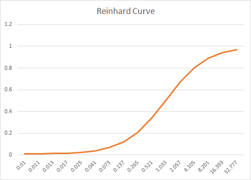
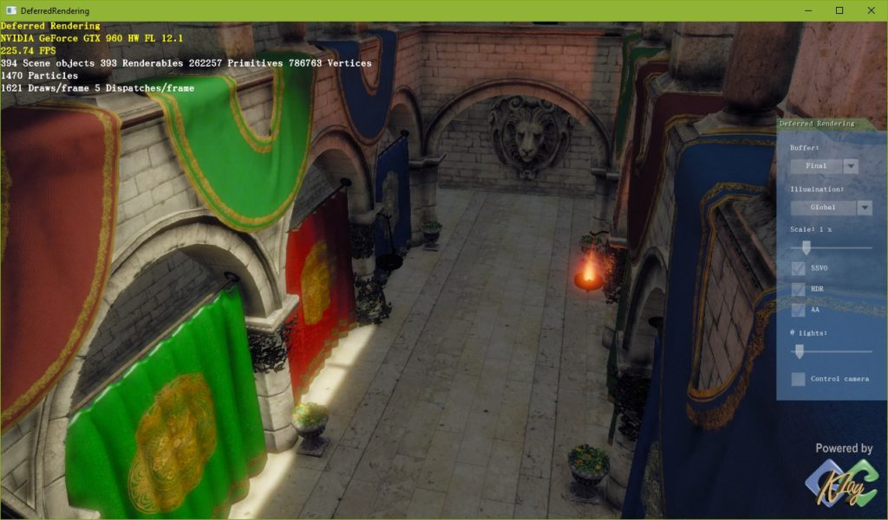
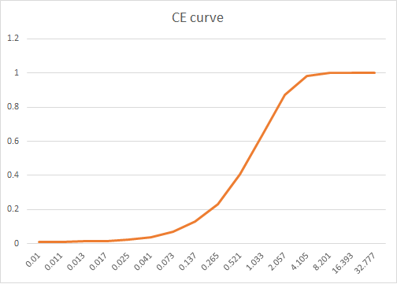
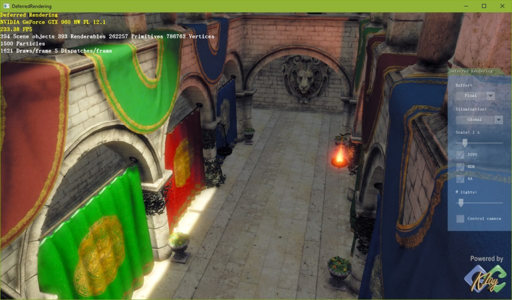
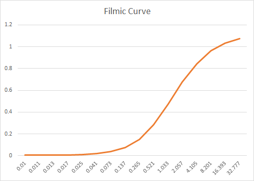
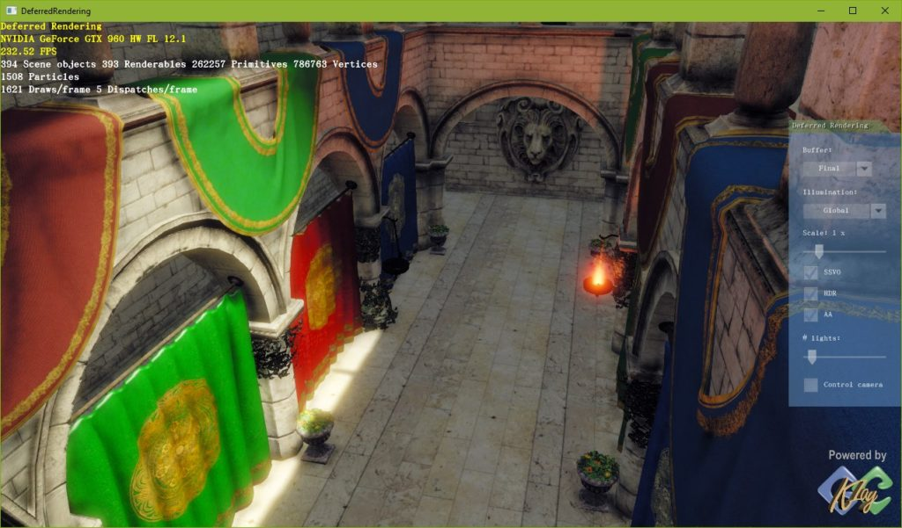
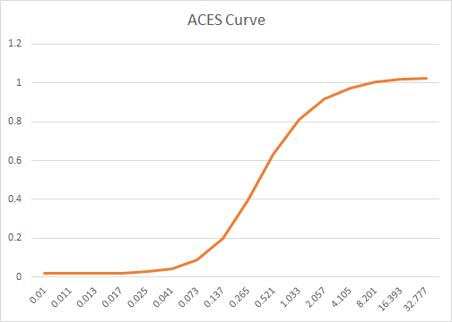
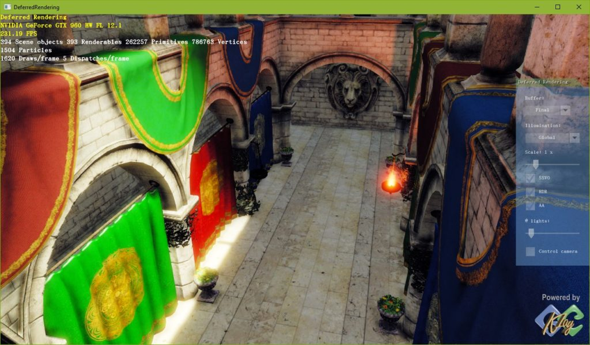

**转自KlayGE游戏引擎**

**Reinhard**

早期的普遍做法是一篇叫做

Photographic Tone Reproduction for Digital Images

的论文，大家就用作者的名字称它为Reinhard tone mapping。这是个经验公式，把HDR到LDR的变换简单的描述了出来。

| 1 2 3 4 5 6 | float3 ReinhardToneMapping(float3 color, float adapted_lum) {     const float MIDDLE_GREY = 1;     color *= MIDDLE_GREY / adapted_lum;     return color / (1.0f + color); } |
| ----------- | ------------------------------------------------------------ |
|             |                                                              |

其中color是线性的HDR颜色，adapted_lum是根据整个画面统计出来的亮度。MIDDLE_GREY表示把什么值定义成灰。这个值就是纯粹的magic number了，根据需要调整。Reinhard的曲线是这样的，可以看出总体形状是个S型。

从结果上看，经过Reinhard tone mapping是这样的。

这种tone mapping的方法更多地来自于经验，没什么原理在后面。它的优点是简单直接，把亮的变暗，暗的变量。这样暗处和亮处细节就都出来了。但缺点也很明显，就是灰暗。个个颜色都朝着灰色的方向被压缩了，画面像蒙了一层纱。

**CE**
后来在2007年学习了CryEngine 2的tone mapping处理法之后，就改成用这种方法。这个方法更简单，只要一行，而且没有magic number。用一个exp来模拟S曲线。

| 1 2 3 4 | float3 CEToneMapping(float3 color, float adapted_lum)  {     return 1 - exp(-adapted_lum * color); } |
| ------- | ------------------------------------------------------------ |
|         |                                                              |

CE的曲线中间的区域更偏向于小的方向，这部分曲线也更陡。

这个方法得到的结果比Reinhard有更大的对比度，颜色更鲜艳一些，虽然还是有点灰。

**Filmic**
CE的tone mapping就那么用了好几年，直到2010年，看到了一个叫[Filmic tone mapping](http://filmicgames.com/archives/75)的方法，来自于Uncharted 2。当年我也写过一篇文章[讲这件事情](http://www.klayge.org/2011/05/11/filmic-tonemapping-rocks/)。这个方法的本质是把原图和让艺术家用专业照相软件模拟胶片的感觉，人肉tone   mapping后的结果去做曲线拟合，得到一个高次曲线的表达式。这样的表达式应用到渲染结果后，就能在很大程度上自动接近人工调整的结果。最后出来的曲线是这样的。总的来说也是S型，但增长的区域很长。

从结果看，对比度更大，而且完全消除了灰蒙的感觉。

而代码就有点复杂了：

| 1 2 3 4 5 6 7 8 9 10 11 12 13 14 15 16 | float3 F(float3 x) {     const float A = 0.22f;     const float B = 0.30f;     const float C = 0.10f;     const float D = 0.20f;     const float E = 0.01f;     const float F = 0.30f;     return ((x * (A * x + C * B) + D * E) / (x * (A * x + B) + D * F)) - E / F; }  float3 Uncharted2ToneMapping(float3 color, float adapted_lum) {     const float WHITE = 11.2f;     return F(1.6f * adapted_lum * color) / F(WHITE); } |
| -------------------------------------- | ------------------------------------------------------------ |
|                                        |                                                              |

那些ABCDEF都是多项式的系数，而WHITE是个magic  number，表示白色的位置。这个方法开启了tone  mapping的新路径，让人们知道了曲线拟合的好处。并且，其他颜色空间的变换，比如gamma矫正，也可以一起合并到这个曲线里来，一次搞定，不会增加额外开销。缺点就是运算量有点大，两个多项式的计算，并且相除。

因为Filmic tone mapping的优异表现，大部分游戏都切换到了这个方法。包括CE自己，也在某个时候完成了切换。

**ACES**
到了2016年，美国电影艺术与科学学会，就是颁布奥斯卡奖的那个机构，在推广一个叫[Academy Color Encoding System（ACES）](http://www.oscars.org/science-technology/sci-tech-projects/aces)的东西。这是一套颜色编码系统，或者说是一个新的颜色空间。它是一个通用的数据交换格式，一方面可以不同的输入设备转成ACES，另一方面可以把ACES在不同的显示设备上正确显示。不管你是LDR，还是HDR，都可以在ACES里表达出来。这就直接解决了在不同设备间互通数据的颜色转换问题。然而对于实时渲染来说，没必要用全套ACES。因为第一，没有什么“输入设备”。渲染出来的HDR图像就是个线性的数据，所以直接就在ACES空间中。而输出的时候需要一次tone  mapping，转到LDR或另一个HDR。也就是说，我们只要ACES里的非常小的一条路径，而不是纷繁复杂的整套体系。

那么这条路径有多小呢？只要几行，系数来自于[Krzysztof Narkowicz的博客文章](https://knarkowicz.wordpress.com/2016/01/06/aces-filmic-tone-mapping-curve/)。

| 1 2 3 4 5 6 7 8 9 10 | float3 ACESToneMapping(float3 color, float adapted_lum) {     const float A = 2.51f;     const float B = 0.03f;     const float C = 2.43f;     const float D = 0.59f;     const float E = 0.14f;     color *= adapted_lum;     return (color * (A * color + B)) / (color * (C * color + D) + E); } |
| -------------------- | ------------------------------------------------------------ |
|                      |                                                              |

看着很像Uncharted 2的做法吧，都是多项式拟合。但是式子比Uncharted的简单，并不需要算两个多项式并相除，只要算一个，一次搞定。它的曲线是这样的。

S感很浓，并且比Uncharted的更向小的方向移，即便很小的数值和接近1的数值也有梯度。这样能很好地保留暗处和亮处的细节。至于视觉效果如何呢？看看这个。

可以看出来，比之前的任何一个都要鲜艳，并且没有因此丢掉细节！当之无愧成为目前最好的tone mapping算法。

更好的地方是，按照前面说的，ACES为的是解决所有设备之间的颜色空间转换问题。所以这个tone   mapper不但可以用于HDR到LDR的转换，还可以用于从一个HDR转到另一个HDR。也就是从根本上解决了VDR的问题。这个函数的输出是线性空间的，所以要接到LDR的设备，只要做一次sRGB校正。要接到HDR10的设备，只要做一次Rec  2020颜色矩阵乘法。Tone mapping部分是通用的，这也是比之前几个算法都好的地方。

目前一些新的游戏，比如Rise of the Tomb Raider、UE 4.8，也都切换到ACES的tone mapping曲线。
