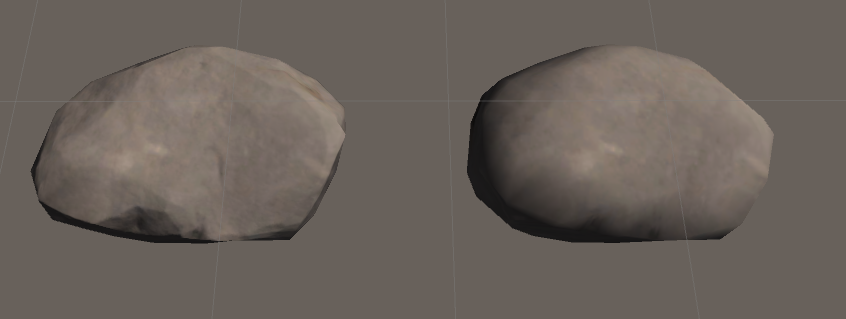
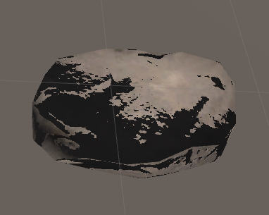
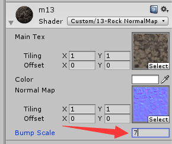
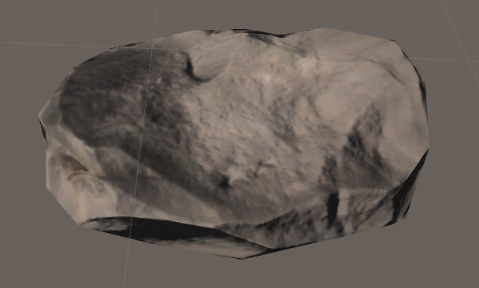

# 六、使用法线贴图（Normal Map）的Shader


## 为何要用法线贴图

为了提升模型表现细节而又不增加性能消耗，所以不选择提高模型的面数，而是给模型的材质Shader中使用上法线贴图（Normal  Map），通过更改模型上的点的法线方向，增加光影凹凸效果，从而提升模型表现细节。使用法线贴图能使一个三角面（平面）表现出凹凸的视觉效果！

# 法线贴图原理

<http://www.cnblogs.com/tekkaman/p/3992352.html>

上面的文章解释了很多问题：

- 法线被存储在切线空间（Tangent Space Normal）中，切线空间以点的法线方向为Z轴，对应了RGB中的B值，所以法线贴图看上去呈蓝色的。如果存储在世界空间中，则各个方向会表现出不同的颜色值。<https://www.zhihu.com/question/23706933/answer/161968056>
- 为何不选择将法线存储在世界空间中（World Space Normal）或是模型空间中（Object Space Normal）。
- 在使用法线贴图时，可以将光向量转换到Tangent Space里做计算，也可以把法线向量转换到World Space与光向量进行计算，结果是一样的，但为何选择使用**前一种方法**？因为后者每个点都要进行一次空间坐标变换，而由于光向量是平行光，所以**前一种方法**只需计算一次。

# 法线贴图的存储与使用

法线（Normal）每个轴向的取值范围为-1到1，而颜色值（Pixel）的取值范围为0到1。所以在存储（法线方向存储为法线贴图）和使用（在程序中将法线贴图每个点的颜色转变为法线方向）时，存在一个简单的计算转换过程。

- 存储法线贴图 Pixel = ( Normal + 1 ) / 2
- 使用法线贴图 Normal = Pixel * 2 - 1

因为法线贴图使用的是切线空间，所以以上转换也是在切线空间下进行的。使用中还要注意光照方向的空间转换问题。

------

# 例子

现在准备好纹理贴图和法线贴图，编写一个简单的使用法线贴图的Shader例子。

[](javascript:void(0);)

```
Shader "Custom/13-Rock NormalMap" { 
    Properties{
        _MainTex("Main Tex", 2D) = "white"{} // 纹理贴图
        _Color("Color", Color) = (1,1,1,1)   // 控制纹理贴图的颜色
        _NormalMap("Normal Map", 2D) = "bump"{} // 表示当该位置没有指定任何法线贴图时，就使用模型顶点自带的法线
        _BumpScale("Bump Scale", Float) = 1  // 法线贴图的凹凸参数。为0表示使用模型原来的发现，为1表示使用法线贴图中的值。大于1则凹凸程度更大。
    }
    SubShader{
        Pass {
            // 只有定义了正确的LightMode才能得到一些Unity的内置光照变量
            Tags{"LightMode" = "ForwardBase"}
            CGPROGRAM

// 包含unity的内置的文件，才可以使用Unity内置的一些变量
#include "Lighting.cginc" // 取得第一个直射光的颜色_LightColor0 第一个直射光的位置_WorldSpaceLightPos0（即方向）
#pragma vertex vert
#pragma fragment frag
 
            fixed4 _Color;
            sampler2D _MainTex;
            float4 _MainTex_ST; // 命名是固定的贴图名+后缀"_ST"，4个值前两个xy表示缩放，后两个zw表示偏移
            sampler2D _NormalMap;
            float4 _NormalMap_ST; // 命名是固定的贴图名+后缀"_ST"，4个值前两个xy表示缩放，后两个zw表示偏移
            float _BumpScale;    

            struct a2v
            {
                float4 vertex : POSITION;    // 告诉Unity把模型空间下的顶点坐标填充给vertex属性
                float3 normal : NORMAL;        // 不再使用模型自带的法线。保留该变量是因为切线空间是通过（模型里的）法线和（模型里的）切线确定的。
                float4 tangent : TANGENT;    // tangent.w用来确定切线空间中坐标轴的方向的。
                float4 texcoord : TEXCOORD0; 
            };

            struct v2f
            {
                float4 position : SV_POSITION; // 声明用来存储顶点在裁剪空间下的坐标
                //float3 worldNormal : TEXCOORD0;  // 不再使用世界空间下的法线方向
                float3 lightDir : TEXCOORD0;   // 切线空间下，平行光的方向
                float3 worldVertex : TEXCOORD1;
                float4 uv : TEXCOORD2; // xy存储MainTex的纹理坐标，zw存储NormalMap的纹理坐标
            };

            // 计算顶点坐标从模型坐标系转换到裁剪面坐标系
            v2f vert(a2v v)
            {
                v2f f;
                f.position = mul(UNITY_MATRIX_MVP, v.vertex); // UNITY_MATRIX_MVP是内置矩阵。该步骤用来把一个坐标从模型空间转换到剪裁空间
                
                // 法线方向。把法线方向从模型空间转换到世界空间
                //f.worldNormal = mul(v.normal, (float3x3)unity_WorldToObject); // 反过来相乘就是从模型到世界，否则是从世界到模型
                f.worldVertex = mul(v.vertex, unity_WorldToObject).xyz;
                
                //f.uv = v.texcoord.xy; // 不使用缩放和偏移
                f.uv.xy = v.texcoord.xy * _MainTex_ST.xy + _MainTex_ST.zw; // 贴图的纹理坐标
                f.uv.zw = v.texcoord.xy * _NormalMap_ST.xy + _NormalMap_ST.zw; // 法线贴图的纹理坐标

                TANGENT_SPACE_ROTATION; // 调用这个宏会得到一个矩阵rotation，该矩阵用来把模型空间下的方向转换为切线空间下

                //ObjSpaceLightDir(v.vertex); // 得到模型空间下的平行光方向
                f.lightDir = mul(rotation, ObjSpaceLightDir(v.vertex)); // 切线空间下，平行光的方向

                return f;
            }

            // 要把所有跟法线方向有关的运算，都放到切线空间下。因为从法线贴图中取得的法线方向是在切线空间下的。
            fixed4 frag(v2f f) : SV_Target 
            {
                // 环境光
                fixed3 ambient = UNITY_LIGHTMODEL_AMBIENT.rgb;
                
                // 法线方向。从法线贴图中获取。法线贴图的颜色值 --> 法线方向
                //fixed3 normalDir = normalize(f.worldNormal);   // 不再使用模型自带的法线
                fixed4 normalColor = tex2D(_NormalMap, f.uv.zw); // 在法线贴图中的颜色值
                //fixed3 tangentNormal = normalize(normalColor.xyz * 2 - 1); // 切线空间下的法线方向，发现计算得到的法线不正确！
                fixed3 tangentNormal = UnpackNormal(normalColor); // 使用Unity内置的方法，从颜色值得到法线在切线空间的方向
                tangentNormal.xy = tangentNormal.xy * _BumpScale; // 控制凹凸程度
                tangentNormal = normalize(tangentNormal);

                // 光照方向。
                fixed3 lightDir = normalize(f.lightDir); // 切线空间下的光照方向
                
                // 纹理坐标对应的纹理图片上的点的颜色
                fixed3 texColor = tex2D(_MainTex, f.uv.xy) * _Color.rgb;
                
                // 漫反射Diffuse颜色 = 直射光颜色 * max(0, cos(光源方向和法线方向夹角)) * 材质自身色彩（纹理对应位置的点的颜色）
                fixed3 diffuse = _LightColor0 * max(0, dot(tangentNormal, lightDir)) * texColor; // 颜色融合用乘法
            
                // 最终颜色 = 漫反射 + 环境光 
                fixed3 tempColor = diffuse + ambient * texColor; // 让环境光也跟纹理颜色做融合，防止环境光使得纹理效果看起来朦胧

                return fixed4(tempColor, 1); // tempColor是float3已经包含了三个数值
            }

            ENDCG
        }
        
    }
    FallBack "Diffuse"
}
```

[](javascript:void(0);)

效果如下图，左边是使用法线贴图（凹凸参数为1，完全使用法线贴图中的法线方向），右边未使用法线贴图：



注意点：

- TANGENT_SPACE_ROTATION宏的使用。调用这个宏会得到一个矩阵rotation，该矩阵用来把模型空间下的方向转换为切线空间下。
- ObjSpaceLightDir（）方法，得到模型空间下当前点到光源方向的向量，即平行光方向。
- 使用mul(rotation, ObjSpaceLightDir(v.vertex)); 得到切线空间下平行光的方向。
- 在从颜色值转换为切线空间下的法线方向时，发现用Normal = Pixel * 2 - 1计算得到是法线不正确，效果很奇怪，如下图。改为使用Unity内置的UnpackNormal（）方法来计算。



- 定义了属性_BumpScale来控制凹凸程度。当该属性值为0时，使用模型自带的法线方向；当属性值为1时，使用完全使用法线贴图中的法线方向。当值位于0和1之间，则是两种方向的过度，通过在编辑器监视面板中拖拽修改该属性值，能够直观看到模型的变化效果。当该属性值大于1，则凹凸程度更加强烈。下图是当该值设为7时的情况。



der