# 《蜘蛛侠：平行宇宙》的视觉解析与滤镜实现

**早在四年前，索尼想要制作全新风格的“蜘蛛侠”电影这一消息被泄露时，一个显眼的词汇便被反复提及——“rejuvenate”，译为“使其恢复年轻”。当时，除去《蜘蛛侠：返校日》之外，由索尼出品的《蜘蛛侠》真人电影已有五部之多（托比·马圭尔主演《蜘蛛侠》三部曲，以及安德鲁·加菲尔德主演的两部《超凡蜘蛛侠》）。索尼高层希望以一部动画电影来让这个系列重新恢复活力。**

**而为了拍摄这部动画电影，索尼找到了当时因《天降美食》系列以及《乐高大电影》等作品在业界小有名气的导演搭档——菲尔·罗德和克里斯托弗·米勒。有着天马行空的创意以及各种鬼才想法的这两位导演提出的要求则是：希望这部动画让观众感到“就像走进了漫画里一般”。他们同时也为能够在这部电影中使用到真人电影无法达成的叙事手段而感到兴奋。**

第一次看到《蜘蛛侠：平行宇宙》这部电影时，就被其中的十足创新的视觉动态效果所惊艳，跟以往 3D 动画追求自然流畅截然相反，《蜘蛛侠：平行宇宙》反而在往漫画观感体验靠拢，让 3D 动画 2D 化，而且不是单纯的 2D 化。

正如在一篇文章里看到的评论：混搭上各类平行宇宙间不同的漫画风格，保留下了对话框、漫画分格、字幕特效，还尤其加强了手绘涂鸦的部分，并刻意打造出这部分的「稚拙感」。当这些再加上神奇到炸裂的分镜，足以让人看得目不暇接。接下来我们简单的解析下这电影的亮点：

**一、 视觉表达的创新点**

**1. 一拍二模拟 2D 动画**

在进入正题故事没多久，相信看惯了 3D 动画的大家都会有种稍稍不适应的感觉...「这电影是不是有些卡？」

没错，它确实就是卡。这是电影第一个让人感觉有些「异常」的地方，却也是电影最特别的地方。仔细看你可以发现只有人物角色是有着卡顿感的，而它们的周围环境却很流畅，形成了一种微妙的对比。关于这一点，在知乎中有网友给我们作出了解答：

**电影一般采用的是 24 帧每秒的制式，也就是说如果是手绘 2D 动画片，需要每秒连续画 24 张画以使画面中动画流畅，这也就是动画中俗称的1拍1。**

**但是有人发现我同样的动作只画第  1，3，5，7....合计总共只画 12 帧，然后把每帧停留 2  倍时间，观众并不会明显察觉，而动画师却省下一半绘制时间，这就是动画中俗称的1拍2，这个行为的发明只是为了节约成本。3D 动画一般不这么做是因为  3D 角色动画师在设置好关键帧后，其中间帧是自动生成的，所以本身没必要去节省中间帧。**

**1拍2是 2D 动画的传统做法，3D 动画强行这么做可以让人产生 2D 动画的质感错觉，但同时 Sony 选择了背景动画、镜头动画和其它位移动画又保持1拍1，从而保持 3D 动画特有的镜头顺滑的优势。**

这样的处理手法一方面使得画面有种 2D 逐帧动画特有的逐帧质感（如同小时候看的阿凡提动画那样），另一方面产生一种自然中却又有点违和的感受，好比人物和场景不在同一个时空中，这使得这个电影的视觉表现与故事主题产生了一种呼应和统一。

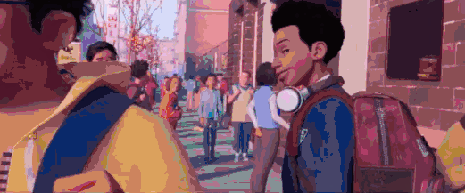

**2. 漫画手法还原**

电影中我们可以看到很多在美式漫画中常用的手法和效果。如爆炸的  BOOM、跳楼时的 AHHHHH、吐丝时的 THWIP  这些手绘拟声词；主角奔跑时、参与战斗前描述心里活动的对话框；速度线、感知危险的信号提示等等。这些都在不断让我们重温阅读漫画的感受。下面是这些表现手法在电影中的应用：

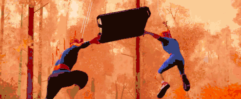

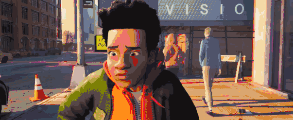

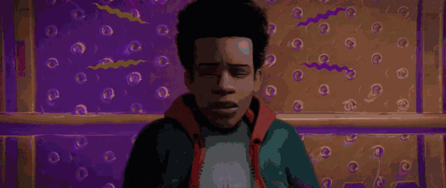

这些表现手法，使得电影画面多了份在平面漫画中才有的张力，这和它们多年历史冲刷下变化而来的属性有关（漫画的历史沿袭不同文化的不同路径，且在发展中有了很多的交融，这里主要从美式漫画手法的角度出发）。我们以漫画中常见的对话框为例。

大家都知道图像成为人类表达媒介的时间要早于文字，然而，在人们学会使用连续的图像来表达一个有始有终的故事之前，遇到需要说明的情节，单靠一幅图像是无法满足的，于是，一直到公元前两千多年前的埃及人，他们想到了一种可以说明的办法。

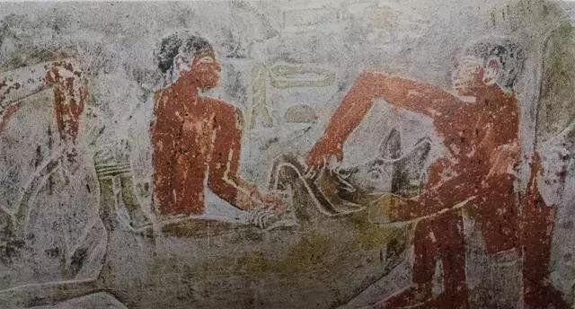

这是古埃及麦勒卢卡（Mereruka）陵墓中，两个男人正在×××鬣狗的情景壁画。让人值得注意的是，在两个角色之间的空白处飘浮着象形文字，经翻译，内容是其中一个人对另一个人说：“捉紧它！”

文字的出现帮助帮助绘者丰富了图像之外的信息——表达主角的思想活动，同时又增加了画面的紧张感。

这些文字虽是整体的一部分，但也独立于图像之外，和图像关联度不大。而到了公元前7世纪左右的中美洲文明中，出现了用抽象的符号来概括语言的方式，这种符号后来逐渐发展成为一种类似卷轴或旗帜的图形，在欧洲中世纪和文艺复兴的艺术中都曾出现。或许是因为受限于构图，这种对话方式所涉及的语言较为简略，但这个时候文字已能够比较好得融合到画面中。

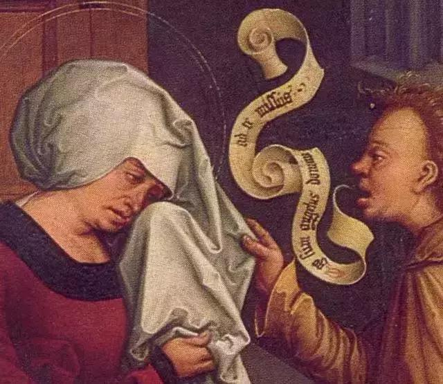

从18世纪开始流行政治性讽刺漫画，其中出现了大量的对白。这个时期的漫画家们已经非常熟悉如何使用对话框了，有的像简化了的卷轴，有的前粗后细的类似气球的气泡，总之形式便非常接近现代漫画中的对话框。而且这些对话框已经能承载更多的文字，对画面起到了一定的渲染氛围的作用。

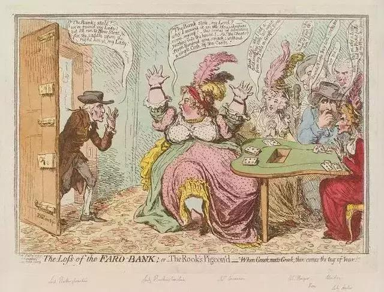

发展到了20世纪初，对话框在漫画中的作用已经很关键，同时也衍生了拟声词、情绪符号等等漫画手法，它们不仅仅是内容、思想的传达，还具备着**情绪表达、推动剧情、氛围渲染**等等的作用。

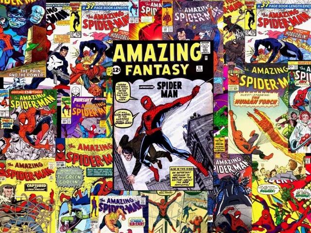

回到我们的电影。正是这些在平面漫画中常见手法和元素，使得**静态的漫画如同可以「发声」一般**，且因为这些手法让《蜘蛛侠：平行宇宙》比起一般的 3D 电影，在视觉层面丰富了观众其它感官的感受。看回前面的动图，哪怕没有声音，我们都能通过眼睛更具体得「听」到它发生了什么。

\3. 不用运动模糊

既然要还原漫画阅读体验，一些 3D 动画里经常用的手法自然也要抛弃，比如运动模糊。但是去掉运动模糊后，原本在 3D 动画中流畅的运动感和速度感会变得非常不足，这个决定通常会对电影风格产生直接影响。

关于这个问题，电影的特效总监迪米安是这么说的：我们知道我们必须解决（没有运动模糊），我们只是不想用任何看起来过于传统的东西来解决它。我们想从  2D  动画中寻找解决的方案和想法。我们真的在找一些东西，它看起来像是受到动画的启发，或者是通过涂片、拉伸几何图形来表现运动模糊的方式，但却不是那样做的。最后，通过采用了一些解决方案：如  Imageworks  的线条工具允许艺术家绘制同样连接形状的运动线。也有从相机快门启发的技术，例如快速相机平底镜上的背景，无论是合成还是借助特效，都会被涂上很大的污点和划线，但却会以一种非常块状的插图方式出现。我们基本上尽量避免任何看起来像是平滑的渐变或者因为运动模糊而变得模糊的东西。相反，这是一种非常图形化的处理。

后面我们可以看到，电影里通过**叠影**（相机快门启发的方式）、**场景的错位、速度线**等方式来补充画面的动感，并保证了电影本身的风格语言。

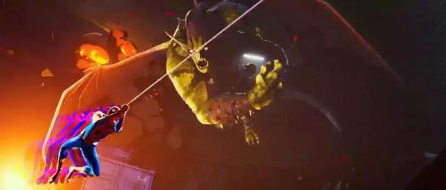

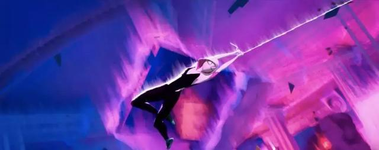

\4. 色散/高光溢色

实际上我们可以从电影画面里看到一般产生于比较老化或者早期的镜头拍摄的照片质感（高光溢色），还有一些镜头色散的效果，这其实也是电影工作室有意为之。

导演  Peter Ramsey  在接受采访时是这么对电影画面解释的：某种意义上说，你根本不用花费精力去注意什么，因为我们做的就是还原漫画，而我们在看漫画的时候会发现，有时候漫画里都有错误，有时候印刷不好，颜色都涂到了线条之外，所以看起来就觉得模糊不清。而且这和真人电影是相通的，比如有时镜头中一些东西是没有对上焦有些模糊，这样观众才会集中注意力在重要而清晰的画面上。

色散/高光溢色的效果在这里就是起到虚化和模糊的作用。如导演提到的印刷不好的情况，在  20 世纪初中期的印刷行业经常出现，当时的 CMYK  4色印刷会因为有对版的误差出现导致喷色错版，这样的错版在后面发展中也成为了一种风格化的处理，导演注意到这点，并应用到了电影中，这既把漫画的质感还原得更到位，让观者产生共鸣同时也利用这样的错位生成一种视觉景深感，使得电影的层次更强，解决了向  2D 靠近后在电影显得平的问题。

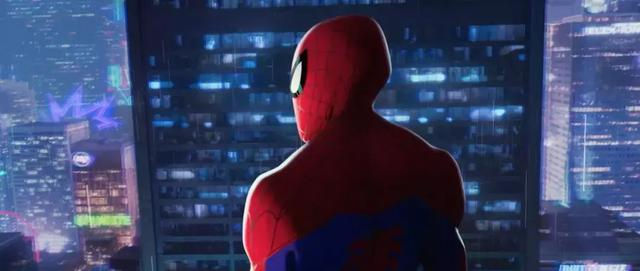

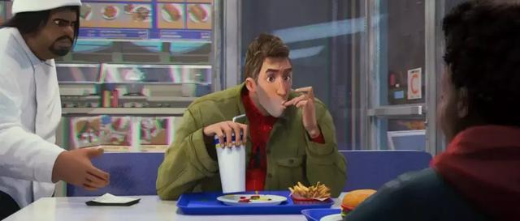

这部电影在视觉表达上有很多的突破，创作团队很大胆得把多种风格不一的人物混合在一起，使得平行宇宙的概念合理化，并通过平面漫画的方式把视觉语言和整个电影的题的结合达到了高度的统一。整个电影透露出一种处处不稳定的矛盾感，创作团队没有把这种矛盾消弱，而是把他们都展现了出来，这样的碰撞感受让人不得不佩服他们对于整体的把控和自信。

**二、视觉效果与滤镜实现**

电影从片头就迫不及待的展现出了它在表现形式上的创新，但仔细观察你会发现里面用到的效果并非独创，只不过索尼的动画团队把这些视觉元素应用的淋漓尽致。

由于工作中涉及了短视频滤镜和转场的  OpenGL Shader 代码编写，所以在二刷电影的时候特别留意了电影里的特效，并思考有哪些是可以通过 Shader  来实现的。当然了，电影里的效果是动画设计师反复调整和多重加工出来的，绝非一段代码就能完美模拟。这里仅仅是从技术角度去探讨电影里一些效果在  Shader 代码层面的可行性。

1、HalfTone 半调滤镜

电影高度还原了漫画应有的观赏体验，在画面的渲染上使用了  Ben-Day dot (本戴点）让我们感受到了阅读纸质漫画书的质感。Ben-Day dot 与 HalfTone 的不同之处在于  Ben-Day dot 在特定区域中的大小和分布总是相同，HalfTone 则可以根据图像色彩细节来调整点的大小和渐变。我们可以用  HalfTone 半调滤镜去生成差不多的质感。下面截取几张截图可见一斑：

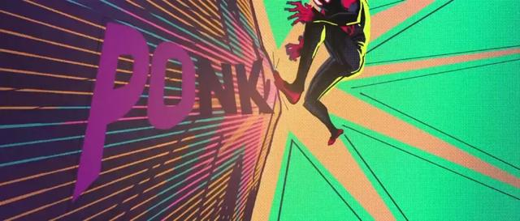

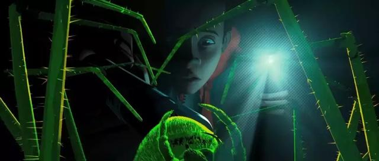

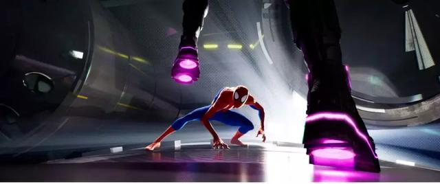

科普下  Ben-Day dot (本戴点），全名是「本戴点状制版法」，以插图画家和印刷商 Benjamin Henry Day, Jr.（19  世纪出版商 Benjamin Henry Day 的儿子）命名，在 1879  年被发明的印刷制版技术。它根据颜色和视错觉原理，通过小彩色点的间隔疏密、大小或重叠来生成所需要的效果。例如，洋红色圆点间隔比较宽就会形成粉红色。  20 世纪 50 年代和 60 年代的彩色漫画书很受欢迎，但是全彩漫画的成本很高，因此漫画出版商在四色印刷（ 青色、品红色、×××、黑色  ）中使用了 Ben-Day dot，通过它打印出阴影和二次色 ，如绿色、紫色、橙色、肉色等，因为本戴点的特性这种方式可以**节省大量的油墨**，漫画商通过这样廉价的印刷方式印刷在便宜纸张上生产漫画书，从而可以获得较高的收益。

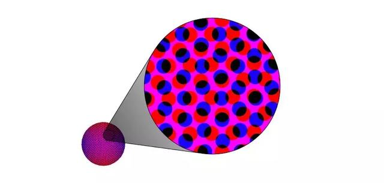

后来这种方式被美国波普艺术大师罗伊·利希滕斯坦（RoyLichtenstein）充分运用在绘画上并使其发扬光大。在 20 世纪中叶，抽象表现绘画盛极一时之际，他和纽约年轻一代画家，提出了新形式的具象绘画——**波普艺术**，在  60  年代一举成名，成为美国新艺术运动的主推动人，甚至许多曾受美国商业影响的域外文化，亦感受他作品的震撼力。利希滕斯坦的绘画或雕刻作品，引用自漫画、日用品、广告以及一些美术史上名画家的作品造型，结合本戴点的特点再现了美国社会当时浓厚的商业文化和时代特征。

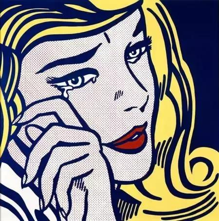

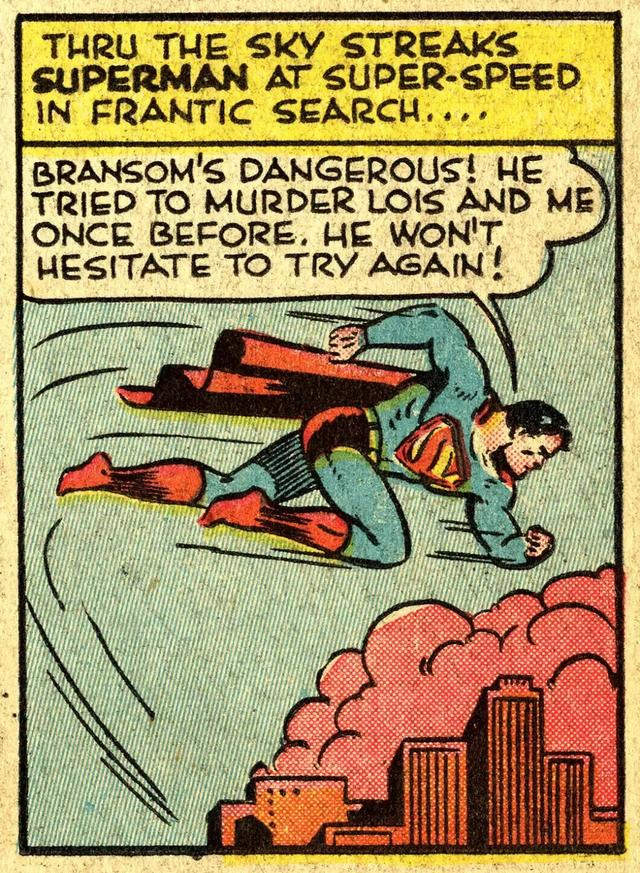

我们来看看实现的方式。在 OpenGL 的 Shader 语言中，通过创建一个排列的圆形的 pattern，结合图像的 RGB 通道色值得到图像的半调图案，在跟原图进行「变亮」图像混合模式，可以得到我们想要的半调质感：

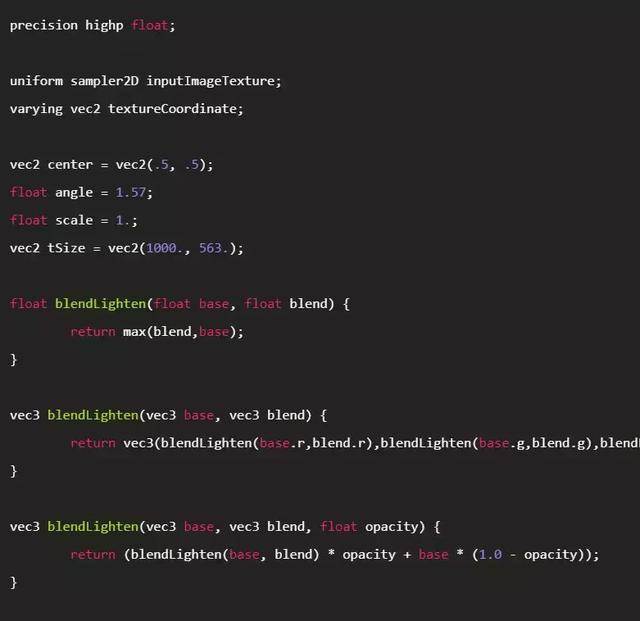

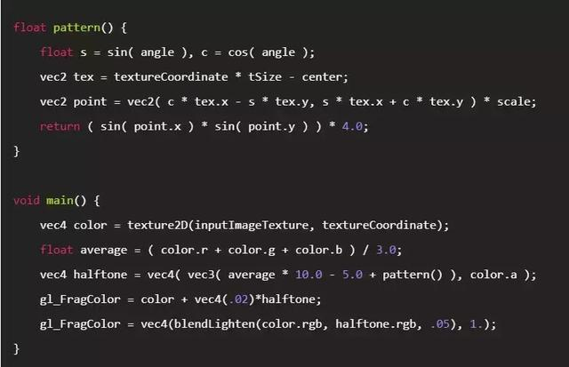

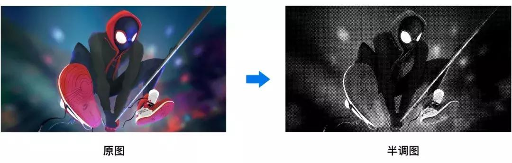

然后使用图层混合模式「变亮」，将两张图做像素融合：

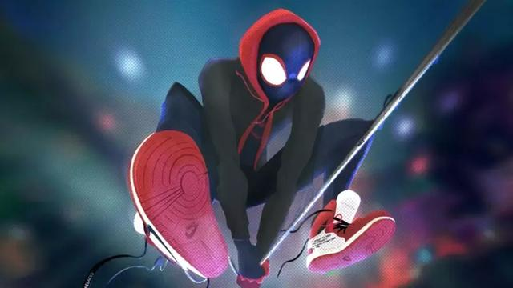

**2、Glitch 故障效果**

Glitch 故障效果在很多都互联网产品中同样可以看到应用，最典型的比如抖音的 LOGO 动画以及短视频中的滤镜效果。在电影中，由于另外几位蜘蛛侠来自不同的平行世界导致原子不稳定，表现出了差不多的花里胡哨的故障效果。

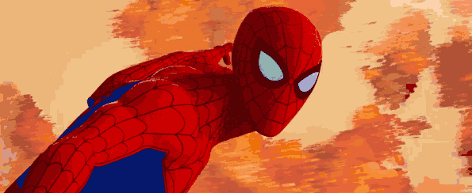

索尼工作室在制作故障效果的时候使用了手绘图案+多层效果融合的方式来呈现，当然了，代码想要模拟这样的效果并不容易，如果可以找到一张合适的遮罩图也许可以大致模拟出来。不过这里只单纯展示常规的基于图像本身的故障效果（代码通过基于时间来做像素和颜色通道偏移来模拟故障效果）：

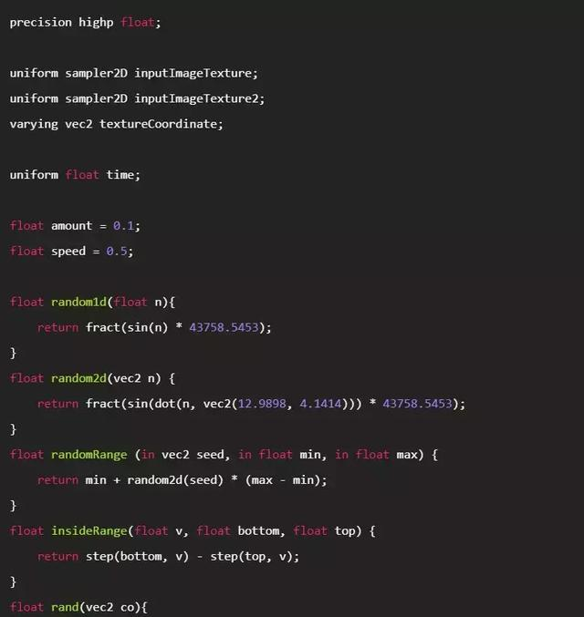

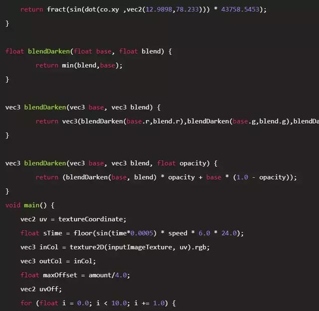

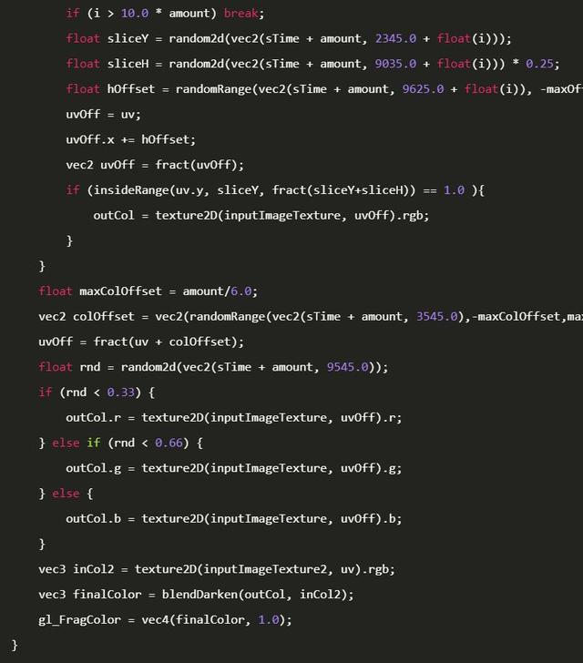

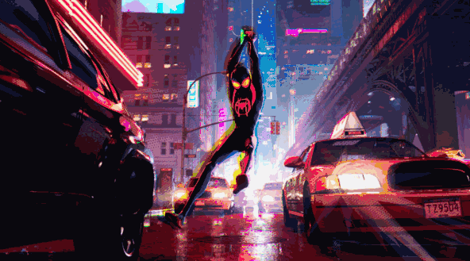

3、RGB Shift/Split RGB 分离

细心可以发现，上面第二个 Glitch 效果同样用到了 RGB 颜色分离，在电影中出现了大量的这样的效果，把色彩变化应用到极致，显得魔性和虚幻，大胆且自信。

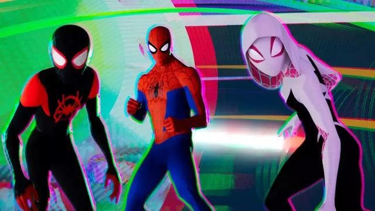

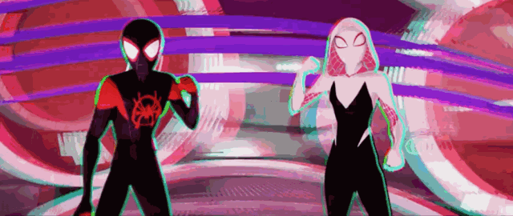

Shader 实现起来会相比上面两个滤镜更简单一下，通过对图像的 RGB 三个颜色做拆分以及坐标偏移就可以实现：

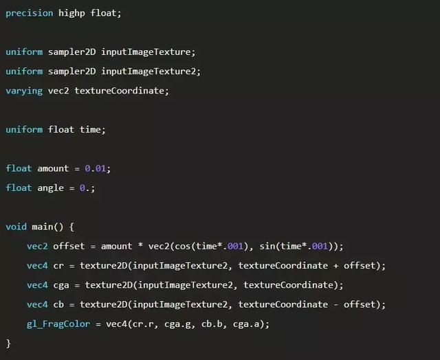

下面两张图片对比前后效果：

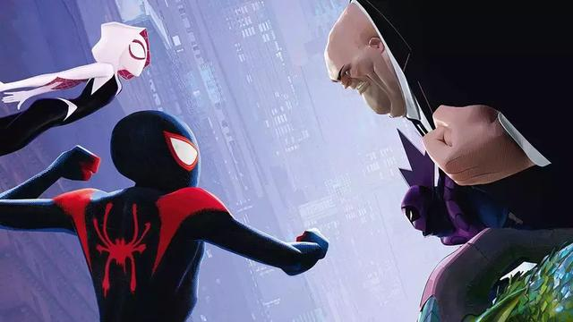

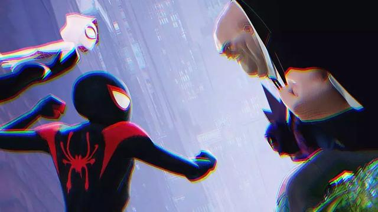

同样的，通过 Demo 右上角的滤镜开关可以看到前后效果： demo3（建议使用电脑打开）

最后，这部电影可以说的太多太多，有太多让人觉得惊艳的点，没办法一一都提到，我们只能从视觉方面和实现的可能性简单得聊聊，欢迎补充。

在快写完文章的时候，想起开头  Sony  说到的「rejuvenate（使其恢复年轻）」。我们可以感觉到这个电影从故事和风格无不充斥着现在年轻人会喜欢的元素，可以说这是一部很酷的作品，但是在看到了很多资料后我们不禁有一些感慨，这些很酷炫的效果和元素风格其实在上个世纪就已经存在且有着很深的历史痕迹，从某种意义上，与其说是更年轻的体现，感觉倒不如说是这是一种复古了。由此我们也延伸出了一些问题：

有人说风格是个轮回，这么一看，所谓的“更年轻的风格”或者“过气的风格”都像是个伪命题。也就是说，是不是并不存在什么年轻或过时的风格，只有时间久了，看腻了的风格？

又或者说，是不是因为技术的创新才让产品（电影或者其它）变得年轻了，和风格，实际没太大关系？感觉挺有意思，可以想想。