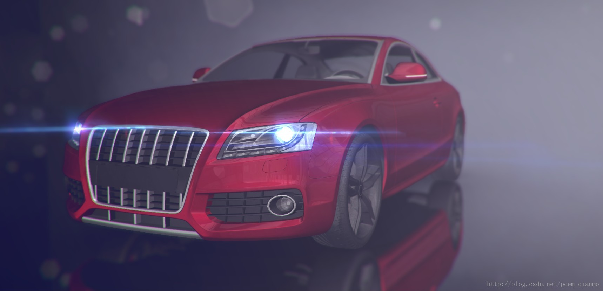
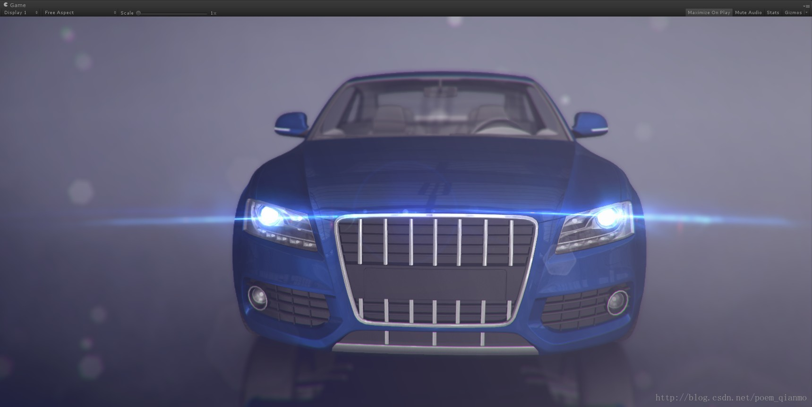
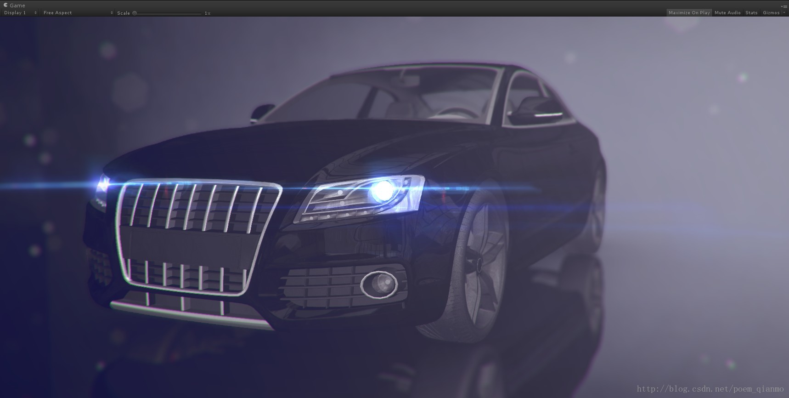
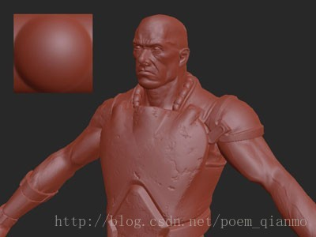
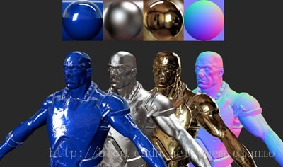
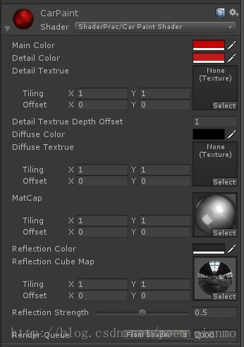
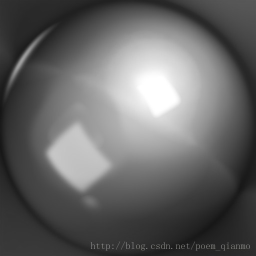

# 【Unity Shader编程】之十六 基于MatCap实现适于移动平台的“次时代”车漆Shader


本文链接：https://blog.csdn.net/zhmxy555/article/details/55803629

这篇文章将基于MatCap的思想，在Unity中实现了具有高度真实感的MatCap车漆Shader。采用MatCap思想的Shader，用低廉的计算成本，就可以达到类似PBS非常真实的渲染效果，可谓是在移动平台实现次时代渲染效果的一种优秀解决方案。

本文以车漆Shader为例，但MatCap思想能实现的，并不局限于车漆Shader。本来准备给本文取名《一种基于MatCap的低计算成本、高真实感移动平台Shader解决方案》的，但这个名字太大了，遂改之。


先看一下最终的效果图。


 


 





 


 


### 一、MatCap概述


Material Capture(材质捕获)，通常被简称为MatCap，在Zbrush、Sculptris、Mudbox等3D软件中有比较多的使用。


MatCap  Shader的基本思路是，使用某特定材质球的贴图，作为当前材质的视图空间环境贴图（view-space environment  map），来实现具有均匀表面着色的反射材质物体的显示。考虑到物体的所有法线的投影的范围在x(-1,1),y(-1,1),构成了一个圆形，所以MatCap 贴图中存储光照信息的区域是一个圆形。


基于MatCap思想的Shader，可以无需提供任何光照，只需提供一张或多张合适的MatCap贴图作为光照结果的“指导”即可。







上图来自（http://digitalrune.github.io/DigitalRune-Documentation/html/9a8c8b37-b996-477a-aeab-5d92714be3ca.htm）


不像一般的Shader，需要提供光照，需要在Shader代码中进行漫长的演算，基于MatCap思想的Shader相当于MatCap贴图就把光照结果应该是怎样的标准答案告知Shader，我们只用在试卷下写出答案，进行一些加工即可。


需要注意，MatCap Shader有一定的局限性。因为从某种意义上来说，基于MatCap的Shader，就是某种固定光照条件下，从某个特定方向，特定角度的光照表现结果。


正是因为是选择的固定的MatCap贴图，得到相对固定的整体光照表现，若单单仅使用MatCap，就仅适用于摄像机不调整角度的情形，并不适合摄像机会频繁旋转，调节角度的情形。但我们可以在某些Shader中，用MatCap配合与光照交互的其他属性，如将MatCap结合一个作为光照反射的颜色指导的Reflection Cube Map，就有了与光照之间的交互表现。这样，就可以适当弥补MatCap太过单一整体光照表现的短板。


关于MatCap，《UnityShaders and Effects Cookbook》一书的Chapter 5: LightingModels中，The Lit Sphere lighting model一节也有一些涉及。


### 二、MatCap贴图的获取


 需要使用基于MatCap Shader，合适的MatCap 贴图必不可少。显而易见，MatCap贴图的获取，一般来说有两种方式。


\1. 自己制作。对着3D软件中的材质球截图。


\2. 从网络上获取。在网络上使用“matcap“等关键字搜索后获得。


这边提供几个可以获取MatCap贴图的网址：


[1] https://www.pinterest.com/evayali/matcap/


[2]https://www.google.com.hk/search?q=MatCap&newwindow=1&safe=strict&hl=zh-CN&biw=1575&bih=833&tbm=isch&tbo=u&source=univ&sa=X&ved=0ahUKEwju8JDTpZnSAhUGn5QKHawODTIQsAQIIg


[3]http://pixologic.com/zbrush/downloadcenter/library/#prettyPhoto


 


###  


###  

### 三、基于MatCap实现Physically Based Shading的思路简析


 


关于基于MatCap思想实现Physicallybased Shading，这篇文章（http://blog.csdn.net/ndsc_dw/article/details/50700201）提供了一定的思路，简单来说，就是用几张MatCap贴图来提供PBS需要的光滑度和金属度，来模拟出PBS的效果。继续展开下去就脱离本文的主线了，有兴趣的朋友可以深入进行了解。


 


### 四、基于MatCap思想的车漆Shader实现


 


此车漆Shader，除了用到MatCap，主要还需要提供一个Reflection Cube Map作为反射的颜色指导，就可以适当弥补MatCap太过单一的整体光照表现的短板，实现非常真实且高效的车漆Shader效果。


此Shader赋给Material后，Material在Inspector中的属性表现如下：





其中的MatCap贴图为：


 


Shader源码如下：


```
Shader "ShaderPrac/Car Paint Shader"{	Properties	{		//主颜色		_MainColor("Main Color", Color) = (1.0, 1.0, 1.0, 1.0)		//细节颜色		_DetailColor("Detail Color", Color) = (1.0, 1.0, 1.0, 1.0)		//细节纹理		_DetailTex("Detail Textrue", 2D) = "white" {}		//细节纹理深度偏移		_DetailTexDepthOffset("Detail Textrue Depth Offset", Float) = 1.0		//漫反射颜色		_DiffuseColor("Diffuse Color", Color) = (0.0, 0.0, 0.0, 0.0)		//漫反射纹理		_DiffuseTex("Diffuse Textrue", 2D) = "white" {}		//Material Capture纹理		_MatCap("MatCap", 2D) = "white" {}		//反射颜色		_ReflectionColor("Reflection Color", Color) = (0.2, 0.2, 0.2, 1.0)		//反射立方体贴图		_ReflectionMap("Reflection Cube Map", Cube) = "" {}		//反射强度		_ReflectionStrength("Reflection Strength", Range(0.0, 1.0)) = 0.5	} 	SubShader	{		Tags		{			"Queue" = "Geometry"			"RenderType" = "Opaque"		} 		Pass		{			Blend Off			Cull Back			ZWrite On 			CGPROGRAM			#include "UnityCG.cginc"			#pragma fragment frag			#pragma vertex vert 			float4 _MainColor;			float4 _DetailColor;			sampler2D _DetailTex;			float4 _DetailTex_ST;			float _DetailTexDepthOffset;			float4 _DiffuseColor;			sampler2D _DiffuseTex;			float4 _DiffuseTex_ST;			sampler2D _MatCap;			float4 _ReflectionColor;			samplerCUBE _ReflectionMap;			float _ReflectionStrength; 			//顶点输入结构			struct VertexInput			{				float3 normal : NORMAL;				float4 position : POSITION;				float2 UVCoordsChannel1: TEXCOORD0;			}; 			//顶点输出(片元输入)结构			struct VertexToFragment			{				float3 detailUVCoordsAndDepth : TEXCOORD0;				float4 diffuseUVAndMatCapCoords : TEXCOORD1;				float4 position : SV_POSITION;				float3 worldSpaceReflectionVector : TEXCOORD2;			}; 			//------------------------------------------------------------			// 顶点着色器			//------------------------------------------------------------			VertexToFragment vert(VertexInput input)			{				VertexToFragment output; 				//漫反射UV坐标准备：存储于TEXCOORD1的前两个坐标xy。				output.diffuseUVAndMatCapCoords.xy = TRANSFORM_TEX(input.UVCoordsChannel1, _DiffuseTex); 				//MatCap坐标准备：将法线从模型空间转换到观察空间，存储于TEXCOORD1的后两个纹理坐标zw				output.diffuseUVAndMatCapCoords.z = dot(normalize(UNITY_MATRIX_IT_MV[0].xyz), normalize(input.normal));				output.diffuseUVAndMatCapCoords.w = dot(normalize(UNITY_MATRIX_IT_MV[1].xyz), normalize(input.normal));				//归一化的法线值区间[-1,1]转换到适用于纹理的区间[0,1]				output.diffuseUVAndMatCapCoords.zw = output.diffuseUVAndMatCapCoords.zw * 0.5 + 0.5; 				//坐标变换				output.position = mul(UNITY_MATRIX_MVP, input.position); 				//细节纹理准备准备UV,存储于TEXCOORD0的前两个坐标xy				output.detailUVCoordsAndDepth.xy = TRANSFORM_TEX(input.UVCoordsChannel1, _DetailTex);								//深度信息准备,存储于TEXCOORD0的第三个坐标z				output.detailUVCoordsAndDepth.z = output.position.z; 				//世界空间位置				float3 worldSpacePosition = mul(unity_ObjectToWorld, input.position).xyz; 				//世界空间法线				float3 worldSpaceNormal = normalize(mul((float3x3)unity_ObjectToWorld, input.normal)); 				//世界空间反射向量				output.worldSpaceReflectionVector = reflect(worldSpacePosition - _WorldSpaceCameraPos.xyz, worldSpaceNormal);								return output;			} 			//------------------------------------------------------------			// 片元着色器			//------------------------------------------------------------			float4 frag(VertexToFragment input) : COLOR			{				//镜面反射颜色				float3 reflectionColor = texCUBE(_ReflectionMap, input.worldSpaceReflectionVector).rgb * _ReflectionColor.rgb; 				//漫反射颜色				float4 diffuseColor = tex2D(_DiffuseTex, input.diffuseUVAndMatCapCoords.xy) * _DiffuseColor; 				//主颜色				float3 mainColor = lerp(lerp(_MainColor.rgb, diffuseColor.rgb, diffuseColor.a), reflectionColor, _ReflectionStrength); 				//细节纹理				float3 detailMask = tex2D(_DetailTex, input.detailUVCoordsAndDepth.xy).rgb; 				//细节颜色				float3 detailColor = lerp(_DetailColor.rgb, mainColor, detailMask); 				//细节颜色和主颜色进行插值，成为新的主颜色				mainColor = lerp(detailColor, mainColor, saturate(input.detailUVCoordsAndDepth.z * _DetailTexDepthOffset)); 				//从提供的MatCap纹理中，提取出对应光照信息				float3 matCapColor = tex2D(_MatCap, input.diffuseUVAndMatCapCoords.zw).rgb; 				//最终颜色				float4 finalColor=float4(mainColor * matCapColor * 2.0, _MainColor.a); 				return finalColor;			} 			ENDCG		}	} 	Fallback "VertexLit"}
```


Shader注释已经比较详细，下面对代码中也许会不太理解，需要注意的地方进行说明。


要使用MatCap贴图，主要是将法线从模型空间转换到视图空间，并切换到适合提取纹理UV的区域[0,1]。（需要将法线从模型空间转换到视图空间，关于一些推导可以参考http://www.lighthouse3d.com/tutorials/glsl-12-tutorial/the-normal-matrix或者http://www.cnblogs.com/flytrace/p/3379816.html）


Unity内置的矩阵UNITY_MATRIX_IT_MV，是UNITY_MATRIX_MV的逆转置矩阵，其作用正是将法线从模型空间转换到观察空间。于是顶点着色器vert中的这两句代码就很容易理解了：


```
//MatCap坐标准备：将法线从模型空间转换到观察空间，存储于TEXCOORD1的后两个纹理坐标zwoutput.diffuseUVAndMatCapCoords.z =dot(normalize(UNITY_MATRIX_IT_MV[0].xyz), normalize(input.normal));output.diffuseUVAndMatCapCoords.w= dot(normalize(UNITY_MATRIX_IT_MV[1].xyz), normalize(input.normal));
```


而得到的视图空间的法线，区域是[-1，1],要转换到提取纹理UV的区域[0,1]，就需要乘以0.5并加上0.5，那么顶点着色器vert中接下来的的这句代码也就可以理解了：


 

```
//归一化的法线值区间[-1,1]转换到适用于纹理的区间[0,1]output.diffuseUVAndMatCapCoords.zw= output.diffuseUVAndMatCapCoords.zw * 0.5 + 0.5;
```


稍后，在片元着色器frag中，用在顶点着色器vert中准备好的法线转换成的UV值，提取出MatCap的光照细节即可：


```
//从提供的MatCap纹理中，提取出对应光照信息float3matCapColor = tex2D(_MatCap, input.diffuseUVAndMatCapCoords.zw).rgb;
```