# 荒野大镖客2天气系统云雾分帧处理细节

在荒野大镖客2分享在SIGGRAPH2019的文章里面有几张PPT是关于云雾是怎么优化Raymarch效率的，我先按照我的理解说一遍到底这几页PPT在讲什么。

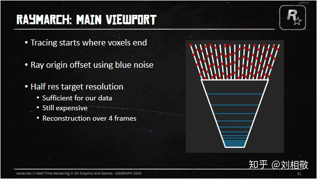

首先是告诉我们因为体素不能表现很多高频细节，所以从体素的远端开始要进行视口的Raymarch，然而全分辨率Raymarch消耗太高，所以需要在半分辨率下（长宽各除以2）进行RayMarch。然而这样的消耗仍然很高啊，那就把这Raymarch的操作分散到4帧里面执行吧。考虑到后期需要UpSample +  TAA，那就把射线的起始位置延视线方向用BlueNoise抖动一下前后位置以便得到更好的效果。具体实现就是用两个半视口分辨率的RT，前后帧交替一个做历史帧云雾Raymarch结果，一个做当前帧云雾融合结果并最后渲染到SceneColor上。当前帧Raymarch云雾的操作执行在一个四分之一分辨率（长宽各除以4）的小RT上，用于和历史帧云雾融合。

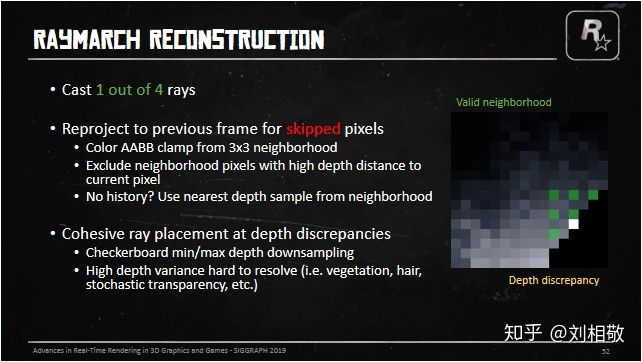

然后下一张PPT就是在讲，因为Raymarch分散到4帧里面执行了，那么就需要一个好的方法将以前几帧但是当前帧跳过的像素Raymarch的结果融合到当前帧来。怎么做呢？

1、用围绕跳过像素的的所对应的3x3大小的RayMarch像素块形成的云雾颜色的AABB包围盒来裁剪历史帧恢复出来的云雾信息，从而丢弃过时的云雾信息。

2、在3x3的Raymarch像素内用一个尽可能大的深度包裹范围来进行Raymarch，以便更好的处理深度边缘云层出现抖动的问题。（PS:深度边缘就是在一个区域内深度发生剧烈变化的位置。比如场景中挡住天空的东西，这些东西的边缘出就会因为天空深度是无穷远而导致和东西的深度出现巨大的反差。这个时候分帧处理后的Raymarch的云雾遇到这种边缘就会因为某一帧只看到远处的云层下一帧只看到近处的雾而导致，历史帧云雾信息恢复到当前帧因为进行了Color AABB 裁剪，就会出现颜色抖动，即闪烁。所以在深度变化剧烈的地方需要特殊处理。）

3、如果没有历史云雾信息，那么就直接使用周遭Raymarch像素中距离此融合位置LinearEyeDepth最近的像素的云雾信息替代。（比如转动视角时的视口边缘部分）

那么就需要考虑一种在深度差异大的地方有关联性的分布射线的方法：

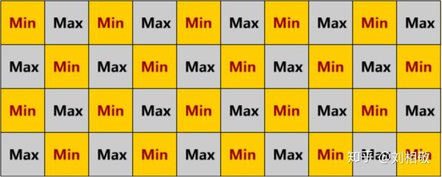

先准备好半分辨率的深度MinMax棋盘格图，即像国际象棋棋盘格一样，上图黄格子存2x2像素的深度最小值，灰格子存2x2像素的深度最大值。这样处理过后我们可以看到深度边缘会出现棋盘格样的亮度变化，并且每个Raymarch像素都会涉及2x2大小的MinMax棋盘格图。我们叫这样一个2x2大小的区域为一个Tile，分帧就是分4帧Raymarch出整个Tile，每个Tile会有2个Min深度，记录2x2个视口全分辨率像素的深度的最小值，2个Max深度，记录2x2个视口全分辨率像素深度的最大值。

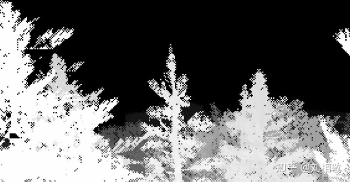

比如上图这样，树木边缘呈现出棋盘格的样式。

当然仅仅做到这一步并不算完成，深度差异太大的地方历史帧信息是很难还原的。

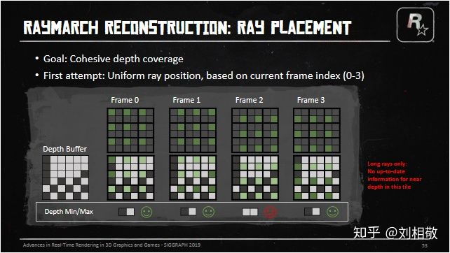

每一帧在2x2的Tile里面的哪个格子发射射线就成了问题，如果我们就按照在一个2x2的Tile里左上右上右下左下的顺序依次发射射线，在3x3的Raymarch像素中很多时候会出现射线没有覆盖整个12x12像素的深度范围的情况，上图中第0、1、3号帧都有比较好的深度覆盖范围，但是第2号帧就只覆盖了近处的深度，那么云雾Raymarch的历史信息还原就会出先闪烁。因为远处可能是大朵云，近处是稀薄的雾。这样融合出来的像素就会在每4帧中跑到第二号帧就闪烁一次。

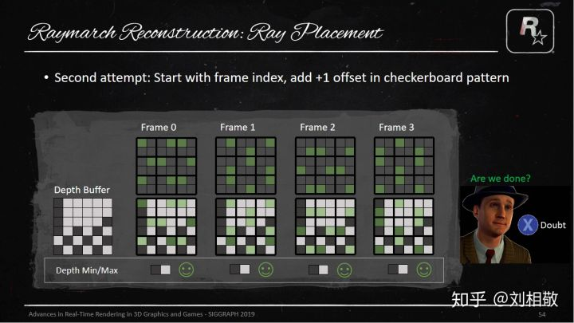

然后考虑下一种方法：我们把射线对应的2x2的Tile，按照Tile做一个棋盘格状的TileIndex偏移即：

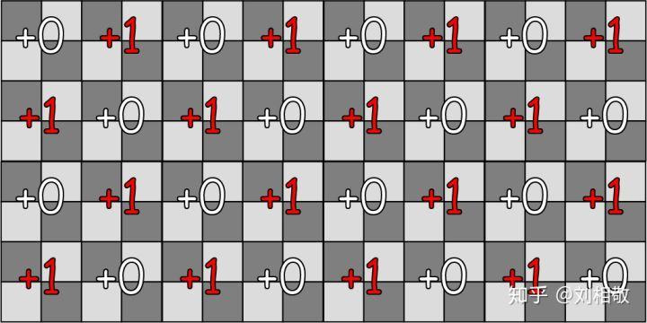

然后我们就能得到PPT上的第二种偏移模式了。这时候发现对于刚才的深度情况，3x3的Raymarch像素已经能够比较好的覆盖所属区域的深度的最大最小值了，但是这就完事了吗？然而并没有：

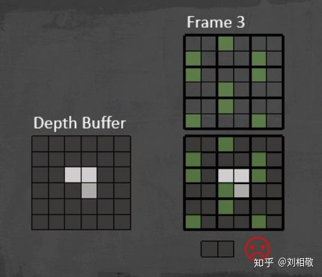

像这种深度MinMax分布，刚才的偏移模式也会出现不能覆盖的情况。所以需要引入一种机制，在这种情况下也能覆盖深度的MinMax。这个时候我们就先假定周围8个像素都是第二种偏移模式，看看中间Tile中距离最近的深度的LinearEyeDepth和周围8个像素Raymarch位置的LinearEyeDepth比较是不是相差很大，如果8个像素都相差很大（用周围8个像素的LinearEyeDepth的25%作为阈值）那么说明需要将Raymarch的Tile内的Index设置到这个Tile中距离最近的像素上去。如果不是，那么就看这个Tile中距离最远的像素深度是不是和周围8个Tile的Raymarch位置上的LinearEyeDepth相差是不是都很大，如果是，就把Raymarch的Tile内的Index设置到这个Tile中距离最远的像素上去。否则就依然按照第二种偏移模式设置Raymarch在Tile内的Index。

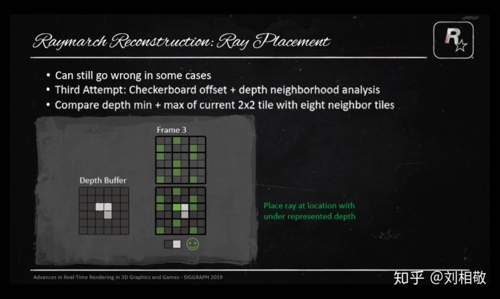

上面这一段很绕，但是目的很明确，就是要让每个Tile都能用周围3x3的Tile在Raymarch的时候覆盖住这3x3个Tile所属的12x12全分辨率像素的最大和最小深度。从而得到一个有纵深不会抖动的云雾颜色的AABB盒子。

这样射线在每个Tile中应该怎么分布就介绍完了，所以在实际执行的时候用了一张RG16F的图的红通道来记录Raymarch的时候每个Ray所属Tile的Index。这张图的绿通道记录的是Ray所属位置的MinMax图上的LinearEyeDepth除以10000的结果，很意外吧，这里没有直接使用深度也没有使用LinearEyeDepth。如果DeviceZ == 0，也就是深度是远裁剪面，就在绿通道上记录2，然后我们就可以看到遮掩一张图：

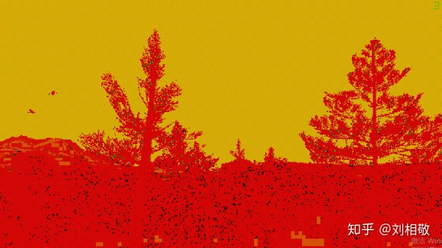

放大一个区域：

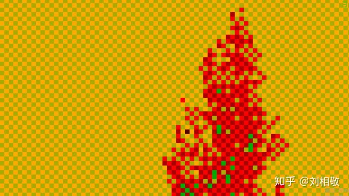

红通道的值是3、2交替，有的地方会出现1和0，绿通道天空处是2，树木顶端的位置是0.00102左右，说明这个位置距离相机的LinearEyeDepth是10.2米。

然后PPT就开始介绍如何将低分辨率的云雾或者Voxel结果上采样到全分辨率：

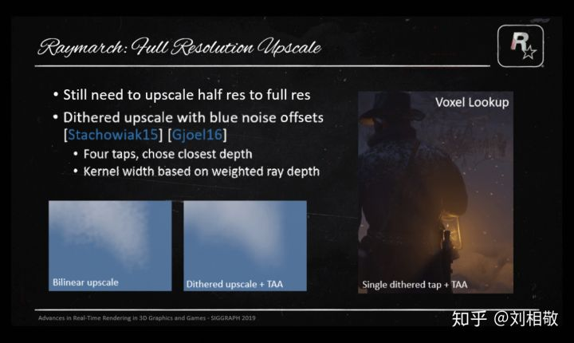

在将半分辨率上采样到全分辨率的时候，即便之前做了很多努力将4帧Raymarch的结果重建得很不错了，也不能避免使用Bllinear  upscale会导致的云雾斑驳问题出现，毕竟之前是使用Bluenoise将射线的出射位置做了前后偏移的，这个时候就需要使用BlueNoise和四个采样点来抖动半分辨率的源图像了，要么对采样点进行平均，要么就选择深度差异上最接近深度的采样结果。由于之前做了抖动，自然就需要使用TAA来平滑抖动，BlueNoise  Dither和TAA是老搭档了。当然抖动也不是所有像素一个幅度的，要结合云雾的透光率和云雾距离来决定，近距离比较浓的雾，我们需要抖动得厉害些，远处的云朵需要抖动地少一些，这样既保证近处雾的平滑，又保证远处云的清晰。

当然Voxel体素的采样也需要这样操作，下面是效果对比：

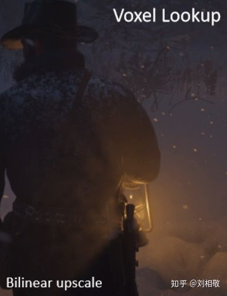

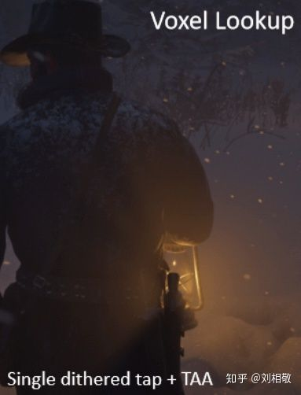

原本低分辨率各种像素块的体积雾就变得平滑自然了。

上面的部分就是PPT中讲述的荒野大镖客2天气系统云雾分帧处理细节部分了。这部分对于想要做体积云的体积雾的人来说其实很重要，怎么分帧处理，怎么减少融合抖动，怎么将低分辨率的图升分辨率到全图并且还能融合的很好不会在深度边缘断裂漏光，其实都有答案了。

下面就是我在UE4.24里面的实现过程：

**对每个视口申请以下RenderTarget：**

半分辨率深度MinMax棋盘格图：DownSampledMinMaxDepth     格式：PF_R32_FLOAT

四分之一分辨率的TileIndex和深度距离图：TileIndexAndSceneDis  格式：PF_G16R16F

半分辨率存储云雾信息的图A：CloudFogColorA                             格式：PF_FloatRGBA

半分辨率存储云雾信息的图B：CloudFogColorB                              格式：PF_FloatRGBA

四分之一分辨率用来Raymarch的云雾信息图：CloudFogColorDS    格式：PF_FloatRGBA

四分之一分辨率存储场景和云雾距离的图：CloudFogDistanceDS     格式：PF_R16F

需要准备的其他资源贴图参考荒野大镖客2天气系统PPT。

或者是YivanLee巨巨分享的：

[YivanLee：MarigosGameDev（环境模拟篇）【HorizonDawn Volume Cloud 】](https://zhuanlan.zhihu.com/p/115820759)[zhuanlan.zhihu.com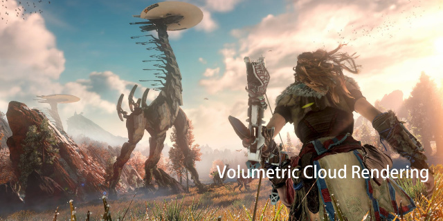](https://zhuanlan.zhihu.com/p/115820759)

云层阴影怎么做后续更新

**降采样深度获取深度MinMax棋盘格图：**

使用ComputeShader来做

UE4为了避免分辨率变化带来的频繁的贴图创建和销毁，使用了视口分辨率和Buffer分辨率分离的方式，如果使用的是PixelShader来做，得到的Texcoord0已经是正确的BufferUV了，但是ComputeShader不会给我们这个东西，所以我们需要将DispatchThreadID转换到视口UV再转换到BufferUV才能进行采样。转换成视口UV记得将DispatchThreadID变成float2再加上0.5f才能和View.ViewSizeAndInvSize.zw * 2.0f相乘，否则得到的UV位置就不是像素中心了。

采样的时候使用GatherRed可以节约指令，一次采样四个像素的红通道放到一个float4里面。

GatherRed的坐标如下：

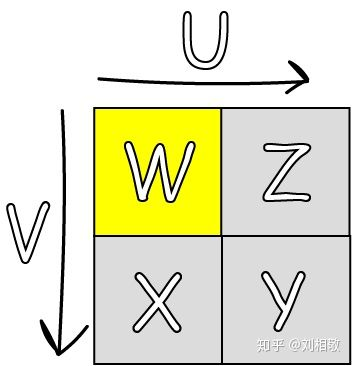

UV增加的方向如图，当UV坐标位置黄色格子范围内以及黄色格子右侧边线和下方边线上以及格子右下角时（对应于上图四个像素正中心），Point采样模式的GatherRed都能取到这四个像素的值，值分布在图上用xyzw标注出来了。

MinMax棋盘格的Min标志：DispatchThreadID.x % 2 == DispatchThreadID.y % 2

步骤：

确定视口坐标->转成BufferUV->GatherRed SceneDepthTexture->根据棋盘格Min标志获取四个分量最小/最大值存储到DownSampledMinMaxDepth中->Done!

**获取Ray的TileIndex和对应位置的距离：**

使用ComputeShader来做

依然使用GatherRed优化采样

默认TileIndex需要CPU每帧统一给定0到3循环增加的一个变量配合棋盘格偏移来确定。

步骤：

1、对每个DispatchThreadID对应的Tile所覆盖的DownSampledMinMaxDepth图GatherRed，并记录最近点和最远点的TileIndex，分别叫NearestIndex和FarestIndex。

2、统计Tile和周围Tile的默认射线位置的深度差异，存储和Tile最近点深度差异小的周围Tile数量TileNumNearNearestPos，存储和Tile最远点深度差异小的周围Tile数量TileNumNearFarestPos。

3、如果TileNumNearNearestPos = 0，那么当前Ray的TileIndex应该等于NearestIndex，否则如果TileNumNearFarestPos =  0，那么当前Ray的TileIndex应该等于FarestIndex，否则就是默认TileIndex。

代码：

```text
static const int2 IndexOffsets[8] = { int2(-1, -1), int2(0, -1), int2(1, -1), int2(-1, 1), int2(0, 1), int2(1, 1), int2(-1, 0), int2(1, 0) };

[numthreads(8,8,1)]
void DrawTileIndexAndSceneDis(uint3 DispatchThreadID : SV_DispatchThreadID) 
{
    float2 uvPixelSize = View.ViewSizeAndInvSize.zw * 4.0f;
    //float2 uvViewport = (float2(DispatchThreadID.xy) + 0.5f) * uvPixelSize;
    float2 uvBuffer = float2(DispatchThreadID.xy + 0.5f) * View.BufferSizeAndInvSize.zw * 4.0f;
    //JitterIndex = 0、1、2、3
    /* 
        Gather方法在Unity中的取样存储的顺序应该是下面这样的顺序：
                ┌—-—┰—-—┐    ┌—-—┰—-—┐
                | w | z |    | 3 | 2 |
                ├—-—┼—-—┤    ├—-—┼—-—┤
                | x | y |    | 0 | 1 |
                └—-—┴—-—┘    └—-—┴—-—┘
        UV对应w像素的覆盖范围或者四个像素交叉位置
        这里可以看出Gather方法的顺序和JitterIndex的顺序刚好相反，所以GatherRed后直接颠倒xyzw的顺序以符合JitterIndex的顺序
    */
    float4 TileMinMaxDepthZ = DownSampledMinMaxDepth.GatherRed(DownSampledMinMaxDepthSampler, uvBuffer, int2(0, 0)).wzyx;
    uint NearestIndex = 0;
    uint FarestIndex = 0;
    [unroll]
    for (uint i = 1u; i < 4u; i++)
    {
        NearestIndex = (TileMinMaxDepthZ[i] > TileMinMaxDepthZ[NearestIndex]) ? i : NearestIndex;
        FarestIndex = (TileMinMaxDepthZ[i] < TileMinMaxDepthZ[FarestIndex]) ? i : FarestIndex;
    }
    float MaxFarDepthZ = TileMinMaxDepthZ[FarestIndex];
    float MaxNearDepthZ = TileMinMaxDepthZ[NearestIndex];
    float farestEyeDepth = ConvertFromDeviceZ(MaxFarDepthZ) * 0.01f;
    float nearestEyeDepth = ConvertFromDeviceZ(MaxNearDepthZ) * 0.01f;
    int TileNumNearFarestPos = 0;
    int TileNumNearNearestPos = 0;
    for (int count = 0; count < 8;  count++)
    {
        /*IndexOffsets偏移Index
        0  1  2
        6  *  7
        3  4  5
        */
        int2 IndexLimit = int2(ceil(View.ViewSizeAndInvSize.xy * 0.25f)) - int2(1,1);
        uint2 curPosIndex = uint2(clamp(int2(DispatchThreadID.xy) + IndexOffsets[count], int2(0, 0), IndexLimit));
        float2 curUVBuffer =  ((float2(curPosIndex) + 0.5f) * 4.0f + View.ViewRectMin.xy) * View.BufferSizeAndInvSize.zw;
        float4 InverseGatherDepthMinMax = DownSampledMinMaxDepth.GatherRed(DownSampledMinMaxDepthSampler, curUVBuffer, int2(0, 0)).wzyx;
        float RayMarchPosDeviceZ = InverseGatherDepthMinMax[(JitterIndex + uint((curPosIndex.x % 2u) == (curPosIndex.y % 2u))) % 4u];
        float RayMarchPosEyeDepth = ConvertFromDeviceZ(RayMarchPosDeviceZ) * 0.01f;//sceneEyeDepth
        float AllowDeltaEyeDepth = RayMarchPosEyeDepth * 0.25f;
        if (abs(farestEyeDepth - RayMarchPosEyeDepth) < AllowDeltaEyeDepth)
        {
            TileNumNearFarestPos ++;
        }
        if (abs(nearestEyeDepth - RayMarchPosEyeDepth) < AllowDeltaEyeDepth)
        {
            TileNumNearNearestPos ++;
        }
    }
    uint TileIndex;
    //采样点周围8个像素的值距离
    if (TileNumNearNearestPos == 0)//如果周围8个像素的没有一个的TileEyeDepth的AABB盒的最小值是靠近当前RayMarch点EyeDepth的，就将TileIndex改成NearestIndex;
    {
        TileIndex = NearestIndex;
    }
    else
    {
        if (TileNumNearFarestPos == 0)//如果周围8个像素的没有一个的TileEyeDepth的AABB盒的最大值是靠近当前RayMarch点EyeDepth的，就将TileIndex改成FarestIndex;
        {
            TileIndex = FarestIndex;
        }
        else
        {
            TileIndex = (JitterIndex + uint((DispatchThreadID.x % 2u) == (DispatchThreadID.y % 2u))) % 4u;//否则使用正常的TileIndex
        }
    }
    //FarClipOfCloudAndFog = 10000.00
    float tileEyeDepth = ConvertFromDeviceZ(TileMinMaxDepthZ[TileIndex]) * 0.01f;
    RWTileIndexAndSceneDis[DispatchThreadID.xy] = float2(float(TileIndex), ((TileMinMaxDepthZ[TileIndex] == 0.0f) ? (20000.0f) : min(10000.0f, tileEyeDepth)) / 10000.0f);
}
```

**Raymarch云雾**

使用ComputeShader完成

这部分实现方法各有不同，方式多种多样，自己开心就好，过程可以又出一篇冗长的知乎文章了。

和UE4渲染管线里面其他组件的结合也是很复杂的，待我神功大成我再说说是怎么做的。

给几个参考：

[[图形学\] 实时体积云（Horizon: Zero Dawn）](https://link.zhihu.com/?target=https%3A//blog.csdn.net/ZJU_fish1996/article/details/89211634)[blog.csdn.net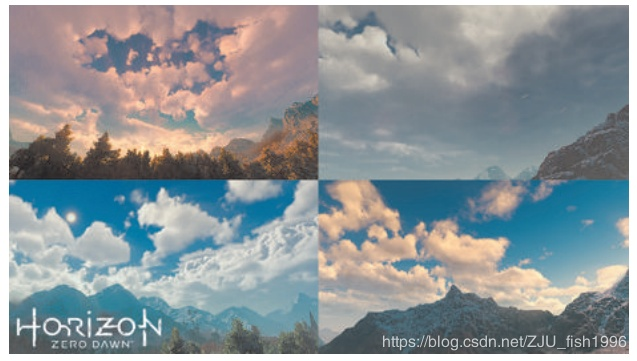](https://link.zhihu.com/?target=https%3A//blog.csdn.net/ZJU_fish1996/article/details/89211634)[https://www.shadertoy.com/view/MstBWs](https://link.zhihu.com/?target=https%3A//www.shadertoy.com/view/MstBWs)[www.shadertoy.com](https://link.zhihu.com/?target=https%3A//www.shadertoy.com/view/MstBWs)[https://www.shadertoy.com/view/4dSBDt](https://link.zhihu.com/?target=https%3A//www.shadertoy.com/view/4dSBDt)[www.shadertoy.com](https://link.zhihu.com/?target=https%3A//www.shadertoy.com/view/4dSBDt)

ShaderToy这些是我觉得比较写实的体积云，过程可以参考。

**Raymarch云雾的重建**

使用ComputeShader完成

核心在于如何在UE4中还原历史帧所对应的UV位置，然后把历史帧颜色信息Clamp到当前帧Raymarch出的云雾信息的ColorAABB中。

步骤：

1、确定当前像素的TileIndex : 

2、根据TileIndexAndSceneDis得到本帧Raymarch的TileIndex，如果当前像素的TileIndex和射线TileIndex相等，那么直接使用Raymarch的云图信息结束流程，不等就继续下一步。

3、找到本像素所属TileRaymarch的云图信息和对应LinearEyeDepth，找到周围一圈Tile的Raymarch云图信息和对应LinearEyeDepth，云图信息和LinearEyeDepth存储为数组，用于循环查找。

4、查找在深度上和当前像素距离最近的Raymarch云图信息NearestCloudDS，查找周围八个像素的云图信息的AABB盒。

5、反算上一帧视口UV位置应该在哪里，然后采样历史云图，用上面的云图信息AABB裁剪。当然如果UV跑到屏幕外了，就只能用NearestCloudDS代替了。

代码：

```text
[numthreads(8,8,1)]
void CSSkyCloudsCombine(uint3 DispatchThreadID : SV_DispatchThreadID) 
{
    float2 uvPixelSize = View.ViewSizeAndInvSize.zw * 2.0f;
    float2 uvViewport = (float2(DispatchThreadID.xy) + 0.5f) * uvPixelSize;
    int2 CloudDSMapID = int2(DispatchThreadID.xy / uint2(2u, 2u));
    
    uint yux = DispatchThreadID.x % 2u;
    uint yuy = DispatchThreadID.y % 2u;
    //uint CurPixelTileIndex = yux + yuy * 2u;
    /*  
    一个Tile覆盖2x2个全尺寸云图像素，大表哥2默认的CurPixelTileIndex在Tile中的值应该如下图:
        ┌—-—┰—-—┐
        | 0 | 1 |
        ├—-—┼—-—┤
        | 2 | 3 |
        └—-—┴—-—┘
    */
    uint CurPixelTileIndex = yux * (1 - 2 * yuy) + yuy * 3u;
    /*  
    一个Tile覆盖2x2个全尺寸云图像素，上面的算法会把CurPixelTileIndex同步成和JitterIndex一样的顺序，在Tile中的值应该如下图:
        ┌—-—┰—-—┐
        | 0 | 1 |
        ├—-—┼—-—┤
        | 3 | 2 |
        └—-—┴—-—┘
     */
    int2 CloudFullMapBaseID = CloudDSMapID * int2(2, 2);
    int2 uvids[4] = { CloudFullMapBaseID, CloudFullMapBaseID + int2(1, 0), CloudFullMapBaseID + int2(1, 1), CloudFullMapBaseID + int2(0, 1) };
    uint2 CloudDSIndexID = uint2(CloudDSMapID);
    float4 IndexAndDistance = TileIndexAndSceneDis.Load(int3(CloudDSIndexID, 0u));
    uint IndexInTile = uint(IndexAndDistance.x);
    int2 RayInFullCloudMapIndex = uvids[IndexInTile];
    float4 CloudDS_CT = CloudFogColorDS.Load(int3(CloudDSIndexID, 0u));
    //判断当前像素是不是就是这一帧rayMarch的像素
    bool CurIndexIsRayTileIndex = CurPixelTileIndex == IndexInTile;
    if (CurIndexIsRayTileIndex)
    {
        //如果当前像素就是RayMarch的像素那么就直接存储云图信息，跳过历史帧的ReConstruct。
        RWCloudFogColorOutput[uint2(RayInFullCloudMapIndex)] = CloudDS_CT;
        return;
    }
    int2 XYIndexLimit = int2((View.ViewSizeAndInvSize.xy * 0.25f) - 1.0f);
    float2 UVCTInCloudDS = ViewportUVToBufferUV(float2(CloudDSMapID) * uvPixelSize * 2.0f);
    float2 UVRDInCloudDS = ViewportUVToBufferUV((float2(CloudDSMapID) + 1.0f) * uvPixelSize * 2.0f);
    float4 CloudDS_R = CloudFogColorDS.Load(int3(clamp(CloudDSMapID + int2(1, 0), int2(0, 0), XYIndexLimit), 0));
    float4 CloudDS_L = CloudFogColorDS.Load(int3(clamp(CloudDSMapID + int2(-1, 0), int2(0, 0), XYIndexLimit), 0));
    float4 CloudDS_D = CloudFogColorDS.Load(int3(clamp(CloudDSMapID + int2(0, 1), int2(0, 0), XYIndexLimit), 0));
    float4 CloudDS_T = CloudFogColorDS.Load(int3(clamp(CloudDSMapID + int2(0, -1), int2(0, 0), XYIndexLimit), 0));
    float4 CloudDS_RD = CloudFogColorDS.Load(int3(clamp(CloudDSMapID + int2(1, 1), int2(0, 0), XYIndexLimit), 0));
    int3 IndexInCloudDS_LD = int3(clamp(CloudDSMapID + int2(-1, 1), int2(0, 0), XYIndexLimit), 0);
    float4 CloudDS_LD = CloudFogColorDS.Load(IndexInCloudDS_LD);
    int3 IndexInCloudDS_RT = int3(clamp(CloudDSMapID + int2(1, -1), int2(0, 0), XYIndexLimit), 0);
    float4 CloudDS_RT = CloudFogColorDS.Load(IndexInCloudDS_RT);
    float4 CloudDS_LT = CloudFogColorDS.Load(int3(clamp(CloudDSMapID + int2(-1, -1), int2(0, 0), XYIndexLimit), 0));
    /*
        Gather方法在Unity中的取样存储的顺序应该是下面这样的顺序：
                ┌—-—┰—-—┐    ┌—-—┰—-—┐
                | w | z |    | 3 | 2 |
                ├—-—┼—-—┤    ├—-—┼—-—┤
                | x | y |    | 0 | 1 |
                └—-—┴—-—┘    └—-—┴—-—┘
        UV对应w像素的覆盖范围或者四个像素交叉位置
        这里可以看出Gather方法的顺序和IndexInTile的顺序刚好相反
        所以CT像素中心UV应该是UVCTInCloudDS + 0.5f * PixelSizeInCloudMapUV * 2.0f,
        UVCTInCloudDS实际是CT像素的左上角A，UVRDInCloudDS实际是CT像素的右下角B,如下图所示：
        ┌—-—┰—-—┰—-—┐ 
        |LT | T | RT| 下面对TileIndexAndSceneDis绿通道，即距离值的读取使用了很高效的方法：
        ├—-—A—-—┼—-—┤ GatherGreen(_5, UVCTinCloudDS)会读取L CT T LT四个格子里面的绿通道值放到一个float4的XYZW分量里面
        | L |CT | R | GatherGreen(_5, UVRDInCloudDS)会读取D RD R CT四个格子里面的绿通道值放到一个float4的XYZW分量里面
        ├—-—┼—-—B—-—┤ 这样我们就用2次采样得到了TileIndexAndSceneDis中7个不同像素的绿通道值
        |LD | D | RD| 然后我们单独再把LD和RT位置的绿通道值读出来就成功将TileIndexAndSceneDis中以UVCT为中心的3x3共计9个像素的绿通道值搞到手了
        └—-—┴—-—┴—-—┘ 4次采样，相比9次采样少了5次，效率提高不少

     */
    float4 disL_CT_T_LT = TileIndexAndSceneDis.GatherGreen(TileIndexAndSceneDisSampler, UVCTInCloudDS) * 10000.0f.xxxx;//_38_m14.y;
    float4 disD_RD_R_CT = TileIndexAndSceneDis.GatherGreen(TileIndexAndSceneDisSampler, UVRDInCloudDS) * 10000.0f.xxxx;// _38_m14.y;
    //这里使用了中央像素周围一圈像素的距离值
    float distance_R = disD_RD_R_CT.z;
    float distance_L = disL_CT_T_LT.x;
    float distance_D = disD_RD_R_CT.x;
    float distance_T = disL_CT_T_LT.z;
    float distance_RD = disD_RD_R_CT.y; 
    float distance_LD = TileIndexAndSceneDis.Load(IndexInCloudDS_LD).y * 10000.0f;//_38_m14.y;
    float distance_RT = TileIndexAndSceneDis.Load(IndexInCloudDS_RT).y * 10000.0f;//_38_m14.y;
    float distance_LT = disL_CT_T_LT.w;
    int2 CurPixelIndex = uvids[CurPixelTileIndex];
    uint2 CurPixelIndexID = uint2(CurPixelIndex);
    float CurPixelMinMaxDepth = DownSampledMinMaxDepth.Load(int3(CurPixelIndexID, 0u)).x;
    float CurPixelEyeDepth = ConvertFromDeviceZ(CurPixelMinMaxDepth) * 0.01f;
    float CurPixelRealEyeDepth = CurPixelMinMaxDepth == 0.0f ? 20000.0f : CurPixelEyeDepth;
    //float2 CombineViewPortUV = (float2(CurPixelIndex) + 0.5f) * uvPixelSize;
    float2 CombineBufferUV = ViewportUVToBufferUV(uvViewport);
    float2 CurPixelScreenPos = ViewportUVToScreenPos(uvViewport);

    float CloudAndSceneDistance = CloudFogDistanceDS.Load(int3(CloudDSIndexID, 0u)).x;
    //下面部分是还原当前帧被跳过的射线在当前帧的屏幕位置
    float3 viewDir = normalize(mul(float4(CurPixelScreenPos.xy,1.0f,1.0f), View.ScreenToTranslatedWorld).xyz);
    float3 CurPixelRayVector = viewDir / dot(viewDir,View.ViewForward);
    float4 ThisViewPos = float4(CurPixelRayVector * CloudAndSceneDistance * 100.0f + View.WorldCameraMovementSinceLastFrame, 1.0f);
    float4 PrevClip = mul(ThisViewPos,View.PrevTranslatedWorldToClip);
    float2 PrevScreen = PrevClip.xy / PrevClip.w;
    float PrevClipW = PrevClip.w;
    float2 PrevUV = ViewportUVToBufferUV(ScreenPosToViewportUV(PrevScreen.xy));

    //用于判断还原后的位置是否超出屏幕
    float2 ScreenPosRange = abs(PrevScreen);
    float SceneEyeDepth_CT = IndexAndDistance.y * 10000.0f;

    float4 CloudDSInfos[9] = {CloudDS_CT,CloudDS_R,CloudDS_L,CloudDS_D,CloudDS_T,CloudDS_RD,CloudDS_LD,CloudDS_RT,CloudDS_LT};
    float distanceList[9] = {SceneEyeDepth_CT,distance_R,distance_L,distance_D,distance_T,distance_RD,distance_LD,distance_RT,distance_LT};
    float deltaDisList[9];
    float minDeltaDis = 20000.0f;
    int nearIndex = 0;
    //查找深度上距离最近的CloudFogDS中的颜色
    [unroll]
    for(int i = 0;i<9;i++)
    {
        float deltaDis = abs(CurPixelRealEyeDepth - distanceList[i]);
        deltaDisList[i] = deltaDis;
        if(deltaDis < minDeltaDis)
        {
            nearIndex = i;
            minDeltaDis = deltaDis;
        }
    }
    float4 NearestCloudDS = CloudDSInfos[nearIndex];
    //查找周围8个CloudFogColorDS像素所形成的ColorAABB
    float4 CloudColorAABB_Max = NearestCloudDS;
    float4 CloudColorAABB_Min = NearestCloudDS;
    float ThresholdDeltaEyeDepthRate = 0.1f;
    [unroll]
    for(int i = 1; i < 9; i++)
    {
        if(deltaDisList[i] < distanceList[i] * ThresholdDeltaEyeDepthRate)
        {
            CloudColorAABB_Max = max(CloudColorAABB_Max, CloudDSInfos[i]);
            CloudColorAABB_Min = min(CloudColorAABB_Min, CloudDSInfos[i]);
        }
    }
    //float2 currentFrameUV = ViewportUVToBufferUV(currentFrameScreenPos * float2(0.5f, -0.5f) + 0.5f);
    bool isOutScreen = (ScreenPosRange.x > 1.0f) || (ScreenPosRange.y > 1.0f);
    float4 clampedCloudColor = clamp(CloudFogColorInput.SampleLevel(CloudFogColorInputSampler, PrevUV, 0.0f), CloudColorAABB_Min, CloudColorAABB_Max);
    //NearestCloudDS是深度上最接近历史样本深度的当前帧渲染的云图颜色
    RWCloudFogColorOutput[CurPixelIndexID] = lerp(NearestCloudDS, clampedCloudColor, (isOutScreen ? 0.0f : (CurIndexIsRayTileIndex ? 0.5f : 1.0f) * float(PrevClipW > 0.0f)).xxxx);
}
```

**DitherUpscale**

这一块相比上一块复杂很多，大表哥2里面还把大气散射、体积雾、卷云都融合在了这一个过程里面。

特别需要提的一点是云雾的颜色是如何单个PassBlend到SceneColorDeferred的：

UE4的BlendFactor：

```text
enum EBlendFactor
{
	BF_Zero,
	BF_One,
	BF_SourceColor,
	BF_InverseSourceColor,
	BF_SourceAlpha,
	BF_InverseSourceAlpha,
	BF_DestAlpha,
	BF_InverseDestAlpha,
	BF_DestColor,
	BF_InverseDestColor,
	BF_ConstantBlendFactor,
	BF_InverseConstantBlendFactor,
	BF_Source1Color,
	BF_InverseSource1Color,
	BF_Source1Alpha,
	BF_InverseSource1Alpha,

	EBlendFactor_Num,
	EBlendFactor_NumBits = 4,
};
```

这里面有几个特殊的值：

```text
BF_Source1Color,
BF_InverseSource1Color,
BF_Source1Alpha,
BF_InverseSource1Alpha,
```

这里面出现了Source1，其实我们是可以做2个Source来进行混合的，方法很简单，在Shader入口处定义out到2个SV_Target就好了：

```text
out float4 OutColor0 : SV_Target0,
out float4 OutColor1 : SV_Target1
```

这样的话我们就可以使用Source1系列Blend来实现需要的混合方式了，所以PS的所有混合方式在Shader中都可以一个Pass搞定，并不需要将SceneColor拷贝出来再采样。

荒野大镖客2就是用了Source和Source1混合云层到SceneColorDeferred的。

UE4代码如下：

```text
GraphicsPSOInit.BlendState = TStaticBlendState<CW_RGB, BO_Add, BF_One, BF_Source1Color, BO_Add, BF_One, BF_Zero>::GetRHI();
```

意义就是Source0 + Source1 * Dest。我们用透射率乘以场景颜色然后叠加云雾颜色这种混合方式混合云雾。

步骤：

1、通过SceneDepthTexture拿到深度并转换成LinearEyeDepth：SceneDepth。

2、利用SV_POSITION的XY分量转成int2来得到像素Index，然后取XY分量的低6位作为BlueNoise采样的Index（BlueNoise分辨率为64x64x32，所以只需要低6位就可以了），采样后用0到15每帧增大1的JitterIndex  乘以1.618034f来偏移BlueNoise的采样值，取其小数部分作为抖动偏移的X值，然后取像素Index的YX分量（和前面反过来）做同样的操作作为抖动偏移的Y值。

3、用云图信息和距离决定抖动像素的幅度，然后乘以抖动偏移得到云图偏移，用加上云图偏移的Texcoord采样左上右上左下右下四次采样云图和深度MinMax信息，当然MinMax深度需要转换成LinearEyeDepth。

4、计算SceneDepth和四次采样深度MinMax的LinearEyeDepth的差距，并且将这个差距的比例得到，将差距的最小值取到：minDeltaDistanceOfCloudToScene。

5、如果4次采样的差距比例都小于25%，那么说明覆盖此场景像素的云雾图颜色和实际Upscale后的云雾颜色应该很接近，就取4个值的平均作为最终云雾颜色。否则就判断深度差距最小的像素是哪个，就用这个像素来作为最终云雾颜色。

6、如果射线没有朝向天空，那么需要GetAerialPerspectiveLuminanceTransmittanceWithFogOver信息和云雾颜色混合，如果射线朝向天空，就需要得到卷云信息，和云雾颜色通过云雾颜色透射率混合，最终透射率为两者相乘。

7、最后OutColor0为云雾颜色，OutColor1为大气雾颜色乘以云雾透射率。

实现的效果：


编辑于 2020-04-09