# 实时体积云（Horizon: Zero Dawn）

reference : 《GPU Pro 7》

​     游戏中的实时体积云通常会降低质量来提升性能。其中最成功的方法仅限于低空蓬松和半透明的层状云。 我们提出了一种体积解决方案，可以填充天空，具有不断变化的逼真效果，描绘了高海拔卷云和所有主要的底层云类型，包括了厚而汹涌的积云。此外，我们的方法和实时云渲染解决方案中尚未发表的几种体积光照效果比较接近。最后，这个解决方案在内存和GPU上运行良好，可以用于AAA级游戏。（见图4.1）

​    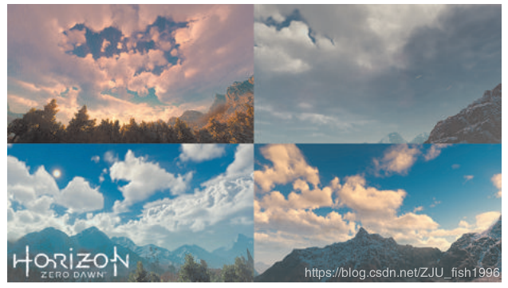

> ​    **图4.1** 为Horizon: Zero Dawn.游戏实时绘制的几个体积云效果

## 介绍

​     在AAA级游戏中渲染云的标准解决方案涉及到某种类型的资源，要么是2D公告牌、极坐标天空球图像，或是渲染时实例化的体积。对于需要不断变化的天空并允许玩家到达远距离的游戏，例如开放世界游戏，多个摄像机角度、一天中的时间和光照条件的存储和访问成本，都会抵消高精度资源的带来的优点。此外，云系统演化的模拟仅限于使用一些技巧或者trick，例如旋转天空圆形包围盒或使用2D噪声扭曲图像。而程序生成云系统的众多技术不依赖于资源。在ShaderToy.com上可以免费得到几个很好的例子，例如"Clouds"[Quilez 13]。 Evolution工作室使用名为TrueSky的中间件为游戏Drive Club[Simul  13]提供了令人印象深刻的大气天气效果。

​     然而，这些方法存在一些局限性：

​    • 它们都只描述了低空层云，而不是厚的柱状的层积云或积云。

​    • 当前的体积方法不能实现云的特定真实照明效果。

​    • 实时体积云在性能和内存方面通常非常昂贵，并且这些耗费和它产生的结果质量不成正比。

​    针对游戏Horizon: Zero Dawn，我们开发了一种关于这些问题的新解决方案。我们提交了用于建模、照明和渲染的新算法，这些算法可提供逼真且不断变化的结果，同时保持20MB的内存预算和2ms的性能目标。

## 云的建模

​     图4.2显示了各种云类型以及高度范围。我们有两个层以体积方式呈现：低层云，存在于1.5公里到4公里之间，以及积雨云，从1公里到8公里，跨越整个低层大气层。alto和cirro云在高度上通常非常薄，并且可以通过2D纹理查找来以较低的费用进行渲染。

​    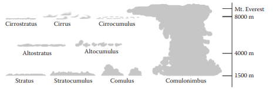

> ​    **图4.2** 主要云类型的对应

​     随着时间的推移和太阳照射地球，水蒸气从表面上升并穿过大气层。每层都有着自己的风向和温度。随着蒸汽在大气中行进得更高，温度会降低。随着温度的降低，蒸汽会在遇到的尘埃颗粒周围凝结成水或冰（有时这会像雨或雪一样回落）。这种大量蒸汽流动的不稳定性会引起湍流。随着云层的上升，它们往往会形成云层滚滚的形状。随着它们的扩散，它们像雾一样伸展和消散[Clausse and Facy61]。

​    云是流体动力学中令人惊叹的例子，对这种行为进行建模需要设计师以一种近似于所涉及的基础物理的方式处理云。考虑到这些概念，我们定义了几种技术，这些技术将在我们的光线行进中用于模拟云。

​    第4.3.1至第4.3.3节详细介绍了用于建模云的一些概念，第4.3.4节解释了它们如何一起使用。

###     修正的分形布朗运动

​    实时建模体积云系统的标准方法包括使用称为分形布朗运动的技术进行Ray match，或者简称FBM  [Mandelbrot和van Ness  68]（见图4.3）。FBM是一系列octaves噪声的叠加，每一octave都有更高的频率和更低的幅度。

​    Perlin噪声[Perlin 85]通常用于此目的。虽然这是一个比较可靠的模型，用于产生层云的雾状形状，但它无法描述积云的圆滑、波涛汹涌的形状或者它们中蕴含的运动感，如图4.4所示。

​     Perlin噪声可用于在其范围的中间翻转，来创造一些云的蓬松的形状。但因为它只是一种噪声，它仍然缺乏在云中可以看到的像花椰菜一样的图案。图4.5显示了Perlin噪声abs(Perlin * 2 + 1)的结果，以及在云中可见的分形翻滚的照片以作为参考。

​    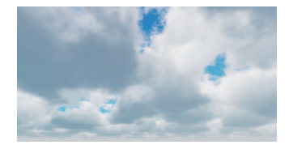

> ​    **图4.3** 用Ray-match和FBM噪声产生的程序化云

​    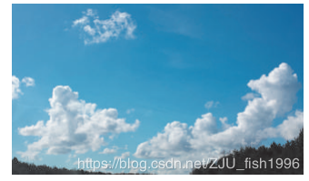

> ​    **图4.4** 照片显示云的圆形、翻滚的形状，类似于工厂通风口的烟雾

​     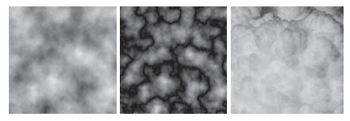

> ​    **图4.5** Seven-octave Perlin噪声（左），看起来比较“蓬松”的Perlin噪声（中），以及云中有着花椰菜外观的摄影作品参考（右）

​     另一种噪声，Worley噪声，由Steven Worley[Worley 96]于1996年引入，常用于渲染焦散和水的效果，如图4.6所示。

​     如果倒置并用于FBM，Worley噪声近似于一个很好的分形翻滚的图案，它还可用于为低频Perlin噪声的低密度区域添加细节（参见图4.7的左侧和中间）。我们通过使用Worley噪声FBM重新映射Perlin噪声作为原始范围的最小值来实现此目的。

​     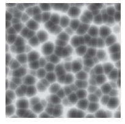

> ​    **图 4.6** Worley noise

​    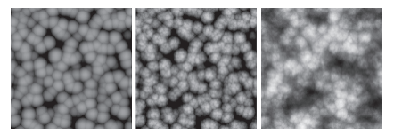

> ​    **图4.7** 倒置的Worley噪声（左），FBM由Worly噪声（中间）和Perlin-Worly噪声（右）组成

```
OldMin = Worly_FBM


PerlinWorley = NewMin + (((Perlin - OldMin) / (OldMax - OldMin)) * (NewMax - NewMin))
```

​    结合这两种噪声，为Perlin噪声产生的连通性添加了一些翻滚的效果，产生了更自然的效果。

​    我们将此称为低频Perlin-Worley噪声，它是我们建模方法的基础（见图4.7，右）。

​     我们并非在每个octave读取一张纹理来构建FBM，而是预处理FBM，因此我们只需读取两个纹理。图4.8显示了我们的第一个3D纹理，它由Perlin-Worley噪声FBM和Worley噪声FBM的三个octave组成。图4.9显示了我们的第二个3D纹理，它由另外三个octave的Worley噪声组成。

​    第一个3D纹理定义了我们的基础云形状，第二种是有更高的频率，用于扰动基础云形状的边缘并添加一些细节，如第4.3.4节中进一步解释的那样。

​    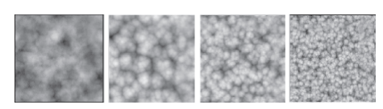

> ​    **图4.8** 低频噪声的RGBA通道的一部分。第一部分是PerlinWorley噪声，最后三个是频率逐渐增加的Worley噪声。

​    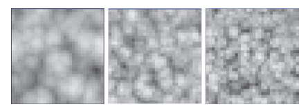

> ​     **图4.9** 从左到右，一部分高频噪声的RGB通道和频率逐渐增加的Worley噪声（Resolution:323)

###     密度-高度函数

​    这部分的先前工作基于高度[Quilez 13]偏移或缩放云密度值来创建特定的云类型。

​    此函数用于偏移或缩放噪声信号，并产生云。而其它工作中将云的类型限制为一种类型，因为云的最大高度永远不会改变。

​    我们通过使用三个这样的函数来扩展这一方法，一种用于三种主要的低级云类型：stratus,stratocumulus和cumulus。图4.10显示了我们使用的梯度函数，图4.11显示了使用这些函数从高度上改变云密度的结果。

​    在运行时，我们计算三个函数的加权和。我们使用天气纹理来改变权重，以添加或多或少的每种云类型。下一部分中将介绍详细内容。

​    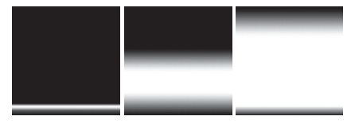

> ​    **图4.10** 由三个密度高度函数产生的梯度表示层云（左），积云（中）和积雨云（右）。

​    

> ​     **图4.11** 三个函数的结果用于表示层云（左），积云（中）和积雨云（右）

###     天气纹理

​    为了达到我们的目的，我们希望在云系统的任何领域了解三件事：

​    1.云的覆盖：天空中云覆盖的百分比

​    2.降水：云层上空产生雨水的可能性

​    3.云类型：值0.0表示层云，0.5表示层积云，1.0表示积云

​    这些属性都可以表示为0到1之间的概率，这使得他们易于使用和在2D纹理中预览。可以对此缓冲区进行采样，以获取世界空间中任何点的每个属性的值。

​    图4.12将此场景的天空映射分解成多个通道。该映射的比例为6000x6000m,箭头表示摄像机方向。

​    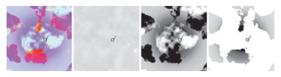

> ​    **图4.12** 天气纹理（左），（从左到右为）覆盖信息（红色），降水信息（绿色）和云类型信息（蓝色）

​    实际上，雨云始终存在于下雨的地方。为了模拟这种行为，我们将云类型偏向积雨云的云覆盖至少70%，其中降雨的可能性为100%。

​    此外，我们允许美术重写天气纹理，来产生具有艺术美感的天空，用于过场动画或其它直接体验 [Schneider 15, slide 47].

###     云采样器

​    我们目前已经建立了云密度函数的不同部分，我们开始讨论云的建模。

​     与迄今为止的所有其它体积云解决方案一样，我们使用Ray-match。Ray-match通过域并逐步采样密度值以用于照明和密度计算。这些数据用于构建体积和最终的图像。我们的云密度样本函数完成了解析样本位置和天气数据的大部分工作，以便在给定点给出云的密度值。

​     在我们开始处理函数之前，我们计算一个归一化的标量值，它表示云层中当前样本位置的高度。这将在建模过程的最后部分中使用。

```
// Fractional value for sample position in the cloud layer.


float GetHeightFractionForPoint( float3 inPosition, float2 inCloudMinMax )


{


    // Get global fractional position in cloud zone.


    float height_fraction = (inPosition.z - inCloudMinMax.x) / (inCloudMinMax.y - inCloudMinMax.x);


    return saturate(height_fraction);


}
```

​     我们还定义了一个重映射函数，用于将值从一个范围映射到另一个范围，以便在组合噪声的时候用其来构建我们的云。

```
// Utility function that maps a value from one range to another


float Remap(float original_value, float original_min, float original_max, 


            float new_min, float new_max)


{


    return new_min + ((( original_value - original_min) / (original_max - original_min))


            * (new_max - new_min));


}
```

​     我们的采样算法的第一步是在我们的第一个3D纹理中使用低频Perlin-Worley噪声构建基本的云形状。这个过程具体如下：

​    1.第一步是检索构建基本云形状所需的四个低频噪声值。我们对包含低频octaves的第一个3D纹理进行采样。

​    2.我们将使用第一个包含Perlin-Worley噪声的通道来建立我们的基础云形状。

​     3.虽然基本的Perlin-Worley噪声提供了合理的云密度函数，但它缺乏真实的云细节。我们使用重新映射功能将其它三个低频噪声添加到Perlin-Worley噪声的边缘。这种结合噪声的方式可以防止PerlinWorley云的内部变得不均匀，并确保我们只在我们那可以看到的区域添加细节。

​    4.为了确定我们正在绘制的云类型，我们根据天气纹理中的云类型属性计算密度高度函数。

​    5.接下来，我们将基本云的形状乘以密度高度函数，以根据天气数据创建正确类型的云。

​    用代码描述如下：

```
float SampleCloudDensity(float3 p, float3 weather_data)


{


    // Read the low-frequency Perlin-Worley and Worley noises


    float4 low_frequency_noises = tex3Dlod(Cloud3DNoiseTextureA, Cloud3DNoiseSamplerA,


        float4(p,mip_level)).rgba;


 


    // Build an FBM out of the low frequency Worley noises


    // that can be used to add detail to the low-frequency


    // Perlin-Worley noise.


    float low_freq_FBM = (low_frequency_noises.g * 0.625) + (low_frequency_noises.b * 0.25)


        + (low_frequency_noises.a * 0.125);


 


    // define the base cloud shape by dilating it with the low-frequency


    // FBM made of Worley noise.


    float base_cloud = Remap(low_frequency_noises.r, -(1.0 - low_freq_FBM), 


        1.0, 0.0, 1.0);


 


    // Get the density-height gradient using the density height function


    // explained in Section 4.3.2


    float density_height_gradient = GetDensityHeightGradientForPoint(p, weather_data);


 


    // Apply the height function to the base cloud shape


    base_cloud *= density_height_gradient;


}
```

​    通过这一步骤，我们可以得到一些类似于云的东西，虽然是一个低细节的云（图4.13）。

​    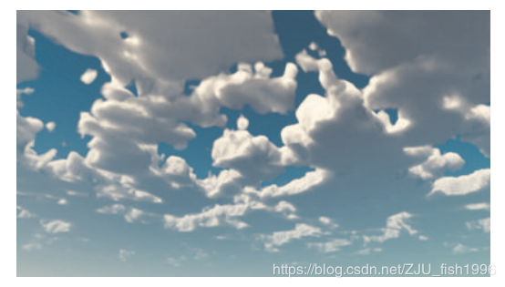

> ​    **图4.13** 低频率的基础云形状 

​    接下来，我们应用天气纹理中的云覆盖属性，以确保我们可以控制云覆盖天空的程度。此步骤涉及两个操作：

​    \1. 为了在动画化覆盖属性时使云能够真实地运动，我们使用重映射功能中的云覆盖属性来扩展前面步骤生成的基本云的形状。

​    2.为确保密度随着覆盖范围的增加而增加，我们将此结果乘以云覆盖属性。

​    用代码表达如下：

```
// Cloud coverage is stored in weather_data's red channel.


float cloud_coverage = weather_data.r;


 


// Use remap to apply the cloud coverage attribute


float base_cloud_with_coverage = Remap(base_cloud, cloud_coverage, 1.0, 0.0, 1.0);


 


// Multiply the result by the cloud coverage attribute so that


// smaller clouds are lighter and more aesthetically pleasing


base_cloud_with_coverage *= cloud_coverage;
```

​    这些步骤的结果如图4.14所示。基础云仍然是低细节的，但它开始看起来更像一个系统，而不是简单的噪声。 

​    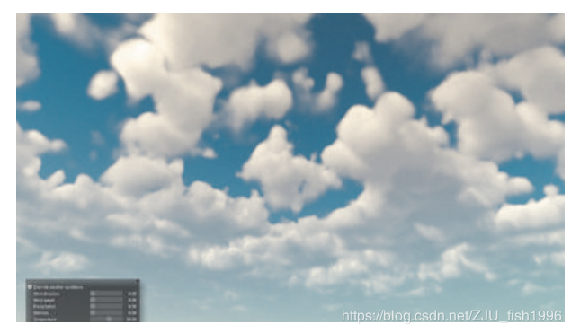

> ​    **图4.14** 应用了覆盖属性的基础云形状 

​    接下来，我们通过添加逼真的细节来完成云的计算。这些细节包括由上升的水蒸气中的不稳定性造成的小的翻滚效果，以及由大气湍流引起的细小的扭曲（见图4.15中的示例）。

​    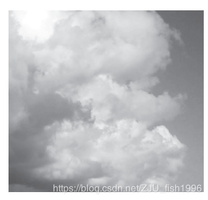

> ​    **图4.15** 由大气湍流产生的汹涌形状和细小形状的摄影作品参考

​    我们使用三个步骤模拟这些效果：

​    1.我们使用动画卷曲噪声来扭曲云底部的样本坐标。模拟使用扭曲的样本坐标对高频3D纹理进行采样时湍流的影响。

​    2.我们使用高频Worley噪声构建FBM，以便为云的边缘添加细节。

​    3.我们使用高频FBM来收缩基础云的形状。在云的底部，我们反转Worley噪声，在这个区域产生纤细的形状。与顶部的Worley噪声收缩后会产生翻滚的细节。

   以下是具体的代码实现：

```
// Add some turbulence to bottoms of clouds


p.xy += curl_noise.xy * (1.0 - height_fraction);


 


// Sample high-frequency noises.


float3 high_frequency_noises = tex3Dlod(Cloud3DNoiseTextureB, Cloud3DNoiseSamplerB,


    float4(p * 0.1, mip_level)).rgb;


 


// Build-high frequency Worley noise FBM


float high_freq_FBM = (high_frequency_noises.r * 0.625) + (high_frequency_noises.g * 0.25)


    + (high_frequency_noises.b * 0.125);


 


// Get the height_fraction for use with blending noise types over height.


float height_fraction = GetHeightFractionForPoint(p, inCloudMinMax);


 


// Transition from wispy shapes to billowy shapes over height.


float high_freq_noise_modifier = mix(high_freq_FBM,  1.0 - high_freq_FBM,


    saturate(height_fraction * 10.0));


 


// Erode the base cloud shape with the distorted high-frequency Worley noises


float final_cloud = Remap(base_cloud_with_coverage, high_freq_noise_modifier * 0.2,


    1.0, 0.0, 1.0);


 


return final_cloud;


}
```

​    这些步骤的结果如图4.16所示。这一系列操作是我们的采样器在Ray-match过程中创建cloudscapes的框架，但我们采取了额外的步骤弥补传统的基于噪声的cloudscapes解决方案中缺乏的运动感。

​    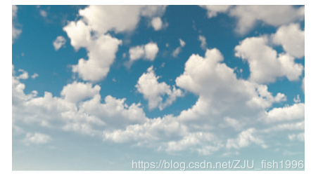

> ​    **图4.16** 最终的云形状 

​     从了模拟云从一个大气层升到另一个大气层时的剪切效应，我们将样本的位置偏移到风向上的高度。另外，两个3D纹理样本在风向上都有偏移，并且随着时间缓慢向上变化，但是速度不同。给每个噪声设定一个自己的速度可以产生一个更真实的云的运动外观。在一段时间内，云表现为向上生长。

```
// Wind settings


float3 wind_direction = float3(1.0, 0.0, 0.0);


float cloud_speed = 10.0;


 


// cloud_top offset pushes the tops of the clouds along


// this wind direction by this many units.


float cloud_top_offset = 500.0;


 


// skew in wind direction


p += height_fraction * wind_direction * cloud_top_offset;


 


// Animate clouds in wind direction and add a small upward bias to the wind direction


p += (wind_direction + float3(0.0, 0.1, 0.0)) * time * cloud_speed;
```

​    此代码必须位于CloudDensitySample()函数中的任何3D纹理样本之前。

###     结果

​    使用不同天气设置创建的一些体积cloudscapes效果如图4.17所示。

​    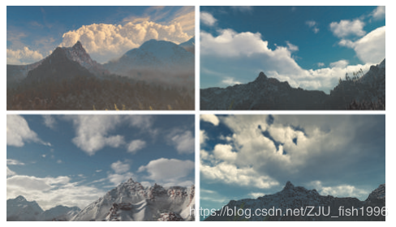

> ​    **图4.17** 一些cloudscapes效果，PS4截图。 

​    这些建模方法使得我们能够制作出许多独特的cloudscapes。当下雨信息沿着风向接近摄像机时，它会产生风暴前的效果[Schneider 15, slide 43-44]。

## 体积云光照

​    体积云光照是计算机图形学领域研究的很好的领域。不幸的是，对于游戏开发者而言，最好的结果需要大量的样本。这意味着我们必须找到一个近似模拟产生电影级质量的云时复杂而昂贵的过程。

​    特别的是，我们的方法通过近似解决了三种效应：云中的多次散射和定向照明，当我们看向太阳时的银色外观效果，以及当我们远离太阳时云的黑色边缘。图4.18显示了这三种效应的照片参考。

​     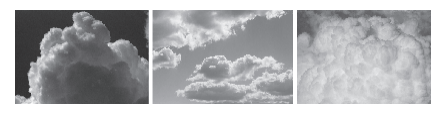

> ​     **图4.18** 定向散射（左），银色外观（中）和暗边效应（右）的摄影参考。

###     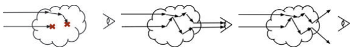

> ​    **图4.19** 云中三种光行为的示例：吸收（左），内散射（中），外散射（右）。 

###     体积散射

​    当光线进入云层时，大部分光线会消耗一定时间通过云层内水滴和冰层的折射，然后向我们的眼睛散射[Van De Hulst 57]。进入云的光子有三种可能发生的事情（参见图4.19）:

​    1.它可以被云中的水或非参与颗粒吸收，如灰尘，也就是消失或者被吸收。

​    2.它可以朝着眼睛的方向离开云，也就是内散射。

​    3.它可以朝着远离眼睛的方向离开云，也就是外散射。

​    Beer定律是近似这三种结果中每个结果概率的标准方法。

###     Beer定律

​    Beer定律模拟了光通过材料时的衰减，最初被认为是化学分析的工具（见图4.20)。

​    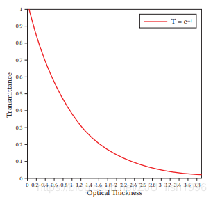

> ​    **图4.20** Beer定律：作为光学深度函数的透射率。

​    在体积的情况下，它可以用于基于光学厚度可靠地计算透射率[Werninge 13]。

​    如果我们的参与介质是非同质的，如云，我们必须使用Ray-match累积光的厚度。该模型已经广泛地用于电影视觉效果，它构成了我们照明模型的基础。

​    以下是它在代码中的实现方式：

```
light_energy = exp(-density_samples_along_light_ray);
```

###     Henyey-Greenstein相位函数

​    在云中，光散射的可能性更高[Pharr和Humphreys 10] ，因此云中会闪耀着银色（见图4.21)。

​    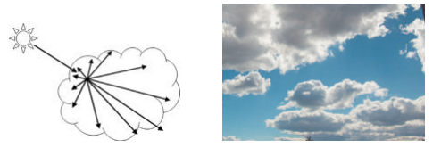

> ​     **图4.21** 云中光的前向散射图（左），以及银色外观效果的照片参考（右）

​    云中更多的光线会向前散射：

​    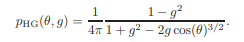 

​    以下是代码实现方式：

```
float HenyeyGreenstein(float3 inLightVector, float3 inViewVector, float inG)


{


    float cos_angle = dot(normalize(inLightVector), normalize(inViewVector));


    return ((1.0 - inG * inG) / pow((1.0 + inG * inG - 2.0 * inG * cos_angle), 3.0/2.0))


        / 4.0 * 3.1415;


}
```

​     结果如图4.22所示：

​    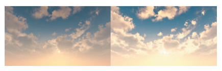

> ​    **图4.22** 没有Henyey-Greenstein相位函数的云（左）和具有Henyey-Greenstein相位函数的云（右）

###     内散射概率函数（Powdered Sugar Effect）

​     Beer定律是一种消光模型，意味着它关注的是光如何在深度上衰减。这无法近似云朝向太阳方向上散射的照明效果。当视线接近光线方向时，此效果表现为云上的暗边。在成堆的糖中也有类似的效果，这就是我们对这种效应的昵称的（糖堆效应）的来源。有关说明，请参见图4.23。

​    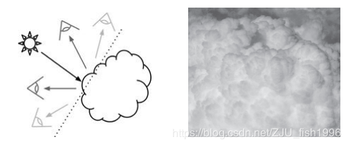

> ​     **图4.23** 显示暗边效果明显的180度视角（左）和暗边效果的照片参考（右）的图

​    这种效果在圆形、密集的云层区域中最为明显，以至于每个凸起之间的折痕看起来比凸起本身更明亮，凸起本身更接近太阳。这些结果似乎与Beer定律相违背。

​    回想一下，散射是一种效应，其中云内的光线反射直到它们变得平行，然后离开云并进入我们的眼睛。当我们观察到云的阳光照射时也会发生这种现象（见图4.24）。

​    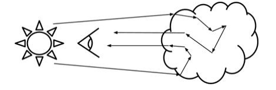

> ​    **图4.24** 散射的图示在入射光线中产生180度转弯

​     还要注意的是，由于前向散射，更多的光沿着原始光线方向向前散射。然而，必须存在相对大的光学深度才能使光子有合理的机会转动180度。而云边缘周围的路径则没有足够大的光学深度来转动光子，它们一般存在于云的内部。因此，在它离开我们的眼睛之前，Beer定律会消除大多数贡献。云中的裂缝是一个例外，它提供了进入云内部的窗口，其中存在具有相对大的光学深度的光子路径，允许光子以低密度的快捷方式逃逸，使得裂缝比周围的凸起更亮。

​    我们将这种现象表达为概率。想象一下，你正在观察云中这些凸起区域中的一个，其角度与来自你身后的太阳的一组光线相同（见图4.25)。

​    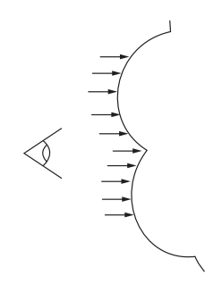

>    **图 4.25** 光击中云上的凸起。

​    如果我们在一个凸起的表面下方采样一个点并将其与其中一个裂缝的相同深度的点进行比较，则缝隙中的点则更有可能具有有利于云散射的材质（图4.26)。在概率方面，折痕应该更亮。

​    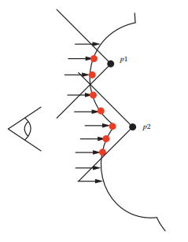

> ​    **图4.26** 图中显示了折痕具有更高的散射潜力。

​    根据这一思想，我们提出了一个新功能来解释这种影响。因为这个结果实际上与Beer定律相反，我们将其表示原函数的倒数（图4.27）。

###    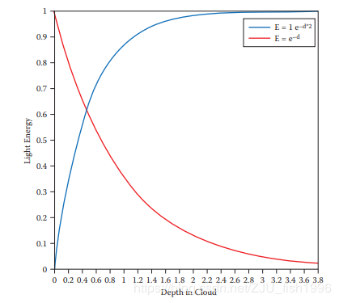

> ​    **图4.27** Beer定律和糖堆效应的近似相比

​    我们的目的只是对这种现象一个准确的近似，不需要任何额外的采样。

​    我们将这两个功能组合成一个新的功能：Beer's Powder。请注意，我们将整个结果乘以2，使其更接近原始的归一化范围（图4.28)。

​    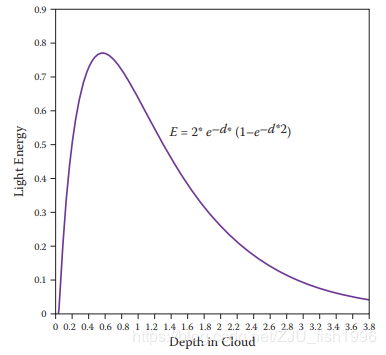

> ​    **图4.28** 结合后的Beer's-Powder函数

​    用代码表述如下：

```
powder_sugar_effect = 1.0 - exp(-light_samples * 2.0);


beers_law = exp(-light_samples);


light_energy = 2.0 * beers_law * powder_sugar_effect;
```

​    一些单独的测试用例和我们在游戏中解决方案的结果如图4.29所示。

   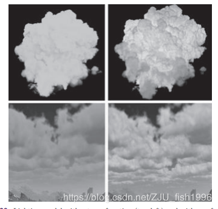

> ​    **图4.29** 未加入我们函数的照明模型（左上）和加入我们功能的照明模型（右上）。没有我们功能的游戏内结果（左下）和包含我们功能的游戏内结果（右下）。

###     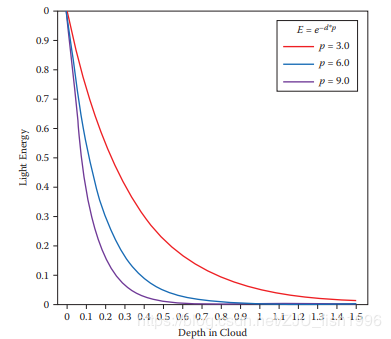

> ​    **图4.30** 使用不同吸收水平的几个结果

###      积雨云

​    我们的系统还模拟了雨云的深色。雨云比其它低层云更暗，因为水滴已经凝聚的很多，大部分光线在达到我们眼睛之前已经被吸收。

​    因此，由于我们已经知道我们正在采样的点具有降水属性，我们可以使用这一点来人为地“加厚”云材质。通过增加进入Beer's Powder函数的采样密度，可以轻松地完成这一任务。见图4.30。变量p代表降水。

​    图4.31显示了一些结果。

​    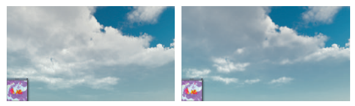

> ​    **图4.31** 具有(左)和没有(右)的雨云增加了光的吸收

###     光照模型总结

​    总之，我们的照明模型是四个部分的组合：

​    1.Beer定律（August Beer, 1852)

​    2.Henyey-Greenstein相位函数 (Henyey and Greenstein, 1941)

​    3.概率内散射函数（糖堆效应）

​    4.雨云吸收增益

​    以E为光能，d为采样密度，p为雨的吸收倍数，g为光方向的偏心率， θ为视线和光线的夹角，我们现在可以完整描述我们的光照模型：

   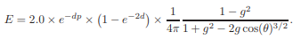

## 云的渲染

​    选择在何处对数据进行采样来构建图像，对于性能和图像质量非常重要。我们的方法是试图将昂贵的步骤限制在几个可能需要的情况下。

###     球形大气

​    使用Ray-Match渲染的第一步是确定从哪里开始执行。当观察者位于看起来“平坦”的表面（如海洋）时，地球的曲率会明显使得云层下降到地平线。这是因为地球是圆形的，而云层是球形的，而非平面的（见图4.32)。

​    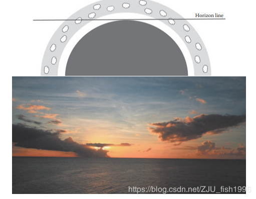

> ​    **图4.32** 球形大气层 

​     为了体现这一特征，我们的Ray-Match发生在距离地球表面1.5公里外，3.5公里厚的球壳中。我们使用球面相交测试来确定Ray-Match的起点和终点。当我们看向地平线时，光线长度明显增加，这要求我们增加样本的数量。在玩家的正上方，我们需要多达64个步骤，在地平线上我们需要多达128个步骤。我们在Ray-Mach循环中有几个优化，允许它提前退出。因此平均样本数远低于此。

###     光线行进优化

​    我们云的基本形状和更高的Worley噪声频率应用于基础云形状的边缘侵蚀。仅评估密度函数的低频部分意味着只读取一个3D纹理而不是两个，这将节省大量带宽和指令数。图4.33显示了使用“廉价”的样本通过空气的步骤，并在接近云的时候切换回昂贵的样本。一旦几个样本返回0，我们将回到“廉价”样本。

​    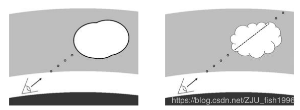

> ​    **图4.33** 云边界检测(左）和云边界内的完整样本（右）

​     为了在代码中实现这一点，我们从cloud_test值为0处开始，并使用我们采样器的布尔值true在循环中累积密度。只要cloud_test的值为0.0，我们就继续寻找云的边界。一旦我们得到非零值，我们就会先停下Ray-Match累积，并切换到完整的云密度样本。在连续六个完整的云密度样本返回0.0之后，我们切换回云边界搜索。这些步骤确保我们退出云边界的时候不会触发额外的工作。

```
float density = 0.0;


float cloud_test = 0.0;


int zero_density_sample_count = 0;


 


// Start the main ray-match loop


for(int i=0; i<sample_count; i++)


{


    // cloud_test starts as zero so we always evaluate the second


    // case from the beginning


    if(cloud_test > 0.0)


    {


        // Sample density the expensive way by setting the last


        // parameter to false. indicating a full sample.


        float sampled_density = SampleCloudDensity(p, weather_data, mip_level, false);


 


        // If we just samples a zero, increment the counter.


        if(sampled_density == 0.0)


        {


            zero_density_sample_count++;


        }


 


        // If we are doing an expensive sample that is still potentially


        // in the cloud.


        if(zero_density_sample_count != 6)


        {


            density += sampled_density;


            p += step;


        }


 


        // If not, then set cloud_test to zero so that we go back to the cheap


        // sample case.


        else


        {


            cloud_test = 0.0;


            zero_density_sample_count = 0;


        }


    }


    else


    {


        // Sample density the cheap way, only using the low-frequency


        // noise


        cloud_test = SampleCloudDensity(p, weather_data, mip_level, true);


    


        if(cloud_test == 0.0)


        {


            p += step;


        }


    }


}
```

​    在最优的情况下，我们在空旷的天空行进，此算法将3D纹理调用的数量减少了一半。

​    为了计算光照，需要在每个Ray-Match步骤中在光前需要更多的样本。在光照模型中使用这些样本的总和，然后对于每个视线的光线进行Ray-match步骤，沿着视线的当前密度总和进行衰减。图4.34说明了Ray-Match中基本光样本的整合。

​    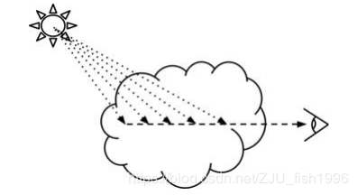

> ​     **图4.34** 每个视线的光线行进步骤

​    因为我们的目标是支持在许多其它GPU密集型任务的游戏引擎中使用，所以我们每个Ray-Match步骤限制为不超过六个样本。

​    减少光样本数量的一种方法是仅在光线行进到云内的时候才执行它们。这是一个重要的优化，因为光采样的成本极高。通过此优化，视觉效果没有任何变化。

```
// ...


 


density += sampled_density;


if(sampled_density != 0.0)


{


    // SampleCloudDensityAlongRay just walks in the given


    // direction from the start point and takes X number


    // of lighting samples


    density_along_light_ray = SampleCloudDensityAlongRay(p);


}


p += step;


 


// ...
```

###     锥形采样照明

​     获取太阳照射量的一个非常直观的方法是查询点与太阳之间的云的透射率。然而，云中任何点处的光在光源方向上受到周围区域中光的影响很大。然而，云中任何点处的光在光源方向上受到周围区域中光的影响很大。可以把它想象成一个光能的漏斗，最终它将在我们的样本位置上达到顶峰。为了确保我们的光照模型的Beer定律部分受到这种影响，我们将六个光样本放在一个向光源扩展的椎体中，从而通过包含云的相邻区域来加权Beer定律的衰减函数，见图4.35。

​    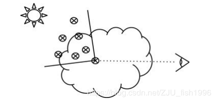

> ​    **图4.35** 用于光线行进样本的锥形样本区域

​    由于样本数量比较少，会出现带状伪影。锥形采样有助于减少条带，但为了进一步平滑，我们以较低的mip级别对密度进行采样。

​     为了计算椎体的偏移，我们在-(1,1,1)和+(1,1,1)之间使用了六个噪声结果的核心，并随着我们离开样本的位置逐渐增加其幅度。如果沿着视线行进的累积密度已经超过其光贡献可以更一般化的阈值（我们使用0.3），我们将样本切换到低细节模式以进一步优化Ray-Match。在此阈值处几乎没有视觉差异。

```
static float3 noise_kernel[] = 


{


    some noise vectors


}


 


// How wide to make the cone.


float cone_spread_multplier = length(light_step);


 


// A function to gather density in a cone for use with


// lighting clouds.


float SampleCloudDensityAlongCone(p, ray_direction)


{


    float density_along_cone = 0.0;


 


    // Lighting ray-match loop.


    for(int i = 0;i <=6; i++)


    {


        // Add the current step offset to the sample position


        p += light_step + (cone_spread_multiplier * noise_kernel[i] * float(i));


 


        if(density_along_view_cone < 0.3)


        {


            // Sample cloud density the expensive way.


            density_along_cone += SampleCloudDensity(p, weather_data,


                mip_level + 1, false);


        } 


        else


        {


            // Sample cloud density the cheap way, using only


            // one level of noise.


            density_along_cone += SampleCloudDensity(p, weather_data,


                mip_level + 1, true);


        }


    }


}
```

​    另外，为了考虑从远处的云投射到我们正在计算光照的云上的阴影，我们在距离锥长度三倍的距离处采样一个长距离样本（见图4.36）

​    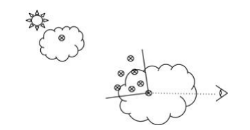

> ​    **图4.36** 长距离光采样和锥形采样的结合

###     高海拔云

​     我们的方法只能在体积上渲染低层云，高层云使用uv动画表示。但是，为了将它们与体积云集成，它们将在Ray-Match结束时进行采样。对于具有三个通道的5122纹理，此纹理读取成本可以忽略不计。我们根据我们天气系统中不同的风向对它们进行动画处理，以模拟不同云层中的不同风向（见图4.37）

​    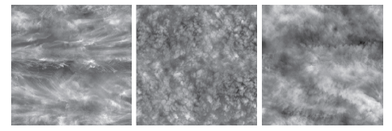

> ​    **图4.37** 使用了几个alto和cirrus的云纹理，而非使用Ray-Match

###     结果

​    图4.38显示了一系列光照结果，表现了一天不中断变化的时间。

​    

> ​    **图4.38** 从PS4上截图的cloudscape时间流逝效果。

## 结论和未来的工作

​     这种方法可以在一天中的所有时间生成逼真的、不断变化的cloudscapes，并完全取代我们基于资源的云方法。这也意味着我们整个天空的内存使用仅限于几个纹理的成本，总共只有20MB而非数百兆，用于多个天空盒和公告牌，适用于不同的天气条件和一天中的多个时间。GPU的性能大约为20毫秒，但当我们使用时间重投影构建图像时，该数字会减少到2毫秒。

​    散射概率函数基于思想实验，但我们还在进一步研究。我们计划使用Magnus Wrenninge使用的暴力方法，它将自然地产生暗边，沿光线收集数据点并设计出更精确地拟合这些数据的函数。