## [游戏角色写实*头发*制作(一): 贴图](https://zhuanlan.zhihu.com/p/43000575)

作者：大星星

UE4的hair shading model采用PBR计算，所以只需要4张Mask贴图通道，不再需要美术手绘颜色信息。这四张贴图通道分别是Alpha, Depth, ID,  Root，作用分别是:

- Alpha通道用作透贴
- Depth通道用作提取头发先后遮挡关系信息
- ID通道用来区分不同的发丝属性
- Root通道用来计算发根到发梢的渐变效果

所有的贴图通道都是通过工具生成，工具包括Maya, Xgen, XNormal, 以及自己用Python开发的两个Maya Tool。具体步骤如下:

- Maya里新建所需的XGen Hair Description，数量依据具体效果确定。每个Description生成造型疏密不同的发束。

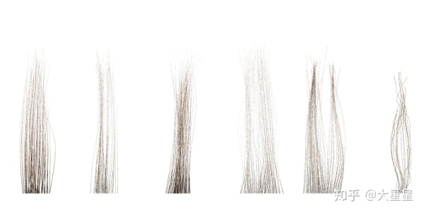Xgen Hair

- Pipeline中有部分工作，现有的工具无法完成，需要自己开发两个Python工具。第一个工具是Mesh生成工具。因为XGen导出的Curve不能渲染，必须通过工具转换成所需要的可渲染烘培发丝几何模型。第二个工具是随机选择工具。为了生成ID Map，发丝的几何模型必须随机分成N组，每一组指定不同的ID。

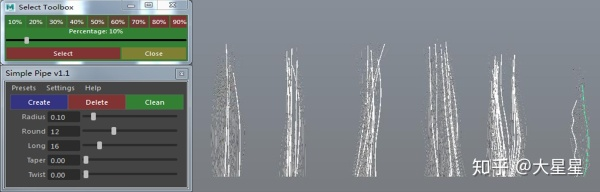Python工具和随机选择效果

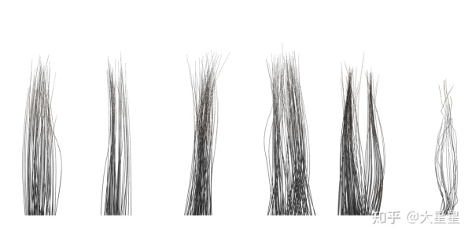Python工具生成的发丝Mesh

- 准备好XNormal所需的Bake Texture。Bake Texture的目的是生成Alpha，Root，ID。Bake Texture分别是

- - Alpha：一张白色贴图。
  - Root：一张黑色到白色的渐变贴图
  - ID：根据分组准备N张不同灰度的纯色贴图。

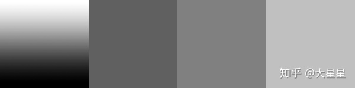渐变和ID纯色贴图

- 最后一步，XNormal烘培输出贴图。

- - 把分好组的发丝几何模型分别High Definition Meshes.
  - 导出两个Plane作为Low Definition Meshes和External Cage File.
  - 指定白色贴图到Base texture to bake, 烘焙Alpha通道.

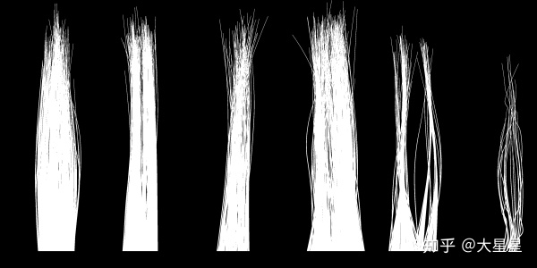Alpha Map

- - 指定渐变贴图到Base texture to bake, 烘焙Root通道.

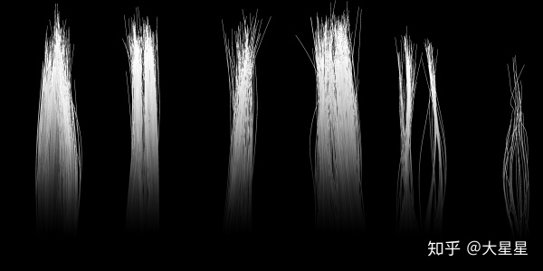Root Map

- - XNormal里烘培height map作为Depth通道.

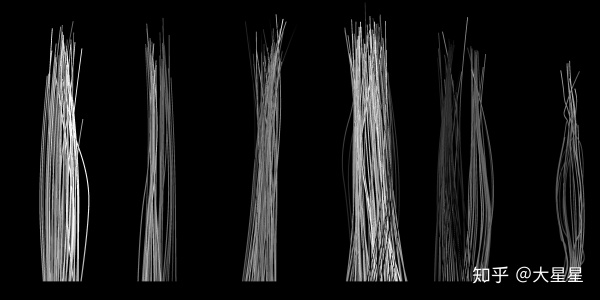Depth Map

- - 指定不同灰度的纯色贴图到Base texture to bake, 烘焙ID通道.

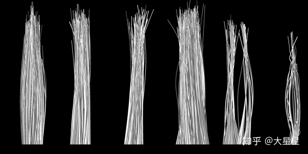ID Map

## 游戏角色写实*头发*制作(一): 材质

写实头发材质部分，也就是讲下Shading Model实现. 

Kajiya-Kay[1989]关于头发的Shading Model沿用至今，已经快30年。Kajiya模型的优点是：

1. 算法简单，便于理解，计算量小
2. Primary Specular的性价比高，效果明显，方便美术使用

但Kajiya模型又被称作Painter's Illusion,  难以获取真实的头发材质效果，其不足在于:

1. Kajiya的模型过于简单，只简单模拟了Primary Speucular, 没有处理Light Transport的其他情况，比如光线在头发纤维内的传播过程。
2. Kajiya假设头发纤维是光滑的圆柱体，而电子显微镜下显示头发纤维是由表面粗糙的鳞片层叠形成的不规则几何体，鳞片之下还有色素髓质。鳞片和髓质对光线的传播，染色和衰减吸收作用，都没有在Kajiya模型里体现。

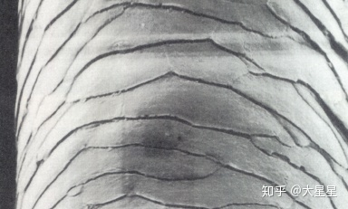头发纤维表面结构

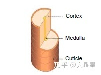头发纤维横截面

因为以上的问题，导致Kajiya Model是non-physically based。 经验值参数导致光照能量不守恒。弊端是在Artist在特定的光照情况调出来的头发效果，光照发生变化之后，可能会出现明显的瑕疵，很多时候需要Artist把头发的颜色预先画在贴图上。

针对Kajiya模型的不足，Marschner[2003]提出了一个新的模型，其特点:

- Light Transport更完善，不仅有Primary Specular(R mode) ,  还包括光线在头发纤维髓质内折射后再次出射Transmission(TT mode), 光线在头发纤维髓质内多次反射后再次出射Secondary Specular(TRT mode)，TRRT, GLINT等

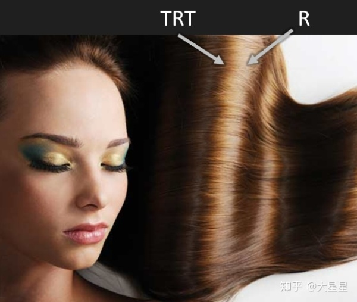R TRT Mode

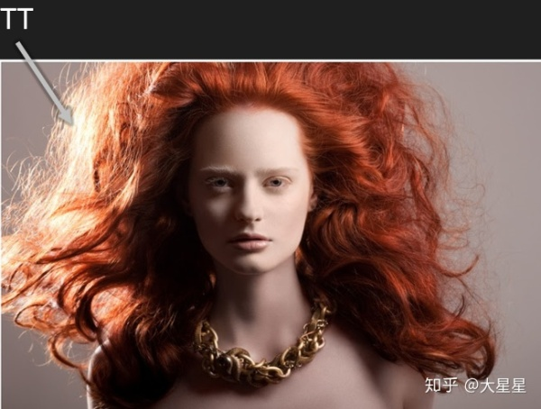TT Mode

- Marschner模型考虑到头发纤维的微观结构，纤维外层的鳞片会对R, TT, TRT的路径产生影响，光线在纤维内部的传播也会受到菲尼尔，染色，吸收衰减的影响。另外，头发纤维的横截面是椭圆，这个结构的设定可以通过微分方程的奇点计算出头发Glint效果。

Marschner Hair Model

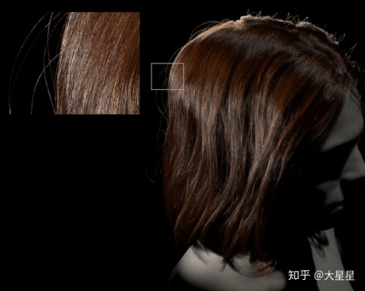Glint

这个模型基本模拟了所有较明显的头发光照效果，因此在CG和游戏领域被广泛采用。

下面以Marschner. 2002. Light Scattering from Human Hair Fibers的论文以及UE4.20的实现来详细介绍Marschner Hair Model的近似解析解。

假设我们要求解的头发纤维散射函数为 S(φi,θi,φr,θr)。通过几何推导和实测数据验证，S有三个特性: 

1. 光线在头发纤维中不管经历多少次反射和折射，入射角和出射角的经度是一样的。
2. R， TT， TRT mode分布在圆锥面上，圆锥面的母线和中轴线的夹角等于入射经线角(即入射光线和法线平面投影之间的夹角)。但受到头发纤维鳞片的作用，R会向发根倾斜一定的角度，TT, TRT会向发梢倾斜一定角度。
3. S函数中经度角θ和方位角φ的依赖关系可以通过多项式分解提取出独立的M(θ)和N(φ)

因此得到解析解的形式：

S(φi,θi,φr,θr) = ∑pM(θh) * N(φ)* A(p), p∈{R, TT, TRT, TRRT, GLINT........}

M为θ分布函数，N为φ分布函数，A = Absorption * Fresnel

(UE4里只考虑前三项的影响，且只处理圆形横截面)

- M项。如果头发纤维是光滑的，那么M项应该是δ distribution。而实际上头发纤维的鳞片外层是粗糙的，所以这里用了gaussian distribution。其中gaussian distribution的标准差对应的是纤维粗糙度，期望值对应鳞片外层会对光线产生的偏移。Digital Weta在后来的实验中发现M项如果能部分依赖φ， 能更准确的计算backlit。由于对φ的依赖计算复杂，UE4只在最明显的R mode使用了这个办法, TT, TRT仍然使用gaussian distribution。

M Component in R Mode

- N项。R的反射分布使用Kajiya推导的解析解N = 1/4 * cos(φ/2)。Pixar. 2013. A Data-Driven Light Scattering Model for Hair发现柯西分布和logistic分布比高斯分布更利于采样计算，所以UE4里尝试用logistic分布估算N项: Ntt = exp(-3.65 * cosφ - 3.98), Ntrt=exp（17 * cosφ - 16.78） 

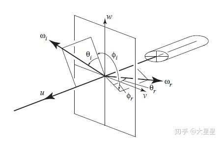Scattering Geometry (a)

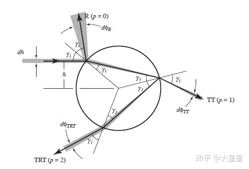Scatttering Geometry (b)

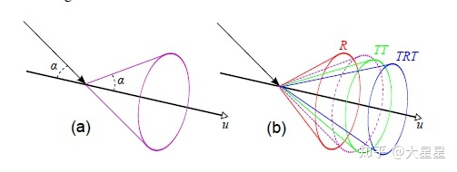R， TT，TRT Cone

- A项。Fresnel是Schlick近似求解。R只有一次Fresnel计算， TT有两次， TRT是三次。Absorption的关键是计算入射光线到纤维中心的距离（Scattering Geometry b）根据光线在头发纤维横截面的传播过程可以推导出等式：φ(p, h)=2pγt - 2γi + pπ 。φ是入射光线和出射光线的方位角之差。求导以后可以到得TT, TRT的h解。TT的解有一个， TRT的解有一个或者三个。其中htt = sign(φ)cos(φ/2)/√(1 + a*a - 2 * a *sign(φ)sign(φ/2))，htrt没有解析解。UE4对htt， htrt做了简化。htt≈(1 + a * (0.6 - 0.8 * cosφ)) * cos(φ/2). 而TRT的lobe只用一个，用√3/2估算。通过h的值便可以得到光线在纤维内部的路径，从而得出absorption项，当然也是近似值。Ttt = pow(color, 0.5 *√（1 - h*h*a*a） /2 *cos(θd)), Ttrt=pow(color, 0.8/cos(θd))

最后还有scattering diffuse. 这一项的physically based计算非常复杂，UE4对这部分做了最简单的处理，参考了Kajiaya的diffuse term，同时用经验值和视线矫正过的NoL做了线性插值。UE4 Hair Shading Model作者也认为这部分的优化空间很大。Marschner.2008.Efficient Multiple Scattering in Hair Using Spherical Harmonics是一个很好的参考改进方案。

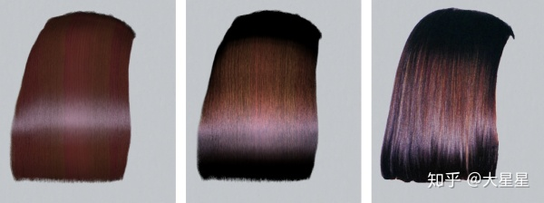左：Kajiya       中： Marschner         右： 实拍效果