作者：Chain


目录

[Kajiya-Kay Model头发效果研究笔记	1](https://zhuanlan.zhihu.com/write#_Toc519534064)

[基础原理	2](https://zhuanlan.zhihu.com/write#_Toc519534065)

[两个主要的函数	3](https://zhuanlan.zhihu.com/write#_Toc519534066)

[顶点片元着色器代码实现：	5](https://zhuanlan.zhihu.com/write#_Toc519534067)

[Matcap shader里的效果运用：	9](https://zhuanlan.zhihu.com/write#_Toc519534068)

[材质使用和贴图制作	14](https://zhuanlan.zhihu.com/write#_Toc519534069)

[卡通效果（硬边的高光）研究	18](https://zhuanlan.zhihu.com/write#_Toc519534070)

[优缺点	19](https://zhuanlan.zhihu.com/write#_Toc519534071)


## 基础原理

参考链接：

[https://blog.csdn.net/noahzuo/article/details/51162472](https://link.zhihu.com/?target=https%3A//blog.csdn.net/noahzuo/article/details/51162472)

​     1.使用发丝的切线，而不是这一点的法线来进行计算。

​     2.假设法线被包含在切线和视角构成的平面内。

公式:


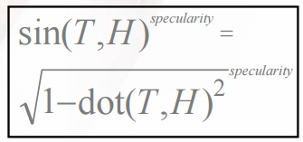

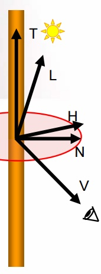

​    \3. 沿着发丝方向偏移的高光 ——我们需要将切线沿着法线方向进行一个偏移：


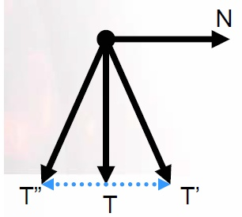


用来表示偏移量的灰度图：


\4. 设置两层高光，主要是为了控制高光的梯度感，增加丰富度。保持两层高光部分叠加，效果会比较好。

## 两个主要的函数

偏移量计算函数：

```text
float3 ShiftTangent(float3 T, float3 N, float shift)
{
    float3 shiftedT = T + (shift * N);
    return normalize(shiftedT);
}
```


发丝高光计算函数：

```text
float StrandSpecular(float3 T, float3 V, float L, float exponent)
{
    float3 H = normalize(L + V);
    float dotTH = dot(T, H);
    float sinTH = sqrt(1.0 - dotTH*dotTH);
    float dirAtten = smoothstep(-1.0, 0.0, dot(T, H));

    return dirAtten * pow(sinTH, exponent);
}
```

关于dirAtten的解释链接：

[https://stackoverflow.com/questions/33369449/what-does-diratten-value-mean-in-kajiya-kay-model](https://link.zhihu.com/?target=https%3A//stackoverflow.com/questions/33369449/what-does-diratten-value-mean-in-kajiya-kay-model)

顶点片元着色器代码实现：

在这段代码里增加了法线的影响。

```text
Shader "Custom/ScheuermannHair"
{
	Properties
	{
		_MainTex ("Sprite Texture", 2D) = "white" {}
		_SpecColor1 ("SpecColor1", Color) = (1,1,1,1)		
		_SpecColor2 ("SpecColor2", Color) = (1,1,1,1)
		_Normalmap("Normalmap", 2D) = "bump" {}
		_BumpSize("BumpSize",Range(0,3))=1
		_SpecularTex("Specular(R)Spec shift(G)SpecMask(B)", 2D) = "white" {}
		_shiftValue("shift", Float) = 0.5
		_shiftSpec2("shift2",Range(-0.5,0.5))=0.5
		_Gloss("Gloss", Range(0,100)) = 1
		_Specular("Specular", Range( 0 , 1)) = 0
	}
 
	SubShader
	{
		Tags { "RenderType"="Opaque" }
		LOD 100
		Cull Off		

		Pass
		{   
		    Tags { "LightMode"="ForwardBase" }
			CGPROGRAM
			#pragma multi_compile_fwdbase	
			#pragma target 3.0 
			#pragma vertex vert
			#pragma fragment frag
			#include "UnityCG.cginc"
			#include "Lighting.cginc"
			#include "AutoLight.cginc"


			struct appdata
			{
				float4 vertex : POSITION;
				float2 texcoord : TEXCOORD0;
				float4 texcoord1 : TEXCOORD1;
				float4 tangent : TANGENT;
				float3 normal : NORMAL;				
				UNITY_VERTEX_INPUT_INSTANCE_ID
			};
 
			struct v2f
			{
				float4 pos : SV_POSITION;
				float2 uv : TEXCOORD0;
 
				float3 worldTangent : TEXCOORD1;
				float3 worldNormal : TEXCOORD2;				
				float3 worldPos : TEXCOORD3;	
				float3 worldBitangent:TEXCOORD4;

				UNITY_VERTEX_OUTPUT_STEREO
			};

			uniform sampler2D _MainTex;
 
			uniform fixed4 _SpecColor1;
			uniform fixed4 _SpecColor2;
			uniform sampler2D _Normalmap;
			uniform sampler2D _SpecularTex;
			uniform float _shiftValue;
			uniform float _shiftSpec2;
			uniform float _Gloss;
			uniform float _Specular;
			uniform float4 _MainTex_ST;
			uniform float _BumpSize;

			float3 shiftTangent( float3 T , float3 N , float Shift )
			{
				half3 ShiftT =T+ N *Shift;
				return normalize(ShiftT);
			}
			//用切线计算高光的函数
			half StrandSpecular( half3 T , half3 V , half3 L , half Exponent )
			{
				half3 H =normalize(L+V);
				float dotTH= dot(T,H);
				float sinTH=sqrt(1-dotTH*dotTH);
				float dirAtten =smoothstep(-1,0,dotTH);
				return dirAtten*pow(sinTH,Exponent);
			}
 
 
			v2f vert ( appdata v )
			{
				v2f o;
				UNITY_SETUP_INSTANCE_ID(v);
				UNITY_INITIALIZE_VERTEX_OUTPUT_STEREO(o);

				o.worldTangent = UnityObjectToWorldDir(v.tangent);
				o.worldNormal = UnityObjectToWorldNormal(v.normal);
				o.worldPos = mul(unity_ObjectToWorld, v.vertex).xyz;					
				o.worldBitangent = cross( o.worldNormal,o.worldTangent );
 

				o.uv.xy = TRANSFORM_TEX(v.texcoord,_MainTex);				
				o.pos = UnityObjectToClipPos(v.vertex);
				return o;
			}
 
			fixed4 frag (v2f i ) : SV_Target
			{			
				fixed4 albedo = tex2D( _MainTex, i.uv );
				float4 spectex = tex2D( _SpecularTex, i.uv);
 
				float3 TtoW0 = float3( i.worldTangent.x, i.worldBitangent.x, i.worldNormal.x);
				float3 TtoW1 = float3( i.worldTangent.y, i.worldBitangent.y, i.worldNormal.y);
				float3 TtoW2 = float3( i.worldTangent.z, i.worldBitangent.z, i.worldNormal.z);
				//获取法线贴图处理后的世界法线，增加法线的影响
				float3 normal = UnpackNormal( tex2D( _Normalmap, i.uv ) );		
				normal.xy*=_BumpSize;
				normal.z = sqrt(1.0- saturate(dot(normal.xy ,normal.xy)));
 
				float3 Wnormal = float3 (dot(TtoW0,normal),dot(TtoW1,normal),dot(TtoW2,normal));
				Wnormal= normalize(Wnormal);
 
				float3 tan= - normalize(cross( Wnormal , i.worldTangent ));	

				float Shift1 = spectex.g - 0.5 + _shiftValue ;
				float shift2 = spectex.g - 0.5 + _shiftValue - _shiftSpec2 ;

				float3 T1 = shiftTangent( tan , Wnormal , Shift1);
				float3 T2 = shiftTangent(tan , Wnormal , shift2);
				float3 V = normalize(_WorldSpaceCameraPos.xyz - i.worldPos.xyz);
				float3 L = normalize(_WorldSpaceLightPos0.xyz);

				float NdotL =saturate(dot(Wnormal,L));
				float3 diff =saturate(lerp(0.25,1,NdotL));

				float3 spec = StrandSpecular( T1 , V , L ,_Gloss )* _SpecColor1;
				spec = spec + StrandSpecular( T2 , V , L ,_Gloss )* _SpecColor2 * spectex.b  *_Specular;					
 
				fixed4 col;
				col.rgb =  albedo.rgb *( diff+spec)*NdotL ;
				col.a = albedo.a;
				return col;
			}
			ENDCG
		}
	}
}
```


## Matcap shader里的效果运用：

1.修改了光的方向，假设灯光固定为垂直上方：float4 (0,1,0,0)，也可以通过其他方式来改变这个向量方向来获取灯光方向。

2.将第二层高光的偏移范围缩小。

3.增加了平滑偏移的功能，使之可以调节。

代码如下：

```text
Shader "Meitu/Matcap_ScheuermannHair"
{
	Properties {
		_Color ("Main Color", Color) = (1,1,1,1)
		_Hue ("Hue", Range(0,359)) = 0
		_Saturation ("Saturation", Range(0,3)) = 1
		_Value ("Value",Range(0,3)) = 1
		_MainTex("Main Tex", 2D) = "white" {}
		_BumpMap ("Bumpmap (RGB)", 2D) = "bump" {}
		_BumpValue ("BumpValue", Range(0,10)) = 1
		_MatCap ("MatCapDiffuse (RGB)", 2D) = "white" {}
		_SpecularTex("Specular(R)Spec shift(G)SpecMask(B)", 2D) = "white" {}
		_AnisoSpecular ("SpecuStrengh", Range(0,1)) = 0.1	
		_Gloss("Gloss", Range(0,1)) = 1
		_SpecColor ("SpecColor", Color) = (1,1,1,1)	
		_SpecColor2 ("SpecColor2", Color) = (1,1,1,1)		
		_SpecShift("shift", Range(-2,2)) = 0.5
		_SpecShift2("shift2", Range(-0.5,0.5)) = 0.5			
		_flatshift("FlatShift", Range(0,1)) = 1	
 
 
	}
 
	Subshader {
		Tags { "RenderType"="Opaque" }
 
		Pass {
			Name "BASE"
			Tags { "LightMode" = "Always" }
 
			CGPROGRAM
				#pragma vertex vert
				#pragma fragment frag
				#pragma fragmentoption ARB_fog_exp2
				#pragma fragmentoption ARB_precision_hint_fastest
				#include "UnityCG.cginc"
 
				struct v2f { 
					float4 pos : SV_POSITION;
					float2	uv : TEXCOORD0;
					float3	TtoV0 : TEXCOORD1;
					float3	TtoV1 : TEXCOORD2;
					float3 worldTangent : TEXCOORD3;
				    float3 worldNormal : TEXCOORD4;				
				    float3 worldPos : TEXCOORD5;	

				};

				uniform fixed4 _Color;
				uniform float4 _MainTex_ST;				
				uniform sampler2D _BumpMap;
				uniform sampler2D _MatCap;
				uniform sampler2D _MainTex;
				uniform sampler2D _SpecularTex;
				uniform float _SpecShift;
				uniform float _SpecShift2;
				uniform fixed _flatshift;
				uniform fixed4 _SpecColor;		
				uniform fixed4 _SpecColor2;
			    uniform float _Gloss;
				uniform fixed _BumpValue;
				uniform fixed _Hue;
				uniform fixed _Saturation;
				uniform fixed _Value;
				uniform fixed _AnisoSpecular;
;


			//偏移函数
			float3 shiftTangent( float3 T , float3 N , float Shift )
			{
				half3 ShiftT =T+ N * Shift;
				return normalize(ShiftT);
			}
			//高光计算函数
			half StrandSpecular( float3 T ,float3 V,float3 L , float Exponent )
			{
			    float3 H =normalize(L+V);
				float dotTH= dot(T,H);
				float sinTH=sqrt(1-dotTH*dotTH);
				float dirAtten =smoothstep(-1,0,dotTH);
				return dirAtten*pow(sinTH,Exponent);
			}
 
 
				v2f vert (appdata_tan v)
				{
					v2f o;
					o.pos = UnityObjectToClipPos (v.vertex);
					o.uv.xy = TRANSFORM_TEX(v.texcoord,_MainTex);

					o.worldTangent = UnityObjectToWorldDir(v.tangent);
				    o.worldNormal = UnityObjectToWorldNormal(v.normal);
				    o.worldPos = mul(unity_ObjectToWorld, v.vertex).xyz;		
 
					TANGENT_SPACE_ROTATION;
					o.TtoV0 = normalize(mul(rotation, UNITY_MATRIX_IT_MV[0].xyz));
					o.TtoV1 = normalize(mul(rotation, UNITY_MATRIX_IT_MV[1].xyz));
					return o;
				}
 
			   //色彩空间转换函数
				float3 HSVToRGB( float3 c )
			   {
					float4 K = float4( 1.0, 2.0 / 3.0, 1.0 / 3.0, 3.0 );
					float3 p = abs( frac( c.xxx + K.xyz ) * 6.0 - K.www );
					return c.z * lerp( K.xxx, saturate( p - K.xxx ), c.y );
			   }
 
			   float3 RGBToHSV(float3 c)
			   {
					float4 K = float4(0.0, -1.0 / 3.0, 2.0 / 3.0, -1.0);
					float4 p = lerp( float4( c.bg, K.wz ), float4( c.gb, K.xy ), step( c.b, c.g ) );
					float4 q = lerp( float4( p.xyw, c.r ), float4( c.r, p.yzx ), step( p.x, c.r ) );
					float d = q.x - min( q.w, q.y );
					float e = 1.0e-10;
					return float3( abs(q.z + (q.w - q.y) / (6.0 * d + e)), d / (q.x + e), q.x);
			   }
 
				float4 frag (v2f i) : COLOR
				{
					fixed4 c = tex2D(_MainTex, i.uv.xy);					
				    fixed4 spectex = tex2D( _SpecularTex, i.uv);
					fixed4 c1 =c;
					fixed3 c_hsv = RGBToHSV(c.rgb);
					c_hsv.x += _Hue/359;
					c_hsv.y *= _Saturation;
					c_hsv.z *= _Value;
					c.rgb = HSVToRGB(c_hsv);

					float3 normal = UnpackNormal(tex2D(_BumpMap, i.uv.xy));
					normal.xy *= _BumpValue;
					normal.z = sqrt(1.0- saturate(dot(normal.xy ,normal.xy)));
					normal = normalize(normal);
					half2 vn;
					vn.x = dot(i.TtoV0, normal);
					vn.y = dot(i.TtoV1, normal);
					fixed4 matcapLookup = tex2D(_MatCap, vn*0.495 + 0.505) * _Color;					
					matcapLookup.a = 1;
 
					float3 worldBitangent = cross(i.worldNormal,i.worldTangent);
					float3 TtoW0 = float3( i.worldTangent.x, worldBitangent.x, i.worldNormal.x);
				    float3 TtoW1 = float3( i.worldTangent.y, worldBitangent.y, i.worldNormal.y);
				    float3 TtoW2 = float3( i.worldTangent.z, worldBitangent.z, i.worldNormal.z);
					float3 Wnormal = float3 (dot(TtoW0,normal),dot(TtoW1,normal),dot(TtoW2,normal));
				           Wnormal= normalize(Wnormal);
 
					float3 tan= - normalize(cross( Wnormal , i.worldTangent ));
//计算高光偏移量
					float Shift1 = (spectex.g - 0.5)*_flatshift + _SpecShift;
				    float shift2 = (spectex.g - 0.5)*_flatshift + _SpecShift+_SpecShift2;
				    float3 T1 = shiftTangent( tan , Wnormal , Shift1);
				    float3 T2 = shiftTangent( tan , Wnormal , shift2);
 
				    float3 V = normalize(UnityWorldSpaceViewDir(i.worldPos));
					float3 L = float4 (0,1,0,0);				
					float gloss= _Gloss*100;
				    float3 spec1 =StrandSpecular(T1,V,L,gloss)*_SpecColor * _AnisoSpecular * spectex.b ;
					float3 spec2 = StrandSpecular(T2,V,L,gloss)*_SpecColor2 * spectex.b  *_AnisoSpecular * 0.6;
					float3 spec = spec1+spec2;


					fixed4 finalColor;
//高光乘以采样matcap的R通道，相当于乘以NdotL，用于解决暗部高光过亮的问题
					finalColor.rgb = c.rgb * matcapLookup.rgb+ matcapLookup.r * spec;
					finalColor.a = c.a * matcapLookup.a;					
					return finalColor;
				}
			ENDCG
		}
	}
}
```

材质使用和贴图制作

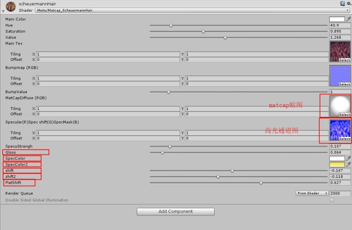

MatCapDiffuse——matcap贴图，用来生成立体感

Specular(R)Spec shift(G)SpecMask(B) —— R，G，B通道分别是高光强度控制，高光偏移控制，高光遮罩


Hue,Saturation,Value ——用于头发的变色调节

Gloss —— 用来控制高光的范围，相当于max材质球的Gloss参数

SpecColor ——用来控制第一层高光的颜色

SpecColor2 ——用来控制第二层高光的颜色

shift  —— 用来控制第一层高光的偏移量

shift2 —— 用来控制第二层高光的偏移量，因为代码里面是在第一层高光的基础上进行偏移，所以shift2的数值比较小

flatshift —— 用于弱化贴图通道的偏移量，使高光的扭曲减小。


**效果的重点在于高光贴图的制作**

**R通道**  高光强度的控制，根据头发的凹凸来制作高光贴图，根据不同需求的效果，调整高光贴图的制作方式，比如将发根和发尾的高光弱化


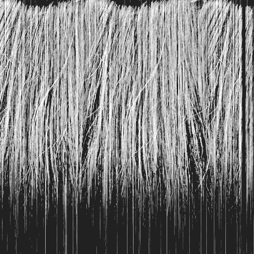

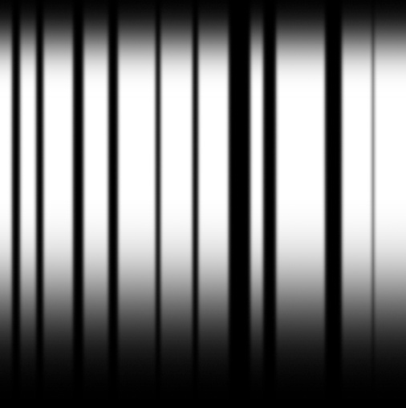


**G通道**  高光偏移的控制，需要偏移根据发丝的走向做做出深浅的变化


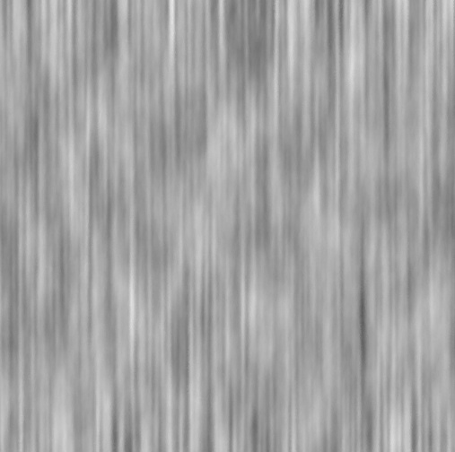

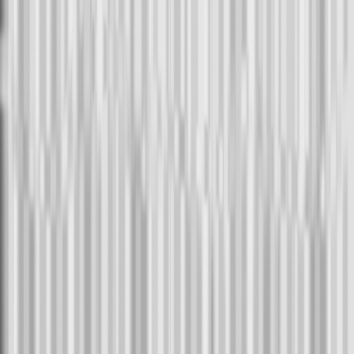


**B通道** 高光的输出，黑色部分没有高光，可以增加噪点来控制毛发的粗糙度


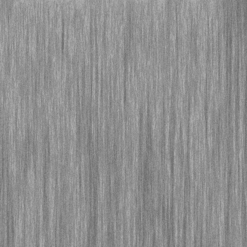


以下是使用上面两组图出来的不同效果：

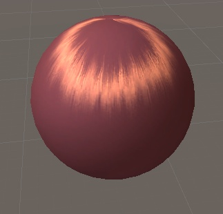


**不同贴图和参数调节的效果：**


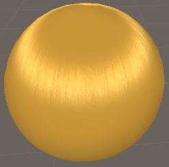

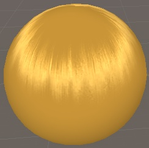


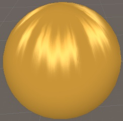

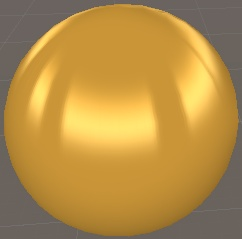

使用此方法制作的效果，左1和左2与原matcap头发效果的对比


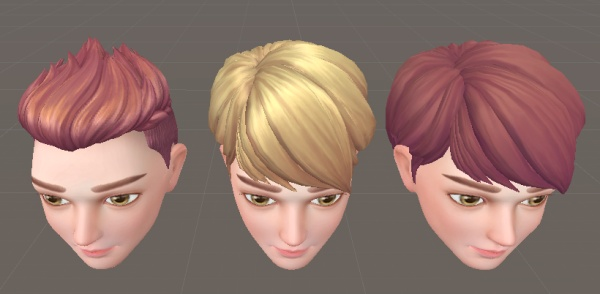

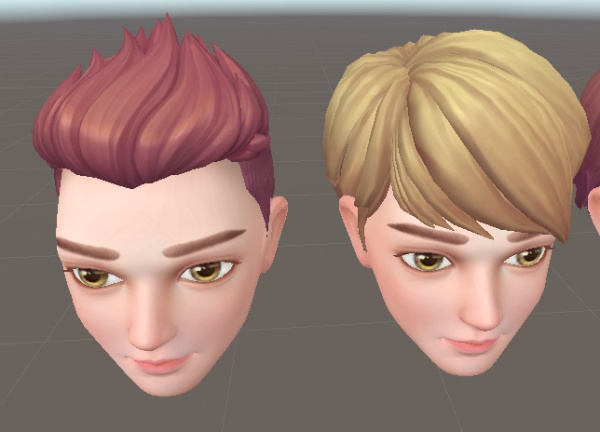

## **卡通效果（硬边的高光）研究**

将高光的计算函数修改一下

//硬边高光计算，只返回0和1

```text
				half StrandSpecular( float3 T ,float3 V,float3 L , float Exponent )
			{
			    float3 H =normalize(L+V);
				float dotTH= dot(T,H);
				float sinTH=sqrt(1-dotTH*dotTH);		
				return step(0.1,pow(sinTH,Exponent));
			}
```


获得的效果如下：

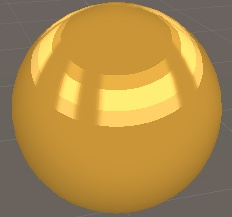

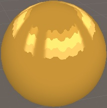

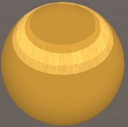


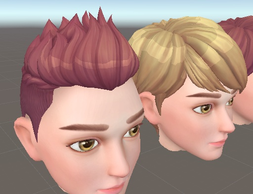

优缺点

优点：

用Kajiya-Kay Model制作真实的头发效果非常好，尤其是柔顺的直发效果。

缺点： 

1.对贴图的要求比较高，当模型的UV使用率比较低时，会比较容易出现高光质量问题

2.对UV的展开有要求，头发UV块比较多而且杂乱时，贴图制作会比较困难，所以最好是展成方形的UV

3.所有头发的UV和法线贴图要方向一致，不然就会出现偏移相反的情况