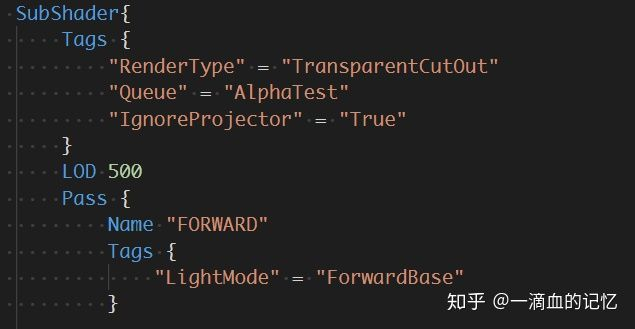
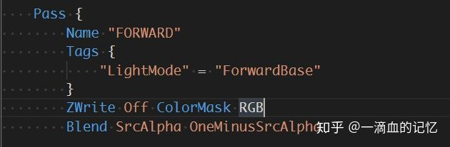
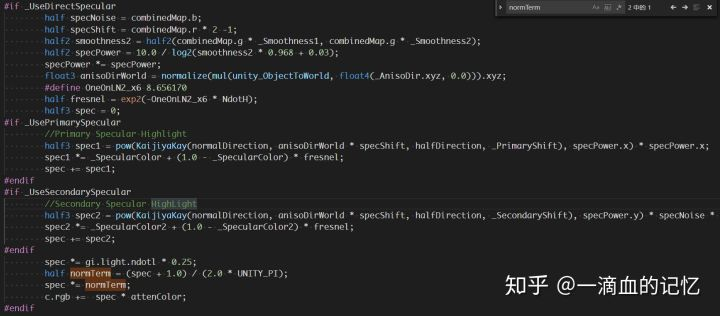
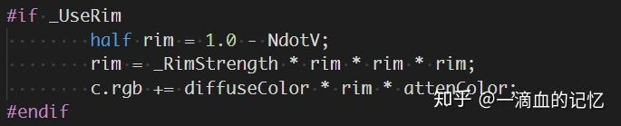
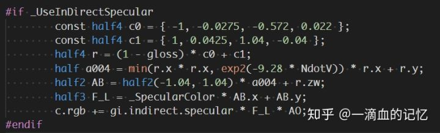
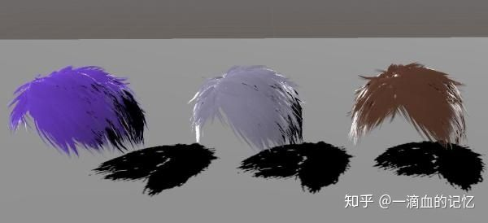
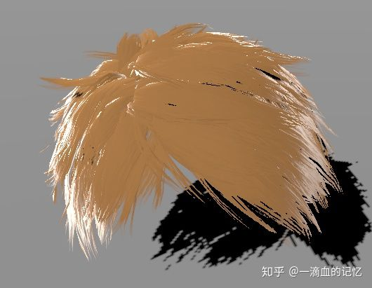
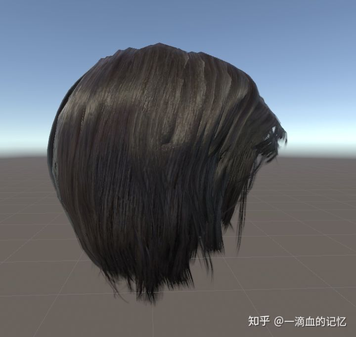

# 真实角色渲染---头发

Unity的Default PBR很多效果都很难支持，需要对其进行扩展。本篇先以写实游戏中的角色头发作为入口点，简单谈谈对于真实头发的渲染理论以及代码实现。

头发在光照渲染中表现出很明显的各向异性(Anisotropic，在不同方向表现出的光照效果会产生差异，拉丝金属，光碟也有同样的表现)。这种反射效果通常由物体表面的微表面特效所导致：物体表面主要由大量的方向一致的细长划痕或纤维表面组成，对于头发表面则是由大量的头发丝组成。如果这个采用普通的PBR高光模型渲染的话，很难达到不同方向上的差异性效果。渲染中主要技术点：1，AlphaTest  + AlphaBlend配合，以解决头发边缘硬边的问题 2，双层高光Kaijaya-Kay模型。核心代码u如下：

第一次AlphaTest

第二次AlphaBlending

双层高光

Rim效果

参考UE4间接高光部分

再加上漫反射部分的代码，基本效果就出来了。考虑到手机上的性能，在计算直接高光部分的时候并没有常规的D和F项，F，D两项采用了代价较为低廉的公式。

下面放上效果图仅供参考。

最近修改了一些参数，做了一版女性写实角色头发，效果图如下：

编辑于 2019-08-03