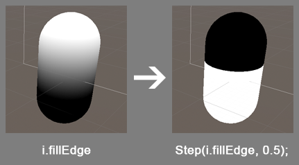
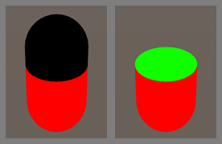
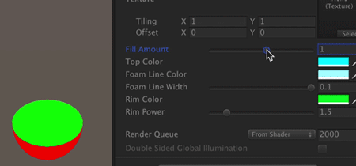

# Liquid Bottle – 液体瓶制作 – WalkingFat

已剪辑自: [http://walkingfat.com/liquid-bottle-%e6%b6%b2%e4%bd%93%e7%93%b6%e5%88%b6%e4%bd%9c/](http://walkingfat.com/liquid-bottle-液体瓶制作/)


通过旋转posWorld获得X和Z轴偏移，配合脚本输入Sin曲线制作出自然晃动的瓶装液体效果，并且可调整液体容量。

这个巧妙的做法是从网上学来的，不过这位大佬并没有详细分析实现方式，只是写了一下大概的思路，看他的twitter里很多人都在追问详细做法思路。我这儿就厚着脸皮拿来详细分析一下吧。


这玩意儿的实现方式很讨巧，几个功能的实现是依赖同一个算法的，不知道从哪儿讲起比较合适。所以就从实现的流程一步步讲：

准备好一个胶囊体来当作药水瓶。


首先计算一个物体位移和旋转时的加速度值，用来作为液体晃动的参数。创建一个C#脚本，把对象的位移和旋转的delta值输入sin函数，获得一个在-1到+1之间的平滑曲线。我们主要关注物体的X轴和Z轴的运动影响，所以就把“_WobbleX”和“_WobbleZ”这两个值输入进后面要写的shader里。

###### 参考代码：

```c#
using System.Collections;
using System.Collections.Generic;
using UnityEngine;

public class Wobble : MonoBehaviour
{
    Renderer rend;
    Vector3 lastPos;
    Vector3 velocity;
    Vector3 lastRot;  
    Vector3 angularVelocity;
    public float MaxWobble = 0.03f;
    public float WobbleSpeed = 1f;
    public float Recovery = 1f;
    float wobbleAmountX;
    float wobbleAmountZ;
    float wobbleAmountToAddX;
    float wobbleAmountToAddZ;
    float pulse;
    float time = 0.5f;

    // Use this for initialization
    void Start()
    {
        rend = GetComponent<Renderer>();
    }
    private void Update()
    {
        time += Time.deltaTime;
        // decrease wobble over time
        wobbleAmountToAddX = Mathf.Lerp(wobbleAmountToAddX, 0, Time.deltaTime * (Recovery));
        wobbleAmountToAddZ = Mathf.Lerp(wobbleAmountToAddZ, 0, Time.deltaTime * (Recovery));

        // make a sine wave of the decreasing wobble
        pulse = 2 * Mathf.PI * WobbleSpeed;
        wobbleAmountX = wobbleAmountToAddX * Mathf.Sin(pulse * time);
        wobbleAmountZ = wobbleAmountToAddZ * Mathf.Sin(pulse * time);

        // send it to the shader
        rend.material.SetFloat("_WobbleX", wobbleAmountX);
        rend.material.SetFloat("_WobbleZ", wobbleAmountZ);

        // velocity
        velocity = (lastPos - transform.position) / Time.deltaTime;
        angularVelocity = transform.rotation.eulerAngles - lastRot;


        // add clamped velocity to wobble
        wobbleAmountToAddX += Mathf.Clamp((velocity.x + (angularVelocity.z * 0.2f)) * MaxWobble, -MaxWobble, MaxWobble);
        wobbleAmountToAddZ += Mathf.Clamp((velocity.z + (angularVelocity.x * 0.2f)) * MaxWobble, -MaxWobble, MaxWobble);

        // keep last position
        lastPos = transform.position;
        lastRot = transform.rotation.eulerAngles;
    }
}
```

然后开始写shader。

在vert阶段，用“RotateAroundYInDegrees”函数，把物体按照屏幕坐标旋转，让原来的+Y轴分别转到+X轴和+Z轴，再分别乘上之前的“_WobbleX”和“_WobbleZ”。这样就相当于获得了X轴和Z轴方向的梯度值。如下图：


这个沿着X轴和Y轴波形曲线的梯度值就是用来制作水面起伏效果的关键。

把梯度值输入到fragment里先看看效果：


已经可以看到晃动的感觉了。

用step的方式获得液体的像素位置。如下图：



通过“AlphaToMask On”把黑色的部分当作alpha clip剔除了。水面的像素其实是通过VFace的方式，把背面的的像素取出来当作水面。




水面高度变化是通过之前在vert阶段计算水面晃动的时候，把worldPos.y再额外加上一个高度系数“_FillAmount”。注意这个系数是调整y轴的高度变化的，要根据每个物体的实际尺寸来调整水面最高点和最低点。



因为是根据y轴高度算出来的水面，所以不管物体是什么形状，如何旋转角度，都不会影响水面高度，所以看起来很自然。

到此为止核心功能都做完了，之后可以给水面和水体加上颜色，然后增加一个pass做玻璃瓶子。

玻璃瓶子的做法就是Normal往外挤出一点距离，渲染模式Alpha blend，加上Rim和Specular。


原文链接：https://www.patreon.com/posts/quick-game-art-18245226

###### shader参考：

```
Shader "WalkingFat/LiquidBottle/SparkleLiquid01"
{
    Properties
    {
        _LiquidColor ("LiquidColor", Color) = (1,1,1,1)
        _NoiseTex ("Noise Texture", 2D) = "white" {}
        _FillAmount ("Fill Amount", Range(-10,10)) = 0.0
        [HideInInspector] _WobbleX ("WobbleX", Range(-1,1)) = 0.0
        [HideInInspector] _WobbleZ ("WobbleZ", Range(-1,1)) = 0.0
        _LiquidTopColor ("Liquid Top Color", Color) = (1,1,1,1)
        _LiquidFoamColor ("Liquid Foam Color", Color) = (1,1,1,1)
        _FoamLineWidth ("Liquid Foam Line Width", Range(0,0.1)) = 0.0    
        _LiquidRimColor ("Liquid Rim Color", Color) = (1,1,1,1)
        _LiquidRimPower ("Liquid Rim Power", Range(0,10)) = 0.0
        _LiquidRimIntensity ("Liquid Rim Intensity", Range(0.0,3.0)) = 1.0
        
        _BottleColor ("Bottle Color", Color) = (0.5,0.5,0.5,1)
        _BottleThickness ("Bottle Thickness", Range(0,1)) = 0.1
          
        _BottleRimColor ("Bottle Rim Color", Color) = (1,1,1,1)
        _BottleRimPower ("Bottle Rim Power", Range(0,10)) = 0.0
        _BottleRimIntensity ("Bottle Rim Intensity", Range(0.0,3.0)) = 1.0
        
        _BottleSpecular ("BottleSpecular", Range(0,1)) = 0.5
        _BottleGloss ("BottleGloss", Range(0,1) ) = 0.5
    }
 
    SubShader
    {
        Tags
        { 
            "DisableBatching" = "True" 
            "Queue"="Transparent"
            "RenderType"="Transparent"
        }
        
        //1st pass draw liquid
        Pass
        {
            Tags {"RenderType" = "Opaque" "Queue" = "Geometry"}
            
            Zwrite On
            Cull Off // we want the front and back faces
            AlphaToMask On // transparency

            CGPROGRAM


            #pragma vertex vert
            #pragma fragment frag
            // make fog work
            #pragma multi_compile_fog

            #include "UnityCG.cginc"

            struct appdata
            {
                float4 vertex : POSITION;
                float2 uv : TEXCOORD0;
                float3 normal : NORMAL; 
            };

            struct v2f
            {
                float2 uv : TEXCOORD0;
                UNITY_FOG_COORDS(1)
                float4 vertex : SV_POSITION;
                float3 viewDir : COLOR;
                float3 normal : COLOR2;    
                float fillEdge : TEXCOORD2;
            };

            sampler2D _NoiseTex;
            float4 _NoiseTex_ST;
            float _FillAmount, _WobbleX, _WobbleZ;
            float4 _LiquidTopColor, _LiquidRimColor, _LiquidFoamColor, _LiquidColor;
            float _FoamLineWidth, _LiquidRimPower, _LiquidRimIntensity;

            float4 RotateAroundYInDegrees (float4 vertex, float degrees)
            {
                float alpha = degrees * UNITY_PI / 180;
                float sina, cosa;
                sincos(alpha, sina, cosa);
                float2x2 m = float2x2(cosa, sina, -sina, cosa);
                return float4(vertex.yz , mul(m, vertex.xz)).xzyw ;            
            }


            v2f vert (appdata v)
            {
                v2f o;

                o.vertex = UnityObjectToClipPos(v.vertex);
                o.uv = TRANSFORM_TEX(v.uv, _NoiseTex);
                UNITY_TRANSFER_FOG(o,o.vertex);        
                // get world position of the vertex
                float3 worldPos = mul (unity_ObjectToWorld, v.vertex.xyz);  
                // rotate it around XY
                float3 worldPosX= RotateAroundYInDegrees(float4(worldPos,0),360);
                // rotate around XZ
                float3 worldPosZ = float3 (worldPosX.y, worldPosX.z, worldPosX.x);     
                // combine rotations with worldPos, based on sine wave from script
                float3 worldPosAdjusted = worldPos + (worldPosX * _WobbleX)+ (worldPosZ * _WobbleZ);
                // how high up the liquid is
                o.fillEdge =  worldPosAdjusted.y + _FillAmount;

                o.viewDir = normalize(ObjSpaceViewDir(v.vertex));
                o.normal = v.normal;
                return o;
            }

            fixed4 frag (v2f i, fixed facing : VFACE) : SV_Target
            {
                // sample the texture
                fixed4 col = tex2D(_NoiseTex, i.uv) * _LiquidColor;
                // apply fog
                UNITY_APPLY_FOG(i.fogCoord, col);

                // rim light
                float dotProduct = 1 - pow(dot(i.normal, i.viewDir), _LiquidRimPower);
                float4 RimResult = _LiquidRimColor * smoothstep(0.5, 1.0, dotProduct) * _LiquidRimIntensity;

                // foam edge
                float4 foam = step(i.fillEdge, 0.5) - step(i.fillEdge, (0.5 - _FoamLineWidth));
                float4 foamColored = foam * _LiquidFoamColor;
                // rest of the liquid
                float4 result = step(i.fillEdge, 0.5) - foam;
                float4 resultColored = result * col;
                // both together, with the texture
                float4 finalResult = resultColored + foamColored;               
                finalResult.rgb += RimResult;

                // color of backfaces/ top
                float4 topColor = _LiquidTopColor * (foam + result);
                //VFACE returns positive for front facing, negative for backfacing
                return facing > 0 ? finalResult : topColor;
                   
            }
            ENDCG
        }
        
        // 2nd pass draw glass bottle
        Pass
        {
            Blend SrcAlpha OneMinusSrcAlpha
            
            CGPROGRAM
            #pragma vertex vert
            #pragma fragment frag
            // make fog work
            #pragma multi_compile_fog

            #include "UnityCG.cginc"
 
            struct appdata
            {
                float4 vertex : POSITION;
                float2 uv : TEXCOORD0;
                float3 normal : NORMAL; 
            };
     
            struct v2f
            {
                float4 vertex : SV_POSITION;
                float3 viewDir : COLOR;
                float3 normal : COLOR2;
                float2 uv : TEXCOORD0;
                float3 lightDir : TEXCOORD1;
                float3 normalDir : TEXCOORD2;
                float3 viewDirWorld : TEXCOORD3;
                UNITY_FOG_COORDS(3)
            };
     
            float4 _BottleColor, _BottleRimColor;
            float _BottleThickness, _BottleRim, _BottleRimPower, _BottleRimIntensity;
            float _BottleSpecular, _BottleGloss;
     
            v2f vert (appdata v)
            {
                v2f o;
                v.vertex.xyz += _BottleThickness * v.normal;
                o.vertex = UnityObjectToClipPos(v.vertex);

                o.viewDir = normalize(ObjSpaceViewDir(v.vertex));
                o.normal = v.normal;
                
                float4 posWorld = mul (unity_ObjectToWorld, v.vertex);
                o.viewDirWorld = normalize(_WorldSpaceCameraPos.xyz - posWorld.xyz);
                o.normalDir = UnityObjectToWorldNormal (v.normal);
                o.lightDir = normalize(_WorldSpaceLightPos0.xyz);

                UNITY_TRANSFER_FOG(o,o.vertex);
                return o;
            }
               
            fixed4 frag (v2f i, fixed facing : VFACE) : SV_Target
            {
                // specular
                i.normalDir = normalize(i.normalDir);
                float specularPow = exp2 ((1 - _BottleGloss) * 10.0 + 1.0);
                fixed4 specularColor = fixed4 (_BottleSpecular, _BottleSpecular, _BottleSpecular, _BottleSpecular);
               
                float3 halfVector = normalize (i.lightDir + i.viewDirWorld);
                fixed4 specularCol = pow (max (0,dot (halfVector, i.normalDir)), specularPow) * specularColor;
                
                // rim light
                float dotProduct = 1 - pow(dot(i.normal, i.viewDir), _BottleRimPower);
                fixed4 RimCol = _BottleRimColor * smoothstep(0.5, 1.0, dotProduct) * _BottleRimIntensity;
                
                fixed4 finalCol = RimCol + _BottleColor + specularCol;
                
                UNITY_APPLY_FOG(i.fogCoord, col);

                return finalCol;
            }
            ENDCG
        }
    }
    Fallback "VertexLit"
}
```