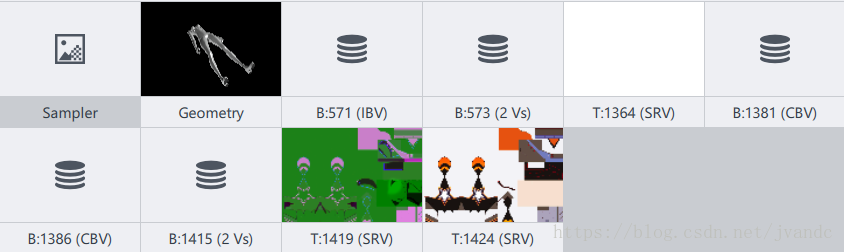
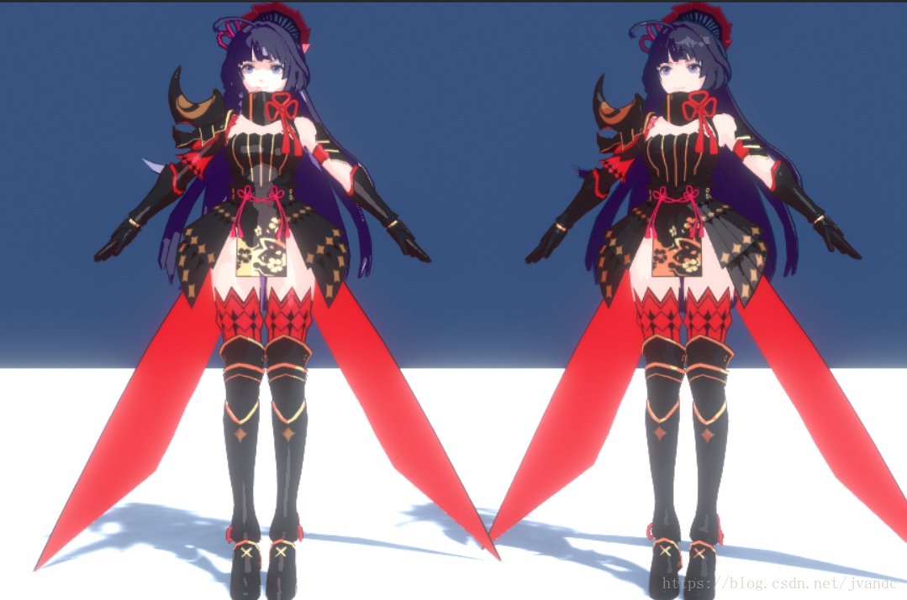

# NPR——卡通渲染（二）

​                                                   2018年08月01日 18:13:55           [TwinkleStar0121](https://me.csdn.net/jvandc)           阅读数：803                                                                  

​                   

​                                                                         版权声明：欢迎转载，共同进步，请注明出处。          https://blog.csdn.net/jvandc/article/details/81335736        


- - - [申明：本文内容仅供个人学习，请勿转载。](https://blog.csdn.net/jvandc/article/details/81335736#申明本文内容仅供个人学习请勿转载)
    - [NPR——卡通渲染](https://blog.csdn.net/jvandc/article/details/81335736#npr卡通渲染)
    - 1.1《崩坏3》
      - [1.1.1 游戏抓帧](https://blog.csdn.net/jvandc/article/details/81335736#111-游戏抓帧)
      - 1.1.2 Shader 翻译
        - [Vertex DXBC](https://blog.csdn.net/jvandc/article/details/81335736#vertex-dxbc)
        - [Pixel DXBC](https://blog.csdn.net/jvandc/article/details/81335736#pixel-dxbc)
        - [Unity ShaderLab完整代码](https://blog.csdn.net/jvandc/article/details/81335736#unity-shaderlab完整代码)
    - [1.2 模拟实现](https://blog.csdn.net/jvandc/article/details/81335736#12-模拟实现)
    - [Reference](https://blog.csdn.net/jvandc/article/details/81335736#reference)


### 申明：本文内容仅供个人学习，请勿转载。

### NPR——卡通渲染

本文的目标是在“NPR——开通渲染（一）”的基础之上尝试“靠近”《崩坏3》的角色渲染表现。

### 1.1《崩坏3》

#### 1.1.1 游戏抓帧


 
 （游戏截图） 
 本文主要学习研究的对象同样是《崩坏3》的角色卡通渲染技术，使用工具对《崩坏3》抓帧，基本内容如引文 [[1](https://blog.csdn.net/LIANGJINGLONG/article/details/78056157)] 和 [[2](https://blog.csdn.net/liumazi/article/details/78858811)] 所介绍的一样： 
 
 
 （身体部分绘制） 
 身体部分的 DrawCall 使用了两个纹理，如下图： 
 
 
 （Application Input） 
 上图看到有两个纹理，一个主纹理（漫反射纹理），一个 LightMap——如引文 [[1](https://blog.csdn.net/LIANGJINGLONG/article/details/78056157)] 和 [[2](https://blog.csdn.net/liumazi/article/details/78858811)] 所述，一个特殊的纹理，三个通道分别存储了不同的信息，比如高光 Mask、高光颜色以及阴影 Mask。

#### 1.1.2 Shader 翻译

没有使用 Adreno Profile，不知道  [[1](https://blog.csdn.net/LIANGJINGLONG/article/details/78056157)] 和 [[2](https://blog.csdn.net/liumazi/article/details/78858811)] 作者是否人肉翻译出来的 Shader，本文获得的部分 Vertex\Pixel DXBC 如下：

```
// Vertex Shader DirectX Bytecode
// Generated by Microsoft (R) HLSL Shader Compiler 10.1
//
//
// Buffer Definitions:
//
// cbuffer $Globals
// {
//
// float4 __BloomMaskTex_ST; // Offset: 0 Size: 16
// float __DitherAlpha; // Offset: 16 Size: 4
// float4 __ProjectionParams; // Offset: 32 Size: 16
// float __UsingBloomMask; // Offset: 48 Size: 4
// float __UsingDitherAlpha; // Offset: 64 Size: 4
// float4 __WorldSpaceLightPos0; // Offset: 80 Size: 16
// float4x4 _unity_MatrixVP; // Offset: 96 Size: 64
// float4x4 _unity_ObjectToWorld; // Offset: 160 Size: 64
// float4x4 _unity_WorldToObject; // Offset: 224 Size: 64
//
// }
//
//
// Resource Bindings:
//
// Name Type Format Dim HLSL Bind Count
// ------------------------------ ---------- ------- ----------- -------------- ------
// $Globals cbuffer NA NA cb0 1
//
//
//
// Input signature:
//
// Name Index Mask Register SysValue Format Used
// -------------------- ----- ------ -------- -------- ------- ------
// TEXCOORD 0 xyzw 0 NONE float xyzw
// TEXCOORD 1 xyzw 1 NONE float xyzw
// TEXCOORD 2 xyz 2 NONE float xyz
// TEXCOORD 3 xyzw 3 NONE float xy
//
//
// Output signature:
//
// Name Index Mask Register SysValue Format Used
// -------------------- ----- ------ -------- -------- ------- ------
// SV_Position 0 xyzw 0 POS float xyzw
// TEXCOORD 7 xyzw 1 NONE float xyzw
// TEXCOORD 0 xyzw 2 NONE float xyzw
// TEXCOORD 1 xyzw 3 NONE float xyzw
// TEXCOORD 2 xyz 4 NONE float xyz
// TEXCOORD 6 w 4 NONE float w
// TEXCOORD 3 xyz 5 NONE float xyz
// TEXCOORD 4 xy 6 NONE float xy
// TEXCOORD 5 zw 6 NONE float zw
//
vs_5_0
dcl_globalFlags refactoringAllowed
dcl_constantbuffer CB0[17], immediateIndexed
dcl_input v0.xyzw
dcl_input v1.xyzw
dcl_input v2.xyz
dcl_input v3.xy
dcl_output_siv o0.xyzw, position
dcl_output o1.xyzw
dcl_output o2.xyzw
dcl_output o3.xyzw
dcl_output o4.xyz
dcl_output o4.w
dcl_output o5.xyz
dcl_output o6.xy
dcl_output o6.zw
dcl_temps 3
...
...
...1234567891011121314151617181920212223242526272829303132333435363738394041424344454647484950515253545556575859606162636465666768697071727374
// Pixle Shader DirectX Bytecode
// Generated by Microsoft (R) HLSL Shader Compiler 10.1
//
//
// Buffer Definitions:
//
// cbuffer $Globals
// {
//
// float __BloomFactor; // Offset: 0 Size: 4
// float4 __Color; // Offset: 16 Size: 16
// float4x4 __DITHERMATRIX; // Offset: 32 Size: 64
// float __Emission; // Offset: 96 Size: 4
// float __EmissionBloomFactor; // Offset: 112 Size: 4
// float4 __EmissionColor; // Offset: 128 Size: 16
// float3 __FirstShadowMultColor; // Offset: 144 Size: 12
// float __LightArea; // Offset: 160 Size: 4
// float3 __LightSpecColor; // Offset: 176 Size: 12
// float4 __ScreenParams; // Offset: 192 Size: 16
// float __SecondShadow; // Offset: 208 Size: 4
// float3 __SecondShadowMultColor; // Offset: 224 Size: 12
// float __Shininess; // Offset: 240 Size: 4
// float __SpecMulti; // Offset: 256 Size: 4
// float __UsingBloomMask; // Offset: 272 Size: 4
// float __UsingDitherAlpha; // Offset: 288 Size: 4
// float3 __WorldSpaceCameraPos; // Offset: 304 Size: 12
// float4 __WorldSpaceLightPos0; // Offset: 320 Size: 16
//
// }
//
//
// Resource Bindings:
//
// Name Type Format Dim HLSL Bind Count
// ------------------------------ ---------- ------- ----------- -------------- ------
// samplers2D[0] sampler NA NA s0 1
// samplers2D[1] sampler NA NA s1 1
// samplers2D[2] sampler NA NA s2 1
// textures2D[0] texture float4 2d t0 1
// textures2D[1] texture float4 2d t1 1
// textures2D[2] texture float4 2d t2 1
// $Globals cbuffer NA NA cb0 1
//
//
//
// Input signature:
//
// Name Index Mask Register SysValue Format Used
// -------------------- ----- ------ -------- -------- ------- ------
// SV_Position 0 xyzw 0 POS float
// TEXCOORD 7 xyzw 1 NONE float
// TEXCOORD 0 xyzw 2 NONE float x
// TEXCOORD 1 xyzw 3 NONE float xyzw
// TEXCOORD 2 xyz 4 NONE float xyz
// TEXCOORD 6 w 4 NONE float w
// TEXCOORD 3 xyz 5 NONE float xyz
// TEXCOORD 4 xy 6 NONE float xy
// TEXCOORD 5 zw 6 NONE float zw
//
//
// Output signature:
//
// Name Index Mask Register SysValue Format Used
// -------------------- ----- ------ -------- -------- ------- ------
// SV_TARGET 0 xyzw 0 TARGET float xyzw
//
ps_5_0
dcl_globalFlags refactoringAllowed
dcl_immediateConstantBuffer { { 1.000000, 0, 0, 0},
{ 0, 1.000000, 0, 0},
{ 0, 0, 1.000000, 0},
{ 0, 0, 0, 1.000000} }
dcl_constantbuffer CB0[21], immediateIndexed
dcl_sampler s0, mode_default
dcl_sampler s1, mode_default
dcl_sampler s2, mode_default
dcl_resource_texture2d (float,float,float,float) t0
dcl_resource_texture2d (float,float,float,float) t1
dcl_resource_texture2d (float,float,float,float) t2
dcl_input_ps linear v2.x
dcl_input_ps linear v3.xyzw
dcl_input_ps linear v4.xyz
dcl_input_ps linear v4.w
dcl_input_ps linear v5.xyz
dcl_input_ps linear v6.xy
dcl_input_ps linear v6.zw
dcl_output o0.xyzw
dcl_temps 5
...
...
...12345678910111213141516171819202122232425262728293031323334353637383940414243444546474849505152535455565758596061626364656667686970717273747576777879808182838485868788899091
```

从第二段代码 Pixle Shader DirectX Bytecode 来看确实如  [[1](https://blog.csdn.net/LIANGJINGLONG/article/details/78056157)] 和 [[2](https://blog.csdn.net/liumazi/article/details/78858811)] 所展示的逆向分析结果一样，《崩坏3》的着色大致是 FirstShadow + Second Shadow + Spcular + Bloom。

##### Vertex DXBC

接下来尝试转译成方便阅读的伪代码，先看 Vertex DXBC，dcl_input v0 到 v3 四个寄存器输入信息应该分别是  position，color，normal 和 uv，dcl_output  输出寄存器中最起码也包含了这四项，剩下的三个输出寄存器中我们来看代码：

```
mov r0.xyz, v0.xyzx
mov r0.w, l(1.000000)
dp4 r1.x, cb0[10].xyzw, r0.xyzw
dp4 r1.y, cb0[11].xyzw, r0.xyzw
dp4 r1.z, cb0[12].xyzw, r0.xyzw
dp4 r1.w, cb0[13].xyzw, r0.xyzw
...
...
...123456789
```

上面说了 v0 存放的是顶点位置信息， 结合 constant buffer 的信息——cb[10] 到 cb[13]  是模型坐标系变换世界坐标系的矩阵 _unity_ObjectToWorld，cb[6] 到 cb[9] 是VP 矩阵（View &  Projection）_unity_MatrixVP（cb 每一个数组元素都是一个四元组——xyzw）。这里顺便说明剩下的一个矩阵  _unity_WorldToObject 对应了 cb[14] 到 cb[16]，这是一个 3x3 的矩阵，用来对顶点法向量进行变换（**注意：法向量的变换**），因此上面一段代码翻译过来就是：

```
fixed4 position  = v.position.xyz；
position.w = 1.0f;
fixed4 outPosition = mul(_unity_ObjectToWorld, position);
outPosition = mul(_unity_MatrixVP, outPosition);1234
```

（上面Vertex DXBC 最后一行代码，翻转了顶点输出位置 y 值。）

```
add r1.x, r0.w, r0.z
mov o1.xyzw, r0.xyzw
mul r2.xz, r0.xxwx, l(0.500000, 0.000000, 0.500000, 0.000000)
mul r0.x, r0.y, cb0[2].x
...
...
...1234567
```

这一段，除了第 8 行是输出顶点颜色外，第 1行，第 3 行到第 7 行依据 __ProjectionParams.x 处理 o0.z 值（**不知道该投影参数用来干嘛？**），第 2 行是将输入顶点位置乘以 MVP 矩阵得到的位置信息存储寄存器 v1（**同样不知道用来干嘛，还是说这里本就是废弃代码？**）。在对应的 Pixel Shader 中也没有找到使用了 v1 寄存器信息的代码。

```
ne r0.z, l(0.000000, 0.000000, 0.000000, 0.000000), cb0[4].x
and o3.xyw, r0.xyxw, r0.zzzz
and o3.z, r0.z, cb0[1].x123
```

and 是 Bitwise 相与符号，这一段代码 o3.xyw 与 __DitherAlpha 有关，o3.z 与 Bloom Mask 有关 ，暂时，同样，还是不知道用来干什么的，(；′⌒`)……

```
mul r0.xyz, v2.yyyy, cb0[15].xyzx
mad r0.xyz, v2.xxxx, cb0[14].xyzx, r0.xyzx
mad r0.xyz, v2.zzzz, cb0[16].xyzx, r0.xyzx
...
...
...123456
```

这一段代码，第 1 行到第 5 行将法向量转换到了世界坐标系下并归一化存放在 o4.xyz 寄存器中，cb0[5]  存放的是世界坐标系下光照的方向，第 6 行到第 8 行，计算了法向量和光照方向的点积，并将其范围映射到区间 [0,1]（就是计算了  Lambert 光照模型），其值存放在了 o4.w 寄存器中。

```
dp4 r0.x, cb0[10].xyzw, v0.xyzw
dp4 r0.y, cb0[11].xyzw, v0.xyzw
dp4 r0.z, cb0[12].xyzw, v0.xyzw
dp4 r0.w, cb0[13].xyzw, v0.xyzw
div o5.xyz, r0.xyzx, r0.wwww
...
...
...12345678
```

这一段代码，o5 寄存器存放了计算后的顶点齐次裁剪空间坐标，o6.xy 存放的就是顶点输入的 UV 坐标，o6.zw 存放的值其实就对应  Unity ShaderLab 中 TRANSFORM_TEX 计算后的 UV 坐标（Unity  中显示给用户的有四个可调的纹理坐标相关值，Tiling.xy 和 Offset.xy，TRANSFORM_TEX 的作用就是针对此计算出正确的  UV 坐标。）。 
 到这里，Vertex Shader 大体内容比较清楚了（最重要的是计算了 Lambert 光照模型，有一两处目前不知道功用）。

```
fixed4 pos  = v.vertex.xyzx；
pos.w = 1.0f;
fixed4 temp = mul(_unity_ObjectToWorld, position);
temp = mul(_unity_MatrixVP, outPosition);
fixed4 outPos0; //o0
outPos0.xyw = temp0.xyw * fixed4(1.0f, -1.0f, 1.0f);

fixed4 outPos1 = temp0;//o1

fixed4 temp1;
temp1.x  = temp0.w + temp0.z;
fixed4 temp2;
temp2.xz = temp0.xw * fixed2(0.5f, 0.5f);
temp0.x = temp0.y * __ProjectionParams.x;
temp2.w = temp0.x * 0.5f;
temp0.xy = temp2.zz + temp2.xw; 
outPos0.z = temp1.x * 0.5f;

fixed4 outColor = v.color;//o2

fixed4 outVal3;//o3
temp0.z = __UsingDitherAlpha == 0 ? 0 :255;
outVal3.xyw = temp0.xyw & temp.zzz;
outVal3.z = temp.z & __DitherAlpha;

fixed3 outNormal;//o4.xyz
outNormal = mul(_unity_WorldToObject, v.normal);
outNormal = normalize(outNormal);

fixed outLambert;//o4.w
outLambert = dot(outNormal, __WorldSpaceLightPos0);
outLambert = lambert * 0.4975f + 0.5f;

fixed4 outWorldPos = mul(_unity_ObjectToWorld, v.vertex);//o5

fixed4 outVal6;//o6
temp0.x = __UsingBloomMask == 0 ? 0 : 255;
temp0.yz = v.texcoord.xy *__BloomMaskTex_ST.xy + __BloomMaskTex_ST.zw;
outVal6.zw = temp0.yz & temp0.xx;
outVal6.xy = v.texcoord.xy;12345678910111213141516171819202122232425262728293031323334353637383940
```

（注意：1、本文没有列出所有 DXBC；2、本文伪码中值 255 实际的值为 0xFFFFFFFF，32位寄存器全部填充“1”）

##### Pixel DXBC

Pixel DXBC 相对 Vertex DXBC 复杂得多。Pixel Shader（Fragment Shader）只有一个输出值 o0.xyzw，也就是片段着色器计算获得的片段颜色。

```
sample_indexable(texture2d)(float,float,float,float) r0.xyzw, v6.xyxx, t2.wxyz, s2
ne r1.x, l(0.000000, 0.000000, 0.000000, 0.000000), cb0[17].x
if_nz r1.x
  sample_indexable(texture2d)(float,float,float,float) r1.x, v6.zwzz, t0.xyzw, s0
  mul r0.x, r0.x, r1.x
endif 123456
```

Pixel DXBC 中有三个采样纹理，分别是 t0、t1 和 t2，s1、s2 和 s3 分别记录了纹理采样的方式，这一段代码先对 t2  纹理采样，采样值存入 r0.xyzw，cb0[17].x 对应的常量是 __UsingBloomMask——“是否使用 Bloom  Mask”，因此，接下来的代码表示如果使用 Bloom Mask，那么对 t0 纹理采样，采样值存入 r1.x（注意这里 r1.x 就意味着  t0 纹理可能就是一个灰度图），r1.x 和 r0.x 相乘得到的值存入 r0.x（暂时不知道 t2 是什么纹理）。

```
ne r1.x, l(0.000000, 0.000000, 0.000000, 0.000000), cb0[18].x
if_nz r1.x
  lt r1.x, v3.z, l(0.950000)
  if_nz r1.x
    div r1.xy, v3.xyxx, v3.wwww
    mul r1.xy, r1.xyxx, cb0[12].xyxx
    mul r1.zw, r1.xxxy, l(0.000000, 0.000000, 0.250000, 0.250000)
    frc r1.zw, |r1.zzzw|
    mul r1.zw, r1.zzzw, l(0.000000, 0.000000, 4.000000, 4.000000)
    ge r1.xy, r1.xyxx, l(0.000000, 0.000000, 0.000000, 0.000000)
...
...
...12345678910111213
```

这一段代码涉及到 __UsingDitherAlpha 和 __DITHERMATRIX，暂不知道有什么用。(；′⌒`)……

```
sample_indexable(texture2d)(float,float,float,float) r1.xyz, v6.xyxx, t1.xyzw, s1
mul r1.w, r1.y, v2.x
lt r2.x, r1.w, l(0.090000)
mad r1.y, v2.x, r1.y, v4.w
mul r1.y, r1.y, l(0.500000)
lt r1.y, r1.y, cb0[13].x
mul r2.yzw, r0.yyzw, cb0[14].xxyz
mul r3.xyz, r0.yzwy, cb0[9].xyzx
movc r2.yzw, r1.yyyy, r2.yyzw, r3.xxyz
ge r1.y, r1.w, l(0.500000)
mad r4.xy, r1.wwww, l(1.200000, 1.250000, 0.000000, 0.000000), l(-0.100000, -0.125000, 0.000000, 0.000000)
movc r1.y, r1.y, r4.x, r4.y
add r1.y, r1.y, v4.w
mul r1.y, r1.y, l(0.500000)
...
...
...1234567891011121314151617
```

这一段应该就是《崩坏3》的角色渲染核心内容，代码有点长，本人能力不足，理解困难，本文 Pixel DXBC 转译如下：

```
sampler2D t0;
sampler2D t1;
sampler2D t2;
***********************************************************************

fixed4 temp0 = tex2D(t2, i.outVal6.xy);
fixed4 temp1;
temp1.x = __UsingBloomMask == 0 ? 0 : 255;
if (temp1.x != 0)
{
    temp1.x = tex2D(t0, i.outVal6.zw).x;
    temp0.x = temp0.x * temp1.x;
}
temp1.x = __UsingDitherAlpha == 0 ? 0 : 255;
if(temp1.x != 0)
{
    temp1.x = i.outVal3.z < 0.95f ?  255  :  0;
    if(temp1.x != 0)
    {
        temp1.xy = i.outVal3.xy / i.outVal3.ww;
        temp1.xy = temp1.xy * __ScreenParams.xy;
        temp1.zw = temp1.xy * 0.25f;
        temp1.zw = fract(temp1.zw);
        temp1.zw *= 4.0f;
        temp1.x = temp1.x >= 0 ? 255 : 0;
        temp1.y = temp1.y >= 0 ? 255 : 0;
        temp1.x = temp1.x ? temp1.z : -temp1.z;
        temp1.y = temp1.y ? temp1.w: -temp1.w;
        temp1.xy = ftoi(temp1.xy);
        fixed4 temp2;
        temp2 = mul(__DITHERMATRIX, icb[temp1.y + 0].xyzw);
        temp1.x = dot(temp2, icb[temp1.x].xyzw);
        temp1.x = i.outVal3.z * 17.0f  - temp1.x;
        temp1.x -= 0.01f;
        temp1.x = temp1.x < 0 ? 255 : 0
        if(temp1.x != 0) 
            discard;
    }
}

temp1.xyz = tex2D(t1, i.outVal6.xy).xyz;
temp1.w = temp1.y * i.outColor.x;
temp2.x = temp1.w < 0.09f ? 255 : 0;
temp1.y = i.outColor.x * temp1.y + i.outLambert;
temp1.y = temp1.y * 0.5f;
temp1.y = temp1.y < __SecondShadow ? 255 : 0;
temp2.yzw = temp0.yzw * __SecondShadowMultColor.xyz;
fixed4 temp3;
temp3.xyz = temp0.yzw *__FirstShadowMultColor.xyz;
temp2.yzw = temp1.yyy ? temp2.yzw : temp3.xyz;
temp1.y = temp1.w >= 0.5f ? 255 : 0;
fixed4 temp4;
temp4.xy = temp1.ww * fixed2(1.2f, 1.25f) + fixed2(-0.1f, -0.125f);
temp1.y = temp1.y ? temp4.x : temp4.y;
temp1.y = temp1.y + i.outLambert;
temp1.y *= 0.5f;
temp1.y = temp1.y < __LightArea ? 255 : 0;
temp3.xyz = temp1.yyy ? temp3.xyz : temp0.yzw;
temp2.xyz = temp2.xxx ? temp2.yzw : temp3.xyz;
temp3.xyz = i.outWorldPos.xyz + __WorldSpaceCameraPos;//viewDir
temp1.y = dot(temp3.xyz, temp3.xyz);
temp1.y = 1.0f / sqrt(temp1.y);//viewDir归一化
temp3.xyz = temp3.xyz * temp1.yyy + __WorldSpaceLightPos0;//halfVec
temp1.y = dot(i.temp3.xyz,temp3.xyz);
temp1.y = 1.0f / sqrt(temp1.y);
temp3.xyz = temp3.xyz * temp1.yyy;//halfVec归一化
temp1.y = dot(i.outNormal, i.outNormal);
temp1.y = 1.0f / sqrt(temp1.y);
temp4.xyz = i.outNormal * temp1.yyy;//法向量归一化
temp1.y = pow(dot(temp4.xyz, temp3.xyz), __Shininess);
temp1.z = -temp1.z + 1.0f;
temp1.y = temp1.y >= temp1.z ? 255 : 0;
temp3.xyz = __LightSpecColor * __SpecMulti;
temp1.xzw = temp1.xxx * temp3.xyz;
temp1.xyz = temp1.xzw & temp1.yyy;
temp1.xyz = temp1.xyz + temp2.xyz;
temp0.yzw = temp0.yzw * __Emission.xxx;
temp1.xyz = temp1.xyz * __Color.xyz;
temp1.w = __BloomFactor *  __Color.w;
temp2.xyz = temp0.yzw * __EmissionColor - temp1.xyz;
temp2.w = -__BloomFactor  * __Color.w + __EmissionBloomFactor;

fragColor = temp0.xxxx * temp2.xyzw + temp1.xyzw;1234567891011121314151617181920212223242526272829303132333435363738394041424344454647484950515253545556575859606162636465666768697071727374757677787980818283
```

##### Unity ShaderLab完整代码

总结上文内容，在 Unity 用 ShaderLab 实现如下：

```
Shader "NPR/NPR_BengHuai3"
{
    Properties
    {
        [Header(Main Texture Setting)]
        [Space(5)]
        _MainTex("Texture", 2D) = "white" {}
        _Color("Tint Color", color) = (0.5, 0.5, 0.5, 1.0)
        [Space(30)]

        [Header(Outline Setting)]
        [Space(5)]
        _OutlineColor("Outline Color", color) = (0.0, 0.0, 0.0, 1.0)
        _OutlineSize("Outline Size", range(0.0, 1.0)) = 0.1
        _ZBias("Z Bias", range(-1.0, 1.0)) = 0.0
        [Space(30)]

        [Header(Bloom Setting)]
        [Space(5)]
        _BloomTex("Bloom Map", 2D) = "black" {}
        _UsingBloomMask("Use Bloom", int) = 1
        _BloomFactor("Bloom Factor", range(0.0, 2.0)) = 1.0
        _Emission("Emission", range(0.0, 2.0)) = 1.0
        _EmissionColor("Emission Color", color) = (1.0, 1.0, 1.0, 1.0)
        _EmissionBloomFactor("Emission Bloom Factor", range(0.0, 2.0)) = 1.0
        [Space(30)]

        [Header(Shadow Setting)]
        [Space(5)]
        _LightMap("LightMap", 2D) = "black" {}
        _LightArea("Light Area", range(0.0, 1.0)) = 1.0
        _SecondShadow("Second Shadow", range(0.0, 1.0)) = 0.5
        _FirstShadowMultColor("First Shadow Color", color) = (1.0, 1.0, 1.0, 1.0)
        _SecondShadowMultColor("Second Shadow Color", color) = (0.5, 0.5, 0.5, 0.5)
        [Space(30)]

        [Header(Specular Setting)]
        [Space(5)]
        _LightSpecColor("Specular Color", color) = (1.0, 1.0, 1.0, 1.0)
        _Shininess("Shininess", range(0.0, 20.0)) = 0.1
        _SpecMulti("Multiple Factor", range(0.1, 1.0)) = 1
    }
    SubShader
    {
        Tags{
            "RenderType" = "Opaque"
            "Queue" = "Geometry"
        }

        UsePass "NPR/NPR_CelShading/OUTLINE"

        Pass
        {       
            NAME "BENGHUAI3"

            Tags{ "LightMode"="ForwardBase" }

            CGPROGRAM
            #pragma vertex vert
            #pragma fragment frag
            #pragma multi_compile_fwdbase

            #include "UnityCG.cginc"
            #include "Lighting.cginc"
            #include "AutoLight.cginc"

            uniform sampler2D _MainTex;
            uniform float4 _MainTex_ST;
            uniform float4 _Color;

            uniform sampler2D _BloomTex;
            uniform float4 _BloomTex_ST;
            uniform int _UsingBloomMask;
            uniform float _BloomFactor;
            uniform float3 _EmissionColor; 
            uniform float _Emission;
            uniform float _EmissionBloomFactor;

            uniform sampler2D _LightMap;
            uniform float4 _LightMap_ST;

            uniform float _LightArea;
            uniform float _SecondShadow;
            uniform float3 _FirstShadowMultColor;
            uniform float3 _SecondShadowMultColor;

            uniform float3 _LightSpecColor;
            uniform float _Shininess;
            uniform float _SpecMulti;

            struct v2f
            {
                float4 pos : POSITION0;
                float4 color : COLOR0;
                float4 texcoord : TEXCOORD0;
                float3 worldPos : TEXCOORD1;
                float3 worldNormal : TEXCOORD2;
                float lambert : TEXCOORD3;
                SHADOW_COORDS(6)
            };

            v2f vert(appdata_full i)
            {
                v2f o;
                o.pos = UnityObjectToClipPos(i.vertex);
                o.color = i.color;
                o.worldPos = mul(unity_ObjectToWorld, i.vertex);
                o.worldNormal = UnityObjectToWorldNormal(i.normal);

                float3 worldLightDir = UnityWorldSpaceLightDir(o.worldPos);
                float lambert = dot(o.worldNormal, worldLightDir);
                o.lambert = lambert * 0.5f + 0.5f;

                o.texcoord.xy = TRANSFORM_TEX(i.texcoord, _MainTex);
                o.texcoord.zw = TRANSFORM_TEX(i.texcoord, _BloomTex);

                TRANSFER_SHADOW(o);

                return o;
            }

            fixed4 frag(v2f i) : COLOR
            {
                fixed4 diffuseTexColor = tex2D(_MainTex, i.texcoord.xy);
                if(diffuseTexColor.a < 0.01f)
                    discard;

                fixed useBloom = (_UsingBloomMask == 0 ? 0.0f : 1.0f);
                if(useBloom != 0)
                {
                    diffuseTexColor.a = tex2D(_BloomTex, i.texcoord.zw).r * diffuseTexColor.a;
                }

                //Compute Dither Alpha？

                UNITY_LIGHT_ATTENUATION(atten, i, i.worldPos);

                //Compute Diffuse Color —— Choose 
                fixed3 lightTexColor = tex2D(_LightMap, i.texcoord.xy).rgb;
                fixed3 secondShadowColor = diffuseTexColor.rgb * _SecondShadowMultColor.rgb;
                fixed3 firstShadowColor = diffuseTexColor.rgb * _FirstShadowMultColor.rgb;

                fixed w = lightTexColor.g * i.color.r;
                fixed t1 = (w + i.lambert * atten) * 0.5f;
                t1 = 1.0f - step(_SecondShadow, t1);
                fixed t2 = 1.0f - step(0.09f, w);

                fixed4 outColor;
                outColor.w = 1.0f;

                secondShadowColor = t1 * secondShadowColor + (1.0f - t1) * firstShadowColor;
                //outColor.rgb = secondShadowColor.rgb;

                fixed2 tt = w * fixed2(1.2f, 1.25f) + fixed2(-0.1f,-0.125f);
                t1 = 1.0f - step(0.5f, w);
                t1 = t1 * tt.x + (1.0f - t1) * tt.y;
                t1 = (t1 + i.lambert * atten) * 0.5f;

                t1 = 1.0f - step(_LightArea, t1);

                firstShadowColor = t1 * firstShadowColor + (1.0f - t1) * secondShadowColor;
                //outColor.rgb = firstShadowColor;

                fixed3 diffuseColor = t2 * secondShadowColor + (1.0f - t2) * firstShadowColor;
                //outColor.rgb = diffuseColor.rgb;
                //return outColor;

                //Compute Specular Color —————— Blinn-Phong Lighting model
                fixed3 worldViewDir = normalize(_WorldSpaceCameraPos.xyz - i.worldPos.xyz);
                fixed3 worldHalfVec = normalize(worldViewDir + _WorldSpaceLightPos0.xyz);
                fixed3 worldNormal = normalize(i.worldNormal);

                fixed spec = pow(saturate(dot(worldNormal, worldHalfVec)), _Shininess);
                spec = step(1.0f - lightTexColor.b, spec);
                fixed3 specularColor = _LightSpecColor * _SpecMulti * lightTexColor.r * spec;

                fixed4 fragColor0;
                fragColor0.rgb = specularColor + diffuseColor;
                fragColor0.rgb *= _Color.rgb;
                fragColor0.a = _BloomFactor * _Color.a;
                //return fragColor0;

                fixed4 fragColor1;
                fragColor1.rgb = diffuseTexColor.rgb * _Emission.x;
                fragColor1.rgb = fragColor1.rgb * _EmissionColor.rgb - fragColor0.rgb;
                fragColor1.a = _EmissionBloomFactor - _BloomFactor * _Color.a;
                //return fragColor1 * diffuseTexColor.a;

                fixed4 fragColor = diffuseTexColor.a * fragColor1 + fragColor0;
                return fragColor;
            }
            ENDCG
        }
    }
    FallBack "Diffuse"
}123456789101112131415161718192021222324252627282930313233343536373839404142434445464748495051525354555657585960616263646566676869707172737475767778798081828384858687888990919293949596979899100101102103104105106107108109110111112113114115116117118119120121122123124125126127128129130131132133134135136137138139140141142143144145146147148149150151152153154155156157158159160161162163164165166167168169170171172173174175176177178179180181182183184185186187188189190191192193194195196
```


 
 图片左边是“NPR——卡通渲染（一）”的材质表现，右边是扒出来的材质效果，美感不强，不太好调出满意的效果。

### 1.2 模拟实现

（引用某文作者的一句话，大体意思是：卡通渲染不必过于纠结原理，好看不好看是王道。本文的模拟实现后面再补上吧。）

### Reference

[[1\] 崩坏三人物渲染分析](https://blog.csdn.net/LIANGJINGLONG/article/details/78056157) 
 [[2\] 崩坏3角色渲染分析](https://blog.csdn.net/liumazi/article/details/78858811) 
 [[3\] Immediate constant buffer](https://docs.microsoft.com/en-us/windows/desktop/direct3dhlsl/registers---hs-5-0)
