## 闪耀暖暖 如何实现顶级美术表现？先看看叠纸怎么做3D建模吧                       

​                                                                                                                                                 [                         游戏葡萄                      ](javascript:void(0);)                                                                   

平均建模超50000面的手游。

5月10日至5月12日，Unity全球开发者大会Unite Shanghai 2019在上海召开，期间诸多技术专家来到现场为开发者分享最新的技术和制作经验。

叠纸游戏技术中心技术总监张霁和美术总监柳丛，在大会期间进行了“闪耀暖暖技术分享：2D 到 3D 的进化与创造之路”的主题演讲，首次对外分享了这款拳头产品在制作时遇到的难题与解决方案。

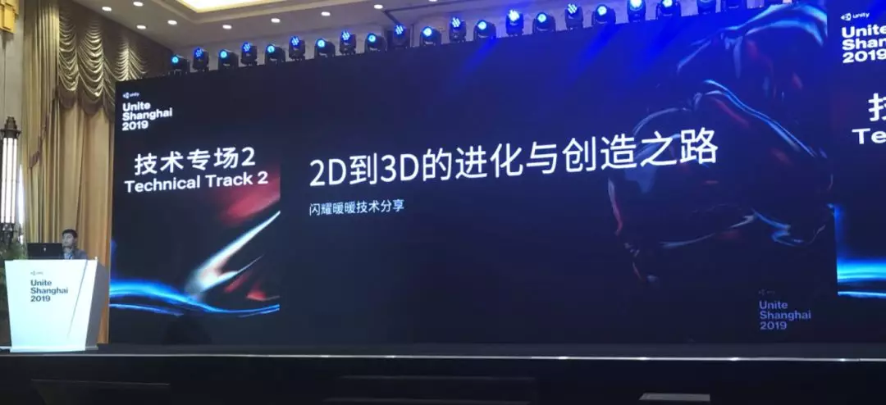

以下为演讲内容整理：

大家好，很荣幸在Unite 2019大会中分享《闪耀暖暖》的思路与收获。

这次分享将由两个人共同完成，我叫张霁，从事游戏行业8年了。2016年初加入叠纸，参与《闪耀暖暖》的研发，今天我会给大家分享一些引擎自定义和工作流的内容。

另一位演讲者是柳丛，他有十几年的开发经验，之前参与过多款次世代游戏的美术研发，今天他将带来一些美术效果的研发心得。

关于《闪耀暖暖》，这是叠纸的第二款Unity项目，我们用的引擎版本最初是Unity5，去年升级到了Unity2018。《闪耀暖暖》是暖暖系列的第四代产品，也是叠纸的首款3D手游。

项目开发前期，我们经历了一些技术和风格上的迭代，起初它甚至并不是一款3D游戏。初期的尝试方向是基于spine来做360度旋转，后面很快转向3D方向。

这个时期我们更多考虑的是如何用卡通渲染还原2D暖暖，如何还原2D暖暖的线条，让3D线条有颜色粗细虚实的变化，这是当时做到的效果。在2016年下半年的时候，对卡通渲染的研究进入了一个瓶颈期，因为想做到期望的品质，要求非常的高，对移动平台压力过大。

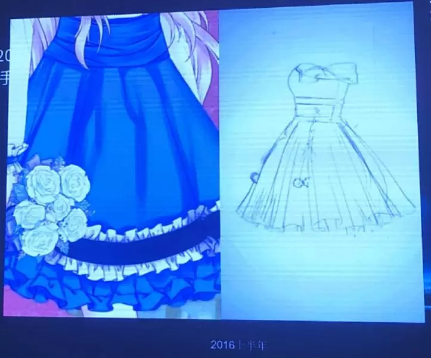

同时3D线条的效果与2D暖暖仍然有较大差距。即使这个差距可以继续缩小，卡通渲染导致的画面过于相似也会让新作缺少独特的吸引力。

这迫使我们回到原点思考问题，换装游戏的根本究竟是什么？我们的答案是漂亮的衣服和多样的穿搭体验。我们将其拆分成几个技术点：衣服的极致细节、穿搭的自由度，以及艺术的传承和创新，这也是我们这次分享的目录。

首先是细节，暖暖系列的基石。3D游戏要想达到足够高的精度，制定合理的美术规格是重要的基础。

我们发现模型面数对性能的影响并不是很大，影响较高的是贴图的分辨率。这是使用1024和2048贴图的表现效果，以及相应的AB占用和渲染耗时。可以看到即使2048在镜头拉近的时候仍然无法达到我们希望的精度，而随着分辨率的增加，包体内存压力迅速增加，也不利于持续更新。

为了解决这个问题，我们使用多层UV和多层贴图拼合，这是达到的效果。精度有了显著的提升，相当于4096的贴图。这个例子里使用了四层UV，四层贴图，总的占用比1024的单张贴图还要小。

《闪耀暖暖》的包体目在是2G多，有一半是3D的容量，其中一半是贴图。如果把这部分全按4K重置，包体会达到10多G。接近一款3A游戏了。同时加载多张4K贴图更会直接撑爆手机内存。使用多UV其实也有巨大的代价，渲染耗时从6.85毫秒到8.67毫秒，增加了26%。

我们对UV的优缺点做了总结，除了精度和包体优势，还有一个好处，就是在制作完成后，有较大的后期调整空间。缺点方面，除了pixel   shader负荷增加较多，多UV会导致贴图数较高。Unity默认采样器的数量等于贴图的数量，这样就要求控制单个材质中贴图的使用，不能超过16张。

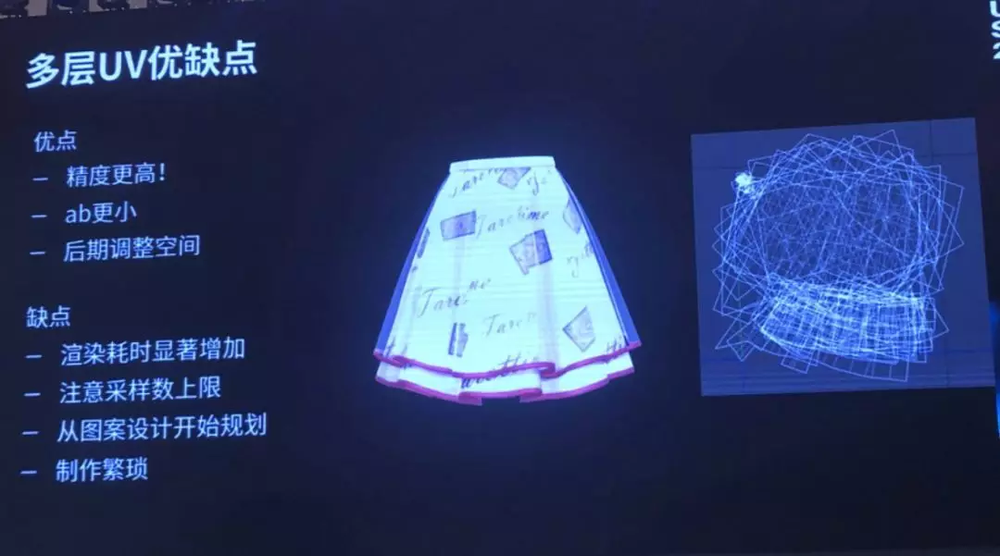

除了硬件和性能上的问题，多UV对于制作也有较大影响。设计时需要考虑图案规划，而制作时需要根据情况对UV进行调整和拆解。例如这个比较简单的裙子，它的UV是这样的。从另外一个方面，UV拆分过于灵活，也会导致这个流程难以推广和流程化。

针对这个问题，我们制定了一套工作流来进行标准化，首先是色块填充构成底色，平铺布纹，接下来印花，最后是风格化处理。对于复杂的服装，可以灵活变通，实现精度的最大化。

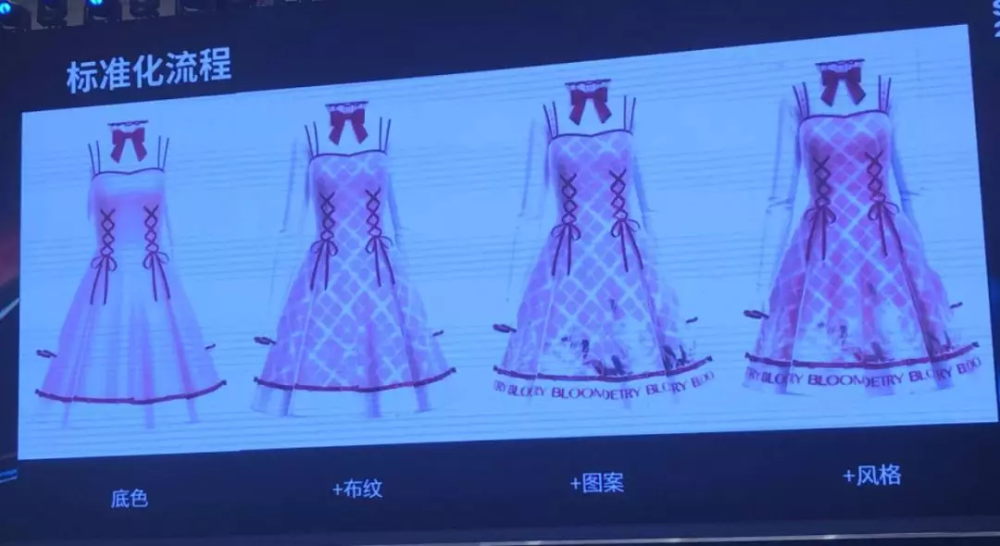

对于一些用贴图也达不到预期精度，我们会通过程序化方式进行细节补充，比如珍珠和宝石等。

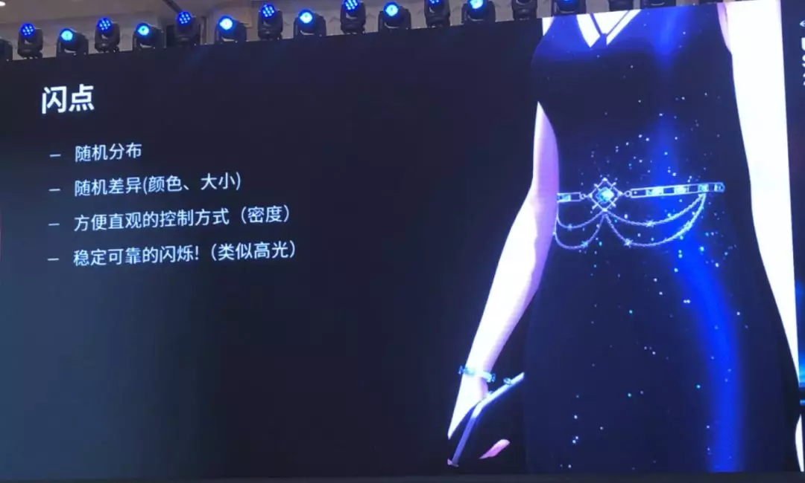

作为例子，分享一下程序化闪点的实现方式。

首先，这个是我们期望闪点能够做到的内容，其实就是一些随机分布的点，点与点之间有一些表现颜色和大小的随机性差异。美术希望能有方便直观的控制方式，比如用密度贴图控制哪些地方需要有更多的点。同时，点的大小分布也能以类似的方式进行控制。其次希望有稳定可靠的闪烁，类似高光的表现。

闪点算法的基础其实很简单，其实就是在UV空间上生成棋盘格，这其实是一个2D的问题，我们可以转化成平面进行考虑。每格的索引就是随机数种子，使用这个随机数种子，可以生成偏移量、缩放和颜色和相位。

接下来是填充格，可以直接填满就是方块。或者柔化处理成菱形或者圆。接下来是根据相位和预设的密度阈值进行剔除，达到密度控制。

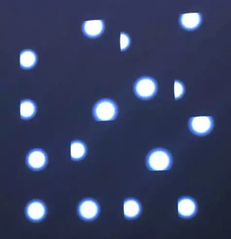

处理偏移的时候，会出现越界的问题，就会出现截断的情况，看起来比较奇怪。

处理越界闪点的方式，就是随着点随机缩小，把偏移量限制在格内。但是这样过于规律，几乎看不出什么变化。

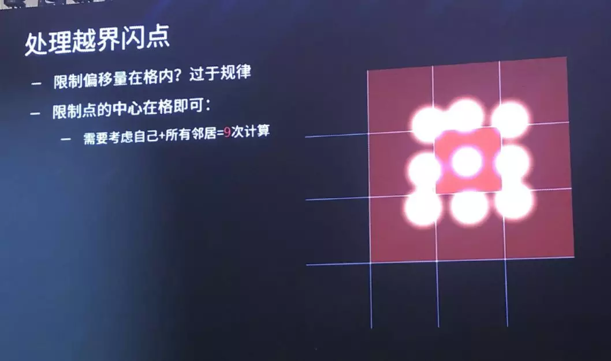

后来我们发现只要限制点的中心在格里就可以了，这样一共是自己加周围8个邻居，共9次闪点相关的计算。可以利用一些情况来合并计算。

由于点的中心不能出框，左邻居只会影响当前格左半边的像素，右邻居只会影响当前格右半边像素，左右两半边可以合并计算。同理，上下两邻居也可以合批计算，四个对角也可以合并计算。上下左右加边角加自己，只需要计算4次闪点相关计算。

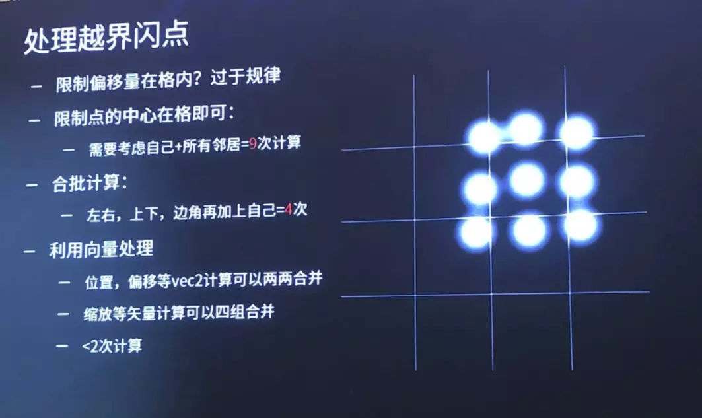

此外，还可以利用GPU的向量计算能力进一步减少计算量。对于偏移等float2计算，可以两两合并为一个float4；对于缩放等矢量计算，可以四组合并，这样最终的开销略小于两次完整的闪点计算。

最后是闪烁处理，我们的处理方式是利用刚才随机生成的相位值调整nh，进行高光计算。同时用一个统一的闪点光滑度控制闪烁程度。

由于我们使用了多UV，加上刚才各种材质特性，还需要实现不同光照模型，这样就会导致我们的shader变成一个庞大的uber shader家族，如何管理shader材质是一个重要的问题。

在工作流方面，一个自定义的材质面板是非常好用的工具，它可以在同一组shader中进行切换。同时可以开关feature，根据特性集来动态调整面板，还可以结合自己的工具进行性能分析、监控和预警。在发布和runtime方面，海量变种对编译速度非常敏感，我们去年把引擎版本从5.6升级到2018，因为2018修复了5.6的重复编译bug，同时大大提升了shader的编译速度。

接下来介绍一下光照系统，由三部分组成，预烘焙的环境光、主灯以及轮廓光。

我们希望有更丰富的光照变化，单LightProbe的效果太单调，没有场景，只能烘焙一个预设的Cubemap。我们的解决方法是沿竖直方向增加LightProbe采样点，让美术增加点光源和方向光作为额外光源，将其直接关照和Cubemap一起合并到环境SH，运行时根据世界坐标的高度在vs中进行插值计算环境光。

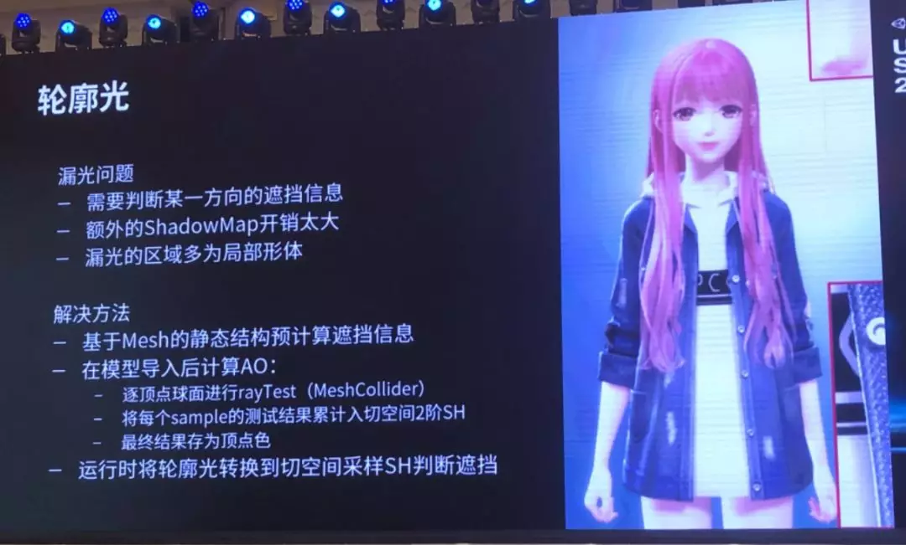

轮廓光方面，可以强调角色轮廓，增强体积感。

在使用轮廓光的时候，发现很多衣服存在漏光的问题，这是因为轮廓光没有ShadowMap计算。注意到漏光区域主要是局部形体，我们可以对Mesh静态结构进行预计算。在模型导入在T-pose下后计算网格每个顶点的遮挡信息。对于每个顶点，在其球面上发射若干条阴影光线，进行碰撞测试。

对于每条阴影光线，将其转化到对应顶点的切空间，并将阴影测试的结果累计入2阶SH中。最终结果是4个浮点数，可以把结果存到顶点色中。运行时把轮廓光转换到切空间采样SH进行遮挡判断。

这个是做到的结果，左侧是有轮廓光的，中间是轮廓光+遮挡，可以看到漏光现象大为缓解。因为SH近似存储所有遮挡信息，动态情况下也可以工作，即使增加轮廓光，也可以用这个方案进行统一解决，性能开销不会显著增加。

下面是阴影处理，由于Unity5的阴影不支持半透明物件投影和受影的，我们自定义了shadow pass。同时根据相机与人物的关系可以提升ShadowMap的利用率。我们把人物的包围体按竖直方向细分，根据相机和每个小段的相交结果，调整的投影矩阵。

此处下侧的图像是Shadow Map的情况，右侧是关闭自适应阴影，左侧是开启，可以看到阴影质量得到了相应的提升。

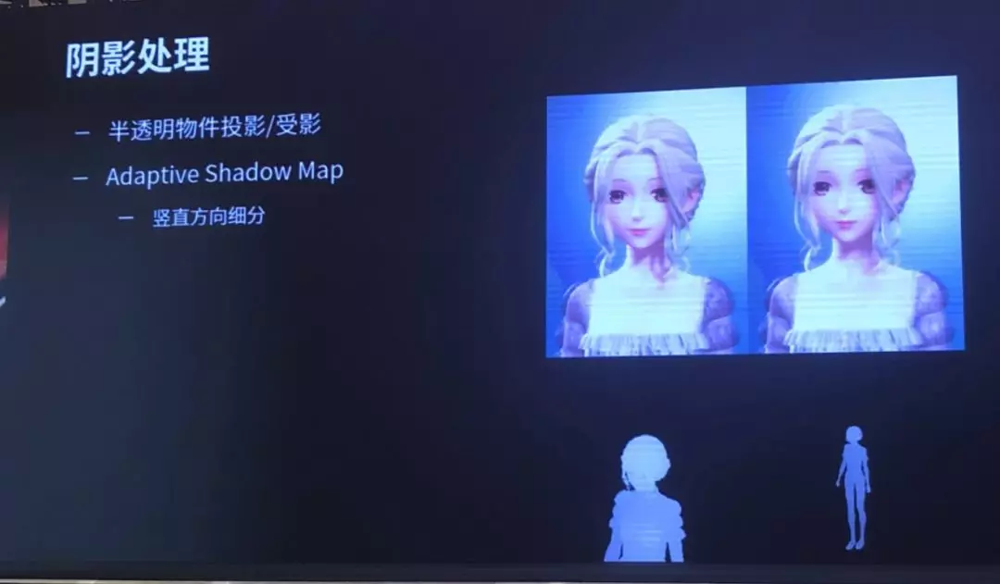

角色的面部是一个重点关注区域，头发尤其是刘海处的投影如果用不透明方式处理会显得过于生硬。我们的处理方式是使用Screendoor   Depth，每4×4像素为一个tile，每像素根据透明度值来顺序丢弃写深度操作。可以看到最后得到的ShadowMap，头发末端有一个点阵的状态。再用一个单独的四分之一大小RT，对皮肤做屏幕阴影蒙版，再进行模糊处理，以获得半透明的阴影效果。

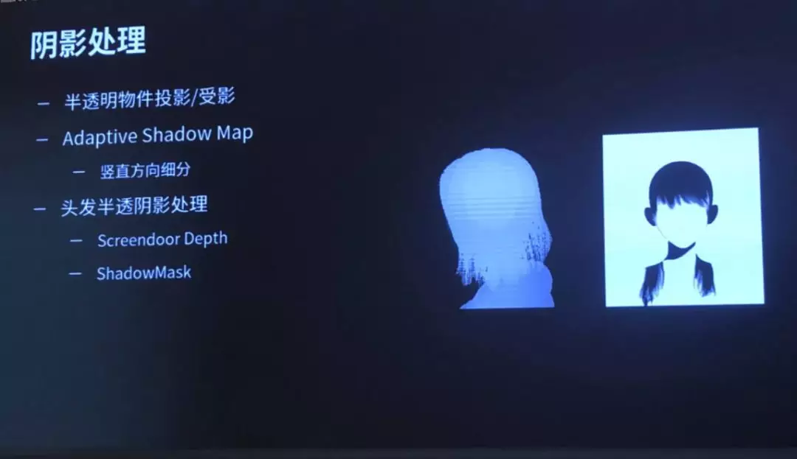

这是最后实现的效果，我专门挑了几个在刘海部分模型非常接近的头发，仅有贴图差异较大，可以看到左边一个，它的半透过渡比较柔和，所以它的阴影也就会淡一些。而右边的实体区域比较多，所以阴影比较锐利。

对于正常投影难以表达的微小部件，或者程序化生成的模型，我们会调整bias，以达到强化阴影的效果。

接下来一个重要的点是穿搭组合的自由度，也是换装游戏可玩性的支持。

由于暖暖系列中衣服版型设计多种多样。我们的绑定设计分为基础骨架和扩展骨架两个部分。基础骨架确定以后，可以在其基础上编辑人物的碰撞体配置，而扩展骨架则需要设置其物理参数。两部分数据合在一起，在运行时，由物理系统计算其动态效率。

由于移动平台性能有限，暖暖系列衣服复杂度又比较高，即使是PC平台也无法完全使用布料系统来做到我们想要的效果。我们的物理系统是一个链式迭代的质点系统，粒子之间可以添加弹簧，用这种方式可以做到简单的布料模拟。

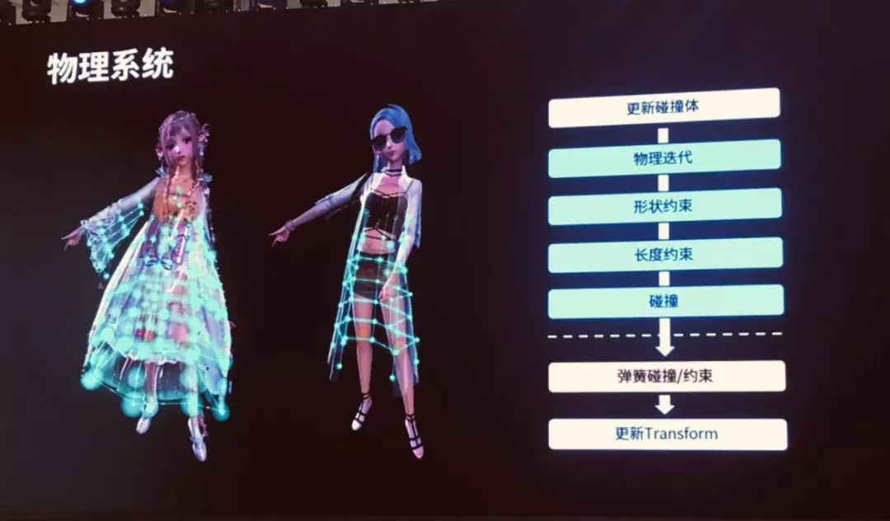

关于碰撞处理，粒子和弹簧都可以作为碰撞处理对象。我们的碰撞体有两类，第一类由跟随基础骨架，包括平面碰撞体和胶囊碰撞体。胶囊碰撞体可以调整两端的大小，让它更贴合人的形体。

在处理腿与裙子的碰撞时，当腿的移动范围较小的时候，能够正确往外推裙子。而腿移动量较大时，腿反而会向内压裙子。我们的解决方法是用弹簧方向和粒子链方向的叉乘向量，作为弹簧的碰撞主方向，当弹簧与胶囊体发生碰撞时，优先朝主方向那一侧推。这样效果更为稳定。

第二类碰撞体跟随扩展骨架。根据服装的骨骼链和邻居结构可以构建出虚拟的网格碰撞体。下图蓝色的点是当前的物理粒子，线是物理骨骼链和邻居结构。我们可以将其转换成黄色所示的虚拟网格。

在运行时，可以查找粒子所最接近的虚拟网格中的三角形，用这个三角形作为平面碰撞。我们使用八叉树管理网格碰撞体中的所有三角形，方便运行时快速查找。网格碰撞体的三角形比较大，过渡比较剧烈，在某些情况下可能会抖动，我们允许在运行时动态取最近的四个三角形，根据距离权重插值进行平滑处理。

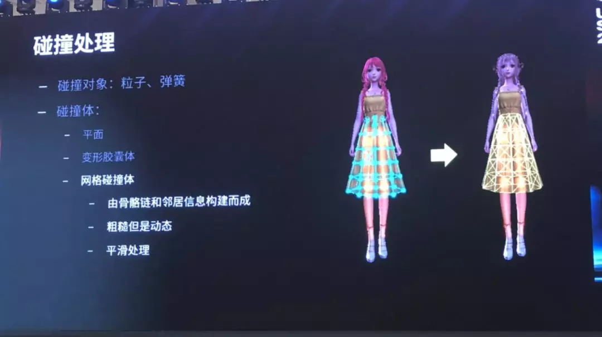

网格碰撞体的另一个作用是可以处理部件间的碰撞，我们为每类部件可以取一个别名，粒子设置它与哪个别名进行碰撞。如图我们设置头发与“裙子”进行碰撞，接下来我们切裙子的时候，只要通过别名，就可以动态寻找到当前所穿的究竟是哪个裙子，这个裙子针对的网格碰撞体是怎样的，可以实时调整头发与网格碰撞体的碰撞。

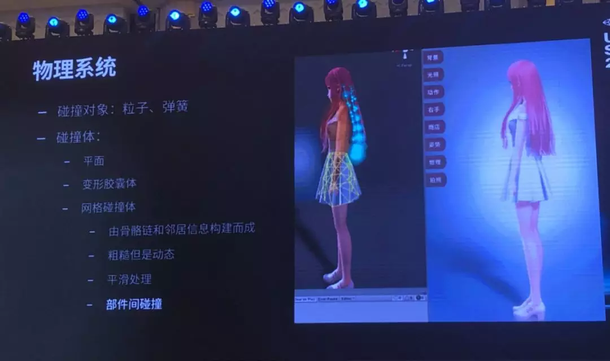

这里我录了一个快速播放的视频，可以看到美术如何用物理编辑器进行可视化编辑以及最终的成品效果。

除了物理系统，《闪耀暖暖》中还有美术修正的方式，如图中这个外套，形状复杂且不规则，如果用物理和碰撞表现会非常差。我们对骨骼用关键帧rbf驱动。下面是四个关键帧，手臂不同朝向情况下，其他五个骨骼对应的位置与旋转的关系。在运行时，可以根据手臂的实际朝向，在这些关键帧中线性插值。

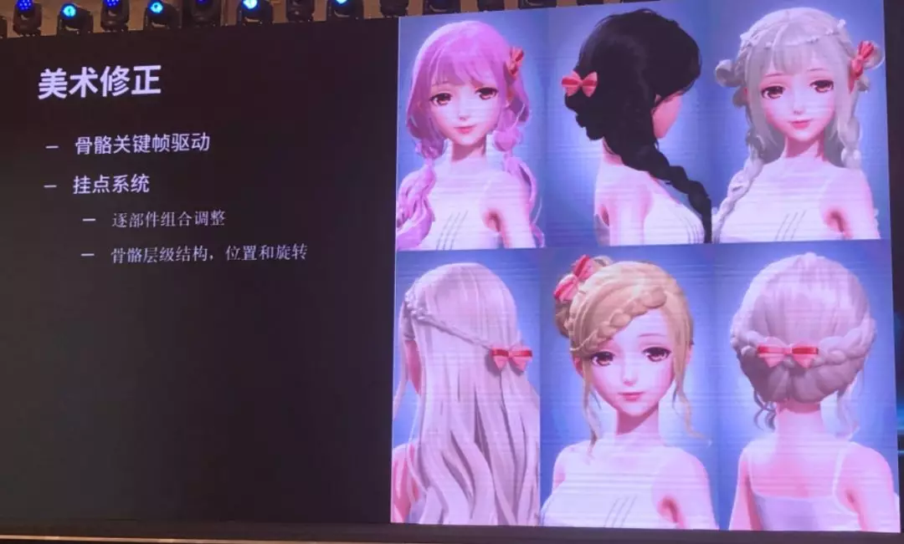

另一个例子是挂点系统，经历多轮迭代以后，现在的方式是逐部件组合进行调整，可以控制不同组合的挂点对象、位置以及旋转。

接下来由柳丛给大家介绍一下美术上的传承与创新。

很高兴今天能来这里为大家分享，今天我为大家介绍下开发过程中的一些重点开发内容，我的标题是“传承与创新”。今天会讲到《闪耀暖暖》比较重点的地方，就是布料的材质效果开发，还有2D风格的表现。

通过认知创新来突破高度，通过流程创新来进行自我革新。这张纹理看上去非常简单，但其实并不简单，我给大家讲讲。

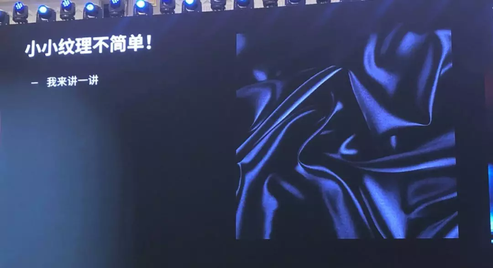

首先，做一件事情的时候肯定要进入一个比较好的状态，我当时的状态是几乎是走火入魔了。经常会蹦出一句：“这材质很PBR！”有时候陪我老婆逛街看到衣服就想摸一摸，搓一搓，拍一拍照。但这个相片很明显是摆拍。

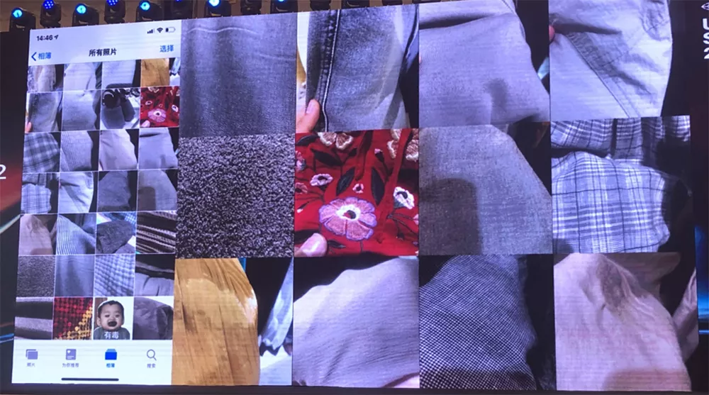

那段时间，我手机里几乎都是这样的状态。因为我觉得很多东西需要基于真实去进行考量，基于真实对它进行美化和改良。艺术毕竟是源于生活而高于生活的存在。

在网上我们可以搜集很多自己需要的资料，但是网上什么资料都有，有好的有坏的。所以要做出高品质的东西就要掌握高品质的信息来源，毕竟眼界决定境界。

那么收集这么多资料干嘛呢？总不能是占内存的。所以要把资料变成有价值的信息。我会对以上我收集的资料进行一些提取，先会做一些分类，然后做简化信息，然后做一些重点提取。

我把一些资料按照自己的分析提取，最终把它汇集成了一个二维编织图。我认为编织这块是组成纹理的非常重要的部分。大家可以看一下，根据不同的编制方式，纹理效果差距是非常大的，我们可以先不要看这个图片上的颜色的变化。

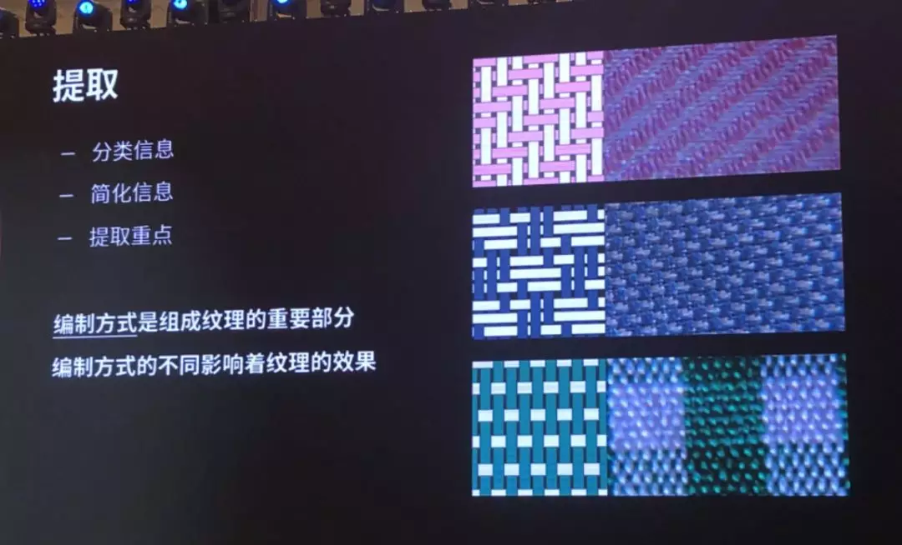

其实这样编的方式有非常多种，可能我现在研究到的程度，也就不到百分之二三十。

一些重要信息已经整理出来，拿就要先试试看，刚开始我选择的是一个比较快捷的方法，因为用建模制作纹理，比较直观，得到的贴图精度也很好，但是也存在很明显的短板。

这是一个法线贴图的效果，问题很明显。制作成本非常大，后面的持续修改成本也是非常大的。但是有问题是件好事情，证明还有很大的优化空间，所以要在现在的流程上做一些明显的改变。

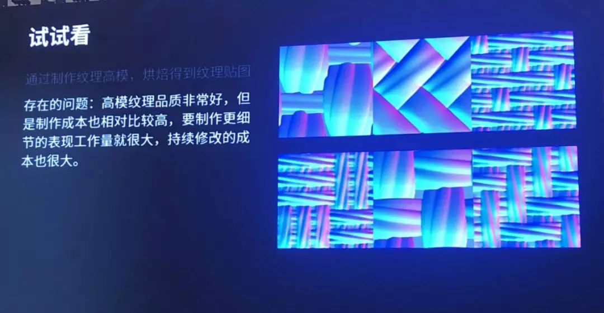

我有几个方式，一个是从繁到简，一个是从慢到快，一个是从难到易。可以看到旁边的瑞士军刀，看上去非常臃肿的感觉。

毕竟工欲善其事，必先利其器，所以我们要做工具上的优化，这时候有一个叫程序纹理的方式进入了我的视野中。

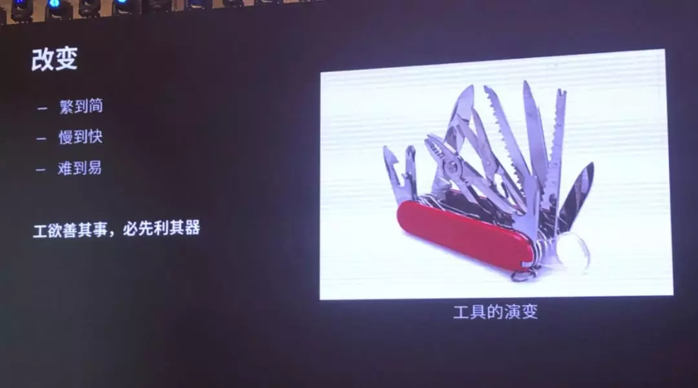

当时尝试了下这个叫Substance   Designer软件，来做程序纹理。这里举个比较简单的例子说明下，这个软件是通过线性的方式对材质进行管理，我可以在这个线性的流程做删除和添加调整来改变结果，但是这样就需要一个很好的规范。所以在制作的时候需要分区，这样修改起来会更方便，在动一个区域的内容就不会影响到其他区域。

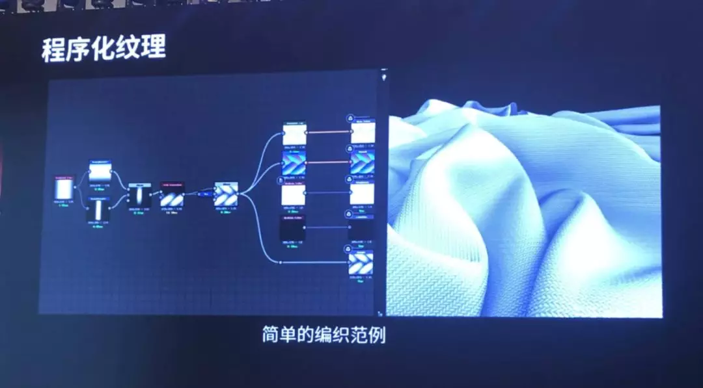

游戏随着游戏行业内各类自动化流程的到来，使用这样的流程，未来可以更快的融入自动化的工作流，加速项目的开发效率。

这里大致给大家做了一个简单的范例，我当时做这个纹理的时候分了三层，一个基础层，一个随机层，还做了一个细节层。这是完成效果的渲染图。

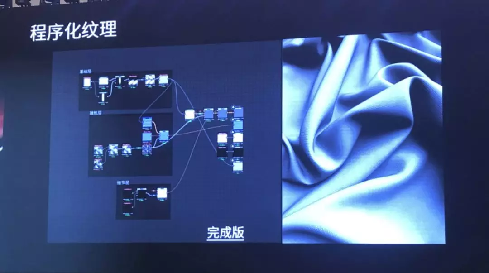

这是我当时做的第一层，做了一个简单的编织效果。

再通过一张随机的机理，针对上面的纹理，做了一些随机性变化。可以理解成，这个布在使用一段时间以后会产生磨损，导致它有一些类似于这样，有些地方层次比较深，有些地方层次比较浅的随机感。

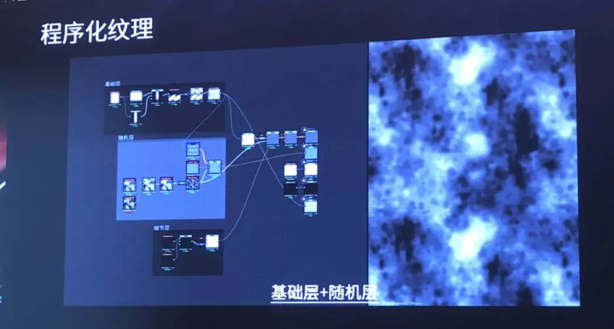

最终我在这里，我加了一些线头的效果，加什么东西都不重要，主要是顺序关系。

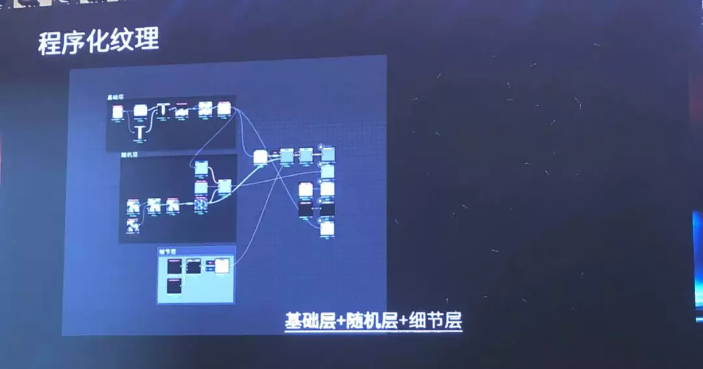

完成版就是刚才看到的渲染图的效果。这里还做了一些其他纹理的效果，做这些纹理的时候，我只针对第一层的纹理层，做了纹理图案的修改，后面两层我没有做任何的修改。

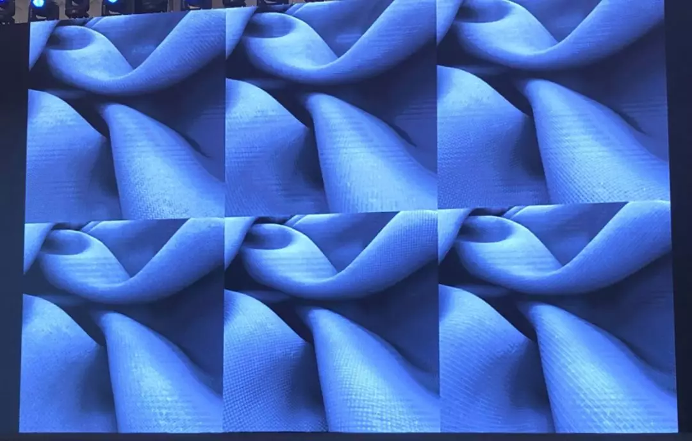

试错在研发过程中是非常重要的一个环节，试错需要很多手段去做，比如说测试环境，需要结果去论证。

当时我使用了这样一块布料检查我的布纹效果。其实我们只需要其中一部分，我们需要几个特质，一个是近景，一个是中景，一个远景。在不同空间下，不同的纹理朝向，就会在这个载体上很清晰的显示出来，这样我们就知道纹理效果的好坏了。同样对这种效果我们也需要用更多的可能性对它进行验证。

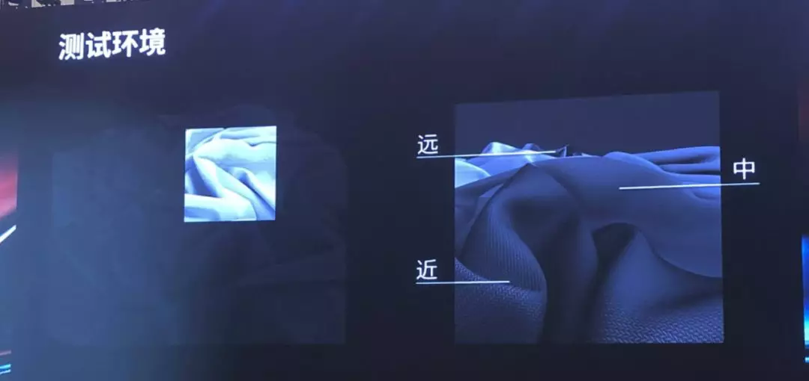

比如这里，我弄了一个黑灰白的布料，还有粗糙的光滑的，来验证它的结果，是否符合我们的要求。

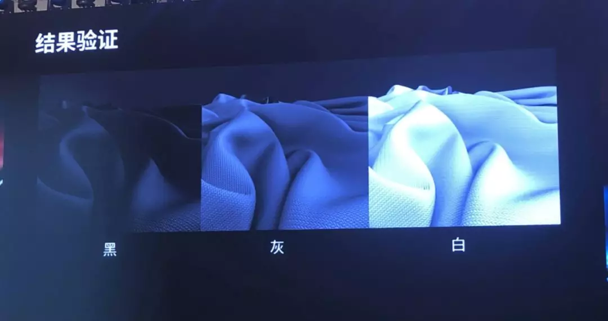

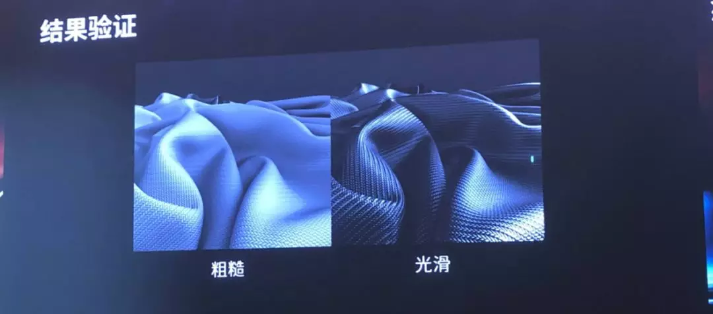

如果需要更多的验证结果，可以尝试这样的色块变化，但是这样的结果会比较累。

再介绍一下我们材质编辑思路，ABCD各代表每个材质模块。通过不同的组合，也就只有11种变化。但是我们在每个材质功能下做做了很多的编辑模式，所以如果是这样的话，那我们的变化就有600多种。我们在Unity里开发了一套自由度非常高的材质编辑工具，是这样的，相当自由。

这些系统开发，我们会编辑出非常多种类的材质。现在我们里面的材质数量已经极其庞大了，而且我们还在一直扩充材质的类型。

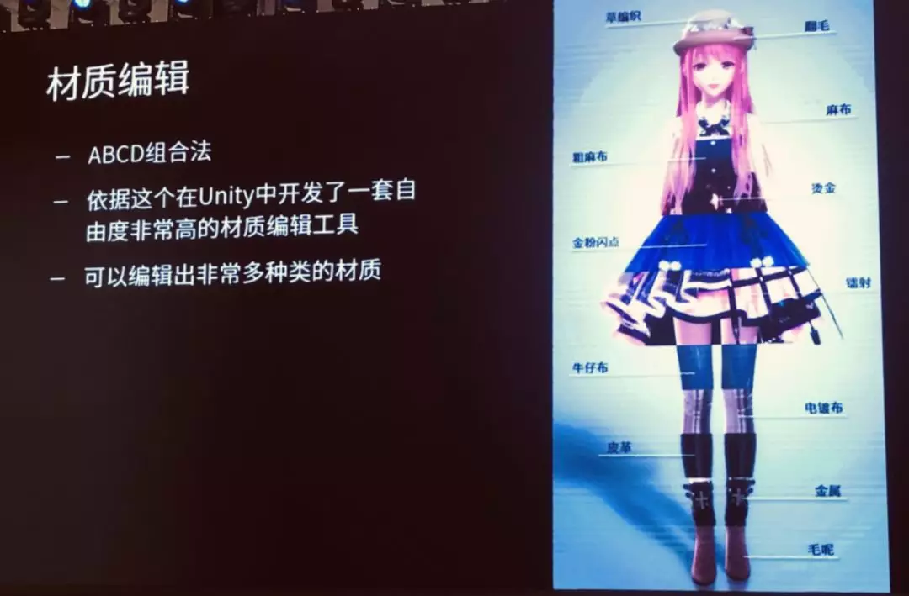

这里再讲一下我们的风格问题，风格的话需要一个最具有代表性的特征，我们当时在选风格的时候选择了笔触效果，这也是暖暖系列独有的风格。大屏幕可能有一点曝，可以看到3D的这个效果，胸口类似于笔触的变化。

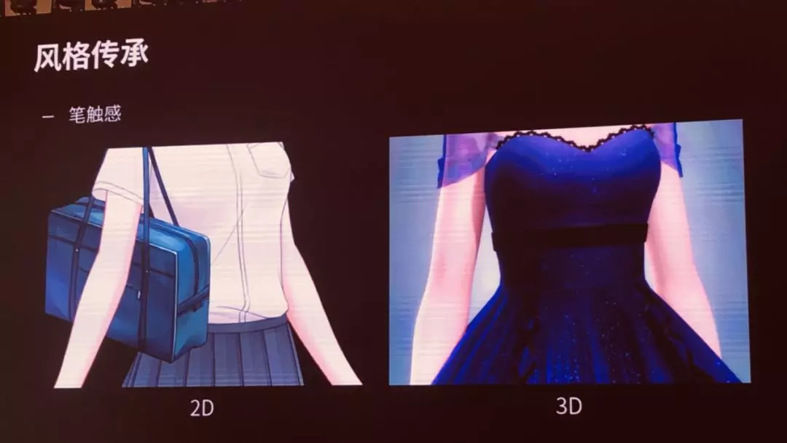

这里是一个成品的效果，我们做了一层类似于AO的方式，在上面绘制了我们的笔触效果，然后添加到其他的贴图在上面。

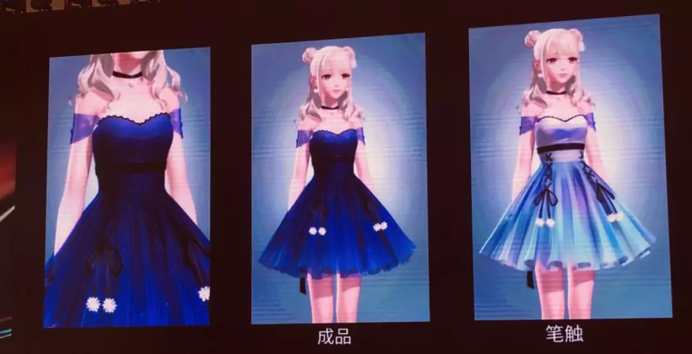

突破的话，我们做了很多特别的突破，比如说贴图精度，刚才张霁也介绍了贴图的精度方法。还有特殊材质的表现，在开发工具上我们也进行了革新。

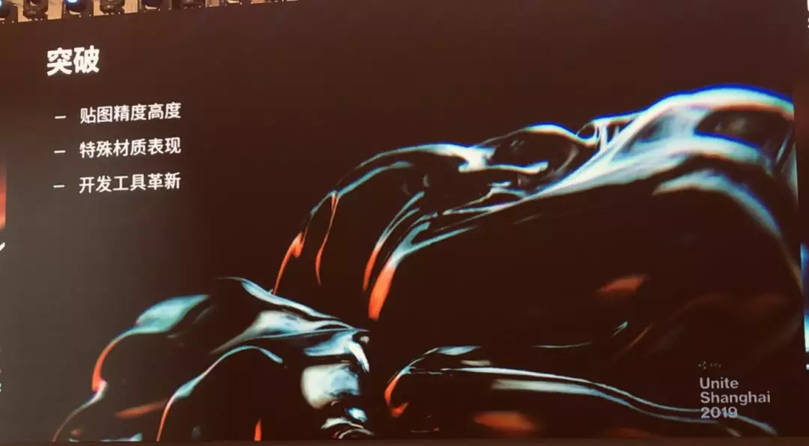

这里可以看一下，这是我们目前的京剧衣服的细节表现。现在我们这个精度，几乎可以放在真人高度的显示器上面去，让玩家可以直接观看。这边我们做了比较特殊的材质，比如镭射的材质效果，为了研究特殊材质，我也在搜集很多类似的资料。

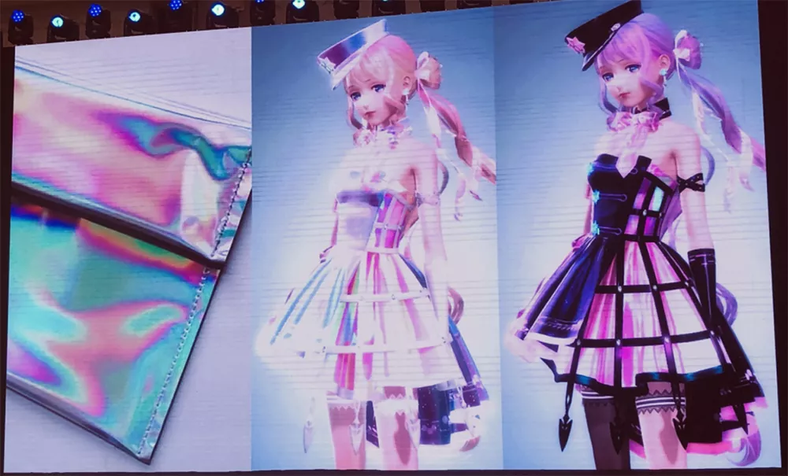

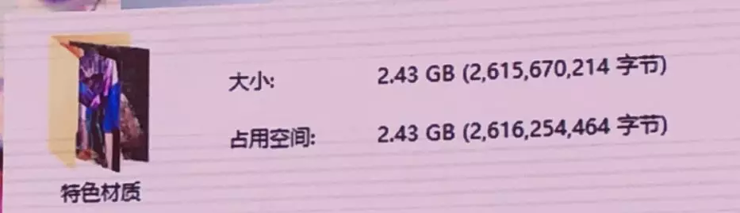

我们近期也加入了3D扫描这样的流程，可能3D扫描最早源于工业行业，会用它做逆向工程。在游戏行业，现在也开始被越来越多的人关注，通过扫描实物，获得一个模拟的3D模型。

扫描对我们来说，意义就是两点，一个是还原真实，一个是高效产出。我们操作的时候，发现扫描模型几乎不可能直接使用，很多东西需要修改，但是扫描出来的东西有一个符合真实的外轮廓，这个东西，很多美术制作人员在制作的时候很难抓准。但是对我们来说这个不是最重要的，产出对我们来说才是非常重要的，我发现投入制作后效率提升了700%，不仅提高制作效率，也降低了反馈成本。

这是我们使用3D扫描仪的实录，非常快就可以得到所扫描物体的高模模型数据。

今天要讲的内容就到这里了，谢谢大家！

附媒体采访：

**游戏葡萄：为什么叠纸会考虑尝试2D到3D的转变？**

**张霁：**我们发现，很多玩家在接触2D版暖暖的时候，会对里面的一些服饰细节和图案非常感兴趣，会去欣赏官方大图上的细节，针对这种诉求，我们一开始就希望能够在新作中把细节的表现做的更好，能让玩家在游戏里面就可以看到所有细节。

另外，在以往2D模式下，玩家看到的服饰只是一个正面视角的形象，但大家也想知道侧面、背面的设计。因此我们希望通过3D的表现形式，让玩家自由观赏到人物和服饰的每一面，呈现出更加鲜活的视觉效果，给玩家带来更好的体验。

**游戏葡萄：在制作过程中遇到了哪些挑战，实现了哪些突破？**

**张霁：**技术的挑战有蛮多，比如我们对于细节不断打磨的过程；又如因为3D展示更全面导致制作时不仅要考虑穿着问题，还要考虑发饰与头发的交互关系；延伸出来还有裤形和靴子之间的关系。很多细节都需要做比较多的基数调整。

突破就是实现了大量的细节表现，比如让同一个发饰配合不同的发型会有不同的佩戴关系和方式，在同时穿喇叭裤和靴子时，裤腿会自动塞进靴子里等等。

**游戏葡萄：《闪耀暖暖》的开发给叠纸游戏的制作团队带来了怎样的提高？**

**张霁：**《闪耀暖暖》是叠纸的首款3D游戏，在这之前其实叠纸没有3D开发的相关经验，也没有3D开发相应的团队。在这款游戏的开发过程中，我们打造出来一支有执行力、能够达到我们目标和制作要求的团队，积攒经验以后，就可以挑战更高的目标。
