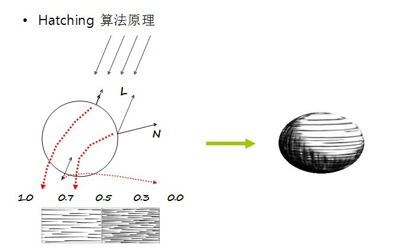
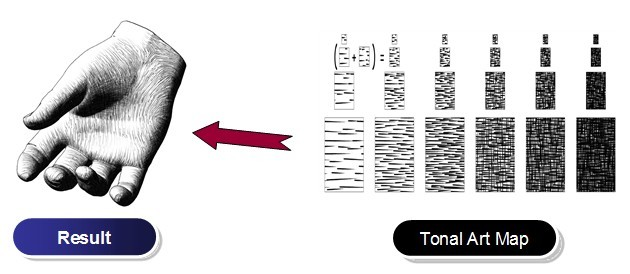

*Hatching*（素描）渲染——通过光照的强弱，用不同深浅的纹理，实现一种类似素描效果。

 

 

*Hatching*的实现原理是：通过*N.L*计算点受光的强弱，将该值分成不同的段，不同的光照强度对应不同深浅的素描贴图

 

 

来自 <<https://blog.csdn.net/tianhai110/article/details/5668757>> 

VS_OUTPUT vs_main( VS_INPUT Input )

{

   VS_OUTPUT Output;

 

   Output.Position = mul( Input.Position, matViewProjection );

   Output.Texcoord = Input.Texcoord;

   

   float3 normalW = mul( Input.Normal, matView);

   float diffuse = min( 1, max(0, dot( vecLightDir, normalW)));

 

//把diffuse平方两次是为了，把亮度降低点，把整体亮度向暗方向偏移，以得到更好的视觉效果。

   diffuse = diffuse * diffuse;

   diffuse = diffuse * diffuse;

   

   float factor = diffuse * 6.0;

// 通过两个weight,来记录权值，减少传入ps的变量数。

   float3 weight0 = 0.0;

   float3 weight1 = 0.0;

   

// 不同光照强度，对应不同的权值，及不同的纹理贴图

   if( factor > 5.0)

   {

​      weight0.x = 1;

   }

   else if( factor > 4.0)

   {

​      weight0.x = factor - 4.0;

​      weight0.y = 1.0 - weight0.x;

   }

   else if( factor > 3.0)

   {

​      weight0.y = factor - 3.0;

​      weight0.z = 1.0 - weight0.y;

   }

   else if( factor > 2.0)

   {

​      weight0.z = factor - 2.0;

​      weight1.x = 1.0 - weight0.z;

   }

   else if( factor > 1.0)

   {

​      weight1.x = factor - 1.0;

​      weight1.y = 1.0 - weight1.x; 

   }

   else if( factor > 0.0)

   {

​      weight1.y = factor;

​      weight1.z = 1.0 - weight1.y;

   }

   Output.Weight0 = weight0;

   Output.Weight1 = weight1;

   

   return( Output );

   

}

\--------------------- 

 

 

struct PS_INPUT

{

   float2 tex     : TEXCOORD0;

   float3 weight0 : TEXCOORD1;

   float3 weight1 : TEXCOORD2;

};

 

float4 ps_main( PS_INPUT input) : COLOR0

{  

   float4 hattch0 = tex2D(hattch0Map, input.tex)*input.weight0.x;

   float4 hattch1 = tex2D(hattch1Map, input.tex)*input.weight0.y;

   float4 hattch2 = tex2D(hattch2Map, input.tex)*input.weight0.z;

   float4 hattch3 = tex2D(hattch3Map, input.tex)*input.weight1.x;

   float4 hattch4 = tex2D(hattch4Map, input.tex)*input.weight1.y;

   float4 hattch5 = tex2D(hattch5Map, input.tex)*input.weight1.z;

   

   return hattch0 + hattch1 + hattch2

​         \+ hattch3 + hattch4 + hattch5;

   

}
