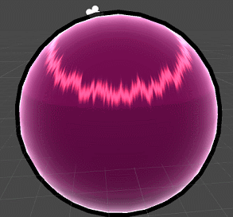
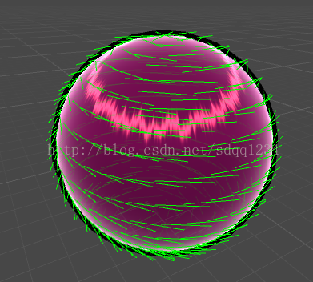
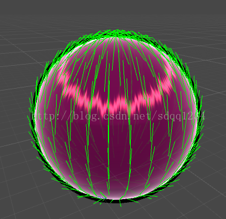
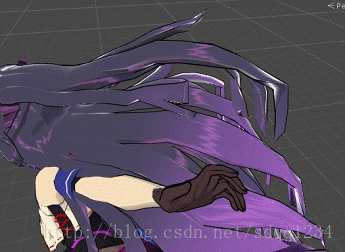

# 日式卡通渲染的效果的unity实现

最近沉迷崩坏3无法自拔，为了能够亲手造出芽衣姐姐，我在网上找了一篇日式卡通渲染的文章，终于在我的不屑努力（上班偷懒）下，写出了能让芽衣姐姐变漂亮的卡通shader来。这篇文章在这里。


###  [3D日式卡通人物渲染的经验分享](http://gad.qq.com/article/detail/65)


我不知道这是哪个游戏的角色，但是成品看上去感觉非常不错，于是我就根据这篇文章在unity里实现了里面的效果。

效果如下




这里包括的效果有 ：梯度漫反射，轮廓线，基于切线的高光，边缘光。这四个效果。

根据那篇文章里的描述，我进行了一些公式参数上的修改，完全按照文章里的公式，在unity里得不到这个效果的。


首先是勾边：

这里勾边我只实现了最简单的渲染背面，然后沿着法线向外扩一圈的效果，这里单独开了一个pass来渲染


```csharp
Tags { "RenderType" = "Opaque" "Queue" = "Geometry" }


			LOD 100


			Pass


			{


				Name "OUTLINE"


				Cull Front


				CGPROGRAM


			


				#pragma vertex vert


				#pragma fragment frag


			


				#include "UnityCG.cginc"


			


				float _Outline;


				


				fixed4 _OutlineColor;


			


				struct a2v {


					float4 vertex : POSITION;


					float3 normal : NORMAL;


					float4 texcoord : TEXCOORD0;


					float4 tangent : TANGENT;


				}; 


			


				struct v2f {


					float4 pos : SV_POSITION;


					float2 uv : TEXCOORD0;


					float3 worldViewDir  : TEXCOORD1;


					float3 worldNormal : TEXCOORD2;


				};


			


				v2f vert (a2v v) 


				{


					v2f o;


 


					float4 pos = mul(UNITY_MATRIX_MV, v.vertex);//顶点变换到视角空间 View Space


					float3 normal = mul((float3x3)UNITY_MATRIX_IT_MV, v.normal);//法线变换到视角空间


					normal.z = -0.5;


					float4 newNormal = float4(normalize(normal), 0); //归一化以后的normal


					pos = pos + newNormal * _Outline; //沿法线方向扩大_Outline个距离


					o.pos = mul(UNITY_MATRIX_P, pos);


 


					float3 worldPos = mul(unity_ObjectToWorld, v.vertex).xyz;


					o.worldViewDir = _WorldSpaceCameraPos.xyz - worldPos;//得到世界空间的视线方向


					o.worldNormal = mul(v.normal, (float3x3)unity_WorldToObject);


 


					return o;


				}


			


				float4 frag(v2f i) : SV_Target 


				{ 


					return float4(_OutlineColor.rgb, 1);;


				}


			


				ENDCG


			}
```

 这段代码我直接使用了 《unity shader入门精要》这本书里的代码，具体原理就是渲染模型背面并向法线方向扩大Outline个距离来实现边缘。 


本来还想在脚本里实现细节勾边的，原理就是那个文章里写的判断一条边相邻两个三角形的法线角度大于某个值就画这条线。然后这个查找方法我一直没写出来，自己写了几个，效果都不对。如果有大神知道怎么写的话，还请指导一下。 


剩下的几个效果全都在另一个pass里了。

第二个是 梯度漫反射，其实是就是漫反射再和一个一维梯度纹理采样的颜色相混合，这个技术也是目前大部分卡通渲染技术里常用的，用来模拟卡通里条带状的亮部和暗部。

这个梯度反射图我们定义成  _Ramp("Ramp Texture", 2D) = "white" {}，然后在计算漫反射光照图里做一个一维采样。


```csharp
//漫反射贴图采样


fixed4 c = tex2D (_MainTex, i.uv);


fixed3 albedo = c.rgb * _Color.rgb;


				


fixed3 ambient = UNITY_LIGHTMODEL_AMBIENT.xyz * albedo;


				


UNITY_LIGHT_ATTENUATION(atten, i, i.worldPos);//阴影值计算


				


fixed diff =  dot(worldNormal, worldLightDir); //世界空间的法线坐标和光照方向点乘得到漫反射颜色


diff = (diff * 0.5 + 0.5) * atten; //暗部提亮  当然这里也可以不提亮


				


//将光线颜色和环境光颜色以及梯度图采样相乘得到最终的漫反射颜色


fixed3 diffuse = _LightColor0.rgb * albedo * tex2D(_Ramp, float2(diff, diff)).rgb;
```


接下来是比较出效果的基于切线的头发高光。这里也是借用了之前文章的理论，使用一张扰动图沿着物体切线方向扰动法线来达到效果。具体代码如下


```csharp
//头发高光图采样


float3 speTex = tex2D(_HairLightRamp, i.hairLightUV);


//头发主高光偏移				


float3 Ts =i.tangent + worldNormal*_MainHairSpecularOff * speTex;


//头发主高光值


float specMain = HairSpecular(worldHalfDir,Ts, _MainHairSpecularSmooth);
```

 因为考虑到要重复贴，所以这里我用了一个新的uv  i.hairLightUV来保存头发高光图的采样，这样美术可以调整高光反射的密度。Ts为头发主高光的偏移，使用了切线i.tangent方向，这里要注意的地方是，切线值必须转换为世界空间坐标，然后unity里默认的切线并不是沿着发梢到发根的方向，而是垂直于发梢到发根的方向，所以为了得到正确的方向，这里的切线其实已经转换为了副切线，使用原有的切线值去  叉乘法线 


```csharp
//求出沿着发梢到发根方向的切线


half4 p_tangent = mul(unity_ObjectToWorld, v.tangent);


o.tangent = normalize(p_tangent).xyz;


o.tangent = cross(o.tangent, o.worldNormal);
```

原有切线方向 




 点乘之后的切线方向



得到正确的切线方向以后，接下来就是核心的高光计算公式


```csharp
float HairSpecular(fixed3 halfDir, float3 tangent, float specularSmooth)


{


	float dotTH = dot(tangent, halfDir);


	float sqrTH =max(0.01,sqrt(1 - pow(dotTH, 2)));


	float atten = smoothstep(-1,0, dotTH);


 


	//头发主高光值


	float specMain = atten * pow(sqrTH, specularSmooth);


	return specMain;


}
```

这里halfDir是半角方向，也就是视线方向加上光线方向 

fixed3 worldHalfDir = normalize(worldLightDir + worldViewDir);

然后tangent是计算出来的副切线方向，也就是下面那张图的方向，specularSmooth是光滑度，也就是高光的照射范围。

里面的计算公式就是文章说的这块


 最后计算主高光值

float specMain = HairSpecular(worldHalfDir,Ts, _MainHairSpecularSmooth);

合成的时候将高光颜色和阴影颜色一起混合得到最终高光颜色

fixed3 specular = _Specular.rgb * specFinal * atten;


最后是边缘光，边缘光是比较简单和常用的效果了，原理是使用视线方向和法线方向做点积，角度越大的地方值就越接近0


```csharp
half edge =abs(dot(worldNormal, worldViewDir)); //计算边缘光


float Fr = pow(1 - edge, _ReflectionCount)* atten;//反射值
```

这里Fr也乘以了阴影值，让处在阴影里的边缘不会出现边缘光。但是这个效果好不好，最终还是要和模型挂钩 

最后把之前算出来的高光，漫反射，边缘光混合起来

fixed4(ambient + diffuse + specular, 1.0 )  + Fr;
 得到最终颜色并返回。

这样就能得到最终效果了。

完整的pass代码如下。


```csharp
Pass {


			Tags { "LightMode"="ForwardBase" }


			


			Cull off


		


			CGPROGRAM


		


			#pragma vertex vert


			#pragma fragment frag


			


			#pragma multi_compile_fwdbase


		


			#include "UnityCG.cginc"


			#include "Lighting.cginc"


			#include "AutoLight.cginc"


			#include "UnityShaderVariables.cginc"


			


			fixed4 _Color;


			sampler2D _MainTex;


			float4 _MainTex_ST;


			sampler2D _Bump;


			float4 _Bump_ST;


			sampler2D _Ramp;


			float _DetailOutLineSize;


			fixed4 _DetailOutLineColor;


			fixed4 _Specular;


			fixed _SpecularScale;


			fixed _MainHairSpecularSmooth;


			fixed _FuHairSpecularSmooth;


			float _MainHairSpecularOff;


			float _FuHairSpecularOff;


			sampler2D _HairLightRamp;


			float4 _HairLightRamp_ST;


			float _RefractionCount;


			float _ReflectionCount;


			float _edgeLightOff;


			sampler2D _LightMapMask;


		


			struct a2v {


				float4 vertex : POSITION;


				float3 normal : NORMAL;


				float4 texcoord : TEXCOORD0;


				float4 tangent : TANGENT;


			}; 


		


			struct v2f {


				float4 pos : POSITION;


				float2 uv : TEXCOORD0;


				float3 worldNormal : TEXCOORD1;


				float3 worldPos : TEXCOORD2;


				


				SHADOW_COORDS(3)


					float3 tangent : TEXCOORD4;


				float2 hairLightUV:TEXCOORD5;


				float2 uv_Bump : TEXCOORD6;


				float3 normal : TEXCOORD7;


			};


			


			v2f vert (a2v v) {


				v2f o;


				


				o.pos = mul( UNITY_MATRIX_MVP, v.vertex);


				o.normal = v.normal;


				o.uv = TRANSFORM_TEX (v.texcoord, _MainTex);


				o.hairLightUV = TRANSFORM_TEX(v.texcoord, _HairLightRamp);


				o.uv_Bump = TRANSFORM_TEX(v.texcoord, _Bump);


				o.worldNormal  = UnityObjectToWorldNormal(v.normal);


				o.worldPos = mul(unity_ObjectToWorld, v.vertex).xyz;


				TRANSFER_SHADOW(o);


				//求出沿着发梢到发根方向的切线


				half4 p_tangent = mul(unity_ObjectToWorld, v.tangent);


				o.tangent = normalize(p_tangent).xyz;


				o.tangent = cross(o.tangent, o.worldNormal);


				return o;


			}


			


			float HairSpecular(fixed3 halfDir, float3 tangent, float specularSmooth)


			{


				float dotTH = dot(tangent, halfDir);


				float sqrTH =max(0.01,sqrt(1 - pow(dotTH, 2)));


				float atten = smoothstep(-1,0, dotTH);


 


				//头发主高光值


				float specMain = atten * pow(sqrTH, specularSmooth);


				return specMain;


			}


 


			float3 LightMapColor(fixed3 worldLightDir,fixed3 worldNormalDir,fixed2 uv)


			{


				float LdotN = max(0, dot(worldLightDir, worldNormalDir));


				float3 lightColor = LdotN * tex2D(_LightMapMask, uv);


				return lightColor;


			}


 


			float4 frag(v2f i) : SV_Target { 


				fixed3 worldNormal = normalize(i.worldNormal);


				fixed3 tangentNormal = UnpackNormal(tex2D(_Bump, i.uv_Bump));


				fixed3 worldLightDir = normalize(UnityWorldSpaceLightDir(i.worldPos));


				fixed3 worldViewDir = normalize(UnityWorldSpaceViewDir(i.worldPos));


				fixed3 worldHalfDir = normalize(worldLightDir + worldViewDir);


				


				//漫反射贴图采样


				fixed4 c = tex2D (_MainTex, i.uv);


				fixed3 albedo = c.rgb * _Color.rgb;


				


				fixed3 ambient = UNITY_LIGHTMODEL_AMBIENT.xyz * albedo;


				


				UNITY_LIGHT_ATTENUATION(atten, i, i.worldPos);//阴影值计算


				


				fixed diff =  dot(worldNormal, worldLightDir); //世界空间的法线坐标和光照方向点乘得到漫反射颜色


				diff = (diff * 0.5 + 0.5) * atten; //暗部提亮  当然这里也可以不提亮


				


				//将光线颜色和环境光颜色以及梯度图采样相乘得到最终的漫反射颜色


				fixed3 diffuse = _LightColor0.rgb * albedo * tex2D(_Ramp, float2(diff, diff)).rgb;


				


				//头发高光图采样


				float3 speTex = tex2D(_HairLightRamp, i.hairLightUV);


				//头发主高光偏移				


				float3 Ts =i.tangent + worldNormal*_MainHairSpecularOff * speTex;


				//头发副高光偏移


				float3 Tf = i.tangent + worldNormal*_FuHairSpecularOff * speTex;


				


				//头发主高光值


				float specMain = HairSpecular(worldHalfDir,Ts, _MainHairSpecularSmooth);


				float specFu = HairSpecular(worldHalfDir,Tf, _FuHairSpecularSmooth);


 


				float specFinal = specMain ;


 


				fixed3 specular = _Specular.rgb * specFinal * atten;


 


				half edge =abs(dot(worldNormal, worldViewDir)); //计算边缘光


				float Fr = pow(1 - edge, _ReflectionCount)* atten;//反射值


				float Ft = pow(edge, _RefractionCount)* atten;//折射值


 


				fixed3 lightMapColor = LightMapColor(worldLightDir, worldNormal,i.uv).rgb;


 


				//计算法线勾边


				//half normalEdge = saturate(dot(i.normal, worldViewDir));


				//normalEdge = normalEdge < _DetailOutLineSize ? normalEdge / 4 : 1;


 


				return fixed4(ambient + diffuse + specular, 1.0 )  + Fr;


			}


		


			ENDCG


		}
```

然后最后要注意添加一个 FallBack "Diffuse"，这样unity的shaderlab才能找到shadowcast的pass来从产生阴影。

 最后我们来看看芽衣姐姐的头发用上这个shader的效果 

