# 非真实感的阴影算法


本节将会介绍非真实感的阴影算法。对于人物角色和大多数模型，我们结合了一系列依赖视角和非依赖视角的部分。如下图所示。


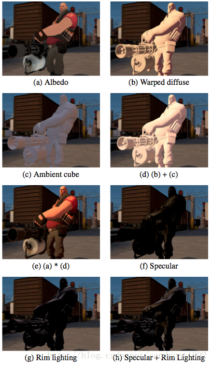

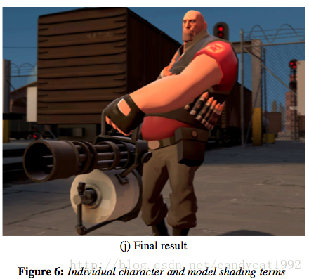


非依赖视角的部分由一个空间变化的平行环境光部分加上一个修改后的兰伯特光照部分。依赖视角的部分由Phong高光和自定义的边缘光照部分组成。所有这些光照部分是逐像素计算而得，并且大多数材质特性，包括法线、反射率、镜面反射部分以及各种这样的遮罩由贴图采样而得。在下面的两个章节中，我们将会讨论每一个光照部分和传统方法有什么不同，并且是如何影响我们的效果的。


## 5.1 非依赖视角的光照部分


非依赖视角的部分由一个空间变化的平行环境光部分加上一个修改后的兰伯特光照部分。它可以用下列等式（1）表示：

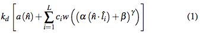


其中，L是光源数量，i是光源索引，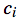是光源i的颜色，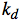是由贴图映射得到的对象的反射率（albedo），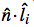是一个传统的关于光源i的unclamped Lambertian term，常量α、β、γ分别是Lambertian term的放缩、偏移和指数部分，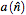是一个为每一个像素的法线n评估平行环境光部分的函数，w()则是一个将0-1范围的标量映射到一个RGB颜色的变形函数。


**半兰伯特（Half Lambert）**	等式1中第一个不同寻常的部分就是应用到的放缩、偏移和指数部分。由于我们的第一个游戏《半条命》，我们使用了0.5倍的放缩、0.5的偏移量以及平方来防止角色丢失在背光面的形状（α = 0.5、β = 0.5、γ = 2）。尽管在现在的游戏中需要更多的真实感，我们仍然采用这些设置，以便让点乘的结果（范围是-1到+1）转换到0到1，并且有一个令人满意的衰减区。由于兰伯特部分的0.5倍放缩和0.5大小的偏移，我们将这种技术称为“半兰伯特”。在《军团要塞2》中，我们让α = 0.5、β = 0.5但γ = 1，因为我们可以通过w()函数得到任何想要的阴影。


**漫反射变形函数（Diffuse Warping Function）**		等式1中第二个有趣的地方是变形函数w()。这个函数的目标是在引入商业插画中那些漂亮的明暗交接的同时，保持半兰伯特的阴影信息。在《军团要塞2》中，该变形函数使用一个1维贴图进行查找映射，如下图所示。这种方式间接地创建了一个“硬阴影”，我们在保留所有法线对光照的变化的同时，收紧了明暗交界处从亮到暗的跳变。如上图中的6(b)。


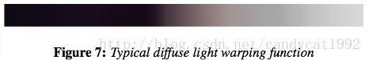


**注释：**由图可以看出，在明暗交替处的变化很快，因此达到了收紧的目的。


除了上述常见的“阴影”作用外，这个一维的变形图片还有一些有趣的特性。首先，最右测的值不是白色，而是只比mid-gray稍稍明亮点的颜色。这是因为在查找完这张贴图后还需要乘以2（这样会变得更明亮了），这样允许美术人员可以更好地控制明暗。还有一点很重要。这张贴图被分为了三个部分：右侧的灰度梯度部分，左侧的冷色梯度部分，以及中间较小的发红的分界线部分。这和我们之前观察的插画阴影的变化是一致的，也就是说是趋于冷色而不是黑色，并且在分解处通常是有一点微红的。正如等式1所示，变形函数作用于半兰伯特因子后，得到一个RGB颜色，然后再和微调过的（光源的颜色）相乘，最终得到一个漫反射光照部分，如图6b所示。


**平行环境光部分（Directional Ambient Term）**		

除了简单的变形漫反射光照部分的和以外，我们还应用了一个平行环境光照部分，。

尽管表示方式不同，但是我们的平行环境光部分和一个环境辐射光照映射（inrradiance  environment map，[Ramamoorthi and Hanrahan  2001]）是等同的。但是，我们没有使用一个9项的球面调谐公式（a 9 term spherical harmonic  basis），而是使用了一个修改后的6项公式，我们称为“环境光盒子”（ambient  cube），它使用了沿x、y、z正负方向延伸的余弦平方来实现[McTag- gart 2004] [Mitchell et al.  2006]。我们使用离线的radiosity solver计算这些环境盒子，并把它们存储在一个辐射量（an irradiance  volume）中，以便实时访问[Greger et al.  1998]。尽管这个光照部分很简单，如图6c所示，这个环境光盒子部分提供了反射光线的信息，而这是渲染游戏中的人物和其他模型的关键基础。


这些视角无关的光照部分相加起来的最终结果如图6d所示，然后再和模型的颜色反射率（albedo，图6a）相乘，得到的结果如图6e所示。


## 5.2 依赖视角的光照部分


我们的依赖视角的光照部分由传统的Phony镜面高光模型和一个自定义的边缘高光部分组合而成。等式（2）如下：

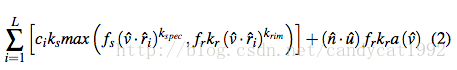


其中，L是光源数量，i是光源索引，是光源i的颜色，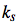是被嵌入到一个纹理通道中的镜面高光遮罩（specular mask），是视角向量，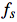是一个由美术调整的为镜面高光而设的菲涅耳（Fresnel）因子，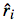是光源i的方向向量相对于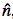的反射向量，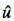是世界坐标系中的方向向上的单位向量（up vector），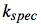是一个由一张纹理映射而得的镜面反射的指数部分，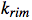是一个常量指数部分，用于控制边缘高光的宽度（越小越宽），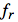是另一个菲涅耳因子，用于修饰边缘高光（通常就是使用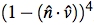），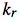是一个边缘遮罩纹理（rim mask texture），用于减弱边缘高光对模型上某些部分的影响；最后，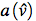是一个使用观察方向对环境盒子（ambient  cube）的评估（最后这一句我没看懂。。。原文是：is an evaluation of the ambient cube using a  ray from the eye through the pixel being rendered）。


**多重Phong部分（Multiple Phong Term)**           等式（2）的左半部分包含了使用常见的表达式——来计算Phong高光，并且使用了适当的常量以及一个菲涅耳因子对它进行调整。然而，我们在求和的内部还使用了max()函数将Phong高光和额外的Phong   lobes（使用了不同的指数、菲涅耳系数以及遮罩）结合在一起。在《要塞军团2》中，对一个模型整体来说是一个常量，并且比小很多，来由光源得到一个边缘高光轮廓，而不受材质属性的影响。我们使用了一个菲涅耳系数对这些边缘高光进行遮罩，以保证它们只在切线角（grazing  angles）出现。这种使用Phong高光和边缘高光的组合使得《军团要塞2》得到了非常出色的画面效果。


**专用的边缘光照（Dedicated Rim Lighting)**          当角色逐渐移动远离光源时，仅仅基于Phong部分的边缘高光可能不会向我们想要的那么明显了。为此，我们还加入了一个专用的边缘高光部分（等式2的右半部分）。这个部分使用了观察方向对环境盒子（ambient  cube）进行了求值，并且使用了一个由美术控制的遮罩纹理、菲涅耳因子以及表达式进行调整。这个最后的表达式仅仅是逐像素的法线和空间向上向量（up  vector）点乘的结果，再约束到正数范围（clamped to be  positive）。这使得这种专用的边缘高光看起来包含了环境中的间接光源，但仅仅适用于朝上的法线。这种方法是一种基于美学和感性的选择，我们希望这样可以让人感觉这些光照好像是从上方照下来的一样。


用于角色和其他模型渲染的完整的pixel shader就是等式（1）和等式（2）的和，以及一些其他类似于可选环境映射的操作。


# 实践


我在Unity里使用vertex & fragment shader进行了上述过程的尝试。这里仅考虑了单光源、并且没有对非依赖视角的光照中的平行环境光部分以及依赖视角的光照中的环境光盒子进行处理。下面是处理效果（仅供参考）：

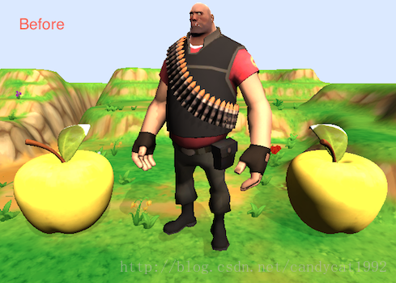  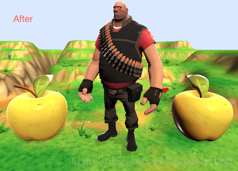


最后，给出在Unity Shader中使用上述模型的示例代码（仅仅是公式的示例！而且仅处理了单光源！）：


```cpp
Shader "Custom/IllustrativeRenderingNormal" {


	Properties {


		_MainTex ("Base (RGB)", 2D) = "white" {}


		_NormalTex ("Normal Texture", 2D) = "white" {}


		_RampTex ("Ramp Texture", 2D) = "white" {}


		_SpecularMask ("Specular Mask", 2D) = "white" {}


		_Specular ("Speculr Exponent", Range(0.1, 128)) = 128


		_RimMask ("Rim Mask", 2D) = "white" {}


		_Rim ("Rim Exponent", Range(0.1, 8)) = 1


	}


	SubShader {	


		Pass {


			Name "FORWARD"


			Tags { "LightMode" = "ForwardBase" }


		


			CGPROGRAM


			


			#pragma vertex vert


			#pragma fragment frag


			


			#include "UnityCG.cginc"


			#include "Lighting.cginc"


			#include "AutoLight.cginc"


 


			sampler2D _MainTex;


			sampler2D _NormalTex;


			sampler2D _RampTex;


			sampler2D _SpecularMask;


			float _Specular;


			sampler2D _RimMask;


			float _Rim;


			


			float4 _MainTex_ST;


			float4 _NormalTex_ST;


			float4 _SpecularMask_ST;


			float4 _RimMask_ST;


			


			struct v2f {


				float4 position : SV_POSITION;


  				float2 uv0 : TEXCOORD0;


  				float2 uv1 : TEXCOORD1;


  				float2 uv2 : TEXCOORD2;


  				float2 uv3 : TEXCOORD3;


  				float3 viewDir : TEXCOORD4;


  				float3 lightDir : TEXCOORD5;


  				float3 up : TEXCOORD6;


			};


			


			v2f vert(appdata_full v) {


				v2f o;


  				o.position = mul (UNITY_MATRIX_MVP, v.vertex);


				o.uv0 = TRANSFORM_TEX (v.texcoord, _MainTex); 


				o.uv1 = TRANSFORM_TEX (v.texcoord, _NormalTex); 


				o.uv2 = TRANSFORM_TEX (v.texcoord, _SpecularMask); 


				o.uv3 = TRANSFORM_TEX (v.texcoord, _RimMask); 


				


				TANGENT_SPACE_ROTATION;


 	 			float3 lightDir = mul (rotation, ObjSpaceLightDir(v.vertex));


 	 			o.lightDir = normalize(lightDir);


				


				float3 viewDirForLight = mul (rotation, ObjSpaceViewDir(v.vertex));


  				o.viewDir = normalize(viewDirForLight);


  				


  				o.up = mul(rotation, float3(mul(_World2Object, half4(0, 1, 0, 0))));


				


				// pass lighting information to pixel shader


				TRANSFER_VERTEX_TO_FRAGMENT(o);


				return o;


			}


			


			fixed4 frag (v2f i) : COLOR {


				half3 normal = UnpackNormal(tex2D (_NormalTex, i.uv1)); 


				


				// Compute View Independent Lighting Terms


				half3 k = tex2D( _MainTex, i.uv0).rgb;


				


				half difLight = dot (normal, i.lightDir);


				half halfLambert = pow(0.5 * difLight + 0.5, 1);


				


				half3 ramp = tex2D(_RampTex, float2(halfLambert)).rgb;


				half3 difWarping = ramp * 2; // Or difWarping = ramp * 2;


				


				half3 difLightTerm = _LightColor0.rgb * difWarping; 


				


				half3 dirLightTerm = 0;


				


				half3 viewIndependentLightTerms = k * (dirLightTerm + difLightTerm);


				


				// Compute View Dependent Lighting Terms


				half3 r = reflect(i.lightDir, normal);


				half3 refl = dot(i.viewDir, r);


				half fresnelForSpecular = 1; // Just for example


				half fresnelForRim = pow(1 - dot(normal, i.viewDir), 4);


				


				half3 kS = tex2D( _SpecularMask, i.uv2).rgb;


				half3 multiplePhongTerms =  _LightColor0.rgb * kS * max(fresnelForSpecular * pow(refl, _Specular), fresnelForRim * pow(refl, _Rim));


				


				half3 kR = tex2D( _RimMask, i.uv3).rgb;


				half3 aV = float(1);


				half3 dedicatedRimLighting = dot(normal, i.up) * fresnelForRim * kR * aV;


				half3 viewDependentLightTerms = multiplePhongTerms + dedicatedRimLighting;


	       	  	


	       	  	// Compute the final color


	       	  	float4 col;


	       	  	col.rgb = viewIndependentLightTerms + viewDependentLightTerms;


	       	  	col.a = 1.0;


	       	  	


	       	  	return col;


			}


 


			ENDCG


		}


	}


	


	FallBack "Diffuse"


}
```