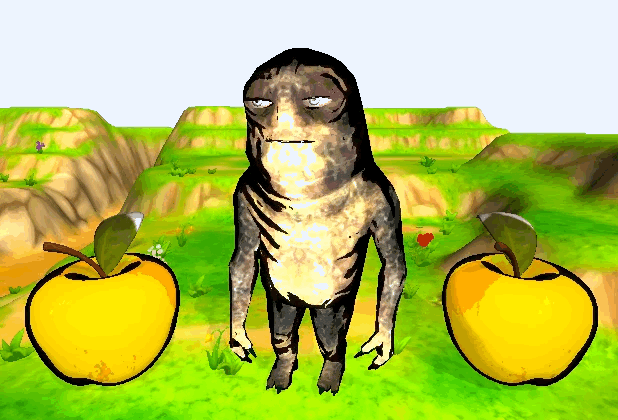
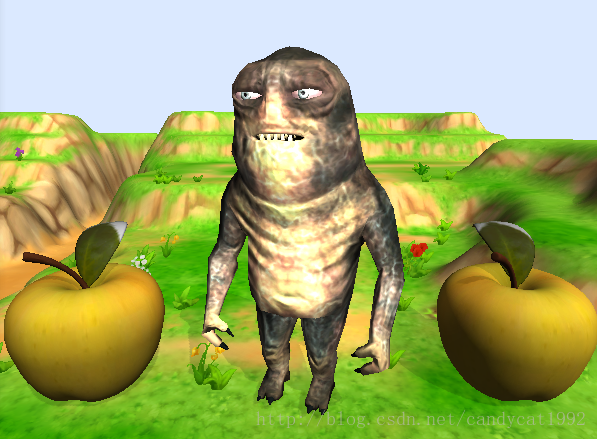
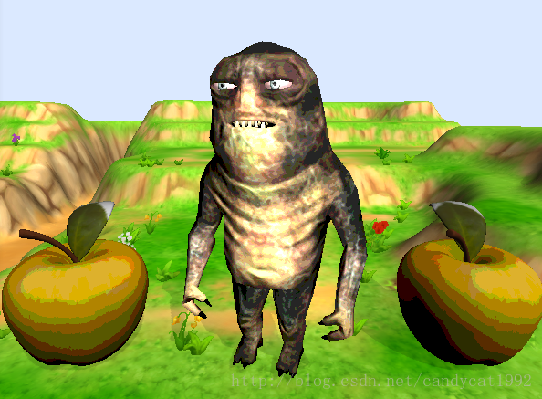
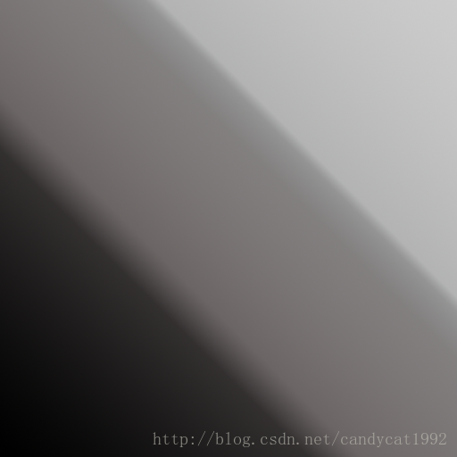
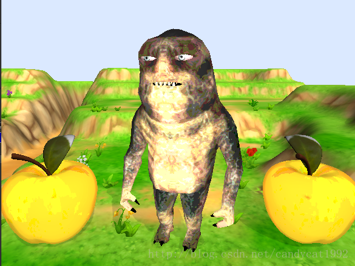
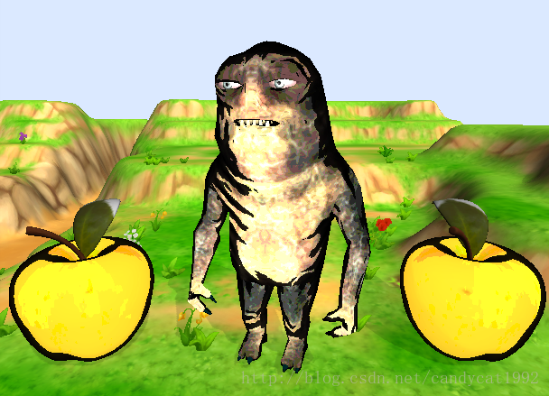
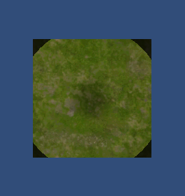

# Unity Shader实战】卡通风格的Shader（一）      


# 写在前面


本系列其他文章：


- [卡通风格的Shader（二）](http://blog.csdn.net/candycat1992/article/details/41120019)


呜，其实很早就看到了这类Shader，实现方法很多，效果也有些许不一样。从这篇开始，陆续学习一下接触到的卡通类型Shader的编写。


本篇的最后效果如下（只有怪物和苹果部分）：




本篇文章里指的卡通效果具有如下特点：


- 简化了模型中使用的颜色 
- 简化光照，使模型具有明确的明暗区域 
- 在模型边缘部分绘制轮廓（也就是描边）


我们再来回顾一下Unity Surface Shader的pipeline。（来源：[Unity Gems](http://unitygems.com/)）


由上图可以看出，我们一共有4个可修改渲染结果的机会（绿色方框中的代码）。在理解这个的基础上，我们来真正学习如何实现上述效果。


# 简化颜色


在第一步中，我们只实现一个最常见的Bump Diffuse Shader，在这个基础上添加一点其他的技巧来实现简化颜色的目的。Unity的内置Shader也包含了Bump Diffuse Shader，它的作用很简单，就是用一张贴图（也叫法线贴图）记录了模型上的凹凸情况，以此来作为顶点的法线信息，渲染出来的模型也就有了凹凸不平的感觉（详情可见[Unity官网](http://docs.unity3d.com/Manual/SL-SurfaceShaderExamples.html)）。


基本的Bump Diffuse Shader代码如下：


```objectivec
Shader "Example/Diffuse Bump" {
    Properties {
      _MainTex ("Texture", 2D) = "white" {}
      _BumpMap ("Bumpmap", 2D) = "bump" {}
    }
    SubShader {
      Tags { "RenderType" = "Opaque" }
      CGPROGRAM
      #pragma surface surf Lambert
      struct Input {
        float2 uv_MainTex;
        float2 uv_BumpMap;
      };
      sampler2D _MainTex;
      sampler2D _BumpMap;
      void surf (Input IN, inout SurfaceOutput o) {
        o.Albedo = tex2D (_MainTex, IN.uv_MainTex).rgb;
        o.Normal = UnpackNormal (tex2D (_BumpMap, IN.uv_BumpMap));
      }
      ENDCG
    } 
    Fallback "Diffuse"
  }
```


效果如下：




接下来，我们进行以下步骤：


1. 在Properties块中添加如下新的属性：

   ```java
   _Tooniness ("Tooniness", Range(0.1,20)) = 4
   ```

2. 在SubShader块中添加对应的引用：

   ```java
   float _Tooniness;
   ```

3. 给#pragma添加新的指令final：

   ```css
   #pragma surface surf Lambert finalcolor:final
   ```

   解释：由之前pipeline的图可知，我们有最后一次修改像素的机会，就是使用

   finalcolor:your function

   。

   finalcolor

   后面紧跟就是我们的函数名，Unity将调用该函数进行最后的修改。其他可供选择的准则可见

   官网

   。

4. 实现final函数：

   ```cpp
           void final(Input IN, SurfaceOutput o, inout fixed4 color) {
               color = floor(color * _Tooniness)/_Tooniness;
           }
   ```

   解释：我们把颜色值乘以_Tooniness，向下取整后再除以

   _Tooniness。由于color的范围是0到1，乘以_Tooniness再取整将会得到一定范围内的特定整数，这样就使得所有的颜色都被归入到一个已知的集合中，达到了简化颜色的目的。_Tooniness越小，输出的颜色种类越少。


完整代码如下：


```swift
Shader "Custom/Toon" {
    Properties {
        _MainTex ("Base (RGB)", 2D) = "white" {}
        _Bump ("Bump", 2D) = "bump" {}
        _Tooniness ("Tooniness", Range(0.1,20)) = 4
    }
    SubShader {
        Tags { "RenderType"="Opaque" }
        LOD 200
 
        CGPROGRAM
        #pragma surface surf Lambert finalcolor:final
 
        sampler2D _MainTex;
        sampler2D _Bump;
        float _Tooniness;
 
        struct Input {
            float2 uv_MainTex;
            float2 uv_Bump;
        };
 
        void surf (Input IN, inout SurfaceOutput o) {
            half4 c = tex2D (_MainTex, IN.uv_MainTex);
            o.Normal = UnpackNormal( tex2D(_Bump, IN.uv_Bump));
            o.Albedo = c.rgb;
            o.Alpha = c.a;
        }
 
        void final(Input IN, SurfaceOutput o, inout fixed4 color) {
            color = floor(color * _Tooniness)/_Tooniness;
        }
 
        ENDCG
    } 
    FallBack "Diffuse"
}
```

效果如下：





# 卡通光照


除了上述使用取整的方法简化颜色，更常见的是使用一张渐变贴图（ramp texture）来模拟卡通光照达到目的。下图是我们为怪兽使用的渐变贴图（PS里面画的）：





这张图的特点就是边界明显，而不像其他渐变图那样是缓慢渐变的。正如卡通风格里面经常有分界明显的明暗变化一样。


我们按如下步骤添加光照函数：


1. 在

   Properties

   块中添加渐变图属性：

   ```java
   _Ramp ("Ramp Texture", 2D) = "white" {}
   ```

2. 在

   SubShader

   块中添加对应的引用：

   ```undefined
   sampler2D _Ramp;
   ```

3. 给

   \#pragma

   添加新的指令：

   ```cs
   #pragma surface surf Toon
   ```

   解释：我们去掉了final函数，将其功能移到了后面的surf函数中。这样允许我们有更多的可变性。上述语句说明我们将使用名称为Toon的光照函数。

   

4. 修改surf函数：

   ```vbscript
           void surf (Input IN, inout SurfaceOutput o) {
               half4 c = tex2D (_MainTex, IN.uv_MainTex);
               o.Normal = UnpackNormal( tex2D(_Bump, IN.uv_Bump));
               o.Albedo = (floor(c.rgb * _Tooniness)/_Tooniness);
               o.Alpha = c.a;
           }
   ```

5. 实现Toon光照函数：

   ```swift
           half4 LightingToon(SurfaceOutput s, fixed3 lightDir, half3 viewDir, fixed atten)
           {
           	float difLight = max(0, dot (s.Normal, lightDir));
           	float dif_hLambert = difLight * 0.5 + 0.5; 
           	
           	float rimLight = max(0, dot (s.Normal, viewDir));  
           	float rim_hLambert = rimLight * 0.5 + 0.5; 
           	
           	float3 ramp = tex2D(_Ramp, float2(rim_hLambert, dif_hLambert)).rgb;   
       
    		float4 c;  
                   c.rgb = s.Albedo * _LightColor0.rgb * ramp;
                   c.a = s.Alpha;
                   return c;
           }
   ```

   解释：上述最重要的部分就是如何在ramp中采样，我们使用了两个值：漫反射光照方向和边缘光照方向。max是为了防止明暗突变的区域产生奇怪的现象，0.5的相关操作则是为了改变光照区间，进一步提高整体亮度。具体可参加

   之前的文章

   。

完整代码如下：


```cs
Shader "Custom/Toon" {
    Properties {
        _MainTex ("Base (RGB)", 2D) = "white" {}
        _Bump ("Bump", 2D) = "bump" {}
        _Ramp ("Ramp Texture", 2D) = "white" {}
        _Tooniness ("Tooniness", Range(0.1,20)) = 4
    }
    SubShader {
        Tags { "RenderType"="Opaque" }
        LOD 200
 
        CGPROGRAM
        #pragma surface surf Toon
 
        sampler2D _MainTex;
        sampler2D _Bump;
        sampler2D _Ramp;
        float _Tooniness;
        float _Outline;
 
        struct Input {
            float2 uv_MainTex;
            float2 uv_Bump;
        };
 
        void surf (Input IN, inout SurfaceOutput o) {
            half4 c = tex2D (_MainTex, IN.uv_MainTex);
            o.Normal = UnpackNormal( tex2D(_Bump, IN.uv_Bump));
            o.Albedo = (floor(c.rgb * _Tooniness)/_Tooniness);
            o.Alpha = c.a;
        }
 
        half4 LightingToon(SurfaceOutput s, fixed3 lightDir, half3 viewDir, fixed atten)
        {
            float difLight = max(0, dot (s.Normal, lightDir));
            float dif_hLambert = difLight * 0.5 + 0.5; 
        	
            float rimLight = max(0, dot (s.Normal, viewDir));  
            float rim_hLambert = rimLight * 0.5 + 0.5; 
        	
            float3 ramp = tex2D(_Ramp, float2(rim_hLambert, dif_hLambert)).rgb;   
    
 	    float4 c;  
            c.rgb = s.Albedo * _LightColor0.rgb * ramp;
            c.a = s.Alpha;
            return c;
        }
 
        ENDCG
    } 
    FallBack "Diffuse"
}
```

效果如下：





# 添加描边


最后，我们给模型添加描边效果。这是通过边缘光照（rim lighting）来实现的，在本例中我们将边缘渲染成黑色来实现描边。边缘光照找到那些和观察方向接近90°的像素，再把他们变成黑色。你大概也想到了边缘光照使用的方法了：点乘。


我们按如下步骤实现：


1. 首先为描边的宽度在Properties块中添加属性：

   ```java
   _Outline ("Outline", Range(0,1)) = 0.4
   ```

2. 在SubShader块中添加对应的引用：

   ```java
   float _Outline;
   ```

3. 前面说了，边缘光照需要使用观察方向，因此我们修改Input结构体：

   ```swift
           struct Input {
               float2 uv_MainTex;
               float2 uv_Bump;
               float3 viewDir;
           };
   ```

   解释：viewDir也是Unity的内置参数，其他内置参数可在

   官网

   找到。

4. 我们在surf函数中使用如下方法检测那些边：

   ```vbscript
               half edge = saturate(dot (o.Normal, normalize(IN.viewDir))); 
               edge = edge < _Outline ? edge/4 : 1;
   			
               o.Albedo = (floor(c.rgb * _Tooniness)/_Tooniness) * edge;
   ```

   解释：我们首先得到该像素的法线方向和观察方向的点乘结果。如果该结果小于我们的阈值，我们认为这就是我们要找的那些边缘点，并除以4（一个实验值）来减少它的值得到黑色；否则，让它等于1，即没有任何效果。

整体代码如下：


```cs
Shader "Custom/Toon" {
    Properties {
        _MainTex ("Base (RGB)", 2D) = "white" {}
        _Bump ("Bump", 2D) = "bump" {}
        _Ramp ("Ramp Texture", 2D) = "white" {}
        _Tooniness ("Tooniness", Range(0.1,20)) = 4
        _Outline ("Outline", Range(0,1)) = 0.4
    }
    SubShader {
        Tags { "RenderType"="Opaque" }
        LOD 200
 
        CGPROGRAM
        #pragma surface surf Toon
 
        sampler2D _MainTex;
        sampler2D _Bump;
        sampler2D _Ramp;
        float _Tooniness;
        float _Outline;
 
        struct Input {
            float2 uv_MainTex;
            float2 uv_Bump;
            float3 viewDir;
        };
 
        void surf (Input IN, inout SurfaceOutput o) {
            half4 c = tex2D (_MainTex, IN.uv_MainTex);
            o.Normal = UnpackNormal( tex2D(_Bump, IN.uv_Bump));
            
            half edge = saturate(dot (o.Normal, normalize(IN.viewDir))); 
			edge = edge < _Outline ? edge/4 : 1;
			
            o.Albedo = (floor(c.rgb * _Tooniness)/_Tooniness) * edge;
            o.Alpha = c.a;
        }
 
        half4 LightingToon(SurfaceOutput s, fixed3 lightDir, half3 viewDir, fixed atten)
        {
        	float difLight = max(0, dot (s.Normal, lightDir));
        	float dif_hLambert = difLight * 0.5 + 0.5; 
        	
        	float rimLight = max(0, dot (s.Normal, viewDir));  
        	float rim_hLambert = rimLight * 0.5 + 0.5; 
        	
        	float3 ramp = tex2D(_Ramp, float2(rim_hLambert, dif_hLambert)).rgb;   
    
 			float4 c;  
            c.rgb = s.Albedo * _LightColor0.rgb * ramp;
            c.a = s.Alpha;
            return c;
        }
 
        ENDCG
    } 
    FallBack "Diffuse"
}
```


最后效果如下：




# 弊端


这是更新的内容。这种方法有一个明显的弊端就是，对于那叫平坦、棱角分明的物体，使用上述描边方法会产生突变等非预期的情况。例如下面的效果：





这是因为我们采用了顶点法向量来判断边界的，那么对于正方体这种法线固定单一的情况，判断出来的边界要么基本不存在要么就大的离谱！对于这样的对象，一个更好的方法是用Pixel&Fragment   Shader、经过两个Pass渲染描边：第一个Pass，我们只渲染背面的网格，在它们的周围进行描边；第二个Pass中，再正常渲染正面的网格。其实，这是符合我们对于边界的认知的，我们看见的物体也都是看到了它们的正面而已。


当然，对于大多数复杂的对象来说，上述方法也是可以支持的~我看到Assets Store上的[Free Toony Colors](https://www.assetstore.unity3d.com/en/#!/content/3926)也是使用相同的方法哦~


第二种方法可以参见[卡通风格的Shader（二）](http://blog.csdn.net/candycat1992/article/details/41120019)。


还有一个弊端就是它产生的轮廓的不确定性。按这种方法产生的轮廓是无法保证精确的宽度的，尤其对于那些不是非常平滑的表面。例如上面的小怪兽，它头部的轮廓要比手臂的大很多。当然，可以把这个当成是一种艺术风格。但这种不确定性可能会对于某些需要精确黑色轮廓大小的项目不适用。而这个弊端可以靠精确判断正反面交界处来处理。


第三种方法可以参见卡通风格的Shader（三）（哈哈，我还没写。。。）。


# 更新


- 补上两种shader，分别对应有无法线纹理；
- 修正了半兰伯特部分，即去掉了max操作；


有法线纹理：


```csharp
Shader "MyToon/Toon-Surface_Normal" {


    Properties {


        _MainTex ("Base (RGB)", 2D) = "white" {}


        _Bump ("Bump", 2D) = "bump" {}


        _Ramp ("Ramp Texture", 2D) = "white" {}


        _Tooniness ("Tooniness", Range(0.1,20)) = 4


        _Outline ("Outline", Range(0,1)) = 0.4


    }


    SubShader {


        Tags { "RenderType"="Opaque" }


        LOD 200


 


        CGPROGRAM


        #pragma surface surf Toon


 


        sampler2D _MainTex;


        sampler2D _Bump;


        sampler2D _Ramp;


        float _Tooniness;


        float _Outline;


 


        struct Input {


            float2 uv_MainTex;


            float2 uv_Bump;


            float3 viewDir;


        };


 


        void surf (Input IN, inout SurfaceOutput o) {


            half4 c = tex2D (_MainTex, IN.uv_MainTex);


            o.Normal = UnpackNormal( tex2D(_Bump, IN.uv_Bump));


            


            half edge = saturate(dot (o.Normal, normalize(IN.viewDir))); 


			edge = edge < _Outline ? edge/4 : 1;


			


            o.Albedo = (floor(c.rgb * _Tooniness)/_Tooniness) * edge;


            o.Alpha = c.a;


        }


 


        half4 LightingToon(SurfaceOutput s, fixed3 lightDir, half3 viewDir, fixed atten)


        {


        	float difLight = dot (s.Normal, lightDir);


        	float dif_hLambert = difLight * 0.5 + 0.5; 


        	


        	float rimLight = dot (s.Normal, viewDir);  


        	float rim_hLambert = rimLight * 0.5 + 0.5; 


        	


        	float3 ramp = tex2D(_Ramp, float2(rim_hLambert, dif_hLambert)).rgb;   


    


 			float4 c;  


            c.rgb = s.Albedo * _LightColor0.rgb * ramp * atten * 2;


            c.a = s.Alpha;


            return c;


        }


 


        ENDCG


    } 


    FallBack "Diffuse"


}
```

无法线纹理：


```csharp
Shader "MyToon/Toon-Surface" {


    Properties {


        _MainTex ("Base (RGB)", 2D) = "white" {}


        _Ramp ("Ramp Texture", 2D) = "white" {}


        _Tooniness ("Tooniness", Range(0.1,20)) = 4


        _Outline ("Outline", Range(0,1)) = 0.4


    }


    SubShader {


        Tags { "RenderType"="Opaque" }


        LOD 200


 


        CGPROGRAM


        #pragma surface surf Toon


 


        sampler2D _MainTex;


        sampler2D _Ramp;


        float _Tooniness;


        float _Outline;


 


        struct Input {


            float2 uv_MainTex;


            float3 viewDir;


        };


 


        void surf (Input IN, inout SurfaceOutput o) {


            half4 c = tex2D (_MainTex, IN.uv_MainTex);


            


            half edge = saturate(dot (o.Normal, normalize(IN.viewDir))); 


			edge = edge < _Outline ? edge/4 : 1;


			


            o.Albedo = (floor(c.rgb * _Tooniness)/_Tooniness) * edge;


            o.Alpha = c.a;


        }


 


        half4 LightingToon(SurfaceOutput s, fixed3 lightDir, half3 viewDir, fixed atten)


        {


        	float difLight = dot (s.Normal, lightDir);


        	float dif_hLambert = difLight * 0.5 + 0.5; 


        	


        	float rimLight = dot (s.Normal, viewDir);  


        	float rim_hLambert = rimLight * 0.5 + 0.5; 


        	


        	float3 ramp = tex2D(_Ramp, float2(dif_hLambert, rim_hLambert)).rgb;   


    


 			float4 c;  


            c.rgb = s.Albedo * _LightColor0.rgb * ramp * atten * 2;


            c.a = s.Alpha;


            return c;


        }


 


        ENDCG


    } 


    FallBack "Diffuse"


}
```


# 结束语


本篇一开始是参考了[Unity Gems的一篇文章](http://unitygems.com/noobs-guide-shaders-4-toon-shading-basic/)，但在学习过程中发现了一面一些错误和改善的地方，例如里面对光照函数的解释，以及渐变贴图的实现。以后的学习还是要多思考，去其糟粕取其精华啊。


在后面的卡通Shader系列，我会首先学习Unity Gems里面用Fragment Shader实现的方法，最后，再学习一下Unity一个资源包里面的卡通效果实现方法。


欢迎交流和指教！