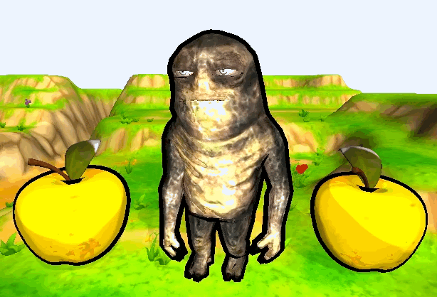
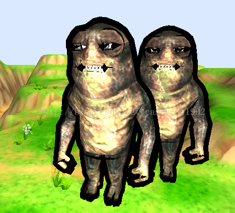
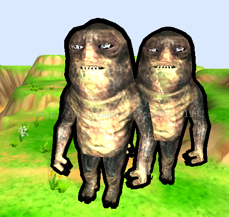

# 【Unity Shader实战】卡通风格的Shader（二）


# 写在前面


本系列其他文章：


- [卡通风格的Shader（一）](http://blog.csdn.net/candycat1992/article/details/37882425)


好久没写博客了，一定是因为课程作业比较多，一定不是因为我懒，恩恩。


三个月以前，在[一篇讲卡通风格的Shader](http://blog.csdn.net/candycat1992/article/details/37882425)的最后，我们说到在Surface   Shader中实现描边效果的弊端，也就是只对表面平缓的模型有效。这是因为我们是依赖法线和视角的点乘结果来进行描边判断的，因此，对于那些平整的表面，它们的法线通常是一个常量或者会发生突变（例如立方体的每个面），这样就会导致最后的效果并非如我们所愿。如下图所示：


因此，我们有一个更好的方法来实现描边效果，也就是通过两个pass进行渲染——首先渲染对象的背面，用黑色略微向外扩展一点，就是我们的描边效果；然后正常渲染正面即可。而我们应该知道，surface shader是不可以使用pass的。


在这篇里，我们就会学习如何使用Vertex & Fragment Shader来实现上述的过程。很显然，这样的一个过程包含了两个步骤——描边和正常的渲染。


最后的效果如下：




# 实现描边


在[上一篇](http://blog.csdn.net/candycat1992/article/details/37882425)里，我们使用了边缘高光来实现描边。而这篇里，我们将使用一个单独的pass来得到一个更好的效果。这里说的**“更好”**指的是以下几个方面：


- 首先是对平整表面的适应性，如上面正方体的例子，这种方法仍可以得到期望的效果；
- 而且这种方法可以不破坏正面模型的逼真度，也就是说正面模型可以完全不受影响。与之产生对比的是[上一篇](http://blog.csdn.net/candycat1992/article/details/37882425)中的方法，使用边缘光照来实现的描边效果会影响到正面模型的表面，即正面模型也会有强烈的描边效果，而这往往不是我们所期望的。

因此，这个pass的第一个步骤就是剔除正面部分：


```csharp
            Cull Front


    	    Lighting Off
```

我们先来看frag函数，因此它的工作非常简单！就是输出黑色啦~当然如果你的描边不想要黑色可以在这里改写。


```csharp
            float4 frag(v2f i) : COLOR  


            { 


            	return float4(0, 0, 0, 1);               


            } 
```

然后，我们继续计算vert函数部分。我们将会沿着顶点的法线方法向外扩张该点来模拟描边。因此，我们需要在下面的结构体中声明position和normal属性：


```csharp
            struct a2v


            {


                float4 vertex : POSITION;


                float3 normal : NORMAL;


            }; 


 


            struct v2f


            {


                float4 pos : POSITION;


            };
```

接下来，我们定义一个范围在0到1之间的_Outline的变量来控制描边的宽度。最后，vert函数如下：


```csharp
                        float _Outline;


 


			v2f vert (a2v v)


			{


				v2f o;


				o.pos = mul( UNITY_MATRIX_MVP, v.vertex + (float4(v.normal,0) * _Outline)); 


				return o;


			}
```

它的含义很好理解：把原先的顶点位置v.vertex沿着v.normal的方向扩展_Outline倍后，再转换到投影平面上输出最后的屏幕位置信息。


效果如下：




为了暴露问题，我把描边的宽度调的比较高。那么，问题来了。大家可以看出来哪里不太对吧？没错，就是眼睛和嘴巴的地方。为什么会有哪些很大的黑色色块呢？这是因为眼睛和嘴巴是独立于身体之外的两个网格，它们各自使用了一个新的材质，而它们的深度关系是眼睛和嘴巴在身体的后面（被身体的皮肤包裹嘛），因此在渲染的时候身体的渲染输出像素会覆盖眼睛和嘴巴的部分，也包括身体的描边部分，也就是说身体的黑色描边会覆盖眼睛和嘴巴的正常渲染，而这不是我们所希望的。一种暴力的解决方法就是直接关闭该pass的深度信息。即：


```csharp
    		Cull Front


    		Lighting Off


    		ZWrite Off
```

这样一来，这个pass的结果是不写入深度缓存中的，而后面只要有其他材质要渲染该点的像素就会覆盖它。这样的效果如下：




那么，问题又来了。眼睛和嘴巴部分虽然对了，但小怪物的先后关系又乱了，即后面小怪物的身体挡住了前面小怪物的描边。而要解决这个问题，就要写入深度缓存。死循环了有木有！


其实，这说明我们生成描边的方法需要改进。我们回想为什么会出现眼睛和嘴巴那样的错误，是因为我们把描边的宽度调的太大了。我们之所以会这么做（当然这里我是故意的。。。），是因为有时候一些相邻顶点的法线指向非常不同，而为了得到我们想要的感性宽度，我们不得不调整的很大。而上述过程的实质其实就是把背光面的模型放大了而已，我们可以理解成它实际相当于一个新的黑色模型。这样放大的太过分了会发生什么呢？就是穿透和遮挡了。


而正确的方法应该是，把顶点当成轮廓处理而不是一个真正的模型。也就是说，当我们观察背面的某一个顶点时，要把它的Z方向的值扁平化，那么描边的结果就会主要受X和Y方向的影响。因此，


## 扁平化背面


首先，我们要在视角坐标系中处理描边。因为描边正是基于我们观察的角度而定的。因此，我们要把需要的变量都转换到视角坐标系下处理。这里面涉及两个变量——顶点的位置和顶点的法线。


顶点很好处理，只要使用UNITY_MATRIX_MV即可。法线的转换麻烦一点，这是因为法线并不是真正定义在模型坐标系中的，而是和它是正交的，我们需要使用ModelView转换矩阵的转置矩阵来把法线转换到视角坐标系中。原因可以看[这里](http://forum.unity3d.com/threads/_object2world-or-unity_matrix_it_mv.112446/)和[这里](http://www.lighthouse3d.com/tutorials/glsl-tutorial/the-normal-matrix/)。


因此，我们的工作包含下面几个步骤：

- 把顶点位置转换到视角坐标系；
- 把法线转换到视角坐标系；
- 把转换后的法线的z值扁平化，即使其是一个较小的定值，这样所有的背面其实都在一个平面上；
- 按描边的宽度放缩法线，并添加到转换后顶点的位置上，得到新的视角坐标系中的位置；
- 把新的位置转换到投影坐标系中。

代码如下：


```csharp
            v2f vert (a2v v)


            {


                v2f o;


 


                float4 pos = mul( UNITY_MATRIX_MV, v.vertex); 


				float3 normal = mul( (float3x3)UNITY_MATRIX_IT_MV, v.normal);  


				normal.z = -0.4;


				pos = pos + float4(normalize(normal),0) * _Outline;


				o.pos = mul(UNITY_MATRIX_P, pos);


				


                return o;


            }
```

# 卡通化


后面这一部分没什么好解释的，和上一篇的方法一致，同样使用了简化颜色和渐变纹理来模拟卡通效果。


# 弊端


和[上一篇](http://blog.csdn.net/candycat1992/article/details/37882425)里的方法比，这里的方法解决了之前的两个弊端：一个是轮廓宽度无法精确保证，一个是对于法线突变的模型的不适应性。但它也有自己的弊端。最明显的就是，它无法和模型内部的褶皱添加轮廓。例如上面的小怪兽，只有它最外层的边界才有轮廓线，但其内部的肥肉褶皱则无法体现。而这种问题的解决方法，可以依靠第三种更高级的Shader来实现。具体请参见卡通风格的Shader（三）。


# 代码


我知道大家最想要的还是代码，上面很多人直接略过。Sigh~


还是把完整的代码给出。代码有两种，一种使用了法线纹理，一种没有使用法线纹理。每种都包含了三个pass：第一个pass处理背面进行描边，第二个pass处理正面的forwardbase，第三个pass处理正面的forwardadd。


在Vertex & Fragment中处理法线和光照，简直是噩梦啊！VF虐我千百遍，我却待她如初恋，哎。后面会写一篇这方面的文章，如果有时间的话。。。


首先是没有使用法线纹理的代码：


```csharp
Shader "MyToon/Toon-Fragment" {


	Properties {


        _MainTex ("Base (RGB)", 2D) = "white" {}


        _Ramp ("Ramp Texture", 2D) = "white" {}


        _Tooniness ("Tooniness", Range(0.1,20)) = 4


        _Outline ("Outline", Range(0,1)) = 0.1


    }


    SubShader {


        Tags { "RenderType"="Opaque" }


        LOD 200


 


        Pass {


        	Tags { "LightMode"="ForwardBase" }


        	


            Cull Front


    		Lighting Off


    		ZWrite On


 


            CGPROGRAM


            


            #pragma vertex vert


            #pragma fragment frag


            


            #pragma multi_compile_fwdbase


 


           	#include "UnityCG.cginc"


           	


            float _Outline;


 


            struct a2v


            {


                float4 vertex : POSITION;


                float3 normal : NORMAL;


            }; 


 


            struct v2f


            {


                float4 pos : POSITION;


            };


 


            v2f vert (a2v v)


            {


                v2f o;


 


                float4 pos = mul( UNITY_MATRIX_MV, v.vertex); 


				float3 normal = mul( (float3x3)UNITY_MATRIX_IT_MV, v.normal);  


				normal.z = -0.5;


				pos = pos + float4(normalize(normal),0) * _Outline;


				o.pos = mul(UNITY_MATRIX_P, pos);


				


                return o;


            }


 


            float4 frag(v2f i) : COLOR  


            { 


            	return float4(0, 0, 0, 1);               


            } 


 


            ENDCG


        }


        


        Pass {


			Tags { "LightMode"="ForwardBase" }


			


			Cull Back 


			Lighting On


 


			CGPROGRAM


 


			#pragma vertex vert


			#pragma fragment frag


			


			#pragma multi_compile_fwdbase


 


			#include "UnityCG.cginc"


			#include "Lighting.cginc"


			#include "AutoLight.cginc"


			#include "UnityShaderVariables.cginc"


			


 


			sampler2D _MainTex;


			sampler2D _Ramp;


 


			float4 _MainTex_ST;


 


			float _Tooniness;


 


 			struct a2v


			{


				float4 vertex : POSITION;


				float3 normal : NORMAL;


				float4 texcoord : TEXCOORD0;


				float4 tangent : TANGENT;


			}; 


 


			struct v2f


			{


				float4 pos : POSITION;


				float2 uv : TEXCOORD0;


				float3 normal : TEXCOORD1;


				LIGHTING_COORDS(2,3)


			};


			


			v2f vert (a2v v)


			{


				v2f o;


 


				//Transform the vertex to projection space


				o.pos = mul( UNITY_MATRIX_MVP, v.vertex); 


				o.normal  = mul((float3x3)_Object2World, SCALED_NORMAL);


				//Get the UV coordinates


				o.uv = TRANSFORM_TEX (v.texcoord, _MainTex);  


				


				// pass lighting information to pixel shader


  				TRANSFER_VERTEX_TO_FRAGMENT(o);


				return o;


			}


			


			float4 frag(v2f i) : COLOR  


			{ 


				//Get the color of the pixel from the texture


				float4 c = tex2D (_MainTex, i.uv);  


				//Merge the colours


				c.rgb = (floor(c.rgb*_Tooniness)/_Tooniness);


 


				//Based on the ambient light


				float3 lightColor = UNITY_LIGHTMODEL_AMBIENT.xyz;


 


				//Work out this distance of the light


				float atten = LIGHT_ATTENUATION(i);


				//Angle to the light


				float diff =  dot (normalize(i.normal), normalize(_WorldSpaceLightPos0.xyz));  


				diff = diff * 0.5 + 0.5; 


				//Perform our toon light mapping 


				diff = tex2D(_Ramp, float2(diff, 0.5));


				//Update the colour


				lightColor += _LightColor0.rgb * (diff * atten); 


				//Product the final color


				c.rgb = lightColor * c.rgb * 2;


				return c; 


 


			} 


 


			ENDCG


		}


		Pass {


			Tags { "LightMode"="ForwardAdd" }


			


			Cull Back 


			Lighting On


			Blend One One


 


			CGPROGRAM


 


			#pragma vertex vert


			#pragma fragment frag


			


			#pragma multi_compile_fwdadd


 


			#include "UnityCG.cginc"


			#include "Lighting.cginc"


			#include "AutoLight.cginc"


			#include "UnityShaderVariables.cginc"


			


 


			sampler2D _MainTex;


			sampler2D _Ramp;


 


			float4 _MainTex_ST;


 


			float _Tooniness;


 


 			struct a2v


			{


				float4 vertex : POSITION;


				float3 normal : NORMAL;


				float4 texcoord : TEXCOORD0;


				float4 tangent : TANGENT;


			}; 


 


			struct v2f


			{


				float4 pos : POSITION;


				float2 uv : TEXCOORD0;


				float3 normal : TEXCOORD1;


				half3 lightDir : TEXCOORD2;


				LIGHTING_COORDS(3,4)


			};


			


			v2f vert (a2v v)


			{


				v2f o;


 


				//Transform the vertex to projection space


				o.pos = mul( UNITY_MATRIX_MVP, v.vertex); 


				o.normal  = mul((float3x3)_Object2World, SCALED_NORMAL);


  				o.lightDir = WorldSpaceLightDir( v.vertex );


				//Get the UV coordinates


				o.uv = TRANSFORM_TEX (v.texcoord, _MainTex);  


				


				// pass lighting information to pixel shader


  				TRANSFER_VERTEX_TO_FRAGMENT(o);


				return o;


			}


			


			float4 frag(v2f i) : COLOR  


			{ 


				//Get the color of the pixel from the texture


				float4 c = tex2D (_MainTex, i.uv);  


				//Merge the colours


				c.rgb = (floor(c.rgb*_Tooniness)/_Tooniness);


 


				//Based on the ambient light


 				float3 lightColor = float3(0);


 


				//Work out this distance of the light


				float atten = LIGHT_ATTENUATION(i);


				//Angle to the light


				float diff =  dot (normalize(i.normal), normalize(i.lightDir));  


				diff = diff * 0.5 + 0.5; 


				//Perform our toon light mapping 


				diff = tex2D(_Ramp, float2(diff, 0.5));


				//Update the colour


				lightColor += _LightColor0.rgb * (diff * atten); 


				//Product the final color


				c.rgb = lightColor * c.rgb * 2;


				return c; 


			} 


 


			ENDCG


		}


    }


    FallBack "Diffuse"	    


}
```

然后是使用了法线纹理的Shader：


```csharp
Shader "MyToon/Toon-Fragment_Normal" {


	Properties {


        _MainTex ("Base (RGB)", 2D) = "white" {}


        _Bump ("Bump", 2D) = "bump" {}


        _Ramp ("Ramp Texture", 2D) = "white" {}


        _Tooniness ("Tooniness", Range(0.1,20)) = 4


        _Outline ("Outline", Range(0,1)) = 0.1


    }


    SubShader {


        Tags { "RenderType"="Opaque" }


        LOD 200


 


        Pass {


        	Tags { "LightMode"="ForwardBase" }


        	


            Cull Front


    		Lighting Off


    		ZWrite On


 


            CGPROGRAM


            


            #pragma vertex vert


            #pragma fragment frag


            


            #pragma multi_compile_fwdbase


 


           	#include "UnityCG.cginc"


           	


            float _Outline;


 


            struct a2v


            {


                float4 vertex : POSITION;


                float3 normal : NORMAL;


            }; 


 


            struct v2f


            {


                float4 pos : POSITION;


            };


 


            v2f vert (a2v v)


            {


                v2f o;


                


                float4 pos = mul( UNITY_MATRIX_MV, v.vertex); 


				float3 normal = mul( (float3x3)UNITY_MATRIX_IT_MV, v.normal);  


				normal.z = -0.5;


				pos = pos + float4(normalize(normal),0) * _Outline;


				o.pos = mul(UNITY_MATRIX_P, pos);


				


                return o;


            }


 


            float4 frag(v2f i) : COLOR  


            { 


            	return float4(0, 0, 0, 1);               


            } 


 


            ENDCG


        }


        


        Pass {


			Tags { "LightMode"="ForwardBase" }


			


			Cull Back 


			Lighting On


 


			CGPROGRAM


 


			#pragma vertex vert


			#pragma fragment frag


			


			#pragma multi_compile_fwdbase


 


			#include "UnityCG.cginc"


			#include "Lighting.cginc"


			#include "AutoLight.cginc"


			#include "UnityShaderVariables.cginc"


 


			sampler2D _MainTex;


			sampler2D _Bump;


			sampler2D _Ramp;


 


			float4 _MainTex_ST;


			float4 _Bump_ST;


 


			float _Tooniness;


 


 			struct a2v


			{


				float4 vertex : POSITION;


				float3 normal : NORMAL;


				float4 texcoord : TEXCOORD0;


				float4 tangent : TANGENT;


			}; 


 


			struct v2f


			{


				float4 pos : POSITION;


				float2 uv : TEXCOORD0;


				float2 uv2 : TEXCOORD1;


				float3 lightDirection : TEXCOORD2;


				LIGHTING_COORDS(3,4)


			};


			


			v2f vert (a2v v)


			{


				v2f o;


				//Create a rotation matrix for tangent space


				TANGENT_SPACE_ROTATION; 


				//Store the light's direction in tangent space


				o.lightDirection = mul(rotation, ObjSpaceLightDir(v.vertex));


				//Transform the vertex to projection space


				o.pos = mul( UNITY_MATRIX_MVP, v.vertex); 


				//Get the UV coordinates


				o.uv = TRANSFORM_TEX (v.texcoord, _MainTex);  


				o.uv2 = TRANSFORM_TEX (v.texcoord, _Bump);


				


				// pass lighting information to pixel shader


  				TRANSFER_VERTEX_TO_FRAGMENT(o);


				return o;


			}


			


			float4 frag(v2f i) : COLOR  


			{ 


				//Get the color of the pixel from the texture


				float4 c = tex2D (_MainTex, i.uv);  


				//Merge the colours


				c.rgb = (floor(c.rgb*_Tooniness)/_Tooniness);


 


				//Get the normal from the bump map


				float3 n =  UnpackNormal(tex2D (_Bump, i.uv2)); 


 


				//Based on the ambient light


				float3 lightColor = UNITY_LIGHTMODEL_AMBIENT.xyz;


 


				//Work out this distance of the light


				float atten = LIGHT_ATTENUATION(i);


				//Angle to the light


				float diff = saturate (dot (n, normalize(i.lightDirection)));  


				//Perform our toon light mapping 


				diff = tex2D(_Ramp, float2(diff, 0.5));


				//Update the colour


				lightColor += _LightColor0.rgb * (diff * atten); 


				//Product the final color


				c.rgb = lightColor * c.rgb * 2;


				return c; 


 


			} 


 


			ENDCG


		}


		Pass {


			Tags { "LightMode"="ForwardAdd" }


			


			Cull Back 


			Lighting On


			Blend One One


 


			CGPROGRAM


 


			#pragma vertex vert


			#pragma fragment frag


			


			#pragma multi_compile_fwdadd


 


			#include "UnityCG.cginc"


			#include "Lighting.cginc"


			#include "AutoLight.cginc"


			#include "UnityShaderVariables.cginc"


 


			sampler2D _MainTex;


			sampler2D _Bump;


			sampler2D _Ramp;


 


			float4 _MainTex_ST;


			float4 _Bump_ST;


 


			float _Tooniness;


 


 			struct a2v


			{


				float4 vertex : POSITION;


				float3 normal : NORMAL;


				float4 texcoord : TEXCOORD0;


				float4 tangent : TANGENT;


			}; 


 


			struct v2f


			{


				float4 pos : POSITION;


				float2 uv : TEXCOORD0;


				float2 uv2 : TEXCOORD1;


				float3 lightDirection : TEXCOORD2;


				LIGHTING_COORDS(3,4)


			};


			


			v2f vert (a2v v)


			{


				v2f o;


				//Create a rotation matrix for tangent space


				TANGENT_SPACE_ROTATION; 


				//Store the light's direction in tangent space


				o.lightDirection = mul(rotation, ObjSpaceLightDir(v.vertex));


				//Transform the vertex to projection space


				o.pos = mul( UNITY_MATRIX_MVP, v.vertex); 


				//Get the UV coordinates


				o.uv = TRANSFORM_TEX (v.texcoord, _MainTex);  


				o.uv2 = TRANSFORM_TEX (v.texcoord, _Bump);


				


				// pass lighting information to pixel shader


  				TRANSFER_VERTEX_TO_FRAGMENT(o);


  				


				return o;


			}


			


			float4 frag(v2f i) : COLOR  


			{ 


				//Get the color of the pixel from the texture


				float4 c = tex2D (_MainTex, i.uv);  


				//Merge the colours


				c.rgb = (floor(c.rgb*_Tooniness)/_Tooniness);


 


				//Get the normal from the bump map


				float3 n =  UnpackNormal(tex2D (_Bump, i.uv2)); 


 


				//Based on the ambient light


				float3 lightColor = float3(0);


 


				//Work out this distance of the light


				float atten = LIGHT_ATTENUATION(i);


				//Angle to the light


				float diff = saturate (dot (n, normalize(i.lightDirection)));  


				//Perform our toon light mapping 


				diff = tex2D(_Ramp, float2(diff, 0.5));


				//Update the colour


				lightColor += _LightColor0.rgb * (diff * atten); 


				//Product the final color


				c.rgb = lightColor * c.rgb * 2;


				return c; 


 


			} 


 


			ENDCG


		}


    }


    FallBack "Diffuse"	    


}
```


# 写在最后


[上一篇](http://blog.csdn.net/candycat1992/article/details/37882425)里的代码我也更新过了，添加了有无法线的两种shader。和[上一篇](http://blog.csdn.net/candycat1992/article/details/37882425)里的还有一点不一样，上一篇里的渐变纹理使用了假的双向反射分布函数，即除了漫反射方向还有视角方向进行采样。这一篇里仅仅使用了漫反射方向对渐变纹理进行采样，对应的渐变纹理也是一维的，如下：


读者有需要的可以自己添加上视角方向的采样，也就是说在v2f里添加一个新的变量viewDir，然后逐顶点计算后传递给frag函数。如果我后面有时间的话可能会回头添加上。当然，大家还是靠自己比较好。