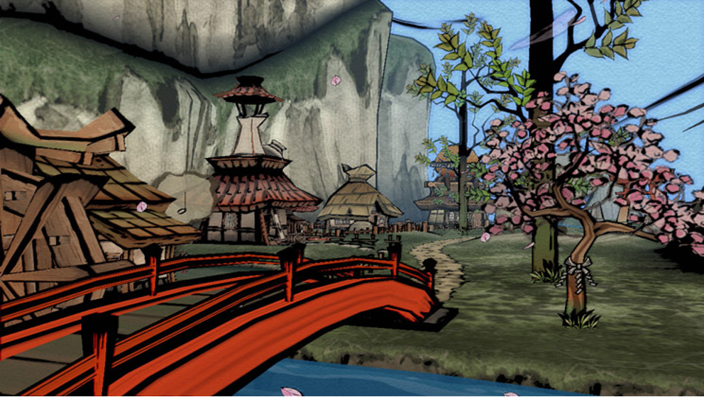
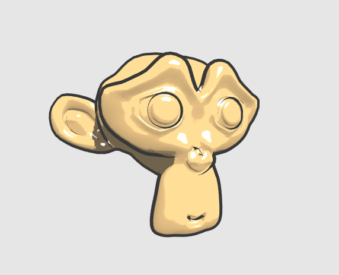
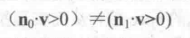

尽管游戏渲染一般都是以照相写实主义作为主要目标，但也有许多游戏使用了非真实感渲染（NPR）的方法来渲染游戏画面。非真实感渲染的一个主要目标是，使用一些渲染方法使得画面达到和某些特殊的绘画风格相似的效果，例如卡通、水彩风格等。

 

**卡通风格的渲染**

卡通风格是游戏中常见的一种渲染风格。使用这种风格的游戏画面通常有一些共有的特点，例如物体都被黑色的线条描边，以及分明的明暗变化等。如下图所示。

要实现卡通渲染有很多方法，其中之一就是使用基于色调的着色技术。在实现中，我们往往会使用漫反射系数对一张一维纹理进行采样，以控制漫反射的色调。卡通风格的高光效果也和我们之前学习的光照不同。在卡通风格总，模型的高光往往是一块块分界明显的纯色风格。

除了光照模型不同外，卡通风格通常还需要在物体边缘部分绘制轮廓。之前我们已经介绍过使用屏幕后处理结束对屏幕图像进行描边。在这里，我们将介绍基于模型的描边方法，这种方法的实现更加简单，而且很多情况下也能得到不错的效果。效果如下图。

在实时渲染中，轮廓线的渲染是应用非常广泛的一种效果。在《Real Time Rendering, third edition》中，作者把绘制模型轮廓线的方法分为5种。

1）基于观察角度和表面法线的轮廓线渲染。（这种方法使用视角方向和表面法线的点乘结果来得到轮廓线的信息。这种方法简单快速，可以在一个Pass中就得到渲染结果，但局限性很大，很多模型渲染出来的描边效果都不尽如人意）

2）过程式几何轮廓线渲染。这种方法的核心是使用两个Pass渲染。第一个Pass渲染背面的面片，并使用某些技术让它的轮廓可见；第二个Pass再正常渲染正面的面片。这种方法的有点在于快速有效，并且适用于绝大多数表面平滑的模型，但它的缺点是不适合类似于立方体这样平整的模型。

3）基于图像处理的轮廓线渲染。有点在于，可以适用于任何种类的模型。局限在于，一些深度和法线变化很小的轮廓无法被检测出来，例如桌子上的纸张。

4）基于轮廓边检测的轮廓线渲染。上面提到的方法，一个最大的问题是，无法控制轮廓线的风格渲染。对于一些情况，我们希望可以渲染出独特风格的轮廓线，例如水墨风格等。为此，我们希望可以检测出精确的轮廓边，然后直接渲染它们。检测一条边是否是轮廓边的公式很简单，我们只需要检查和这条边相邻的两个三角面片是否满足以下条件

其中，n(0)和n(1)分别表示两个相邻三角面片的法向，v 是从视角到该边上任意顶点的方向。上述公式的本质在于检查两个相邻三角面片是否一个朝正面，一个朝背面。我们可以在几何着色器的帮助下实现上面的检测过程。当然，这种方法也有缺点，除了实现相对复杂外，它还会有动画连贯性的问题。也就是说，由于是逐帧单独提取轮廓，所以在帧与帧之间会出现跳跃性。

5）最后一种就是混合了上述的几种渲染方法。例如，首先找到精确的轮廓边，把模型和轮廓边渲染到纹理中，再使用图像处理的方法识别轮廓线，并在图像空间下进行风格化渲染。

我们使用过程几何轮廓线渲染的方法来对模型进行轮廓描边。我们将使用两个Pass渲染模型：在第一个Pass中，我们会使用轮廓线颜色渲染整个背面的面片，并在视角空间下把模型顶点沿法线方向向外扩张一段距离，以此来让背部轮廓线可见。代码如下：

viewPos = viewPos + viewNormal * _Outline;

但是，如果直接使用顶点法线进行扩展，对于一些内凹的模型，就可能法线背面面片遮挡正面面片的情况。为了尽可能防止出现这样的情况，在扩张背面顶点之前，我们首先对顶点法线的z分量进行处理，使它们等于一个定值，然后把法线归一化后再对顶点进行扩张。这样的好处在于，扩展后的背面更加扁平化，从而降低了遮挡正面面片的可能性。代码如下： 

viewNormal.z = -0.5;
 viewNormal = normalize(viewNormal);
 viewPos = viewPos + viewNormal * _Outline;

之前提到过，卡通风格的高光往往是模型上一块块分界明显的纯色区域。为了实现这种效果，我们就不能再使用之前学习的光照模型。在之前实现Blinn-Phong模型的过程中，我们使用法线点乘光照方向以及视角方向的一半，再和另一个参数进行指数操作得到高光反射系数。代码如下： 

float spec = pow(max(0,dot(normal,halfDir)),_Gloss)

对于卡通渲染需要的高光反射光照模型，我们同样需要计算normal 和 halfDir 的点乘结果，但不同的是，我们把该值和一个阈值进行比较，如果小于该阈值，则高光反射系数为0，否则返回1。 

float spec = dot(worldNormal, worldHalfDir);
 spec = step(threshold, spec)

在上面的代码中，我们使用CG的step函数来实现和阈值比较的目的。step函数接受两个参数，第一个参数是参考值，第二个参数是待比较的数值。如果第二个参数大于等于第一个参数，则返回1，否则返回0. 

但是这种粗暴的判断会在高光区域的边界造成锯齿，如下图左图所示。

出现这种问题的原因在于，高光区域的边缘不是平滑渐变的，而是由0突变到1。要想对其进行抗锯齿处理，我们可以在边界处很小的一块区域内，进行平滑处理，代码如下：

float spec = dot(worldNormal, worldHalfDir);
 spec = lerp(0,1,smoothstep(-w,w,spec-threshold));

上面的代码中，我们没有像之前一样直接使用step函数返回0或1，而是首先使用了CG的smoothstep 函数。其中，w是一个很小的值，当 spec - threshold 小于 -w 时，返回0，大于w时，返回1，否则在0到1之间进行插值。这样的效果是，我们可以在[-w,w]区间内，即高光区域的边界处，得到一个从0到1平滑变化的spec 值，从而实现抗锯齿的目的。尽管我们可以把w设为一个很小的定值，但在本例中，我们选择使用邻域像素之间的近似导数值，这可以通过CG 的 fwidth 函数来得到。 

当然，卡通渲染的高光往往有更多个性化的需要。例如很多卡通高光特效希望可以随意伸缩、方块话光照区域等。

为了实现上述效果，我们做如下准备工作。

1）新建一个场景，去掉天空盒子

2）新建一个材质，新建一个Shader ，赋给材质

3）场景中新建一个Suzanne 模型，材质赋给模型。

我们修改Shader 代码。

Shader
"Unity Shaders Book/Chapter 14/Toon Shading"
{

        Properties
{

                _Color
("Color Tint", Color) = (1, 1, 1,
1)

                _MainTex
("Main Tex", 2D) = "white"
{}

                //控制漫反射色调的渐变纹理

                _Ramp
("Ramp Texture", 2D) = "white"
{}

                //用于控制轮廓线宽度

                _Outline
("Outline", Range(0, 1)) = 0.1

                //轮廓线颜色

                _OutlineColor
("Outline Color", Color) = (0, 0, 0, 1)

                //高光反射颜色

                _Specular
("Specular", Color) = (1, 1, 1,
1)

                //高光反射阈值

                _SpecularScale
("Specular Scale", Range(0, 0.1)) =
0.01

        }

    SubShader
{

                Tags
{ "RenderType"="Opaque"
"Queue"="Geometry"}

                //这个Pass只渲染背面的三角面片

                Pass
{

                        NAME
"OUTLINE"

                        //剔除正面

                        Cull
Front

                        

                        CGPROGRAM

                        

                        #pragma
vertex
vert

                        #pragma
fragment
frag

                        

                        #include
"UnityCG.cginc"

                        

                        float
_Outline;

                        fixed4
_OutlineColor;

                        

                        struct
a2v {

                                float4
vertex : POSITION;

                                float3
normal :
NORMAL;

                        };

                        

                        struct
v2f
{

                            float4 pos :
SV_POSITION;

                        };

                        

                        v2f
vert (a2v v)
{

                                v2f
o;

                                

                                float4
pos = mul(UNITY_MATRIX_MV, v.vertex);

                                float3
normal = mul((float3x3)UNITY_MATRIX_IT_MV, v.normal); 

                                normal.z
= -0.5;

                                pos
= pos + float4(normalize(normal), 0) * _Outline;

                                o.pos
= mul(UNITY_MATRIX_P, pos);

                                

                                return
o;

                        }

                        

                        float4
frag(v2f i) : SV_Target {

                                return
float4(_OutlineColor.rgb, 1);              

                        }

                        

                        ENDCG

                }

                //只渲染正面

                Pass
{

                        Tags
{ "LightMode"="ForwardBase"
}

                        

                        Cull
Back

                

                        CGPROGRAM

                

                        #pragma
vertex vert

                        #pragma
fragment
frag

                        

                        #pragma
multi_compile_fwdbase

                

                        #include
"UnityCG.cginc"

                        #include
"Lighting.cginc"

                        #include
"AutoLight.cginc"

                        #include
"UnityShaderVariables.cginc"

                        

                        fixed4
_Color;

                        sampler2D
_MainTex;

                        float4
_MainTex_ST;

                        sampler2D
_Ramp;

                        fixed4
_Specular;

                        fixed
_SpecularScale;

                

                        struct
a2v {

                                float4
vertex :
POSITION;

                                float3
normal :
NORMAL;

                                float4
texcoord :
TEXCOORD0;

                                float4
tangent :
TANGENT;

                        };

                

                        struct
v2f {

                                float4
pos : POSITION;

                                float2
uv :
TEXCOORD0;

                                float3
worldNormal :
TEXCOORD1;

                                float3
worldPos :
TEXCOORD2;

                                SHADOW_COORDS(3)

                        };

                        

                        v2f
vert (a2v v)
{

                                v2f
o;

                                

                                o.pos
= mul( UNITY_MATRIX_MVP,
v.vertex);

                                o.uv
= TRANSFORM_TEX (v.texcoord,
_MainTex);

                                o.worldNormal  =
UnityObjectToWorldNormal(v.normal);

                                o.worldPos
= mul(_Object2World, v.vertex).xyz;

                                

                                TRANSFER_SHADOW(o);

                                

                                return
o;

                        }

                        

                        float4
frag(v2f i) : SV_Target {

                                fixed3
worldNormal = normalize(i.worldNormal);

                                fixed3
worldLightDir = normalize(UnityWorldSpaceLightDir(i.worldPos));

                                fixed3
worldViewDir = normalize(UnityWorldSpaceViewDir(i.worldPos));

                                fixed3
worldHalfDir = normalize(worldLightDir +
worldViewDir);

                                

                                fixed4
c = tex2D (_MainTex, i.uv);

                                fixed3
albedo = c.rgb *
_Color.rgb;

                                

                                fixed3
ambient = UNITY_LIGHTMODEL_AMBIENT.xyz *
albedo;

                                

                                UNITY_LIGHT_ATTENUATION(atten,
i,
i.worldPos);

                                

                                fixed
diff =  dot(worldNormal,
worldLightDir);

                                diff
= (diff * 0.5 + 0.5) *
atten;

                                

                                fixed3
diffuse = _LightColor0.rgb * albedo * tex2D(_Ramp, float2(diff,
diff)).rgb;

                                

                                fixed
spec = dot(worldNormal,
worldHalfDir);

                                fixed
w = fwidth(spec) *
2.0;

                                fixed3
specular = _Specular.rgb * lerp(0, 1, smoothstep(-w, w, spec + _SpecularScale -
1)) * step(0.0001, _SpecularScale);

                                

                                return
fixed4(ambient + diffuse + specular,
1.0);

                        }

                

                        ENDCG

                }

        }

        FallBack
"Diffuse"

}

**素描风格的渲染** 

另一个非常流行的非真实感渲染是素描风格的渲染。微软研究院的Praun等人在2001年发表了一篇非常著名的论文。在这篇文章中，它们使用了提前生成的素描纹理来实现实时的素描风格渲染，这些纹理组成了一个色调艺术映射（TAM）。如下图所示，从左到右纹理汇总的笔逐渐增多，用于模拟不同光照下的漫反射效果，从上到下则对应了每张纹理的多级渐远纹理。这些多级渐远纹理的生成并不是简单的对上一层纹理进行降采样，而是需要保持笔触之间的间隔，以便更真实地模拟素描效果。

我们将实现一个简化版算法，先不考虑多级渐远纹理的生成，而直接使用6张素描纹理进行渲染。在渲染阶段，我们首先在顶点着色器阶段计算逐顶点的光照，根据光照结果来决定6张纹理的混合权重，并传递给片元着色器。然后在片元着色器中根据这些权重来混合6张纹理的采样结果。效果如下。

我们新建一个Shader实现上述效果。

Shader
"Unity Shaders Book/Chapter 14/Hatching"
{

        Properties
{

                _Color
("Color Tint", Color) = (1, 1, 1,
1)

                //纹理的平铺系数，越大则素描线条越密

                _TileFactor
("Tile Factor", Float) =
1

                _Outline
("Outline", Range(0, 1)) =
0.1

                //渲染使用的6张素描纹理

                _Hatch0
("Hatch 0", 2D) = "white" {}

                _Hatch1
("Hatch 1", 2D) = "white"
{}

                _Hatch2
("Hatch 2", 2D) = "white"
{}

                _Hatch3
("Hatch 3", 2D) = "white"
{}

                _Hatch4
("Hatch 4", 2D) = "white"
{}

                _Hatch5
("Hatch 5", 2D) = "white" {}

        }

        

        SubShader
{

                Tags
{ "RenderType"="Opaque"
"Queue"="Geometry"}

                //使用之前轮廓线的Pass

                UsePass
"Unity Shaders Book/Chapter 14/Toon
Shading/OUTLINE"

                

                Pass
{

                        Tags
{ "LightMode"="ForwardBase"
}

                        

                        CGPROGRAM

                        

                        #pragma
vertex vert

                        #pragma
fragment frag

                        

                        #pragma
multi_compile_fwdbase

                        

                        #include
"UnityCG.cginc"

                        #include
"Lighting.cginc"

                        #include
"AutoLight.cginc"

                        #include
"UnityShaderVariables.cginc"

                        

                        fixed4
_Color;

                        float
_TileFactor;

                        sampler2D
_Hatch0;

                        sampler2D
_Hatch1;

                        sampler2D
_Hatch2;

                        sampler2D
_Hatch3;

                        sampler2D
_Hatch4;

                        sampler2D
_Hatch5;

                        

                        struct
a2v
{

                                float4
vertex :
POSITION;

                                float4
tangent : TANGENT;

                                float3
normal : NORMAL;

                                float2
texcoord : TEXCOORD0; 

                        };

                        

                        struct
v2f {

                                float4
pos :
SV_POSITION;

                                float2
uv :
TEXCOORD0;

                                fixed3
hatchWeights0 :
TEXCOORD1;

                                fixed3
hatchWeights1 :
TEXCOORD2;

                                float3
worldPos :
TEXCOORD3;

                                SHADOW_COORDS(4)

                        };

                        

                        v2f
vert(a2v v)
{

                                v2f
o;

                                

                                o.pos
= mul(UNITY_MATRIX_MVP,
v.vertex);

                                //使用_TileFactor得到采样坐标

                                o.uv
= v.texcoord.xy *
_TileFactor;

                                //逐顶点光照

                                fixed3
worldLightDir =
normalize(WorldSpaceLightDir(v.vertex));

                                fixed3
worldNormal =
UnityObjectToWorldNormal(v.normal);

                                fixed
diff = max(0, dot(worldLightDir,
worldNormal));

                                

                                o.hatchWeights0
= fixed3(0, 0, 0);

                                o.hatchWeights1
= fixed3(0, 0, 0);

                                

                                float
hatchFactor = diff *
7.0;

                                //计算纹理的权重

                                if
(hatchFactor > 6.0)
{

                                        //
Pure white, do
nothing

                                }
else if (hatchFactor > 5.0)
{

                                        o.hatchWeights0.x
= hatchFactor -
5.0;

                                }
else if (hatchFactor > 4.0)
{

                                        o.hatchWeights0.x
= hatchFactor -
4.0;

                                        o.hatchWeights0.y
= 1.0 -
o.hatchWeights0.x;

                                }
else if (hatchFactor > 3.0)
{

                                        o.hatchWeights0.y
= hatchFactor -
3.0;

                                        o.hatchWeights0.z
= 1.0 - o.hatchWeights0.y;

                                }
else if (hatchFactor > 2.0)
{

                                        o.hatchWeights0.z
= hatchFactor - 2.0;

                                        o.hatchWeights1.x
= 1.0 - o.hatchWeights0.z;

                                }
else if (hatchFactor > 1.0) {

                                        o.hatchWeights1.x
= hatchFactor -
1.0;

                                        o.hatchWeights1.y
= 1.0 -
o.hatchWeights1.x;

                                }
else
{

                                        o.hatchWeights1.y
=
hatchFactor;

                                        o.hatchWeights1.z
= 1.0 -
o.hatchWeights1.y;

                                }

                                

                                o.worldPos
= mul(_Object2World, v.vertex).xyz;

                                

                                TRANSFER_SHADOW(o);

                                

                                return
o;

                        }

                        

                        fixed4
frag(v2f i) : SV_Target {

                                //根据权重采样取色

                                fixed4
hatchTex0 = tex2D(_Hatch0, i.uv) *
i.hatchWeights0.x;

                                fixed4
hatchTex1 = tex2D(_Hatch1, i.uv) *
i.hatchWeights0.y;

                                fixed4
hatchTex2 = tex2D(_Hatch2, i.uv) * i.hatchWeights0.z;

                                fixed4
hatchTex3 = tex2D(_Hatch3, i.uv) * i.hatchWeights1.x;

                                fixed4
hatchTex4 = tex2D(_Hatch4, i.uv) * i.hatchWeights1.y;

                                fixed4
hatchTex5 = tex2D(_Hatch5, i.uv) * i.hatchWeights1.z;

                                fixed4
whiteColor = fixed4(1, 1, 1, 1) * (1 - i.hatchWeights0.x - i.hatchWeights0.y -
i.hatchWeights0.z -

                                                        i.hatchWeights1.x
- i.hatchWeights1.y -
i.hatchWeights1.z);

                                

                                fixed4
hatchColor = hatchTex0 + hatchTex1 + hatchTex2 + hatchTex3 + hatchTex4 +
hatchTex5 +
whiteColor;

                                

                                UNITY_LIGHT_ATTENUATION(atten,
i,
i.worldPos);

                                                                

                                return
fixed4(hatchColor.rgb * _Color.rgb * atten,
1.0);

                        }

                        

                        ENDCG

                }

        }

        FallBack
"Diffuse"

}

 

来自 <<https://blog.csdn.net/u010848412/article/details/73699698>> 
