# fft海面模拟（二）

接上一篇：[杨超：fft海面模拟(一)](https://zhuanlan.zhihu.com/p/64414956)

<iframe allowfullscreen="" src="https://www.zhihu.com/video/1110662440685125632?autoplay=false&amp;useMSE=" frameborder="0"></iframe>

<iframe allowfullscreen="" src="https://www.zhihu.com/video/1112395719419457536?autoplay=false&amp;useMSE=" frameborder="0"></iframe>

本篇说FFT算法。

FFT：Fast Fourier Transformation（快速傅里叶变换），是计算DFT的快速方法，而且能在gpu上实现。

**一，递归形式的FFT算法及复杂度**

对于如下标准DFT：

![[公式]](FftSeaSurfaceSimulation.assets/equation.svg) 

注：为了书写方便，通常令 ![[公式]](FftSeaSurfaceSimulation.assets/equation.svg) 。

可以看作是N个输入和N个输出的电器元件（N point DFT calculator），如图：

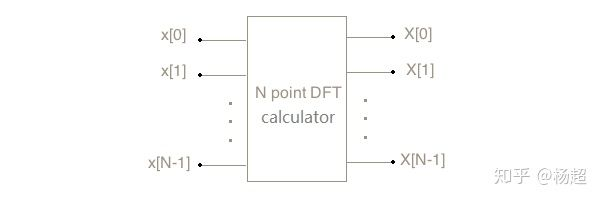

如果直接按DFT定义式暴力计算，每一个输出都需要计算N次乘法，故N个输出共需乘法N*N次，即算法复杂度为O(N*N)，是比较高的。

快速傅里叶变换则是使用分治思想对DFT进行计算，可有效降低算法复杂度。

注：FFT只用于计算N为2的幂的DFT。

考虑如何用两个N/2 point DFT calculator去构造出一个N point DFT calculator（N为2的幂）。

如果将序号为偶数的输入给到第一个N/2 point DFT calculator，序号为奇数的输入给到第二个N/2 point DFT calcuator，如下图所示：

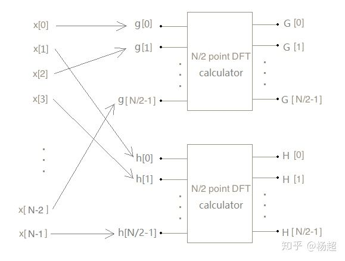

则有：

![[公式]](FftSeaSurfaceSimulation.assets/equation.svg) 

![[公式]](FftSeaSurfaceSimulation.assets/equation.svg) 

如何用G(k)和H(k)得到X(k)呢？

结论是：

![[公式]](FftSeaSurfaceSimulation.assets/equation.svg) 

推导过程如下：

当 ![[公式]](FftSeaSurfaceSimulation.assets/equation.svg) 时G(k)和H(k)均有定义，有：

![[公式]](FftSeaSurfaceSimulation.assets/equation.svg) 

![[公式]](FftSeaSurfaceSimulation.assets/equation.svg) 

![[公式]](FftSeaSurfaceSimulation.assets/equation.svg) 

![[公式]](FftSeaSurfaceSimulation.assets/equation.svg) 

当 ![[公式]](https://www.zhihu.com/equation?tex=k%5Cin%7B%5C%7B%5Cfrac%7BN%7D%7B2%7D%2C%5Cfrac%7BN%7D%7B2%7D%2B1%2C...%2CN-1%5C%7D%7D) 时，令K=k-N/2，则 ![[公式]](FftSeaSurfaceSimulation.assets/equation.svg) ,有：

![[公式]](https://www.zhihu.com/equation?tex=X%28k%29%3D%5Csum_%7Bn%3D0%7D%5E%7BN-1%7D%7Bx%28n%29e%5E%7B-i%5Cfrac%7B2%5Cpi+kn%7D%7BN%7D%7D%7D) 

![[公式]](https://www.zhihu.com/equation?tex=%3D%5Csum_%7Bn%3D0%7D%5E%7BN%2F2-1%7D%7Bx%282n%29e%5E%7B-i%5Cfrac%7B2%5Cpi+k%282n%29%7D%7BN%7D%7D%7D%2B%5Csum_%7Bn%3D0%7D%5E%7BN%2F2-1%7D%7Bx%282n%2B1%29e%5E%7B-i%5Cfrac%7B2%5Cpi+k%282n%2B1%29%7D%7BN%7D%7D%7D) 

![[公式]](FftSeaSurfaceSimulation.assets/equation.svg) 

![[公式]](FftSeaSurfaceSimulation.assets/equation.svg) 

![[公式]](FftSeaSurfaceSimulation.assets/equation.svg) 

![[公式]](FftSeaSurfaceSimulation.assets/equation.svg) 

![[公式]](FftSeaSurfaceSimulation.assets/equation.svg) 

根据上面X与H、G的关系，可补全电路图如下：

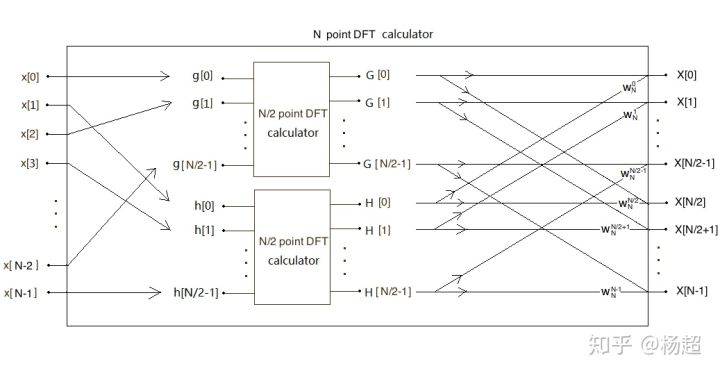

至此完成了用两个N/2 point DFT calculator构造N point DFT calculator。

以上就是递归形式的FFT算法。但递归形式一般效率不佳，尤其是不适合在gpu上实现，所以经典的FFT算法并不是采用这种形式，而是采用展平的形式，所谓蝶形网络（见下一节）。

无论是递归形式还是蝶形网络，算法复杂度的量级是一样的。下面计算算法复杂度：

设上面N point DFT calculator的乘法次数为C(N)，则两个N/2 point DFT calculator的乘法次数均为C(N/2)，又由G和H计算X另需N次乘法，故有：

C(N)=2*C(N/2 )+N

此递推方程求解如下：

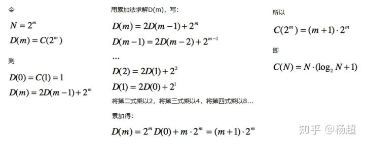

故算法复杂度为 ![[公式]](FftSeaSurfaceSimulation.assets/equation.svg) ，是不是快了不少。

**二，蝶形网络（**butterfly diagram**）**

用上一节的递归电路计算4 point DFT，完整展开如下图所示：

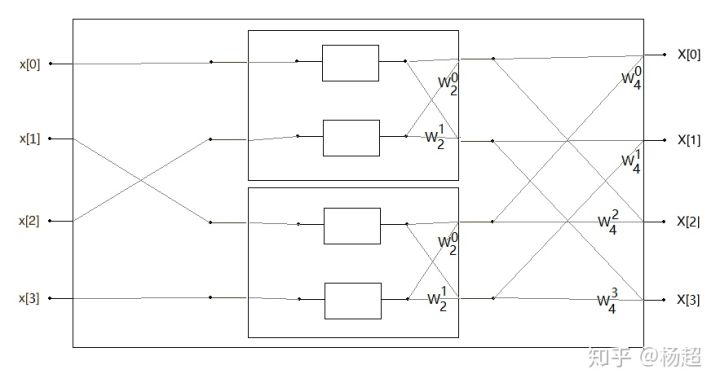

简化得：

此即4 point FFT的蝶形网络。

另外可以利用公式 ![[公式]](FftSeaSurfaceSimulation.assets/equation.svg) 对蝶形网络权重作如下变形：

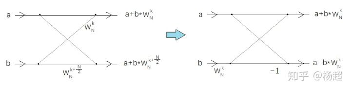

得：

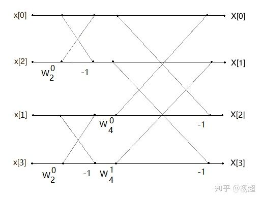

这是4 point FFT蝶形网络的另一种形式。

类似的，8 point FFT蝶形网络（第二种形式）为：

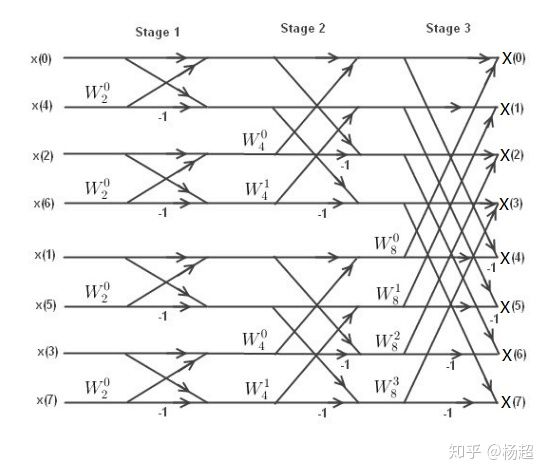

对于给定的point数，蝶形网络是固定，可预计算。在fft的gpu实现中，通常将其生成为lut。

上图中还标出了stage。使用蝶形网络计算FFT，是按stage推进的：N个输入经过第一个stage得到N个中间结果，再输入第二个stage...直至得到最终N个输出。N point FFT有 ![[公式]](FftSeaSurfaceSimulation.assets/equation.svg) 个stage。

**三，bitreverse算法**

注意到蝶形网络的N个输入的顺序是打乱的，以8 point蝶形网络为例，可以看到：

x(0)在0号位，x(1)在4号位，x(2)在2号位，x(3)在6号位，x(4)在1号位，x(5)在5号位，x(6)在3号位，x(7)在7位号。

对于一般N point的情况，这个顺序是否可以直接算出来呢？

答案是肯定的，有称为bitreverse的算法，说：

对于N point蝶形网络，求x(k)在几号位，只需将k化为 ![[公式]](https://www.zhihu.com/equation?tex=log_2N) 位二进制数，然后将bit反序，再转回十进制，所得结果即为x(k)所在位号。

以8 point蝶形网络为例，我们求x(3)在几号位，将3化为 ![[公式]](FftSeaSurfaceSimulation.assets/equation.svg) 位二进制数得011，bit反序得110，将110化回十进制得6，所以x(3)在6号位。

下面是完整列表：（图取自：[OpenStax CNX](https://link.zhihu.com/?target=https%3A//cnx.org/contents/zmcmahhR%407/Decimation-in-time-DIT-Radix-2-FFT)）

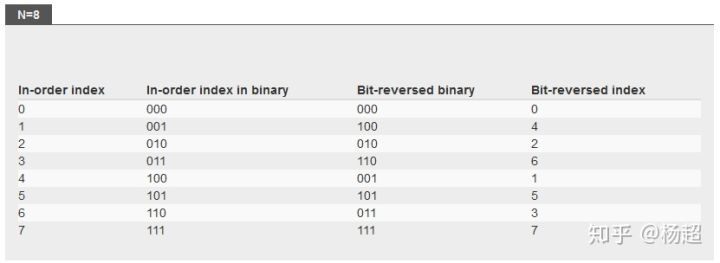

此算法看起来很神奇，但其实是比较容易理解的。

作为事后诸葛，我估计它是这么想出来的：

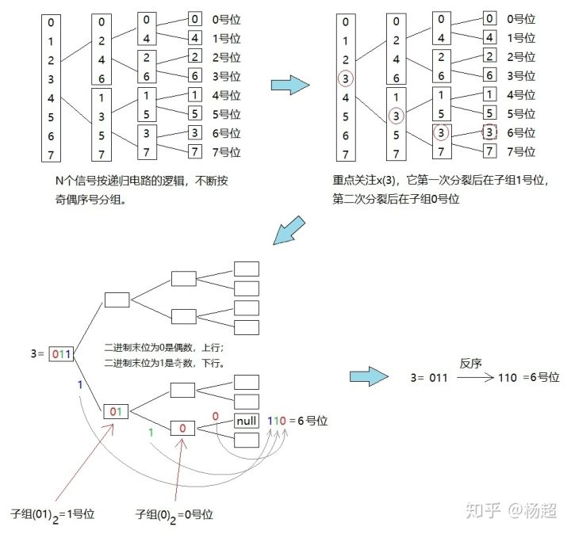

以上就是用于快速计算DFT的FFT算法。

**四，IFFT**

回到海面模型，遗憾的是它并非DFT而是IDFT，所以无法套用FFT算法。

不过没事儿，比较标准DFT和标准IDFT的表达式：

DFT：

![[公式]](FftSeaSurfaceSimulation.assets/equation.svg) 

IDFT：

![[公式]](FftSeaSurfaceSimulation.assets/equation.svg) 

我们发现，两者很像。所以，虽然无法直接套用，前者思路仍可运用于后者。

模仿FFT算法推导过程重来一遍，可以得到IFFT算法：

用两个N/2  point IDFT calculator去构造一个N point IDFT calculator。将序号为偶数的输入给到第一个N/2  point IDFT calculator，序号为奇数的输入给到第二个N/2 point IDFT calcuator，如下图所示：

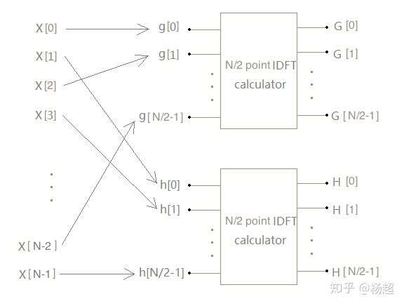

则有：

![[公式]](FftSeaSurfaceSimulation.assets/equation.svg) 

![[公式]](FftSeaSurfaceSimulation.assets/equation.svg) 

如何用G(n)和H(n)得到x(n)呢？

与前面类似方法可推得：

![[公式]](FftSeaSurfaceSimulation.assets/equation.svg) 

于是补全电路图：

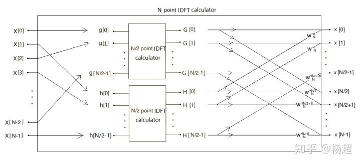

与前面相同，取N=4将电路彻底展开并简化，得到4 point IFFT蝶形网络：

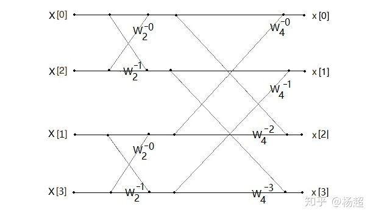

利用公式 ![[公式]](FftSeaSurfaceSimulation.assets/equation.svg) 可变形为第二种形式：

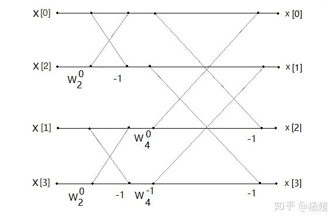

8 point IFFT蝶形网络（第二种形式）：

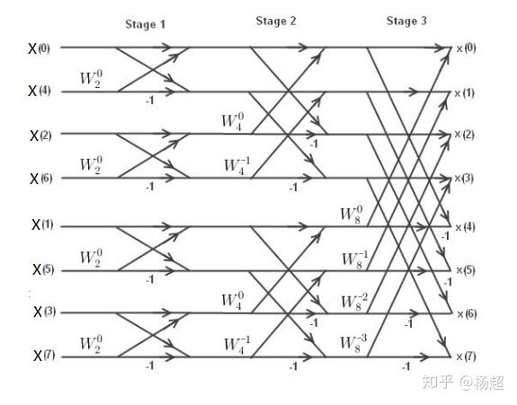

另外，IFFT的bitreverse与FFT相同。

最后由于DFT/IDFT是线性的，所以常数因子并不会影响算法。

故适用于标准IDFT：

![[公式]](FftSeaSurfaceSimulation.assets/equation.svg) 

的IFFT算法，可不加任何修改地应用于未归一化的IDFT：

![[公式]](FftSeaSurfaceSimulation.assets/equation.svg) 

海面的IDFT模型更接近于后者。