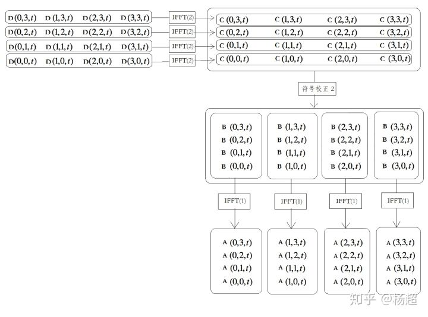
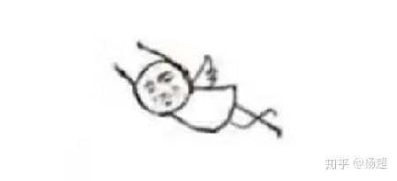

# fft海面模拟（三）

[杨超](https://www.zhihu.com/people/wantnon)

图形学、科幻、游戏

[YivanLee](https://www.zhihu.com/people/SuperPandaGX) 等 

接上一篇：[杨超：fft海面模拟（二）](https://zhuanlan.zhihu.com/p/64726720)

<iframe allowfullscreen="" src="https://www.zhihu.com/video/1110662803219845120?autoplay=false&amp;useMSE=" frameborder="0"></iframe>

<iframe allowfullscreen="" src="https://www.zhihu.com/video/1112397163879006208?autoplay=false&amp;useMSE=" frameborder="0"></iframe>

本篇说如何用IFFT计算海面IDFT模型。

将海面IDFT模型

![[公式]](FftSeaSurfaceSimulation_2.assets/equation.svg) 

写成标量形式：

![[公式]](FftSeaSurfaceSimulation_2.assets/equation.svg) 

接下来将 kx和kz展开，因为：

![[公式]](FftSeaSurfaceSimulation_2.assets/equation.svg) 

![[公式]](FftSeaSurfaceSimulation_2.assets/equation.svg) 

故：

![[公式]](FftSeaSurfaceSimulation_2.assets/equation.svg) 

为使下标从0开始，令m'=m+N/2，n'=n+N/2，则 ![[公式]](FftSeaSurfaceSimulation_2.assets/equation.svg) 。得：

![[公式]](FftSeaSurfaceSimulation_2.assets/equation.svg) 

令 ![[公式]](https://www.zhihu.com/equation?tex=%5Ctilde%7Bh%7D%27%28n%27%2Cm%27%2Ct%29%3D%5Ctilde%7Bh%7D%28%5Cfrac%7B2+%5Cpi+%28n%27-%5Cfrac%7BN%7D%7B2%7D%29%7D%7BL%7D%2C%5Cfrac%7B2%5Cpi+%28m%27-%5Cfrac%7BN%7D%7B2%7D%29%7D%7BL%7D%2Ct%29)，并将 ![[公式]](FftSeaSurfaceSimulation_2.assets/equation.svg) 由内层求和号中提出，得：

![[公式]](https://www.zhihu.com/equation?tex=h%28x%2Cz%2Ct%29%3D%5Csum_%7Bm%27%3D0%7D%5E%7BN-1%7De%5E%7Bi%5Cfrac%7B2%5Cpi%28m%27-%5Cfrac%7BN%7D%7B2%7D%29z%7D%7BL%7D%7D%5Csum_%7Bn%27%3D0%7D%5E%7BN-1%7D%5Ctilde%7Bh%7D%27%28n%27%2Cm%27%2Ct%29e%5E%7Bi%5Cfrac%7B2+%5Cpi%28n%27-%5Cfrac%7BN%7D%7B2%7D%29x%7D%7BL%7D%7D) 

上式可拆成：

![[公式]](FftSeaSurfaceSimulation_2.assets/equation.svg) 

![[公式]](FftSeaSurfaceSimulation_2.assets/equation.svg) 

由于L长度可随意选取，为向IDFT形式靠拢，取L=N，得：

![[公式]](FftSeaSurfaceSimulation_2.assets/equation.svg) ...(a)

![[公式]](FftSeaSurfaceSimulation_2.assets/equation.svg) ...(b)

接下来把x和z展开。因为：

![[公式]](FftSeaSurfaceSimulation_2.assets/equation.svg) 

![[公式]](FftSeaSurfaceSimulation_2.assets/equation.svg) 

又因为L=N，且为使下标变为从零开始，令u'=u+N/2，v'=v+N/2，得：

![[公式]](FftSeaSurfaceSimulation_2.assets/equation.svg) 

![[公式]](FftSeaSurfaceSimulation_2.assets/equation.svg) 

代入(a)、(b)得：

![[公式]](FftSeaSurfaceSimulation_2.assets/equation.svg) ...(c)

![[公式]](FftSeaSurfaceSimulation_2.assets/equation.svg) ...(d)

令：

![[公式]](https://www.zhihu.com/equation?tex=A%28u%27%2Cv%27%2Ct%29%3Dh%28u%27-%5Cfrac%7BN%7D%7B2%7D%2Cv%27-%5Cfrac%7BN%7D%7B2%7D%2Ct%29%2F%28-1%29%5E%7Bv%27-%5Cfrac%7BN%7D%7B2%7D%7D) 

![[公式]](FftSeaSurfaceSimulation_2.assets/equation.svg) 

![[公式]](FftSeaSurfaceSimulation_2.assets/equation.svg) 

![[公式]](FftSeaSurfaceSimulation_2.assets/equation.svg) 

则(c)、(d)变为：

![[公式]](FftSeaSurfaceSimulation_2.assets/equation.svg) ...(1)

![[公式]](FftSeaSurfaceSimulation_2.assets/equation.svg) ...(2)

至此，已化成非归一化的IDFT形式，可以套用IFFT了！

总结起来海面IFFT计算流程如下：

1，根据菲利普频谱公式得到各 ![[公式]](https://www.zhihu.com/equation?tex=%5Ctilde%7Bh%7D%28k_x%2Ck_z%2Ct%29) 。（参见：[杨超：fft海面模拟(一)](https://zhuanlan.zhihu.com/p/64414956)）。

2，根据 ![[公式]](https://www.zhihu.com/equation?tex=%5Ctilde%7Bh%7D%27%28n%27%2Cm%27%2Ct%29%3D%5Ctilde%7Bh%7D%28k_x%2Ck_z%2Ct%29)得到各 ![[公式]](FftSeaSurfaceSimulation_2.assets/equation.svg) 。

3，根据 ![[公式]](FftSeaSurfaceSimulation_2.assets/equation.svg) 得到各 ![[公式]](FftSeaSurfaceSimulation_2.assets/equation.svg) 。(符号校正1)。

4，根据（2）式计算行IFFT，得到各 ![[公式]](FftSeaSurfaceSimulation_2.assets/equation.svg) 。

5，根据 ![[公式]](https://www.zhihu.com/equation?tex=B%28u%27%2Cm%27%2Ct%29%3DC%28u%27%2Cm%27%2Ct%29%28-1%29%5E%7Bm%27%2Bu%27-%5Cfrac%7BN%7D%7B2%7D%7D) 得到各 ![[公式]](FftSeaSurfaceSimulation_2.assets/equation.svg) 。(符号校正2)。

6，根据（1）式计算列IFFT，得到各 ![[公式]](FftSeaSurfaceSimulation_2.assets/equation.svg) 。

7，根据 ![[公式]](https://www.zhihu.com/equation?tex=h%28x%2Cz%2Ct%29%3DA%28u%27%2Cv%27%2Ct%29%28-1%29%5E%7Bv%27-%5Cfrac%7BN%7D%7B2%7D%7D) 得到各 ![[公式]](FftSeaSurfaceSimulation_2.assets/equation.svg) 。(符号校正3)。

8，结束。

可见，计算量主要集中在1，4，6步，其余步骤均为简单转换。

以N=4为例：

假设1，2，3步已执行完，而后便是核心的计算行、列IFFT步骤（4~6步），图示如下：

图中IFFT(1)表示式(1)对应的IFFT，IFFT(2)表示式(2)对应的IFFT。

可见总共需要计算8个4 point IFFT。（一般情况需要计算2N个N point IFFT）。

最后再执行步骤7得到各h(x,z,t)即可。

如果是gpu实现，则那4个IFFT(2)可以并行，4个IFFT(1)也可以并行。故一般情况下gpu实现只相当于计算2个N point IFFT的量。飞起。

至此，FFT海面整个逻辑链条都理清了。

关于实现和优化细节也有一些技巧值得一说，例如“蝶形lut生成”、“stage乒乓”、“分帧插值”，或许以后再另写一篇。本系列重在原理，就先这样了。

参考文章：

[http://citeseerx.ist.psu.edu/viewdoc/download?doi=10.1.1.161.9102&rep=rep1&type=pdf](https://link.zhihu.com/?target=http%3A//citeseerx.ist.psu.edu/viewdoc/download%3Fdoi%3D10.1.1.161.9102%26rep%3Drep1%26type%3Dpdf)

[http://www.keithlantz.net/2011/10/ocean-simulation-part-one-using-the-discrete-fourier-transform/](https://link.zhihu.com/?target=http%3A//www.keithlantz.net/2011/10/ocean-simulation-part-one-using-the-discrete-fourier-transform/)

[http://www.keithlantz.net/2011/11/ocean-simulation-part-two-using-the-fast-fourier-transform/](https://link.zhihu.com/?target=http%3A//www.keithlantz.net/2011/11/ocean-simulation-part-two-using-the-fast-fourier-transform/)

[OpenStax CNX](https://link.zhihu.com/?target=https%3A//cnx.org/contents/zmcmahhR%407/Decimation-in-time-DIT-Radix-2-FFT)

编辑于 2019-05-16