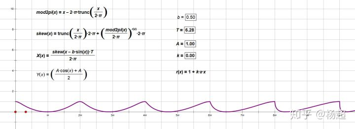
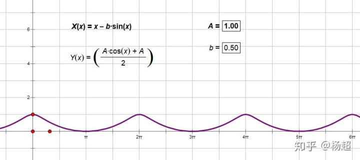
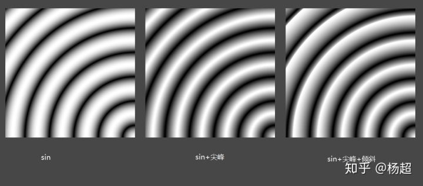
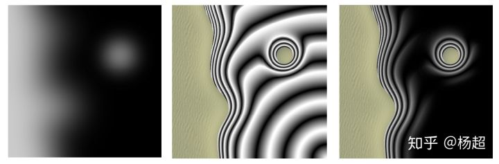
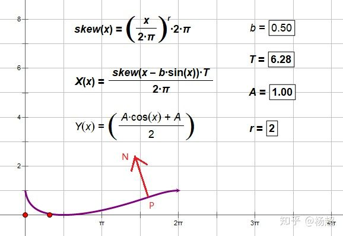
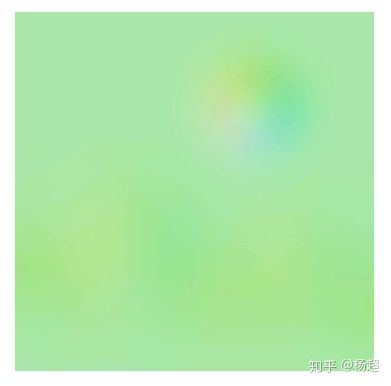
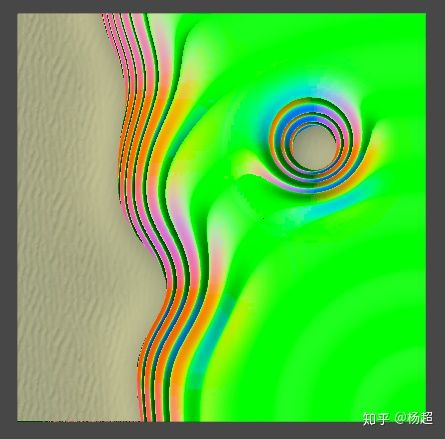
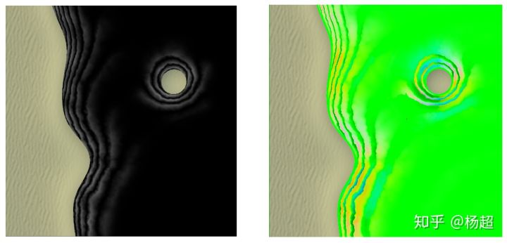
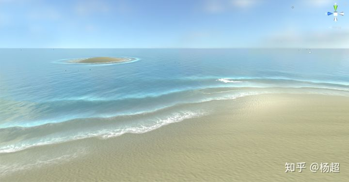

# 近岸海浪效果（二）

上一篇用公式描画出了海浪波形如下：

本篇把它变成3d海浪。

一，化参数方程为普通方程

我们想在shader中根据位置计算高度，故需要Y与X的函数关系。

但我们的波形是以参数方程给出的：

为了获得Y与X的函数关系，需要将参数方程

![[公式]](NearShoreWaveEffect_2.assets/equation.svg)

化为普通方程。 

令 ![[公式]](NearShoreWaveEffect_2.assets/equation.svg) ，则：

![[公式]](NearShoreWaveEffect_2.assets/equation.svg) 

可见，只要能求出 ![[公式]](NearShoreWaveEffect_2.assets/equation.svg) 问题就解决了。

只可惜y=x-b*sinx是解不出来的，不过不用慌。

可以用lut解决，即把y=x-b*sinx的解预计算存到纹理里。（当b在[0,1]之间时x-b*****sinx是增函数，所以解唯一。另外，当x在[0,2pi]时y也在[0,2pi])。

得到lut如下：

我用的是浮点纹理，在unity中浮点纹理必定为linear。

在此基础上再加入skew就很简单了。

二，高度计算

选一个点作为波源，原则上只要远离海岸即可。我这里选的是海面面片的右下角。

对于海面上任意一点，以此点到波源的距离作为X，计算Y值生成高度。

下面三个图依次为纯sin、sin+尖峰、sin+尖峰+倾斜：

但圆形扩散的波纹不是我们想要的，我们想要波纹与海岸吻合。

上一篇已经说过，近岸海浪的浪排之所以平行于海岸，是由于海浪接近海岸时减速，速度差使浪排偏转所致。这里有个在油管上找到的科普视频，感兴趣的可以看下：

[https://www.youtube.com/watch?v=bacwP-9osVE](https://link.zhihu.com/?target=https%3A//www.youtube.com/watch%3Fv%3DbacwP-9osVE)[www.youtube.com](https://link.zhihu.com/?target=https%3A//www.youtube.com/watch%3Fv%3DbacwP-9osVE)

（上图左为地形高度图，中为变频结果，右为屏蔽掉远海只留近岸）

可以看到，连海岛周围的一圈都能生成出来。

三，法线计算

由于周期性，只需考虑一个周期内的情况。

考虑下面这个法线N怎么求：

显然有 N=normalize(-dY/dX,1)，于是只需求dY/dX。

记 ![[公式]](https://www.zhihu.com/equation?tex=s%28x%29%3D%28%5Cfrac%7Bx%7D%7B2%5Cpi%7D%29%5Er%2A2%5Cpi) ， ![[公式]](NearShoreWaveEffect_2.assets/equation.svg) 

则有 ![[公式]](NearShoreWaveEffect_2.assets/equation.svg) ， ![[公式]](https://www.zhihu.com/equation?tex=%5Cfrac%7Bdg%7D%7Bdx%7D%3D1-b%2Acosx) 

以及：

![[公式]](NearShoreWaveEffect_2.assets/equation.svg) 

![[公式]](NearShoreWaveEffect_2.assets/equation.svg) 

![[公式]](NearShoreWaveEffect_2.assets/equation.svg) 

![[公式]](NearShoreWaveEffect_2.assets/equation.svg)

![[公式]](NearShoreWaveEffect_2.assets/equation.svg) 

所以：

![[公式]](NearShoreWaveEffect_2.assets/equation.svg) 

 所以 

![[公式]](NearShoreWaveEffect_2.assets/equation.svg) 

![[公式]](NearShoreWaveEffect_2.assets/equation.svg) 

这里的N还只是2d的，欲转为3d，只需再知道海浪的传播方向dir。

由于近岸海浪传播方向近似与岸边垂直，于是可直接取海床梯度在xz平面投影的方向作为dir,又由于梯度在xz上的投影与法线在xz上的投影恰好反向，所以取：

![[公式]](NearShoreWaveEffect_2.assets/equation.svg) 

seabedNormal取自houdini中预烘焙的海底法线图：

则3d海浪法线为：

![[公式]](NearShoreWaveEffect_2.assets/equation.svg) 

得到法线如下（同样屏蔽了远海）：

四，噪声

前面生成的高度和法线都太规则，为了使其更自然，用噪声图对X和Y以及法线进行一些扰动，这个比较随意，全凭感觉。最后得到：

另外，上面的法线只是近岸海浪的法线，还需和远洋海浪法线进行融合，得到最终完整法线。

至此难点都已说到。其余都是没啥技术含量的细支末节了。

最终效果：

