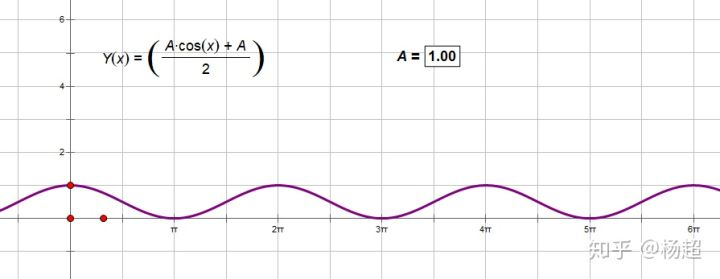
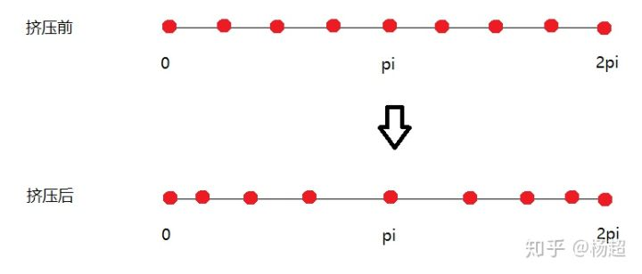
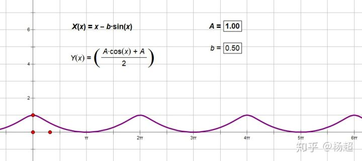
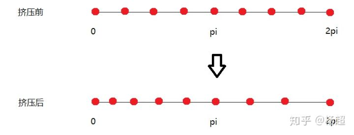
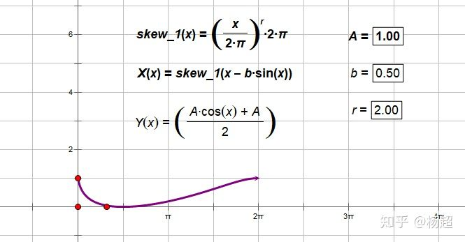
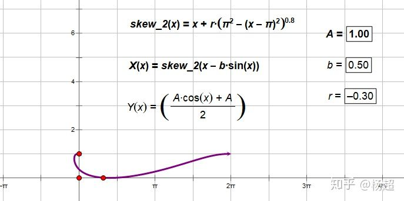
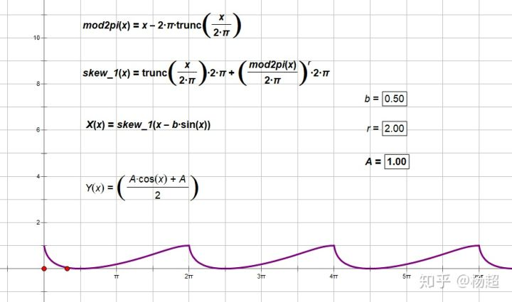
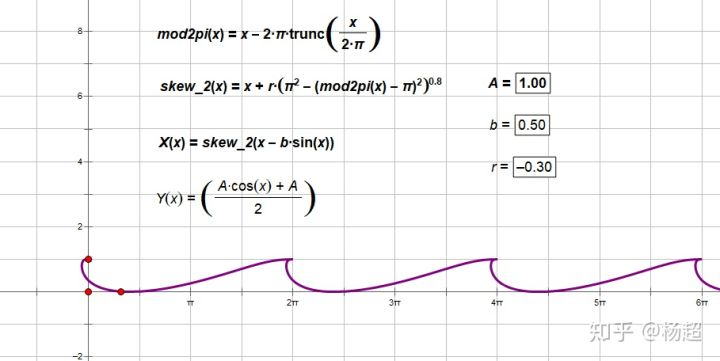
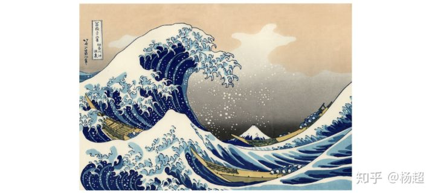
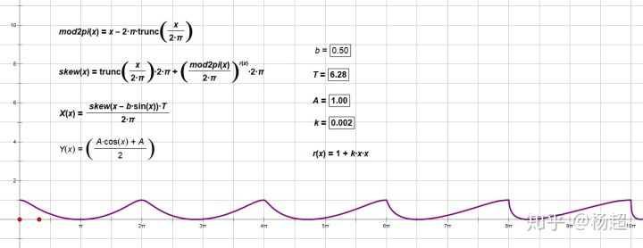

# 近岸海浪效果（一）

最近尝试了一下实现近岸海浪效果。

得到结果如下：

<iframe allowfullscreen="" src="https://www.zhihu.com/video/1105526302806945792?autoplay=false&amp;useMSE=" frameborder="0"></iframe>

近岸海浪效果

注意近岸海浪（near shore wave）与远洋海浪(open sea wave)的区别：

远洋海浪是大量不同频率波形叠加，可通过fft产生，方法已十分成熟。

近岸海浪则是浪排接近岸边时因速度差造成偏转，倾向于与岸边平行，最终拍在沙滩上。由于物理机制更复杂，实时渲染中表现，只能更多借助TA手段。

\--

本篇先讲海浪形状的塑造。

一，大形：

用cos函数模拟海浪大形

二，波峰尖角

通过对横轴进行挤压，使波峰产生尖角。

挤压方式需如下图：

满足上图的挤压操作有无数种，x=x-b*sin(x)是其中一种（正是gerstner wave的套路），得：

三，海浪倾斜

故技重演，考虑什么样的挤压操作能使海浪发生倾斜。显然如下挤压方式可以：

满足上图的挤压操作有无数种，下面列举其中两种：

第一种 x=skew_1(x)= ![[公式]](NearshoreWaveEffect.assets/equation.svg) 

第二种：x=skew_2(x)= ![[公式]](NearshoreWaveEffect.assets/equation.svg) 

上面两图均只展示了一个周期，原因是上述挤压操作只适用于区间[0,2pi]，如果想扩展为对所有周期都适用，需作一些修改，如下：

第一种挤压操作修改为适用于所有周期：

第二种挤压操作修改为适用于所有周期：

个人更喜欢第二种挤压操作，其优势在于是多值函数（一个x可对应多个y），更符合真实世界中海浪的特点。而第一种挤压操作则只能是单值。

不过最后我还是采用了第一种挤压操作。

原因是我这个海浪打算用于手游，而手机性能所限，没有足够的顶点数预算支持海浪mesh，最多也就是通过海浪法线来表现凹凸。所以虽然第二种挤压有多值优势，在此情况下发挥不出来，甚至还可能在多值强行退化为单值时产生瑕疵。

四，不同的倾斜度

前面我们已决定用第一种挤压方法做倾斜。在此基础上，将r由常数改为单调增函数（我取的是![[公式]](NearshoreWaveEffect.assets/equation.svg) ），结果如图：

上图波形，我们想象为从左到右越来越接近岸边，像那么回事儿。

