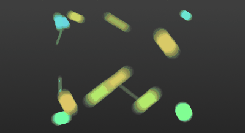
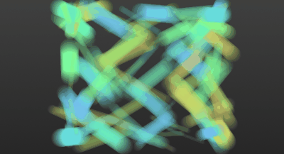
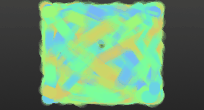

# 【shadertoy】线性动态模糊的实现 Analytical Motion Blur

动机

在shadertoy看到这个动态模糊的代码Analytical Motionblur 2D。不只是他的动态模糊，他整体的颜色、背景、小球的运动等都感觉很棒。代码也不长，因此仔细研究了下。

具体效果如下：



出于好奇尝试了100个小球、1000个小球高速运动的情况：






下面一步步实现。


1. 坐标映射

首先对原来的屏幕坐标 fragCoord 重新做映射，映射后屏幕坐标如下：

通过除以屏幕高度，将纵坐标限制在[−1,1]

[−1,1]。

代码：

```
vec2 p = (2.0*fragCoord.xy-iResolution.xy) / iResolution.y;
```

2. 画背景

这个效果让人看着舒服，和他的背景关系也非常大。他是从纵向渐变的黑色，并且非常smooth。实现代码是这样的：

```
void mainImage( out vec4 fragColor, in vec2 fragCoord )
{
	vec2 p = (2.0*fragCoord.xy-iResolution.xy) / iResolution.y;
	vec3 col = vec3(0.2) + 0.05*p.y;
    // 加入噪声
    col += (1.0/255.0)*hash3(p.x+13.0*p.y); // hash3返回随机3维向量
    fragColor = vec4(col,1.0);
}
```


hash3返回[0,1)

[0,1)的随机三维向量。给像素点的颜色值加上这个随机数，是为了避免webGL的优化。如果去掉这行代码，最终结果如下左图，加上后如下右图。

3. 生成运动的小球

先看想要达到的效果：

首先会需要用来生成运动小球的函数：


```
const float speed = 5.0;
vec2 getPosition( float time, vec4 id ) { 
	return vec2(0.9*sin((speed*(0.75+0.5*id.z))*time+20.0*id.x),
		0.75*cos(speed*(0.75+0.5*id.w)*time+20.0*id.y) ); 
}
```

不同的id
id能得到不同的小球，他们的运动轨迹在xx轴yy轴上的投影都是正弦函数。四维向量idid的每个分量分别决定了：小球水平运动的初项、小球水平运动的频率、小球垂直运动的初项、小球垂直运动的频率。常量speed

speed能控制整体的运动速度。

接下来就能生成ballNum个小球了。


	

```
const int ballNum = 15;
void mainImage( out vec4 fragColor, in vec2 fragCoord )
{
	vec2 p = (2.0*fragCoord.xy-iResolution.xy) / iResolution.y;
	vec3 col = vec3(0.2) + 0.05*p.y;
for( int i=0; i<ballNum; i++ ) {		
	vec4 off = hash4(float(i) * 13.13); // hash4返回随机4维向量
	vec3 sph = vec3(getPosition(iTime, off), 0.02+0.1*off.x); // 小球的坐标，第三个维度代表小球半径
	vec3 sphcol = 0.7 + 0.3*sin( 3.0*off.z + vec3(4.0,0.0,2.0) ); // 随机小球的颜色
	col = disk( col, p, sph, sphcol ); // 混合得到该像素点的颜色，具体见下文
}		

	col += (1.0/255.0)*hash3(p.x+13.0*p.y);
	fragColor = vec4(col,1.0);
	}
```

disk函数的作用是，给定像素点p
p的坐标和原来的颜色，计算该像素点混合上小球后的颜色（小球坐标为sph.xysph.xy，半径为sph.zsph.z，颜色为sphcol

sphcol）。代码如下：（这部分是笔者自己加的）


```
vec3 disk( vec3 col, in vec2 uv, in vec3 sph, in vec3 sphcol ) {
    vec2 xc = uv - sph.xy;
    float h = (sph.z - sqrt(dot(xc,xc))) / sph.z ;
    return mix( col, sphcol, clamp(2.0*h,0.0,1.0) );
}
```

原理就是算像素点到小球球心的距离，根据这个距离决定混合颜色的系数。

到这里为止，完整代码如下：


	

```
vec3 disk( vec3 col, in vec2 uv, in vec3 sph, in vec3 sphcol ) {
    vec2 xc = uv - sph.xy;
    float h = (sph.z - sqrt(dot(xc,xc))) / sph.z ;
    return mix( col, sphcol, clamp(2.0*h,0.0,1.0) );
}

vec3 hash3( float n ) { return fract(sin(vec3(n,n+1.0,n+2.0))*43758.5453123); }
vec4 hash4( float n ) { return fract(sin(vec4(n,n+1.0,n+2.0,n+3.0))*43758.5453123); }

const float speed = 5.0;
vec2 getPosition( float time, vec4 id ) { 
	return vec2( 0.9*sin((speed*(0.75+0.5*id.z))*time+20.0*id.x), 
		0.75*cos(speed*(0.75+0.5*id.w)*time+20.0*id.y) ); 
}

const int ballNum = 15;
void mainImage( out vec4 fragColor, in vec2 fragCoord ) {
	vec2 p = (2.0*fragCoord.xy-iResolution.xy) / iResolution.y;
	vec3 col = vec3(0.2) + 0.05*p.y;
for( int i=0; i<ballNum; i++ ) {		
	vec4 off = hash4( float(i)*13.13 );
	vec3 sph = vec3( getPosition( iTime, off ), 0.02+0.1*off.x );
	vec3 sphcol = 0.7 + 0.3*sin( 3.0*off.z + vec3(4.0,0.0,2.0) );
	col = disk( col, p, sph, sphcol );
}		

col += (1.0/255.0)*hash3(p.x+13.0*p.y);
fragColor = vec4(col,1.0);
}
```


4.加入动态模糊

为了了解动态模糊的实现，先看一下开启动态模糊时，某一帧的样子。

事实上就是在原来小球的位置，朝着它速度的反方向扫出一条轨迹，这条轨迹的长短与速度大小有关。

要得到小球的速度，只要对小球位置函数求导：


```
vec2 getVelocity( float time, vec4 id ) { 
	return vec2( speed*0.9*cos((speed*(0.75+0.5*id.z))*time+20.0*id.x)*(0.75+0.5*id.z), 
		-speed*0.75*sin(speed*(0.75+0.5*id.w)*time+20.0*id.y)*(0.75+0.5*id.w) ); 
}
```

接下来问题就只是如何求某一像素点的颜色。原来的disk函数已经不够用了。为了简化问题，假设动态模糊时，小球朝速度反方向扫过的长度就等于速度大小。定义一些符号：速度向量cd⃗ 
cd
，小球球心sphsph，像素点坐标uvuv，起点为sphsph终点为uvuv的向量xc⃗ xc
，小球半径为r

r。

求解下述方程，推导可以知道这是一个一元二次方程。
∣∣cd⃗ ∗t+xc⃗ ∣∣=r
∣∣cd
∗t+xc

∣∣=r

方程具体含义可以见下图。如果该方程无实数根，说明坐标为uv
uv的像素一定在轨迹之外。若有实数根，得到两个根t1,t2

t1,t2，如果有一个根大于1，或两个根都大于0，那么也一定在轨迹外。根据这两个根大小能够混合颜色。具体见代码。

代码如下：


```
vec3 diskWithMotionBlur( vec3 col, in vec2 uv, in vec3 sph, in vec2 cd, in vec3 sphcol )
{
	vec2 xc = uv - sph.xy;
	float a = dot(cd,cd);
	float b = dot(cd,xc);
	float c = dot(xc,xc) - sph.z*sph.z;
	float h = b*b - a*c;
	if( h>0.0 ) // 判断是否有实数根
	{
		h = sqrt( h );
		float ta = max( 0.0, (-b - h)/a ); // 用求根公式求解
		float tb = min( 1.0, (-b + h)/a );
		col = mix( col, sphcol, clamp(2.0*(tb-ta),0.0,1.0) );
	}
	return col;
}xxxxxxxxxx vec3 diskWithMotionBlur( vec3 col, in vec2 uv, in vec3 sph, in vec2 cd, in vec3 sphcol ){    vec2 xc = uv - sph.xy;    float a = dot(cd,cd);    float b = dot(cd,xc);    float c = dot(xc,xc) - sph.z*sph.z;    float h = b*b - a*c;    if( h>0.0 ) // 判断是否有实数根    {        h = sqrt( h );        float ta = max( 0.0, (-b - h)/a ); // 用求根公式求解        float tb = min( 1.0, (-b + h)/a );        col = mix( col, sphcol, clamp(2.0*(tb-ta),0.0,1.0) );    }    return col;}12345678910111213141516
```

最终效果如下：

可以通过修改getVelocity函数，来修改轨迹的长度。例如将轨迹长度改为速度大小的两倍。

完整代码如下：


		

```
vec3 diskWithMotionBlur( vec3 col, in vec2 uv, in vec3 sph, in vec2 cd, in vec3 sphcol )
{
	vec2 xc = uv - sph.xy;
	float a = dot(cd,cd);
	float b = dot(cd,xc);
	float c = dot(xc,xc) - sph.z*sph.z;
	float h = b*b - a*c;
	if( h>0.0 )
	{
		h = sqrt( h );	float ta = max( 0.0, (-b - h)/a );
        float tb = min( 1.0, (-b + h)/a );
        col = mix( col, sphcol, clamp(2.0*(tb-ta),0.0,1.0) );
	}

	return col;
}
```


	

```
vec3 hash3( float n ) { return fract(sin(vec3(n,n+1.0,n+2.0))*43758.5453123); }
vec4 hash4( float n ) { return fract(sin(vec4(n,n+1.0,n+2.0,n+3.0))*43758.5453123); }

const float speed = 5.0;
vec2 getPosition( float time, vec4 id ) { 
	return vec2( 0.9*sin((speed*(0.75+0.5*id.z))*time+20.0*id.x), 
		0.75*cos(speed*(0.75+0.5*id.w)*time+20.0*id.y) ); 
}
vec2 getVelocity( float time, vec4 id ) { 
	return vec2( speed*0.9*cos((speed*(0.75+0.5*id.z))*time+20.0*id.x)*(0.75+0.5*id.z), 
		-speed*0.75*sin(speed*(0.75+0.5*id.w)*time+20.0*id.y)*(0.75+0.5*id.w) ); 
}

const int ballNum = 15;
void mainImage( out vec4 fragColor, in vec2 fragCoord )
{
	vec2 p = (2.0*fragCoord.xy-iResolution.xy) / iResolution.y;
vec3 col = vec3(0.2) + 0.05*p.y;

for( int i=0; i<ballNum; i++ )
{		
	vec4 off = hash4( float(i)*13.13 );
	vec3 sph = vec3( getPosition( iTime, off ), 0.02+0.1*off.x );
	vec2 cd = getVelocity( iTime, off ) /24.0 ;
	vec3 sphcol = 0.7 + 0.3*sin( 3.0*off.z + vec3(4.0,0.0,2.0) );
	
	col = diskWithMotionBlur( col, p, sph, cd, sphcol );
}		

col += (1.0/255.0)*hash3(p.x+13.0*p.y);

fragColor = vec4(col,1.0);
}
```

## 

版权声明：本文为CSDN博主「钱哲琦」的原创文章，遵循CC 4.0 by-sa版权协议，转载请附上原文出处链接及本声明。
原文链接：https://blog.csdn.net/Techmonster/article/details/81365674