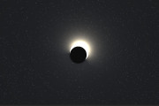
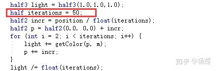
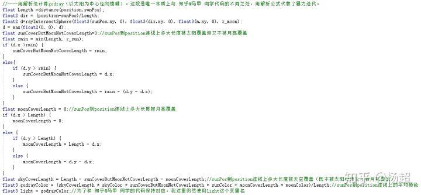
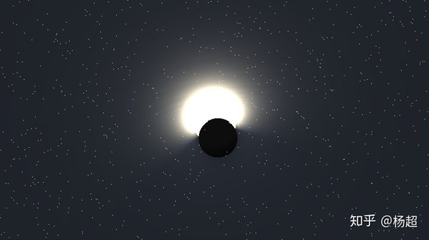
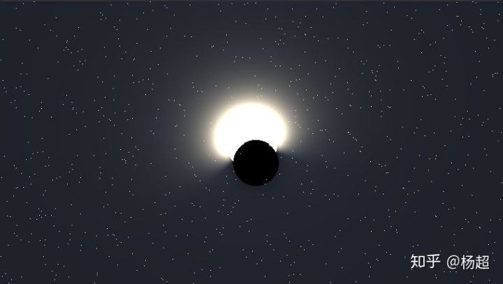
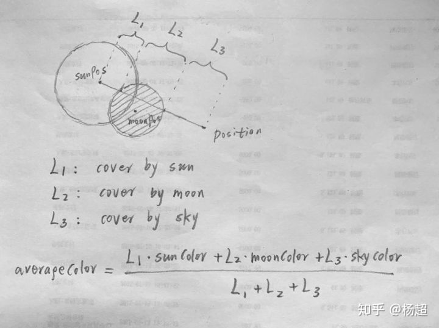

# 日食效果优化--解析法godray

昨天看到 知乎@马甲 的一篇文章：

[马甲：在Unity中实现日食的效果（一）](https://zhuanlan.zhihu.com/p/71300686)

[zhuanlan.zhihu.com](https://zhuanlan.zhihu.com/p/71300686)

感觉挺有意思，且作者贴出了完整代码。

唯一的问题就是代码中用到了暴力循环，开销比较大：



经过对代码的分析，我发现这个算法其实就是普通的屏幕空间godray算法，即以太阳为中心进行径向blur。

虽然算法本身不新颖，但用在了合适的地方，仍然是非常赞的（我甚至觉得这比算法本身创新更有价值）。

对此算法做优化，一般最容易想到的思路就是dither或者progressive蒙特卡洛（类似于taa），但只是减少采样次数而已，并不能避免采样。

考虑到本问题的特殊性，几何形状非常简单（就两个球体，不，两个圆形），积分过程是否可以完全避免采样，而直接解析地把积分结果计算出来呢？

试了一下，确实可以。

把前面那段循环替换成下面这段：



就实现了和上述文章完全一样的效果，但可以看到，不再需要那几十次的循环迭代了。

（而且，由于后面这段是用解析法计算，相当于原文中iterations取正无穷，所以得到的结果更精细）。

下面是效果对比：

马甲同学原文效果：



改成解析法的效果：



下面说原理：



如上图，Position是当前要着色的像素点坐标，sunPos为太阳坐标（都是屏幕空间2d坐标）。我们想求sunPos和Position这两点连线上的平均颜色。

有两种方法：

第一种就是 马甲 同学原文中用的方法，用循环在sunPos和Position连线上等间距采样，最后求平均，得到连线上的平均颜色，也就是Position这个像素点的godray颜色。这样比较费。

第二种方法，即本文的解析法，就是通过简单平面几何计算出L1,L2,L3这三条线段的长度。其中L1表示连线上被太阳覆盖的部分，L2表示连线上被月亮覆盖的部分，L3表示连线上仅被天空覆盖的部分。由于L1,L2,L3各线段内颜色值都是相同的：L1上所有点均为sunColor，L2上所有点均为moonColor，L3上所有点均为skyColor。所以平均颜色  ![[公式]](EclipseEffect.assets/equation.svg) 

也就是Position这个像素点的godray颜色。由于太阳、月亮和当前像素点Position的位置关系可能有多种情况，所以我上面的代码中不可避免地使用了if  else作分类讨论（如果使劲优化，应该也可以合并成更简单的式子）。但无论如何，比迭代几十上百次要省多了。

最后，既然受益于马甲同学的代码，我把修改后的代码也完整贴出来：

（为了方便对比，把修改前和修改后的代码都放这儿了）

修改前（马甲同学原始代码，我加了些注释）：

```text
Shader "Unlit/RiShi"
{
	Properties
	{
		_MainTex("Texture", 2D) = "white" {}
		mouse("mouse",VECTOR)=(0,0,0,0)
	}
		SubShader
	{
		Tags { "RenderType" = "Opaque" }
		LOD 100

		Pass
		{
			CGPROGRAM
			#pragma vertex vert
			#pragma fragment frag
			// make fog work
		//	#pragma multi_compile_fog

		#include "UnityCG.cginc"


		const int iterations = 50;


		uniform float time;
		uniform half3 mouse;


		half3 getColor(half2 pos, half2 m) {
			half3 day = half3(0.2, 0.3, 0.5);
			half3 night = half3(0.1, 0.1, 0.1);

			if (distance(pos, m) < 0.08) {//0.08是月亮半径
				return half3(0,0.0,0);//月亮颜色
			}
			if (length(pos) < 0.09) {//0.09是太阳半径
				return half3(1.2, 1.1, 0.9);//太阳颜色
			}
			//如果既不被太阳覆盖也不被月亮覆盖，则计算并返回天空颜色
			float lm = length(m);
			if (lm < 0.5) {
				return lerp(night, day, lm / 0.5);
			}
			return   day;

		}

		float rand(float x) {
			float res = 0.0;

			for (int i = 0; i < 5; i++) {
				res += 0.240 * float(i) * sin(x * 0.68171 * float(i));

			}
			return res;

		}


			struct appdata
			{
				float4 vertex : POSITION;
				float2 uv : TEXCOORD0;
			};

			struct v2f
			{
				float2 uv : TEXCOORD0;
			//	UNITY_FOG_COORDS(1)
				float4 vertex : SV_POSITION;
				float4 srcPos : TEXCOORD2;
			};

			sampler2D _MainTex;
			float4 _MainTex_ST;

			v2f vert(appdata v)
			{
				v2f o;
				o.vertex = UnityObjectToClipPos(v.vertex);
				o.uv = TRANSFORM_TEX(v.uv, _MainTex);
				o.srcPos = ComputeScreenPos(o.vertex);
			//	UNITY_TRANSFER_FOG(o,o.vertex);
				return o;
			}

			fixed4 frag(v2f i) : SV_Target
			{

				half2 gl_FragCoord = ((i.srcPos.xy / i.srcPos.w) * _ScreenParams.xy);
				half2 m = mouse.xy / _ScreenParams.xy - 0.5;
				float aspect = _ScreenParams.x / _ScreenParams.y;
				half2 position = (gl_FragCoord.xy / _ScreenParams.xy) - 0.5;
				position.x *= aspect;
				m.x *= aspect;

				//----不带godray的太阳、月亮和天空
				half3 color = getColor(position, m);

				//----用暴力迭代法计算godray（以太阳为中心径向模糊）
				half3 light = half3(1.0,1.0,1.0);
				half iterations = 50;
				half2 incr = position / float(iterations);
				half2 p = half2(0.0, 0.0) + incr;
				for (int i = 2; i < iterations; i++) { 
					light += getColor(p, m);
					p += incr;
				}
				light /= float(iterations);
				//----衰减
				float attenFac = 1/(40*max(.01, dot(position, position)));
				light *=attenFac;
				//----星星
				half2 star = gl_FragCoord.xy;

				if (rand(star.y * star.x) >= 2.1 && rand(star.y + star.x) >= .7) {
					float lm = length(m);
					if (lm < 0.15) {
						color = lerp(half3(2.0,2,2), half3(0.2, 0.3, 0.5), lm / 0.15);
					}
				}

				if (distance(position, m) < 0.05) {
					color = half3(0,0,0);
				}

				//---用不带godray的颜色(color)+gray颜色(light)，作为最终颜色
				return half4(color + light, 1.0);
			}
			ENDCG
		}
	}
}
```

修改后（改为解析法的代码）：

```text
Shader "Unlit/RiShi2"
{
	Properties
	{
		_MainTex("Texture", 2D) = "white" {}
		mouse("mouse",VECTOR)=(0,0,0,0)
	}
		SubShader
	{
		Tags { "RenderType" = "Opaque" }
		LOD 100

		Pass
		{
			CGPROGRAM
			#pragma vertex vert
			#pragma fragment frag
			// make fog work
		//	#pragma multi_compile_fog

		#include "UnityCG.cginc"


		const int iterations = 50;


		uniform float time;
		uniform half3 mouse;


		half3 getColor(half2 pos, half2 moonPos, half2 sunPos,float r_moon,float r_sun,half3 moonColor,half3 sunColor,half3 skyColor) 
			//和 知乎@马甲 同学的代码一致，我只是把一些写死的数值进行了一下参数化，另外把昼夜变化的skyColor放到外面去算了
		{
			
			if (distance(pos, moonPos) < r_moon) {
				return moonColor;
			}
			if (distance(pos, sunPos) < r_sun) {
				return sunColor;
			}

			
			return  skyColor;

		}

		float rand(float x) {
			float res = 0.0;

			for (int i = 0; i < 5; i++) {
				res += 0.240 * float(i) * sin(x * 0.68171 * float(i));

			}
			return res;

		}


			struct appdata
			{
				float4 vertex : POSITION;
				float2 uv : TEXCOORD0;
			};

			struct v2f
			{
				float2 uv : TEXCOORD0;
			//	UNITY_FOG_COORDS(1)
				float4 vertex : SV_POSITION;
				float4 srcPos : TEXCOORD2;
			};

			sampler2D _MainTex;
			float4 _MainTex_ST;

			v2f vert(appdata v)
			{
				v2f o;
				o.vertex = UnityObjectToClipPos(v.vertex);
				o.uv = TRANSFORM_TEX(v.uv, _MainTex);
				o.srcPos = ComputeScreenPos(o.vertex);
			//	UNITY_TRANSFER_FOG(o,o.vertex);
				return o;
			}
			float2 rayIntersectSphere(float3 rayStart, float3 rayDir, float3 c, float r)
				//直线与球体求交，退化使用可用于直线与圆求交
				//ref: https://en.wikipedia.org/wiki/Line%E2%80%93sphere_intersection
			{
				float3 l = rayDir;
				float3 o = rayStart;
				float A = dot(l, o - c);
				float B = dot(o - c, o - c);
				float C = A * A - (B - r * r);
				if (C < 0) {
					return float2(1000,1000);//infinity
				}
				else {
					float sqrtC = sqrt(C);
					float2 d = float2(-A - sqrtC,-A+sqrtC);
					return d;
				}
			}
			fixed4 frag(v2f i) : SV_Target
			{

				half2 gl_FragCoord = ((i.srcPos.xy / i.srcPos.w) * _ScreenParams.xy);
				half2 m = mouse.xy / _ScreenParams.xy - 0.5;
				float aspect = _ScreenParams.x / _ScreenParams.y;
				half2 position = (gl_FragCoord.xy / _ScreenParams.xy) - 0.5;
				position.x *= aspect;
				m.x *= aspect;
				//----太阳和月亮的半径、坐标、颜色
				float r_moon = 0.08;
				float r_sun = 0.09;
				float2 sunPos = float2(0, 0);
				//moonPos就是m，为了与 知乎@马甲 同学的代码保持一致，我就不把变量名m改成moonPos了。
				half3 moonColor = half3(0, 0, 0);
				half3 sunColor = half3(1.2, 1.1, 0.9);
				//----计算skyColor
				float3 skyColor = 0;
				half3 day = half3(0.2, 0.3, 0.5);
				half3 night = half3(0.1, 0.1, 0.1);
				float lm = length(m);
				if (lm < 0.5) {
					skyColor = lerp(night, day, lm / 0.5);
				}
				else {
					skyColor = day;
				}
				//----不带godray的太阳、月亮和天空
				half3 color = getColor(position, m,sunPos,r_moon,r_sun,moonColor,sunColor,skyColor);
				
				//----用解析法计算godray（以太阳为中心径向模糊）。这段是唯一本质上与 知乎@马甲 同学代码的不同之处，用解析公式代替了暴力迭代。 
				float Length =distance(position,sunPos);
				float2 dir = (position-sunPos)/Length;
				float2 d=rayIntersectSphere(float3(sunPos.xy, 0), float3(dir.xy, 0), float3(m.xy, 0), r_moon);
				d = max(float2(0, 0), d);
				float sunCoverButMoonNotCoverLength=0;//sunPos到position连线上多大长度被太阳覆盖但又不被月亮覆盖
				float rmin = min(Length, r_sun);
				if (d.x >rmin) {
					sunCoverButMoonNotCoverLength = rmin;
				}
				else{
					if (d.y > rmin) {
						sunCoverButMoonNotCoverLength = d.x;
					}
					else {
						sunCoverButMoonNotCoverLength = rmin - (d.y - d.x);
					}
				}
				float moonCoverLength = 0;//sunPos到position连线上多大长度被月亮覆盖
				if (d.x > Length) {
					moonCoverLength = 0;
				}
				else {
					if (d.y > Length) {
						moonCoverLength = Length - d.x;
					}
					else {
						moonCoverLength = d.y - d.x;
					}
				}
				float skyCoverLength = Length - sunCoverButMoonNotCoverLength - moonCoverLength;//sunPos到position连线上多大长度被天空覆盖（既不被太阳覆盖又不被月亮覆盖）
				float3 godrayColor = (skyCoverLength * skyColor + sunCoverButMoonNotCoverLength * sunColor + moonCoverLength * moonColor)/Length;//sunPos到position连线上的平均颜色
				float3 light = godrayColor;//为了和 知乎@马甲 同学的代码保持对应，我这里仍然使用light这个变量名
		
			
				//----衰减
				float attenFac = 1/(40*max(.01, dot(position, position)));
				light *= attenFac;
			
				//----星星
				half2 star = gl_FragCoord.xy;

				if (rand(star.y * star.x) >= 2.1 && rand(star.y + star.x) >= .7) {
					float lm = length(m);
					if (lm < 0.15) {
						color = lerp(half3(2.0,2,2), half3(0.2, 0.3, 0.5), lm / 0.15);
					}
				}

				if (distance(position, m) < 0.05) {
					color = half3(0,0,0);
				}

				//---用不带godray的颜色(color)+gray颜色(light)，作为最终颜色
				return half4(color + light, 1.0);
			}
			ENDCG
		}
	}
}
```


编辑于 2019-06-30