# Unreal C++ with CLion 2018

Recently I started playing around with a few alternative editors to [Visual Studio Community 2017](https://visualstudio.microsoft.com/vs/community/), specifically [Visual Studio Code](https://code.visualstudio.com/) and [CLion](https://www.jetbrains.com/clion/).

Coming from a Java background it was nice to see that the [JetBrains ](https://www.jetbrains.com/)folks have also brought their IDE wizardry to C++ in the form of [CLion](https://www.jetbrains.com/clion/).

Please note that I am running this setup with the following app / os  versions but with some minor tweaks this should be transferable to macOS  and linux.

- Unreal Engine 4.20.3
- CLion 2018.2
- Windows 10

In order to get unreal going with CLion you need to do a few things

- Ensure that you either have 

  Visual Studio Community 2017

    installed or alternatively just the 

  Visual Studio Build Tools

   as you need something to still compile the code. 

  - CLion should automagically recognize what you have installed and assign the correct compiler configurations

- Download the latest and greatest version of CLion

- Once installed / setup open it up and navigate to the plugins panel ( **Settings -> Plugins** )

- Install the Unreal Engine SDK Support Plugin 

  - This plugin includes auto completion features for [property / reflection specifiers](https://docs.unrealengine.com/en-us/Programming/UnrealArchitecture/Reference/Properties/Specifiers)

[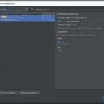](http://jollymonsterstudio.com/wp-content/uploads/2018/10/01_clion_plugin.png)
 At this point we need to setup the Unreal side of the things

- Open Unreal Editor ( source or binary doesn’t matter )
- Go to **Edit -> Editor Preferences**

[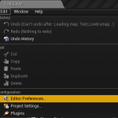](http://jollymonsterstudio.com/wp-content/uploads/2018/10/01_unreal_preferences.png)

- Then go to **General -> Source Code -> Source Code Editor** and select **CLion**

[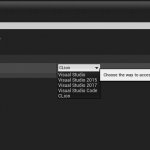](http://jollymonsterstudio.com/wp-content/uploads/2018/10/02_unreal_source.png)

- Once this is done you should now be able to generate a new CLion project  using **File -> Generate CLion Project**

[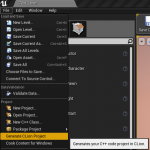](http://jollymonsterstudio.com/wp-content/uploads/2018/10/03_unreal_generate.png)

- This generation step will take a few seconds to complete
- Once complete you should restart Unreal Editor before opening up CLion 
  - NOTE: not sure why this occurs but generating the project and  launching it immediately does not correctly configure it. I found that  making adjustments to the CMakeLists.txt file and setting the build  process to Release prior to launching CLion seems to clear up a lot of  things. See below for details.
- To open up CLion go to **File -> Open CLion**

[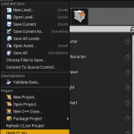](http://jollymonsterstudio.com/wp-content/uploads/2018/10/04_unreal_open.png)

At this point Unreal should be launching CLion and presenting you with your project structure that looks similar to this.

[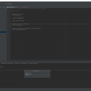](http://jollymonsterstudio.com/wp-content/uploads/2018/10/09_editor.png)

Almost there, we just have a few more things to complete before you are able to get back to building your game:

- Ensure that you are picking your Project + Editor as your Build  Target. This is so you can compile in CLion and get hot swapping in  Unreal Editor.
- Alternatively if you are building different targets make sure those are selected.

[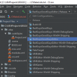](http://jollymonsterstudio.com/wp-content/uploads/2018/10/08_clion_project_editor.png)

- Ensure that you mark your **Source** folder as part of CLion project definitions so intellisense / autocomplete works correctly
- This is not required but helps with navigating your project

[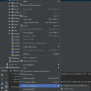](http://jollymonsterstudio.com/wp-content/uploads/2018/10/07_clion_mark_dir.png)

### That’s it !

And that is it as far as configuration goes. You should be able to build your project using **CTRL + F9** and see your changes reflected in the Unreal Editor / your game.

[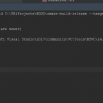](http://jollymonsterstudio.com/wp-content/uploads/2018/10/10_build_complete.png)

The compile times are similar to Visual Studio but the richness of  the CLion tool suite makes development a lot easier to traverse.  Specifically have a look at the various [shortcuts that come with CLion.](https://www.jetbrains.com/help/clion/mastering-keyboard-shortcuts.html)

 

 

## Additional Troubleshooting

There are a handful of issues I ran into while compiling this  article. If you come across anything similar here are a few instructions  that should hopefully help.

### Dealing with invalid CMakeLists.txt file

The CMakeLists.txt file when generated by Unreal sometimes will  contain non escaped backslashes, \ vs \\ , which will have to be  adjusted manually.

Example of invalid backslashes
 [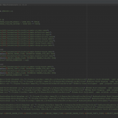](http://jollymonsterstudio.com/wp-content/uploads/2018/10/error_cmakelists.png)
 Corrected versions.
 [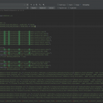](http://jollymonsterstudio.com/wp-content/uploads/2018/10/error_cmakelists_correct.png)

### Command line error D8049

If you come across this error when trying to compile your  CMakeLists.txt file it is most likely tied to building with Debug  instead of Release.
 [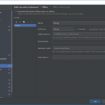](http://jollymonsterstudio.com/wp-content/uploads/2018/10/05_clion_build_debug.png)

To correct go to **Settings -> Build, Execution, Deployment -> CMake** and change the **Build Type** from **Debug** to **Release**.
 [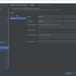](http://jollymonsterstudio.com/wp-content/uploads/2018/10/06_clion_build_release.png)

 

### Deleting CLion references and changing back to a different editor

In case you are not happy with CLion and want to revert things back  to use Visual Studio I recommend cleaning up the files the CLion  integration generated.

Specifically the following folders / files inside of your root project:

```
.idea/
cmake-build-debug/
cmake-build-release/
Intermediate/ProjectFiles/*.cmake
CMakeLists.txt
```

Once this is complete you simply follow the initial set of  instructions but instead of picking CLion just select Visual Studio.  This should then give you the option to re-generate the Visual Studio  project within Unreal Editor ( **File -> Refresh / Generate Visual Studio Project** )

Source:

https://blog.jetbrains.com/clion/2016/10/clion-and-ue4/

[https://answers.unrealengine.com/questions/811610/clion-with-ue-420-command-line-error-d8049.html](https://blog.jetbrains.com/clion/2016/10/clion-and-ue4/)

 