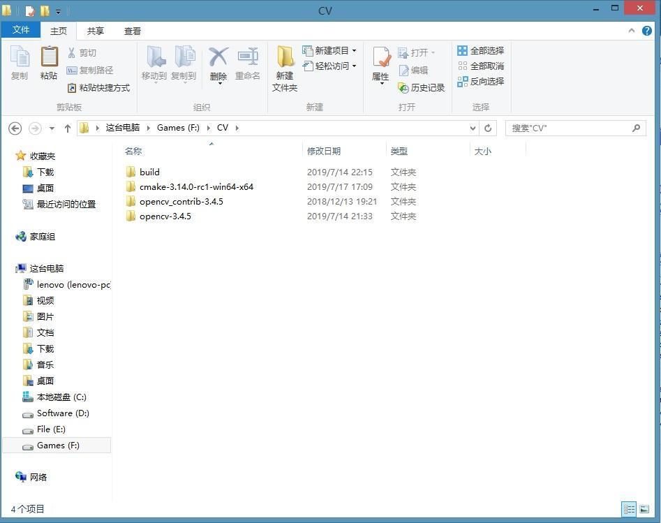
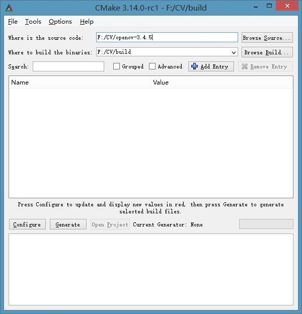
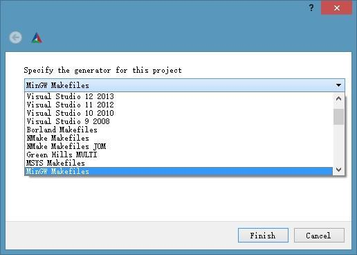
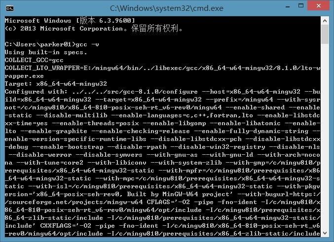
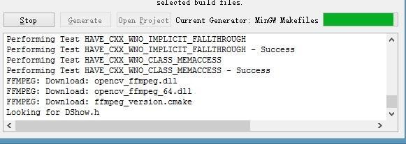
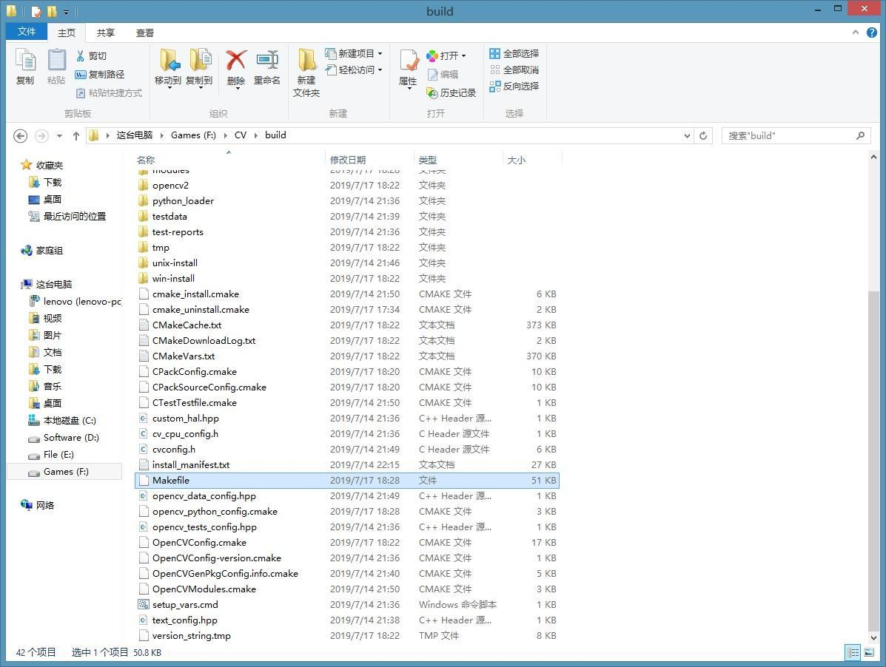
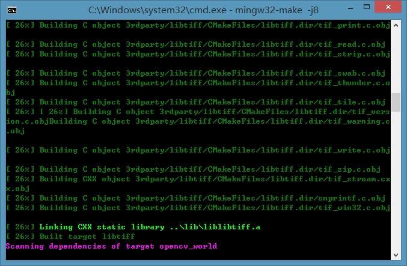
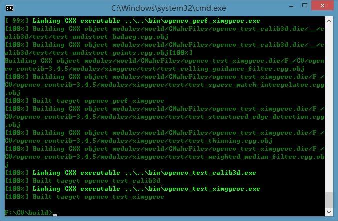
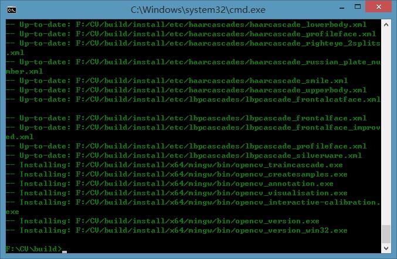

# （一）MinGW-w64编译OpenCV-3.4.5

[Parker2019](https://www.jianshu.com/u/eeec7a734a59)

0.362019.07.17 19:37:54字数 1,028阅读 891

# OpenCV-3.4.5的编译（MinGW-w64）

### 废话不多说，直接上地址：

- `MinGW-w64`：[https://sourceforge.net/projects/mingw-w64/files/](https://links.jianshu.com/go?to=https%3A%2F%2Fsourceforge.net%2Fprojects%2Fmingw-w64%2Ffiles%2F)
- `CMake` : [https://cmake.org/download/](https://links.jianshu.com/go?to=https%3A%2F%2Fcmake.org%2Fdownload%2F)
- `OpenCV-3.4.5`: [https://github.com/opencv/opencv/tree/3.4.5](https://links.jianshu.com/go?to=https%3A%2F%2Fgithub.com%2Fopencv%2Fopencv%2Ftree%2F3.4.5)
- `OpenCV-3.4.5_Contrib`:[https://github.com/opencv/opencv_contrib/tree/3.4.5](https://links.jianshu.com/go?to=https%3A%2F%2Fgithub.com%2Fopencv%2Fopencv_contrib%2Ftree%2F3.4.5)

#### 说明:

1、`MinGW-w64`编译器进入下载页面后下拉选择`x86_64-posix-seh`（64位系统适用，32位请选择`i686-posix-sjlj`），版本建议选择`MinGW-W64 GCC-8.1.0`，不要太往前，C++的一些新特性在旧的编译器里可能不适用，导致编译的时候会报错。还有就是一定要选择`POSIX`版本，下载`win32`版本编译的时候会让你怀疑人生。至于`CMake`，也是下载对应系统位数的包。下载压缩包（.zip）可以直接使用。
 2、博主目前在Windows上面只编译成功过Opencv-4.0.1和OpenCV-3.4.5，其他版本的OpenCV没尝试过，在Github上面有一个CSDN博主会不定期的上传已经编译好的包供直接使用。他的blog里面还包含一些编译时候常见错误及处理办法，可供参考。
 `Portal:`[https://github.com/huihut/OpenCV-MinGW-Build](https://links.jianshu.com/go?to=https%3A%2F%2Fgithub.com%2Fhuihut%2FOpenCV-MinGW-Build)

### 都下载完成后，就可开始编（zhe）译（teng）了。

#### 首先，请新建一个`build`空目录。

目录结构

打开CMake目录，进入bin中打开cmake-gui.exe。

CMake1

第一项填源码目录，第二项填编译目录。然后点Configure。

CMake2

下拉菜单选择`MinGW Makefiles`。这一步需要提前配置MinGW-w64的环境变量，把编译器目录中`bin`子目录加入系统环境变量。（可以在cmd/powershell中输入`gcc -v`，有输出则配置环境变量成功。）

cmd输出

读条过程可能会有点长，因为需要联网下载一些东西。

CMake3

- 配置完成后会出现一大堆红色的东西，这时在Search中输入extra会出现`OPENCV_EXTRA_MODULES_PATH`
   在Value中选择opencv_contrib-3.4.5目录下的modules子目录。

- 清空Search，输入nonfree，勾选`OPENCV_ENABLE_NONFREE`。

- 清空Search，输入world，勾选`BUILD_OPENCV_WORLD`。

- 直到没有红色内容出现，点击Genearate，会在build目录中生成`Makefile`。

- 如果想要弄清楚每个`NAME`下面的参数是什么意思，可以去问百度或谷歌或CSDN或Stack Overflow。一般情况下只需要开启上面参数，当然如果想编译python和java版的小伙伴们一定要记着打开`BUILD_opencv_python`和`BUILD_JAVA`，并确定python和java jdk已经在系统环境变量目录中。此外OpenCV支持和某些库混合编译，比如`CUDA`，`TBB`等，如果有需要编译这些内容务必勾选与之相关的项目。

  

  Makefile

  

#### 第二步，进入cmd/powershell。

- `cd`到`build`目录。
- 输入`mingw32-make`，这里有个加快编译的办法，就是启动多线程编译，在这条指令后面加上`-j`(数字)，数字多少代表线程多少。但请注意最好不要超过最大线程，不然编译时会报错。

等待编译完成。编译耗时取决于电脑配置和线程数量多少。

编译过程中

- 这一步是最容易出现问题的地方，如果有很多报错而终止编译请检查编译器问题。（PS：不得已的情况下不要去修改源码，否则可能报更多的错。）

- 出现了问题也不要着急，这个时候最重要的就是来杯饮品压压惊。然后当然是请教度娘或者google或者Stack OverFlow或者CSDN啦。

  

  编译完成

- 完成编译后，输入`mingw32-make install`，将OpenCV编译好的东西安装至`build`目录下`install`子目录中。

  

  安装过程

  

- `install`目录

  

  install目录