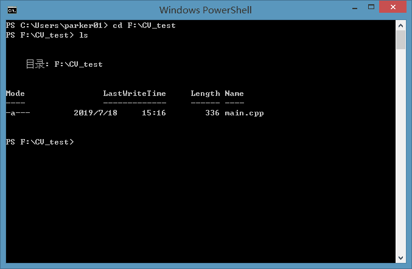
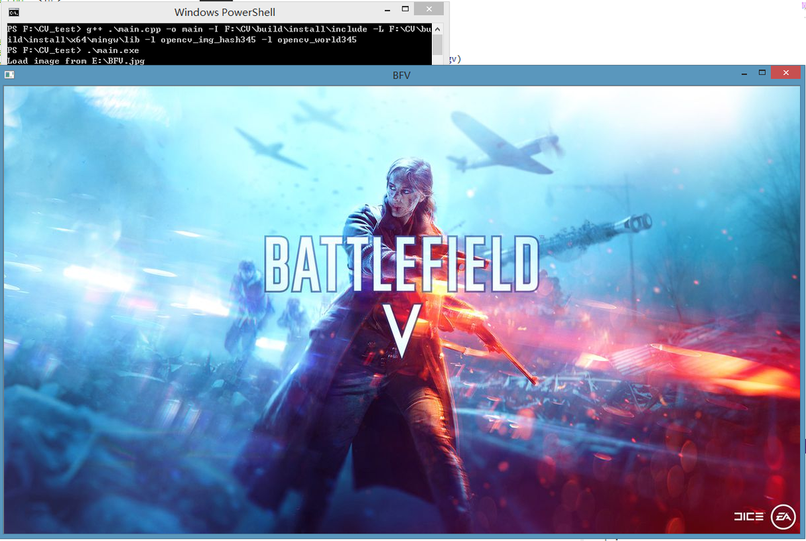

# 二）OpenCV的链接(MinGW-w64)

[](https://www.jianshu.com/u/eeec7a734a59)

[Parker2019](https://www.jianshu.com/u/eeec7a734a59)

0.2882019.07.17 20:18:53字数 757阅读 291

# OpenCV的链接（MinGW-w64）

## 上一篇blog讲了如何编译OpenCV，这一篇blog将使用g++编译一个OpenCV程序。

### 第一步，写一个读图的源码。

```
main.cpp
#include<iostream>
#include<opencv2/opencv.hpp>
using namespace std;
using namespace cv;
int main(int argc,const char** argv)
    {
            cout << "Load image from E:\\BFV.jpg" << endl;
            Mat src = imread("E:\\BFV.jpg");
            imshow("BFV",src);
            waitKey(0);
            return 0;
    }
```

- 保存文件名为`main.cpp`。在开始编译之前，还得做点准备工作。打开`install`目录（可以把`build`目录下的`install`子目录单独复制出来，方便以后操作。），找到下面的x64/mingw/bin子目录，可以将`bin`子目录加到环境变量中，也可以选择将`bin`下面的`libopencv_img_hash345.dll`、`libopencv_world345.dll`、`opencv_ffmpeg345_64.dll`复制到`C:\Windows\System32`目录下（可能需要管理员权限，这样的话即使OpenCV被删除了，也可以运行已经编译好了的OpenCV的程序——谁没事会去动System32下面的dll文件呢？）

- 这里说明一下install下的目录结构：

   `bin`:可执行程序目录。
   `etc`:一些配置文件目录。
   `include`:OpenCV头文件目录。
   `x64`:64位系统对应的OpenCV库。
   `x64`子目录1`mingw`
   `mingw`子目录1 `bin`:用于存放可执行程序和.dll动态链接库文件。
   `mingw`子目录2 `lib`: .a文件，LINUX系统中的静态链接库文件。一些.cmake文件。

### 第二步，编译。

- 进入终端（cmd/powershell），

  ```
  cd
  ```

  到

  ```
  main.cpp
  ```

  所在的目录。

  

  终端1

- 终端键入`g++ .\main.cpp -o main.exe -I F:\CV\build\install\include -L F:\CV\build\install\x64\mingw\lib -l opencv_img_hash345 -l opencv_world345`

- 终端没有报错（Error），没有警告（Warning）。程序编译完成。键入`.\main.exe`尝试运行，输出正确的图片，编译完成。




CV2.png


#### 编译说明

- `MinGW-w64`本质上就是GNU编译器套件的Windows版，所以使用的命令和Linux终端下的也一样。上述命令中使用`g++`以编译`.cpp`的文件。具体编译指令可以问度娘或者谷歌或者CSDN或者Stack Overflow。这里解释一下上述编译指令：

   `g++` 源文件名称(`.cpp`) `-o` 生成可执行文件名称(`.exe`)
   `-I`注意是大写的“I”，表示`include`目录，这项后面填入OpenCV头文件目录。
   `-L`大写的“L”，表示lib目录，这后面填`mingw`下的`lib`目录。
   `-l`注意此处是小写的“l”，表示需要链接的静态库文件，这后面填入运行所必须的两个静态库`opencv_img_hash345`，`opencv_world345`

##### 编译第一个OpenCV程序到此完成了，可是总是输这么长串的命令会让人头痛，偶尔因为一个单词或者一个地方没打对就要重新来过。所以我们就可以依赖IDE了，下一篇文章将着重于使用Visual Studio Code来配置OpenCV开发环境，使得编译调试一键运行。