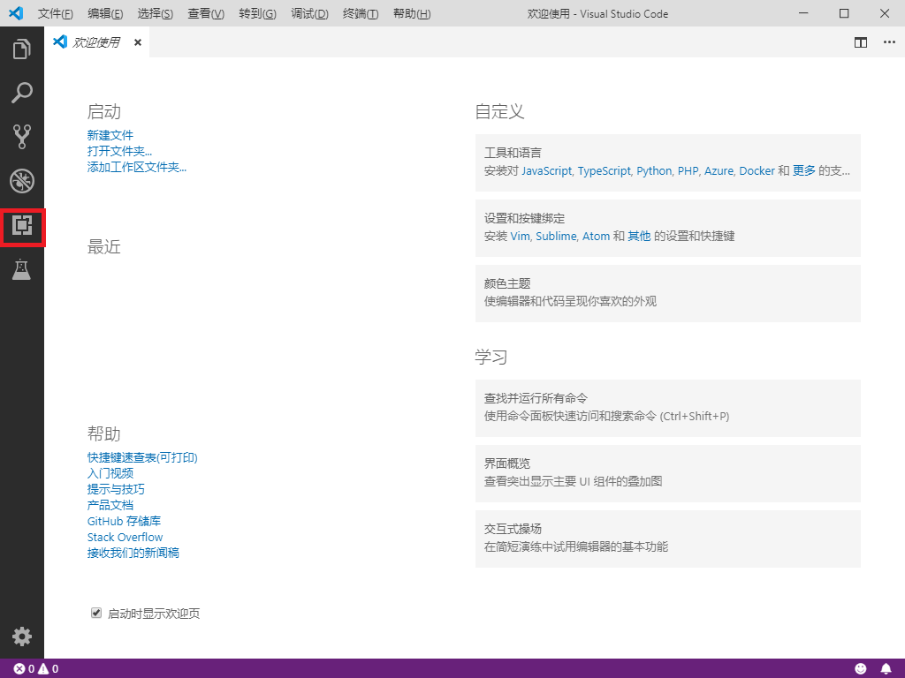
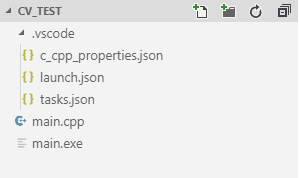
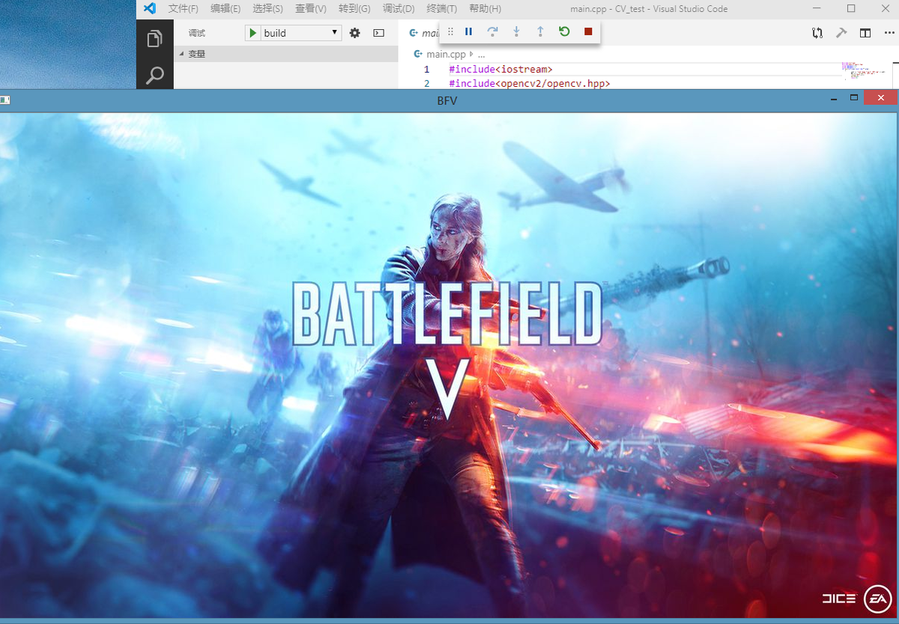
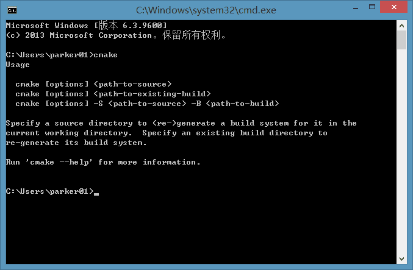
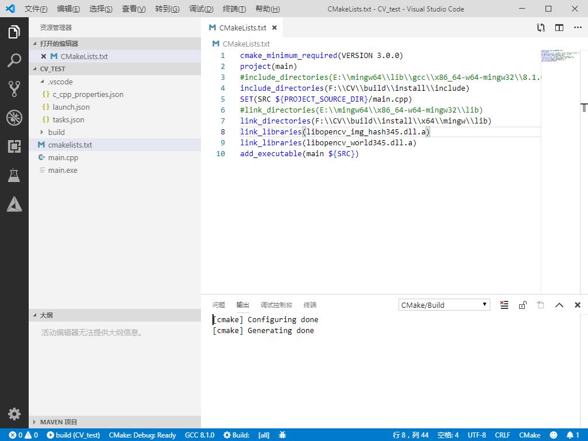
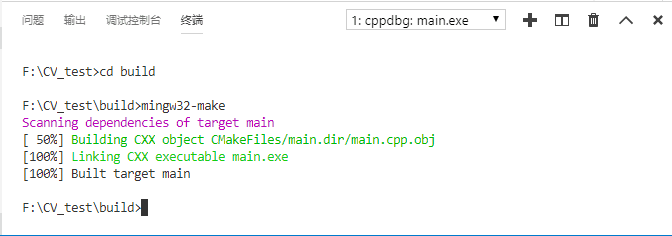

# （三）Visual Studio Code中设置OpenCV(MinGW-w64)

[](https://www.jianshu.com/u/eeec7a734a59)

[Parker2019](https://www.jianshu.com/u/eeec7a734a59)

0.5172019.07.18 20:20:21字数 1,480阅读 1,057

# Visual Studio Code中设置OpenCV(MinGW-w64)

## 上一篇blog讲的如何使用g++编译CV源码，这篇blog将使用Visual Studio Code作为开发工具。

### 有请我们的主角Mircosoft Visual Studio Code ————轻量跨平台开源源码编辑器。

`portal`:[https://code.visualstudio.com/](https://links.jianshu.com/go?to=https%3A%2F%2Fcode.visualstudio.com%2F)
 直接点击Download for Windows，下载完成后打开.exe下一步下一步安装即可。
 打开vscode（visual studio code的简写），发现是英文版，没事的，vscode的强大之处在于它支持各种各样的插件，而它的功能是通过各种插件发挥的。



vscode主界面


点击红色圈内的插件处，会打开插件界面，在搜索栏输入Chinese，会出现`Chinese (Simplified) Language Pack for Visual Studio Code`,点击`Install`安装，完成安装后重启vscode，界面就会变成中文。


插件安装

这里是因为博主已经安装过了，所以没有显示安装。如果重启后还是英文，请按下`Ctrl`+`Shift`+`P`组合键，在打开的选项卡中输入`language`,会出现`Configure Display Language`,点击后选择`zh-cn`,它会提示是否重启，选择Restart Now。重启过后即为中文。

vscode的强大之处在于它的拓展插件，所以打开拓展界面，再装上一些常用的拓展插件。

- 在搜索栏输入C/C++,选择`C/C++`、`C++ Intellisense`安装。
- 搜索栏输入cmake，选择`CMake Tools`、`CMake`安装。这个是用于之后写比较大一点的工程用得上。

#### 编译方式一，编写`.json`文件：

- 在启动界面点击打开文件夹，将目录选择至`main.cpp`所在的目录。打开`main.cpp`,点击调试,选择启动调试,在选择环境这儿选择`C++(GDB/LLDB)`，选择`g++`项，会出现`launch.json`配置文档界面。复制如下内容替换原来`launch.json`的内容。部分要修改的地方请根据自己的情况修改。

```
launch.json
{
    // 使用 IntelliSense 了解相关属性。 
    // 悬停以查看现有属性的描述。
    // 欲了解更多信息，请访问: https://go.microsoft.com/fwlink/?linkid=830387
    "version": "0.2.0",
    "configurations": [
        {
            "name": "build",
            "type": "cppdbg",
            "request": "launch",
            "program": "${fileDirname}\\${fileBasenameNoExtension}.exe",
            "args": [],
            "stopAtEntry": false,
            "cwd": "${workspaceFolder}",
            "environment": [],
            "externalConsole": false,
            "MIMode": "gdb",
            "miDebuggerPath": "这里填gdb.exe的目录，目录填完后还要加上gdb.exe",
            "setupCommands": [
                {
                    "description": "Enable pretty-printing for gdb",
                    "text": "-enable-pretty-printing",
                    "ignoreFailures": true
                }
            ],
            "preLaunchTask": "build"
        }
    ]
}
```

- 按下`Ctrl`+`Shift`+`P`组合键，在弹出选项卡中输入tasks，选择 任务：配置默认生成任务（`Tasks:Configure Default Build Task`），会进入`tasks.json`的配置文档界面，同样复制如下内容替换掉原来`tasks.json`内容。部分地方请根据自己的目录修改。

```
tasks.json
{
// 有关 tasks.json 格式的文档，请参见
    // https://go.microsoft.com/fwlink/?LinkId=733558
    "version": "2.0.0",
    "tasks": [
        {
            "type": "shell",
            "label": "build",
            "command": "这里填g++.exe的目录，填完目录后加上g++.exe",
            "args": [
                "-g",
                "${file}",
                "-o",
                "${fileDirname}\\${fileBasenameNoExtension}.exe",
                "-I",
                "这里填OpenCV头文件目录",
                "-L",
                "这里填静态库文件目录",
                "-l",
                "opencv_img_hash345",
                "-l",
                "opencv_world345"
            ],
            "options": {
                "cwd": "这里填MinGW-w64的bin目录"
            },
            "problemMatcher": [
                "$gcc"
            ],
            "group": {
                "kind": "build",
                "isDefault": true
            }
        },
    ]
}
```

- 按下`Ctrl`+`Shift`+`P`组合键，在弹出选项卡中输入c/c++，选择C/C++编译配置（JSON）（`C/C++:Edit Configurations(JSON)`），会进入`c_cpp_properties.json`,更改其中`includePath`:

```bash
"includePath": [
                "${workspaceFolder}/**",
                "F:\\CV\\build\\install\\include",
                "F:\\CV\\build\\install\\include\\opencv",
                "F:\\CV\\build\\install\\include\\opencv2"
            ],
```

依据个人情况修改目录，将`include`目录中的`opencv`、`opencv2`子目录也都添加进去。注意三个JSON文件在配置完后都要保存（随手`Ctrl`+`S`是好习惯。）

- 修改完成后的目录结构：



目录结构

- 完成后点到源码界面，选择调试，启动调试（快捷键`F5`），等待编译完成。执行的命令会在下面终端选项卡显示出来。跳出图片，编译成功。



运行图

##### 说明：

- 报错很正常，出现问题先检查JSON文件的路径是否正确，路径均用`\\`或者`/`切换下级。有时候会因为一个逗号的丢失导致JSON文件不能正常读取。确定JSON文件没问题了，出现终端报错记得看报错的内容，如果出现`No such file or directory`就还是文件路径有问题。
- 源代码错误请更改源码。
- 使用gdb调试的时候需要注意自己的`dotNet`(.NET)版本需大于4.6，如果.NET没有安装请通过传送门：
   `Portal`:[https://dotnet.microsoft.com/download/dotnet-framework/net48?utm_source=getdotnet&utm_medium=referral](https://links.jianshu.com/go?to=https%3A%2F%2Fdotnet.microsoft.com%2Fdownload%2Fdotnet-framework%2Fnet48%3Futm_source%3Dgetdotnet%26utm_medium%3Dreferral)
   选择Download.NET Framework 4.8 Runtime。
- 建议选装：微软常用运行库
   `Portal`:这个去百度查吧，到处都有下载。

#### 编译方式二，编写`CMakeLists.txt`

这种方式是调用CMake生成Makefile，使得编译器按照Makefile里的规则对源文件进行有序的编译。
 首先请将CMake目录中的`bin`子目录添加到环境变量中，可以打开终端输入`cmake`判断环境变量是否设置成功。



cmake

使用vscode打开源文件所在的同级目录，新建一个CMakeLists.txt文件，输入以下内容：

```
CMakeLists.txt
cmake_minimum_required(VERSION 3.0.0)
project(main)
include_directories(F:\\CV\\build\\install\\include)
SET(SRC ${PROJECT_SOURCE_DIR}/main.cpp)
link_directories(F:\\CV\\build\\install\\x64\\mingw\\lib)
link_libraries(libopencv_img_hash345.dll.a)
link_libraries(libopencv_world345.dll.a)
add_executable(main ${SRC})
```

#### 说明：

请按照自己的路径进行修改。
 `cmake_minimum_required(VERSION 3.0.0)`:声明CMake最小版本。
 `project(main)`:项目名称main。
 `include_directories`:头文件目录。
 `SET(SRC ${PROJECT_SOURCE_DIR}/main.cpp)`：设置SRC（源码）为`main.cpp`。
 `link_directories`：静态库文件目录。
 `link_libraries`:需要链接的库文件名称（这儿必须打全名）。
 `add_executable`:生成可执行文件。

`CMakeLists.txt`有一套自己编写的语言，如果想要实现更复杂的功能（如把源码编译各种类型的库文件，条件编译，编译模式Debug或Release，信息提示等等。这在一个工程里面是不可或缺的。），就应该靠搜索引擎了。



CMakeLists

按下组合键`Ctrl`+`Shift`+`P`在选项卡中输入cmake，会出现CMake:Configuration，选中既会开始进行cmake操作。
 在输出界面出现Configuring done和Generating done，证明cmake完成，会在源码同级目录生成一个`build`目录，在终端输入`cd build`进入`build`目录,输入`mingw32-make`进行编译。编译完成在`build`目录里会生成main.exe，输入`.\main.exe`尝试运行，运行成功。



#### 结语：至此，OpenCV-3.4.5的Windows上开发环境就初步搭建完成。愿每个学习视觉的人都能在这条路上走的更远！