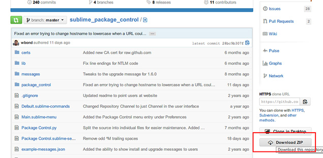
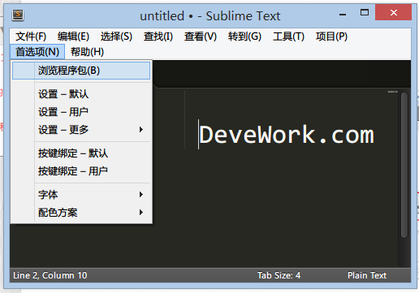
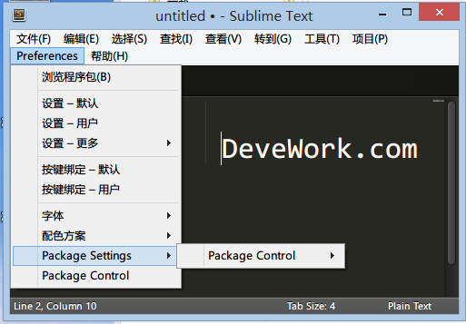
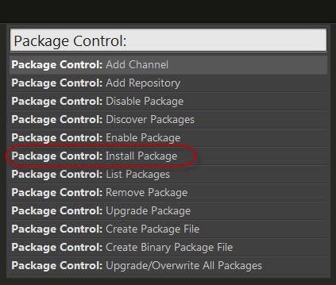
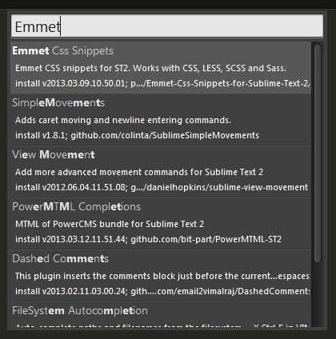

## Sublime text 3 中Package Control 的安装与使用方法

Package Control插件本身是一个为了方便管理插件的插件，在Sublime text 3中，Package Control  的安装方法一开始出来的方法是要先安装Git，再输入代码来安装，原因说是“sublime text  3更新的python的函数，说白了就是API不同了，导致基于python开发的插件很多都不能工作”。不过后来出了个方便的安装方法，下面介绍一下。


插播：[代码编辑器Sublime Text 3 免费使用方法与简体中文汉化包下载](http://devework.com/sublime-text-3.html)

**5月4日更新**：最新安装方式如下：

通过  `ctrl+`` 快捷键或者 `View > Show Console`菜单打开控制台，复制粘贴回车如下代码即可。

```
import urllib.request,os,hashlib; h = 'df21e130d211cfc94d9b0905775a7c0f' + '1e3d39e33b79698005270310898eea76'; pf = 'Package Control.sublime-package'; ipp = sublime.installed_packages_path(); urllib.request.install_opener( urllib.request.build_opener( urllib.request.ProxyHandler()) ); by = urllib.request.urlopen( 'http://packagecontrol.io/' + pf.replace(' ', '%20')).read(); dh = hashlib.sha256(by).hexdigest(); print('Error validating download (got %s instead of %s), please try manual install' % (dh, h)) if dh != h else open(os.path.join( ipp, pf), 'wb' ).write(by)
```

后面内容为旧方法，请无视。

## Package Control 主文件下载

下载地址：<https://github.com/wbond/sublime_package_control>

托管在github 上，下载直接按 zip 那个按钮。解压之后，把文件夹名称修改为“package control”。



## 安装Package Control 步骤

1、点击菜单->首选项->浏览程序包，打开一个文件夹，复制刚才的“package control”文件到该目录下面。



2、打开sublime text 3编辑器，在菜单->preferences->Package Settings和package control选项，就说明安装package control成功了。



 

因为sublime text 3正式版还未发布，又更新了API，所以sublime text 3相对插件来说和sublime text 2是两个东西，[点击查看](https://github.com/wbond/sublime_package_control/wiki/Sublime-Text-3-Compatible-Packages)，在此列表中可以查看能在sublime text 3中工作的插件，少之又少，所以依赖现在的插件工作的朋友不建议更新到sublime text 3。

## Package Control的使用方法：安装插件

**快捷键 Ctrl+Shift+P**（菜单 – Tools – Command Paletter），输入 install 选中Install Package并回车，输入或选择你需要的插件回车就安装了（注意左下角的小文字变化，会提示安装成功）。



