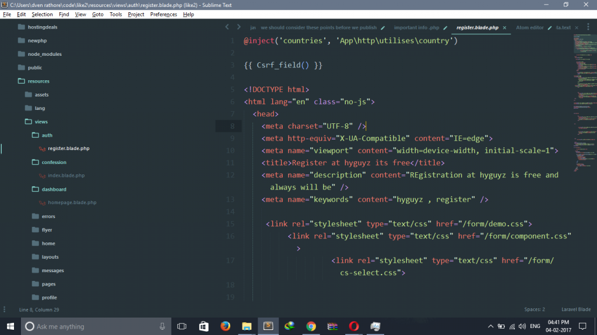
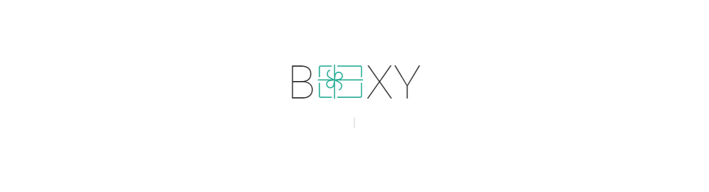
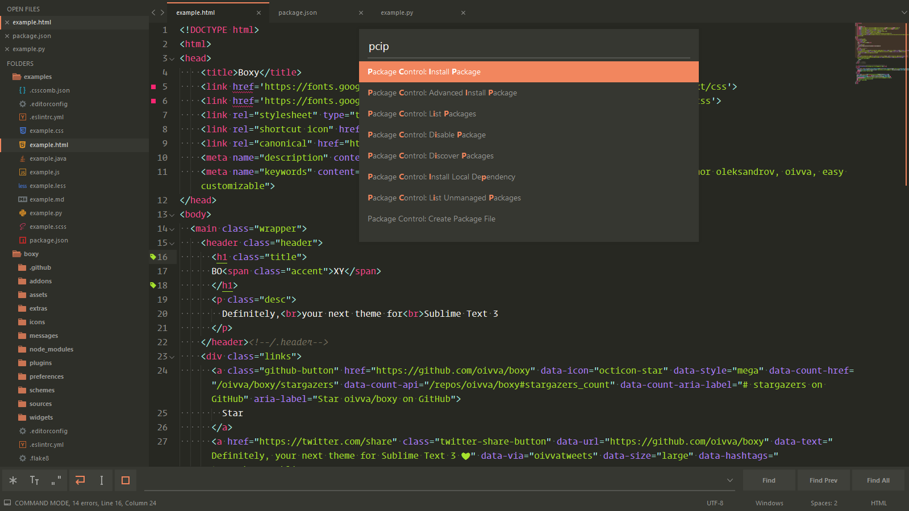
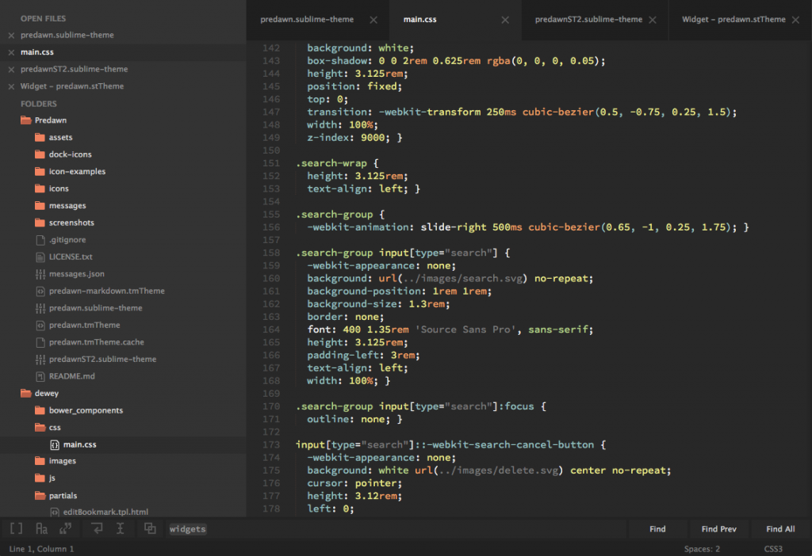

# Sublime _ Theme

Sublime Text 是用于编码最流行的文本编辑器之一。Sublime Text 有许多让编程变得有趣的功能，使编码变的有趣，通过插件，我们可以添加许多功能来帮助开发我们应用。

Sublime Text 是一个非常流行的，可扩展的代码编辑器，可以让我们轻松编写代码。 评估版可以从 [http://www.sublimetext.com](http://www.sublimetext.com/) 下载。

我们还需要在 Sublime Text 中安装并启用 `Package Control`(包控制，或者包管理)，你可以在 <http://wbond.net/sublime_packages/package_control/installation> 或 [packagecontrol.io](http://packagecontrol.io/) 上找到并获得 `Package Control` 软件包。

愚人码头注：关于 Package Control(包控制) 安装和实用可以查看[《Sublime Text 3最好的功能、插件和设置》 中的 Package Control(包控制) 部分的内容](http://www.css88.com/archives/5858#package-control)

回到正题，让我们来看看 2017 年最佳 Sublime Text 3 主题。

## Material Theme

matarial 主题有很好的文档，并将 [Material Design](http://www.google.com/design/) 可视化配置工具带入了 Sublime Text 3。该主题有很多定制选项。

可用插件：

- [White panels and inputs](http://www.css88.com/archives/http)
- [Appbar](http://www.css88.com/archives/http)

该主题提供了一个可视化配置工具，允许您通过从内联弹出窗口激活可用选项来配置主题。只需右键单击您的编辑器并选择 `Material Theme > Material Theme Config` 。您还可以命令面板中通过搜索 `Material Theme > Configuration` 来打开配置器。

[在 Package Control 中查看 Material 主题](https://packagecontrol.io/packages/Material Theme)

## Seti_UI

Seti UI是从 Atom 主题移植过来的，最好的 Sublime Text 3 主题之一，名称也相似。 类似于 Material Theme ，Seti UI 也提供了漂亮的侧边栏图标，但风格噱头上却没有那么多。

[在 Package Control 中查看 Seti_UI 主题](https://packagecontrol.io/packages/Seti_UI)

## Boxy Theme

Boxy 为 Sublime Text 3 设置了易于定制的界面和语法主题。Boxy 每个主题都提供了明亮和深色两种版本。boxy  提供多种选项来调整 Sublime Text 3 每一个视觉方面的设置。boxy 是 Sublime Text 3 最容易被修改的主题。

Boxy 配有 5 个高品质主题和深受欢迎的配色方案，包括：

- Boxy Monokai ★ Predawn
- Boxy Nova ★ Minimal
- Boxy Solarized Dark ★ Code
- Boxy Solarized Light ★ Iowa
- Boxy Yesterday ★ Atom

[在 Package Control 中查看 Boxy 主题](https://packagecontrol.io/packages/Boxy Theme)

## Predawn

Predawn 是深色调的 Sublime Text 3 主题。也是 Sublime Text 3 最漂亮的主题之一。

Predawn 主题有很多定制选项。你可以根据你自己的感官来修改它的外观。

[在 Package Control 中查看 Predawn 主题](https://packagecontrol.io/packages/Predawn)

## Agila

Agila 为 Sublime Text 3 提供了干净，而又现代感十足的主题界面。 Agila 为树形文件菜单提供了良好的文件夹间隔，以提高可读性。

Agila 配有 6 个高品质主题和深受欢迎的配色方案，包括：

- Agila Origin Theme
- Agila Monokai Theme
- Agila Cobalt Theme
- Agila Classic Theme
- Agila Light Theme
- Agila Neon Theme

[在 Package Control 中查看 Agila 主题](https://packagecontrol.io/packages/Agila Theme)

## Materialize

Materialize 基于 Material 主题。Materialize 为 Sublime Text 3 和 Sublime Text 3 dev 的 Material 主题带来了一些最流行的配色方案。

[在 Package Control 中查看 Materialize 主题](https://packagecontrol.io/packages/Materialize)