# Win10电脑虚拟安装苹果MacOS无敌完整版.

应该有不少小伙伴想体验苹果电脑，或者想学习苹果软件开发，但是苦于苹果机价格昂贵烦恼不已。其实，想体验苹果系统，不一定非要苹果机，大多数的Windows电脑都可以通过虚拟技术来几乎完美地体验苹果的系统，即MacOS。今天我就来做个简单而又详细的教程，让人人都可以体验到流畅的苹果Mac系统。

[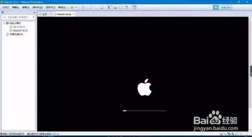](http://jingyan.baidu.com/album/c74d6000b3ca190f6a595d37.html?picindex=1)

## 工具/原料

- 硬件：一台安装了Windows 10系统的电脑，台式机笔记本都行。
- 软件（文中有下载链接）：拟机软件VMware Workstation Pro 12.5.5、虚拟机MacOS破解工具Unlocker、Python、MacOS Seirra10.12.4镜像
- 一颗坚持到底、勇于解决问题的心。

## 第一步 检查CPU是否支持虚拟化

- 第一种方法，右键计算机（此电脑）→属性，查看自己的CPU型号。如下图，我使用的这台电脑是Inter Core i5 6500，然后再百度中输入“Inter Core i5 6500是否支持虚拟化”，然后就明白了。

  [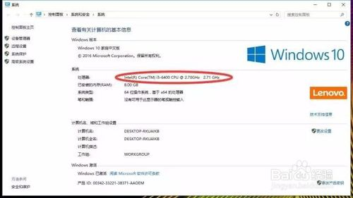](http://jingyan.baidu.com/album/c74d6000b3ca190f6a595d37.html?picindex=2)

- 第二种方法，进入BIOS设置中，寻找关于虚拟化的选项，一般在CPU设置里，含有“Virtualization”的选项，有的话就说明支持，默认是关闭的，打开之后重启电脑准备下一步。如下图所示：

  [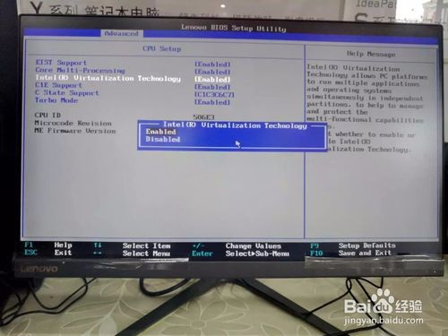](http://jingyan.baidu.com/album/c74d6000b3ca190f6a595d37.html?picindex=3)

- 如果以上两种方法都说明你的CPU不支持的话，有两个选择，一是关闭此教程，二是换电脑。o(´^｀)o

  END

## 第二步 准备所需要的工具软件以及系统镜像

1. 1

   \1.     虚拟机软件**VMware Workstation Pro 12.5.5**

   下载：http://pan.baidu.com/s/1c2kroAW    

   密码：pwad

   \2.     虚拟机MacOS破解工具**Unlocker**

   下载：http://pan.baidu.com/s/1o7B1aum    

   密码：hul0

   \3.     我不知道是干嘛用但是很重要的工具**Python**

   下载：http://pan.baidu.com/s/1kV8z7nx    

   密码：jeo7

   \4.     **MacOS  Seirra10.12.4**镜像

   下载：http://pan.baidu.com/s/1o8hVdbk    

   密码：sez1

   END

## 第三步 虚拟机的安装及MacOS破解

1. 1

   打开虚拟机软件，按照下图一步一步安装完成。

   到第三张图的时候点击许可证，打开云盘下载的文件夹中的Vm激活码文本文档，随便找一个复制进去，不行就下一个，再不行就在百度里找，很容易激活的。

   到最后一步，大家还是选择还是重启一下。

   [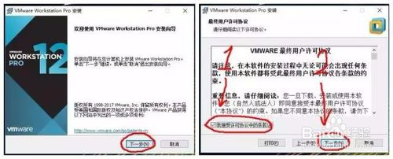](http://jingyan.baidu.com/album/c74d6000b3ca190f6a595d37.html?picindex=4)

   [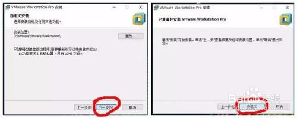](http://jingyan.baidu.com/album/c74d6000b3ca190f6a595d37.html?picindex=5)

   [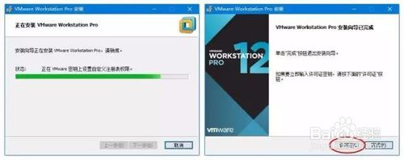](http://jingyan.baidu.com/album/c74d6000b3ca190f6a595d37.html?picindex=6)

   

2. 2

   插件工具安装

   重启后，打开任务管理器（右键状态栏→任务管理器），找到服务项，将框中关于VMware全部右键停止运行。如下图一。

   接着双击文件夹中的python 2.7.9.msi文件，除了第一步权限选择外，其他都是“下一步”，直到安装完成。如下图二。

   然后打开Unlocker2.0.7文件夹，找到win-install.cmd，右键编辑。在打开的文档中，找到“echo   Patching...”这一项，将这一项的下一行，改为“C:\Python27\python.exe unlocker.py”，然后保存。其实刚修改的就是python.exe的路径后面加上 unlocker.py（注意前面有空格），只要前面的步骤没有错，这一步就没有任何问题。如图三。

   改完之后保存。

   然后右键“win-install.cmd”，以管理员身份运行，等待其完成。

   到这里，虚拟机的安装破解工作就完成了。

   [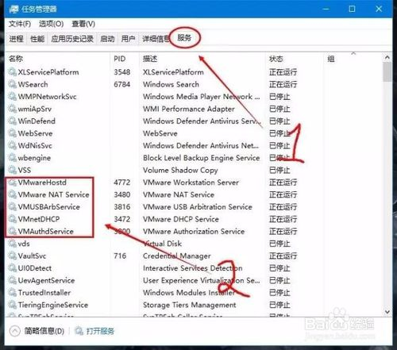](http://jingyan.baidu.com/album/c74d6000b3ca190f6a595d37.html?picindex=8)

   

   [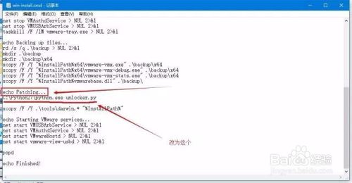](http://jingyan.baidu.com/album/c74d6000b3ca190f6a595d37.html?picindex=10)

   END

## 第四步 安装MacOS Sierra

1. 1

   双击打开桌面上的虚拟机软件VMware Workstation Pro，按照以下步骤操作。

   在这里要说明一下，选择光盘映像文件时，需要把文件类型切换为所有文件，因为MacOS的镜像格式是cdr，不是默认的iso。

   [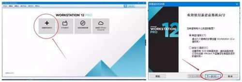](http://jingyan.baidu.com/album/c74d6000b3ca190f6a595d37.html?picindex=11)

   [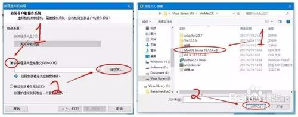](http://jingyan.baidu.com/album/c74d6000b3ca190f6a595d37.html?picindex=12)

   [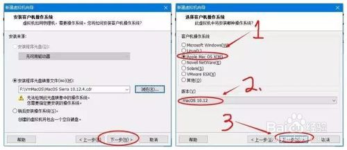](http://jingyan.baidu.com/album/c74d6000b3ca190f6a595d37.html?picindex=13)

   

   [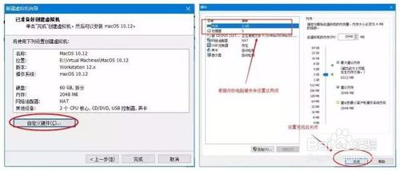](http://jingyan.baidu.com/album/c74d6000b3ca190f6a595d37.html?picindex=15)

   [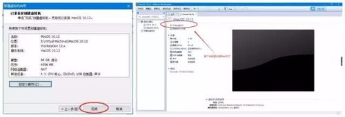](http://jingyan.baidu.com/album/c74d6000b3ca190f6a595d37.html?picindex=16)

2. 2

   安装完成后，点击“开启虚拟机”，如果没有报错，那么恭喜你，不过不报错是不可能的。一般前面的步骤只要正确，接下来只会报一种错误，如下图一。

   这时候不要慌，离成功只差一步了。找到你的MacOS虚拟机所在目录（不是VMware的安装目录，是Mac系统所在的目录），找到虚拟机系统文件目录，进入到文件夹下，找到Macos  10.12.vmx（.vmx前面是你之前设置的虚拟机名称），右键编辑，在 smc.present = "TRUE"  后添加“smc.version= 0”(建议复制，不包括引号)后保存，问题即可解决。见图二图三。

   接下来重新启动虚拟机，就回看到久违的苹果开机画面。见图四。

   [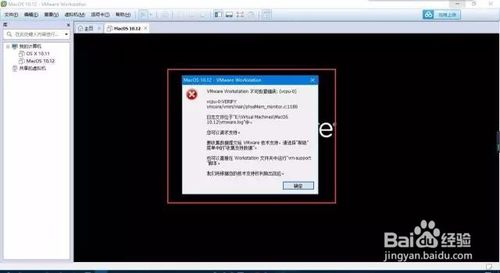](http://jingyan.baidu.com/album/c74d6000b3ca190f6a595d37.html?picindex=17)

   [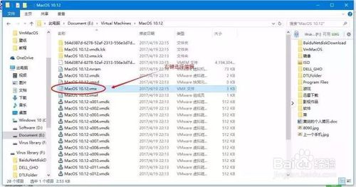](http://jingyan.baidu.com/album/c74d6000b3ca190f6a595d37.html?picindex=18)

   [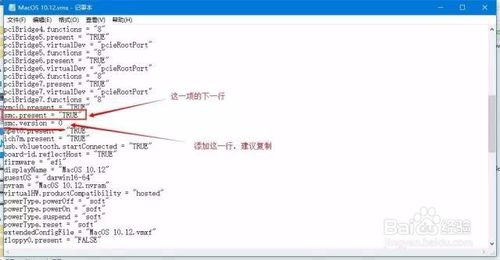](http://jingyan.baidu.com/album/c74d6000b3ca190f6a595d37.html?picindex=19)

   

3. 3

   正式开始MacOS Sierra系统的安装。

   按照下图的步骤一步一步操作就好。

   [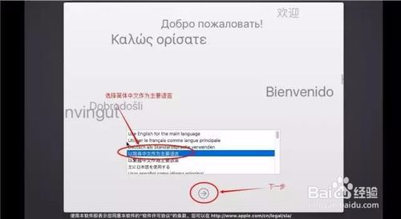](http://jingyan.baidu.com/album/c74d6000b3ca190f6a595d37.html?picindex=21)

   [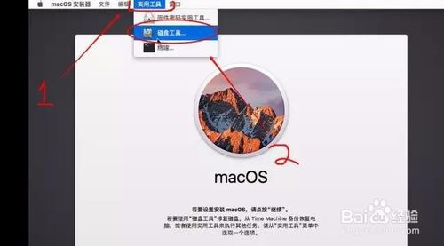](http://jingyan.baidu.com/album/c74d6000b3ca190f6a595d37.html?picindex=22)

   [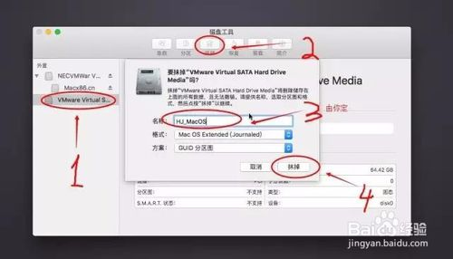](http://jingyan.baidu.com/album/c74d6000b3ca190f6a595d37.html?picindex=23)

   [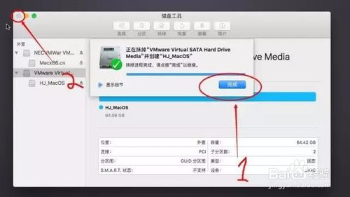](http://jingyan.baidu.com/album/c74d6000b3ca190f6a595d37.html?picindex=24)

   [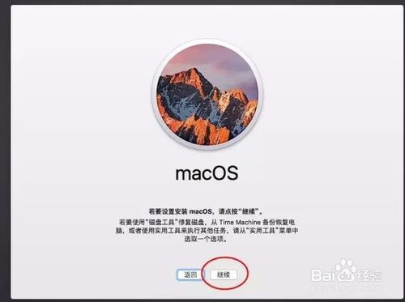](http://jingyan.baidu.com/album/c74d6000b3ca190f6a595d37.html?picindex=25)

   [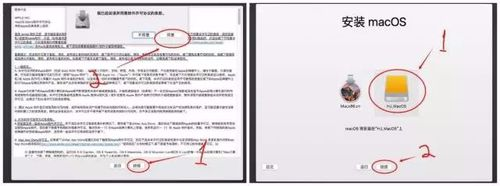](http://jingyan.baidu.com/album/c74d6000b3ca190f6a595d37.html?picindex=26)

   [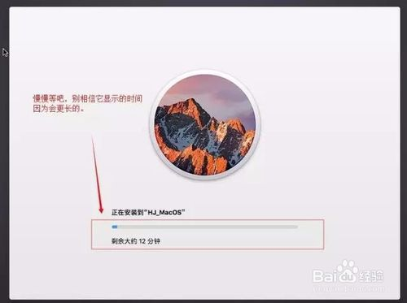](http://jingyan.baidu.com/album/c74d6000b3ca190f6a595d37.html?picindex=27)

4. 4

   安装过程比较漫长，你可以去跑、去跳、去做一个漂亮的倒挂金钩，反正我的固态硬盘也等了大概三十多分钟的样子，去尽情的放纵自己或者发朋友圈吧。

   安装完成后，我们需要一系列的设置，才能正常使用MacOS。

   图二也可以选择不连接互联网，因为你选以太网也不一定能连上，连上了后面还需要输Apple ID，连不上就只需要本地账户。

   图三显示果然连不上，我也很无奈啊，我能怎么办啊。不过别担心，系统做好后，还是可以设置网络的。所以安心创建本地连接吧。

   图四到图七之后，只需等待几秒钟，全新的MacOS Sierra系统出现在了眼前，激动么？

   [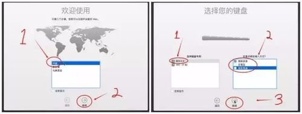](http://jingyan.baidu.com/album/c74d6000b3ca190f6a595d37.html?picindex=28)

   [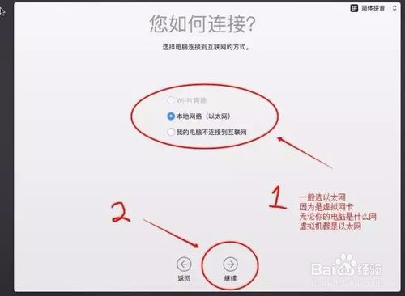](http://jingyan.baidu.com/album/c74d6000b3ca190f6a595d37.html?picindex=29)

   [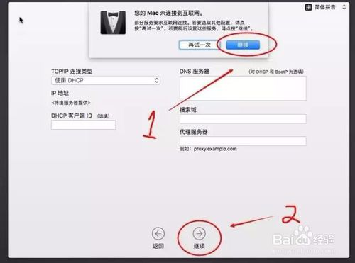](http://jingyan.baidu.com/album/c74d6000b3ca190f6a595d37.html?picindex=30)

   

   [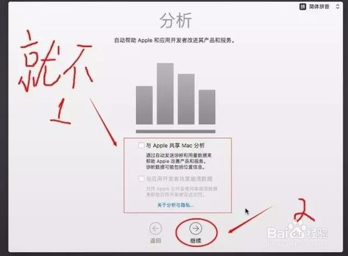](http://jingyan.baidu.com/album/c74d6000b3ca190f6a595d37.html?picindex=32)

   [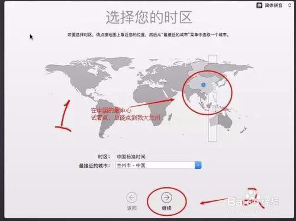](http://jingyan.baidu.com/album/c74d6000b3ca190f6a595d37.html?picindex=33)

   [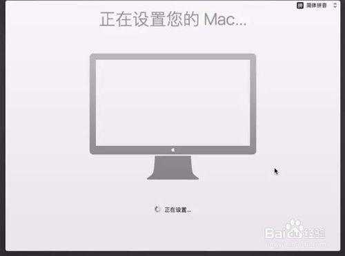](http://jingyan.baidu.com/album/c74d6000b3ca190f6a595d37.html?picindex=34)

5. 5

   接下来就需要安装一个很重要的工具了，Vmware Tools。

   说明：VMware虚拟机中安装VMware Tools，可支持自由拖拽的功能，鼠标也可在虚拟机与主机之前自由移动（不用再按ctrl+alt），且虚拟机屏幕也可实现全屏化和独占，让电脑直接成为Mac电脑。好处多多，总之安装就是了。

   图二双击安装VMware Tools，然后就是继续→安装→输入之前设置的本地账户密码→安装软件→继续安装→安装成功后重新启动。

   

   [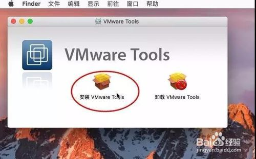](http://jingyan.baidu.com/album/c74d6000b3ca190f6a595d37.html?picindex=36)

   [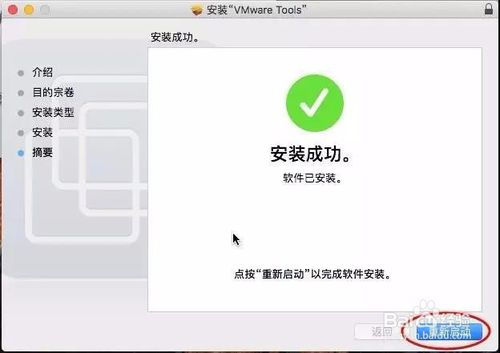](http://jingyan.baidu.com/album/c74d6000b3ca190f6a595d37.html?picindex=37)

6. 6

   到此，完整的虚拟机安装MacOS就完成了。待重启后，输入本地账户密码，就可以体验MacOS了。本期的教程就到这里了，谢谢大家耐心的阅读。

   END

## 哦对了！网络还没连接好！

1. 1

   解决办法：在主机上右键状态栏网络图标→打开网络与共享中心→点击连接后面的，是以太网或是WLAN，点就可以了→属性→共享→允许其他用户通过此计算机的Internet来连接打钩→选择VMware  Network Adapter  VMnet1→下面那一项也打钩→确定。主机设置完了，我们现在来设置虚拟机，进入VM软件→工具栏选择虚拟机→设置→网络适配器→仅主机模式→MacOS系统的设置→网络→以太网自分配的IP→使用DHCP。

   [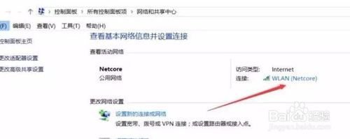](http://jingyan.baidu.com/album/c74d6000b3ca190f6a595d37.html?picindex=38)

   [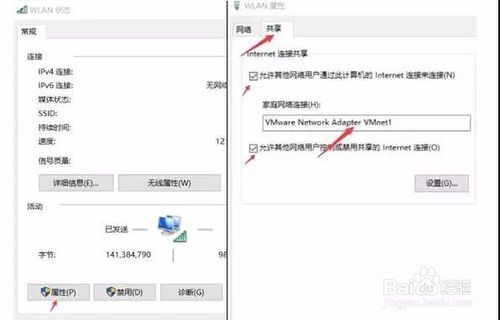](http://jingyan.baidu.com/album/c74d6000b3ca190f6a595d37.html?picindex=39)

   [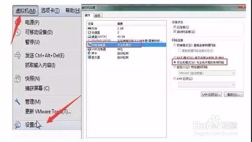](http://jingyan.baidu.com/album/c74d6000b3ca190f6a595d37.html?picindex=40)

   [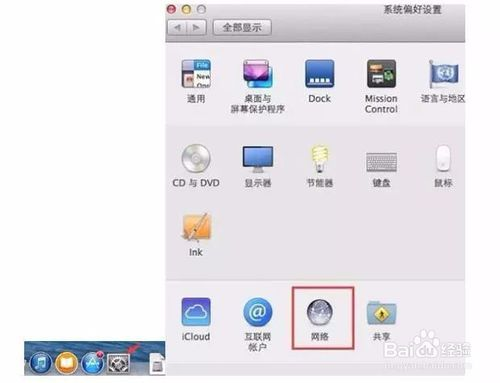](http://jingyan.baidu.com/album/c74d6000b3ca190f6a595d37.html?picindex=41)

   [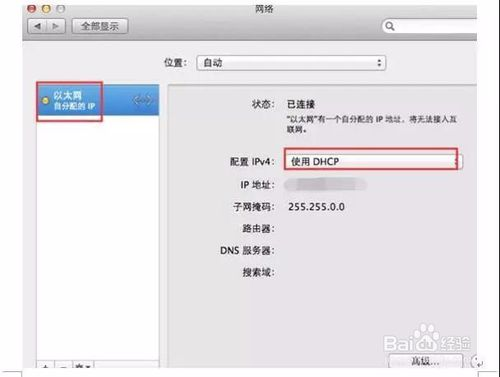](http://jingyan.baidu.com/album/c74d6000b3ca190f6a595d37.html?picindex=42)

2. 2

    这些设置完成后，你的Mac电脑就可以上网了。启用独占模式后，你插入的U盘、光盘都可以在Mac中读取。不过，Mac对NTFS的U盘是只读的。

   OK！Win10虚拟机安装MacOS的教程到这里就结束啦，我们一路过关斩将，解决这么多问题，是不是很有成就感呢？

   最后，记得别忘了给自己注册一个Apple ID 哦！