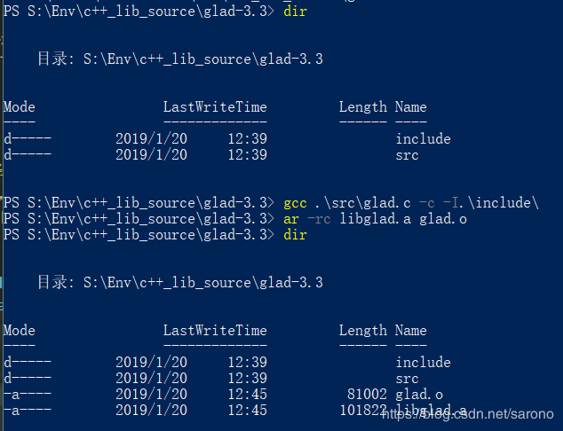
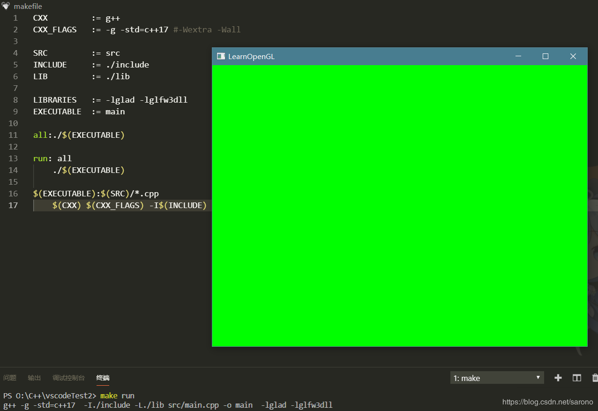

# vscode OpenGL环境搭建


## 一.准备阶段

环境：win10 mingw

1. LearnOpenGL CN的[教程地址](https://learnopengl-cn.github.io/01 Getting started/02 Creating a window/)
2. vscode c++环境。若没有配置好，可以查看这里，[vscode c++环境配置](https://blog.csdn.net/sarono/article/details/85894176)。
3. 点击[这里](https://cmake.org/download/)下载CMake，选择msi版本。

## 二.开始配置

### 1.构建GLFW


官网上的预编译的二进制版本不一定能满足自己电脑的运行环境。点击[这里](https://github.com/glfw/glfw/releases)下载GLFW源代码包，从源代码编译可以保证能在自己的机器上运行。

- 解压源代码，打开CMake。

- 输入 source code 目录，以及 build 目录（自行创建）。

- 点击 Configure，选择 MinGW Makefiles。

  

- 完成后，我们勾选 BUILD_SHARED_LIBS，创建动态库。

  

- 然后点击 Generate。中途没有弹窗报错应该就ok了，这时候 build 目录里会生成一堆文件。

- powershell 或者 cmd 进入到 build 目录，输入make(*有些版本为更名的话叫做 mingw32-make*)，等待编译 100%。

  

- 进入 build 目录中的src，拷贝 **glfw3.dll**、**libglfw3dll.a**。

  

- 库文件有了，那么头文件呢？当然在 source code 目录里啦，拷贝 **include**文件夹。

  ```
    可能遇到的错误：CMake Error: CMake was unable to find a build program corresponding to "MinGW Makefiles".  CMAKE_MAKE_PROGRAM is not set.  You probably need to select a different build tool.
    则需要指定 build tool，我们使用的是mingw，build tool 则是 make.exe。由于配置好了环境变量，我们直接在 CMAKE_MAKE_PROGRAM（勾选Advance 才会出现） 一栏输入 make 就 ok了。
  12
  ```

  

### 2.配置GLAD

点击[这里](https://glad.dav1d.de/)打开 GLAD 在线服务，将language设置为 **C/C++**，在API选项中，选择 **3.3**以上的GL版本(推荐使用3.3吧)。之后将Profile设置为 **Core**，并保证Generate a loader是 **选中**的。现在可以暂时忽略Extensions中的内容。点击Generate生成库文件。

现在GLAD应该给你提供了一个zip压缩包，解压，我们就获得一个 **include**文件夹，里面有两个目录(glad和KHR)，以及一个 src 文件夹，里面有 glad.c 文件。

我们将 **glad.c**编译成一个静态库，这样方便我们使用。

- gcc .\src\glad.c -c -I.\include\
- ar -rc libglad.a glad.o

输入上面两行命令，会得到 glad.o 和 libglad.a 文件，**libglad.a**是我需要的。



### 3.第一个项目

完成上面的步骤后，我们得到了 两个 **include**文件夹，以及**glfw3.dll**、**libglfw3dll.a**和 **libglad.a**文件。
 那么我们开始吧。新建一个vscode c++项目(使用C/C++ Project Generator插能快速帮助创建基本项目结构)，创建include、lib、src文件夹。项目结构如下图。


然后我们编写makefile。makefile需要严格按照格式，最好不要有多余的换行、多余的空格。若还是提示makefile格式出错，请参照C/C++ Project Generator插件。

```
CXX		:= g++
CXX_FLAGS       := -g -std=c++17 #-Wextra -Wall

SRC		:= src
INCLUDE         := ./include
LIB		:= ./lib

LIBRARIES	:= -lglad -lglfw3dll
EXECUTABLE	:= main

all:./$(EXECUTABLE)

run: all
    ./$(EXECUTABLE)

$(EXECUTABLE):$(SRC)/*.cpp
    $(CXX) $(CXX_FLAGS) -I$(INCLUDE) -L$(LIB) $^ -o $@ $(LIBRARIES)
1234567891011121314151617
```

接着我们拷贝以下代码到main.cpp，测试环境的正确性。

```
    #include <glad/glad.h>
    #include <GLFW/glfw3.h>
    #include <iostream>
    // settings
    const unsigned int SCR_WIDTH = 800;
    const unsigned int SCR_HEIGHT = 600;
    int main()
    {
        // glfw: initialize and configure
        // ------------------------------
        glfwInit();
        glfwWindowHint(GLFW_CONTEXT_VERSION_MAJOR, 3);
        glfwWindowHint(GLFW_CONTEXT_VERSION_MINOR, 3);
        glfwWindowHint(GLFW_OPENGL_PROFILE, GLFW_OPENGL_CORE_PROFILE);
    #ifdef __APPLE__
        glfwWindowHint(GLFW_OPENGL_FORWARD_COMPAT, GL_TRUE); //uncomment this statement to fix compilation on OS X
    #endif
        // glfw window creation
        // --------------------
        GLFWwindow *window = glfwCreateWindow(SCR_WIDTH, SCR_HEIGHT,"LearnOpenGL", NULL, NULL);
        if (window == NULL)
        {
            std::cout << "Failed to create GLFW window" << std::endl;
            glfwTerminate();
            return -1;
        }
        glfwMakeContextCurrent(window);
        // glad: load all OpenGL function pointers
        // ---------------------------------------
        if (!gladLoadGLLoader((GLADloadproc)glfwGetProcAddress))
        {
            std::cout << "Failed to initialize GLAD" << std::endl;
            return -1;
        }
        // render loop
        // -----------
        while (!glfwWindowShouldClose(window))
        {
            glClearColor(0.0f, 1.f, 0.0f,1.0f);
            glClear(GL_COLOR_BUFFER_BIT);
            // glfw: swap buffers and poll IO events (keyspressed/released, mouse moved etc.)
            // ---------------------------------------------------
            glfwSwapBuffers(window);
            glfwPollEvents();
        }
        // glfw: terminate, clearing all previously allocated GLFWresources.
        //---------------------------------------------------------------
        glfwTerminate();
        return 0;
    }12345678910111213141516171819202122232425262728293031323334353637383940414243444546474849
```

最后，我们在vscode的终端，输入make run。一个绿色的框框便出现在我们眼前。



**glad.c** 不编译成静态库直接使用也是可行的，在 **生成exe**的时候需要加上 glad.c 一同编译，否则会出现 **undefined reference**错误。

```
g++ -g -std=c++17  -I./include -L./lib src/main.cpp src/glad.c -o main  -lglfw3dll
1
```

细心的童鞋就发现了，C/C++ tool会报绿字warning，由于头文件无法找到。我们将项目里include的路径复制到 **c_cpp_properties.json**的includePath里去就ok啦。就像这样 *“${workspaceFolder}/include”*。完成后，就能智能提示头文件啦。

## 三.总结

以上就是整个vscode OpenGL环境搭建过程，学了一下GNU的一些命令，库的编译和链接。后面使用其他的库，也是相似的过程。vs有Nuget包可以直接使用，无需这些配置(小声bb)， **祝大家学习愉快！**


# VSCode 搭建 opengl(glad+glfw) 环境

glad,glfw 的下载、编译教程网上资料很多了，不赘述。主要贴一下 VSCode 的配置，以及个人搭建环境中遇到的一些问题。
 首先主要的搭建流程是按照这篇教程来的：[https://blog.csdn.net/sarono/article/details/86564726](https://links.jianshu.com/go?to=https%3A%2F%2Fblog.csdn.net%2Fsarono%2Farticle%2Fdetails%2F86564726)

# 两个配置

## c_cpp_properties.json

```json
{
    "configurations": [
        {
            // 这里似乎是配置 C++的标准库 include path，因为我工程里 include/glad/glad.h 就没有生效
            "includePath": [  
                "${workspaceFolder}",
                "${workspaceFolder}/include",
                "C:/LLVM/include",
                "C:/LLVM/lib/gcc/x86_64-w64-mingw32/8.1.0/include"
            ],
  // 其他配置掠过
}
```


```json
{
    "tasks": [
        {
            "label": "g++ build",
            "type": "shell",
            "command": "g++",    // gcc编译c, g++编译c++
            "args": [  // 下面的参数其实就是 gcc 的参数，具体可查 gcc 命令手册
                "-I${workspaceFolder}/include",  // 添加编译时需要 include 到的文件路径
                "-L${workspaceFolder}/lib",         // 添加编译时需要 link 的库文件路径
                "-lglad",     // 添加编译时需要 link 的库文件，注意原文件名为 libglad.a 去掉 lib前缀和.a后缀，再加上 -l 即得到该参数
                "-lglfw3dll",// 同上，添加 link 文件 libglfw3dll.a
                "-g",           //debug
                "${file}",     //需要编译的文件
                "${workspaceFolder}\\glad.c",      // 不知道为啥， libglad.a 似乎没有链接到，编译时总是提示 gladxxx undefined ... ，所以只好把 glad.c 放进来和源文件一起编译
                "${workspaceFolder}\\glfw3.dll",   // dll 库文件也要和源文件一起编译
                "-o",                       //输出
                "${workspaceFolder}\\main.exe"  //输出程序的绝对路径，注意 launch文件中的 "program": "${fileDirname}\\main.exe"路径要与此路径对应，否则无法调试
            ],    
      }
       // 其他配置略过
    ]
    // 其他配置略过
}
```

# 遇到的问题

## glad

glad make 报错 ：找不到命令 C:\Program。其实是 LLVM 安装路径不能有空格，把 LLVM 直接装到 C 盘下就好

## 编译 opengl

1. glad/glad.h 找不到： tasks 里 g++ 命令参数配置 glad 所在路径 "-I${workspaceFolder}/include"
2. gladXXXX undefined： 不知道为啥， libglad.a 似乎没有链接到，所以只好把 glad.c 放进来和源文件一起编译


作者：ArcherLew
链接：https://www.jianshu.com/p/e9adbc0416eb
来源：简书
著作权归作者所有。商业转载请联系作者获得授权，非商业转载请注明出处。